Preparation of MetaPhlAn dataset and transformation of data
================

  - [Load in the packages and path to
    folder:](#load-in-the-packages-and-path-to-folder)
  - [Transform MetaPhlAn output into a phloseq
    object](#transform-metaphlan-output-into-a-phloseq-object)
  - [Quality control based on read
    depth](#quality-control-based-on-read-depth)
  - [Inspection of data using stacked
    barplots](#inspection-of-data-using-stacked-barplots)
  - [Calculation of alpha diversity](#calculation-of-alpha-diversity)
  - [Calculation of beta diversity](#calculation-of-beta-diversity)
  - [Prefiltering of dataframe for single species
    analyses](#prefiltering-of-dataframe-for-single-species-analyses)

# Load in the packages and path to folder:

``` r
library(tidyverse)
library(phyloseq)
library(vegan)
library(zCompositions)
library(rgr)
library(NBZIMM)
path = "C:/Users/Tom/Documents/10. semester/V1/data/"
```

# Transform MetaPhlAn output into a phloseq object

Function for transforming MetaPhlAn output into a phyloseq object:

``` r
metaphlanToPhyloseq <- function(
  tax,
  metadat=NULL,
  simplenames=TRUE,
  roundtointeger=FALSE,
  split="|"){
  ## tax is a matrix or data.frame with the table of taxonomic abundances, rows are taxa, columns are samples
  ## metadat is an optional data.frame of specimen metadata, rows are samples, columns are variables
  ## if simplenames=TRUE, use only the most detailed level of taxa names in the final object
  ## if roundtointeger=TRUE, values will be rounded to the nearest integer
  xnames = rownames(tax)
  shortnames = gsub(paste0(".+\\", split), "", xnames)
  if(simplenames){
    rownames(tax) = shortnames
  }
  if(roundtointeger){
    tax = round(tax * 1e4)
  }
  x2 = strsplit(xnames, split=split, fixed=TRUE)
  taxmat = matrix(NA, ncol=max(sapply(x2, length)), nrow=length(x2))
  colnames(taxmat) = c("Kingdom", "Phylum", "Class", "Order", "Family", "Genus", "Species", "Strain")[1:ncol(taxmat)]
  rownames(taxmat) = rownames(tax)
  for (i in 1:nrow(taxmat)){
    taxmat[i, 1:length(x2[[i]])] <- x2[[i]]
  }
  taxmat = gsub("[a-z]__", "", taxmat)
  taxmat = phyloseq::tax_table(taxmat)
  otutab = phyloseq::otu_table(tax, taxa_are_rows=TRUE)
  if(is.null(metadat)){
    res = phyloseq::phyloseq(taxmat, otutab)
  }else{
    res = phyloseq::phyloseq(taxmat, otutab, phyloseq::sample_data(metadat))
  }
  return(res)
}
```

Read in the metadata:

``` r
meta <-  read_delim(file = paste0(path, "metadata/Tilpasset_metadata.txt"), col_names = T, delim= "\t")
meta <- as_tibble(meta)
```

``` r
dim(meta)
```

    ## [1] 217  79

``` r
#Calculate BMI
meta <- meta %>% mutate(BMI = weight/(height/100)^2)

#Make column with categorical clinical disease score
meta <- meta %>% mutate(score_p = ifelse(pucai_current < 10, "remission", ifelse(pucai_current <= 34, "mild", ifelse(pucai_current<=64, "moderate", ifelse(pucai_current>64, "severe", "NA")))))

meta <- meta %>% mutate(score_s = ifelse(sccai_current<3, "remission", ifelse(sccai_current<=5, "mild", ifelse(sccai_current<=11, "moderate", ifelse(sccai_current>11, "severe", "NA")))))

meta <- meta %>% mutate(score = ifelse(is.na(score_p), score_s, ifelse(is.na(score_s), score_p, "NA")))

#Make discrete numeric disease score:
meta$score_num <- ifelse(meta$score =="remission", 1, ifelse(meta$score=="mild", 2, ifelse(meta$score=="moderate",3, 4)))

#Make binary disease scores:
meta$score <- factor(meta$score, levels = c("remission", "mild", "moderate", "severe"))
meta$score_binary <- as.factor(ifelse(meta$score == "remission", 0, 1))

meta$fcal_binary <- as.factor(ifelse(meta$f_cal_current < 250, 0, 1))

#Make merged treatment column for 5-ASA and prednisolone:
meta$pred_total <- ifelse(meta$pred==1 | meta$l_pred ==1, 1, 0)
meta$asa_total <- ifelse(meta$asa==1 | meta$l_asa ==1, 1, 0)
```

``` r
#Read in the total read depth and add to meta data:
qc_stats <-  read_delim(file = paste0(path, "../analysis/summary_stats_of_QC.txt"), col_names = T, delim= "\t")
qc_stats$rdepth <- as.numeric(gsub(",", "", qc_stats$clean_R1))*2
qc_stats <- qc_stats %>% dplyr::select(J_ID, rdepth)
meta <- merge(meta, qc_stats, by.x="J_ID", by.y="J_ID")

#Save meta data:
write.table(meta, paste0(path, "metadata/", "preped_metadata.txt"), row.names = F, sep="\t")

#Prepare for phyloseq
meta <- as.data.frame(meta)
rownames(meta) = meta$J_ID
```

Investigate summary statistics of meta data:

``` r
meta_total <- read.table(paste0(path, "metadata/", "metadata_excel_new.txt"), sep="\t", header = T)
meta_total$BMI <-  meta_total$weight/(meta_total$height/100)^2

#Total number of patients:
dim(meta_total)
```

    ## [1]  60 149

``` r
#Total number of children and adults
adults <- meta_total %>% filter(age_gr == 2)
children <- meta_total %>% filter(age_gr == 1)
dim(adults)
```

    ## [1]  30 149

``` r
dim(children)
```

    ## [1]  30 149

``` r
#Split by gender:
dim(children %>% filter(sex==0))
```

    ## [1]  19 149

``` r
dim(children %>% filter(sex==1))
```

    ## [1]  11 149

``` r
dim(adults %>% filter(sex==0))
```

    ## [1]  17 149

``` r
dim(adults %>% filter(sex==1))
```

    ## [1]  13 149

``` r
#Study group:
dim(children %>% filter(study_gr==1))
```

    ## [1]  15 149

``` r
dim(children %>% filter(study_gr==2))
```

    ## [1]  15 149

``` r
dim(adults %>% filter(study_gr==1))
```

    ## [1]  15 149

``` r
dim(adults %>% filter(study_gr==2))
```

    ## [1]  15 149

``` r
#BMI:
summary(children$BMI)
```

    ##    Min. 1st Qu.  Median    Mean 3rd Qu.    Max. 
    ##   11.73   16.53   19.38   19.54   22.04   29.30

``` r
summary(adults$BMI)
```

    ##    Min. 1st Qu.  Median    Mean 3rd Qu.    Max.    NA's 
    ##   17.65   20.65   22.58   23.74   25.83   36.17       1

``` r
#Treatment before baseline:
dim(children %>% filter(asa_0 == 1))
```

    ## [1]  13 149

``` r
dim(adults %>% filter(asa_0 == 1))
```

    ## [1]  14 149

``` r
dim(children %>% filter(pred_0 == 1))
```

    ## [1]   2 149

``` r
dim(adults %>% filter(pred_0 == 1))
```

    ## [1]   3 149

``` r
dim(children %>% filter(aza_0 == 1))
```

    ## [1]   7 149

``` r
dim(adults %>% filter(aza_0 == 1))
```

    ## [1]   4 149

``` r
dim(children %>% filter(bio_0 == 1))
```

    ## [1]   6 149

``` r
dim(adults %>% filter(bio_0 == 1))
```

    ## [1]   1 149

``` r
dim(children %>% filter(l_asa_0 == 1))
```

    ## [1]   3 149

``` r
dim(adults %>% filter(l_asa_0 == 1))
```

    ## [1]  12 149

``` r
dim(children %>% filter(l_pred_0 == 1))
```

    ## [1]   1 149

``` r
dim(adults %>% filter(l_pred_0 == 1))
```

    ## [1]   1 149

``` r
dim(children %>% filter(asa_0 ==0 &pred_0 == 0 &aza_0 == 0 &bio_0 == 0 &l_asa_0 == 0 & l_pred_0 == 0))
```

    ## [1]  14 149

``` r
dim(adults %>% filter(asa_0 ==0 &pred_0 == 0 &aza_0 == 0 &bio_0 == 0 &l_asa_0 == 0 & l_pred_0 == 0))
```

    ## [1]  10 149

Read in the MetaPhlan count data and transform it into phyloseq object:

``` r
#Count data
bug_count <- read.csv(paste0(path, "humann3_processed_output/Joined_tables/", "Joined_metaphlan_bugs_list_counts.tsv"), sep = "\t", strip.white = T, stringsAsFactors = F, row.names = 1)

#Change J-ID
colnames(bug_count) <- substr(colnames(bug_count), start = 1, stop = 6)

#Subtract species level to include in phyloseq
level.letter = 's'
species_count = as.data.frame(matrix(nrow=0, ncol=ncol(bug_count)))

colnames(species_count) <- colnames(bug_count)
  
mph.names = rownames(bug_count)
    
for (i in 1:length(mph.names)){
    A = unlist(strsplit(mph.names[i], "|", fixed=TRUE))
    mph.genera.full = A[length(A)]
    B = unlist(strsplit(A[length(A)], "_", fixed=TRUE))
    if (B[1] == level.letter){
      #print(mph.names[i])
      species_count[mph.names[i],] = bug_count[mph.names[i],]
      }
    }

#Change setup of table
ps_count <- metaphlanToPhyloseq(species_count, metadat=meta)
otu_table(ps_count)[1:5,10:14]
```

    ## OTU Table:          [5 taxa and 5 samples]
    ##                      taxa are rows
    ##                                                  J28347 J28348 J28349 J28350
    ## s__Methanobrevibacter_smithii                     29877  27404  15997      0
    ## s__Methanosphaera_stadtmanae                          0      0      0      0
    ## s__Candidatus_Methanomassiliicoccus_intestinalis      0      0      0      0
    ## s__Actinobaculum_sp_oral_taxon_183                    0      0      0      0
    ## s__Actinomyces_graevenitzii                           0      0      0      0
    ##                                                  J28351
    ## s__Methanobrevibacter_smithii                         0
    ## s__Methanosphaera_stadtmanae                          0
    ## s__Candidatus_Methanomassiliicoccus_intestinalis      0
    ## s__Actinobaculum_sp_oral_taxon_183                    0
    ## s__Actinomyces_graevenitzii                           0

``` r
tax_table(ps_count)[1:2,]
```

    ## Taxonomy Table:     [2 taxa by 7 taxonomic ranks]:
    ##                               Kingdom   Phylum          Class            
    ## s__Methanobrevibacter_smithii "Archaea" "Euryarchaeota" "Methanobacteria"
    ## s__Methanosphaera_stadtmanae  "Archaea" "Euryarchaeota" "Methanobacteria"
    ##                               Order                Family               
    ## s__Methanobrevibacter_smithii "Methanobacteriales" "Methanobacteriaceae"
    ## s__Methanosphaera_stadtmanae  "Methanobacteriales" "Methanobacteriaceae"
    ##                               Genus                Species                     
    ## s__Methanobrevibacter_smithii "Methanobrevibacter" "Methanobrevibacter_smithii"
    ## s__Methanosphaera_stadtmanae  "Methanosphaera"     "Methanosphaera_stadtmanae"

``` r
ps_count #208 samples, 550 taxa
```

    ## phyloseq-class experiment-level object
    ## otu_table()   OTU Table:         [ 550 taxa and 208 samples ]
    ## sample_data() Sample Data:       [ 208 samples by 89 sample variables ]
    ## tax_table()   Taxonomy Table:    [ 550 taxa by 7 taxonomic ranks ]

``` r
#Save phyloseq object
saveRDS(ps_count, paste0(path, "humann3_processed_output/Phyloseq/","ps_count.rds"))
```

Read in relative abundance MetaPhlan data and transform it into phyloseq
object, like what was done with the count data:

``` r
#Relative abundance data
bug_relab <- read.csv(paste0(path, "humann3_processed_output/Joined_tables/", "Joined_metaphlan_bugs_list_relab.tsv"), sep = "\t", strip.white = T, stringsAsFactors = F, row.names = 1) 

#Change J-ID and save UNKNOWN abundance
colnames(bug_relab) <- substr(colnames(bug_relab), start = 1, stop = 6)
relab_unknown <- bug_relab[1,]

#Subtract species level to include in phyloseq
level.letter = 's'
species_relab = as.data.frame(matrix(nrow=0, ncol=ncol(bug_relab)))
colnames(species_relab) <- colnames(bug_relab)
    
mph.names = rownames(bug_relab)
for (i in 1:length(mph.names)){
    A = unlist(strsplit(mph.names[i], "|", fixed=TRUE))
    mph.genera.full = A[length(A)]
    B = unlist(strsplit(A[length(A)], "_", fixed=TRUE))
    if (B[1] == level.letter){
      #print(mph.names[i])
      species_relab[mph.names[i],] = bug_relab[mph.names[i],]
    }
  }
dim(species_relab)
```

    ## [1] 550 209

``` r
#This does not summarise to 100, because unmapped are subtracted from the data frame:
colSums(species_relab)[1:10]
```

    ##   J28338   J28339   J28340   J28341   J28342   J28343   J28344   J28345 
    ## 40.53076 48.54359 55.35308 46.29633 52.52363 51.57271 52.63849 56.66316 
    ##   J28346   J28347 
    ## 59.29688 34.29284

``` r
#Change setup of table
ps_relab <- metaphlanToPhyloseq(species_relab, metadat = meta)
otu_table(ps_relab)[1:5,10:14]
```

    ## OTU Table:          [5 taxa and 5 samples]
    ##                      taxa are rows
    ##                                                   J28347  J28348 J28349 J28350
    ## s__Methanobrevibacter_smithii                    0.70391 0.43444 0.1642      0
    ## s__Methanosphaera_stadtmanae                     0.00000 0.00000 0.0000      0
    ## s__Candidatus_Methanomassiliicoccus_intestinalis 0.00000 0.00000 0.0000      0
    ## s__Actinobaculum_sp_oral_taxon_183               0.00000 0.00000 0.0000      0
    ## s__Actinomyces_graevenitzii                      0.00000 0.00000 0.0000      0
    ##                                                  J28351
    ## s__Methanobrevibacter_smithii                         0
    ## s__Methanosphaera_stadtmanae                          0
    ## s__Candidatus_Methanomassiliicoccus_intestinalis      0
    ## s__Actinobaculum_sp_oral_taxon_183                    0
    ## s__Actinomyces_graevenitzii                           0

``` r
tax_table(ps_relab)[1:2,]
```

    ## Taxonomy Table:     [2 taxa by 7 taxonomic ranks]:
    ##                               Kingdom   Phylum          Class            
    ## s__Methanobrevibacter_smithii "Archaea" "Euryarchaeota" "Methanobacteria"
    ## s__Methanosphaera_stadtmanae  "Archaea" "Euryarchaeota" "Methanobacteria"
    ##                               Order                Family               
    ## s__Methanobrevibacter_smithii "Methanobacteriales" "Methanobacteriaceae"
    ## s__Methanosphaera_stadtmanae  "Methanobacteriales" "Methanobacteriaceae"
    ##                               Genus                Species                     
    ## s__Methanobrevibacter_smithii "Methanobrevibacter" "Methanobrevibacter_smithii"
    ## s__Methanosphaera_stadtmanae  "Methanosphaera"     "Methanosphaera_stadtmanae"

``` r
ps_relab #208 samples, 550 taxa
```

    ## phyloseq-class experiment-level object
    ## otu_table()   OTU Table:         [ 550 taxa and 208 samples ]
    ## sample_data() Sample Data:       [ 208 samples by 89 sample variables ]
    ## tax_table()   Taxonomy Table:    [ 550 taxa by 7 taxonomic ranks ]

``` r
#Save phyloseq object
saveRDS(ps_relab, paste0(path, "humann3_processed_output/Phyloseq/","ps_relab.rds"))
```

# Quality control based on read depth

Remove samples, if the have a read depth below 10,000 reads:

``` r
#Histogram of sequencing depth
ggplot()+
  geom_histogram(mapping=aes(sample_sums(ps_count)), fill = "lightskyblue1", color="black", bins = 100)+
  theme_classic()+xlab("Read depth")+ylab("Count")+
  geom_vline(xintercept = 10000, linetype = "dashed")
```

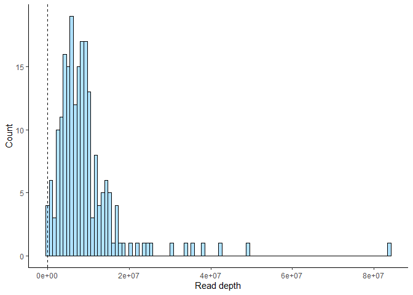<!-- -->

``` r
min(sample_sums(ps_count))
```

    ## [1] 1059

``` r
#Remove sample with read depth below 10,000:
ps_sub = prune_samples(sample_sums(ps_count)>=10000, ps_count)
ps_sub #207 samples - one was removed
```

    ## phyloseq-class experiment-level object
    ## otu_table()   OTU Table:         [ 550 taxa and 207 samples ]
    ## sample_data() Sample Data:       [ 207 samples by 89 sample variables ]
    ## tax_table()   Taxonomy Table:    [ 550 taxa by 7 taxonomic ranks ]

``` r
saveRDS(ps_sub, paste0(path, "humann3_processed_output/Phyloseq/","ps_count_filtered.rds"))

#Which sample was removed? It should also be removed in the dataset with relative abundance:
removed <- setdiff(sample_names(ps_count), sample_names((ps_sub)))
removed #J28550
```

    ## [1] "J28550"

``` r
ps_relab_sub <- subset_samples(ps_relab, !(J_ID %in% removed))
ps_relab_sub #207 samples and 550 taxa
```

    ## phyloseq-class experiment-level object
    ## otu_table()   OTU Table:         [ 550 taxa and 207 samples ]
    ## sample_data() Sample Data:       [ 207 samples by 89 sample variables ]
    ## tax_table()   Taxonomy Table:    [ 550 taxa by 7 taxonomic ranks ]

``` r
saveRDS(ps_relab_sub,paste0(path, "humann3_processed_output/Phyloseq/","ps_relab_filtered.rds"))
```

``` r
meta$age_gr1 <- ifelse(meta$age_gr==1, "Children", "Adults")
meta$age_gr1 <- factor(meta$age_gr1, levels=c("Children", "Adults"))
ggplot(data=meta, aes(x=as.factor(time_point), fill=age_gr1))+
  geom_bar(position = "stack")+theme_classic()+xlab("Time point")+ylab("Samples")+labs(fill="Age group")
```

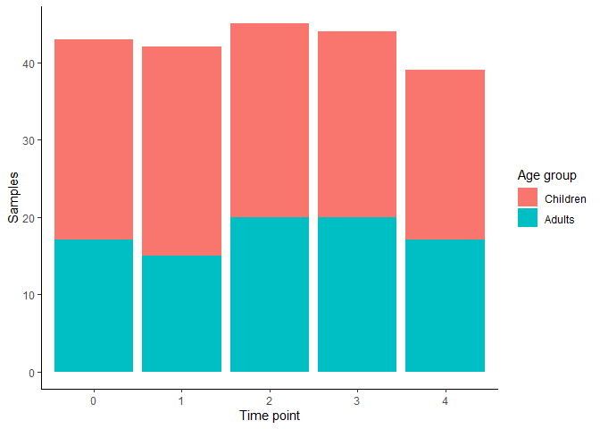<!-- -->

``` r
ggplot(data=meta, aes(x=as.factor(time_point)))+
  geom_bar(position = "stack")+theme_classic()+xlab("Time point")+ylab("Samples")+labs(fill="Age group")
```

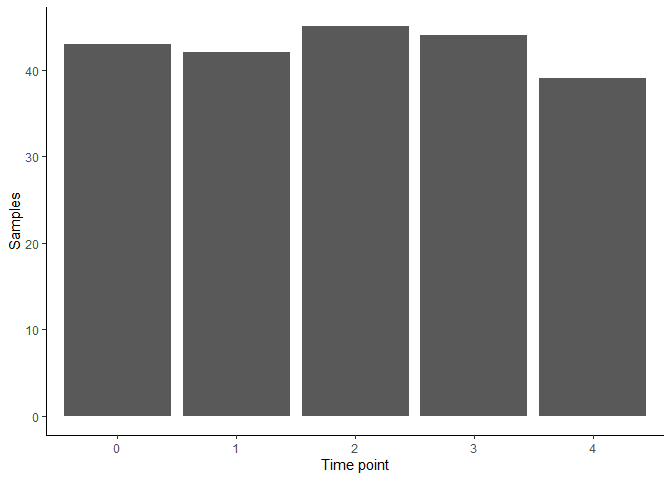<!-- -->

# Inspection of data using stacked barplots

Make stacked barplots to inspect the data. Normally, the abundance in
the plots will summarise to 100. But in this setup, I have not excluded
the propotion of unmapped reads. Therefore, the stacked bar plots look
different than usual.

``` r
ps_relab <- readRDS(paste0(path, "humann3_processed_output/Phyloseq/", "ps_relab_filtered.rds"))

#Based on Kingdom (bacteria/eukaryote/archae)
temp_1 <- ps_relab %>% tax_glom(taxrank = "Kingdom") %>% psmelt()

ggplot(temp_1)+
  geom_bar(aes(x=Sample, y= Abundance, fill = Kingdom), stat = "identity", position = "stack")+
  xlab("Participants")+theme_classic()+ theme(axis.text.x=element_blank())
```

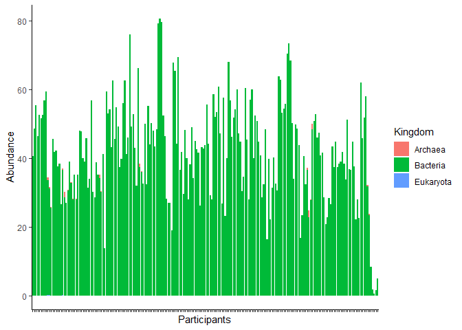<!-- -->

``` r
#Based on Phylum
tax_level <- "Phylum"
temp <- ps_relab %>% tax_glom(taxrank = tax_level) %>% psmelt() %>% filter(Abundance > 2)

ggplot(temp)+
  geom_bar(aes(x=Sample, y= Abundance, fill = Phylum), stat = "identity", position = "stack")+
  xlab("Participants")+theme_classic()+ theme(axis.text.x=element_blank())
```

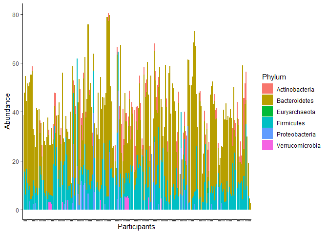<!-- -->

``` r
#Divided into sex:
ggplot(temp)+
  geom_bar(aes(x=Sample, y= Abundance, fill = Phylum), stat = "identity", position = "stack")+
  xlab("Participants")+theme_classic()+ theme(axis.text.x=element_blank())+facet_wrap(~sex, scales="free_x")
```

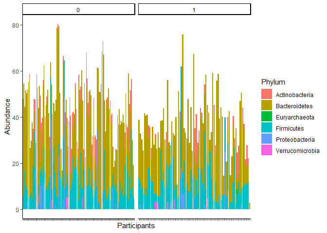<!-- -->

``` r
#Divided by age group:
ggplot(temp)+
  geom_bar(aes(x=Sample, y= Abundance, fill = Phylum), stat = "identity", position = "stack")+
  xlab("Participants")+theme_classic()+ theme(axis.text.x=element_blank())+facet_wrap(~age_gr, scales="free_x")
```

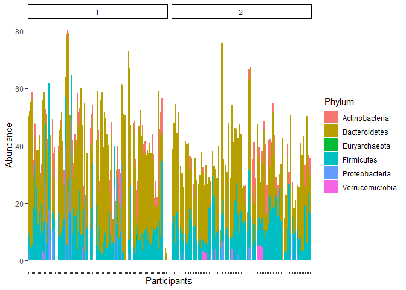<!-- -->

``` r
#Based on Class:
temp <- ps_relab %>% tax_glom(taxrank = "Class") %>% psmelt() %>% filter(Abundance > 2)

#Divided into sex:
ggplot(temp)+
  geom_bar(aes(x=Sample, y= Abundance, fill = Class), stat = "identity", position = "stack")+
  xlab("Participants")+theme_classic()+ theme(axis.text.x=element_blank())+facet_wrap(~sex, scales="free_x")
```

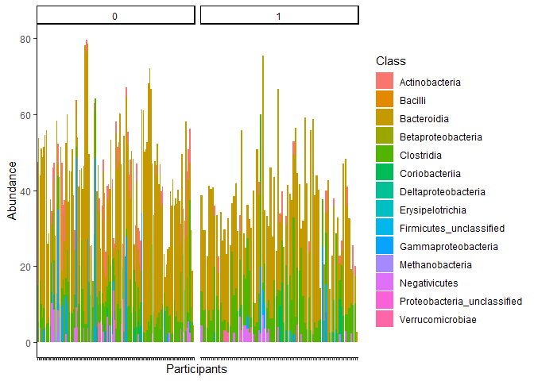<!-- -->

``` r
#Divided by age group:
ggplot(temp)+
  geom_bar(aes(x=Sample, y= Abundance, fill = Class), stat = "identity", position = "stack")+
  xlab("Participants")+theme_classic()+ theme(axis.text.x=element_blank())+facet_wrap(~age_gr, scales="free_x")
```

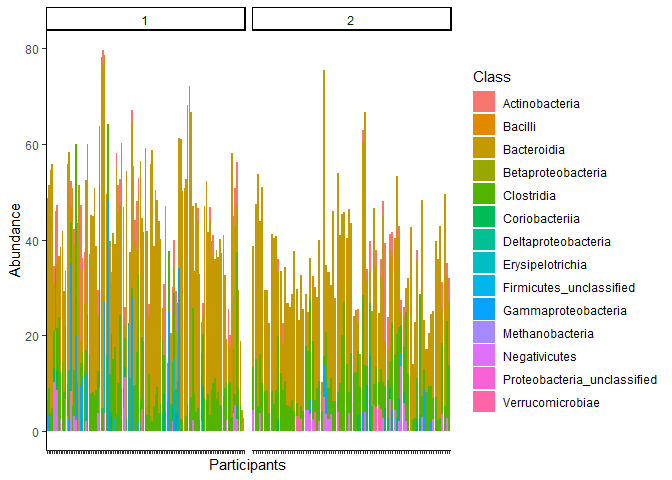<!-- -->

``` r
#Based on Order:
temp <- ps_relab %>% tax_glom(taxrank = "Order") %>% psmelt() %>% filter(Abundance > 2)
#Divided into sex:
ggplot(temp)+
  geom_bar(aes(x=Sample, y= Abundance, fill = Order), stat = "identity", position = "stack")+
  xlab("Participants")+theme_classic()+ theme(axis.text.x=element_blank())+facet_wrap(~sex, scales="free_x")
```

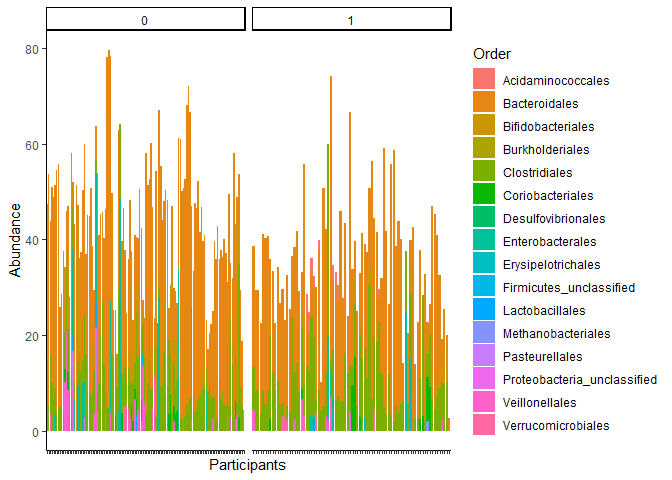<!-- -->

``` r
#Divided by age group:
ggplot(temp)+
  geom_bar(aes(x=Sample, y= Abundance, fill = Order), stat = "identity", position = "stack")+
  xlab("Participants")+theme_classic()+ theme(axis.text.x=element_blank())+facet_wrap(~age_gr, scales="free_x")
```

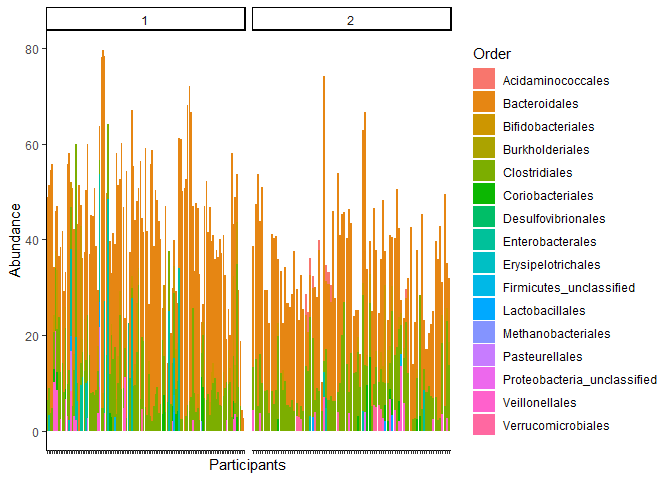<!-- -->

``` r
#Based on Family:
temp <- ps_relab %>% tax_glom(taxrank = "Family") %>% psmelt() %>% filter(Abundance > 2)
#Divided into sex:
ggplot(temp)+
  geom_bar(aes(x=Sample, y= Abundance, fill = Family), stat = "identity", position = "stack")+
  xlab("Participants")+theme_classic()+ theme(axis.text.x=element_blank())+facet_wrap(~sex, scales="free_x")
```

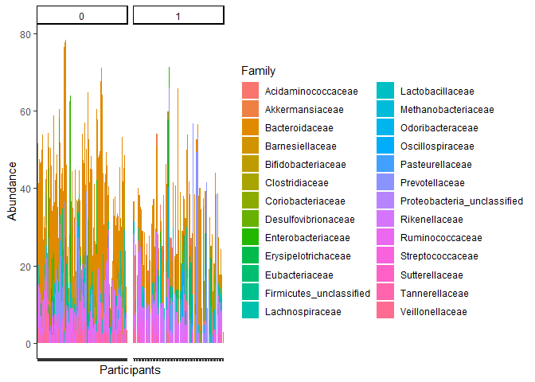<!-- -->

``` r
#Divided by age group:
ggplot(temp)+
  geom_bar(aes(x=Sample, y= Abundance, fill = Family), stat = "identity", position = "stack")+
  xlab("Participants")+theme_classic()+ theme(axis.text.x=element_blank())+facet_wrap(~age_gr, scales="free_x")
```

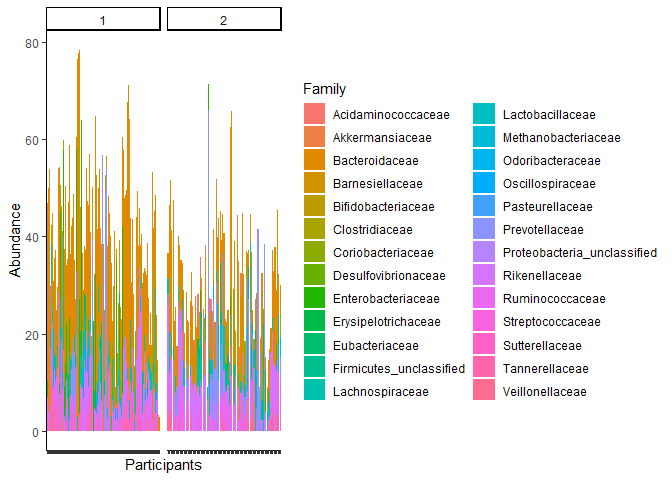<!-- -->

For Genus and Species plots, the legend is not shown, is it would be too
large:

``` r
#Based on Genus:
temp <- ps_relab %>% tax_glom(taxrank = "Genus") %>% psmelt() %>% filter(Abundance > 2)
#Divided into sex:
ggplot(temp)+
  geom_bar(aes(x=Sample, y= Abundance, fill = Genus), stat = "identity", position = "stack")+
  xlab("Participants")+theme_classic()+ theme(axis.text.x=element_blank())+facet_wrap(~sex, scales="free_x")+theme(legend.position = "none")
```

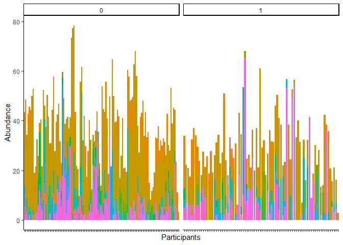<!-- -->

``` r
#Divided by age group:
ggplot(temp)+
  geom_bar(aes(x=Sample, y= Abundance, fill = Genus), stat = "identity", position = "stack")+
  xlab("Participants")+theme_classic()+ theme(axis.text.x=element_blank())+facet_wrap(~age_gr, scales="free_x")+theme(legend.position = "none")
```

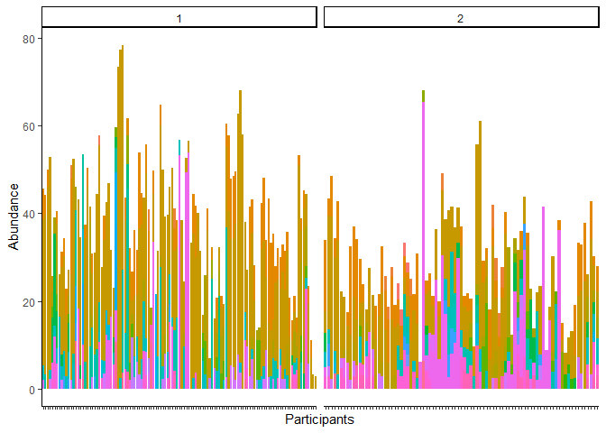<!-- -->

``` r
#Based on Species:
temp <- ps_relab %>% tax_glom(taxrank = "Species") %>% psmelt() %>% filter(Abundance > 2)
#Divided into sex:
ggplot(temp)+
  geom_bar(aes(x=Sample, y= Abundance, fill = Species), stat = "identity", position = "stack")+
  xlab("Participants")+theme_classic()+ theme(axis.text.x=element_blank())+facet_wrap(~sex, scales="free_x")+theme(legend.position = "none")
```

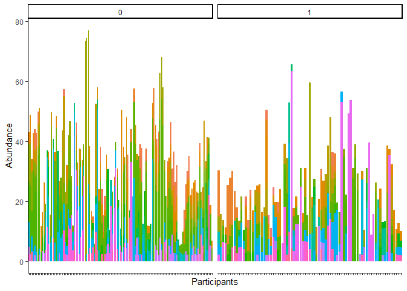<!-- -->

``` r
#Divided by age group:
ggplot(temp)+
  geom_bar(aes(x=Sample, y= Abundance, fill = Species), stat = "identity", position = "stack")+
  xlab("Participants")+theme_classic()+ theme(axis.text.x=element_blank())+facet_wrap(~age_gr, scales="free_x")+theme(legend.position = "none")
```

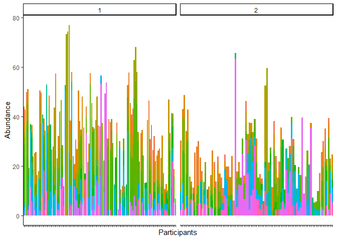<!-- -->

# Calculation of alpha diversity

Calculate alpha diversity using phyloseq package:

``` r
ps_count <- readRDS(paste0(path, "humann3_processed_output/Phyloseq/","ps_count_filtered.rds"))

#Calculate alpha div based on counts
alpha_div <-estimate_richness(ps_count, measures=c("Chao1", "Shannon", "InvSimpson", "Observed"))
head(alpha_div)
```

    ##        Observed Chao1 se.chao1  Shannon InvSimpson
    ## J28338       58    58        0 2.377890   6.509216
    ## J28339       42    42        0 1.887489   4.194573
    ## J28340       51    51        0 1.516884   3.119823
    ## J28341       73    73        0 2.170753   4.427069
    ## J28342       74    74        0 1.582390   2.550200
    ## J28343       54    54        0 2.117025   5.197842

``` r
#Create matrix
alpha_div$J_ID <- row.names(alpha_div)

# Save alpha diversity
write.table(alpha_div, paste0(path, "humann3_processed_output/processed_tables/",'AlphaDiv.txt'), col.names = T, row.names = F, quote = F, sep = '\t')
```

Calculate alpha diversity based on relative abundance and investigate
the correlation:

``` r
matrix_spec <- t(otu_table(ps_relab))
div_shannon_003 <- diversity(matrix_spec, index="shannon")  ### Shannon entropy
div_simpson_003 <- diversity(matrix_spec, index="simpson")  ### Simpson Diversity - It is less sensitive to rare species than the Shannon-Wiener Index
div_invsimpson_003 <- diversity(matrix_spec, index="inv")   ### inverse Simpson Diversity
spec_nr_003 <- specnumber(matrix_spec,MARGIN=1)             ### Species number (observed)

alpha_div_relab <- as.data.frame(cbind(spec_nr_003,div_shannon_003, div_invsimpson_003))
alpha_div_relab$J_ID <- row.names(alpha_div_relab)

# Save alpha diversity
write.table(alpha_div_relab, paste0(path, "humann3_processed_output/processed_tables/",'AlphaDiv_relab.txt'), col.names = T, row.names = F, quote = F, sep = '\t')


# Compare the two methods
alpha_total <- merge(alpha_div, alpha_div_relab, by.x="J_ID", by.y="J_ID")
head(alpha_total)
```

    ##     J_ID Observed Chao1 se.chao1  Shannon InvSimpson spec_nr_003
    ## 1 J28338       58    58        0 2.377890   6.509216          58
    ## 2 J28339       42    42        0 1.887489   4.194573          42
    ## 3 J28340       51    51        0 1.516884   3.119823          51
    ## 4 J28341       73    73        0 2.170753   4.427069          73
    ## 5 J28342       74    74        0 1.582390   2.550200          74
    ## 6 J28343       54    54        0 2.117025   5.197842          54
    ##   div_shannon_003 div_invsimpson_003
    ## 1        2.293807           5.371715
    ## 2        2.178276           5.818598
    ## 3        1.731753           3.739636
    ## 4        2.573988           7.406314
    ## 5        1.829862           3.267268
    ## 6        2.255134           5.934356

``` r
alpha_cor <- alpha_total %>% dplyr::select(-J_ID)
#Spearman correlation
df1 <- cor(alpha_cor, method = "spearman", use = "pairwise.complete.obs")
```

    ## Warning in cor(alpha_cor, method = "spearman", use = "pairwise.complete.obs"):
    ## the standard deviation is zero
    
    ## Warning in cor(alpha_cor, method = "spearman", use = "pairwise.complete.obs"):
    ## the standard deviation is zero
    
    ## Warning in cor(alpha_cor, method = "spearman", use = "pairwise.complete.obs"):
    ## the standard deviation is zero
    
    ## Warning in cor(alpha_cor, method = "spearman", use = "pairwise.complete.obs"):
    ## the standard deviation is zero
    
    ## Warning in cor(alpha_cor, method = "spearman", use = "pairwise.complete.obs"):
    ## the standard deviation is zero
    
    ## Warning in cor(alpha_cor, method = "spearman", use = "pairwise.complete.obs"):
    ## the standard deviation is zero
    
    ## Warning in cor(alpha_cor, method = "spearman", use = "pairwise.complete.obs"):
    ## the standard deviation is zero
    
    ## Warning in cor(alpha_cor, method = "spearman", use = "pairwise.complete.obs"):
    ## the standard deviation is zero

``` r
df1
```

    ##                     Observed     Chao1 se.chao1   Shannon InvSimpson
    ## Observed           1.0000000 1.0000000       NA 0.6866759  0.5538806
    ## Chao1              1.0000000 1.0000000       NA 0.6866759  0.5538806
    ## se.chao1                  NA        NA       NA        NA         NA
    ## Shannon            0.6866759 0.6866759       NA 1.0000000  0.9581087
    ## InvSimpson         0.5538806 0.5538806       NA 0.9581087  1.0000000
    ## spec_nr_003        1.0000000 1.0000000       NA 0.6866759  0.5538806
    ## div_shannon_003    0.6498106 0.6498106       NA 0.9614640  0.9195539
    ## div_invsimpson_003 0.5048902 0.5048902       NA 0.8963941  0.9252389
    ##                    spec_nr_003 div_shannon_003 div_invsimpson_003
    ## Observed             1.0000000       0.6498106          0.5048902
    ## Chao1                1.0000000       0.6498106          0.5048902
    ## se.chao1                    NA              NA                 NA
    ## Shannon              0.6866759       0.9614640          0.8963941
    ## InvSimpson           0.5538806       0.9195539          0.9252389
    ## spec_nr_003          1.0000000       0.6498106          0.5048902
    ## div_shannon_003      0.6498106       1.0000000          0.9563445
    ## div_invsimpson_003   0.5048902       0.9563445          1.0000000

``` r
#Pearson correlation:
df2 <- cor(alpha_cor, method = "pearson", use = "pairwise.complete.obs")
```

    ## Warning in cor(alpha_cor, method = "pearson", use = "pairwise.complete.obs"):
    ## the standard deviation is zero

``` r
df2
```

    ##                     Observed     Chao1 se.chao1   Shannon InvSimpson
    ## Observed           1.0000000 1.0000000       NA 0.6433712  0.5352237
    ## Chao1              1.0000000 1.0000000       NA 0.6433712  0.5352237
    ## se.chao1                  NA        NA       NA        NA         NA
    ## Shannon            0.6433712 0.6433712       NA 1.0000000  0.8707504
    ## InvSimpson         0.5352237 0.5352237       NA 0.8707504  1.0000000
    ## spec_nr_003        1.0000000 1.0000000       NA 0.6433712  0.5352237
    ## div_shannon_003    0.6145677 0.6145677       NA 0.9770040  0.8323845
    ## div_invsimpson_003 0.5027192 0.5027192       NA 0.8462830  0.9274877
    ##                    spec_nr_003 div_shannon_003 div_invsimpson_003
    ## Observed             1.0000000       0.6145677          0.5027192
    ## Chao1                1.0000000       0.6145677          0.5027192
    ## se.chao1                    NA              NA                 NA
    ## Shannon              0.6433712       0.9770040          0.8462830
    ## InvSimpson           0.5352237       0.8323845          0.9274877
    ## spec_nr_003          1.0000000       0.6145677          0.5027192
    ## div_shannon_003      0.6145677       1.0000000          0.8760145
    ## div_invsimpson_003   0.5027192       0.8760145          1.0000000

# Calculation of beta diversity

Calculate beta diversity based on species level:

``` r
ps_count <- readRDS(paste0(path, "humann3_processed_output/Phyloseq/","ps_count_filtered.rds"))
ps_relab <- readRDS(paste0(path, "humann3_processed_output/Phyloseq/","ps_relab_filtered.rds"))

#Bray Curtis: 
beta_div_relab_bray = phyloseq::distance(ps_relab, method='bray')
beta_div_relab_bray %>% as.vector %>% summary
```

    ##    Min. 1st Qu.  Median    Mean 3rd Qu.    Max. 
    ## 0.05775 0.71718 0.81075 0.79806 0.90358 1.00000

``` r
#Jaccard:
beta_div_relab_jaccard = phyloseq::distance(ps_relab, method='jaccard', binary = TRUE)
beta_div_relab_jaccard %>% as.vector %>% summary
```

    ##    Min. 1st Qu.  Median    Mean 3rd Qu.    Max. 
    ##  0.1222  0.6250  0.6940  0.6990  0.7701  1.0000

``` r
#Aitchison:
otu_aict <- t(otu_table(ps_count))
otu_aict[1:5, 1:5]
```

    ## OTU Table:          [5 taxa and 5 samples]
    ##                      taxa are columns
    ##        s__Methanobrevibacter_smithii s__Methanosphaera_stadtmanae
    ## J28338                             0                            0
    ## J28339                             0                            0
    ## J28340                             0                            0
    ## J28341                             0                            0
    ## J28342                             0                            0
    ##        s__Candidatus_Methanomassiliicoccus_intestinalis
    ## J28338                                                0
    ## J28339                                                0
    ## J28340                                                0
    ## J28341                                                0
    ## J28342                                                0
    ##        s__Actinobaculum_sp_oral_taxon_183 s__Actinomyces_graevenitzii
    ## J28338                                  0                           0
    ## J28339                                  0                           0
    ## J28340                                  0                           0
    ## J28341                                  0                           0
    ## J28342                                  0                           0

``` r
#Impute zeros
otu_comp <-  cmultRepl((otu_aict), method="CZM", output="p-counts")
```

    ## No. corrected values:  274

``` r
otu_comp[1:5, 1:5]
```

    ##        s__Methanobrevibacter_smithii s__Methanosphaera_stadtmanae
    ## J28338                     0.3250103                    0.3250103
    ## J28339                     0.3250175                    0.3250175
    ## J28340                     0.3250085                    0.3250085
    ## J28341                     0.3250068                    0.3250068
    ## J28342                     0.3250035                    0.3250035
    ##        s__Candidatus_Methanomassiliicoccus_intestinalis
    ## J28338                                        0.3250103
    ## J28339                                        0.3250175
    ## J28340                                        0.3250085
    ## J28341                                        0.3250068
    ## J28342                                        0.3250035
    ##        s__Actinobaculum_sp_oral_taxon_183 s__Actinomyces_graevenitzii
    ## J28338                          0.3250103                   0.3250103
    ## J28339                          0.3250175                   0.3250175
    ## J28340                          0.3250085                   0.3250085
    ## J28341                          0.3250068                   0.3250068
    ## J28342                          0.3250035                   0.3250035

``` r
#Clr transformation
otu_clr <- rgr::clr(otu_comp)
```

``` r
#Transform back into phyloseq object:
ps_clr <- phyloseq(otu_table(otu_clr, taxa_are_rows = F), tax_table(ps_count), sample_data(meta))

saveRDS(ps_clr, paste0(path, "humann3_processed_output/Phyloseq/", "ps_clr.rds"))

#Calculate Euclidean distance (=Aitchison's distance):
beta_div_relab_ait = phyloseq::distance(ps_clr, method='euclidean')

#Save files
saveRDS(beta_div_relab_bray, paste0(path,"humann3_processed_output/processed_tables/", "Beta.diversity_relab_bray.RDS"))
saveRDS(beta_div_relab_jaccard, paste0(path,"humann3_processed_output/processed_tables/", "Beta.diversity_relab_jaccard.RDS"))
saveRDS(beta_div_relab_ait, paste0(path,"humann3_processed_output/processed_tables/", "Beta.diversity_relab_aitchison.RDS"))
```

Plot beta diversity using NMDS to check for outliers: Can also be used
to visually inspect association with variables. Stress: \<0.05 =
excellent \<0.1 = great \<0.2 = good/ok \<0.3 = poor

Bray Curtis distance on species level:

``` r
BRAY_NMDS_relab_SPE=metaMDS(beta_div_relab_bray, k=2,trymax=30)
```

    ## Run 0 stress 0.2394775 
    ## Run 1 stress 0.2425353 
    ## Run 2 stress 0.2416314 
    ## Run 3 stress 0.2462542 
    ## Run 4 stress 0.2396685 
    ## ... Procrustes: rmse 0.009573006  max resid 0.08588761 
    ## Run 5 stress 0.2451973 
    ## Run 6 stress 0.2396511 
    ## ... Procrustes: rmse 0.004159187  max resid 0.05157973 
    ## Run 7 stress 0.2405528 
    ## Run 8 stress 0.2428821 
    ## Run 9 stress 0.2524142 
    ## Run 10 stress 0.2476465 
    ## Run 11 stress 0.2462557 
    ## Run 12 stress 0.2444917 
    ## Run 13 stress 0.2402754 
    ## Run 14 stress 0.2395614 
    ## ... Procrustes: rmse 0.003933354  max resid 0.04275597 
    ## Run 15 stress 0.23956 
    ## ... Procrustes: rmse 0.003774621  max resid 0.04278757 
    ## Run 16 stress 0.2443337 
    ## Run 17 stress 0.2401067 
    ## Run 18 stress 0.2450222 
    ## Run 19 stress 0.2396571 
    ## ... Procrustes: rmse 0.009297059  max resid 0.0920567 
    ## Run 20 stress 0.2408425 
    ## Run 21 stress 0.2426335 
    ## Run 22 stress 0.2497399 
    ## Run 23 stress 0.2395625 
    ## ... Procrustes: rmse 0.003037255  max resid 0.03310332 
    ## Run 24 stress 0.2478737 
    ## Run 25 stress 0.2427849 
    ## Run 26 stress 0.2438679 
    ## Run 27 stress 0.2429152 
    ## Run 28 stress 0.2415974 
    ## Run 29 stress 0.2569905 
    ## Run 30 stress 0.2446639 
    ## *** No convergence -- monoMDS stopping criteria:
    ##     11: no. of iterations >= maxit
    ##     19: stress ratio > sratmax

``` r
BRAY_NMDS_relab_SPE$stress
```

    ## [1] 0.2394775

``` r
#Plotting
data.scores = as.data.frame(scores(BRAY_NMDS_relab_SPE))
data.scores$sex <- sample_data(ps_relab)$sex
data.scores$age_gr <- sample_data(ps_relab)$age_gr
data.scores$time_point <- sample_data(ps_relab)$time_point
data.scores$f_cal <- sample_data(ps_relab)$f_cal_current
data.scores$f_cal_binary <- sample_data(ps_relab)$fcal_binary
data.scores$score <- sample_data(ps_relab)$score
data.scores$score_binary <- sample_data(ps_relab)$score_binary

ggplot(data=data.scores, aes(x=NMDS1, y=NMDS2, color = as.factor(sex)))+
  geom_point()+theme_classic()+
  stat_ellipse()+labs(color="Sex")
```

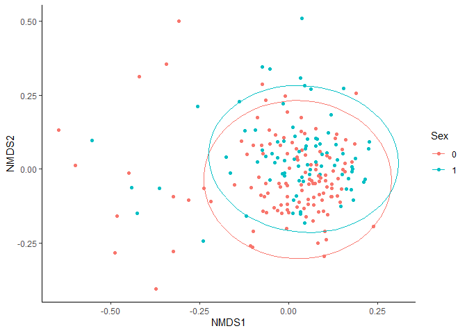<!-- -->

``` r
ggplot(data=data.scores, aes(x=NMDS1, y=NMDS2, color = as.factor(age_gr)))+
  geom_point()+theme_classic()+
  stat_ellipse()+labs(color="Age group")
```

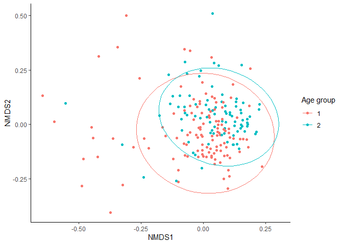<!-- -->

``` r
data.scores1 <- data.scores %>% filter(!is.na(f_cal))
ggplot(data=data.scores1, aes(x=NMDS1, y=NMDS2, color = f_cal))+
  geom_point(size=1)+theme_classic()+
  labs(color="Faecal calprotectin")
```

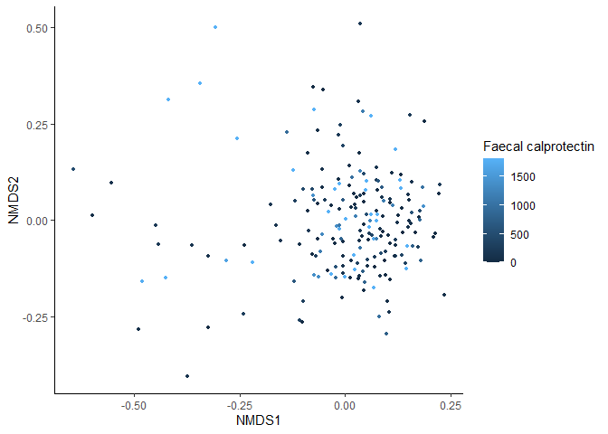<!-- -->

``` r
data.scores1$f_cal_binary1 <- factor(ifelse(data.scores1$f_cal_binary==0, "Remission", "Disease"), levels=c("Remission", "Disease"))
ggplot(data=data.scores1, aes(x=NMDS1, y=NMDS2, color = f_cal_binary1))+
  geom_point(size=1)+theme_classic()+
  labs(color="Paraclinical")+
  stat_ellipse()+ggtitle("Bray Curtis distance")
```

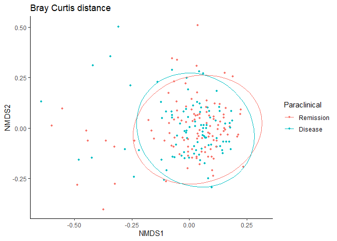<!-- -->

``` r
data.scores2 <- data.scores %>% filter(!is.na(score))
ggplot(data=data.scores2, aes(x=NMDS1, y=NMDS2, color = score))+
  geom_point(size=1)+theme_classic()+
  labs(color="Disease score")+
  stat_ellipse()
```

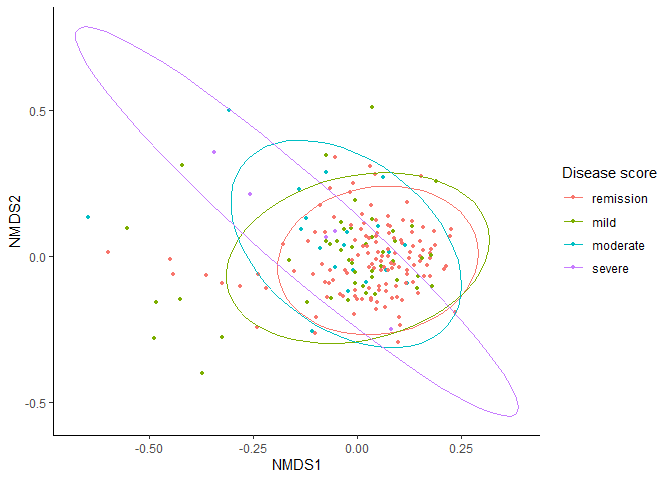<!-- -->

``` r
data.scores2$score_binary1 <- factor(ifelse(data.scores2$score_binary==0, "Remission", "Disease"), levels=c("Remission", "Disease"))
ggplot(data=data.scores2, aes(x=NMDS1, y=NMDS2, color = score_binary1))+
  geom_point(size=1)+theme_classic()+
  labs(color="Clinical")+
  stat_ellipse()+ggtitle("Bray Curtis distance")
```

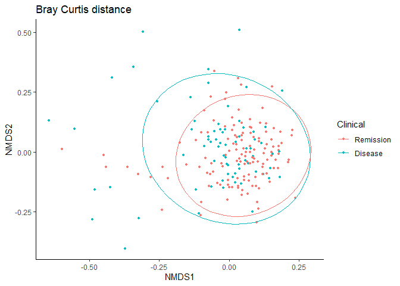<!-- -->

Jaccard distance on species level:

``` r
JAC_NMDS_relab_SPE=metaMDS(beta_div_relab_jaccard,k=2,trymax=30)
```

    ## Run 0 stress 0.1875643 
    ## Run 1 stress 0.1981147 
    ## Run 2 stress 0.1978564 
    ## Run 3 stress 0.1980911 
    ## Run 4 stress 0.187544 
    ## ... New best solution
    ## ... Procrustes: rmse 0.001936578  max resid 0.01917824 
    ## Run 5 stress 0.196166 
    ## Run 6 stress 0.2043258 
    ## Run 7 stress 0.1875426 
    ## ... New best solution
    ## ... Procrustes: rmse 0.001537325  max resid 0.01867634 
    ## Run 8 stress 0.2007504 
    ## Run 9 stress 0.1923612 
    ## Run 10 stress 0.196097 
    ## Run 11 stress 0.1925057 
    ## Run 12 stress 0.1888493 
    ## Run 13 stress 0.1977337 
    ## Run 14 stress 0.1980392 
    ## Run 15 stress 0.1904409 
    ## Run 16 stress 0.1908963 
    ## Run 17 stress 0.1971459 
    ## Run 18 stress 0.201916 
    ## Run 19 stress 0.1901817 
    ## Run 20 stress 0.1903933 
    ## Run 21 stress 0.196793 
    ## Run 22 stress 0.1975401 
    ## Run 23 stress 0.4168381 
    ## Run 24 stress 0.2106805 
    ## Run 25 stress 0.2050815 
    ## Run 26 stress 0.1990921 
    ## Run 27 stress 0.1969141 
    ## Run 28 stress 0.1945157 
    ## Run 29 stress 0.1902582 
    ## Run 30 stress 0.2014027 
    ## *** No convergence -- monoMDS stopping criteria:
    ##     10: no. of iterations >= maxit
    ##     20: stress ratio > sratmax

``` r
JAC_NMDS_relab_SPE$stress 
```

    ## [1] 0.1875426

``` r
#Plotting
data.scores = as.data.frame(scores(JAC_NMDS_relab_SPE))
data.scores$sex <- sample_data(ps_relab)$sex
data.scores$time_point <- sample_data(ps_relab)$time_point
data.scores$age_gr <- sample_data(ps_relab)$age_gr
data.scores$f_cal <- sample_data(ps_relab)$f_cal_current
data.scores$f_cal_binary <- sample_data(ps_relab)$fcal_binary
data.scores$score <- sample_data(ps_relab)$score
data.scores$score_binary <- sample_data(ps_relab)$score_binary

ggplot(data=data.scores, aes(x=NMDS1, y=NMDS2, color = as.factor(sex)))+
  geom_point()+theme_classic()+
  stat_ellipse()+labs(color="Sex")
```

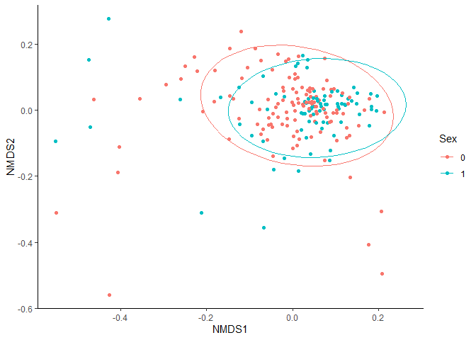<!-- -->

``` r
ggplot(data=data.scores, aes(x=NMDS1, y=NMDS2, color = as.factor(age_gr)))+
  geom_point()+theme_classic()+
  stat_ellipse()+labs(color="Age group")
```

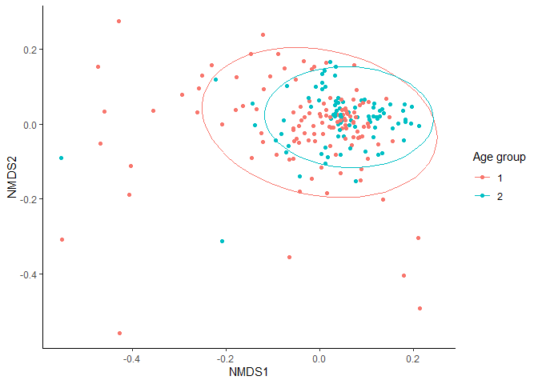<!-- -->

``` r
data.scores1 <- data.scores %>% filter(!is.na(f_cal))
ggplot(data=data.scores1, aes(x=NMDS1, y=NMDS2, color = f_cal))+
  geom_point(size=1)+theme_classic()+
  labs(color="Faecal calprotectin")
```

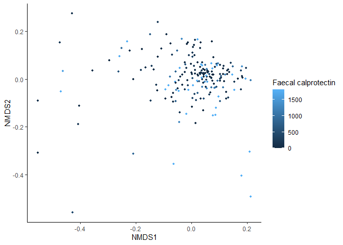<!-- -->

``` r
data.scores1$f_cal_binary1 <- factor(ifelse(data.scores1$f_cal_binary==0, "Remission", "Disease"), levels=c("Remission", "Disease"))
ggplot(data=data.scores1, aes(x=NMDS1, y=NMDS2, color = f_cal_binary1))+
  geom_point(size=1)+theme_classic()+
  labs(color="Paraclinical")+
  stat_ellipse()+ggtitle("Jaccard distance")
```

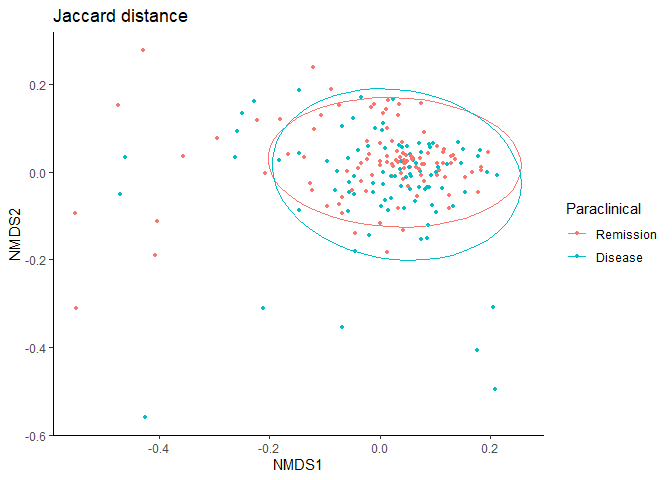<!-- -->

``` r
data.scores2 <- data.scores %>% filter(!is.na(score))
ggplot(data=data.scores2, aes(x=NMDS1, y=NMDS2, color = score))+
  geom_point(size=1)+theme_classic()+
  labs(color="Disease score")+
  stat_ellipse()
```

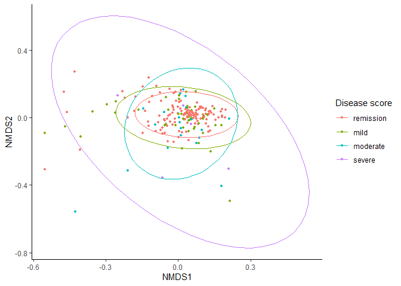<!-- -->

``` r
data.scores2$score_binary1 <- factor(ifelse(data.scores2$score_binary==0, "Remission", "Disease"), levels=c("Remission", "Disease"))
ggplot(data=data.scores2, aes(x=NMDS1, y=NMDS2, color = score_binary1))+
  geom_point(size=1)+theme_classic()+
  labs(color="Clinical")+
  stat_ellipse()+ggtitle("Jaccard distance")
```

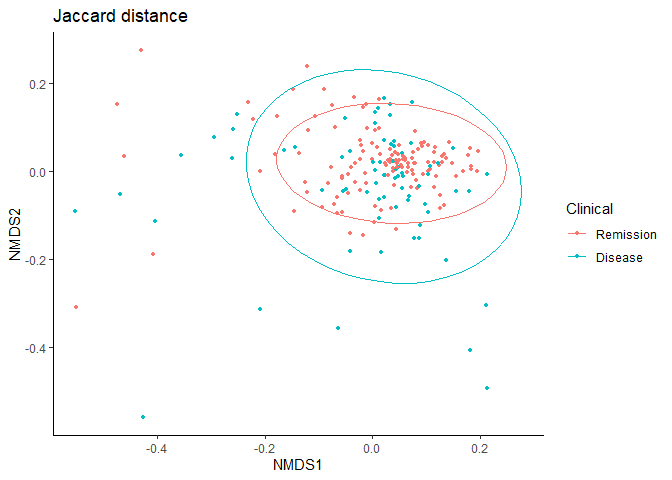<!-- -->

Aitchison’s distance:

``` r
Ait_NMDS_relab_SPE=metaMDS(beta_div_relab_ait,k=2,trymax=30)
```

    ## Run 0 stress 0.2177323 
    ## Run 1 stress 0.2352042 
    ## Run 2 stress 0.2228992 
    ## Run 3 stress 0.2310001 
    ## Run 4 stress 0.2268438 
    ## Run 5 stress 0.2411524 
    ## Run 6 stress 0.2335715 
    ## Run 7 stress 0.2246008 
    ## Run 8 stress 0.2333673 
    ## Run 9 stress 0.2346433 
    ## Run 10 stress 0.2285337 
    ## Run 11 stress 0.2232951 
    ## Run 12 stress 0.2272686 
    ## Run 13 stress 0.2237968 
    ## Run 14 stress 0.2261283 
    ## Run 15 stress 0.2330967 
    ## Run 16 stress 0.2227301 
    ## Run 17 stress 0.416836 
    ## Run 18 stress 0.2330722 
    ## Run 19 stress 0.2269406 
    ## Run 20 stress 0.2291589 
    ## Run 21 stress 0.2355369 
    ## Run 22 stress 0.2325738 
    ## Run 23 stress 0.2269579 
    ## Run 24 stress 0.2330689 
    ## Run 25 stress 0.2284225 
    ## Run 26 stress 0.2284804 
    ## Run 27 stress 0.231556 
    ## Run 28 stress 0.2249567 
    ## Run 29 stress 0.2284001 
    ## Run 30 stress 0.2263223 
    ## *** No convergence -- monoMDS stopping criteria:
    ##     30: stress ratio > sratmax

``` r
Ait_NMDS_relab_SPE$stress
```

    ## [1] 0.2177323

``` r
data.scores = as.data.frame(scores(Ait_NMDS_relab_SPE))
data.scores$sex <- sample_data(ps_relab)$sex
data.scores$time_point <- sample_data(ps_relab)$time_point
data.scores$age_gr <- sample_data(ps_relab)$age_gr
data.scores$f_cal <- sample_data(ps_relab)$f_cal_current
data.scores$f_cal_binary <- sample_data(ps_relab)$fcal_binary
data.scores$score <- sample_data(ps_relab)$score
data.scores$score_binary <- sample_data(ps_relab)$score_binary

ggplot(data=data.scores, aes(x=NMDS1, y=NMDS2, color = as.factor(sex)))+
  geom_point()+theme_classic()+
  stat_ellipse()+labs(color="Sex")
```

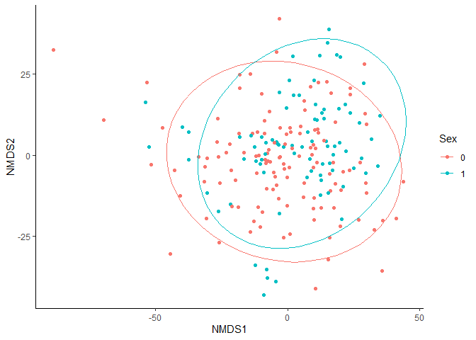<!-- -->

``` r
ggplot(data=data.scores, aes(x=NMDS1, y=NMDS2, color = as.factor(age_gr)))+
  geom_point()+theme_classic()+
  stat_ellipse()+labs(color="Age group")
```

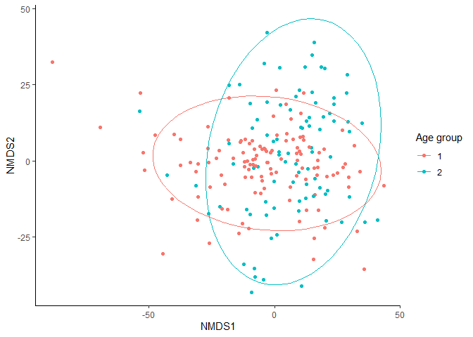<!-- -->

``` r
data.scores1 <- data.scores %>% filter(!is.na(f_cal))
ggplot(data=data.scores1, aes(x=NMDS1, y=NMDS2, color = f_cal))+
  geom_point(size=1)+theme_classic()+
  labs(color="Faecal calprotectin")
```

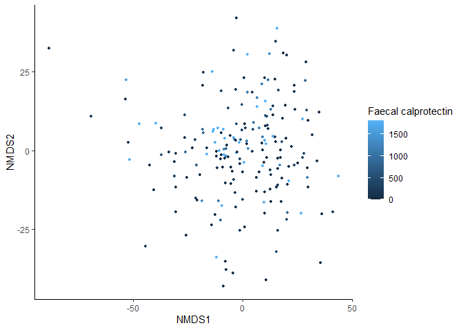<!-- -->

``` r
data.scores1$f_cal_binary1 <- factor(ifelse(data.scores1$f_cal_binary==0, "Remission", "Disease"), levels=c("Remission", "Disease"))
ggplot(data=data.scores1, aes(x=NMDS1, y=NMDS2, color = f_cal_binary1))+
  geom_point(size=1)+theme_classic()+
  labs(color="Paraclinical")+
  stat_ellipse()+ggtitle("Aitchison's distance")
```

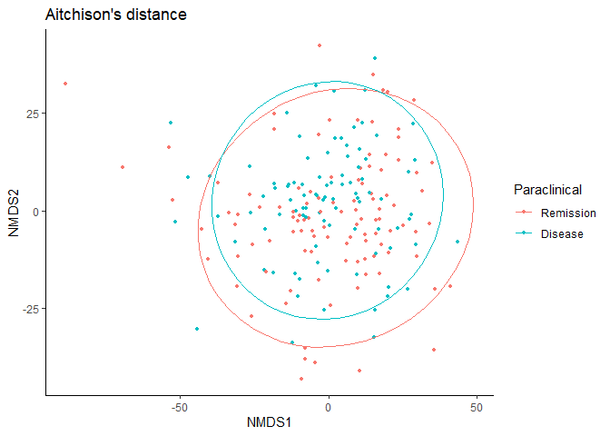<!-- -->

``` r
data.scores2 <- data.scores %>% filter(!is.na(score))
ggplot(data=data.scores2, aes(x=NMDS1, y=NMDS2, color = score))+
  geom_point(size=1)+theme_classic()+
  labs(color="Disease score")+
  stat_ellipse()
```

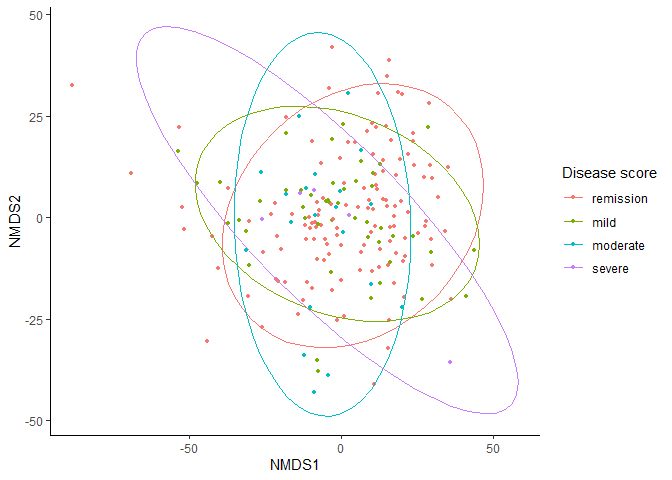<!-- -->

``` r
data.scores2$score_binary1 <- factor(ifelse(data.scores2$score_binary==0, "Remission", "Disease"), levels=c("Remission", "Disease"))
ggplot(data=data.scores2, aes(x=NMDS1, y=NMDS2, color = score_binary1))+
  geom_point(size=1)+theme_classic()+
  labs(color="Clinical")+
  stat_ellipse()+ggtitle("Aitchison's distance")
```

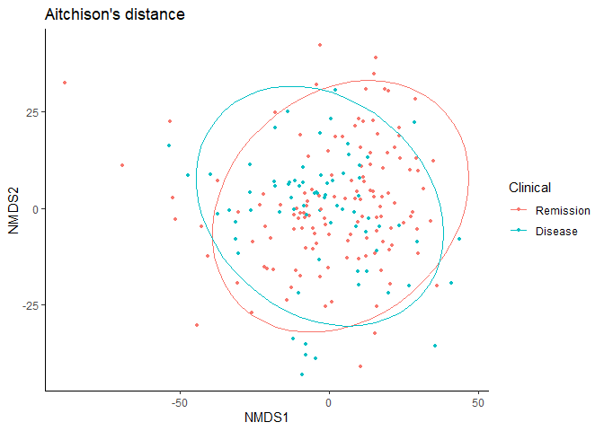<!-- -->

# Prefiltering of dataframe for single species analyses

Select species to test in single species analyses. Species are
preselected based on high mean and high variance across samples. This is
done to increase power and only investigate species, that could be
biological interesting. Finally, species are also selected based on
proportion of zeros:

``` r
ps_count <- readRDS(paste0(path, "humann3_processed_output/Phyloseq/","ps_count_filtered.rds"))
ps_relab <- readRDS(paste0(path, "humann3_processed_output/Phyloseq/","ps_relab_filtered.rds"))

count <- as.data.frame(t(otu_table(ps_count)))
relab <- as.data.frame(t(otu_table(ps_relab)))

#Count data
#Subset based on highest mean and variance
step1 <- count[ ,colMeans(count) >= quantile(colMeans(count), 0.5)]
dim(step1) #reduced to 275 taxa
```

    ## [1] 207 275

``` r
step2 <- apply(step1, 2, var)
step2 <- step1[ ,step2 >= quantile( step2, 0.50) ]
dim(step2) #reduced to 138 taxa
```

    ## [1] 207 138

``` r
ps_count_sub_mean_var <- prune_taxa(colnames(step2),ps_count)
saveRDS(ps_count_sub_mean_var, paste0(path, "humann3_processed_output/Phyloseq/", "ps_count_50mean_50var.rds"))

#Subset based on zero proportion:
non <- nonzero(step2)
for_analysis <- non$nonzero.p[non$nonzero.p>0.25]
step3 <- step2[,names(for_analysis)]
dim(step3) #reduced to 77 taxa
```

    ## [1] 207  77

``` r
ps_count_sub_mean_var_zero <- prune_taxa(colnames(step3),ps_count)
saveRDS(ps_count_sub_mean_var_zero, paste0(path, "humann3_processed_output/Phyloseq/", "ps_count_50mean_50var_zero.rds"))

##Relative abundance data
step1 <- relab[ ,colMeans(relab) >= quantile(colMeans(relab), 0.5)]
dim(step1) #reduced to 275 taxa
```

    ## [1] 207 275

``` r
step2 <- apply(step1, 2, var)
step2 <- step1[ ,step2 >= quantile( step2, 0.50) ]
dim(step2) #reduced to 138 taxa
```

    ## [1] 207 138

``` r
ps_relab_sub_mean_var <- prune_taxa(colnames(step2),ps_relab)
saveRDS(ps_relab_sub_mean_var, paste0(path, "humann3_processed_output/Phyloseq/", "ps_relab_50mean_50var.rds"))

non <- nonzero(step2)
for_analysis <- non$nonzero.p[non$nonzero.p>0.25]
step3 <- step2[,names(for_analysis)]
dim(step3) #reduced to 77 taxa
```

    ## [1] 207  75

``` r
ps_relab_sub_mean_var_zero <- prune_taxa(colnames(step3),ps_relab)
saveRDS(ps_relab_sub_mean_var_zero, paste0(path, "humann3_processed_output/Phyloseq/", "ps_relab_50mean_50var_zero.rds"))

#Evaluate: Zeros, dispersion
#Mean:
mean(apply(otu_table(ps_count_sub_mean_var_zero), 1, FUN=mean))
```

    ## [1] 109155.4

``` r
#Variance:
mean(apply(otu_table(ps_count_sub_mean_var_zero), 1, FUN=stats::var))
```

    ## [1] 412702211278

``` r
#Zero proportion:
mean(apply(otu_table(ps_count_sub_mean_var_zero), 1, function(x) sum(x==0)/207))
```

    ## [1] 0.4317711

``` r
sd(apply(otu_table(ps_count_sub_mean_var_zero), 1, function(x) sum(x==0)/207))
```

    ## [1] 0.1974061

``` r
#Mean to variance ratio:
mean(apply(otu_table(ps_count_sub_mean_var_zero), 1, function(x) var(x)/mean(x)))
```

    ## [1] 955222.4

``` r
sd(apply(otu_table(ps_count_sub_mean_var_zero), 1, function(x) var(x)/mean(x)))
```

    ## [1] 1818325

``` r
ps_count <- readRDS(paste0(path, "humann3_processed_output/Phyloseq/","ps_count_filtered.rds"))
ps_relab <- readRDS(paste0(path, "humann3_processed_output/Phyloseq/","ps_relab_filtered.rds"))
ps_clr <- readRDS(paste0(path, "humann3_processed_output/Phyloseq/","ps_clr.rds"))

#Select one sample (J28339) and plot species in histogram
count_plot <- subset_samples(ps_count, J_ID=="J28339")
plot_count <- as.data.frame(as.matrix(otu_table(count_plot)))

ggplot(plot_count)+
  geom_histogram(aes(x=J28339), fill="darkblue", bins=50)+xlab("Species count")+ylab("")+theme_classic()
```

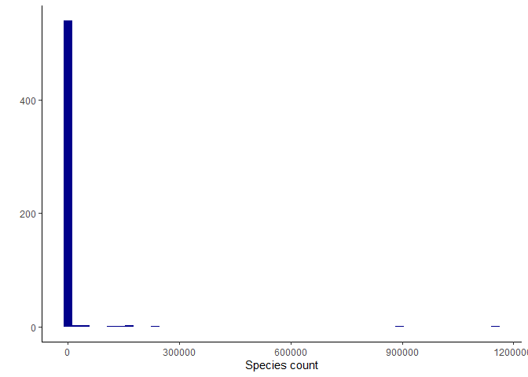<!-- -->

``` r
relab_plot <- subset_samples(ps_relab, J_ID=="J28339")
plot_relab <- as.data.frame(as.matrix(otu_table(relab_plot)))
ggplot(plot_relab)+
  geom_histogram(aes(x=J28339), fill="darkblue", bins=50)+xlab("Species relative abundance (%)")+ylab("")+theme_classic()+ylim(0,600)
```

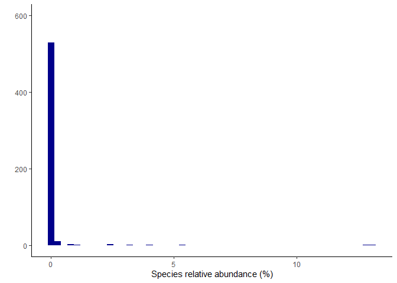<!-- -->

``` r
ggplot(plot_relab)+
  geom_histogram(aes(x=asin(sqrt(J28339))), fill="darkblue", bins=50)+xlab("Arcsine square root")+ylab("")+theme_classic()+ylim(0,600)
```

    ## Warning in asin(sqrt(J28339)): NaNs produced
    
    ## Warning in asin(sqrt(J28339)): NaNs produced

    ## Warning: Removed 7 rows containing non-finite values (stat_bin).

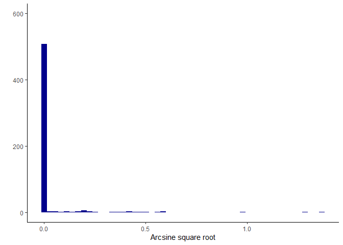<!-- -->

``` r
clr_plot <- subset_samples(ps_clr, J_ID=="J28339")
plot_clr <- as.data.frame(t(otu_table(clr_plot)))
ggplot(plot_clr)+
  geom_histogram(aes(x=J28339), fill="darkblue", bins=50)+xlab("Clr transformed")+ylab("")+theme_classic()
```

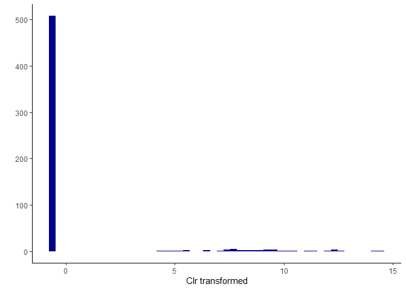<!-- -->

``` r
#Select one species (Akkermansia_muc) and plot the a
count_plot <- prune_taxa("s__Eubacterium_sp_CAG_38", ps_count)
plot_count <- as.data.frame(t(otu_table(count_plot)))
ggplot(plot_count)+
  geom_histogram(aes(x=s__Eubacterium_sp_CAG_38), fill="darkblue", bins=50)+xlab("Species count")+ylab("")+theme_classic()
```

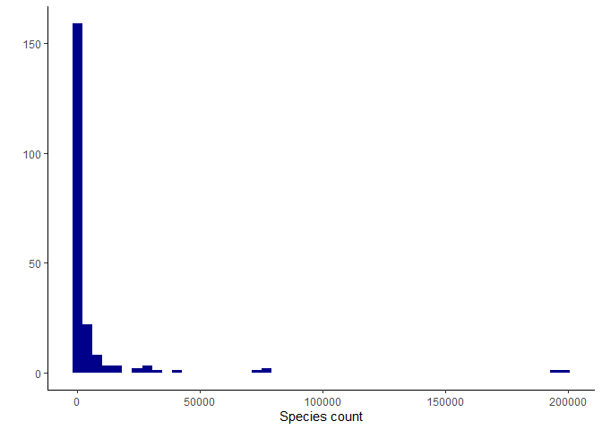<!-- -->

``` r
relab_plot <- prune_taxa("s__Eubacterium_sp_CAG_38", ps_relab)
plot_relab <- as.data.frame(t(otu_table(relab_plot)))
ggplot(plot_relab)+
  geom_histogram(aes(x=s__Eubacterium_sp_CAG_38), fill="darkblue", bins=50)+xlab("Species relative abundance (%)")+ylab("")+theme_classic()
```

<!-- -->

``` r
ggplot(plot_relab)+
  geom_histogram(aes(x=asin(sqrt(s__Eubacterium_sp_CAG_38))), fill="darkblue", bins=50)+xlab("Arcsine square root")+ylab("")+theme_classic()
```

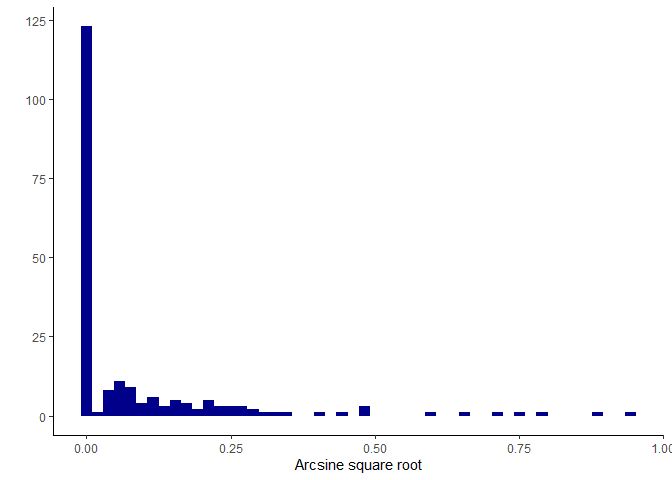<!-- -->

``` r
clr_plot <- prune_taxa("s__Eubacterium_sp_CAG_38", ps_clr)
plot_clr <- as.data.frame(as.matrix(otu_table(clr_plot)))
ggplot(plot_clr)+
  geom_histogram(aes(x=s__Eubacterium_sp_CAG_38), fill="darkblue", bins=50)+xlab("Clr transformed")+ylab("")+theme_classic()
```

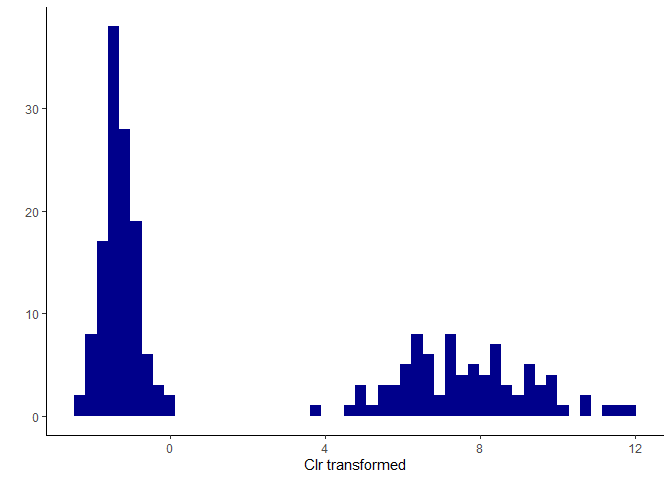<!-- -->
