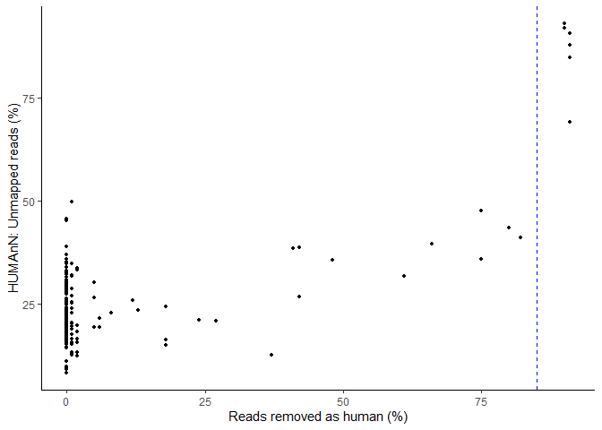
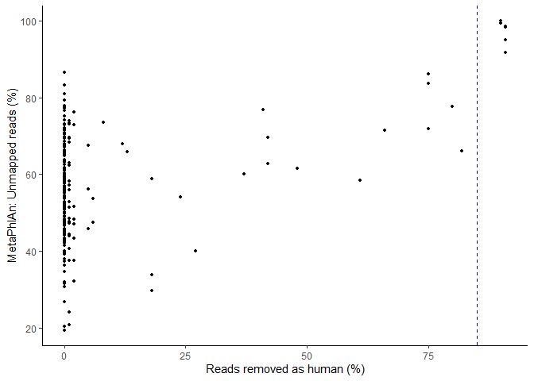
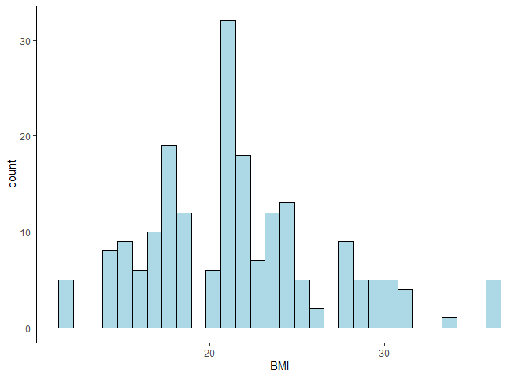
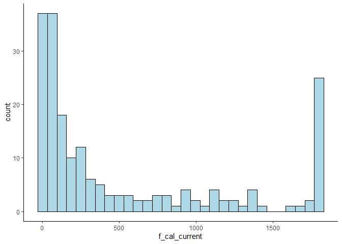
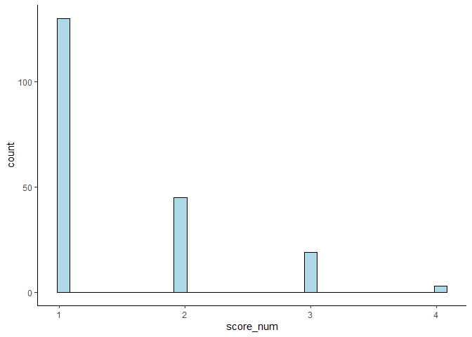

Selection of covariates
================

  - [Load in packages and path to
    folder](#load-in-packages-and-path-to-folder)
  - [Investigate the proportion of reads removed as
    human](#investigate-the-proportion-of-reads-removed-as-human)
  - [Investigate predicters: Correlation and
    distribution](#investigate-predicters-correlation-and-distribution)
  - [Selection of microbiome
    covariates](#selection-of-microbiome-covariates)
  - [Selection of disease score
    covariates](#selection-of-disease-score-covariates)

# Load in packages and path to folder

``` r
library(tidyverse)
library(caret)
library(phyloseq)
library(vegan)
library(lme4)
library(lmerTest)
library(nlme)
library(RCurl)
library(MuMIn)
path = "C:/Users/Tom/Documents/10. semester/V1/data/"
```

# Investigate the proportion of reads removed as human

Read in meta data:

``` r
meta <- read.delim(paste0(path, "metadata/", "preped_metadata.txt"))
```

Read in the data:

``` r
#Percentage of removed reads due to human
removed_human <- read_delim(file=paste0(path, "../analysis/", "summary_stats_of_QC.txt"), delim="\t")
removed_human <- removed_human %>% dplyr::select(J_ID, percent_removed_as_human)
removed_human <-  removed_human %>% mutate(percent_removed_as_human = as.numeric(percent_removed_as_human))
```

``` r
summary(removed_human$percent_removed_as_human)
```

    ##    Min. 1st Qu.  Median    Mean 3rd Qu.    Max. 
    ## 0.00000 0.00000 0.00000 0.08967 0.01000 0.91000

``` r
#Unmapped MetaPhlan
bug_relab <- read.csv(paste0(path, "humann3_processed_output/Joined_tables/", "Joined_metaphlan_bugs_list_relab.tsv"), sep = "\t", strip.white = T, stringsAsFactors = F, row.names = 1) 
colnames(bug_relab) <- substr(colnames(bug_relab), start = 1, stop = 6)

relab_unknown <- bug_relab[1,]
relab_unknown <- t(relab_unknown)
relab_unknown <- as.data.frame(relab_unknown)
relab_unknown$J_ID <- rownames(relab_unknown)
```

``` r
#Unmapped HumanN
path_abun_unstratified <- read_delim(paste0(path, "humann3_processed_output/processed_tables/", "pathway_relab_unstratified.txt"), delim = '\t')
humann_path <- path_abun_unstratified %>% dplyr::select(J_ID, UNMAPPED)
humann_path <- humann_path %>% rename(path_unmapped = UNMAPPED)
```

``` r
#Merge 
missing_data <- merge(removed_human, relab_unknown, by.x="J_ID", by.y="J_ID")
missing_data <- missing_data %>% rename(metaphlan_unknown=UNKNOWN)
missing_data <- merge(missing_data, humann_path, by.x="J_ID", by.y="J_ID")
head(missing_data)
```

    ##     J_ID percent_removed_as_human metaphlan_unknown path_unmapped
    ## 1 J28338                     0.00          59.46923      0.231806
    ## 2 J28339                     0.01          51.45642      0.202328
    ## 3 J28340                     0.00          44.64690      0.170398
    ## 4 J28341                     0.00          53.70368      0.185062
    ## 5 J28342                     0.06          47.47637      0.194659
    ## 6 J28343                     0.01          48.42729      0.154193

``` r
#Save missing
write.table(missing_data, file=paste0(path, "metadata/", "missing_data.txt"), col.names = T, row.names = F, quote = F, sep = '\t')

#Plots: Unmapped reads vs. the proportion of reads removed as human
ggplot(missing_data)+
  geom_point(aes(x=percent_removed_as_human*100, y=path_unmapped*100), size=1)+theme_classic()+
  xlab("Reads removed as human (%)")+ylab("HUMAnN: Unmapped reads (%)")+
  geom_vline(xintercept = 85, linetype=2, color="blue")
```

<!-- -->

``` r
ggplot(missing_data)+
  geom_point(aes(x=percent_removed_as_human*100, y=metaphlan_unknown), size=1)+theme_classic()+
  xlab("Reads removed as human (%)")+ylab("MetaPhlAn: Unmapped reads (%)")+
  geom_vline(xintercept = 85, linetype=2, color="blue")
```

<!-- -->

``` r
sum(missing_data$percent_removed_as_human>0.85) #6 datapoint have more that 85% of reads removed as human reads
```

    ## [1] 6

``` r
#Remove samples with more than 85% removed as human:
meta <- merge(meta, missing_data, by.x="J_ID", by.y="J_ID")
meta <- meta %>% filter(percent_removed_as_human < 0.85)
dim(meta) #202 samples left
```

    ## [1] 202  92

``` r
#Save the new meta data:
write.table(meta, file=paste0(path, "metadata/", "preped_metadata_filtered.txt"), col.names = T, row.names = F, quote = F, sep = '\t')
```

Look into the samples left:

``` r
#Split samples by timepoint:
t0 <- meta %>% filter(time_point==0)
dim(t0)
```

    ## [1] 37 92

``` r
t1 <- meta %>% filter(time_point==1)
dim(t1)
```

    ## [1] 40 92

``` r
t2 <- meta %>% filter(time_point==2)
dim(t2)
```

    ## [1] 45 92

``` r
t3 <- meta %>% filter(time_point==3)
dim(t3)
```

    ## [1] 43 92

``` r
t4 <- meta %>% filter(time_point==4)
dim(t4)
```

    ## [1] 37 92

``` r
#How many female/male (0/1) in each?
dim(t0 %>% filter(sex==0))
```

    ## [1] 24 92

``` r
dim(t0 %>% filter(sex==1))
```

    ## [1] 13 92

``` r
dim(t1 %>% filter(sex==0))
```

    ## [1] 23 92

``` r
dim(t1 %>% filter(sex==1))
```

    ## [1] 17 92

``` r
dim(t2 %>% filter(sex==0))
```

    ## [1] 26 92

``` r
dim(t2 %>% filter(sex==1))
```

    ## [1] 19 92

``` r
dim(t3 %>% filter(sex==0))
```

    ## [1] 25 92

``` r
dim(t3 %>% filter(sex==1))
```

    ## [1] 18 92

``` r
dim(t4 %>% filter(sex==0))
```

    ## [1] 23 92

``` r
dim(t4 %>% filter(sex==1))
```

    ## [1] 14 92

``` r
#How many children/adults (1/2) in each?
dim(t0 %>% filter(age_gr==1))
```

    ## [1] 22 92

``` r
dim(t0 %>% filter(age_gr==2))
```

    ## [1] 15 92

``` r
dim(t1 %>% filter(age_gr==1))
```

    ## [1] 25 92

``` r
dim(t1 %>% filter(age_gr==2))
```

    ## [1] 15 92

``` r
dim(t2 %>% filter(age_gr==1))
```

    ## [1] 25 92

``` r
dim(t2 %>% filter(age_gr==2))
```

    ## [1] 20 92

``` r
dim(t3 %>% filter(age_gr==1))
```

    ## [1] 23 92

``` r
dim(t3 %>% filter(age_gr==2))
```

    ## [1] 20 92

``` r
dim(t4 %>% filter(age_gr==1))
```

    ## [1] 20 92

``` r
dim(t4 %>% filter(age_gr==2))
```

    ## [1] 17 92

``` r
#How many with remission/mild/moderate/severe disease?
dim(t0 %>% filter(score_num==1))
```

    ## [1]  7 92

``` r
dim(t0 %>% filter(score_num==2))
```

    ## [1] 16 92

``` r
dim(t0 %>% filter(score_num==3))
```

    ## [1] 12 92

``` r
dim(t0 %>% filter(score_num==4))
```

    ## [1]  2 92

``` r
dim(t1 %>% filter(score_num==1))
```

    ## [1] 27 92

``` r
dim(t1 %>% filter(score_num==2))
```

    ## [1]  9 92

``` r
dim(t1 %>% filter(score_num==3))
```

    ## [1]  2 92

``` r
dim(t1 %>% filter(score_num==4))
```

    ## [1]  1 92

``` r
dim(t2 %>% filter(score_num==1))
```

    ## [1] 32 92

``` r
dim(t2 %>% filter(score_num==2))
```

    ## [1]  7 92

``` r
dim(t2 %>% filter(score_num==3))
```

    ## [1]  4 92

``` r
dim(t2 %>% filter(score_num==4))
```

    ## [1]  0 92

``` r
dim(t3 %>% filter(score_num==1))
```

    ## [1] 36 92

``` r
dim(t3 %>% filter(score_num==2))
```

    ## [1]  5 92

``` r
dim(t3 %>% filter(score_num==3))
```

    ## [1]  0 92

``` r
dim(t3 %>% filter(score_num==4))
```

    ## [1]  0 92

``` r
dim(t4 %>% filter(score_num==1))
```

    ## [1] 28 92

``` r
dim(t4 %>% filter(score_num==2))
```

    ## [1]  8 92

``` r
dim(t4 %>% filter(score_num==3))
```

    ## [1]  1 92

``` r
dim(t4 %>% filter(score_num==4))
```

    ## [1]  0 92

# Investigate predicters: Correlation and distribution

Investigate VIF and correlation coefficients

``` r
#Model of the 4 main covariates: 
preds <- meta %>% dplyr::select(f_cal_current, age_gr, study_gr,sex, BMI)
model <- lm(f_cal_current~., data=preds)
car::vif(model)
```

    ## Registered S3 methods overwritten by 'car':
    ##   method                          from
    ##   influence.merMod                lme4
    ##   cooks.distance.influence.merMod lme4
    ##   dfbeta.influence.merMod         lme4
    ##   dfbetas.influence.merMod        lme4

    ##   age_gr study_gr      sex      BMI 
    ## 1.328557 1.029960 1.063761 1.356493

``` r
#All predicters and disease score
preds <- meta %>% dplyr::select(f_cal_current, age_gr, study_gr,sex, BMI, study_gr,sex, asa, aza, pred, l_asa, l_pred, bio)
model <- lm(f_cal_current~., data=preds)
car::vif(model)
```

    ##   age_gr study_gr      sex      BMI      asa      aza     pred    l_asa 
    ## 1.654854 1.512754 1.277368 1.515770 1.379303 1.585146 1.029032 1.120939 
    ##   l_pred      bio 
    ## 1.058613 1.560137

``` r
#Largest VIF = 1.65 - not high enough to remove predicters

#Investigate correlation coefficients:
preds <- meta %>% dplyr::select(f_cal_current, age_gr, study_gr,sex, BMI, study_gr,sex, asa, aza, pred, l_asa, l_pred, bio)
#Spearman correlation
df2 <- cor(preds, method = "spearman", use = "pairwise.complete.obs")
df2
```

    ##               f_cal_current       age_gr     study_gr         sex           BMI
    ## f_cal_current    1.00000000 -0.047064572 -0.065114752  0.05130836 -0.2200630689
    ## age_gr          -0.04706457  1.000000000 -0.007552918  0.16551418  0.4951797222
    ## study_gr        -0.06511475 -0.007552918  1.000000000 -0.10362254  0.1006550835
    ## sex              0.05130836  0.165514182 -0.103622543  1.00000000  0.1474950241
    ## BMI             -0.22006307  0.495179722  0.100655083  0.14749502  1.0000000000
    ## asa             -0.02328464 -0.371313523  0.040547183  0.05872926 -0.0909508144
    ## aza             -0.06985132 -0.094075836  0.449066808 -0.07379874  0.0001915815
    ## pred             0.03948454 -0.017254778 -0.006671179  0.07749843  0.0435977592
    ## l_asa            0.04123664  0.104990365  0.182995257  0.02686077  0.1657950870
    ## l_pred           0.10332074  0.054985093 -0.110938641 -0.06537205 -0.1121244546
    ## bio              0.03943110 -0.195160691  0.271355280  0.14291549 -0.3222830337
    ##                       asa           aza         pred       l_asa      l_pred
    ## f_cal_current -0.02328464 -0.0698513191  0.039484537  0.04123664  0.10332074
    ## age_gr        -0.37131352 -0.0940758363 -0.017254778  0.10499037  0.05498509
    ## study_gr       0.04054718  0.4490668082 -0.006671179  0.18299526 -0.11093864
    ## sex            0.05872926 -0.0737987370  0.077498426  0.02686077 -0.06537205
    ## BMI           -0.09095081  0.0001915815  0.043597759  0.16579509 -0.11212445
    ## asa            1.00000000 -0.2314214820 -0.047789961  0.12101776 -0.07075192
    ## aza           -0.23142148  1.0000000000 -0.038352859 -0.07136246  0.02383809
    ## pred          -0.04778996 -0.0383528587  1.000000000  0.06869501 -0.04559608
    ## l_asa          0.12101776 -0.0713624604  0.068695012  1.00000000  0.01053566
    ## l_pred        -0.07075192  0.0238380851 -0.045596075  0.01053566  1.00000000
    ## bio           -0.09928099  0.3305548392 -0.013290870 -0.15662383 -0.06726728
    ##                       bio
    ## f_cal_current  0.03943110
    ## age_gr        -0.19516069
    ## study_gr       0.27135528
    ## sex            0.14291549
    ## BMI           -0.32228303
    ## asa           -0.09928099
    ## aza            0.33055484
    ## pred          -0.01329087
    ## l_asa         -0.15662383
    ## l_pred        -0.06726728
    ## bio            1.00000000

``` r
#Pearson correlation:
df2 <- cor(preds, method = "pearson", use = "pairwise.complete.obs")
df2
```

    ##               f_cal_current       age_gr     study_gr         sex         BMI
    ## f_cal_current    1.00000000 -0.092711661 -0.048067898  0.09072718 -0.17296511
    ## age_gr          -0.09271166  1.000000000 -0.007552918  0.16551418  0.48930165
    ## study_gr        -0.04806790 -0.007552918  1.000000000 -0.10362254  0.07587978
    ## sex              0.09072718  0.165514182 -0.103622543  1.00000000  0.21704587
    ## BMI             -0.17296511  0.489301653  0.075879778  0.21704587  1.00000000
    ## asa              0.02167259 -0.371313523  0.040547183  0.05872926 -0.12120766
    ## aza             -0.10838051 -0.094075836  0.449066808 -0.07379874 -0.03613468
    ## pred             0.08200713 -0.017254778 -0.006671179  0.07749843  0.04801700
    ## l_asa            0.02030272  0.104990365  0.182995257  0.02686077  0.15921172
    ## l_pred           0.05622348  0.054985093 -0.110938641 -0.06537205 -0.10357520
    ## bio              0.08699342 -0.195160691  0.271355280  0.14291549 -0.29094760
    ##                       asa         aza         pred       l_asa      l_pred
    ## f_cal_current  0.02167259 -0.10838051  0.082007127  0.02030272  0.05622348
    ## age_gr        -0.37131352 -0.09407584 -0.017254778  0.10499037  0.05498509
    ## study_gr       0.04054718  0.44906681 -0.006671179  0.18299526 -0.11093864
    ## sex            0.05872926 -0.07379874  0.077498426  0.02686077 -0.06537205
    ## BMI           -0.12120766 -0.03613468  0.048017002  0.15921172 -0.10357520
    ## asa            1.00000000 -0.23142148 -0.047789961  0.12101776 -0.07075192
    ## aza           -0.23142148  1.00000000 -0.038352859 -0.07136246  0.02383809
    ## pred          -0.04778996 -0.03835286  1.000000000  0.06869501 -0.04559608
    ## l_asa          0.12101776 -0.07136246  0.068695012  1.00000000  0.01053566
    ## l_pred        -0.07075192  0.02383809 -0.045596075  0.01053566  1.00000000
    ## bio           -0.09928099  0.33055484 -0.013290870 -0.15662383 -0.06726728
    ##                       bio
    ## f_cal_current  0.08699342
    ## age_gr        -0.19516069
    ## study_gr       0.27135528
    ## sex            0.14291549
    ## BMI           -0.29094760
    ## asa           -0.09928099
    ## aza            0.33055484
    ## pred          -0.01329087
    ## l_asa         -0.15662383
    ## l_pred        -0.06726728
    ## bio            1.00000000

``` r
#How similar are clinical and paraclinical remission?
meta$score_binary_compare <- as.factor(ifelse(meta$score_binary == "remission", 0, 1))

sum(as.numeric(meta$fcal_binary==meta$score_binary_compare), na.rm=T)/(dim(meta)[1]-sum(is.na(as.numeric(meta$fcal_binary==meta$score_binary_compare))))
```

    ## [1] 0.453125

``` r
#How similar are the discrete numeric disease score and the measure of f_cal?
preds <- meta %>% dplyr::select(f_cal_current, score_num)
df2 <- cor(preds, method = "spearman", use = "pairwise.complete.obs")
df2
```

    ##               f_cal_current score_num
    ## f_cal_current      1.000000  0.360099
    ## score_num          0.360099  1.000000

Are disease score and numeric predicters normally distributed?

``` r
#Check BMI
ggplot(meta)+geom_histogram(aes(x=BMI), fill="lightblue", color="black")+theme_classic()
```

<!-- -->

``` r
#Check faecal calprotectin:
ggplot(meta)+geom_histogram(aes(x=f_cal_current), fill="lightblue", color="black")+theme_classic()
```

<!-- -->

``` r
#Check discrete numeric disease score:
ggplot(meta)+geom_histogram(aes(x=score_num), fill="lightblue", color="black")+theme_classic()
```

<!-- -->

BMI is roughly normally distributed. The two disease scores are not, and
this must be considered in further analyses.

# Selection of microbiome covariates

Investigation of association between covariates and microbiome
composition. This is investigated using PERMANOVA.

``` r
set.seed(1)
#Read in data and subset the phyloseq objects based on the filtered meta data:
ps_count <- readRDS(paste0(path, "humann3_processed_output/Phyloseq/","ps_count_filtered.rds"))
ps_relab <- readRDS(paste0(path, "humann3_processed_output/Phyloseq/","ps_relab_filtered.rds")) 
ps_clr <- readRDS(paste0(path, "humann3_processed_output/Phyloseq/","ps_clr.rds")) 
meta <- read.delim(file=paste0(path, "metadata/", "preped_metadata_filtered.txt"))

ps_count_sub <-subset_samples(ps_count, J_ID %in% meta$J_ID)
ps_relab_sub <-subset_samples(ps_relab, J_ID %in% meta$J_ID) 
ps_clr_sub <-subset_samples(ps_clr, J_ID %in% meta$J_ID) 

saveRDS(ps_count_sub, paste0(path, "humann3_processed_output/Phyloseq/","ps_count_filtered2.rds"))
saveRDS(ps_relab_sub, paste0(path, "humann3_processed_output/Phyloseq/","ps_relab_filtered2.rds"))
saveRDS(ps_clr_sub, paste0(path, "humann3_processed_output/Phyloseq/","ps_clr_filtered2.rds"))

#PERMANOVA to investigate covariates
#There must be an even number of samples within patients. I choose patients with at least 4:
ent <- subset_samples(ps_relab_sub, !is.na(BMI))
df <- data.frame(sample_data(ent))
n_df <- df %>% group_by(person_ID) %>% summarise(n=n()) %>% filter(n>3)
df_reduced <- df %>% filter(person_ID %in% n_df$person_ID)
reduce <- df_reduced %>% group_by(person_ID)%>% arrange(time_point) %>% slice(1:4) %>% ungroup()
ps_reduced <- subset_samples(ps_relab_sub, J_ID %in% reduce$J_ID)
reduce <- data.frame(sample_data(ps_reduced))

#Two different permutation designs: 
#1: permutation between blocks, but not within
#2: permutation within block, but not between
perm <- how(within=Within(type="none"), plots=Plots(strata=reduce$person_ID, type="free"), nperm=999)
perm2 <- how(within=Within(type="free"), plots=Plots(strata=reduce$person_ID, type="none"), nperm=999)

#Test covariates and choose p-val<0.2:
#Bray Curtis distance:
adonis2(t(otu_table(ps_reduced))~age_gr+study_gr+sex+BMI, data=reduce, method="bray", permutations=perm, by="margin")
```

    ## Permutation test for adonis under reduced model
    ## Marginal effects of terms
    ## Plots: reduce$person_ID, plot permutation: free
    ## Permutation: none
    ## Number of permutations: 999
    ## 
    ## adonis2(formula = t(otu_table(ps_reduced)) ~ age_gr + study_gr + sex + BMI, data = reduce, permutations = perm, method = "bray", by = "margin")
    ##           Df SumOfSqs      R2      F Pr(>F)
    ## age_gr     1    0.949 0.02157 3.1971  0.247
    ## study_gr   1    0.937 0.02129 3.1552  0.272
    ## sex        1    0.749 0.01703 2.5246  0.559
    ## BMI        1    0.660 0.01499 2.2218  0.728
    ## Residual 135   40.074 0.91072              
    ## Total    139   44.002 1.00000

``` r
#None chosen

#Jaccard distance:
adonis2(t(otu_table(ps_reduced))~age_gr+study_gr+sex+BMI, data=reduce, method="jaccard", binary=T, permutations=perm, by="margin")
```

    ## Permutation test for adonis under reduced model
    ## Marginal effects of terms
    ## Plots: reduce$person_ID, plot permutation: free
    ## Permutation: none
    ## Number of permutations: 999
    ## 
    ## adonis2(formula = t(otu_table(ps_reduced)) ~ age_gr + study_gr + sex + BMI, data = reduce, permutations = perm, method = "jaccard", by = "margin", binary = T)
    ##           Df SumOfSqs      R2      F Pr(>F)   
    ## age_gr     1    0.760 0.02207 3.3575  0.146   
    ## study_gr   1    1.120 0.03254 4.9493  0.008 **
    ## sex        1    0.753 0.02189 3.3299  0.175   
    ## BMI        1    0.626 0.01819 2.7659  0.467   
    ## Residual 135   30.546 0.88758                 
    ## Total    139   34.415 1.00000                 
    ## ---
    ## Signif. codes:  0 '***' 0.001 '**' 0.01 '*' 0.05 '.' 0.1 ' ' 1

``` r
#None chosen

#Aitchison's distance:
ent <- subset_samples(ps_clr_sub, !is.na(BMI))
df <- data.frame(sample_data(ent))
n_df <- df %>% group_by(person_ID) %>% summarise(n=n()) %>% filter(n>4)
df_reduced <- df %>% filter(person_ID %in% n_df$person_ID)
reduce_ait <- df_reduced %>% group_by(person_ID)%>% arrange(time_point) %>% slice(1:4) %>% ungroup()
ps_reduced_ait <- subset_samples(ps_clr_sub, J_ID %in% reduce_ait$J_ID)
reduce_ait <- data.frame(sample_data(ps_reduced_ait))

#make adonis test
perm_ait <- how(within=Within(type="none"), plots=Plots(strata=reduce_ait$person_ID, type="free"), nperm=999)
perm2_ait <- how(within=Within(type="free"), plots=Plots(strata=reduce_ait$person_ID, type="none"), nperm=999)

adonis2(otu_table(ps_reduced_ait)~age_gr+study_gr+sex+BMI, data=reduce_ait, method="euclidean", permutations=perm_ait, by="margin")
```

    ## Permutation test for adonis under reduced model
    ## Marginal effects of terms
    ## Plots: reduce_ait$person_ID, plot permutation: free
    ## Permutation: none
    ## Number of permutations: 999
    ## 
    ## adonis2(formula = otu_table(ps_reduced_ait) ~ age_gr + study_gr + sex + BMI, data = reduce_ait, permutations = perm_ait, method = "euclidean", by = "margin")
    ##          Df SumOfSqs      R2      F Pr(>F)  
    ## age_gr    1    12323 0.03644 3.8144  0.131  
    ## study_gr  1    14668 0.04337 4.5401  0.042 *
    ## sex       1    14215 0.04204 4.4000  0.066 .
    ## BMI       1     9168 0.02711 2.8379  0.594  
    ## Residual 87   281068 0.83117                
    ## Total    91   338161 1.00000                
    ## ---
    ## Signif. codes:  0 '***' 0.001 '**' 0.01 '*' 0.05 '.' 0.1 ' ' 1

``` r
#Age group, study group and sex is chosen as covariates!

#Keep the 3 coariates and test treatment one at a time. Select those with p-val <0.05:
#OBS: p-values might differ slightly between runs due to permutation chance
#Bray Curtis:
adonis2(t(otu_table(ps_reduced))~sex+study_gr+age_gr+asa, data=reduce, method="bray", permutations=perm2, by="margin")
```

    ## Permutation test for adonis under reduced model
    ## Marginal effects of terms
    ## Plots: reduce$person_ID, plot permutation: none
    ## Permutation: free
    ## Number of permutations: 999
    ## 
    ## adonis2(formula = t(otu_table(ps_reduced)) ~ sex + study_gr + age_gr + asa, data = reduce, permutations = perm2, method = "bray", by = "margin")
    ##           Df SumOfSqs      R2      F Pr(>F)  
    ## sex        1    0.743 0.01690 2.5113  0.096 .
    ## study_gr   1    0.957 0.02175 3.2327  0.369  
    ## age_gr     1    0.910 0.02069 3.0749  0.868  
    ## asa        1    0.765 0.01739 2.5845  0.296  
    ## Residual 135   39.968 0.90832                
    ## Total    139   44.002 1.00000                
    ## ---
    ## Signif. codes:  0 '***' 0.001 '**' 0.01 '*' 0.05 '.' 0.1 ' ' 1

``` r
adonis2(t(otu_table(ps_reduced))~sex+study_gr+age_gr+aza, data=reduce, method="bray", permutations=perm2, by="margin")
```

    ## Permutation test for adonis under reduced model
    ## Marginal effects of terms
    ## Plots: reduce$person_ID, plot permutation: none
    ## Permutation: free
    ## Number of permutations: 999
    ## 
    ## adonis2(formula = t(otu_table(ps_reduced)) ~ sex + study_gr + age_gr + aza, data = reduce, permutations = perm2, method = "bray", by = "margin")
    ##           Df SumOfSqs      R2      F Pr(>F)  
    ## sex        1    0.724 0.01645 2.4660  0.659  
    ## study_gr   1    1.145 0.02602 3.9015  0.663  
    ## age_gr     1    1.177 0.02676 4.0115  0.093 .
    ## aza        1    1.111 0.02524 3.7837  0.158  
    ## Residual 135   39.623 0.90047                
    ## Total    139   44.002 1.00000                
    ## ---
    ## Signif. codes:  0 '***' 0.001 '**' 0.01 '*' 0.05 '.' 0.1 ' ' 1

``` r
adonis2(t(otu_table(ps_reduced))~sex+study_gr+age_gr+pred, data=reduce, method="bray", permutations=perm2, by="margin")
```

    ## Permutation test for adonis under reduced model
    ## Marginal effects of terms
    ## Plots: reduce$person_ID, plot permutation: none
    ## Permutation: free
    ## Number of permutations: 999
    ## 
    ## adonis2(formula = t(otu_table(ps_reduced)) ~ sex + study_gr + age_gr + pred, data = reduce, permutations = perm2, method = "bray", by = "margin")
    ##           Df SumOfSqs      R2      F Pr(>F)  
    ## sex        1    0.791 0.01798 2.6604  0.012 *
    ## study_gr   1    0.936 0.02126 3.1455  0.799  
    ## age_gr     1    1.156 0.02627 3.8857  0.198  
    ## pred       1    0.579 0.01316 1.9468  0.030 *
    ## Residual 135   40.154 0.91255                
    ## Total    139   44.002 1.00000                
    ## ---
    ## Signif. codes:  0 '***' 0.001 '**' 0.01 '*' 0.05 '.' 0.1 ' ' 1

``` r
adonis2(t(otu_table(ps_reduced))~sex+study_gr+age_gr+l_asa, data=reduce, method="bray", permutations=perm2, by="margin")
```

    ## Permutation test for adonis under reduced model
    ## Marginal effects of terms
    ## Plots: reduce$person_ID, plot permutation: none
    ## Permutation: free
    ## Number of permutations: 999
    ## 
    ## adonis2(formula = t(otu_table(ps_reduced)) ~ sex + study_gr + age_gr + l_asa, data = reduce, permutations = perm2, method = "bray", by = "margin")
    ##           Df SumOfSqs      R2      F Pr(>F)   
    ## sex        1    0.732 0.01664 2.4542  0.147   
    ## study_gr   1    0.949 0.02158 3.1813  0.708   
    ## age_gr     1    1.116 0.02537 3.7402  0.006 **
    ## l_asa      1    0.446 0.01013 1.4937  0.631   
    ## Residual 135   40.288 0.91558                 
    ## Total    139   44.002 1.00000                 
    ## ---
    ## Signif. codes:  0 '***' 0.001 '**' 0.01 '*' 0.05 '.' 0.1 ' ' 1

``` r
adonis2(t(otu_table(ps_reduced))~sex+study_gr+age_gr+l_pred, data=reduce, method="bray", permutations=perm2, by="margin")
```

    ## Permutation test for adonis under reduced model
    ## Marginal effects of terms
    ## Plots: reduce$person_ID, plot permutation: none
    ## Permutation: free
    ## Number of permutations: 999
    ## 
    ## adonis2(formula = t(otu_table(ps_reduced)) ~ sex + study_gr + age_gr + l_pred, data = reduce, permutations = perm2, method = "bray", by = "margin")
    ##           Df SumOfSqs      R2      F Pr(>F)
    ## sex        1    0.757 0.01721 2.5425  0.351
    ## study_gr   1    0.936 0.02126 3.1417  0.350
    ## age_gr     1    1.171 0.02660 3.9308  0.210
    ## l_pred     1    0.531 0.01207 1.7840  0.704
    ## Residual 135   40.202 0.91363              
    ## Total    139   44.002 1.00000

``` r
adonis2(t(otu_table(ps_reduced))~sex+study_gr+age_gr+bio, data=reduce, method="bray", permutations=perm2, by="margin")
```

    ## Permutation test for adonis under reduced model
    ## Marginal effects of terms
    ## Plots: reduce$person_ID, plot permutation: none
    ## Permutation: free
    ## Number of permutations: 999
    ## 
    ## adonis2(formula = t(otu_table(ps_reduced)) ~ sex + study_gr + age_gr + bio, data = reduce, permutations = perm2, method = "bray", by = "margin")
    ##           Df SumOfSqs      R2      F Pr(>F)
    ## sex        1    0.821 0.01865 2.7520  0.394
    ## study_gr   1    0.820 0.01865 2.7510  0.867
    ## age_gr     1    0.955 0.02170 3.2017  0.954
    ## bio        1    0.472 0.01073 1.5830  0.403
    ## Residual 135   40.261 0.91498              
    ## Total    139   44.002 1.00000

``` r
adonis2(t(otu_table(ps_reduced))~sex+study_gr+age_gr+asa_total, data=reduce, method="bray", permutations=perm2, by="margin")
```

    ## Permutation test for adonis under reduced model
    ## Marginal effects of terms
    ## Plots: reduce$person_ID, plot permutation: none
    ## Permutation: free
    ## Number of permutations: 999
    ## 
    ## adonis2(formula = t(otu_table(ps_reduced)) ~ sex + study_gr + age_gr + asa_total, data = reduce, permutations = perm2, method = "bray", by = "margin")
    ##            Df SumOfSqs      R2      F Pr(>F)  
    ## sex         1    0.732 0.01664 2.4640  0.017 *
    ## study_gr    1    0.969 0.02201 3.2599  0.281  
    ## age_gr      1    0.992 0.02255 3.3395  0.979  
    ## asa_total   1    0.617 0.01403 2.0778  0.282  
    ## Residual  135   40.116 0.91168                
    ## Total     139   44.002 1.00000                
    ## ---
    ## Signif. codes:  0 '***' 0.001 '**' 0.01 '*' 0.05 '.' 0.1 ' ' 1

``` r
adonis2(t(otu_table(ps_reduced))~sex+study_gr+age_gr+pred_total, data=reduce, method="bray", permutations=perm2, by="margin")
```

    ## Permutation test for adonis under reduced model
    ## Marginal effects of terms
    ## Plots: reduce$person_ID, plot permutation: none
    ## Permutation: free
    ## Number of permutations: 999
    ## 
    ## adonis2(formula = t(otu_table(ps_reduced)) ~ sex + study_gr + age_gr + pred_total, data = reduce, permutations = perm2, method = "bray", by = "margin")
    ##             Df SumOfSqs      R2      F Pr(>F)   
    ## sex          1    0.800 0.01817 2.6958  0.006 **
    ## study_gr     1    0.950 0.02158 3.2010  0.168   
    ## age_gr       1    1.160 0.02635 3.9091  0.099 . 
    ## pred_total   1    0.688 0.01564 2.3195  0.013 * 
    ## Residual   135   40.045 0.91007                 
    ## Total      139   44.002 1.00000                 
    ## ---
    ## Signif. codes:  0 '***' 0.001 '**' 0.01 '*' 0.05 '.' 0.1 ' ' 1

``` r
set.seed(1)
#Jaccard:
adonis2(t(otu_table(ps_reduced))~sex+study_gr+age_gr+asa, data=reduce, method="jaccard",binary=T, permutations=perm2, by="margin")
```

    ## Permutation test for adonis under reduced model
    ## Marginal effects of terms
    ## Plots: reduce$person_ID, plot permutation: none
    ## Permutation: free
    ## Number of permutations: 999
    ## 
    ## adonis2(formula = t(otu_table(ps_reduced)) ~ sex + study_gr + age_gr + asa, data = reduce, permutations = perm2, method = "jaccard", by = "margin", binary = T)
    ##           Df SumOfSqs      R2      F Pr(>F)    
    ## sex        1    0.839 0.02439 3.7032  0.164    
    ## study_gr   1    1.145 0.03328 5.0534  0.234    
    ## age_gr     1    0.769 0.02235 3.3942  0.527    
    ## asa        1    0.574 0.01668 2.5325  0.001 ***
    ## Residual 135   30.598 0.88909                  
    ## Total    139   34.415 1.00000                  
    ## ---
    ## Signif. codes:  0 '***' 0.001 '**' 0.01 '*' 0.05 '.' 0.1 ' ' 1

``` r
adonis2(t(otu_table(ps_reduced))~sex+study_gr+age_gr+aza, data=reduce, method="jaccard",binary=T, permutations=perm2, by="margin")
```

    ## Permutation test for adonis under reduced model
    ## Marginal effects of terms
    ## Plots: reduce$person_ID, plot permutation: none
    ## Permutation: free
    ## Number of permutations: 999
    ## 
    ## adonis2(formula = t(otu_table(ps_reduced)) ~ sex + study_gr + age_gr + aza, data = reduce, permutations = perm2, method = "jaccard", by = "margin", binary = T)
    ##           Df SumOfSqs      R2      F Pr(>F)
    ## sex        1    0.787 0.02288 3.4720  0.604
    ## study_gr   1    0.844 0.02452 3.7212  0.631
    ## age_gr     1    0.965 0.02804 4.2549  0.421
    ## aza        1    0.555 0.01612 2.4464  0.422
    ## Residual 135   30.617 0.88965              
    ## Total    139   34.415 1.00000

``` r
adonis2(t(otu_table(ps_reduced))~sex+study_gr+age_gr+pred, data=reduce, method="jaccard",binary=T,permutations=perm2, by="margin")
```

    ## Permutation test for adonis under reduced model
    ## Marginal effects of terms
    ## Plots: reduce$person_ID, plot permutation: none
    ## Permutation: free
    ## Number of permutations: 999
    ## 
    ## adonis2(formula = t(otu_table(ps_reduced)) ~ sex + study_gr + age_gr + pred, data = reduce, permutations = perm2, method = "jaccard", by = "margin", binary = T)
    ##           Df SumOfSqs      R2      F Pr(>F)
    ## sex        1    0.818 0.02377 3.5727  0.268
    ## study_gr   1    1.135 0.03297 4.9544  0.587
    ## age_gr     1    0.947 0.02751 4.1347  0.372
    ## pred       1    0.257 0.00747 1.1225  0.535
    ## Residual 135   30.915 0.89830              
    ## Total    139   34.415 1.00000

``` r
adonis2(t(otu_table(ps_reduced))~sex+study_gr+age_gr+l_asa, data=reduce, method="jaccard",binary=T,permutations=perm2, by="margin")
```

    ## Permutation test for adonis under reduced model
    ## Marginal effects of terms
    ## Plots: reduce$person_ID, plot permutation: none
    ## Permutation: free
    ## Number of permutations: 999
    ## 
    ## adonis2(formula = t(otu_table(ps_reduced)) ~ sex + study_gr + age_gr + l_asa, data = reduce, permutations = perm2, method = "jaccard", by = "margin", binary = T)
    ##           Df SumOfSqs      R2      F Pr(>F)  
    ## sex        1    0.810 0.02352 3.5429  0.018 *
    ## study_gr   1    1.113 0.03234 4.8714  0.985  
    ## age_gr     1    0.938 0.02726 4.1060  0.244  
    ## l_asa      1    0.325 0.00943 1.4208  0.534  
    ## Residual 135   30.848 0.89634                
    ## Total    139   34.415 1.00000                
    ## ---
    ## Signif. codes:  0 '***' 0.001 '**' 0.01 '*' 0.05 '.' 0.1 ' ' 1

``` r
adonis2(t(otu_table(ps_reduced))~sex+study_gr+age_gr+l_pred, data=reduce, method="jaccard",binary=T,permutations=perm2, by="margin")
```

    ## Permutation test for adonis under reduced model
    ## Marginal effects of terms
    ## Plots: reduce$person_ID, plot permutation: none
    ## Permutation: free
    ## Number of permutations: 999
    ## 
    ## adonis2(formula = t(otu_table(ps_reduced)) ~ sex + study_gr + age_gr + l_pred, data = reduce, permutations = perm2, method = "jaccard", by = "margin", binary = T)
    ##           Df SumOfSqs      R2      F Pr(>F)
    ## sex        1    0.798 0.02318 3.5046  0.819
    ## study_gr   1    1.158 0.03365 5.0870  0.818
    ## age_gr     1    0.945 0.02747 4.1531  0.666
    ## l_pred     1    0.439 0.01276 1.9292  0.316
    ## Residual 135   30.733 0.89301              
    ## Total    139   34.415 1.00000

``` r
adonis2(t(otu_table(ps_reduced))~sex+study_gr+age_gr+bio, data=reduce, method="jaccard",binary=T, permutations=perm2, by="margin")
```

    ## Permutation test for adonis under reduced model
    ## Marginal effects of terms
    ## Plots: reduce$person_ID, plot permutation: none
    ## Permutation: free
    ## Number of permutations: 999
    ## 
    ## adonis2(formula = t(otu_table(ps_reduced)) ~ sex + study_gr + age_gr + bio, data = reduce, permutations = perm2, method = "jaccard", by = "margin", binary = T)
    ##           Df SumOfSqs      R2      F Pr(>F)  
    ## sex        1    0.858 0.02494 3.8120  0.262  
    ## study_gr   1    0.861 0.02502 3.8247  0.769  
    ## age_gr     1    0.797 0.02316 3.5394  0.792  
    ## bio        1    0.775 0.02252 3.4419  0.019 *
    ## Residual 135   30.397 0.88325                
    ## Total    139   34.415 1.00000                
    ## ---
    ## Signif. codes:  0 '***' 0.001 '**' 0.01 '*' 0.05 '.' 0.1 ' ' 1

``` r
adonis2(t(otu_table(ps_reduced))~sex+study_gr+age_gr+asa_total, data=reduce, method="jaccard",binary=T,permutations=perm2, by="margin")
```

    ## Permutation test for adonis under reduced model
    ## Marginal effects of terms
    ## Plots: reduce$person_ID, plot permutation: none
    ## Permutation: free
    ## Number of permutations: 999
    ## 
    ## adonis2(formula = t(otu_table(ps_reduced)) ~ sex + study_gr + age_gr + asa_total, data = reduce, permutations = perm2, method = "jaccard", by = "margin", binary = T)
    ##            Df SumOfSqs      R2      F Pr(>F)   
    ## sex         1    0.815 0.02368 3.5775  0.111   
    ## study_gr    1    1.147 0.03334 5.0378  0.148   
    ## age_gr      1    0.810 0.02355 3.5577  0.798   
    ## asa_total   1    0.422 0.01227 1.8545  0.007 **
    ## Residual  135   30.750 0.89350                 
    ## Total     139   34.415 1.00000                 
    ## ---
    ## Signif. codes:  0 '***' 0.001 '**' 0.01 '*' 0.05 '.' 0.1 ' ' 1

``` r
adonis2(t(otu_table(ps_reduced))~sex+study_gr+age_gr+pred_total, data=reduce, method="jaccard",binary=T,permutations=perm2, by="margin")
```

    ## Permutation test for adonis under reduced model
    ## Marginal effects of terms
    ## Plots: reduce$person_ID, plot permutation: none
    ## Permutation: free
    ## Number of permutations: 999
    ## 
    ## adonis2(formula = t(otu_table(ps_reduced)) ~ sex + study_gr + age_gr + pred_total, data = reduce, permutations = perm2, method = "jaccard", by = "margin", binary = T)
    ##             Df SumOfSqs      R2      F Pr(>F)
    ## sex          1    0.810 0.02354 3.5476  0.399
    ## study_gr     1    1.135 0.03298 4.9702  0.286
    ## age_gr       1    0.944 0.02743 4.1330  0.329
    ## pred_total   1    0.339 0.00986 1.4863  0.285
    ## Residual   135   30.833 0.89591              
    ## Total      139   34.415 1.00000

``` r
set.seed(1)
#Aitchison:
adonis2(otu_table(ps_reduced_ait)~sex+study_gr+age_gr+asa, data=reduce_ait, method="euclidean", permutations=perm2_ait, by="margin")
```

    ## Permutation test for adonis under reduced model
    ## Marginal effects of terms
    ## Plots: reduce_ait$person_ID, plot permutation: none
    ## Permutation: free
    ## Number of permutations: 999
    ## 
    ## adonis2(formula = otu_table(ps_reduced_ait) ~ sex + study_gr + age_gr + asa, data = reduce_ait, permutations = perm2_ait, method = "euclidean", by = "margin")
    ##          Df SumOfSqs      R2      F Pr(>F)    
    ## sex       1    14272 0.04220 4.3918  0.040 *  
    ## study_gr  1    15246 0.04509 4.6916  0.328    
    ## age_gr    1    12333 0.03647 3.7953  0.743    
    ## asa       1     7519 0.02224 2.3139  0.001 ***
    ## Residual 87   282717 0.83604                  
    ## Total    91   338161 1.00000                  
    ## ---
    ## Signif. codes:  0 '***' 0.001 '**' 0.01 '*' 0.05 '.' 0.1 ' ' 1

``` r
adonis2(otu_table(ps_reduced_ait)~sex+study_gr+age_gr+aza, data=reduce_ait, method="euclidean", permutations=perm2_ait, by="margin")
```

    ## Permutation test for adonis under reduced model
    ## Marginal effects of terms
    ## Plots: reduce_ait$person_ID, plot permutation: none
    ## Permutation: free
    ## Number of permutations: 999
    ## 
    ## adonis2(formula = otu_table(ps_reduced_ait) ~ sex + study_gr + age_gr + aza, data = reduce_ait, permutations = perm2_ait, method = "euclidean", by = "margin")
    ##          Df SumOfSqs      R2      F Pr(>F)
    ## sex       1    12018 0.03554 3.7013  0.554
    ## study_gr  1    11872 0.03511 3.6565  0.580
    ## age_gr    1    14665 0.04337 4.5167  0.242
    ## aza       1     7765 0.02296 2.3915  0.359
    ## Residual 87   282472 0.83532              
    ## Total    91   338161 1.00000

``` r
adonis2(otu_table(ps_reduced_ait)~sex+study_gr+age_gr+pred, data=reduce_ait, method="euclidean", permutations=perm2_ait, by="margin")
```

    ## Permutation test for adonis under reduced model
    ## Marginal effects of terms
    ## Plots: reduce_ait$person_ID, plot permutation: none
    ## Permutation: free
    ## Number of permutations: 999
    ## 
    ## adonis2(formula = otu_table(ps_reduced_ait) ~ sex + study_gr + age_gr + pred, data = reduce_ait, permutations = perm2_ait, method = "euclidean", by = "margin")
    ##          Df SumOfSqs      R2      F Pr(>F)
    ## sex       1    14768 0.04367 4.4848  0.449
    ## study_gr  1    15343 0.04537 4.6593  0.621
    ## age_gr    1    14360 0.04246 4.3608  0.226
    ## pred      1     3750 0.01109 1.1387  0.652
    ## Residual 87   286487 0.84719              
    ## Total    91   338161 1.00000

``` r
adonis2(otu_table(ps_reduced_ait)~sex+study_gr+age_gr+l_asa, data=reduce_ait, method="euclidean", permutations=perm2_ait, by="margin")
```

    ## Permutation test for adonis under reduced model
    ## Marginal effects of terms
    ## Plots: reduce_ait$person_ID, plot permutation: none
    ## Permutation: free
    ## Number of permutations: 999
    ## 
    ## adonis2(formula = otu_table(ps_reduced_ait) ~ sex + study_gr + age_gr + l_asa, data = reduce_ait, permutations = perm2_ait, method = "euclidean", by = "margin")
    ##          Df SumOfSqs      R2      F Pr(>F)
    ## sex       1    14361 0.04247 4.3953  0.164
    ## study_gr  1    14950 0.04421 4.5758  0.919
    ## age_gr    1    14400 0.04258 4.4075  0.838
    ## l_asa     1     5985 0.01770 1.8318  0.917
    ## Residual 87   284252 0.84058              
    ## Total    91   338161 1.00000

``` r
adonis2(otu_table(ps_reduced_ait)~sex+study_gr+age_gr+l_pred, data=reduce_ait, method="euclidean", permutations=perm2_ait, by="margin")
```

    ## Permutation test for adonis under reduced model
    ## Marginal effects of terms
    ## Plots: reduce_ait$person_ID, plot permutation: none
    ## Permutation: free
    ## Number of permutations: 999
    ## 
    ## adonis2(formula = otu_table(ps_reduced_ait) ~ sex + study_gr + age_gr + l_pred, data = reduce_ait, permutations = perm2_ait, method = "euclidean", by = "margin")
    ##          Df SumOfSqs      R2      F Pr(>F)  
    ## sex       1    13930 0.04119 4.3062  0.070 .
    ## study_gr  1    15675 0.04635 4.8455  0.935  
    ## age_gr    1    14668 0.04338 4.5342  0.534  
    ## l_pred    1     8791 0.02600 2.7176  0.070 .
    ## Residual 87   281445 0.83228                
    ## Total    91   338161 1.00000                
    ## ---
    ## Signif. codes:  0 '***' 0.001 '**' 0.01 '*' 0.05 '.' 0.1 ' ' 1

``` r
adonis2(otu_table(ps_reduced_ait)~sex+study_gr+age_gr+bio, data=reduce_ait, method="euclidean", permutations=perm2_ait, by="margin")
```

    ## Permutation test for adonis under reduced model
    ## Marginal effects of terms
    ## Plots: reduce_ait$person_ID, plot permutation: none
    ## Permutation: free
    ## Number of permutations: 999
    ## 
    ## adonis2(formula = otu_table(ps_reduced_ait) ~ sex + study_gr + age_gr + bio, data = reduce_ait, permutations = perm2_ait, method = "euclidean", by = "margin")
    ##          Df SumOfSqs      R2      F Pr(>F)  
    ## sex       1    15931 0.04711 4.9268  0.057 .
    ## study_gr  1    12507 0.03699 3.8681  0.935  
    ## age_gr    1    13434 0.03973 4.1546  0.878  
    ## bio       1     8925 0.02639 2.7603  0.177  
    ## Residual 87   281312 0.83189                
    ## Total    91   338161 1.00000                
    ## ---
    ## Signif. codes:  0 '***' 0.001 '**' 0.01 '*' 0.05 '.' 0.1 ' ' 1

``` r
adonis2(otu_table(ps_reduced_ait)~sex+study_gr+age_gr+asa_total, data=reduce_ait, method="euclidean", permutations=perm2_ait, by="margin")
```

    ## Permutation test for adonis under reduced model
    ## Marginal effects of terms
    ## Plots: reduce_ait$person_ID, plot permutation: none
    ## Permutation: free
    ## Number of permutations: 999
    ## 
    ## adonis2(formula = otu_table(ps_reduced_ait) ~ sex + study_gr + age_gr + asa_total, data = reduce_ait, permutations = perm2_ait, method = "euclidean", by = "margin")
    ##           Df SumOfSqs      R2      F Pr(>F)   
    ## sex        1    14004 0.04141 4.2936  0.012 * 
    ## study_gr   1    15356 0.04541 4.7083  0.002 **
    ## age_gr     1    12549 0.03711 3.8476  0.821   
    ## asa_total  1     6484 0.01918 1.9881  0.008 **
    ## Residual  87   283752 0.83910                 
    ## Total     91   338161 1.00000                 
    ## ---
    ## Signif. codes:  0 '***' 0.001 '**' 0.01 '*' 0.05 '.' 0.1 ' ' 1

``` r
adonis2(otu_table(ps_reduced_ait)~sex+study_gr+age_gr+pred_total, data=reduce_ait, method="euclidean", permutations=perm2_ait, by="margin")
```

    ## Permutation test for adonis under reduced model
    ## Marginal effects of terms
    ## Plots: reduce_ait$person_ID, plot permutation: none
    ## Permutation: free
    ## Number of permutations: 999
    ## 
    ## adonis2(formula = otu_table(ps_reduced_ait) ~ sex + study_gr + age_gr + pred_total, data = reduce_ait, permutations = perm2_ait, method = "euclidean", by = "margin")
    ##            Df SumOfSqs      R2      F Pr(>F)  
    ## sex         1    14318 0.04234 4.3858  0.228  
    ## study_gr    1    15379 0.04548 4.7108  0.133  
    ## age_gr      1    14451 0.04273 4.4266  0.136  
    ## pred_total  1     6217 0.01839 1.9045  0.020 *
    ## Residual   87   284019 0.83989                
    ## Total      91   338161 1.00000                
    ## ---
    ## Signif. codes:  0 '***' 0.001 '**' 0.01 '*' 0.05 '.' 0.1 ' ' 1

``` r
#Final selected model! Summary
set.seed(1)
#Bray Curtis:
adonis2(t(otu_table(ps_reduced))~sex+study_gr+age_gr+asa+bio+pred_total, data=reduce, method="bray", permutations=perm2, by=NULL)
```

    ## Permutation test for adonis under reduced model
    ## Plots: reduce$person_ID, plot permutation: none
    ## Permutation: free
    ## Number of permutations: 999
    ## 
    ## adonis2(formula = t(otu_table(ps_reduced)) ~ sex + study_gr + age_gr + asa + bio + pred_total, data = reduce, permutations = perm2, method = "bray", by = NULL)
    ##           Df SumOfSqs      R2      F Pr(>F)  
    ## Model      6    5.228 0.11881 2.9886  0.027 *
    ## Residual 133   38.775 0.88119                
    ## Total    139   44.002 1.00000                
    ## ---
    ## Signif. codes:  0 '***' 0.001 '**' 0.01 '*' 0.05 '.' 0.1 ' ' 1

``` r
#Jaccard:
adonis2(t(otu_table(ps_reduced))~sex+study_gr+age_gr+asa+bio+pred_total, data=reduce, method="jaccard",binary=T, permutations=perm2, by=NULL)
```

    ## Permutation test for adonis under reduced model
    ## Plots: reduce$person_ID, plot permutation: none
    ## Permutation: free
    ## Number of permutations: 999
    ## 
    ## adonis2(formula = t(otu_table(ps_reduced)) ~ sex + study_gr + age_gr + asa + bio + pred_total, data = reduce, permutations = perm2, method = "jaccard", by = NULL, binary = T)
    ##           Df SumOfSqs      R2      F Pr(>F)    
    ## Model      6    4.930 0.14325 3.7064  0.001 ***
    ## Residual 133   29.485 0.85675                  
    ## Total    139   34.415 1.00000                  
    ## ---
    ## Signif. codes:  0 '***' 0.001 '**' 0.01 '*' 0.05 '.' 0.1 ' ' 1

``` r
#Aitchison
adonis2(otu_table(ps_reduced_ait)~sex+study_gr+age_gr+asa+bio+pred_total, data=reduce_ait, method="euclidean", permutations=perm2_ait, by=NULL)
```

    ## Permutation test for adonis under reduced model
    ## Plots: reduce_ait$person_ID, plot permutation: none
    ## Permutation: free
    ## Number of permutations: 999
    ## 
    ## adonis2(formula = otu_table(ps_reduced_ait) ~ sex + study_gr + age_gr + asa + bio + pred_total, data = reduce_ait, permutations = perm2_ait, method = "euclidean", by = NULL)
    ##          Df SumOfSqs      R2      F Pr(>F)    
    ## Model     6    70552 0.20863 3.7349  0.001 ***
    ## Residual 85   267609 0.79137                  
    ## Total    91   338161 1.00000                  
    ## ---
    ## Signif. codes:  0 '***' 0.001 '**' 0.01 '*' 0.05 '.' 0.1 ' ' 1

# Selection of disease score covariates

Investigation of association between covariates and disease score: This
is investigated using linear and logistic mixed models

``` r
preds <- meta %>% dplyr::select(f_cal_current, age_gr, study_gr,sex, BMI, study_gr,sex, asa, aza, pred, l_asa, l_pred, bio, pred_total, asa_total, score_num, score_binary, fcal_binary, person_ID, time_point)

#Investigate the 4 central covariates, using the 4 different disease scores: Select if p-val <0.2:
model <- lme(f_cal_current~age_gr+study_gr+sex+BMI, data=preds, random = ~1|person_ID, na.action=na.omit, correlation = corAR1(form=~time_point|person_ID))
summary(model)
```

    ## Linear mixed-effects model fit by REML
    ##   Data: preds 
    ##        AIC      BIC   logLik
    ##   2956.041 2981.847 -1470.02
    ## 
    ## Random effects:
    ##  Formula: ~1 | person_ID
    ##         (Intercept) Residual
    ## StdDev:   0.1330636 649.8221
    ## 
    ## Correlation Structure: ARMA(1,0)
    ##  Formula: ~time_point | person_ID 
    ##  Parameter estimate(s):
    ##      Phi1 
    ## 0.3676152 
    ## Fixed effects:  f_cal_current ~ age_gr + study_gr + sex + BMI 
    ##                 Value Std.Error  DF   t-value p-value
    ## (Intercept) 1026.6684  317.0559 140  3.238131  0.0015
    ## age_gr       -12.0668  140.0019  46 -0.086190  0.9317
    ## study_gr     -35.3222  121.5137  46 -0.290685  0.7726
    ## sex          172.9971  125.4602  46  1.378900  0.1746
    ## BMI          -21.1101   13.3607  46 -1.580007  0.1210
    ##  Correlation: 
    ##          (Intr) age_gr stdy_g sex   
    ## age_gr   -0.207                     
    ## study_gr -0.557  0.039              
    ## sex      -0.068 -0.082  0.122       
    ## BMI      -0.547 -0.469 -0.083 -0.127
    ## 
    ## Standardized Within-Group Residuals:
    ##        Min         Q1        Med         Q3        Max 
    ## -1.2102930 -0.7493772 -0.5401087  0.5366840  2.3595985 
    ## 
    ## Number of Observations: 191
    ## Number of Groups: 51

``` r
#sex and BMI

model <- glmer(fcal_binary~age_gr+study_gr+sex+BMI+ (1|person_ID), data=preds, na.action=na.omit, family="binomial")
summary(model)
```

    ## Generalized linear mixed model fit by maximum likelihood (Laplace
    ##   Approximation) [glmerMod]
    ##  Family: binomial  ( logit )
    ## Formula: fcal_binary ~ age_gr + study_gr + sex + BMI + (1 | person_ID)
    ##    Data: preds
    ## 
    ##      AIC      BIC   logLik deviance df.resid 
    ##    267.5    287.0   -127.7    255.5      185 
    ## 
    ## Scaled residuals: 
    ##     Min      1Q  Median      3Q     Max 
    ## -1.3014 -0.8580 -0.6351  0.9683  1.8118 
    ## 
    ## Random effects:
    ##  Groups    Name        Variance Std.Dev.
    ##  person_ID (Intercept) 0.234    0.4838  
    ## Number of obs: 191, groups:  person_ID, 51
    ## 
    ## Fixed effects:
    ##             Estimate Std. Error z value Pr(>|z|)  
    ## (Intercept)  1.35901    0.90477   1.502    0.133  
    ## age_gr       0.21919    0.39308   0.558    0.577  
    ## study_gr     0.06603    0.34223   0.193    0.847  
    ## sex         -0.02961    0.35227  -0.084    0.933  
    ## BMI         -0.08895    0.03912  -2.274    0.023 *
    ## ---
    ## Signif. codes:  0 '***' 0.001 '**' 0.01 '*' 0.05 '.' 0.1 ' ' 1
    ## 
    ## Correlation of Fixed Effects:
    ##          (Intr) age_gr stdy_g sex   
    ## age_gr   -0.210                     
    ## study_gr -0.542  0.076              
    ## sex      -0.071 -0.050  0.130       
    ## BMI      -0.551 -0.470 -0.114 -0.140

``` r
#BMI

model <- glmer(score_binary~age_gr+study_gr+sex+BMI+ (1|person_ID), data=preds, na.action=na.omit, family="binomial")
summary(model)
```

    ## Generalized linear mixed model fit by maximum likelihood (Laplace
    ##   Approximation) [glmerMod]
    ##  Family: binomial  ( logit )
    ## Formula: score_binary ~ age_gr + study_gr + sex + BMI + (1 | person_ID)
    ##    Data: preds
    ## 
    ##      AIC      BIC   logLik deviance df.resid 
    ##    255.9    275.5   -122.0    243.9      187 
    ## 
    ## Scaled residuals: 
    ##     Min      1Q  Median      3Q     Max 
    ## -1.1216 -0.6806 -0.5446  1.0137  1.7207 
    ## 
    ## Random effects:
    ##  Groups    Name        Variance Std.Dev.
    ##  person_ID (Intercept) 0.6022   0.776   
    ## Number of obs: 193, groups:  person_ID, 51
    ## 
    ## Fixed effects:
    ##             Estimate Std. Error z value Pr(>|z|)
    ## (Intercept) -1.37397    1.05203  -1.306    0.192
    ## age_gr      -0.22139    0.46206  -0.479    0.632
    ## study_gr     0.35173    0.40232   0.874    0.382
    ## sex          0.17900    0.41269   0.434    0.664
    ## BMI          0.01858    0.04408   0.422    0.673
    ## 
    ## Correlation of Fixed Effects:
    ##          (Intr) age_gr stdy_g sex   
    ## age_gr   -0.215                     
    ## study_gr -0.563  0.061              
    ## sex      -0.060 -0.077  0.117       
    ## BMI      -0.534 -0.473 -0.098 -0.140

``` r
model <- lme(score_num~age_gr+study_gr+sex+BMI, data=preds, random = ~1|person_ID, na.action=na.omit, correlation = corAR1(form=~time_point|person_ID))
summary(model)
```

    ## Linear mixed-effects model fit by REML
    ##   Data: preds 
    ##        AIC    BIC    logLik
    ##   448.9484 474.84 -216.4742
    ## 
    ## Random effects:
    ##  Formula: ~1 | person_ID
    ##         (Intercept)  Residual
    ## StdDev:  0.05691531 0.7571482
    ## 
    ## Correlation Structure: ARMA(1,0)
    ##  Formula: ~time_point | person_ID 
    ##  Parameter estimate(s):
    ##     Phi1 
    ## 0.364375 
    ## Fixed effects:  score_num ~ age_gr + study_gr + sex + BMI 
    ##                  Value Std.Error  DF    t-value p-value
    ## (Intercept)  1.1469925 0.3673131 142  3.1226557  0.0022
    ## age_gr      -0.0722620 0.1627172  46 -0.4440956  0.6591
    ## study_gr     0.0585614 0.1412029  46  0.4147324  0.6803
    ## sex         -0.0227689 0.1457626  46 -0.1562053  0.8766
    ## BMI          0.0192560 0.0155702  46  1.2367181  0.2225
    ##  Correlation: 
    ##          (Intr) age_gr stdy_g sex   
    ## age_gr   -0.207                     
    ## study_gr -0.553  0.041              
    ## sex      -0.051 -0.087  0.114       
    ## BMI      -0.543 -0.472 -0.090 -0.141
    ## 
    ## Standardized Within-Group Residuals:
    ##        Min         Q1        Med         Q3        Max 
    ## -0.9987246 -0.7071012 -0.6269887  0.5842436  3.2160827 
    ## 
    ## Number of Observations: 193
    ## Number of Groups: 51

``` r
#Selected BMI and sex as covariate! 
#Investigate treatments one at a time

#F_cal:
meds <- c("bio", "pred", "l_pred", "asa", "l_asa", "aza", "pred_total", "asa_total")
for (med in meds){
  form <- paste0("f_cal_current~BMI+sex+", med)
  model <- lme(fixed=as.formula(form), data=preds, random = ~1|person_ID, na.action=na.omit, correlation = corAR1(form=~time_point|person_ID))
  assign(paste0("model_", med), model)
}

summary(model_asa)
```

    ## Linear mixed-effects model fit by REML
    ##   Data: preds 
    ##        AIC      BIC    logLik
    ##   2965.609 2988.227 -1475.804
    ## 
    ## Random effects:
    ##  Formula: ~1 | person_ID
    ##         (Intercept) Residual
    ## StdDev:   0.1149651 644.9681
    ## 
    ## Correlation Structure: ARMA(1,0)
    ##  Formula: ~time_point | person_ID 
    ##  Parameter estimate(s):
    ##      Phi1 
    ## 0.3557196 
    ## Fixed effects:  as.formula(form) 
    ##                 Value Std.Error  DF   t-value p-value
    ## (Intercept) 1028.8567 265.83140 139  3.870335  0.0002
    ## BMI          -22.6454  11.63144  48 -1.946916  0.0574
    ## sex          180.8206 122.41668  48  1.477091  0.1462
    ## asa          -72.9579 105.93066 139 -0.688732  0.4921
    ##  Correlation: 
    ##     (Intr) BMI    sex   
    ## BMI -0.927              
    ## sex -0.001 -0.185       
    ## asa -0.309  0.079 -0.057
    ## 
    ## Standardized Within-Group Residuals:
    ##        Min         Q1        Med         Q3        Max 
    ## -1.2671487 -0.7533303 -0.4956432  0.5787027  2.4151470 
    ## 
    ## Number of Observations: 191
    ## Number of Groups: 51

``` r
summary(model_asa_total)
```

    ## Linear mixed-effects model fit by REML
    ##   Data: preds 
    ##        AIC      BIC    logLik
    ##   2965.257 2987.875 -1475.629
    ## 
    ## Random effects:
    ##  Formula: ~1 | person_ID
    ##         (Intercept) Residual
    ## StdDev:   0.1172277 644.7442
    ## 
    ## Correlation Structure: ARMA(1,0)
    ##  Formula: ~time_point | person_ID 
    ##  Parameter estimate(s):
    ##      Phi1 
    ## 0.3578208 
    ## Fixed effects:  as.formula(form) 
    ##                 Value Std.Error  DF   t-value p-value
    ## (Intercept) 1040.4983 263.74538 139  3.945086  0.0001
    ## BMI          -22.2677  11.61062  48 -1.917874  0.0611
    ## sex          178.0715 122.35304  48  1.455391  0.1521
    ## asa_total    -96.6064 104.82560 139 -0.921592  0.3583
    ##  Correlation: 
    ##           (Intr) BMI    sex   
    ## BMI       -0.921              
    ## sex       -0.014 -0.181       
    ## asa_total -0.282  0.026 -0.017
    ## 
    ## Standardized Within-Group Residuals:
    ##        Min         Q1        Med         Q3        Max 
    ## -1.2915328 -0.7623516 -0.5112533  0.5834717  2.4161477 
    ## 
    ## Number of Observations: 191
    ## Number of Groups: 51

``` r
summary(model_l_asa)
```

    ## Linear mixed-effects model fit by REML
    ##   Data: preds 
    ##        AIC      BIC    logLik
    ##   2965.512 2988.129 -1475.756
    ## 
    ## Random effects:
    ##  Formula: ~1 | person_ID
    ##         (Intercept) Residual
    ## StdDev:   0.1294446  644.207
    ## 
    ## Correlation Structure: ARMA(1,0)
    ##  Formula: ~time_point | person_ID 
    ##  Parameter estimate(s):
    ##      Phi1 
    ## 0.3493161 
    ## Fixed effects:  as.formula(form) 
    ##                Value Std.Error  DF   t-value p-value
    ## (Intercept) 974.6390  251.4836 139  3.875558  0.0002
    ## BMI         -22.6358   11.6055  48 -1.950440  0.0570
    ## sex         177.5474  121.6640  48  1.459325  0.1510
    ## l_asa        55.8319  128.0707 139  0.435946  0.6636
    ##  Correlation: 
    ##       (Intr) BMI    sex   
    ## BMI   -0.948              
    ## sex   -0.019 -0.184       
    ## l_asa  0.016 -0.111  0.035
    ## 
    ## Standardized Within-Group Residuals:
    ##        Min         Q1        Med         Q3        Max 
    ## -1.1796613 -0.7621873 -0.5058549  0.5759652  2.3884400 
    ## 
    ## Number of Observations: 191
    ## Number of Groups: 51

``` r
summary(model_aza) 
```

    ## Linear mixed-effects model fit by REML
    ##   Data: preds 
    ##        AIC      BIC    logLik
    ##   2962.169 2984.787 -1474.085
    ## 
    ## Random effects:
    ##  Formula: ~1 | person_ID
    ##         (Intercept) Residual
    ## StdDev:   0.1264538 643.6979
    ## 
    ## Correlation Structure: ARMA(1,0)
    ##  Formula: ~time_point | person_ID 
    ##  Parameter estimate(s):
    ##      Phi1 
    ## 0.3764137 
    ## Fixed effects:  as.formula(form) 
    ##                 Value Std.Error  DF   t-value p-value
    ## (Intercept) 1071.4249 261.00509 139  4.104996  0.0001
    ## BMI          -22.7837  11.73869  48 -1.940908  0.0582
    ## sex          162.1291 123.79105  48  1.309700  0.1965
    ## aza         -231.6803 119.22119 139 -1.943281  0.0540
    ##  Correlation: 
    ##     (Intr) BMI    sex   
    ## BMI -0.941              
    ## sex -0.032 -0.177       
    ## aza -0.200  0.043  0.062
    ## 
    ## Standardized Within-Group Residuals:
    ##        Min         Q1        Med         Q3        Max 
    ## -1.3030200 -0.8160330 -0.4245105  0.4928472  2.2472093 
    ## 
    ## Number of Observations: 191
    ## Number of Groups: 51

``` r
summary(model_l_pred)
```

    ## Linear mixed-effects model fit by REML
    ##   Data: preds 
    ##        AIC      BIC    logLik
    ##   2963.623 2986.241 -1474.812
    ## 
    ## Random effects:
    ##  Formula: ~1 | person_ID
    ##         (Intercept) Residual
    ## StdDev:    0.130139 644.5433
    ## 
    ## Correlation Structure: ARMA(1,0)
    ##  Formula: ~time_point | person_ID 
    ##  Parameter estimate(s):
    ##      Phi1 
    ## 0.3523073 
    ## Fixed effects:  as.formula(form) 
    ##                Value Std.Error  DF   t-value p-value
    ## (Intercept) 956.4245 253.64036 139  3.770790  0.0002
    ## BMI         -21.5592  11.59271  48 -1.859720  0.0691
    ## sex         179.2832 122.02573  48  1.469224  0.1483
    ## l_pred      176.4276 306.84330 139  0.574976  0.5662
    ##  Correlation: 
    ##        (Intr) BMI    sex   
    ## BMI    -0.952              
    ## sex    -0.024 -0.177       
    ## l_pred -0.111  0.073  0.049
    ## 
    ## Standardized Within-Group Residuals:
    ##        Min         Q1        Med         Q3        Max 
    ## -1.1824243 -0.7484624 -0.5049461  0.5574104  2.3628168 
    ## 
    ## Number of Observations: 191
    ## Number of Groups: 51

``` r
summary(model_pred)
```

    ## Linear mixed-effects model fit by REML
    ##   Data: preds 
    ##        AIC      BIC    logLik
    ##   2965.111 2987.728 -1475.555
    ## 
    ## Random effects:
    ##  Formula: ~1 | person_ID
    ##         (Intercept) Residual
    ## StdDev:   0.1110008  643.731
    ## 
    ## Correlation Structure: ARMA(1,0)
    ##  Formula: ~time_point | person_ID 
    ##  Parameter estimate(s):
    ##      Phi1 
    ## 0.3453939 
    ## Fixed effects:  as.formula(form) 
    ##                Value Std.Error  DF   t-value p-value
    ## (Intercept) 972.5874 250.65655 139  3.880160  0.0002
    ## BMI         -22.1794  11.50177  48 -1.928345  0.0597
    ## sex         174.2089 121.39637  48  1.435042  0.1578
    ## pred         31.7254 169.44079 139  0.187236  0.8517
    ##  Correlation: 
    ##      (Intr) BMI    sex   
    ## BMI  -0.951              
    ## sex  -0.018 -0.179       
    ## pred -0.016 -0.032 -0.056
    ## 
    ## Standardized Within-Group Residuals:
    ##        Min         Q1        Med         Q3        Max 
    ## -1.2337310 -0.7533329 -0.5052287  0.5665381  2.3710494 
    ## 
    ## Number of Observations: 191
    ## Number of Groups: 51

``` r
summary(model_pred_total)
```

    ## Linear mixed-effects model fit by REML
    ##   Data: preds 
    ##        AIC      BIC    logLik
    ##   2965.135 2987.753 -1475.567
    ## 
    ## Random effects:
    ##  Formula: ~1 | person_ID
    ##         (Intercept) Residual
    ## StdDev:   0.1167794 642.3791
    ## 
    ## Correlation Structure: ARMA(1,0)
    ##  Formula: ~time_point | person_ID 
    ##  Parameter estimate(s):
    ##      Phi1 
    ## 0.3397981 
    ## Fixed effects:  as.formula(form) 
    ##                Value Std.Error  DF   t-value p-value
    ## (Intercept) 965.5743 249.81166 139  3.865209  0.0002
    ## BMI         -22.1201  11.43063  48 -1.935159  0.0589
    ## sex         173.6848 120.57235  48  1.440503  0.1562
    ## pred_total   72.2959 153.12668 139  0.472131  0.6376
    ##  Correlation: 
    ##            (Intr) BMI    sex   
    ## BMI        -0.951              
    ## sex        -0.017 -0.181       
    ## pred_total -0.071  0.008 -0.027
    ## 
    ## Standardized Within-Group Residuals:
    ##        Min         Q1        Med         Q3        Max 
    ## -1.2893504 -0.7548150 -0.4966703  0.5770062  2.3840482 
    ## 
    ## Number of Observations: 191
    ## Number of Groups: 51

``` r
summary(model_bio)
```

    ## Linear mixed-effects model fit by REML
    ##   Data: preds 
    ##        AIC      BIC    logLik
    ##   2964.614 2987.231 -1475.307
    ## 
    ## Random effects:
    ##  Formula: ~1 | person_ID
    ##         (Intercept) Residual
    ## StdDev:   0.1000649 644.0937
    ## 
    ## Correlation Structure: ARMA(1,0)
    ##  Formula: ~time_point | person_ID 
    ##  Parameter estimate(s):
    ##      Phi1 
    ## 0.3519214 
    ## Fixed effects:  as.formula(form) 
    ##                Value Std.Error  DF   t-value p-value
    ## (Intercept) 901.6074 269.48269 139  3.345697  0.0011
    ## BMI         -19.1069  12.21476  48 -1.564247  0.1243
    ## sex         150.4544 126.49079  48  1.189450  0.2401
    ## bio         124.1575 167.63942 139  0.740622  0.4602
    ##  Correlation: 
    ##     (Intr) BMI    sex   
    ## BMI -0.958              
    ## sex  0.079 -0.253       
    ## bio -0.356  0.325 -0.271
    ## 
    ## Standardized Within-Group Residuals:
    ##        Min         Q1        Med         Q3        Max 
    ## -1.3018505 -0.7442075 -0.4991455  0.5863003  2.3295986 
    ## 
    ## Number of Observations: 191
    ## Number of Groups: 51

``` r
#Test f_cal_binary ~ covariates
for (med in meds){
  form <- paste0("fcal_binary~BMI+sex+", med, "+(1|person_ID)")
  model <- glmer(as.formula(form), data=preds, na.action=na.omit, family="binomial")
  assign(paste0("model_", med), model)
}

summary(model_asa)
```

    ## Generalized linear mixed model fit by maximum likelihood (Laplace
    ##   Approximation) [glmerMod]
    ##  Family: binomial  ( logit )
    ## Formula: fcal_binary ~ BMI + sex + asa + (1 | person_ID)
    ##    Data: preds
    ## 
    ##      AIC      BIC   logLik deviance df.resid 
    ##    265.4    281.7   -127.7    255.4      186 
    ## 
    ## Scaled residuals: 
    ##     Min      1Q  Median      3Q     Max 
    ## -1.4285 -0.8865 -0.6401  0.9534  1.6805 
    ## 
    ## Random effects:
    ##  Groups    Name        Variance Std.Dev.
    ##  person_ID (Intercept) 0.222    0.4712  
    ## Number of obs: 191, groups:  person_ID, 51
    ## 
    ## Fixed effects:
    ##              Estimate Std. Error z value Pr(>|z|)  
    ## (Intercept)  1.717625   0.789880   2.175   0.0297 *
    ## BMI         -0.080494   0.034314  -2.346   0.0190 *
    ## sex         -0.007255   0.348168  -0.021   0.9834  
    ## asa         -0.222285   0.339490  -0.655   0.5126  
    ## ---
    ## Signif. codes:  0 '***' 0.001 '**' 0.01 '*' 0.05 '.' 0.1 ' ' 1
    ## 
    ## Correlation of Fixed Effects:
    ##     (Intr) BMI    sex   
    ## BMI -0.927              
    ## sex  0.019 -0.185       
    ## asa -0.352  0.104 -0.085

``` r
summary(model_asa_total)
```

    ## Generalized linear mixed model fit by maximum likelihood (Laplace
    ##   Approximation) [glmerMod]
    ##  Family: binomial  ( logit )
    ## Formula: fcal_binary ~ BMI + sex + asa_total + (1 | person_ID)
    ##    Data: preds
    ## 
    ##      AIC      BIC   logLik deviance df.resid 
    ##    265.4    281.6   -127.7    255.4      186 
    ## 
    ## Scaled residuals: 
    ##     Min      1Q  Median      3Q     Max 
    ## -1.4290 -0.8865 -0.6490  0.9552  1.8548 
    ## 
    ## Random effects:
    ##  Groups    Name        Variance Std.Dev.
    ##  person_ID (Intercept) 0.2097   0.4579  
    ## Number of obs: 191, groups:  person_ID, 51
    ## 
    ## Fixed effects:
    ##             Estimate Std. Error z value Pr(>|z|)  
    ## (Intercept)  1.70386    0.77687   2.193   0.0283 *
    ## BMI         -0.07894    0.03398  -2.323   0.0202 *
    ## sex         -0.01680    0.34516  -0.049   0.9612  
    ## asa_total   -0.23280    0.34475  -0.675   0.4995  
    ## ---
    ## Signif. codes:  0 '***' 0.001 '**' 0.01 '*' 0.05 '.' 0.1 ' ' 1
    ## 
    ## Correlation of Fixed Effects:
    ##           (Intr) BMI    sex   
    ## BMI       -0.916              
    ## sex        0.001 -0.178       
    ## asa_total -0.321  0.034 -0.042

``` r
summary(model_l_asa)
```

    ## Generalized linear mixed model fit by maximum likelihood (Laplace
    ##   Approximation) [glmerMod]
    ##  Family: binomial  ( logit )
    ## Formula: fcal_binary ~ BMI + sex + l_asa + (1 | person_ID)
    ##    Data: preds
    ## 
    ##      AIC      BIC   logLik deviance df.resid 
    ##    265.7    282.0   -127.9    255.7      186 
    ## 
    ## Scaled residuals: 
    ##     Min      1Q  Median      3Q     Max 
    ## -1.3301 -0.8889 -0.6427  0.9744  1.7958 
    ## 
    ## Random effects:
    ##  Groups    Name        Variance Std.Dev.
    ##  person_ID (Intercept) 0.2559   0.5059  
    ## Number of obs: 191, groups:  person_ID, 51
    ## 
    ## Fixed effects:
    ##             Estimate Std. Error z value Pr(>|z|)  
    ## (Intercept)  1.55057    0.75173   2.063   0.0391 *
    ## BMI         -0.08007    0.03502  -2.286   0.0222 *
    ## sex         -0.02103    0.35235  -0.060   0.9524  
    ## l_asa        0.14028    0.43346   0.324   0.7462  
    ## ---
    ## Signif. codes:  0 '***' 0.001 '**' 0.01 '*' 0.05 '.' 0.1 ' ' 1
    ## 
    ## Correlation of Fixed Effects:
    ##       (Intr) BMI    sex   
    ## BMI   -0.951              
    ## sex   -0.012 -0.180       
    ## l_asa  0.037 -0.145  0.046

``` r
summary(model_aza)
```

    ## Generalized linear mixed model fit by maximum likelihood (Laplace
    ##   Approximation) [glmerMod]
    ##  Family: binomial  ( logit )
    ## Formula: fcal_binary ~ BMI + sex + aza + (1 | person_ID)
    ##    Data: preds
    ## 
    ##      AIC      BIC   logLik deviance df.resid 
    ##    265.8    282.0   -127.9    255.8      186 
    ## 
    ## Scaled residuals: 
    ##     Min      1Q  Median      3Q     Max 
    ## -1.3603 -0.8526 -0.6219  0.9738  1.7360 
    ## 
    ## Random effects:
    ##  Groups    Name        Variance Std.Dev.
    ##  person_ID (Intercept) 0.2643   0.5141  
    ## Number of obs: 191, groups:  person_ID, 51
    ## 
    ## Fixed effects:
    ##             Estimate Std. Error z value Pr(>|z|)  
    ## (Intercept)  1.58586    0.77432   2.048   0.0406 *
    ## BMI         -0.07896    0.03484  -2.266   0.0234 *
    ## sex         -0.03254    0.35397  -0.092   0.9268  
    ## aza         -0.09076    0.36082  -0.252   0.8014  
    ## ---
    ## Signif. codes:  0 '***' 0.001 '**' 0.01 '*' 0.05 '.' 0.1 ' ' 1
    ## 
    ## Correlation of Fixed Effects:
    ##     (Intr) BMI    sex   
    ## BMI -0.943              
    ## sex -0.031 -0.169       
    ## aza -0.225  0.058  0.070

``` r
summary(model_l_pred)
```

    ## Generalized linear mixed model fit by maximum likelihood (Laplace
    ##   Approximation) [glmerMod]
    ##  Family: binomial  ( logit )
    ## Formula: fcal_binary ~ BMI + sex + l_pred + (1 | person_ID)
    ##    Data: preds
    ## 
    ##      AIC      BIC   logLik deviance df.resid 
    ##    264.2    280.5   -127.1    254.2      186 
    ## 
    ## Scaled residuals: 
    ##     Min      1Q  Median      3Q     Max 
    ## -2.1062 -0.8558 -0.6490  0.9938  1.7420 
    ## 
    ## Random effects:
    ##  Groups    Name        Variance Std.Dev.
    ##  person_ID (Intercept) 0.2315   0.4812  
    ## Number of obs: 191, groups:  person_ID, 51
    ## 
    ## Fixed effects:
    ##              Estimate Std. Error z value Pr(>|z|)  
    ## (Intercept)  1.417917   0.746966   1.898   0.0577 .
    ## BMI         -0.074579   0.034322  -2.173   0.0298 *
    ## sex         -0.006725   0.349104  -0.019   0.9846  
    ## l_pred       1.391725   1.189138   1.170   0.2419  
    ## ---
    ## Signif. codes:  0 '***' 0.001 '**' 0.01 '*' 0.05 '.' 0.1 ' ' 1
    ## 
    ## Correlation of Fixed Effects:
    ##        (Intr) BMI    sex   
    ## BMI    -0.956              
    ## sex    -0.022 -0.170       
    ## l_pred -0.103  0.067  0.040

``` r
summary(model_pred)
```

    ## Generalized linear mixed model fit by maximum likelihood (Laplace
    ##   Approximation) [glmerMod]
    ##  Family: binomial  ( logit )
    ## Formula: fcal_binary ~ BMI + sex + pred + (1 | person_ID)
    ##    Data: preds
    ## 
    ##      AIC      BIC   logLik deviance df.resid 
    ##    265.8    282.1   -127.9    255.8      186 
    ## 
    ## Scaled residuals: 
    ##     Min      1Q  Median      3Q     Max 
    ## -1.3339 -0.8757 -0.6418  0.9722  1.7635 
    ## 
    ## Random effects:
    ##  Groups    Name        Variance Std.Dev.
    ##  person_ID (Intercept) 0.2494   0.4994  
    ## Number of obs: 191, groups:  person_ID, 51
    ## 
    ## Fixed effects:
    ##             Estimate Std. Error z value Pr(>|z|)  
    ## (Intercept)  1.54131    0.74943   2.057   0.0397 *
    ## BMI         -0.07859    0.03456  -2.274   0.0230 *
    ## sex         -0.02888    0.35186  -0.082   0.9346  
    ## pred         0.05581    0.58719   0.095   0.9243  
    ## ---
    ## Signif. codes:  0 '***' 0.001 '**' 0.01 '*' 0.05 '.' 0.1 ' ' 1
    ## 
    ## Correlation of Fixed Effects:
    ##      (Intr) BMI    sex   
    ## BMI  -0.955              
    ## sex  -0.014 -0.171       
    ## pred -0.024 -0.026 -0.080

``` r
summary(model_pred_total)
```

    ## Generalized linear mixed model fit by maximum likelihood (Laplace
    ##   Approximation) [glmerMod]
    ##  Family: binomial  ( logit )
    ## Formula: fcal_binary ~ BMI + sex + pred_total + (1 | person_ID)
    ##    Data: preds
    ## 
    ##      AIC      BIC   logLik deviance df.resid 
    ##    265.3    281.6   -127.7    255.3      186 
    ## 
    ## Scaled residuals: 
    ##     Min      1Q  Median      3Q     Max 
    ## -1.3525 -0.8822 -0.6377  0.9695  1.8037 
    ## 
    ## Random effects:
    ##  Groups    Name        Variance Std.Dev.
    ##  person_ID (Intercept) 0.2224   0.4716  
    ## Number of obs: 191, groups:  person_ID, 51
    ## 
    ## Fixed effects:
    ##             Estimate Std. Error z value Pr(>|z|)  
    ## (Intercept)  1.49526    0.74211   2.015   0.0439 *
    ## BMI         -0.07797    0.03414  -2.284   0.0224 *
    ## sex         -0.03824    0.34714  -0.110   0.9123  
    ## pred_total   0.37402    0.51385   0.728   0.4667  
    ## ---
    ## Signif. codes:  0 '***' 0.001 '**' 0.01 '*' 0.05 '.' 0.1 ' ' 1
    ## 
    ## Correlation of Fixed Effects:
    ##            (Intr) BMI    sex   
    ## BMI        -0.954              
    ## sex        -0.013 -0.173       
    ## pred_total -0.075  0.008 -0.047

``` r
summary(model_bio)
```

    ## Generalized linear mixed model fit by maximum likelihood (Laplace
    ##   Approximation) [glmerMod]
    ##  Family: binomial  ( logit )
    ## Formula: fcal_binary ~ BMI + sex + bio + (1 | person_ID)
    ##    Data: preds
    ## 
    ##      AIC      BIC   logLik deviance df.resid 
    ##    265.8    282.0   -127.9    255.8      186 
    ## 
    ## Scaled residuals: 
    ##     Min      1Q  Median      3Q     Max 
    ## -1.3516 -0.8620 -0.6480  0.9656  1.7671 
    ## 
    ## Random effects:
    ##  Groups    Name        Variance Std.Dev.
    ##  person_ID (Intercept) 0.2494   0.4994  
    ## Number of obs: 191, groups:  person_ID, 51
    ## 
    ## Fixed effects:
    ##             Estimate Std. Error z value Pr(>|z|)  
    ## (Intercept)  1.62291    0.80579   2.014   0.0440 *
    ## BMI         -0.08181    0.03669  -2.230   0.0257 *
    ## sex          0.00125    0.36477   0.003   0.9973  
    ## bio         -0.14081    0.51334  -0.274   0.7839  
    ## ---
    ## Signif. codes:  0 '***' 0.001 '**' 0.01 '*' 0.05 '.' 0.1 ' ' 1
    ## 
    ## Correlation of Fixed Effects:
    ##     (Intr) BMI    sex   
    ## BMI -0.961              
    ## sex  0.086 -0.249       
    ## bio -0.365  0.333 -0.275

``` r
#Test score_binary ~ covariates
for (med in meds){
  form <- paste0("score_binary~BMI+sex+", med, "+(1|person_ID)")
  model <- glmer(as.formula(form), data=preds, na.action=na.omit, family="binomial")
  assign(paste0("model_", med), model)
}

summary(model_asa)
```

    ## Generalized linear mixed model fit by maximum likelihood (Laplace
    ##   Approximation) [glmerMod]
    ##  Family: binomial  ( logit )
    ## Formula: score_binary ~ BMI + sex + asa + (1 | person_ID)
    ##    Data: preds
    ## 
    ##      AIC      BIC   logLik deviance df.resid 
    ##    254.9    271.2   -122.5    244.9      188 
    ## 
    ## Scaled residuals: 
    ##     Min      1Q  Median      3Q     Max 
    ## -1.1048 -0.6589 -0.5458  1.0070  1.6685 
    ## 
    ## Random effects:
    ##  Groups    Name        Variance Std.Dev.
    ##  person_ID (Intercept) 0.6711   0.8192  
    ## Number of obs: 193, groups:  person_ID, 51
    ## 
    ## Fixed effects:
    ##             Estimate Std. Error z value Pr(>|z|)
    ## (Intercept) -0.91066    0.92361  -0.986    0.324
    ## BMI          0.01069    0.03978   0.269    0.788
    ## sex          0.12412    0.41720   0.297    0.766
    ## asa         -0.06804    0.38680  -0.176    0.860
    ## 
    ## Correlation of Fixed Effects:
    ##     (Intr) BMI    sex   
    ## BMI -0.924              
    ## sex  0.009 -0.203       
    ## asa -0.349  0.107 -0.041

``` r
summary(model_asa_total)
```

    ## Generalized linear mixed model fit by maximum likelihood (Laplace
    ##   Approximation) [glmerMod]
    ##  Family: binomial  ( logit )
    ## Formula: score_binary ~ BMI + sex + asa_total + (1 | person_ID)
    ##    Data: preds
    ## 
    ##      AIC      BIC   logLik deviance df.resid 
    ##    254.9    271.2   -122.5    244.9      188 
    ## 
    ## Scaled residuals: 
    ##     Min      1Q  Median      3Q     Max 
    ## -1.0503 -0.6559 -0.5505  1.0193  1.6464 
    ## 
    ## Random effects:
    ##  Groups    Name        Variance Std.Dev.
    ##  person_ID (Intercept) 0.6607   0.8129  
    ## Number of obs: 193, groups:  person_ID, 51
    ## 
    ## Fixed effects:
    ##             Estimate Std. Error z value Pr(>|z|)
    ## (Intercept) -1.01495    0.91030  -1.115    0.265
    ## BMI          0.01166    0.03947   0.296    0.768
    ## sex          0.12118    0.41548   0.292    0.771
    ## asa_total    0.06371    0.38714   0.165    0.869
    ## 
    ## Correlation of Fixed Effects:
    ##           (Intr) BMI    sex   
    ## BMI       -0.913              
    ## sex       -0.006 -0.199       
    ## asa_total -0.318  0.035 -0.002

``` r
summary(model_l_asa) 
```

    ## Generalized linear mixed model fit by maximum likelihood (Laplace
    ##   Approximation) [glmerMod]
    ##  Family: binomial  ( logit )
    ## Formula: score_binary ~ BMI + sex + l_asa + (1 | person_ID)
    ##    Data: preds
    ## 
    ##      AIC      BIC   logLik deviance df.resid 
    ##    243.0    259.4   -116.5    233.0      188 
    ## 
    ## Scaled residuals: 
    ##     Min      1Q  Median      3Q     Max 
    ## -1.5196 -0.5999 -0.5123  0.8480  1.9103 
    ## 
    ## Random effects:
    ##  Groups    Name        Variance Std.Dev.
    ##  person_ID (Intercept) 0.4515   0.672   
    ## Number of obs: 193, groups:  person_ID, 51
    ## 
    ## Fixed effects:
    ##              Estimate Std. Error z value Pr(>|z|)    
    ## (Intercept) -0.863697   0.826740  -1.045 0.296160    
    ## BMI         -0.008037   0.038300  -0.210 0.833785    
    ## sex          0.161499   0.397932   0.406 0.684857    
    ## l_asa        1.557415   0.462933   3.364 0.000768 ***
    ## ---
    ## Signif. codes:  0 '***' 0.001 '**' 0.01 '*' 0.05 '.' 0.1 ' ' 1
    ## 
    ## Correlation of Fixed Effects:
    ##       (Intr) BMI    sex   
    ## BMI   -0.944              
    ## sex   -0.004 -0.205       
    ## l_asa  0.023 -0.151  0.054

``` r
summary(model_aza)
```

    ## Generalized linear mixed model fit by maximum likelihood (Laplace
    ##   Approximation) [glmerMod]
    ##  Family: binomial  ( logit )
    ## Formula: score_binary ~ BMI + sex + aza + (1 | person_ID)
    ##    Data: preds
    ## 
    ##      AIC      BIC   logLik deviance df.resid 
    ##    255.0    271.3   -122.5    245.0      188 
    ## 
    ## Scaled residuals: 
    ##     Min      1Q  Median      3Q     Max 
    ## -1.0717 -0.6536 -0.5474  0.9983  1.6459 
    ## 
    ## Random effects:
    ##  Groups    Name        Variance Std.Dev.
    ##  person_ID (Intercept) 0.6618   0.8135  
    ## Number of obs: 193, groups:  person_ID, 51
    ## 
    ## Fixed effects:
    ##             Estimate Std. Error z value Pr(>|z|)
    ## (Intercept) -0.97418    0.88208  -1.104    0.269
    ## BMI          0.01151    0.03948   0.291    0.771
    ## sex          0.12194    0.41604   0.293    0.769
    ## aza          0.01488    0.40865   0.036    0.971
    ## 
    ## Correlation of Fixed Effects:
    ##     (Intr) BMI    sex   
    ## BMI -0.939              
    ## sex -0.016 -0.197       
    ## aza -0.206  0.044  0.045

``` r
summary(model_l_pred)
```

    ## Generalized linear mixed model fit by maximum likelihood (Laplace
    ##   Approximation) [glmerMod]
    ##  Family: binomial  ( logit )
    ## Formula: score_binary ~ BMI + sex + l_pred + (1 | person_ID)
    ##    Data: preds
    ## 
    ##      AIC      BIC   logLik deviance df.resid 
    ##    254.5    270.8   -122.2    244.5      188 
    ## 
    ## Scaled residuals: 
    ##     Min      1Q  Median      3Q     Max 
    ## -1.0852 -0.6558 -0.5450  0.9916  2.4445 
    ## 
    ## Random effects:
    ##  Groups    Name        Variance Std.Dev.
    ##  person_ID (Intercept) 0.6671   0.8168  
    ## Number of obs: 193, groups:  person_ID, 51
    ## 
    ## Fixed effects:
    ##              Estimate Std. Error z value Pr(>|z|)
    ## (Intercept) -0.897439   0.869379  -1.032    0.302
    ## BMI          0.009348   0.039592   0.236    0.813
    ## sex          0.106991   0.416912   0.257    0.797
    ## l_pred      -0.861537   1.273212  -0.677    0.499
    ## 
    ## Correlation of Fixed Effects:
    ##        (Intr) BMI    sex   
    ## BMI    -0.951              
    ## sex    -0.012 -0.195       
    ## l_pred -0.103  0.068  0.046

``` r
summary(model_pred)
```

    ## Generalized linear mixed model fit by maximum likelihood (Laplace
    ##   Approximation) [glmerMod]
    ##  Family: binomial  ( logit )
    ## Formula: score_binary ~ BMI + sex + pred + (1 | person_ID)
    ##    Data: preds
    ## 
    ##      AIC      BIC   logLik deviance df.resid 
    ##    251.0    267.3   -120.5    241.0      188 
    ## 
    ## Scaled residuals: 
    ##     Min      1Q  Median      3Q     Max 
    ## -1.3030 -0.6348 -0.5258  1.0038  1.6856 
    ## 
    ## Random effects:
    ##  Groups    Name        Variance Std.Dev.
    ##  person_ID (Intercept) 0.6524   0.8077  
    ## Number of obs: 193, groups:  person_ID, 51
    ## 
    ## Fixed effects:
    ##              Estimate Std. Error z value Pr(>|z|)  
    ## (Intercept) -0.997560   0.864890  -1.153   0.2487  
    ## BMI          0.008945   0.039553   0.226   0.8211  
    ## sex          0.059636   0.418341   0.143   0.8866  
    ## pred         1.263610   0.648906   1.947   0.0515 .
    ## ---
    ## Signif. codes:  0 '***' 0.001 '**' 0.01 '*' 0.05 '.' 0.1 ' ' 1
    ## 
    ## Correlation of Fixed Effects:
    ##      (Intr) BMI    sex   
    ## BMI  -0.950              
    ## sex  -0.004 -0.197       
    ## pred -0.032 -0.024 -0.066

``` r
summary(model_pred_total)
```

    ## Generalized linear mixed model fit by maximum likelihood (Laplace
    ##   Approximation) [glmerMod]
    ##  Family: binomial  ( logit )
    ## Formula: score_binary ~ BMI + sex + pred_total + (1 | person_ID)
    ##    Data: preds
    ## 
    ##      AIC      BIC   logLik deviance df.resid 
    ##    252.9    269.3   -121.5    242.9      188 
    ## 
    ## Scaled residuals: 
    ##     Min      1Q  Median      3Q     Max 
    ## -1.0556 -0.6383 -0.5355  1.0236  1.6624 
    ## 
    ## Random effects:
    ##  Groups    Name        Variance Std.Dev.
    ##  person_ID (Intercept) 0.6489   0.8056  
    ## Number of obs: 193, groups:  person_ID, 51
    ## 
    ## Fixed effects:
    ##             Estimate Std. Error z value Pr(>|z|)
    ## (Intercept) -1.05889    0.86468  -1.225    0.221
    ## BMI          0.01205    0.03939   0.306    0.760
    ## sex          0.09528    0.41565   0.229    0.819
    ## pred_total   0.79192    0.55766   1.420    0.156
    ## 
    ## Correlation of Fixed Effects:
    ##            (Intr) BMI    sex   
    ## BMI        -0.949              
    ## sex        -0.003 -0.200       
    ## pred_total -0.086  0.017 -0.037

``` r
summary(model_bio)
```

    ## Generalized linear mixed model fit by maximum likelihood (Laplace
    ##   Approximation) [glmerMod]
    ##  Family: binomial  ( logit )
    ## Formula: score_binary ~ BMI + sex + bio + (1 | person_ID)
    ##    Data: preds
    ## 
    ##      AIC      BIC   logLik deviance df.resid 
    ##    254.9    271.3   -122.5    244.9      188 
    ## 
    ## Scaled residuals: 
    ##     Min      1Q  Median      3Q     Max 
    ## -1.0804 -0.6549 -0.5488  1.0147  1.6250 
    ## 
    ## Random effects:
    ##  Groups    Name        Variance Std.Dev.
    ##  person_ID (Intercept) 0.6709   0.8191  
    ## Number of obs: 193, groups:  person_ID, 51
    ## 
    ## Fixed effects:
    ##              Estimate Std. Error z value Pr(>|z|)
    ## (Intercept) -0.922834   0.929792  -0.993    0.321
    ## BMI          0.009547   0.042095   0.227    0.821
    ## sex          0.138271   0.436179   0.317    0.751
    ## bio         -0.080213   0.609106  -0.132    0.895
    ## 
    ## Correlation of Fixed Effects:
    ##     (Intr) BMI    sex   
    ## BMI -0.957              
    ## sex  0.102 -0.280       
    ## bio -0.364  0.341 -0.295

``` r
#Score_num ~ covariates
for (med in meds){
  form <- paste0("score_num~BMI+sex+", med)
  model <- lme(fixed=as.formula(form), data=preds, random = ~1|person_ID, na.action=na.omit, correlation = corAR1(form=~time_point|person_ID))
  assign(paste0("model_", med), model)
}

summary(model_asa)
```

    ## Linear mixed-effects model fit by REML
    ##   Data: preds 
    ##        AIC      BIC    logLik
    ##   445.3602 468.0524 -215.6801
    ## 
    ## Random effects:
    ##  Formula: ~1 | person_ID
    ##          (Intercept)  Residual
    ## StdDev: 0.0001807211 0.7560782
    ## 
    ## Correlation Structure: ARMA(1,0)
    ##  Formula: ~time_point | person_ID 
    ##  Parameter estimate(s):
    ##      Phi1 
    ## 0.3635347 
    ## Fixed effects:  as.formula(form) 
    ##                  Value Std.Error  DF   t-value p-value
    ## (Intercept)  1.1343153 0.3118814 141  3.637009  0.0004
    ## BMI          0.0172696 0.0136140  48  1.268519  0.2107
    ## sex         -0.0402361 0.1430686  48 -0.281237  0.7797
    ## asa          0.0809471 0.1231418 141  0.657349  0.5120
    ##  Correlation: 
    ##     (Intr) BMI    sex   
    ## BMI -0.927              
    ## sex  0.010 -0.203       
    ## asa -0.318  0.090 -0.044
    ## 
    ## Standardized Within-Group Residuals:
    ##        Min         Q1        Med         Q3        Max 
    ## -1.0576114 -0.7370029 -0.6230949  0.6127994  3.2114204 
    ## 
    ## Number of Observations: 193
    ## Number of Groups: 51

``` r
summary(model_asa_total)
```

    ## Linear mixed-effects model fit by REML
    ##   Data: preds 
    ##        AIC      BIC    logLik
    ##   444.9816 467.6738 -215.4908
    ## 
    ## Random effects:
    ##  Formula: ~1 | person_ID
    ##          (Intercept) Residual
    ## StdDev: 0.0002212569 0.755701
    ## 
    ## Correlation Structure: ARMA(1,0)
    ##  Formula: ~time_point | person_ID 
    ##  Parameter estimate(s):
    ##      Phi1 
    ## 0.3651789 
    ## Fixed effects:  as.formula(form) 
    ##                  Value  Std.Error  DF   t-value p-value
    ## (Intercept)  1.1196162 0.30882092 141  3.625454  0.0004
    ## BMI          0.0168163 0.01357154  48  1.239088  0.2213
    ## sex         -0.0375664 0.14301067  48 -0.262682  0.7939
    ## asa_total    0.1110560 0.12282794 141  0.904159  0.3675
    ##  Correlation: 
    ##           (Intr) BMI    sex   
    ## BMI       -0.919              
    ## sex       -0.002 -0.200       
    ## asa_total -0.287  0.028 -0.010
    ## 
    ## Standardized Within-Group Residuals:
    ##        Min         Q1        Med         Q3        Max 
    ## -1.0603693 -0.7473071 -0.6301097  0.6038774  3.2028843 
    ## 
    ## Number of Observations: 193
    ## Number of Groups: 51

``` r
summary(model_l_asa)
```

    ## Linear mixed-effects model fit by REML
    ##   Data: preds 
    ##        AIC      BIC    logLik
    ##   439.6377 462.3299 -212.8188
    ## 
    ## Random effects:
    ##  Formula: ~1 | person_ID
    ##         (Intercept)  Residual
    ## StdDev:   0.1168908 0.7302234
    ## 
    ## Correlation Structure: ARMA(1,0)
    ##  Formula: ~time_point | person_ID 
    ##  Parameter estimate(s):
    ##      Phi1 
    ## 0.3183772 
    ## Fixed effects:  as.formula(form) 
    ##                  Value  Std.Error  DF   t-value p-value
    ## (Intercept)  1.2141239 0.28701033 141  4.230245  0.0000
    ## BMI          0.0121452 0.01326124  48  0.915842  0.3643
    ## sex         -0.0202837 0.13865618  48 -0.146287  0.8843
    ## l_asa        0.3576410 0.14655679 141  2.440290  0.0159
    ##  Correlation: 
    ##       (Intr) BMI    sex   
    ## BMI   -0.947              
    ## sex   -0.004 -0.202       
    ## l_asa  0.025 -0.125  0.028
    ## 
    ## Standardized Within-Group Residuals:
    ##        Min         Q1        Med         Q3        Max 
    ## -1.3230512 -0.6666709 -0.5574744  0.6560529  3.3823915 
    ## 
    ## Number of Observations: 193
    ## Number of Groups: 51

``` r
summary(model_aza)
```

    ## Linear mixed-effects model fit by REML
    ##   Data: preds 
    ##        AIC      BIC    logLik
    ##   445.0246 467.7168 -215.5123
    ## 
    ## Random effects:
    ##  Formula: ~1 | person_ID
    ##          (Intercept)  Residual
    ## StdDev: 0.0003563703 0.7580801
    ## 
    ## Correlation Structure: ARMA(1,0)
    ##  Formula: ~time_point | person_ID 
    ##  Parameter estimate(s):
    ##      Phi1 
    ## 0.3727266 
    ## Fixed effects:  as.formula(form) 
    ##                  Value Std.Error  DF   t-value p-value
    ## (Intercept)  1.2438549 0.3038950 141  4.093041  0.0001
    ## BMI          0.0161778 0.0136839  48  1.182253  0.2429
    ## sex         -0.0430115 0.1443502  48 -0.297967  0.7670
    ## aza         -0.1028165 0.1389166 141 -0.740131  0.4605
    ##  Correlation: 
    ##     (Intr) BMI    sex   
    ## BMI -0.940              
    ## sex -0.016 -0.197       
    ## aza -0.192  0.034  0.055
    ## 
    ## Standardized Within-Group Residuals:
    ##        Min         Q1        Med         Q3        Max 
    ## -1.0367850 -0.7245028 -0.6212541  0.6058703  3.2019818 
    ## 
    ## Number of Observations: 193
    ## Number of Groups: 51

``` r
summary(model_l_pred)
```

    ## Linear mixed-effects model fit by REML
    ##   Data: preds 
    ##        AIC      BIC    logLik
    ##   442.9612 465.6535 -214.4806
    ## 
    ## Random effects:
    ##  Formula: ~1 | person_ID
    ##         (Intercept)  Residual
    ## StdDev: 0.000493657 0.7550232
    ## 
    ## Correlation Structure: ARMA(1,0)
    ##  Formula: ~time_point | person_ID 
    ##  Parameter estimate(s):
    ##      Phi1 
    ## 0.3615539 
    ## Fixed effects:  as.formula(form) 
    ##                  Value Std.Error  DF   t-value p-value
    ## (Intercept)  1.2240104 0.2962726 141  4.131366  0.0001
    ## BMI          0.0157065 0.0135502  48  1.159134  0.2521
    ## sex         -0.0407177 0.1426669  48 -0.285404  0.7766
    ## l_pred      -0.3002657 0.3520145 141 -0.852992  0.3951
    ##  Correlation: 
    ##        (Intr) BMI    sex   
    ## BMI    -0.952              
    ## sex    -0.009 -0.197       
    ## l_pred -0.098  0.064  0.040
    ## 
    ## Standardized Within-Group Residuals:
    ##        Min         Q1        Med         Q3        Max 
    ## -0.9951577 -0.7516975 -0.6382640  0.5908979  3.2525380 
    ## 
    ## Number of Observations: 193
    ## Number of Groups: 51

``` r
summary(model_pred)
```

    ## Linear mixed-effects model fit by REML
    ##   Data: preds 
    ##        AIC     BIC    logLik
    ##   437.1447 459.837 -211.5724
    ## 
    ## Random effects:
    ##  Formula: ~1 | person_ID
    ##         (Intercept)  Residual
    ## StdDev:   0.0748952 0.7267513
    ## 
    ## Correlation Structure: ARMA(1,0)
    ##  Formula: ~time_point | person_ID 
    ##  Parameter estimate(s):
    ##      Phi1 
    ## 0.3023442 
    ## Fixed effects:  as.formula(form) 
    ##                  Value  Std.Error  DF   t-value p-value
    ## (Intercept)  1.1766307 0.27719591 141  4.244762  0.0000
    ## BMI          0.0151003 0.01271525  48  1.187570  0.2408
    ## sex         -0.0494788 0.13428060  48 -0.368473  0.7141
    ## pred         0.5524068 0.19395937 141  2.848054  0.0051
    ##  Correlation: 
    ##      (Intr) BMI    sex   
    ## BMI  -0.951              
    ## sex  -0.002 -0.200       
    ## pred -0.021 -0.028 -0.053
    ## 
    ## Standardized Within-Group Residuals:
    ##        Min         Q1        Med         Q3        Max 
    ## -1.6294879 -0.6921117 -0.5845938  0.6838747  3.2711310 
    ## 
    ## Number of Observations: 193
    ## Number of Groups: 51

``` r
summary(model_pred_total)
```

    ## Linear mixed-effects model fit by REML
    ##   Data: preds 
    ##        AIC      BIC    logLik
    ##   440.8682 463.5604 -213.4341
    ## 
    ## Random effects:
    ##  Formula: ~1 | person_ID
    ##         (Intercept)  Residual
    ## StdDev: 0.000238976 0.7402395
    ## 
    ## Correlation Structure: ARMA(1,0)
    ##  Formula: ~time_point | person_ID 
    ##  Parameter estimate(s):
    ##      Phi1 
    ## 0.3246829 
    ## Fixed effects:  as.formula(form) 
    ##                  Value  Std.Error  DF   t-value p-value
    ## (Intercept)  1.1531986 0.28292060 141  4.076050  0.0001
    ## BMI          0.0164842 0.01294385  48  1.273520  0.2090
    ## sex         -0.0393056 0.13662850  48 -0.287682  0.7748
    ## pred_total   0.3670574 0.17600089 141  2.085543  0.0388
    ##  Correlation: 
    ##            (Intr) BMI    sex   
    ## BMI        -0.950              
    ## sex        -0.001 -0.202       
    ## pred_total -0.071  0.010 -0.026
    ## 
    ## Standardized Within-Group Residuals:
    ##        Min         Q1        Med         Q3        Max 
    ## -1.4045444 -0.7004131 -0.6039438  0.6683435  3.2302786 
    ## 
    ## Number of Observations: 193
    ## Number of Groups: 51

``` r
summary(model_bio)
```

    ## Linear mixed-effects model fit by REML
    ##   Data: preds 
    ##        AIC      BIC    logLik
    ##   444.8433 467.5356 -215.4217
    ## 
    ## Random effects:
    ##  Formula: ~1 | person_ID
    ##          (Intercept)  Residual
    ## StdDev: 0.0003623136 0.7569395
    ## 
    ## Correlation Structure: ARMA(1,0)
    ##  Formula: ~time_point | person_ID 
    ##  Parameter estimate(s):
    ##      Phi1 
    ## 0.3636007 
    ## Fixed effects:  as.formula(form) 
    ##                  Value Std.Error  DF   t-value p-value
    ## (Intercept)  1.2104513 0.3172587 141  3.815345  0.0002
    ## BMI          0.0160119 0.0143782  48  1.113627  0.2710
    ## sex         -0.0323029 0.1484944  48 -0.217536  0.8287
    ## bio         -0.0187591 0.1971991 141 -0.095128  0.9243
    ##  Correlation: 
    ##     (Intr) BMI    sex   
    ## BMI -0.957              
    ## sex  0.092 -0.270       
    ## bio -0.360  0.330 -0.267
    ## 
    ## Standardized Within-Group Residuals:
    ##        Min         Q1        Med         Q3        Max 
    ## -1.0004378 -0.7455277 -0.6253611  0.5988407  3.2418263 
    ## 
    ## Number of Observations: 193
    ## Number of Groups: 51

``` r
#Investigate the final chosen covariates and calculate R2:
model <- lme(f_cal_current~BMI+sex+aza+l_asa+pred, data=preds, random = ~1|person_ID, na.action=na.omit, correlation = corAR1(form=~time_point|person_ID))
summary(model)
```

    ## Linear mixed-effects model fit by REML
    ##   Data: preds 
    ##        AIC      BIC    logLik
    ##   2942.438 2971.422 -1462.219
    ## 
    ## Random effects:
    ##  Formula: ~1 | person_ID
    ##         (Intercept) Residual
    ## StdDev:   0.1179018 646.9067
    ## 
    ## Correlation Structure: ARMA(1,0)
    ##  Formula: ~time_point | person_ID 
    ##  Parameter estimate(s):
    ##      Phi1 
    ## 0.3759754 
    ## Fixed effects:  f_cal_current ~ BMI + sex + aza + l_asa + pred 
    ##                 Value Std.Error  DF   t-value p-value
    ## (Intercept) 1071.6399 262.29737 137  4.085591  0.0001
    ## BMI          -23.1702  11.86227  48 -1.953270  0.0566
    ## sex          163.6734 124.66345  48  1.312922  0.1955
    ## aza         -229.3985 120.06605 137 -1.910602  0.0581
    ## l_asa         39.7233 128.55194 137  0.309006  0.7578
    ## pred          -1.8851 169.37271 137 -0.011130  0.9911
    ##  Correlation: 
    ##       (Intr) BMI    sex    aza    l_asa 
    ## BMI   -0.935                            
    ## sex   -0.031 -0.179                     
    ## aza   -0.200  0.036  0.062              
    ## l_asa  0.004 -0.103  0.043  0.056       
    ## pred  -0.022 -0.021 -0.056  0.031 -0.087
    ## 
    ## Standardized Within-Group Residuals:
    ##        Min         Q1        Med         Q3        Max 
    ## -1.2860090 -0.8079599 -0.4121121  0.4914503  2.2545575 
    ## 
    ## Number of Observations: 191
    ## Number of Groups: 51

``` r
r.squaredGLMM(model)
```

    ##             R2m        R2c
    ## [1,] 0.06525643 0.06525646

``` r
model <- lme(score_num~BMI+sex+aza+l_asa+pred, data=preds, random = ~1|person_ID, na.action=na.omit, correlation = corAR1(form=~time_point|person_ID))
summary(model)
```

    ## Linear mixed-effects model fit by REML
    ##   Data: preds 
    ##       AIC     BIC    logLik
    ##   439.977 469.057 -210.9885
    ## 
    ## Random effects:
    ##  Formula: ~1 | person_ID
    ##         (Intercept)  Residual
    ## StdDev:   0.1514446 0.7050641
    ## 
    ## Correlation Structure: ARMA(1,0)
    ##  Formula: ~time_point | person_ID 
    ##  Parameter estimate(s):
    ##      Phi1 
    ## 0.2586542 
    ## Fixed effects:  score_num ~ BMI + sex + aza + l_asa + pred 
    ##                  Value  Std.Error  DF   t-value p-value
    ## (Intercept)  1.2154133 0.28029862 139  4.336137  0.0000
    ## BMI          0.0109484 0.01271121  48  0.861322  0.3933
    ## sex         -0.0380493 0.13319010  48 -0.285677  0.7764
    ## aza         -0.0512395 0.12996338 139 -0.394261  0.6940
    ## l_asa        0.3318867 0.14439568 139  2.298453  0.0230
    ## pred         0.5234713 0.19289702 139  2.713735  0.0075
    ##  Correlation: 
    ##       (Intr) BMI    sex    aza    l_asa 
    ## BMI   -0.933                            
    ## sex   -0.013 -0.199                     
    ## aza   -0.195  0.025  0.058              
    ## l_asa  0.017 -0.126  0.036  0.058       
    ## pred  -0.029 -0.018 -0.056  0.040 -0.072
    ## 
    ## Standardized Within-Group Residuals:
    ##        Min         Q1        Med         Q3        Max 
    ## -1.7035502 -0.6059758 -0.4955516  0.5044596  3.4613804 
    ## 
    ## Number of Observations: 193
    ## Number of Groups: 51

``` r
r.squaredGLMM(model)
```

    ##             R2m      R2c
    ## [1,] 0.08083677 0.121374

``` r
model <- glmer(score_binary~BMI+sex+aza+l_asa+pred+ (1|person_ID), data=preds, na.action=na.omit, family="binomial")
summary(model)
```

    ## Generalized linear mixed model fit by maximum likelihood (Laplace
    ##   Approximation) [glmerMod]
    ##  Family: binomial  ( logit )
    ## Formula: score_binary ~ BMI + sex + aza + l_asa + pred + (1 | person_ID)
    ##    Data: preds
    ## 
    ##      AIC      BIC   logLik deviance df.resid 
    ##    243.4    266.2   -114.7    229.4      186 
    ## 
    ## Scaled residuals: 
    ##     Min      1Q  Median      3Q     Max 
    ## -1.7534 -0.5734 -0.4945  0.8218  1.9889 
    ## 
    ## Random effects:
    ##  Groups    Name        Variance Std.Dev.
    ##  person_ID (Intercept) 0.404    0.6356  
    ## Number of obs: 193, groups:  person_ID, 51
    ## 
    ## Fixed effects:
    ##              Estimate Std. Error z value Pr(>|z|)    
    ## (Intercept) -0.976625   0.832808  -1.173 0.240921    
    ## BMI         -0.009169   0.037760  -0.243 0.808132    
    ## sex          0.108828   0.395329   0.275 0.783098    
    ## aza          0.183458   0.390730   0.470 0.638693    
    ## l_asa        1.537897   0.459669   3.346 0.000821 ***
    ## pred         1.162726   0.631781   1.840 0.065710 .  
    ## ---
    ## Signif. codes:  0 '***' 0.001 '**' 0.01 '*' 0.05 '.' 0.1 ' ' 1
    ## 
    ## Correlation of Fixed Effects:
    ##       (Intr) BMI    sex    aza    l_asa 
    ## BMI   -0.927                            
    ## sex   -0.010 -0.201                     
    ## aza   -0.207  0.025  0.047              
    ## l_asa  0.009 -0.151  0.042  0.076       
    ## pred  -0.043 -0.023 -0.070  0.040  0.018

``` r
r.squaredGLMM(model)
```

    ##                    R2m       R2c
    ## theoretical 0.11236727 0.2094486
    ## delta       0.08899785 0.1658888

``` r
model <- glmer(fcal_binary~BMI+sex+aza+l_asa+pred+ (1|person_ID), data=preds, na.action=na.omit, family="binomial")
summary(model)
```

    ## Generalized linear mixed model fit by maximum likelihood (Laplace
    ##   Approximation) [glmerMod]
    ##  Family: binomial  ( logit )
    ## Formula: fcal_binary ~ BMI + sex + aza + l_asa + pred + (1 | person_ID)
    ##    Data: preds
    ## 
    ##      AIC      BIC   logLik deviance df.resid 
    ##    269.7    292.4   -127.8    255.7      184 
    ## 
    ## Scaled residuals: 
    ##     Min      1Q  Median      3Q     Max 
    ## -1.3496 -0.8760 -0.6279  0.9689  1.7790 
    ## 
    ## Random effects:
    ##  Groups    Name        Variance Std.Dev.
    ##  person_ID (Intercept) 0.264    0.5139  
    ## Number of obs: 191, groups:  person_ID, 51
    ## 
    ## Fixed effects:
    ##             Estimate Std. Error z value Pr(>|z|)  
    ## (Intercept)  1.58728    0.77473   2.049   0.0405 *
    ## BMI         -0.08042    0.03519  -2.286   0.0223 *
    ## sex         -0.02864    0.35571  -0.081   0.9358  
    ## aza         -0.08157    0.36236  -0.225   0.8219  
    ## l_asa        0.13128    0.43651   0.301   0.7636  
    ## pred         0.03408    0.59276   0.058   0.9541  
    ## ---
    ## Signif. codes:  0 '***' 0.001 '**' 0.01 '*' 0.05 '.' 0.1 ' ' 1
    ## 
    ## Correlation of Fixed Effects:
    ##       (Intr) BMI    sex    aza    l_asa 
    ## BMI   -0.935                            
    ## sex   -0.025 -0.175                     
    ## aza   -0.225  0.047  0.068              
    ## l_asa  0.024 -0.140  0.057  0.064       
    ## pred  -0.040 -0.010 -0.080  0.057 -0.077

``` r
r.squaredGLMM(model)
```

    ##                    R2m        R2c
    ## theoretical 0.04678042 0.11760169
    ## delta       0.03902539 0.09810627
