Investigation of diversity and stability
================

  - [Read in packages and data](#read-in-packages-and-data)
  - [Does the alpha diversity associate with disease
    severity?](#does-the-alpha-diversity-associate-with-disease-severity)
  - [Does beta diversity associate with disease
    score?](#does-beta-diversity-associate-with-disease-score)
  - [Stability analysis of the microbiome across age groups and study
    groups](#stability-analysis-of-the-microbiome-across-age-groups-and-study-groups)

# Read in packages and data

Read in packages and path to folder:

``` r
library(tidyverse)
library(vegan)
library(caret)
library(phyloseq)
library(lme4)
library(lmerTest)
library(nlme)
library(RCurl)
library(MuMIn)
path = "C:/Users/Tom/Documents/10. semester/V1/data/"
```

Read in data:

``` r
#Meta data:
meta <- read.delim(paste0(path, "metadata/", "preped_metadata_filtered.txt"))

#Alpha diversity:
alpha_div <- read_delim(file=paste0(path, "humann3_processed_output/processed_tables/", "AlphaDiv_relab.txt"), delim="\t")
alpha_div <- merge(alpha_div, meta, by.x="J_ID", by.y="J_ID")

#Phyloseq objects:
ps_count <- readRDS(paste0(path, "humann3_processed_output/Phyloseq/","ps_count_filtered2.rds"))
ps_relab <- readRDS(paste0(path, "humann3_processed_output/Phyloseq/","ps_relab_filtered2.rds"))
ps_clr <- readRDS(paste0(path, "humann3_processed_output/Phyloseq/","ps_clr_filtered2.rds"))
```

Investigate if alpha diversity and unmapped reads are normally
distributed and transform if not\!:

``` r
#Chao1
ggplot(data=alpha_div)+
  geom_histogram(aes(x=spec_nr_003), color="black", fill = "lightblue", bins=40)+theme_classic()+xlab("Observed diveristy")+ylab("Count")
```

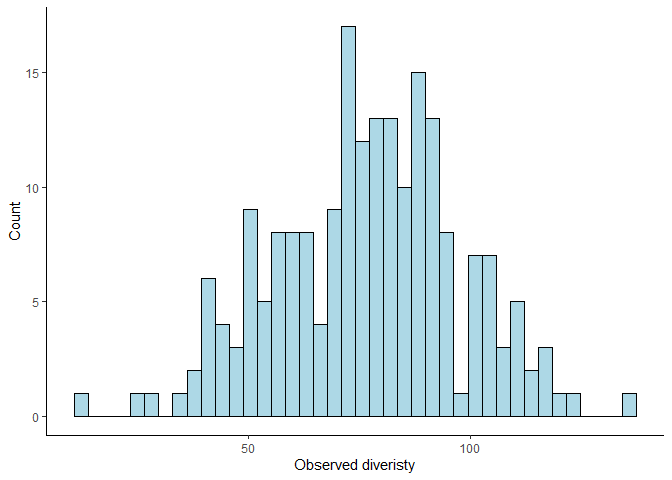<!-- -->

``` r
#Shannon
ggplot(data=alpha_div)+
  geom_histogram(aes(x=div_shannon_003), color="black", fill = "lightblue", bins=40)+theme_classic()+xlab("Shannon diversity")+ylab("Count")
```

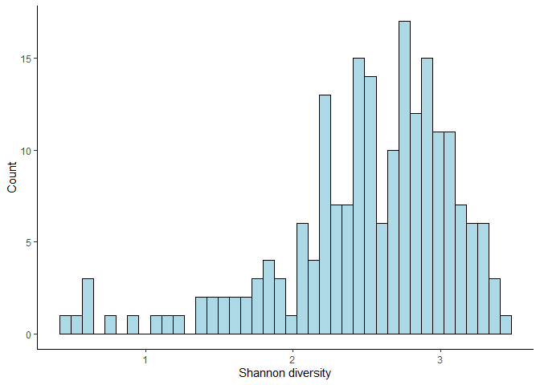<!-- -->

``` r
ggplot(data=alpha_div)+
  geom_histogram(aes(x=div_shannon_003^2), color="black", fill = "lightblue", bins=40)+theme_classic()+xlab("Squared Shannon diversity")+ylab("Count")
```

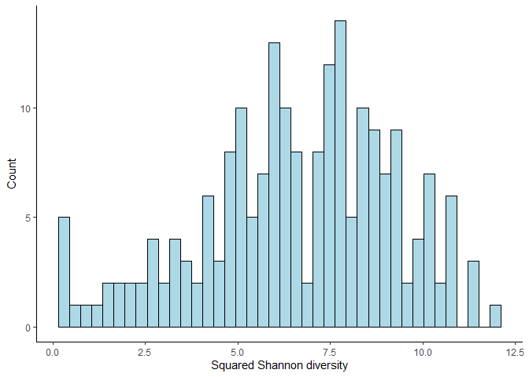<!-- -->

``` r
alpha_div$div_shannon_0032 <- (alpha_div$div_shannon_003)^2

#InvSimpson
ggplot(data=alpha_div)+
  geom_histogram(aes(x=div_invsimpson_003), color="black", fill = "lightblue", bins=40)+theme_classic()+xlab("Square rooted Inv. Simpson")+ylab("Count")
```

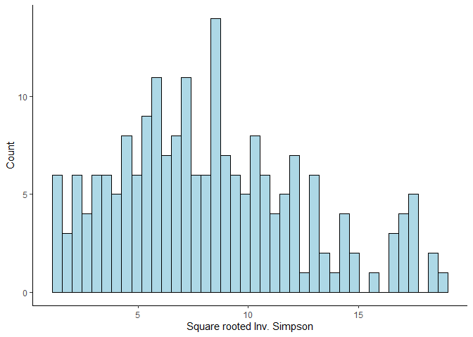<!-- -->

``` r
ggplot(data=alpha_div)+
  geom_histogram(aes(x=sqrt(div_invsimpson_003)), color="black", fill = "lightblue", bins=40)+theme_classic()+xlab("Square rooted Inv. Simpson")+ylab("Count")
```

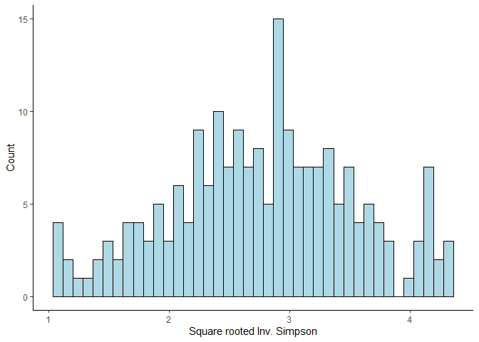<!-- -->

``` r
alpha_div$div_invsimpson_0032 <- sqrt(alpha_div$div_invsimpson_003)
```

# Does the alpha diversity associate with disease severity?

Visual inspection of alpha diversity \~ disease score:

``` r
#Clinical disease score:
alpha1 <- alpha_div %>% filter(!is.na(score))
alpha1$score <- factor(alpha1$score, levels=c("remission", "mild", "moderate", "severe"))

ggplot(alpha1)+
  geom_boxplot(aes(x=score, y=spec_nr_003, color=score))+theme_classic()+xlab("Disease score")+ylab("Observed diversity")+theme(legend.position = "none")
```

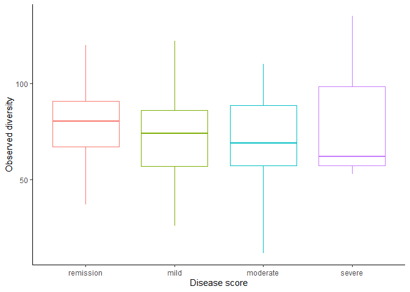<!-- -->

``` r
ggplot(alpha1)+
  geom_boxplot(aes(x=score, y=div_shannon_003, color=score))+theme_classic()+xlab("Disease score")+ylab("Shannon diversity")+theme(legend.position = "none")
```

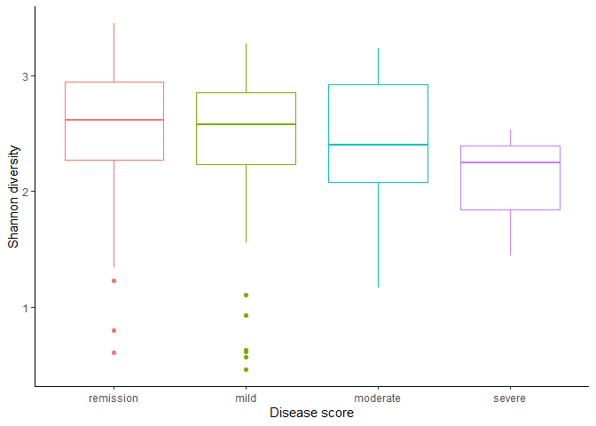<!-- -->

``` r
ggplot(alpha1)+
  geom_boxplot(aes(x=score, y=div_invsimpson_003, color=score))+theme_classic()+xlab("Disease score")+ylab("Inv. Simpson")+theme(legend.position = "none")
```

<!-- -->

``` r
#Paraclinical disease score
alpha2 <- alpha_div %>% filter(!is.na(f_cal_current))

ggplot(alpha2)+
  geom_point(aes(x=f_cal_current, y=spec_nr_003), size=1)+theme_classic()+xlab("Faecal calprotectin")+ylab("Observed diversity")+
  geom_vline(xintercept=250, color="blue", linetype = "dashed")
```

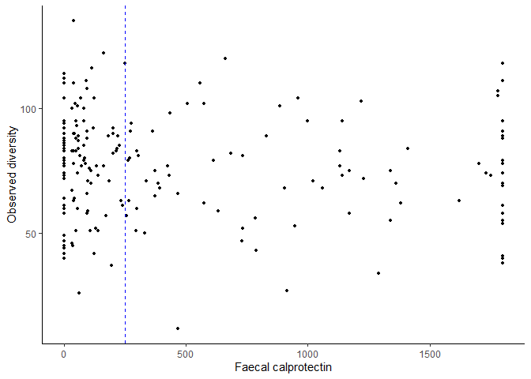<!-- -->

``` r
ggplot(alpha2)+
  geom_point(aes(x=f_cal_current, y=div_shannon_003), size=1)+theme_classic()+xlab("Faecal calprotectin")+ylab("Shannon diversity")+
  geom_vline(xintercept=250, color="blue", linetype = "dashed")
```

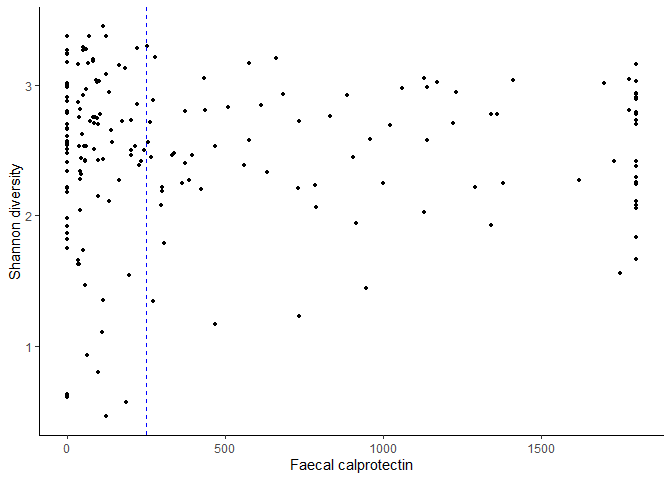<!-- -->

``` r
ggplot(alpha2)+
  geom_point(aes(x=f_cal_current, y=div_invsimpson_003), size=1)+theme_classic()+xlab("Faecal calprotectin")+ylab("Inv. Simpson")+
  geom_vline(xintercept=250, color="blue", linetype = "dashed")
```

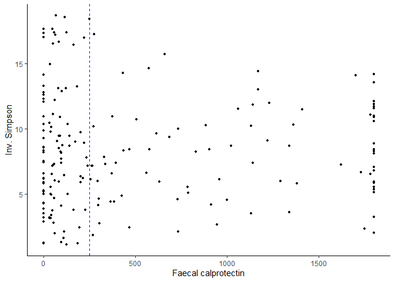<!-- -->

Test: Does alpha diversity associate with disease score? Tested using
linear mixed models

``` r
#Discrete numeric disease score
divs <- c("spec_nr_003", "div_shannon_0032","div_invsimpson_0032")

#Should interaction with age be included?
for (div in divs){
  form <- as.formula(paste0(div, "~ age_gr+study_gr+sex+asa+bio+pred_total+score_num*age_gr"))
  model1 <- lme(form, data=alpha_div, random=~1|person_ID, na.action=na.omit, correlation=corAR1(form=~time_point|person_ID))
  print(summary(model1)$tTable)
}
```

    ##                      Value Std.Error  DF    t-value      p-value
    ## (Intercept)      81.277718 13.484960 140  6.0272864 1.401182e-08
    ## age_gr           13.049127  7.412753  48  1.7603619 8.471724e-02
    ## study_gr         -7.654278  4.882723  48 -1.5676251 1.235382e-01
    ## sex              -4.972172  4.924705  48 -1.0096385 3.177311e-01
    ## asa              -2.445091  3.164216 140 -0.7727318 4.409838e-01
    ## bio              -4.656800  5.081960 140 -0.9163395 3.610646e-01
    ## pred_total        0.305202  4.108191 140  0.0742911 9.408848e-01
    ## score_num        -1.803870  5.030964 140 -0.3585536 7.204692e-01
    ## age_gr:score_num -2.151204  3.394763 140 -0.6336832 5.273215e-01
    ##                       Value Std.Error  DF    t-value     p-value
    ## (Intercept)       5.2316114 1.7664666 140  2.9616249 0.003596165
    ## age_gr            1.6584991 0.9603380  48  1.7269951 0.090599501
    ## study_gr         -0.2586174 0.6532203  48 -0.3959114 0.693924780
    ## sex              -0.3449357 0.6589021  48 -0.5235007 0.603034551
    ## asa              -0.1409861 0.4026111 140 -0.3501795 0.726730300
    ## bio               0.1671714 0.6462320 140  0.2586863 0.796257228
    ## pred_total        0.4315589 0.5173123 140  0.8342327 0.405571046
    ## score_num         0.2358691 0.6329789 140  0.3726335 0.709984798
    ## age_gr:score_num -0.4428821 0.4277569 140 -1.0353594 0.302286198
    ##                        Value Std.Error  DF    t-value      p-value
    ## (Intercept)       2.44696887 0.5288023 140  4.6273793 8.355090e-06
    ## age_gr            0.31171622 0.2899819  48  1.0749508 2.877707e-01
    ## study_gr          0.01381725 0.1913113  48  0.0722239 9.427238e-01
    ## sex              -0.11884760 0.1929216  48 -0.6160409 5.407781e-01
    ## asa              -0.03522192 0.1241872 140 -0.2836195 7.771210e-01
    ## bio               0.03145797 0.1979320 140  0.1589332 8.739505e-01
    ## pred_total        0.09522912 0.1606193 140  0.5928872 5.542132e-01
    ## score_num         0.04617532 0.1967316 140  0.2347122 8.147751e-01
    ## age_gr:score_num -0.09393508 0.1327680 140 -0.7075128 4.804240e-01

``` r
#Interaction is not significant. Fit without:

for (div in divs){
  form <- as.formula(paste0(div, "~ age_gr+study_gr+sex+asa+bio+pred_total+score_num"))
  model <- lme(form, data=alpha_div, random=~1|person_ID, na.action=na.omit, correlation=corAR1(form=~time_point|person_ID))
  assign(paste0("model_", div), model)
}
summary(model_spec_nr_003)$tTable
```

    ##                  Value Std.Error  DF    t-value      p-value
    ## (Intercept) 86.4000152 10.850345 141  7.9628817 5.059988e-13
    ## age_gr       9.5180869  4.970463  48  1.9149296 6.147096e-02
    ## study_gr    -7.6395266  4.896801  48 -1.5601056 1.253046e-01
    ## sex         -4.9711381  4.939176  48 -1.0064712 3.192359e-01
    ## asa         -2.7466344  3.133712 141 -0.8764794 3.822603e-01
    ## bio         -5.1389260  5.018653 141 -1.0239653 3.076052e-01
    ## pred_total   0.4008341  4.097293 141  0.0978290 9.222070e-01
    ## score_num   -4.7910982  1.635437 141 -2.9295522 3.960410e-03

``` r
summary(model_div_shannon_0032)$tTable
```

    ##                   Value Std.Error  DF     t-value      p-value
    ## (Intercept)  6.29272658 1.4525850 141  4.33208852 2.787993e-05
    ## age_gr       0.93282169 0.6671054  48  1.39831232 1.684470e-01
    ## study_gr    -0.25727049 0.6583065  48 -0.39080652 6.976695e-01
    ## sex         -0.34623446 0.6640747  48 -0.52137878 6.045003e-01
    ## asa         -0.19979653 0.3985074 141 -0.50136222 6.168981e-01
    ## bio          0.05360117 0.6382454 141  0.08398207 9.331898e-01
    ## pred_total   0.45623641 0.5168248 141  0.88276808 3.788641e-01
    ## score_num   -0.38268367 0.2054129 141 -1.86299740 6.454310e-02

``` r
summary(model_div_invsimpson_0032)$tTable
```

    ##                    Value  Std.Error  DF     t-value      p-value
    ## (Intercept)  2.671994073 0.42594018 141  6.27316744 4.075372e-09
    ## age_gr       0.157704394 0.19505906  48  0.80849561 4.227945e-01
    ## study_gr     0.014176270 0.19218452  48  0.07376385 9.415048e-01
    ## sex         -0.118870609 0.19381215  48 -0.61332899 5.425544e-01
    ## asa         -0.047395212 0.12282016 141 -0.38589113 7.001589e-01
    ## bio          0.007425735 0.19533588 141  0.03801521 9.697293e-01
    ## pred_total   0.100956985 0.16026376 141  0.62994270 5.297516e-01
    ## score_num   -0.085148313 0.06385599 141 -1.33344280 1.845367e-01

``` r
#Check diagnostic plots:
qqnorm(residuals(model_spec_nr_003))
```

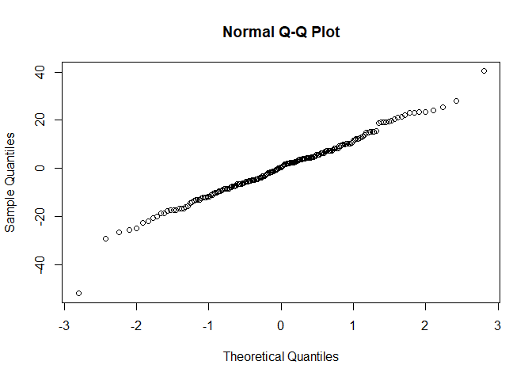<!-- -->

``` r
qqnorm(residuals(model_div_shannon_0032))
```

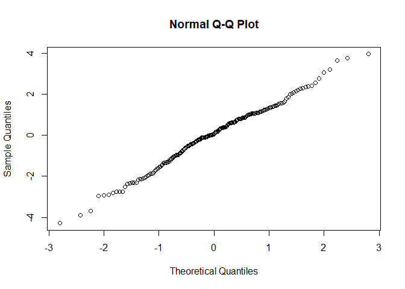<!-- -->

``` r
qqnorm(residuals(model_div_invsimpson_0032))
```

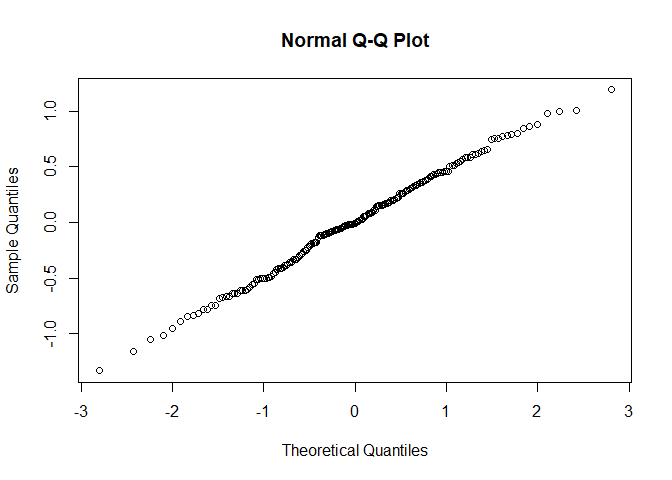<!-- -->

``` r
plot(model_spec_nr_003)
```

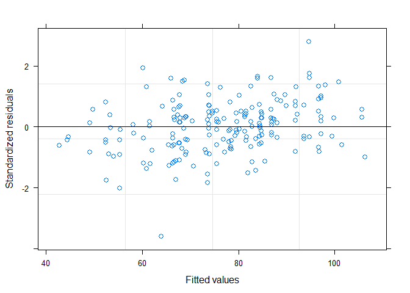<!-- -->

``` r
plot(model_div_shannon_0032)
```

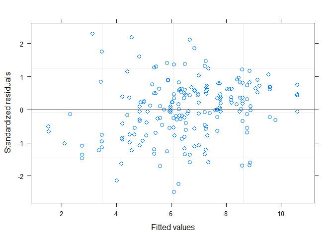<!-- -->

``` r
plot(model_div_invsimpson_0032)
```

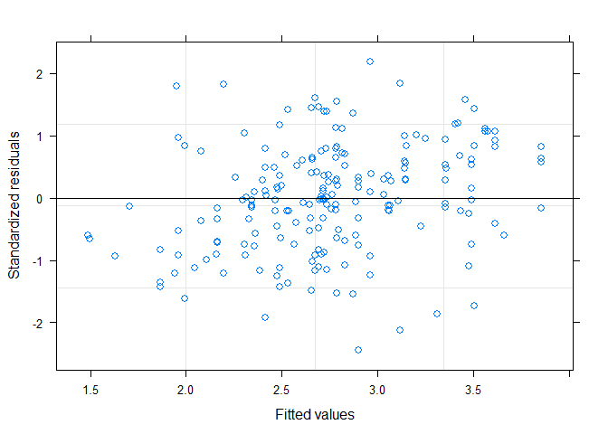<!-- -->

``` r
ggplot()+
  geom_histogram(aes(x=residuals(model_spec_nr_003)), bins=30)
```

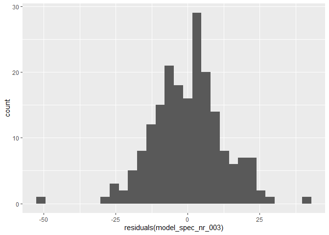<!-- -->

``` r
ggplot()+
  geom_histogram(aes(x=residuals(model_div_shannon_0032)), bins=30)
```

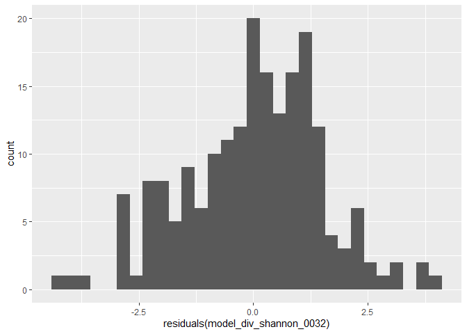<!-- -->

``` r
ggplot()+
  geom_histogram(aes(x=residuals(model_div_invsimpson_0032)), bins=30)
```

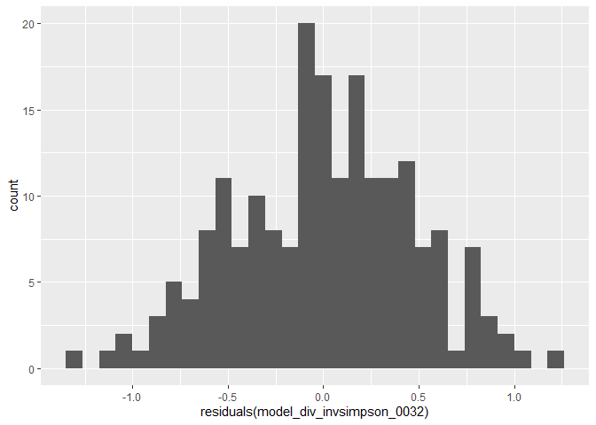<!-- -->

``` r
#Numeric faecal calprotectin
divs <- c("spec_nr_003", "div_shannon_0032","div_invsimpson_0032")

#Should interaction with age be included?
for (div in divs){
  form <- as.formula(paste0(div, "~ age_gr+study_gr+sex+asa+bio+pred_total+f_cal_current*age_gr"))
  model1 <- lme(form, data=alpha_div, random=~1|person_ID, na.action=na.omit, correlation=corAR1(form=~time_point|person_ID))
  print(summary(model1)$tTable)
}
```

    ##                             Value    Std.Error  DF    t-value      p-value
    ## (Intercept)          82.826334294 11.343787709 138  7.3014708 2.053556e-11
    ## age_gr                7.667832615  5.503802354  48  1.3931882 1.699815e-01
    ## study_gr             -8.014322176  4.912942113  48 -1.6312674 1.093787e-01
    ## sex                  -4.923283214  4.964219886  48 -0.9917537 3.262910e-01
    ## asa                  -2.949971075  3.249333754 138 -0.9078695 3.655298e-01
    ## bio                  -4.953456886  5.154142570 138 -0.9610632 3.382013e-01
    ## pred_total           -1.819133409  4.242641852 138 -0.4287737 6.687565e-01
    ## f_cal_current        -0.004675912  0.005915864 138 -0.7904021 4.306491e-01
    ## age_gr:f_cal_current  0.002979614  0.003935322 138  0.7571462 4.502531e-01
    ##                              Value    Std.Error  DF     t-value      p-value
    ## (Intercept)           5.4414644794 1.5002688398 138  3.62699293 0.0004025834
    ## age_gr                1.2455477963 0.7233045978  48  1.72202389 0.0915042432
    ## study_gr             -0.4228755385 0.6574143986  48 -0.64324046 0.5231293665
    ## sex                  -0.4962995130 0.6637335907  48 -0.74773903 0.4582653946
    ## asa                  -0.0399127787 0.4074355337 138 -0.09796097 0.9221054291
    ## bio                   0.1464417150 0.6424277031 138  0.22795050 0.8200221246
    ## pred_total            0.1988616505 0.5253737026 138  0.37851466 0.7056299732
    ## f_cal_current         0.0006429758 0.0007198171 138  0.89324881 0.3732790203
    ## age_gr:f_cal_current -0.0003893560 0.0004829583 138 -0.80618975 0.4215205383
    ##                              Value    Std.Error  DF    t-value      p-value
    ## (Intercept)           2.3360745502 0.4387108941 138  5.3248610 3.997386e-07
    ## age_gr                0.3340576286 0.2118702949  48  1.5767082 1.214313e-01
    ## study_gr             -0.0404428742 0.1909409718  48 -0.2118083 8.331534e-01
    ## sex                  -0.1723968036 0.1927605352  48 -0.8943574 3.755935e-01
    ## asa                   0.0154365868 0.1236860724 138  0.1248046 9.008599e-01
    ## bio                   0.0474517694 0.1935096335 138  0.2452166 8.066530e-01
    ## pred_total            0.0199316340 0.1600261136 138  0.1245524 9.010592e-01
    ## f_cal_current         0.0003843394 0.0002198843 138  1.7479169 8.270250e-02
    ## age_gr:f_cal_current -0.0002442973 0.0001475967 138 -1.6551675 1.001630e-01

``` r
#Interaction is not significant. Fit again without interaction: 

for (div in divs){
  form <- as.formula(paste0(div, "~ age_gr+study_gr+sex+asa+bio+pred_total+f_cal_current"))
  model <- lme(form, data=alpha_div, random=~1|person_ID, na.action=na.omit,correlation=corAR1(form=~time_point|person_ID))
  assign(paste0("model_", div), model)
}
summary(model_spec_nr_003)$tTable
```

    ##                       Value    Std.Error  DF    t-value      p-value
    ## (Intercept)   80.1232781722 10.720603743 139  7.4737655 7.904097e-12
    ## age_gr         9.3888385240  4.964997449  48  1.8910057 6.466721e-02
    ## study_gr      -8.0035802461  4.879329822  48 -1.6403032 1.074801e-01
    ## sex           -4.8366605107  4.930476620  48 -0.9809722 3.315252e-01
    ## asa           -2.7762186889  3.237362094 139 -0.8575558 3.926140e-01
    ## bio           -4.9021398449  5.141648421 139 -0.9534179 3.420334e-01
    ## pred_total    -1.9527223131  4.238493094 139 -0.4607115 6.457256e-01
    ## f_cal_current -0.0004297661  0.001945365 139 -0.2209180 8.254805e-01

``` r
summary(model_div_shannon_0032)$tTable
```

    ##                       Value   Std.Error  DF    t-value      p-value
    ## (Intercept)    5.789533e+00 1.453286215 139  3.9837526 0.0001089815
    ## age_gr         1.018888e+00 0.673654096  48  1.5124795 0.1369686175
    ## study_gr      -4.203907e-01 0.663694933  48 -0.6334095 0.5294729378
    ## sex           -5.076492e-01 0.670116393  48 -0.7575538 0.4524212387
    ## asa           -6.206228e-02 0.405789844 139 -0.1529419 0.8786658659
    ## bio            1.255572e-01 0.641420748 139  0.1957485 0.8450928634
    ## pred_total     2.138973e-01 0.523841168 139  0.4083247 0.6836636608
    ## f_cal_current  9.448892e-05 0.000236656 139  0.3992669 0.6903093134

``` r
summary(model_div_invsimpson_0032)$tTable
```

    ##                       Value    Std.Error  DF      t-value      p-value
    ## (Intercept)    2.552992e+00 4.272008e-01 139  5.976094036 1.823631e-08
    ## age_gr         1.906359e-01 1.977705e-01  48  0.963924887 3.399149e-01
    ## study_gr      -3.686798e-02 1.945971e-01  48 -0.189458076 8.505327e-01
    ## sex           -1.764115e-01 1.964662e-01  48 -0.897922935 3.737087e-01
    ## asa            6.666677e-04 1.239174e-01 139  0.005379936 9.957152e-01
    ## bio            3.093079e-02 1.947295e-01 139  0.158839815 8.740256e-01
    ## pred_total     2.878194e-02 1.605213e-01 139  0.179302904 8.579610e-01
    ## f_cal_current  3.993611e-05 7.278408e-05 139  0.548692957 5.840964e-01

``` r
#Check diagnostic plots:
qqnorm(residuals(model_spec_nr_003))
```

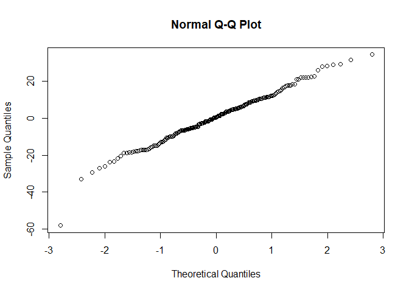<!-- -->

``` r
qqnorm(residuals(model_div_shannon_0032))
```

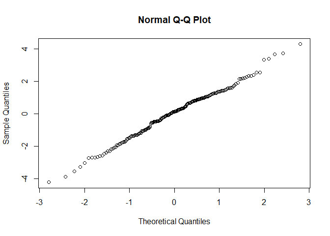<!-- -->

``` r
qqnorm(residuals(model_div_invsimpson_0032))
```

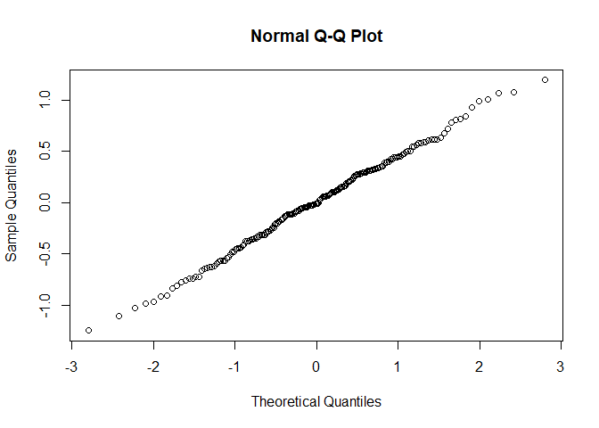<!-- -->

``` r
plot(model_spec_nr_003)
```

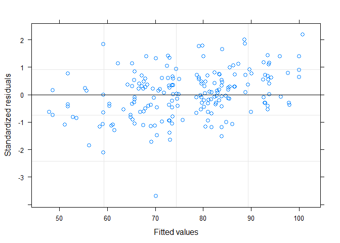<!-- -->

``` r
plot(model_div_shannon_0032)
```

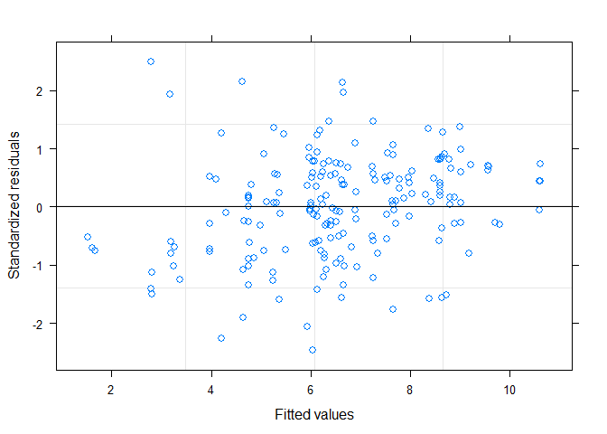<!-- -->

``` r
plot(model_div_invsimpson_0032)
```

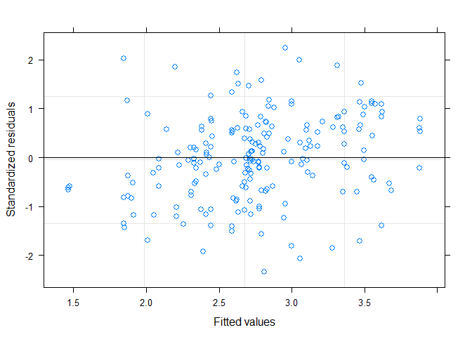<!-- -->

``` r
ggplot()+
  geom_histogram(aes(x=residuals(model_spec_nr_003)), bins=30)
```

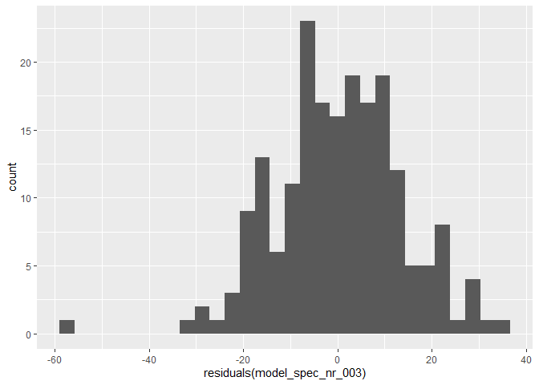<!-- -->

``` r
ggplot()+
  geom_histogram(aes(x=residuals(model_div_shannon_0032)), bins=30)
```

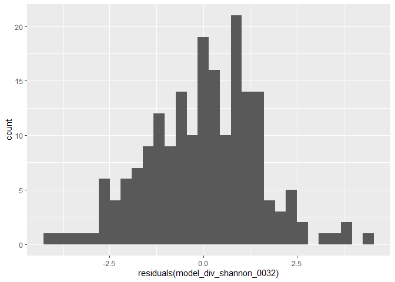<!-- -->

``` r
ggplot()+
  geom_histogram(aes(x=residuals(model_div_invsimpson_0032)), bins=30)
```

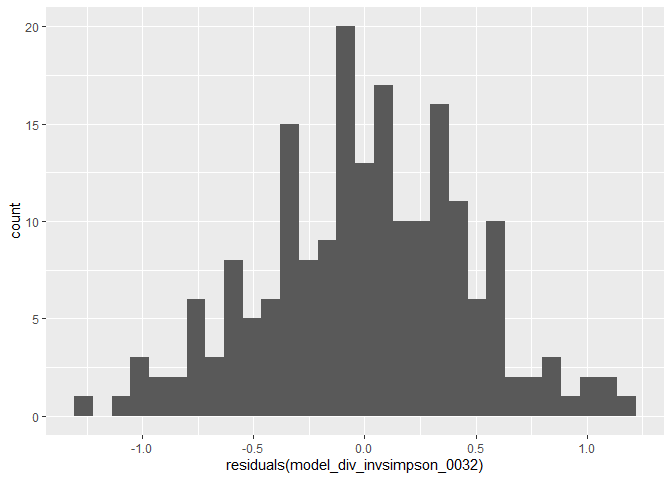<!-- -->

# Does beta diversity associate with disease score?

Tested with PERMANOVA

``` r
#Clinical disease score
#Number of samples/participant must be even! Select samples with 4 datapoints
ent <- subset_samples(ps_relab, !is.na(score))
df <- data.frame(sample_data(ent))
n_df <- df %>% group_by(person_ID) %>% summarise(n=n()) %>% filter(n>3)
df_reduced <- df %>% filter(person_ID %in% n_df$person_ID)
reduce <- df_reduced %>% group_by(person_ID)%>% arrange(time_point) %>% slice(1:4) %>% ungroup()
ps_reduced <- subset_samples(ps_relab, J_ID %in% reduce$J_ID)
reduce <- data.frame(sample_data(ps_reduced))
reduce$score_num <- ifelse(reduce$score == "remission", 1, ifelse(reduce$score == "mild", 2, ifelse(reduce$score == "moderate", 3, 4)))
reduce <- merge(reduce, meta) 
reduce <- reduce %>% dplyr::select(age_gr, study_gr, sex, asa, bio, pred_total, score_num, person_ID)

#Permutation design:
perm <- how(within=Within(type="none"), plots=Plots(strata=reduce$person_ID, type="free"), nperm=999)
perm2 <- how(within=Within(type="free"), plots=Plots(strata=reduce$person_ID, type="none"), nperm=999)

set.seed(1)
#Bray Curtis:
adonis2(t(otu_table(ps_reduced))~age_gr+study_gr+sex+asa+bio+pred_total+score_num, data=reduce, method="bray", permutations=perm2, by="margin")
```

    ## Permutation test for adonis under reduced model
    ## Marginal effects of terms
    ## Plots: reduce$person_ID, plot permutation: none
    ## Permutation: free
    ## Number of permutations: 999
    ## 
    ## adonis2(formula = t(otu_table(ps_reduced)) ~ age_gr + study_gr + sex + asa + bio + pred_total + score_num, data = reduce, permutations = perm2, method = "bray", by = "margin")
    ##             Df SumOfSqs      R2      F Pr(>F)   
    ## age_gr       1    0.883 0.02017 3.0603  0.925   
    ## study_gr     1    0.896 0.02045 3.1029  0.686   
    ## sex          1    0.726 0.01657 2.5148  0.056 . 
    ## asa          1    0.827 0.01888 2.8641  0.181   
    ## bio          1    0.459 0.01048 1.5907  0.206   
    ## pred_total   1    0.724 0.01653 2.5084  0.005 **
    ## score_num    1    0.333 0.00760 1.1527  0.062 . 
    ## Residual   132   38.105 0.86998                 
    ## Total      139   43.800 1.00000                 
    ## ---
    ## Signif. codes:  0 '***' 0.001 '**' 0.01 '*' 0.05 '.' 0.1 ' ' 1

``` r
set.seed(1)
#Jaccard
adonis2(t(otu_table(ps_reduced))~age_gr+study_gr+sex+asa+bio+pred_total+score_num, data=reduce, method="jaccard", binary=T,  permutations=perm2, by="margin")
```

    ## Permutation test for adonis under reduced model
    ## Marginal effects of terms
    ## Plots: reduce$person_ID, plot permutation: none
    ## Permutation: free
    ## Number of permutations: 999
    ## 
    ## adonis2(formula = t(otu_table(ps_reduced)) ~ age_gr + study_gr + sex + asa + bio + pred_total + score_num, data = reduce, permutations = perm2, method = "jaccard", by = "margin", binary = T)
    ##             Df SumOfSqs      R2      F Pr(>F)    
    ## age_gr       1    0.826 0.02396 3.7276  0.712    
    ## study_gr     1    0.885 0.02568 3.9956  0.946    
    ## sex          1    0.740 0.02147 3.3402  0.050 *  
    ## asa          1    0.604 0.01753 2.7276  0.001 ***
    ## bio          1    0.599 0.01738 2.7036  0.009 ** 
    ## pred_total   1    0.331 0.00960 1.4929  0.323    
    ## score_num    1    0.315 0.00914 1.4218  0.001 ***
    ## Residual   132   29.243 0.84847                  
    ## Total      139   34.465 1.00000                  
    ## ---
    ## Signif. codes:  0 '***' 0.001 '**' 0.01 '*' 0.05 '.' 0.1 ' ' 1

``` r
#Aitchison
ent <- subset_samples(ps_clr, !is.na(score))
df <- data.frame(sample_data(ent))
n_df <- df %>% group_by(person_ID) %>% summarise(n=n()) %>% filter(n>4)
df_reduced <- df %>% filter(person_ID %in% n_df$person_ID)
reduce <- df_reduced %>% group_by(person_ID)%>% arrange(time_point) %>% slice(1:4) %>% ungroup()
ps_reduced <- subset_samples(ps_clr, J_ID %in% reduce$J_ID)
reduce <- data.frame(sample_data(ps_reduced))
reduce$score_num <- ifelse(reduce$score == "remission", 1, ifelse(reduce$score == "mild", 2, ifelse(reduce$score == "moderate", 3, 4)))
reduce <- merge(reduce, meta) 
reduce <- reduce %>% dplyr::select(age_gr, study_gr, sex, asa, bio, pred_total, score_num, person_ID)

perm <- how(within=Within(type="none"), plots=Plots(strata=reduce$person_ID, type="free"), nperm=999)
perm2 <- how(within=Within(type="free"), plots=Plots(strata=reduce$person_ID, type="none"), nperm=999)

set.seed(1)
adonis2(otu_table(ps_reduced)~age_gr+study_gr+sex+asa+bio+pred_total+score_num, data=reduce, method="euclidean", permutations=perm2, by="margin")
```

    ## Permutation test for adonis under reduced model
    ## Marginal effects of terms
    ## Plots: reduce$person_ID, plot permutation: none
    ## Permutation: free
    ## Number of permutations: 999
    ## 
    ## adonis2(formula = otu_table(ps_reduced) ~ age_gr + study_gr + sex + asa + bio + pred_total + score_num, data = reduce, permutations = perm2, method = "euclidean", by = "margin")
    ##            Df SumOfSqs      R2      F Pr(>F)    
    ## age_gr      1    11289 0.03593 3.5690  0.154    
    ## study_gr    1    10301 0.03279 3.2564  0.980    
    ## sex         1    15022 0.04781 4.7489  0.012 *  
    ## asa         1     7013 0.02232 2.2169  0.001 ***
    ## bio         1     9098 0.02896 2.8762  0.001 ***
    ## pred_total  1     5585 0.01778 1.7656  0.020 *  
    ## score_num   1     4255 0.01354 1.3452  0.025 *  
    ## Residual   76   240402 0.76519                  
    ## Total      83   314175 1.00000                  
    ## ---
    ## Signif. codes:  0 '***' 0.001 '**' 0.01 '*' 0.05 '.' 0.1 ' ' 1

``` r
#Paraclinical disease score
#Number of samples/participant must be even! Select samples with 4 datapoints
ent <- subset_samples(ps_relab, !is.na(f_cal_current))
df <- data.frame(sample_data(ent))
n_df <- df %>% group_by(person_ID) %>% summarise(n=n()) %>% filter(n>3)
df_reduced <- df %>% filter(person_ID %in% n_df$person_ID)
reduce <- df_reduced %>% group_by(person_ID)%>% arrange(time_point) %>% slice(1:4) %>% ungroup()
ps_reduced <- subset_samples(ps_relab, J_ID %in% reduce$J_ID)
reduce <- data.frame(sample_data(ps_reduced))
reduce <- merge(reduce, meta) 
reduce <- reduce %>% dplyr::select(age_gr, study_gr, sex, asa, bio, pred_total, f_cal_current, person_ID)

#Permutation design:
perm <- how(within=Within(type="none"), plots=Plots(strata=reduce$person_ID, type="free"), nperm=999)
perm2 <- how(within=Within(type="free"), plots=Plots(strata=reduce$person_ID, type="none"), nperm=999)

set.seed(1)
#Bray Curtis:
adonis2(t(otu_table(ps_reduced))~age_gr+study_gr+sex+asa+bio+pred_total+f_cal_current, data=reduce, method="bray", permutations=perm2, by="margin")
```

    ## Permutation test for adonis under reduced model
    ## Marginal effects of terms
    ## Plots: reduce$person_ID, plot permutation: none
    ## Permutation: free
    ## Number of permutations: 999
    ## 
    ## adonis2(formula = t(otu_table(ps_reduced)) ~ age_gr + study_gr + sex + asa + bio + pred_total + f_cal_current, data = reduce, permutations = perm2, method = "bray", by = "margin")
    ##                Df SumOfSqs      R2      F Pr(>F)   
    ## age_gr          1    0.919 0.02097 3.1839  0.883   
    ## study_gr        1    0.822 0.01875 2.8465  0.792   
    ## sex             1    0.715 0.01632 2.4777  0.105   
    ## asa             1    0.858 0.01957 2.9708  0.070 . 
    ## bio             1    0.453 0.01034 1.5690  0.333   
    ## pred_total      1    0.710 0.01620 2.4588  0.010 **
    ## f_cal_current   1    0.445 0.01016 1.5420  0.005 **
    ## Residual      132   38.110 0.86952                 
    ## Total         139   43.829 1.00000                 
    ## ---
    ## Signif. codes:  0 '***' 0.001 '**' 0.01 '*' 0.05 '.' 0.1 ' ' 1

``` r
set.seed(1)
#Jaccard
adonis2(t(otu_table(ps_reduced))~age_gr+study_gr+sex+asa+bio+pred_total+f_cal_current, data=reduce, method="jaccard", binary=T, permutations=perm2, by="margin")
```

    ## Permutation test for adonis under reduced model
    ## Marginal effects of terms
    ## Plots: reduce$person_ID, plot permutation: none
    ## Permutation: free
    ## Number of permutations: 999
    ## 
    ## adonis2(formula = t(otu_table(ps_reduced)) ~ age_gr + study_gr + sex + asa + bio + pred_total + f_cal_current, data = reduce, permutations = perm2, method = "jaccard", by = "margin", binary = T)
    ##                Df SumOfSqs      R2      F Pr(>F)    
    ## age_gr          1    0.803 0.02319 3.6074  0.440    
    ## study_gr        1    0.955 0.02758 4.2893  0.684    
    ## sex             1    0.701 0.02026 3.1505  0.097 .  
    ## asa             1    0.617 0.01781 2.7697  0.001 ***
    ## bio             1    0.572 0.01652 2.5687  0.032 *  
    ## pred_total      1    0.358 0.01033 1.6073  0.164    
    ## f_cal_current   1    0.382 0.01103 1.7159  0.003 ** 
    ## Residual      132   29.385 0.84869                  
    ## Total         139   34.624 1.00000                  
    ## ---
    ## Signif. codes:  0 '***' 0.001 '**' 0.01 '*' 0.05 '.' 0.1 ' ' 1

``` r
#Aitchison
ent <- subset_samples(ps_clr, !is.na(f_cal_current))
df <- data.frame(sample_data(ent))
n_df <- df %>% group_by(person_ID) %>% summarise(n=n()) %>% filter(n>4)
df_reduced <- df %>% filter(person_ID %in% n_df$person_ID)
reduce <- df_reduced %>% group_by(person_ID)%>% arrange(time_point) %>% slice(1:4) %>% ungroup()
ps_reduced <- subset_samples(ps_clr, J_ID %in% reduce$J_ID)
reduce <- data.frame(sample_data(ps_reduced))
reduce <- merge(reduce, meta) 
reduce <- reduce %>% dplyr::select(age_gr, study_gr, sex, asa, bio, pred_total, f_cal_current, person_ID)

perm <- how(within=Within(type="none"), plots=Plots(strata=reduce$person_ID, type="free"), nperm=999)
perm2 <- how(within=Within(type="free"), plots=Plots(strata=reduce$person_ID, type="none"), nperm=999)

adonis2(otu_table(ps_reduced)~age_gr+study_gr+sex+asa+bio+pred_total+f_cal_current, data=reduce, method="euclidean", permutations=perm2, by="margin")
```

    ## Permutation test for adonis under reduced model
    ## Marginal effects of terms
    ## Plots: reduce$person_ID, plot permutation: none
    ## Permutation: free
    ## Number of permutations: 999
    ## 
    ## adonis2(formula = otu_table(ps_reduced) ~ age_gr + study_gr + sex + asa + bio + pred_total + f_cal_current, data = reduce, permutations = perm2, method = "euclidean", by = "margin")
    ##               Df SumOfSqs      R2      F Pr(>F)    
    ## age_gr         1    12927 0.04420 4.1932  0.241    
    ## study_gr       1    12713 0.04347 4.1237  0.686    
    ## sex            1    13964 0.04774 4.5293  0.001 ***
    ## asa            1     6605 0.02258 2.1425  0.001 ***
    ## bio            1     8292 0.02835 2.6898  0.010 ** 
    ## pred_total     1     2928 0.01001 0.9497  0.668    
    ## f_cal_current  1     4816 0.01647 1.5622  0.001 ***
    ## Residual      72   221972 0.75896                  
    ## Total         79   292468 1.00000                  
    ## ---
    ## Signif. codes:  0 '***' 0.001 '**' 0.01 '*' 0.05 '.' 0.1 ' ' 1

# Stability analysis of the microbiome across age groups and study groups

Investigation of the fluctureation of the microbiome. Is it dependend on
age group? Or on study group? Calculation of distance (beta diversity)
between sample 1 and sample 5 from the same individual. Is this internal
distance dependend on the groups?

``` r
#Select timepoint 1 and timepoint 5
df <- data.frame(sample_data(ps_relab))
df <- df %>% filter(time_point %in% c(0,4))
n_df <- df %>% group_by(person_ID) %>% summarise(n=n()) %>% filter(n>1) 
t1t5 <- df %>% filter(person_ID %in% n_df$person_ID)
ps_t1t5 <- subset_samples(ps_relab, J_ID %in% t1t5$J_ID)

#Calculate beta div
bc_meta <-  phyloseq::distance(ps_t1t5, method="bray")
jac_meta <- phyloseq::distance(ps_t1t5, method="jaccard", binary=T)

#Transform into table
bc_meta <- as.matrix(bc_meta)
bc_meta <- as.data.frame(bc_meta)
jac_meta <- as.matrix(jac_meta)
jac_meta <- as.data.frame(jac_meta)

#Make new dataframe
t1 <- t1t5 %>% group_by(person_ID) %>% arrange(time_point) %>% slice(1) %>% ungroup()
t5 <- t1t5 %>% group_by(person_ID) %>% arrange(time_point) %>% slice(n()) %>% ungroup()

df_dist<- tibble(person_ID=t1$person_ID, J1 = t1$J_ID, J2=t5$J_ID, dist_bc=rep(NA, nrow(t1)), dist_jac=rep(NA, nrow(t1)),age_gr= as.factor(t1$age_gr), study_gr= as.factor(t1$study_gr), sex = as.factor(t1$sex))

df_dist$asa <- as.factor(ifelse(t1$asa==0 & t5$asa==0, 1, ifelse(t1$asa==1 & t5$asa==0, 2, ifelse(t1$asa==0 & t5$asa==1, 3, 4))))
df_dist$bio <- as.factor(ifelse(t1$bio==0 & t5$bio==0, 1, ifelse(t1$bio==1 & t5$bio==0, 2, ifelse(t1$bio==0 & t5$bio==1, 3, 4))))
df_dist$pred <- as.factor(ifelse(t1$pred==0 & t5$pred==0, 1, ifelse(t1$pred==1 & t5$pred==0, 2, ifelse(t1$pred==0 & t5$pred==1, 3, 4))))

df_dist <- as.data.frame(df_dist)
for (i in 1:nrow(df_dist)){
  df_dist[i,"dist_bc"] <- bc_meta[df_dist$J1[i], df_dist$J2[i]]
  df_dist[i,"dist_jac"] <- jac_meta[df_dist$J1[i], df_dist$J2[i]]
}

#Make boxplot:
df_dist$study_gr1 <- ifelse(df_dist$study_gr==1, "Newly diagnosed", ifelse(df_dist$study_gr==2, "Older diagnosis", NA))

ggplot(data=df_dist,aes(x=study_gr1, y=dist_bc))+
  geom_violin(aes( color=study_gr1))+geom_dotplot(binaxis='y', stackdir='center', dotsize=1)+theme_classic()+theme(legend.position = "none")+
  xlab(" ") + ylab("Bray curtis distance")
```

    ## `stat_bindot()` using `bins = 30`. Pick better value with `binwidth`.

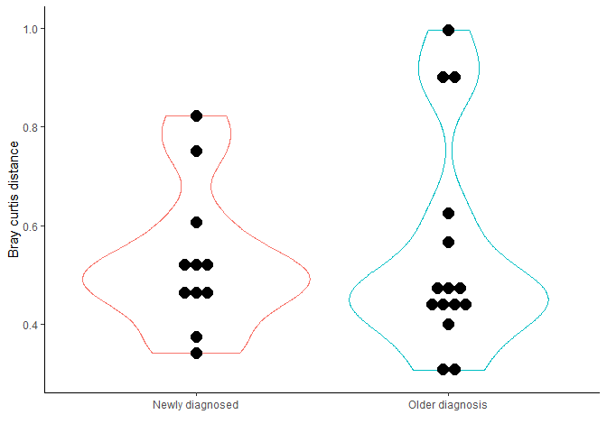<!-- -->

``` r
ggplot(data=df_dist,aes(x=study_gr1, y=dist_jac))+
  geom_violin(aes( color=study_gr1))+geom_dotplot(binaxis='y', stackdir='center', dotsize=1)+theme_classic()+theme(legend.position = "none")+
  xlab(" ") + ylab("Jaccard distance")
```

    ## `stat_bindot()` using `bins = 30`. Pick better value with `binwidth`.

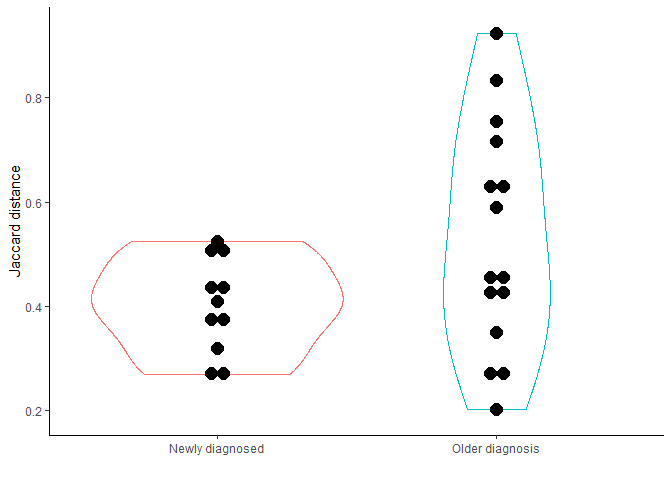<!-- -->

``` r
ggplot(data=df_dist)+
  geom_boxplot(aes(x=study_gr1, y=dist_bc, color=study_gr1))+theme_classic()+theme(legend.position = "none")+
  xlab(" ") + ylab("Bray curtis distance")
```

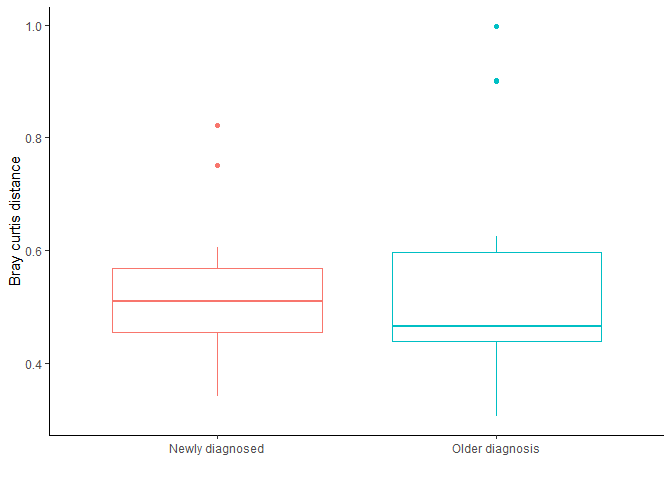<!-- -->

``` r
ggplot(data=df_dist)+
  geom_boxplot(aes(x=study_gr1, y=dist_jac, color=study_gr1))+theme_classic()+theme(legend.position = "none")+
  xlab(" ") + ylab("Jaccard distance")
```

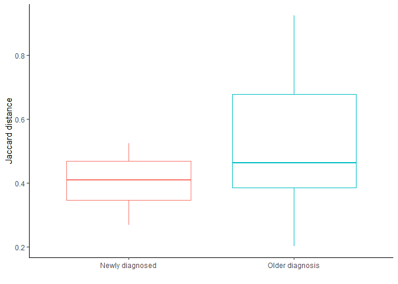<!-- -->

``` r
df_dist$age_gr1 <- ifelse(df_dist$age_gr==1, "Children", ifelse(df_dist$age_gr==2, "Adults", NA))
df_dist$age_gr1 <- factor(df_dist$age_gr1, levels=c("Children", "Adults"))

ggplot(data=df_dist,aes(x=age_gr1, y=dist_bc))+
  geom_violin(aes( color=age_gr1))+geom_dotplot(binaxis='y', stackdir='center', dotsize=1)+theme_classic()+theme(legend.position = "none")+
  xlab(" ") + ylab("Bray curtis distance")
```

    ## `stat_bindot()` using `bins = 30`. Pick better value with `binwidth`.

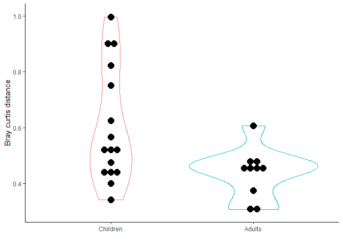<!-- -->

``` r
ggplot(data=df_dist,aes(x=age_gr1, y=dist_jac))+
  geom_violin(aes( color=age_gr1))+geom_dotplot(binaxis='y', stackdir='center', dotsize=1)+theme_classic()+theme(legend.position = "none")+
  xlab(" ") + ylab("Jaccard distance")
```

    ## `stat_bindot()` using `bins = 30`. Pick better value with `binwidth`.

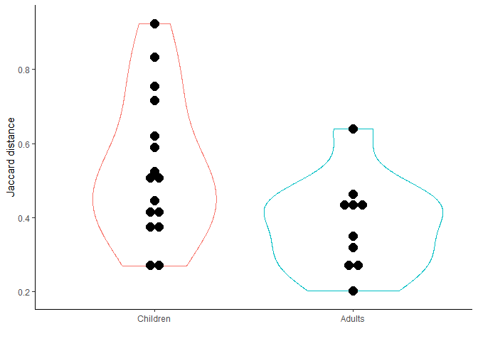<!-- -->

``` r
ggplot(data=df_dist)+
  geom_boxplot(aes(x=age_gr1, y=dist_bc, color=age_gr1))+theme_classic()+theme(legend.position = "none")+
  xlab(" ") + ylab("Bray curtis distance")
```

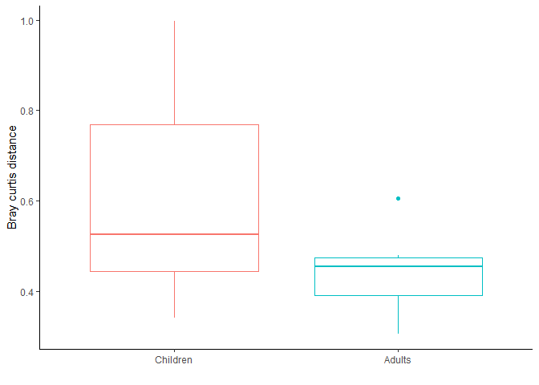<!-- -->

``` r
ggplot(data=df_dist)+
  geom_boxplot(aes(x=age_gr1, y=dist_jac, color=age_gr1))+theme_classic()+theme(legend.position = "none")+
  xlab(" ") + ylab("Jaccard distance")
```

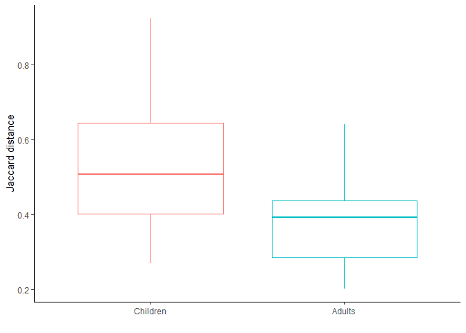<!-- -->

``` r
#Test if there is a difference using permutation ANOVA: Bray Curtis
set.seed(1)
res <- anova(lm(formula=dist_bc~age_gr+study_gr+sex+asa+bio+pred, data=df_dist))
res
```

    ## Analysis of Variance Table
    ## 
    ## Response: dist_bc
    ##           Df  Sum Sq  Mean Sq F value  Pr(>F)  
    ## age_gr     1 0.17077 0.170765  5.6439 0.03234 *
    ## study_gr   1 0.00290 0.002896  0.0957 0.76158  
    ## sex        1 0.01476 0.014761  0.4878 0.49633  
    ## asa        3 0.18102 0.060341  1.9943 0.16121  
    ## bio        3 0.06365 0.021216  0.7012 0.56684  
    ## pred       2 0.01529 0.007646  0.2527 0.78017  
    ## Residuals 14 0.42360 0.030257                  
    ## ---
    ## Signif. codes:  0 '***' 0.001 '**' 0.01 '*' 0.05 '.' 0.1 ' ' 1

``` r
summary(lm(formula=dist_bc~age_gr+study_gr+sex+asa+bio+pred, data=df_dist))
```

    ## 
    ## Call:
    ## lm(formula = dist_bc ~ age_gr + study_gr + sex + asa + bio + 
    ##     pred, data = df_dist)
    ## 
    ## Residuals:
    ##      Min       1Q   Median       3Q      Max 
    ## -0.23684 -0.07137 -0.00312  0.07743  0.31722 
    ## 
    ## Coefficients:
    ##              Estimate Std. Error t value Pr(>|t|)   
    ## (Intercept)  0.583618   0.142074   4.108  0.00107 **
    ## age_gr2     -0.294506   0.170228  -1.730  0.10559   
    ## study_gr2    0.069110   0.124214   0.556  0.58673   
    ## sex1         0.090755   0.127203   0.713  0.48728   
    ## asa2         0.240664   0.193949   1.241  0.23505   
    ## asa3        -0.006231   0.144142  -0.043  0.96613   
    ## asa4        -0.116383   0.196204  -0.593  0.56252   
    ## bio2         0.209538   0.185676   1.129  0.27807   
    ## bio3        -0.090868   0.197495  -0.460  0.65251   
    ## bio4        -0.060447   0.207363  -0.292  0.77494   
    ## pred2        0.045834   0.140319   0.327  0.74877   
    ## pred3       -0.200658   0.317718  -0.632  0.53785   
    ## ---
    ## Signif. codes:  0 '***' 0.001 '**' 0.01 '*' 0.05 '.' 0.1 ' ' 1
    ## 
    ## Residual standard error: 0.1739 on 14 degrees of freedom
    ## Multiple R-squared:  0.5142, Adjusted R-squared:  0.1325 
    ## F-statistic: 1.347 on 11 and 14 DF,  p-value: 0.2954

``` r
df_test_age <- rep(NA, 1000)
df_test_study <- rep(NA, 1000)
for (i in 1:1000){
    #Permute and save F-statistic: Age group
    df_shuffle_age <- df_dist
    df_shuffle_age$age_gr <- sample(x=df_shuffle_age$age_gr, size=nrow(df_dist))
    test_age <- as.data.frame(anova(lm(formula=dist_bc~age_gr+study_gr+sex+asa+bio+pred, data=df_shuffle_age)))
    df_test_age[i] <- test_age["age_gr", "F value"]
    
    #Permute and save F-statistic: Study group
    df_shuffle_study <- df_dist
    df_shuffle_study$study_gr <- sample(x=df_shuffle_study$study_gr, size=nrow(df_dist))
    test_study <- as.data.frame(anova(lm(formula=dist_bc~age_gr+study_gr+sex+asa+bio+pred, data=df_shuffle_study)))
    df_test_study[i] <- test_study["study_gr", "F value"]
  }

#Make p-value
res_age <- res["age_gr", "F value"]
res_study <- res["study_gr", "F value"]

sum(df_test_age>=res_age)/1000
```

    ## [1] 0.025

``` r
sum(df_test_study>=res_study)/1000
```

    ## [1] 0.761

``` r
#Test if there is a difference using permutation ANOVA: Jaccard
res <- anova(lm(formula=dist_jac~age_gr+study_gr+sex+asa+bio+pred, data=df_dist))
res
```

    ## Analysis of Variance Table
    ## 
    ## Response: dist_jac
    ##           Df   Sum Sq  Mean Sq F value   Pr(>F)   
    ## age_gr     1 0.142154 0.142154  8.0633 0.013116 * 
    ## study_gr   1 0.110094 0.110094  6.2448 0.025518 * 
    ## sex        1 0.162430 0.162430  9.2134 0.008905 **
    ## asa        3 0.128650 0.042883  2.4324 0.108264   
    ## bio        3 0.047034 0.015678  0.8893 0.470715   
    ## pred       2 0.006552 0.003276  0.1858 0.832445   
    ## Residuals 14 0.246817 0.017630                    
    ## ---
    ## Signif. codes:  0 '***' 0.001 '**' 0.01 '*' 0.05 '.' 0.1 ' ' 1

``` r
summary(lm(formula=dist_jac~age_gr+study_gr+sex+asa+bio+pred, data=df_dist))
```

    ## 
    ## Call:
    ## lm(formula = dist_jac ~ age_gr + study_gr + sex + asa + bio + 
    ##     pred, data = df_dist)
    ## 
    ## Residuals:
    ##      Min       1Q   Median       3Q      Max 
    ## -0.17776 -0.08708  0.00000  0.05379  0.22005 
    ## 
    ## Coefficients:
    ##             Estimate Std. Error t value Pr(>|t|)    
    ## (Intercept)  0.56135    0.10845   5.176 0.000141 ***
    ## age_gr2     -0.18639    0.12994  -1.434 0.173414    
    ## study_gr2    0.15345    0.09482   1.618 0.127885    
    ## sex1        -0.16146    0.09710  -1.663 0.118552    
    ## asa2         0.06063    0.14805   0.410 0.688359    
    ## asa3        -0.08619    0.11003  -0.783 0.446488    
    ## asa4        -0.11856    0.14977  -0.792 0.441790    
    ## bio2         0.10244    0.14173   0.723 0.481734    
    ## bio3        -0.14943    0.15075  -0.991 0.338398    
    ## bio4         0.18494    0.15829   1.168 0.262158    
    ## pred2       -0.06206    0.10711  -0.579 0.571550    
    ## pred3       -0.04593    0.24252  -0.189 0.852508    
    ## ---
    ## Signif. codes:  0 '***' 0.001 '**' 0.01 '*' 0.05 '.' 0.1 ' ' 1
    ## 
    ## Residual standard error: 0.1328 on 14 degrees of freedom
    ## Multiple R-squared:  0.7075, Adjusted R-squared:  0.4776 
    ## F-statistic: 3.078 on 11 and 14 DF,  p-value: 0.02553

``` r
df_test_age <- rep(NA, 1000)
df_test_study <- rep(NA, 1000)
for (i in 1:1000){
    #Permute and save F-statistic: Age group
    df_shuffle_age <- df_dist
    df_shuffle_age$age_gr <- sample(x=df_shuffle_age$age_gr, size=nrow(df_dist))
    test_age <- as.data.frame(anova(lm(formula=dist_jac~age_gr+study_gr+sex+asa+bio+pred, data=df_shuffle_age)))
    df_test_age[i] <- test_age["age_gr", "F value"]
    
    #Permute and save F-statistic: Study group
    df_shuffle_study <- df_dist
    df_shuffle_study$study_gr <- sample(x=df_shuffle_study$study_gr, size=nrow(df_dist))
    test_study <- as.data.frame(anova(lm(formula=dist_jac~age_gr+study_gr+sex+asa+bio+pred, data=df_shuffle_study)))
    df_test_study[i] <- test_study["study_gr", "F value"]
  }

#Make p-value
res_age <- res["age_gr", "F value"]
res_study <- res["study_gr", "F value"]

sum(df_test_age>=res_age)/1000
```

    ## [1] 0.036

``` r
sum(df_test_study>=res_study)/1000
```

    ## [1] 0.04

``` r
#Aitchisons distance!
df <- data.frame(sample_data(ps_clr))
df <- df %>% filter(time_point %in% c(0,4))
n_df <- df %>% group_by(person_ID) %>% summarise(n=n()) %>% filter(n>1) 
t1t5 <- df %>% filter(person_ID %in% n_df$person_ID)
ps_t1t5 <- subset_samples(ps_clr, J_ID %in% t1t5$J_ID)

#Calculate beta div
ait_meta <-  phyloseq::distance(ps_t1t5, method="euclidean")

#Transform into table
ait_meta <- as.matrix(ait_meta)
ait_meta <- as.data.frame(ait_meta)

#Make new dataframe
t1 <- t1t5 %>% group_by(person_ID) %>% arrange(time_point) %>% slice(1) %>% ungroup()
t5 <- t1t5 %>% group_by(person_ID) %>% arrange(time_point) %>% slice(n()) %>% ungroup()

df_dist<- tibble(person_ID=t1$person_ID, J1 = t1$J_ID, J2=t5$J_ID, dist_bc=rep(NA, nrow(t1)), dist_jac=rep(NA, nrow(t1)),age_gr= as.factor(t1$age_gr), study_gr= as.factor(t1$study_gr), sex = as.factor(t1$sex))

df_dist$asa <- as.factor(ifelse(t1$asa==0 & t5$asa==0, 1, ifelse(t1$asa==1 & t5$asa==0, 2, ifelse(t1$asa==0 & t5$asa==1, 3, 4))))
df_dist$bio <- as.factor(ifelse(t1$bio==0 & t5$bio==0, 1, ifelse(t1$bio==1 & t5$bio==0, 2, ifelse(t1$bio==0 & t5$bio==1, 3, 4))))
df_dist$pred <- as.factor(ifelse(t1$pred==0 & t5$pred==0, 1, ifelse(t1$pred==1 & t5$pred==0, 2, ifelse(t1$pred==0 & t5$pred==1, 3, 4))))

df_dist_ait <- as.data.frame(df_dist)
for (i in 1:nrow(df_dist_ait)){
  df_dist_ait[i,"dist_ait"] <- ait_meta[df_dist_ait$J1[i], df_dist_ait$J2[i]]
}

#Make boxplot
df_dist_ait$study_gr1 <- ifelse(df_dist_ait$study_gr==1, "Newly diagnosed", ifelse(df_dist_ait$study_gr==2, "Older diagnosis", NA))
df_dist_ait$age_gr1 <- ifelse(df_dist_ait$age_gr==1, "Children", ifelse(df_dist_ait$age_gr==2, "Adults", NA))
df_dist_ait$age_gr1 <- factor(df_dist_ait$age_gr1, levels=c("Children", "Adults"))

ggplot(data=df_dist_ait,aes(x=study_gr1, y=dist_ait))+
  geom_violin(aes( color=study_gr1))+geom_dotplot(binaxis='y', stackdir='center', dotsize=1)+theme_classic()+theme(legend.position = "none")+
  xlab(" ") + ylab("Aitchison's distance")
```

    ## `stat_bindot()` using `bins = 30`. Pick better value with `binwidth`.

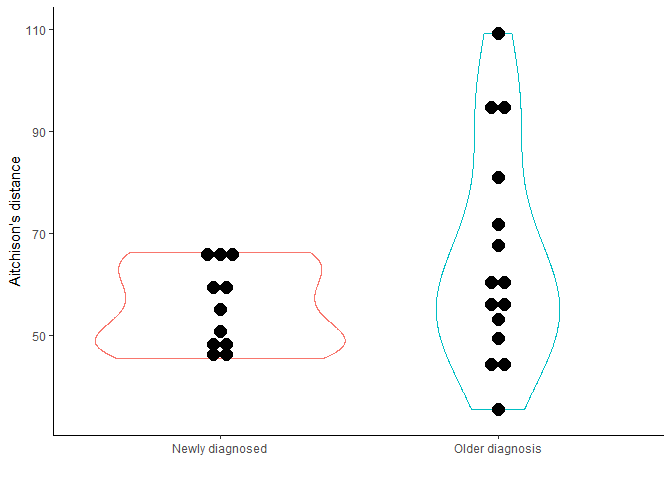<!-- -->

``` r
ggplot(data=df_dist_ait,aes(x=age_gr1, y=dist_ait))+
  geom_violin(aes( color=age_gr1))+geom_dotplot(binaxis='y', stackdir='center', dotsize=1)+theme_classic()+theme(legend.position = "none")+
  xlab(" ") + ylab("Aitchison's distance")
```

    ## `stat_bindot()` using `bins = 30`. Pick better value with `binwidth`.

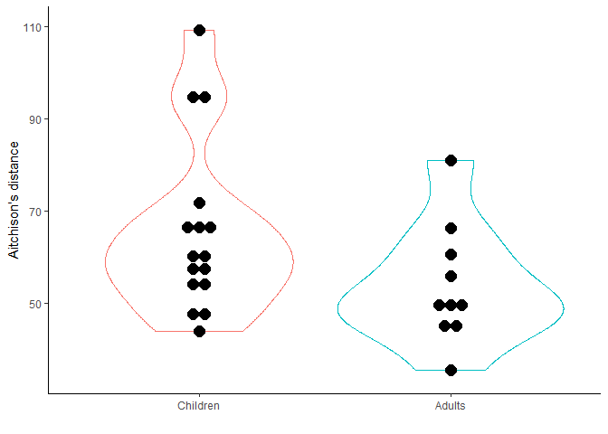<!-- -->

``` r
ggplot(data=df_dist_ait)+
  geom_boxplot(aes(x=study_gr1, y=dist_ait, color=study_gr1))+theme_classic()+theme(legend.position = "none")+
  xlab(" ") + ylab("Aitchison's distance")
```

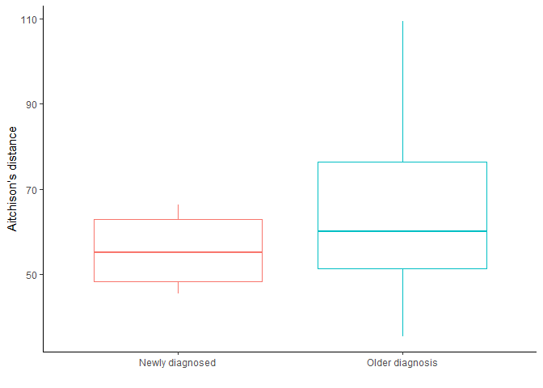<!-- -->

``` r
ggplot(data=df_dist_ait)+
  geom_boxplot(aes(x=age_gr1, y=dist_ait, color=age_gr1))+theme_classic()+theme(legend.position = "none")+
  xlab(" ") + ylab("Aitchison's distance")
```

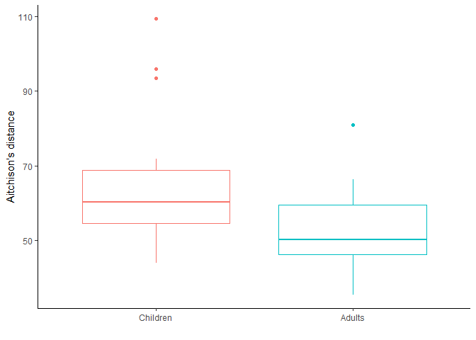<!-- -->

``` r
#Test if there is a difference using permutation ANOVA: Aitchison
res <- anova(lm(formula=dist_ait~age_gr+study_gr+sex+asa+bio+pred, data=df_dist_ait))
res
```

    ## Analysis of Variance Table
    ## 
    ## Response: dist_ait
    ##           Df  Sum Sq Mean Sq F value  Pr(>F)  
    ## age_gr     1  874.78  874.78  4.1569 0.06081 .
    ## study_gr   1  644.61  644.61  3.0632 0.10196  
    ## sex        1 1384.87 1384.87  6.5808 0.02244 *
    ## asa        3 1551.28  517.09  2.4572 0.10591  
    ## bio        3  150.10   50.03  0.2378 0.86856  
    ## pred       2   35.00   17.50  0.0832 0.92065  
    ## Residuals 14 2946.16  210.44                  
    ## ---
    ## Signif. codes:  0 '***' 0.001 '**' 0.01 '*' 0.05 '.' 0.1 ' ' 1

``` r
summary(lm(formula=dist_ait~age_gr+study_gr+sex+asa+bio+pred, data=df_dist_ait))
```

    ## 
    ## Call:
    ## lm(formula = dist_ait ~ age_gr + study_gr + sex + asa + bio + 
    ##     pred, data = df_dist_ait)
    ## 
    ## Residuals:
    ##     Min      1Q  Median      3Q     Max 
    ## -16.763  -7.431   0.000   4.574  27.017 
    ## 
    ## Coefficients:
    ##             Estimate Std. Error t value Pr(>|t|)    
    ## (Intercept)  72.8948    11.8486   6.152 2.51e-05 ***
    ## age_gr2     -23.6257    14.1965  -1.664    0.118    
    ## study_gr2    15.8953    10.3591   1.534    0.147    
    ## sex1         -8.2288    10.6084  -0.776    0.451    
    ## asa2          9.3323    16.1749   0.577    0.573    
    ## asa3        -11.5777    12.0210  -0.963    0.352    
    ## asa4        -19.7725    16.3629  -1.208    0.247    
    ## bio2          6.9461    15.4849   0.449    0.661    
    ## bio3        -12.7086    16.4706  -0.772    0.453    
    ## bio4         -0.7146    17.2935  -0.041    0.968    
    ## pred2        -2.5100    11.7022  -0.214    0.833    
    ## pred3        -9.1885    26.4968  -0.347    0.734    
    ## ---
    ## Signif. codes:  0 '***' 0.001 '**' 0.01 '*' 0.05 '.' 0.1 ' ' 1
    ## 
    ## Residual standard error: 14.51 on 14 degrees of freedom
    ## Multiple R-squared:  0.6117, Adjusted R-squared:  0.3066 
    ## F-statistic: 2.005 on 11 and 14 DF,  p-value: 0.1104

``` r
set.seed(1)
df_test_age <- rep(NA, 1000)
df_test_study <- rep(NA, 1000)
for (i in 1:1000){
    #Permute and save F-statistic: Age group
    df_shuffle_age <- df_dist_ait
    df_shuffle_age$age_gr <- sample(x=df_shuffle_age$age_gr, size=nrow(df_dist_ait))
    test_age <- as.data.frame(anova(lm(formula=dist_ait~age_gr+study_gr+sex+asa+bio+pred, data=df_shuffle_age)))
    df_test_age[i] <- test_age["age_gr", "F value"]
    
    #Permute and save F-statistic: Study group
    df_shuffle_study <- df_dist_ait
    df_shuffle_study$study_gr <- sample(x=df_shuffle_study$study_gr, size=nrow(df_dist_ait))
    test_study <- as.data.frame(anova(lm(formula=dist_ait~age_gr+study_gr+sex+asa+bio+pred, data=df_shuffle_study)))
    df_test_study[i] <- test_study["study_gr", "F value"]
  }

#Make p-value
res_age <- res["age_gr", "F value"]
res_study <- res["study_gr", "F value"]

sum(df_test_age>=res_age)/1000
```

    ## [1] 0.09

``` r
sum(df_test_study>=res_study)/1000
```

    ## [1] 0.113
