Analyses of single species using NBZIMM and ZIGMM
================

  - [Read in packages and data](#read-in-packages-and-data)
  - [Test the association with clinical disease score using
    NBZIMM](#test-the-association-with-clinical-disease-score-using-nbzimm)
  - [Evaluate results from clinical disease score association
    analyses](#evaluate-results-from-clinical-disease-score-association-analyses)
  - [Test the association with paraclinical disease score using
    NBZIMM](#test-the-association-with-paraclinical-disease-score-using-nbzimm)
  - [Evaluate results from paraclinical disease score association
    analyses](#evaluate-results-from-paraclinical-disease-score-association-analyses)

# Read in packages and data

Read in packages and path to folder:

``` r
library(tidyverse)
library(caret)
library(phyloseq)
library(NBZIMM)
library(vegan)
library(metaMint)
library(lme4)
library(lmerTest)
library(zCompositions)
path = "C:/Users/Tom/Documents/10. semester/V1/data/"
```

Read in data:

``` r
#Phyloseq objects:
ps_count <- readRDS(paste0(path, "humann3_processed_output/Phyloseq/","ps_count_50mean_50var_zero.rds"))

#Meta data:
meta <- read.delim(paste0(path, "metadata/", "preped_metadata_filtered.txt"))

#Merge meta data with phyloseq object to remove those samples with >85% reads removed as human 
rownames(meta) <- meta$J_ID
ps_count <- phyloseq(otu_table(ps_count), tax_table(ps_count), sample_data(meta))
```

# Test the association with clinical disease score using NBZIMM

Fit the NBZIMM: Test the clinical disease score

``` r
#Analysis of MetaPhlAn count data - all taxa!:
ps_count <- subset_samples(ps_count, !is.na(score))
N <- sample_data(ps_count)$rdepth
person_ID <- as.factor(sample_data(ps_count)$person_ID)
sex <-  as.factor(sample_data(ps_count)$sex)
study_gr <-  as.factor(sample_data(ps_count)$study_gr)
age_gr <-  as.factor(sample_data(ps_count)$age_gr)
asa <-  as.factor(sample_data(ps_count)$asa)
bio <-  as.factor(sample_data(ps_count)$bio)
pred <-  as.factor(sample_data(ps_count)$pred_total)
score_num <- sample_data(ps_count)$score_num
time_point <- sample_data(ps_count)$time_point

clinical = cbind.data.frame(N, person_ID, sex,study_gr,age_gr, asa, bio, pred, score_num, time_point)
pheno <-  as.data.frame(as.matrix(t(otu_table(ps_count)))) #No transformation

#Fit model with discrete numeric and binary disease score. Fit with interaction with age:
f_inter <- mms(y=pheno, fixed= ~study_gr+sex+asa+bio+pred+age_gr*score_num + offset(log(N)), data=clinical, random = ~1|person_ID, method="zinb", correlation=corAR1(form=~time_point|person_ID), zi_fixed=~study_gr+sex+asa+bio+pred+age_gr*score_num + offset(log(N)))
```

    ## 
    ## Attaching package: 'nlme'

    ## The following object is masked from 'package:lme4':
    ## 
    ##     lmList

    ## The following object is masked from 'package:dplyr':
    ## 
    ##     collapse

    ## Analyzing 75 responses: 
    ## 1 2 3 4 5 6 7 8 
    ## y9 error: NA/NaN/Inf in 'x'10 
    ## y11 error: NA/NaN/Inf in 'x'12 
    ## y13 error: NA/NaN/Inf in 'x'14 15 16 17 18 19 20 21 22 
    ## y23 error: missing values in object
    ## y24 error: NA/NaN/Inf in 'x'25 26 27 28 29 
    ## y30 error: NA/NaN/Inf in 'x'31 32 33 34 35 36 37 38 39 40 41 42 43 44 45 46 47 48 49 50 51 52 53 54 55 56 57 58 59 60 61 62 63 64 65 66 67 
    ## y68 error: NA/NaN/Inf in 'x'
    ## y69 error: NA/NaN/Inf in 'x'70 
    ## y71 error: NA/NaN/Inf in 'x'72 
    ## y73 error: NA/NaN/Inf in 'x'
    ## y74 error: NA/NaN/Inf in 'x'
    ## y75 error: manglende værdi hvor TRUE/FALSE er krævet
    ##  Computational time: 1.572 minutes

``` r
failed <- c(9,11,13,23,24,30,68,69,71,73,74,75)
failed <- colnames(pheno)[failed]

#Model those that failed as relative abundancen instead,   
pheno_relab <- pheno
for (i in 1:dim(pheno)[1]){
  pheno_relab[i, ] <- pheno_relab[i, ] / N[i]
}

#Is it gaussian?
for (i in colnames(pheno_relab)[1:5]){
  p <- ggplot(pheno_relab)+
    geom_histogram(aes_string(x=i), bins=30)+ggtitle(i)
  print(p)
}
```

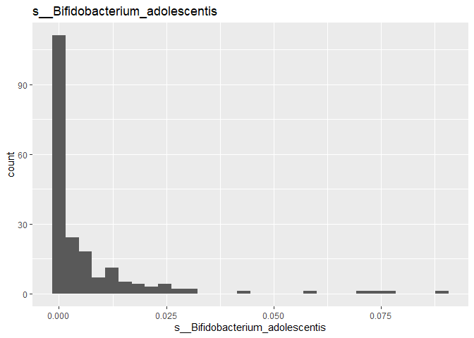<!-- -->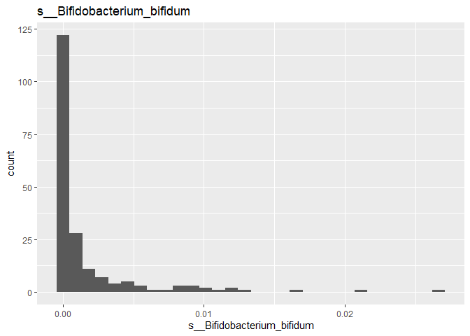<!-- -->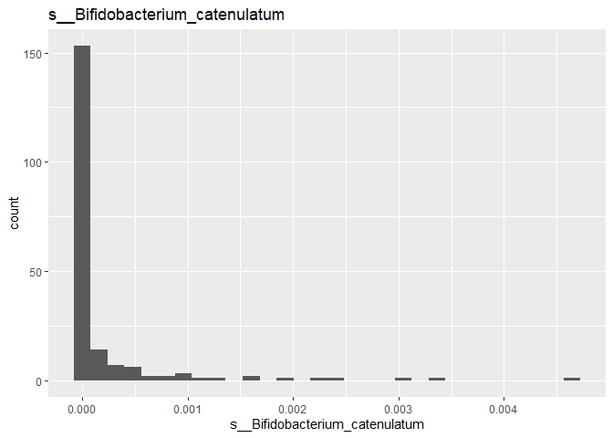<!-- -->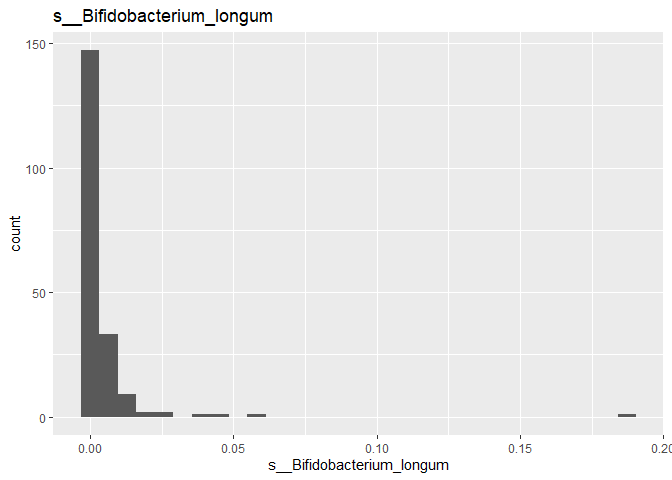<!-- -->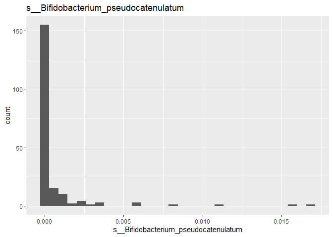<!-- -->

``` r
for (i in colnames(pheno_relab)[1:5]){
  test <- asin(sqrt(pheno_relab[, i]))
  p <- ggplot()+
    geom_histogram(aes_string(x=test), bins=30)+ggtitle(i)
  print(p)
}
```

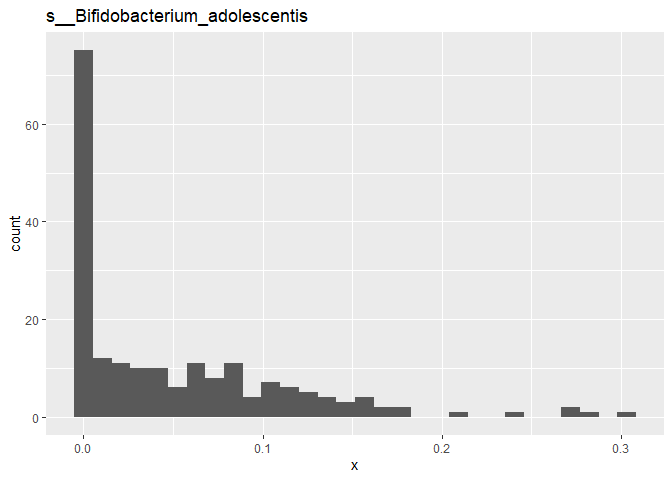<!-- -->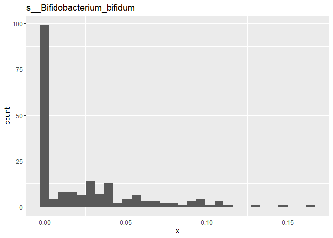<!-- -->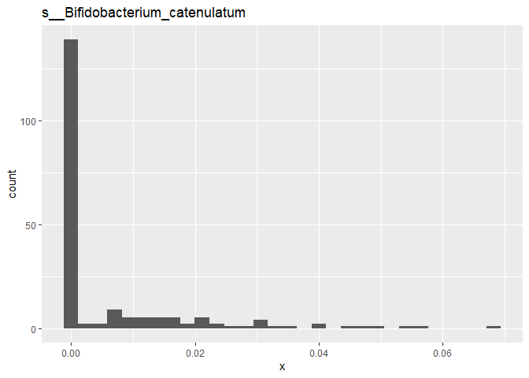<!-- -->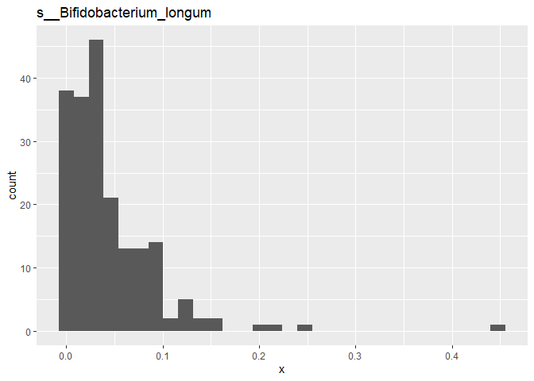<!-- -->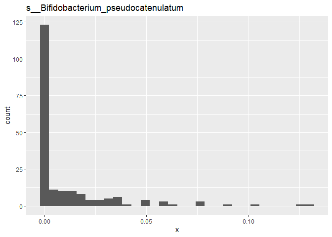<!-- -->

``` r
#It is better with arcsine square root transformation

#ZIG - with asin+sqrt
f_inter_relab <- mms(y=asin(sqrt(pheno_relab[, failed])), fixed= ~study_gr+sex+asa+bio+pred+age_gr*score_num, data=clinical, random = ~1|person_ID, method="zig", correlation=corAR1(form=~time_point|person_ID), zi_fixed=~study_gr+sex+asa+bio+pred+age_gr*score_num)
```

    ## Analyzing 12 responses: 
    ## 1 2 3 4 5 6 7 8 9 10 11 12 
    ##  Computational time: 0.112 minutes

``` r
#Find taxa with significant (p-adj<0.05) interaction.  
res_inter=as.data.frame(get.fixed(f_inter, part="dist", vr.name="age_gr2:score_num"))
res_inter$bugs <- rownames(res_inter)
res_inter$method <- "NBZIMM"

res_inter_relab <- as.data.frame(get.fixed(f_inter_relab, part="dist", vr.name="age_gr2:score_num"))
res_inter_relab$bugs <- rownames(res_inter_relab)
res_inter_relab$method <- "ZIGMM"

#Merge tables to calculate p_adj for all:
res_total <- rbind(res_inter, res_inter_relab)
res_total$p_adj <- p.adjust(res_total$pvalue, method="BH")
write.table(res_total, file = paste0(path, "Results/", "Clinical_interaction.txt"), col.names=T, row.names=F)
res_inter_sig <- res_total %>% filter(p_adj < 0.05)
res_inter <- res_total

##Select the rest of those not significant and fit without the interaction term:
pheno_1 <- pheno[, setdiff(colnames(pheno), rownames(res_inter_sig))]

f_nointer<- mms(y=pheno_1, fixed= ~study_gr+sex+asa+bio+pred+age_gr+score_num + offset(log(N)), data=clinical, random = ~1|person_ID, method="zinb", correlation=corAR1(form=~time_point|person_ID), zi_fixed=~study_gr+sex+asa+bio+pred+age_gr+score_num + offset(log(N)))
```

    ## Analyzing 70 responses: 
    ## 1 2 3 4 
    ## y5 error: NA/NaN/Inf in 'x'6 7 
    ## y8 error: nlminb problem, convergence error code = 1
    ##   message = false convergence (8)
    ## y9 error: NA/NaN/Inf in 'x'10 
    ## y11 error: NA/NaN/Inf in 'x'
    ## y12 error: NA/NaN/Inf in 'x'13 14 15 16 17 18 
    ## y19 error: NA/NaN/Inf in 'x'20 21 22 23 24 
    ## y25 error: NA/NaN/Inf in 'x'
    ## y26 error: NA/NaN/Inf in 'x'27 28 29 30 31 32 33 34 35 36 37 38 39 40 41 42 43 44 45 46 47 
    ## y48 error: NA/NaN/Inf in 'x'49 50 51 52 53 54 55 56 57 58 59 60 61 62 
    ## y63 error: NA/NaN/Inf in 'x'
    ## y64 error: nlminb problem, convergence error code = 1
    ##   message = false convergence (8)65 
    ## y66 error: NA/NaN/Inf in 'x'67 
    ## y68 error: NA/NaN/Inf in 'x'69 
    ## y70 error: NA/NaN/Inf in 'x'
    ##  Computational time: 1.341 minutes

``` r
failed2 <- c(5,8,9,11,12,19,25,26,48,63,64,66,68,70)
failed2 <- colnames(pheno_1)[failed2]

#Fit using ZIGMM:
f_nointer_relab <- mms(y=asin(sqrt(pheno_relab[, failed2])), fixed= ~study_gr+sex+asa+bio+pred+age_gr+score_num, data=clinical, random = ~1|person_ID, method="zig", correlation=corAR1(form=~time_point|person_ID), zi_fixed=~study_gr+sex+asa+bio+pred+age_gr+score_num)
```

    ## Analyzing 14 responses: 
    ## 1 2 3 4 5 6 7 8 9 10 11 12 13 14 
    ##  Computational time: 0.121 minutes

``` r
#Result: Disease score in interaction:
res=as.data.frame(get.fixed(f_inter, part="dist", vr.name="score_num"))
res$bugs <- rownames(res)
res$method <- "NBZIMM"

res_relab=as.data.frame(get.fixed(f_inter_relab, part="dist", vr.name="score_num"))
res_relab$bugs <- rownames(res_relab)
res_relab$method <- "ZIGMM"

res_total <- rbind(res, res_relab)
res_total$p_adj <- p.adjust(res_total$pvalue, method="BH")

write.table(res_total, file = paste0(path, "Results/", "Score_interaction_disease.txt"), col.names=T, row.names=F)
res_inter_disease <- res_total

#Result: Interaction in zero-inflated part:
res=as.data.frame(get.fixed(f_inter, part="zero", vr.name="age_gr2:score_num"))
res$bugs <- rownames(res)
res$method <- "NBZIMM"

res_relab=as.data.frame(get.fixed(f_inter_relab, part="zero", vr.name="age_gr2:score_num"))
res_relab$bugs <- rownames(res_relab)
res_relab$method <- "ZIGMM"

res_total <- rbind(res, res_relab)
res_total$p_adj <- p.adjust(res_total$pvalue, method="BH")

write.table(res_total, file = paste0(path, "Results/", "Score_interaction_zero.txt"), col.names=T, row.names=F)
res_inter_zero <- res_total

#Result: Disease score in interaction, zero-inflated:
res=as.data.frame(get.fixed(f_inter, part="zero", vr.name="score_num"))
res$bugs <- rownames(res)
res$method <- "NBZIMM"

res_relab=as.data.frame(get.fixed(f_inter_relab, part="zero", vr.name="score_num"))
res_relab$bugs <- rownames(res_relab)
res_relab$method <- "ZIGMM"

res_total <- rbind(res, res_relab)
res_total$p_adj <- p.adjust(res_total$pvalue, method="BH")

write.table(res_total, file = paste0(path, "Results/", "Score_interaction_zero_disease.txt"), col.names=T, row.names=F)
res_inter_zero_disease <- res_total

#Result: Disease score without interaction:
res=as.data.frame(get.fixed(f_nointer, part="dist", vr.name="score_num"))
res$bugs <- rownames(res)
res$method <- "NBZIMM"

res_relab=as.data.frame(get.fixed(f_nointer_relab, part="dist", vr.name="score_num"))
res_relab$bugs <- rownames(res_relab)
res_relab$method <- "ZIGMM"

res_total <- rbind(res, res_relab)
res_total$p_adj <- p.adjust(res_total$pvalue, method="BH")

write.table(res_total, file = paste0(path, "Results/", "Score_disease.txt"), col.names=T, row.names=F)
res_disease <- res_total

#Result: Disease score without interaction, zero-inflated:
res=as.data.frame(get.fixed(f_nointer, part="zero", vr.name="score_num"))
res$bugs <- rownames(res)
res$method <- "NBZIMM"

res_relab=as.data.frame(get.fixed(f_nointer_relab, part="zero", vr.name="score_num"))
res_relab$bugs <- rownames(res_relab)
res_relab$method <- "ZIGMM"

res_total <- rbind(res, res_relab)
res_total$p_adj <- p.adjust(res_total$pvalue, method="BH")

write.table(res_total, file = paste0(path, "Results/", "Score_zero_disease.txt"), col.names=T, row.names=F)
res_disease_zero <- res_total
```

# Evaluate results from clinical disease score association analyses

Investigate the results from the count and relab data:

``` r
#Make histograms of p-values from the interaction analysis:
ggplot(res_inter)+
  geom_histogram(aes(x=pvalue), bins=30, breaks = seq(0, 1, by=1/30), color="black", fill = "lightblue")+
  theme_classic()+ xlab("p-value")+ylab("Count")+ggtitle("Interaction term")
```

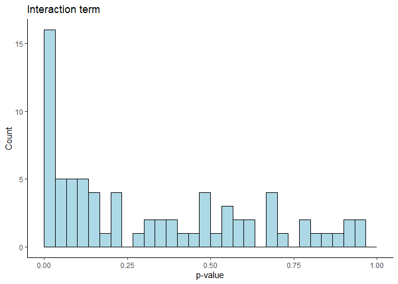<!-- -->

``` r
#Extract the significant in interaction term together with the disease score estimate
sig <- res_inter %>% filter(p_adj<0.05)
sig
```

    ##                           Estimate Std.Error  pvalue  padj
    ## s__Bacteroides_ovatus        0.789     0.250 0.00190 0.024
    ## s__Alistipes_indistinctus    1.002     0.292 0.00077 0.023
    ## s__Alistipes_shahii          0.808     0.233 0.00069 0.023
    ## s__Parabacteroides_merdae    0.700     0.209 0.00110 0.023
    ## s__Ruminococcus_torques     -0.750     0.232 0.00150 0.024
    ##                                                bugs method    p_adj
    ## s__Bacteroides_ovatus         s__Bacteroides_ovatus NBZIMM 0.028500
    ## s__Alistipes_indistinctus s__Alistipes_indistinctus NBZIMM 0.027500
    ## s__Alistipes_shahii             s__Alistipes_shahii NBZIMM 0.027500
    ## s__Parabacteroides_merdae s__Parabacteroides_merdae NBZIMM 0.027500
    ## s__Ruminococcus_torques     s__Ruminococcus_torques NBZIMM 0.028125

``` r
sig1 <- res_inter_disease[row.names(sig),]
sig1
```

    ##                           Estimate Std.Error  pvalue    padj
    ## s__Bacteroides_ovatus       -0.474     0.152 2.2e-03 0.01400
    ## s__Alistipes_indistinctus   -0.895     0.200 1.6e-05 0.00042
    ## s__Alistipes_shahii         -0.547     0.185 3.6e-03 0.01500
    ## s__Parabacteroides_merdae   -0.528     0.168 2.0e-03 0.01400
    ## s__Ruminococcus_torques      0.186     0.158 2.4e-01 0.36000
    ##                                                bugs method  p_adj
    ## s__Bacteroides_ovatus         s__Bacteroides_ovatus NBZIMM 0.0165
    ## s__Alistipes_indistinctus s__Alistipes_indistinctus NBZIMM 0.0005
    ## s__Alistipes_shahii             s__Alistipes_shahii NBZIMM 0.0180
    ## s__Parabacteroides_merdae s__Parabacteroides_merdae NBZIMM 0.0165
    ## s__Ruminococcus_torques     s__Ruminococcus_torques NBZIMM 0.4000

``` r
sig_inter <- sig

#Plot significant interaction:
#Plot the detected species - interaction:
pheno_temp <- pheno
pheno_temp$J_ID <- row.names(pheno_temp)
temp_meta <- merge(pheno_temp, meta, by.x="J_ID", by.y="J_ID")
temp_meta$score_num <- as.factor(temp_meta$score_num)
temp_meta$age_gr1 <- ifelse(temp_meta$age_gr==1, "Children", "Adults")
temp_meta$age_gr1 <-factor(temp_meta$age_gr1, levels=c("Children", "Adults"))
temp_meta$score_num1 <- ifelse(temp_meta$score_num==1, "Remission", ifelse(temp_meta$score_num==2, "Mild", ifelse(temp_meta$score_num==3, "Moderate", "Severe")))
temp_meta$score_num1 <-factor(temp_meta$score_num1, levels=c("Remission", "Mild", "Moderate", "Severe"))

spec <- sig$bugs
for (i in spec){
  j <- gsub("s__", "", i)
  j <- gsub("_", " ", j)
  p <- ggplot(data=temp_meta)+
    geom_boxplot(aes_string(x="score_num1", y=paste0(i, "/rdepth"), color = "age_gr1"), outlier.size=1)+theme_classic()+xlab("Clinical disease score")+ylab("Relative abundance") + ggtitle(as.character(j))+labs(color="Age group")
 print(p)
}
```

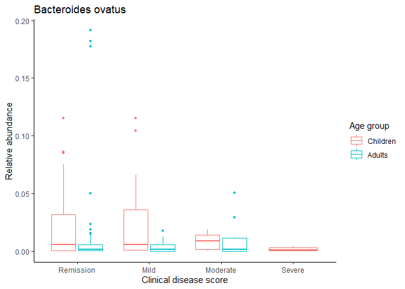<!-- -->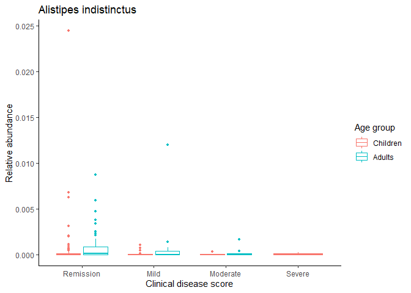<!-- -->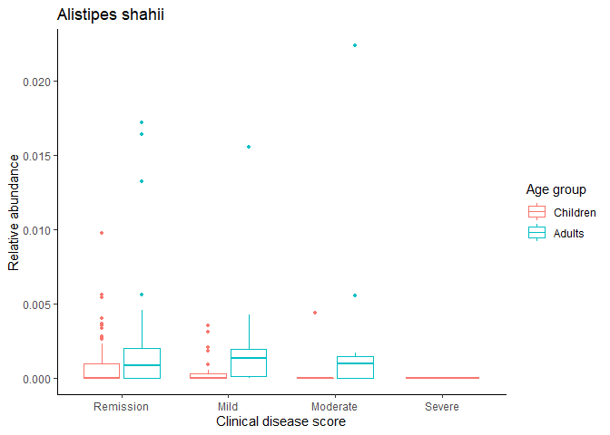<!-- -->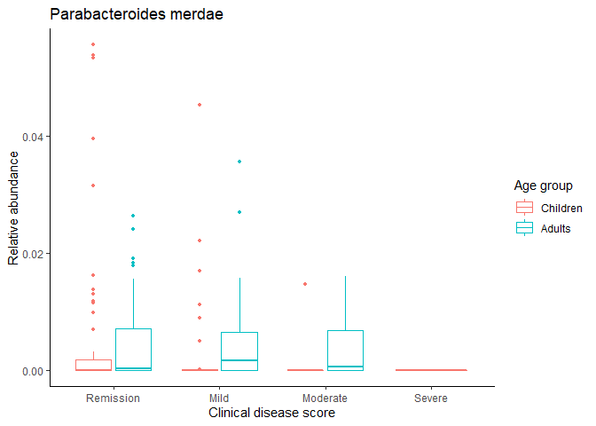<!-- -->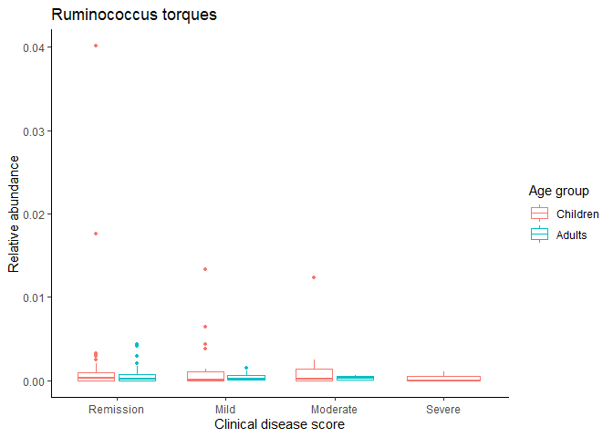<!-- -->

``` r
#Plot all NBZIMM interaction results together in one plot:
pheno_temp_relab <- pheno_relab
pheno_temp_relab$J_ID <- row.names(pheno_temp_relab)
temp_meta_relab <- merge(pheno_temp_relab, meta, by.x="J_ID", by.y="J_ID")
temp_meta_relab$score_num <- as.factor(temp_meta_relab$score_num)
temp_meta_relab$age_gr1 <- ifelse(temp_meta_relab$age_gr==1, "Children", "Adults")
temp_meta_relab$age_gr1 <-factor(temp_meta_relab$age_gr1, levels=c("Children", "Adults"))
temp_meta_relab$score_num1 <- ifelse(temp_meta_relab$score_num==1, "Remission", ifelse(temp_meta_relab$score_num==2, "Mild", ifelse(temp_meta_relab$score_num==3, "Moderate", "Severe")))
temp_meta_relab$score_num1 <-factor(temp_meta_relab$score_num1, levels=c("Remission", "Mild", "Moderate", "Severe"))
temp1 <- temp_meta_relab %>%
  pivot_longer(., cols = colnames(pheno_relab), names_to = "Var", values_to = "Val")

temp1$Var1 <- gsub("s__", "", temp1$Var)
temp1$Var1 <- gsub("_", " ", temp1$Var1)

temp2 <- temp1 %>% filter(Var %in% spec)
ggplot(temp2, aes(x=score_num1, y=Val))+
  geom_boxplot(aes(color=age_gr1))+theme_classic()+facet_wrap(~Var1, scales="free_y")+ylab("Relative abundance")+labs(color="Age group")+ theme(legend.position = c(1, 0),legend.justification = c(1, 0))+xlab("")
```

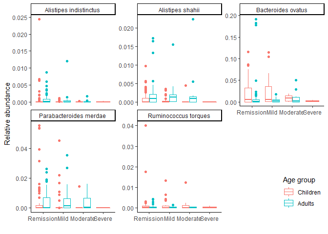<!-- -->

``` r
#Extract the significant in interaction term in the zero-inflated part, together with the disease score estimate
ggplot(res_inter_zero)+
  geom_histogram(aes(x=pvalue), bins=30, breaks = seq(0, 1, by=1/30), color="black", fill = "lightblue")+
  theme_classic()+ xlab("p-value")+ylab("Count")+ggtitle("Zero-inflated interaction term")
```

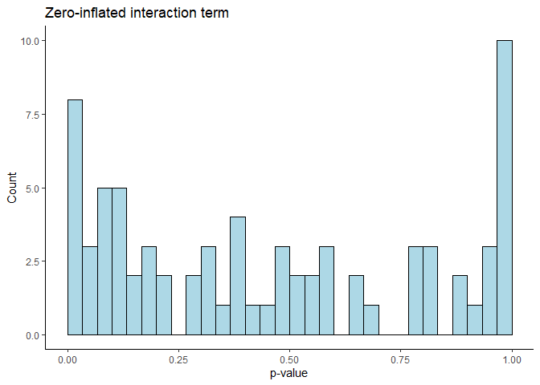<!-- -->

``` r
sig <- res_inter_zero %>% filter(p_adj<0.05)
sig #None
```

    ## [1] Estimate  Std.Error pvalue    padj      bugs      method    p_adj    
    ## <0 rows> (or 0-length row.names)

``` r
#Investigate results without interaction term: Disease score:
ggplot(res_disease)+
  geom_histogram(aes(x=pvalue), bins=30, breaks = seq(0, 1, by=1/30), color="black", fill = "lightblue")+
  theme_classic()+ xlab("p-value")+ylab("Count")+ggtitle("Disease score")
```

<!-- -->

``` r
sig <- res_disease %>% filter(p_adj<0.05)
sig
```

    ##                                    Estimate Std.Error  pvalue    padj
    ## s__Bifidobacterium_bifidum           -0.350     0.119 3.9e-03 3.1e-02
    ## s__Alistipes_inops                   -0.365     0.129 5.4e-03 3.8e-02
    ## s__Eubacterium_hallii                -0.433     0.106 7.3e-05 1.0e-03
    ## s__Eubacterium_ventriosum             0.465     0.145 1.7e-03 1.6e-02
    ## s__Anaerostipes_hadrus               -0.321     0.115 6.1e-03 3.8e-02
    ## s__Blautia_obeum                     -0.539     0.105 8.8e-07 2.5e-05
    ## s__Lachnospira_pectinoschiza          0.440     0.087 1.4e-06 2.6e-05
    ## s__Roseburia_hominis                 -0.356     0.133 8.5e-03 4.0e-02
    ## s__Pseudoflavonifractor_sp_An184      0.298     0.108 6.8e-03 3.8e-02
    ## s__Ruthenibacterium_lactatiformans   -0.399     0.115 6.5e-04 7.3e-03
    ## s__Firmicutes_bacterium_CAG_83       -0.313     0.116 7.8e-03 4.0e-02
    ## s__Firmicutes_bacterium_CAG_94       -0.619     0.109 6.8e-08 3.8e-06
    ##                                                                  bugs method
    ## s__Bifidobacterium_bifidum                 s__Bifidobacterium_bifidum NBZIMM
    ## s__Alistipes_inops                                 s__Alistipes_inops NBZIMM
    ## s__Eubacterium_hallii                           s__Eubacterium_hallii NBZIMM
    ## s__Eubacterium_ventriosum                   s__Eubacterium_ventriosum NBZIMM
    ## s__Anaerostipes_hadrus                         s__Anaerostipes_hadrus NBZIMM
    ## s__Blautia_obeum                                     s__Blautia_obeum NBZIMM
    ## s__Lachnospira_pectinoschiza             s__Lachnospira_pectinoschiza NBZIMM
    ## s__Roseburia_hominis                             s__Roseburia_hominis NBZIMM
    ## s__Pseudoflavonifractor_sp_An184     s__Pseudoflavonifractor_sp_An184 NBZIMM
    ## s__Ruthenibacterium_lactatiformans s__Ruthenibacterium_lactatiformans NBZIMM
    ## s__Firmicutes_bacterium_CAG_83         s__Firmicutes_bacterium_CAG_83 NBZIMM
    ## s__Firmicutes_bacterium_CAG_94         s__Firmicutes_bacterium_CAG_94 NBZIMM
    ##                                           p_adj
    ## s__Bifidobacterium_bifidum         3.900000e-02
    ## s__Alistipes_inops                 4.725000e-02
    ## s__Eubacterium_hallii              1.277500e-03
    ## s__Eubacterium_ventriosum          1.983333e-02
    ## s__Anaerostipes_hadrus             4.744444e-02
    ## s__Blautia_obeum                   3.080000e-05
    ## s__Lachnospira_pectinoschiza       3.266667e-05
    ## s__Roseburia_hominis               4.958333e-02
    ## s__Pseudoflavonifractor_sp_An184   4.760000e-02
    ## s__Ruthenibacterium_lactatiformans 9.100000e-03
    ## s__Firmicutes_bacterium_CAG_83     4.958333e-02
    ## s__Firmicutes_bacterium_CAG_94     4.760000e-06

``` r
sig_disease <- sig

#Plot the detected species:
spec <- sig$bugs
for (i in spec){
  j <- gsub("s__", "", i)
  j <- gsub("_", " ", j)
  p <- ggplot(data=temp_meta)+
    geom_jitter(aes_string(x="score_num1", y=paste0(i, "/rdepth"), color = "score_num1"), size=1)+theme_classic()+xlab("Clinical disease score")+ylab("Relative abundance") + ggtitle(as.character(j))+theme(legend.position = "none")
 print(p)
}
```

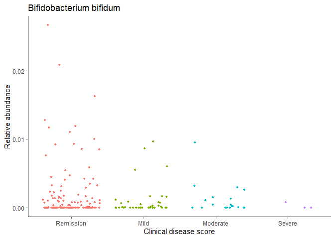<!-- -->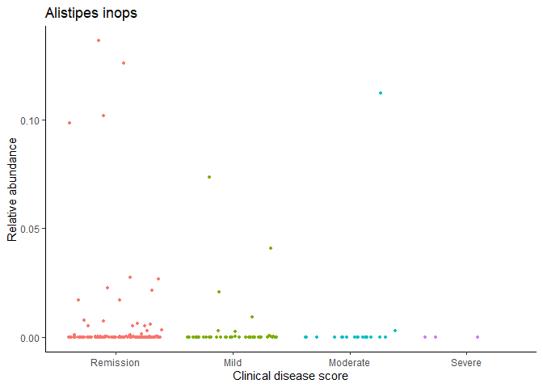<!-- -->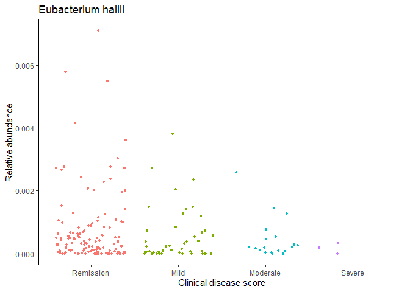<!-- -->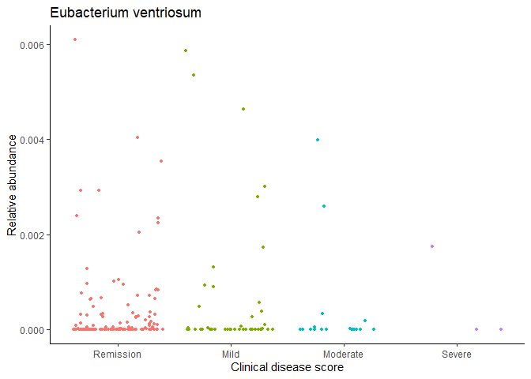<!-- -->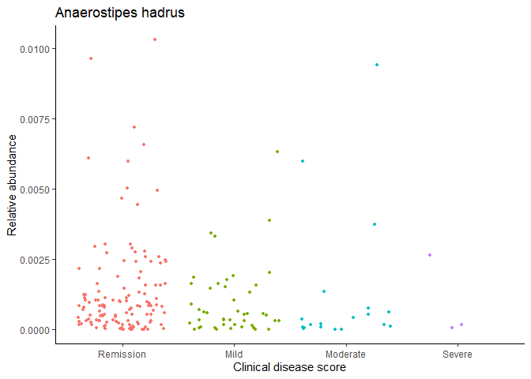<!-- --><!-- -->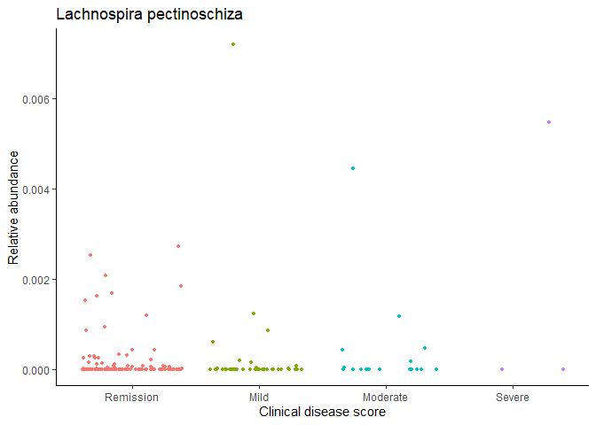<!-- -->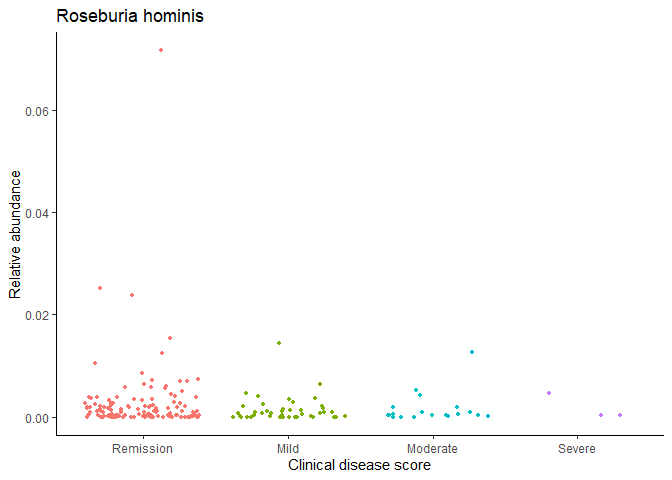<!-- -->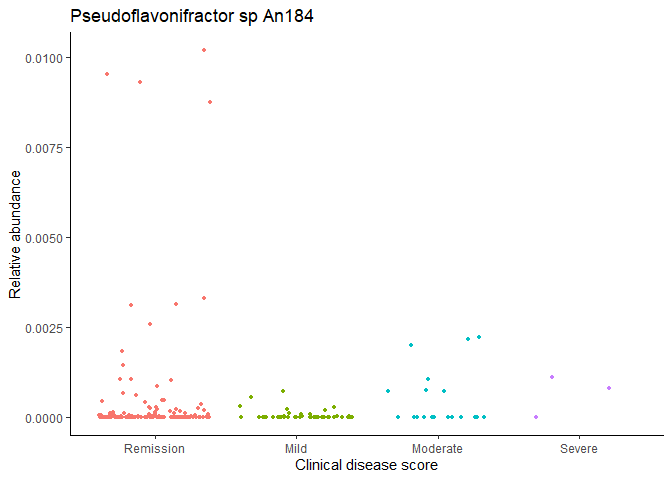<!-- -->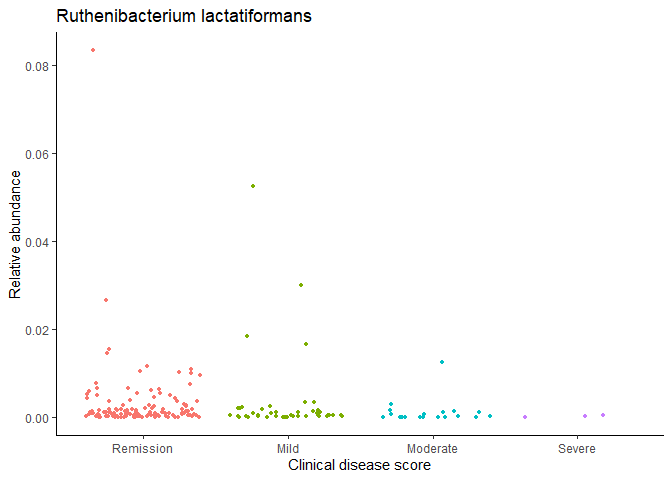<!-- --><!-- -->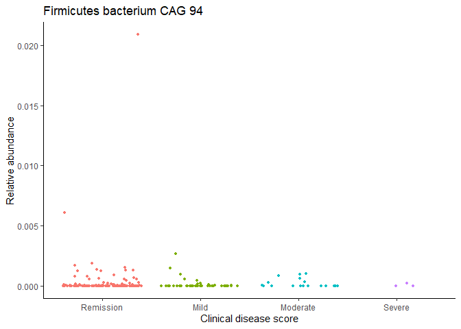<!-- -->

``` r
#In one plot:
temp2 <- temp1 %>% filter(Var %in% spec)
ggplot(data=temp2)+
    geom_jitter(aes(x=score_num1, y=Val, color = score_num1), size=1)+theme_classic()+facet_wrap(~Var1, scales="free_y", ncol=3)+xlab("Clinical disease score")+ylab("Relative abundance")+theme(legend.position = "none")
```

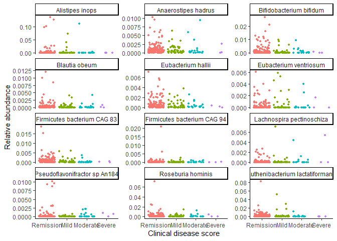<!-- -->

``` r
#Investigate results without interaction term: Disease score, zero inflated:
ggplot(res_disease_zero)+
  geom_histogram(aes(x=pvalue), bins=30, breaks = seq(0, 1, by=1/30), color="black", fill = "lightblue")+
  theme_classic()+ xlab("p-value")+ylab("Count")+ggtitle("Zero-inflated disease score")
```

<!-- -->

``` r
sig <- res_disease_zero %>% filter(p_adj<0.05)
sig
```

    ##                                     Estimate Std.Error  pvalue  padj
    ## s__Intestinimonas_butyriciproducens    0.914      0.26 0.00044 0.025
    ##                                                                    bugs method
    ## s__Intestinimonas_butyriciproducens s__Intestinimonas_butyriciproducens NBZIMM
    ##                                      p_adj
    ## s__Intestinimonas_butyriciproducens 0.0308

``` r
sig_disease_zero <- sig

#Plot the results:
#Plot the detected species:
spec <- sig$bugs
for (i in spec){
  j <- gsub("s__", "", i)
  j <- gsub("_", " ", j)
  test <- temp_meta[,i]
  test <- ifelse(test==0, "Absent", "Present")
  temp_meta$test <- test
  p <- ggplot(data=temp_meta)+
    geom_bar(aes(x=score_num1, fill=test), position="fill")+theme_classic()+xlab("Clinical disease score")+ylab(" ") + ggtitle(as.character(j))+labs(fill="")
print(p)

}
```

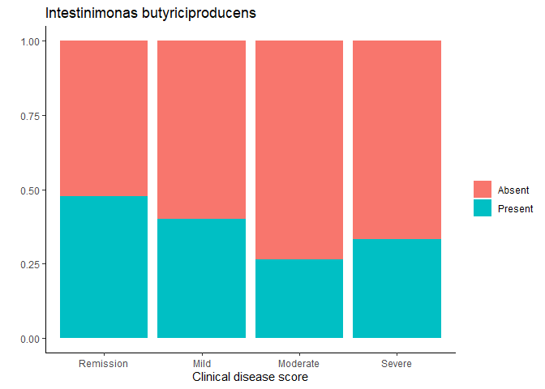<!-- -->

# Test the association with paraclinical disease score using NBZIMM

Test everything again, but with faecal calprotectin as disease score:
Read in data:

``` r
#Phyloseq objects:
ps_count <- readRDS(paste0(path, "humann3_processed_output/Phyloseq/","ps_count_50mean_50var_zero.rds"))

#Meta data:
meta <- read.delim(paste0(path, "metadata/", "preped_metadata_filtered.txt"))

#Merge meta data with phyloseq object to remove those samples with >85% reads removed as human 
rownames(meta) <- meta$J_ID
ps_count <- phyloseq(otu_table(ps_count), tax_table(ps_count), sample_data(meta))
```

Fit the NBZIMM: Test the para-clinical disease score

``` r
#Analysis of MetaPhlAn count data - all taxa!:
ps_count <- subset_samples(ps_count, !is.na(f_cal_current))
N <- sample_data(ps_count)$rdepth
person_ID <- as.factor(sample_data(ps_count)$person_ID)
sex <-  as.factor(sample_data(ps_count)$sex)
study_gr <-  as.factor(sample_data(ps_count)$study_gr)
age_gr <-  as.factor(sample_data(ps_count)$age_gr)
asa <-  as.factor(sample_data(ps_count)$asa)
bio <-  as.factor(sample_data(ps_count)$bio)
pred <-  as.factor(sample_data(ps_count)$pred_total)
fcal <- log(sample_data(ps_count)$f_cal_current+1)
time_point <- sample_data(ps_count)$time_point

clinical = cbind.data.frame(N, person_ID, sex,study_gr,age_gr, asa, bio, pred, fcal, time_point)
pheno <-  as.data.frame(as.matrix(t(otu_table(ps_count)))) #No transformation

#Fit model with discrete numeric and binary disease score. Fit with interaction with age:
f_inter <- mms(y=pheno, fixed= ~study_gr+sex+asa+bio+pred+age_gr*fcal + offset(log(N)), data=clinical, random = ~1|person_ID, method="zinb", correlation=corAR1(form=~time_point|person_ID), zi_fixed=~study_gr+sex+asa+bio+pred+age_gr*fcal + offset(log(N)))
```

    ## Analyzing 75 responses: 
    ## 1 2 3 4 5 6 
    ## y7 error: NA/NaN/Inf in 'x'8 
    ## y9 error: NA/NaN/Inf in 'x'10 
    ## y11 error: NA/NaN/Inf in 'x'12 
    ## y13 error: NA/NaN/Inf in 'x'14 15 16 17 18 19 20 21 
    ## y22 error: NA/NaN/Inf in 'x'23 24 25 26 27 28 29 
    ## y30 error: nlminb problem, convergence error code = 1
    ##   message = false convergence (8)31 32 33 34 35 36 37 38 39 40 41 42 43 44 45 46 47 
    ## y48 error: NA/NaN/Inf in 'x'49 50 51 52 
    ## y53 error: NA/NaN/Inf in 'x'54 55 56 57 58 59 60 61 62 63 64 65 66 67 
    ## y68 error: NA/NaN/Inf in 'x'
    ## y69 error: NA/NaN/Inf in 'x'70 
    ## y71 error: NA/NaN/Inf in 'x'
    ## y72 error: NA/NaN/Inf in 'x'
    ## y73 error: NA/NaN/Inf in 'x'
    ## y74 error: NA/NaN/Inf in 'x'75 
    ##  Computational time: 1.68 minutes

``` r
failed <- c(7,9,11,13,22,30,48,53,68,69,71,72,73,74)
failed <- colnames(pheno)[failed]

#Model those that failed as relative abundancen instead,   
pheno_relab <- pheno
for (i in 1:dim(pheno)[1]){
  pheno_relab[i, ] <- pheno_relab[i, ] / N[i]
}

#ZIG - with asin+sqrt
f_inter_relab <- mms(y=asin(sqrt(pheno_relab[, failed])), fixed= ~study_gr+sex+asa+bio+pred+age_gr*fcal, data=clinical, random = ~1|person_ID, method="zig", correlation=corAR1(form=~time_point|person_ID), zi_fixed=~study_gr+sex+asa+bio+pred+age_gr*fcal)
```

    ## Analyzing 14 responses: 
    ## 1 2 3 4 5 6 7 8 9 10 11 12 13 14 
    ##  Computational time: 0.136 minutes

``` r
#Find taxa with significant (p-adj<0.05) interaction.  
res_inter=as.data.frame(get.fixed(f_inter, part="dist", vr.name="age_gr2:fcal"))
res_inter$bugs <- rownames(res_inter)
res_inter$method <- "NBZIMM"

res_inter_relab <- as.data.frame(get.fixed(f_inter_relab, part="dist", vr.name="age_gr2:fcal"))
res_inter_relab$bugs <- rownames(res_inter_relab)
res_inter_relab$method <- "ZIGMM"

#Merge tables to calculate p_adj for all:
res_total <- rbind(res_inter, res_inter_relab)
res_total$p_adj <- p.adjust(res_total$pvalue, method="BH")
write.table(res_total, file = paste0(path, "Results/", "ParaClinical_interaction.txt"), col.names=T, row.names=F)
res_inter_sig <- res_total %>% filter(p_adj < 0.05)
res_inter <- res_total

##Select the rest of those not significant and fit without the interaction term:
pheno_1 <- pheno[, setdiff(colnames(pheno), rownames(res_inter_sig))]

f_nointer<- mms(y=pheno_1, fixed= ~study_gr+sex+asa+bio+pred+age_gr+fcal + offset(log(N)), data=clinical, random = ~1|person_ID, method="zinb", correlation=corAR1(form=~time_point|person_ID), zi_fixed=~study_gr+sex+asa+bio+pred+age_gr+fcal + offset(log(N)))
```

    ## Analyzing 70 responses: 
    ## 1 2 3 4 
    ## y5 error: NA/NaN/Inf in 'x'6 
    ## y7 error: NA/NaN/Inf in 'x'8 
    ## y9 error: NA/NaN/Inf in 'x'
    ## y10 error: NA/NaN/Inf in 'x'11 
    ## y12 error: NA/NaN/Inf in 'x'13 14 15 16 17 18 19 
    ## y20 error: NA/NaN/Inf in 'x'21 22 23 24 25 26 27 
    ## y28 error: NA/NaN/Inf in 'x'29 30 31 32 33 34 35 36 37 38 39 40 41 42 43 44 45 
    ## y46 error: NA/NaN/Inf in 'x'47 48 49 50 
    ## y51 error: NA/NaN/Inf in 'x'
    ## y52 error: NA/NaN/Inf in 'x'53 54 55 56 57 58 59 60 61 62 63 64 
    ## y65 error: NA/NaN/Inf in 'x'
    ## y66 error: NA/NaN/Inf in 'x'
    ## y67 error: NA/NaN/Inf in 'x'
    ## y68 error: NA/NaN/Inf in 'x'
    ## y69 error: NA/NaN/Inf in 'x'
    ## y70 error: NA/NaN/Inf in 'x'
    ##  Computational time: 1.135 minutes

``` r
failed2 <- c(5,7,9,10,12,20,28,46,51,52,65,66,67,68,69,70)
failed2 <- colnames(pheno_1)[failed2]

#Fit using ZIGMM:
f_nointer_relab <- mms(y=asin(sqrt(pheno_relab[, failed2])), fixed= ~study_gr+sex+asa+bio+pred+age_gr+fcal, data=clinical, random = ~1|person_ID, method="zig", correlation=corAR1(form=~time_point|person_ID), zi_fixed=~study_gr+sex+asa+bio+pred+age_gr+fcal)
```

    ## Analyzing 16 responses: 
    ## 1 2 3 4 5 6 7 8 9 10 11 12 13 14 15 16 
    ##  Computational time: 0.131 minutes

``` r
#Result: Disease score in interaction:
res=as.data.frame(get.fixed(f_inter, part="dist", vr.name="fcal"))
res$bugs <- rownames(res)
res$method <- "NBZIMM"

res_relab=as.data.frame(get.fixed(f_inter_relab, part="dist", vr.name="fcal"))
res_relab$bugs <- rownames(res_relab)
res_relab$method <- "ZIGMM"

res_total <- rbind(res, res_relab)
res_total$p_adj <- p.adjust(res_total$pvalue, method="BH")

write.table(res_total, file = paste0(path, "Results/", "Paraclinical_interaction_disease.txt"), col.names=T, row.names=F)
res_inter_disease <- res_total

#Result: Interaction in zero-inflated part:
res=as.data.frame(get.fixed(f_inter, part="zero", vr.name="age_gr2:fcal"))
res$bugs <- rownames(res)
res$method <- "NBZIMM"

res_relab=as.data.frame(get.fixed(f_inter_relab, part="zero", vr.name="age_gr2:fcal"))
res_relab$bugs <- rownames(res_relab)
res_relab$method <- "ZIGMM"

res_total <- rbind(res, res_relab)
res_total$p_adj <- p.adjust(res_total$pvalue, method="BH")

write.table(res_total, file = paste0(path, "Results/", "Paraclinical_interaction_zero.txt"), col.names=T, row.names=F)
res_inter_zero <- res_total

#Result: Disease score in interaction, zero-inflated:
res=as.data.frame(get.fixed(f_inter, part="zero", vr.name="fcal"))
res$bugs <- rownames(res)
res$method <- "NBZIMM"

res_relab=as.data.frame(get.fixed(f_inter_relab, part="zero", vr.name="fcal"))
res_relab$bugs <- rownames(res_relab)
res_relab$method <- "ZIGMM"

res_total <- rbind(res, res_relab)
res_total$p_adj <- p.adjust(res_total$pvalue, method="BH")

write.table(res_total, file = paste0(path, "Results/", "Paraclinical_interaction_zero_disease.txt"), col.names=T, row.names=F)
res_inter_zero_disease <- res_total

#Result: Disease score without interaction:
res=as.data.frame(get.fixed(f_nointer, part="dist", vr.name="fcal"))
res$bugs <- rownames(res)
res$method <- "NBZIMM"

res_relab=as.data.frame(get.fixed(f_nointer_relab, part="dist", vr.name="fcal"))
res_relab$bugs <- rownames(res_relab)
res_relab$method <- "ZIGMM"

res_total <- rbind(res, res_relab)
res_total$p_adj <- p.adjust(res_total$pvalue, method="BH")

write.table(res_total, file = paste0(path, "Results/", "Paraclinical_disease.txt"), col.names=T, row.names=F)
res_disease <- res_total

#Result: Disease score without interaction, zero-inflated:
res=as.data.frame(get.fixed(f_nointer, part="zero", vr.name="fcal"))
res$bugs <- rownames(res)
res$method <- "NBZIMM"

res_relab=as.data.frame(get.fixed(f_nointer_relab, part="zero", vr.name="fcal"))
res_relab$bugs <- rownames(res_relab)
res_relab$method <- "ZIGMM"

res_total <- rbind(res, res_relab)
res_total$p_adj <- p.adjust(res_total$pvalue, method="BH")

write.table(res_total, file = paste0(path, "Results/", "Paraclinical_zero_disease.txt"), col.names=T, row.names=F)
res_disease_zero <- res_total
```

# Evaluate results from paraclinical disease score association analyses

Investigate the results from the count and relab data:

``` r
#Make histograms of p-values from the interaction analysis:
ggplot(res_inter)+
  geom_histogram(aes(x=pvalue), bins=30, breaks = seq(0, 1, by=1/30), color="black", fill = "lightblue")+
  theme_classic()+ xlab("p-value")+ylab("Count")+ggtitle("Interaction term")
```

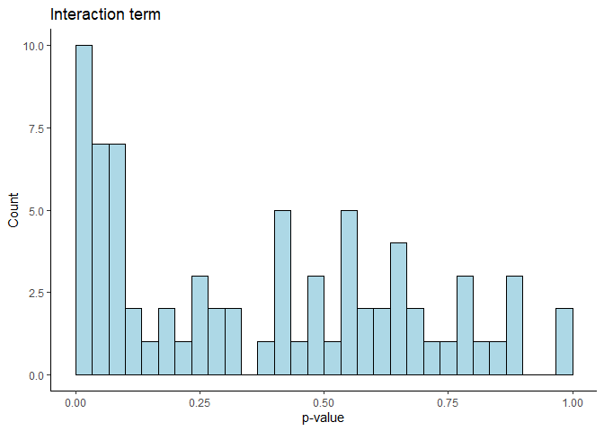<!-- -->

``` r
#Extract the significant in interaction term together with the disease score estimate
sig <- res_inter %>% filter(p_adj<0.05)
sig
```

    ##                            Estimate Std.Error  pvalue    padj
    ## s__Bacteroides_dorei         -0.125     0.022 1.1e-07 6.7e-06
    ## s__Prevotella_copri          -0.244     0.078 2.1e-03 3.8e-02
    ## s__Ruminococcus_bromii        0.151     0.051 3.3e-03 4.0e-02
    ## s__Veillonella_parvula        0.299     0.097 2.5e-03 3.8e-02
    ## s__Akkermansia_muciniphila   -0.610     0.121 1.3e-06 4.0e-05
    ##                                                  bugs method      p_adj
    ## s__Bacteroides_dorei             s__Bacteroides_dorei NBZIMM 0.00000825
    ## s__Prevotella_copri               s__Prevotella_copri NBZIMM 0.04687500
    ## s__Ruminococcus_bromii         s__Ruminococcus_bromii NBZIMM 0.04950000
    ## s__Veillonella_parvula         s__Veillonella_parvula NBZIMM 0.04687500
    ## s__Akkermansia_muciniphila s__Akkermansia_muciniphila NBZIMM 0.00004875

``` r
sig1 <- res_inter_disease[row.names(sig),]
sig1
```

    ##                            Estimate Std.Error  pvalue    padj
    ## s__Bacteroides_dorei          0.130     0.018 2.4e-11 1.5e-09
    ## s__Prevotella_copri           0.327     0.070 6.8e-06 1.0e-04
    ## s__Ruminococcus_bromii       -0.080     0.038 3.7e-02 9.4e-02
    ## s__Veillonella_parvula       -0.096     0.064 1.4e-01 2.5e-01
    ## s__Akkermansia_muciniphila    0.640     0.109 3.4e-08 1.0e-06
    ##                                                  bugs method       p_adj
    ## s__Bacteroides_dorei             s__Bacteroides_dorei NBZIMM 1.80000e-09
    ## s__Prevotella_copri               s__Prevotella_copri NBZIMM 1.27500e-04
    ## s__Ruminococcus_bromii         s__Ruminococcus_bromii NBZIMM 1.15625e-01
    ## s__Veillonella_parvula         s__Veillonella_parvula NBZIMM 3.00000e-01
    ## s__Akkermansia_muciniphila s__Akkermansia_muciniphila NBZIMM 1.27500e-06

``` r
sig_inter <- sig

#Plot significant interaction:
#Plot the detected species - interaction:
pheno_temp <- pheno
pheno_temp$J_ID <- row.names(pheno_temp)
temp_meta <- merge(pheno_temp, meta, by.x="J_ID", by.y="J_ID")
temp_meta$age_gr1 <- ifelse(temp_meta$age_gr==1, "Children", "Adults")
temp_meta$age_gr1 <-factor(temp_meta$age_gr1, levels=c("Children", "Adults"))

spec <- sig$bugs
for (i in spec){
  j <- gsub("s__", "", i)
  j <- gsub("_", " ", j)
  p <- ggplot(data=temp_meta, aes_string(x="f_cal_current", y=paste0(i, "/rdepth"), color = "age_gr1"))+
    geom_point(size=1)+geom_smooth(se=F)+theme_classic()+xlab("Faecal calprotectin")+ylab("Relative abundance") + ggtitle(as.character(j))+labs(color="Age group")
print(p)

}
```

    ## `geom_smooth()` using method = 'loess' and formula 'y ~ x'

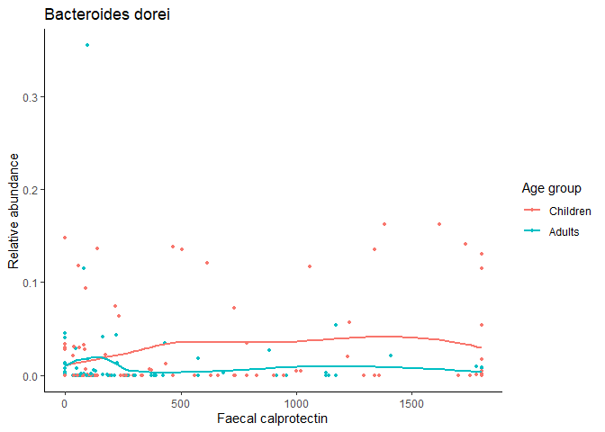<!-- -->

    ## `geom_smooth()` using method = 'loess' and formula 'y ~ x'

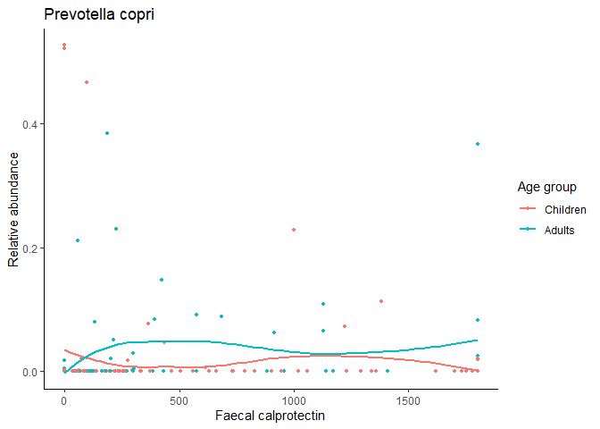<!-- -->

    ## `geom_smooth()` using method = 'loess' and formula 'y ~ x'

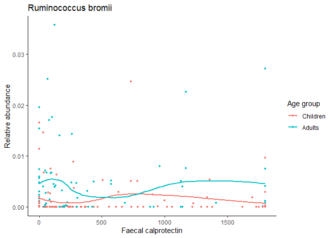<!-- -->

    ## `geom_smooth()` using method = 'loess' and formula 'y ~ x'

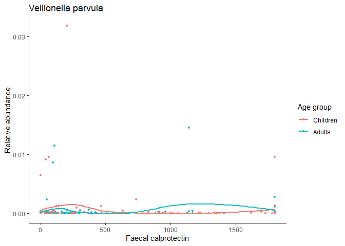<!-- -->

    ## `geom_smooth()` using method = 'loess' and formula 'y ~ x'

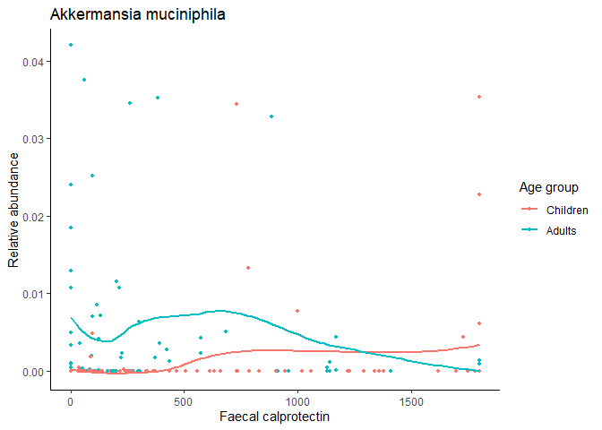<!-- -->

``` r
#Extract the significant in interaction term in the zero-inflated part, together with the disease score estimate
ggplot(res_inter_zero)+
  geom_histogram(aes(x=pvalue), bins=30, breaks = seq(0, 1, by=1/30), color="black", fill = "lightblue")+
  theme_classic()+ xlab("p-value")+ylab("Count")+ggtitle("Zero-inflated interaction term")
```

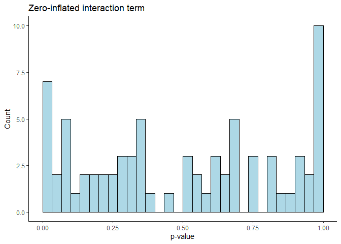<!-- -->

``` r
sig <- res_inter_zero %>% filter(p_adj<0.05)
sig 
```

    ##                        Estimate Std.Error pvalue  padj                   bugs
    ## s__Bacteroides_dorei      0.470     0.143 0.0010 0.034   s__Bacteroides_dorei
    ## s__Eubacterium_siraeum    0.572     0.176 0.0011 0.034 s__Eubacterium_siraeum
    ##                        method   p_adj
    ## s__Bacteroides_dorei   NBZIMM 0.04125
    ## s__Eubacterium_siraeum NBZIMM 0.04125

``` r
sig1 <- res_inter_zero_disease[row.names(sig),]
sig1
```

    ##                        Estimate Std.Error pvalue padj                   bugs
    ## s__Bacteroides_dorei     -0.187     0.086  0.029 0.29   s__Bacteroides_dorei
    ## s__Eubacterium_siraeum   -0.133     0.081  0.100 0.55 s__Eubacterium_siraeum
    ##                        method     p_adj
    ## s__Bacteroides_dorei   NBZIMM 0.3625000
    ## s__Eubacterium_siraeum NBZIMM 0.6818182

``` r
sig_inter_zero <- sig

spec <- sig$bugs
for (i in spec){
  test <- temp_meta[,i]
  test <- ifelse(test==0, "Absent", "Present")
  temp_meta$test <- test
  j <- gsub("s__", "", i)
  j <- gsub("_", " ", j)
  p <- ggplot(data=temp_meta)+
    geom_boxplot(aes(x=test, y=f_cal_current, color=test), outlier.size=1)+theme_classic()+xlab(" ")+ylab("Faecal calprotectin") + ggtitle(as.character(j))+theme(legend.position="none")+facet_wrap(~age_gr1)
 print(p)

}
```

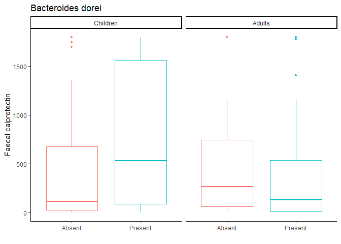<!-- -->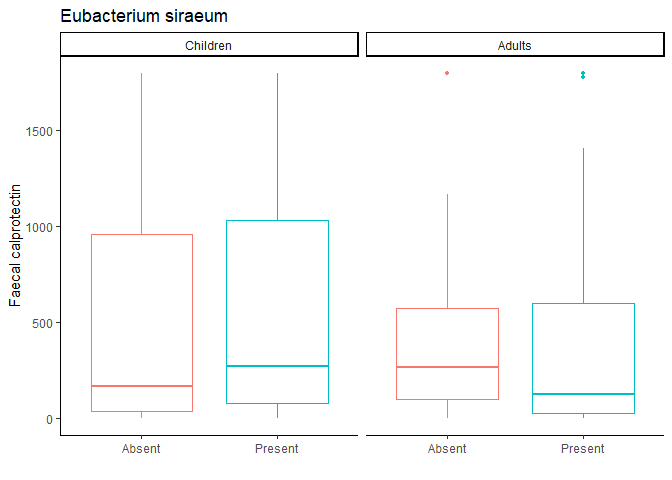<!-- -->

``` r
#Plot all NBZIMM interaction results together in one plot:
sig <- res_inter %>% filter(p_adj<0.05)
spec <- c(sig$bugs, "s__Eubacterium_siraeum")
pheno_temp_relab <- pheno_relab
pheno_temp_relab$J_ID <- row.names(pheno_temp_relab)
temp_meta_relab <- merge(pheno_temp_relab, meta, by.x="J_ID", by.y="J_ID")
temp_meta_relab$age_gr1 <- ifelse(temp_meta_relab$age_gr==1, "Children", "Adults")
temp_meta_relab$age_gr1 <-factor(temp_meta_relab$age_gr1, levels=c("Children", "Adults"))
temp1 <- temp_meta_relab %>%
  pivot_longer(., cols = colnames(pheno_relab), names_to = "Var", values_to = "Val")

temp1$Var1 <- gsub("s__", "", temp1$Var)
temp1$Var1 <- gsub("_", " ", temp1$Var1)

temp2 <- temp1 %>% filter(Var %in% spec)
ggplot(temp2, aes(x=f_cal_current, y=Val, color=age_gr1))+
  geom_point(size=1)+geom_smooth(se=F)+theme_classic()+facet_wrap(~Var1, scales="free_y")+ylab("Relative abundance")+labs(color="Age group")+ theme(legend.position = c(1, 0),legend.justification = c(1, 0))+xlab("Faecal calprotectin")
```

    ## `geom_smooth()` using method = 'loess' and formula 'y ~ x'

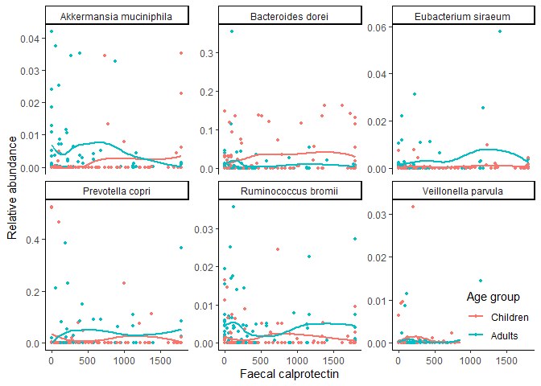<!-- -->

``` r
#Investigate results without interaction term: Disease score:
ggplot(res_disease)+
  geom_histogram(aes(x=pvalue), bins=30, breaks = seq(0, 1, by=1/30), color="black", fill = "lightblue")+
  theme_classic()+ xlab("p-value")+ylab("Count")+ggtitle("Disease score")
```

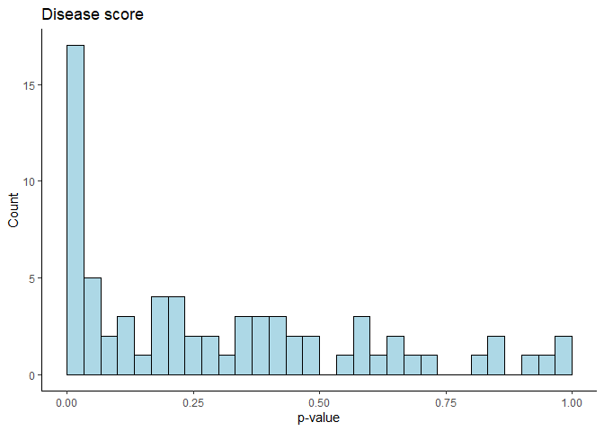<!-- -->

``` r
sig <- res_disease %>% filter(p_adj<0.05)
sig
```

    ##                                     Estimate Std.Error  pvalue    padj
    ## s__Bifidobacterium_longum             -0.101     0.037 7.0e-03 2.7e-02
    ## s__Bacteroides_caccae                  0.137     0.035 1.4e-04 9.4e-04
    ## s__Barnesiella_intestinihominis        0.075     0.017 1.7e-05 4.6e-04
    ## s__Alistipes_inops                    -0.148     0.040 3.1e-04 1.9e-03
    ## s__Alistipes_onderdonkii               0.104     0.034 2.6e-03 1.3e-02
    ## s__Clostridium_sp_CAG_58               0.165     0.042 1.3e-04 9.4e-04
    ## s__Intestinimonas_butyriciproducens    0.114     0.027 5.6e-05 7.5e-04
    ## s__Eubacterium_hallii                 -0.098     0.030 1.3e-03 7.0e-03
    ## s__Eubacterium_sp_CAG_180              0.190     0.032 3.3e-08 1.8e-06
    ## s__Anaerostipes_hadrus                -0.122     0.030 6.9e-05 7.5e-04
    ## s__Blautia_obeum                      -0.137     0.032 4.0e-05 7.2e-04
    ## s__Fusicatenibacter_saccharivorans    -0.085     0.030 6.0e-03 2.5e-02
    ## s__Clostridium_bolteae                 0.086     0.032 7.7e-03 2.8e-02
    ## s__Flavonifractor_plautii              0.106     0.037 5.4e-03 2.4e-02
    ## s__Firmicutes_bacterium_CAG_94        -0.119     0.030 1.2e-04 9.4e-04
    ##                                                                    bugs method
    ## s__Bifidobacterium_longum                     s__Bifidobacterium_longum NBZIMM
    ## s__Bacteroides_caccae                             s__Bacteroides_caccae NBZIMM
    ## s__Barnesiella_intestinihominis         s__Barnesiella_intestinihominis NBZIMM
    ## s__Alistipes_inops                                   s__Alistipes_inops NBZIMM
    ## s__Alistipes_onderdonkii                       s__Alistipes_onderdonkii NBZIMM
    ## s__Clostridium_sp_CAG_58                       s__Clostridium_sp_CAG_58 NBZIMM
    ## s__Intestinimonas_butyriciproducens s__Intestinimonas_butyriciproducens NBZIMM
    ## s__Eubacterium_hallii                             s__Eubacterium_hallii NBZIMM
    ## s__Eubacterium_sp_CAG_180                     s__Eubacterium_sp_CAG_180 NBZIMM
    ## s__Anaerostipes_hadrus                           s__Anaerostipes_hadrus NBZIMM
    ## s__Blautia_obeum                                       s__Blautia_obeum NBZIMM
    ## s__Fusicatenibacter_saccharivorans   s__Fusicatenibacter_saccharivorans NBZIMM
    ## s__Clostridium_bolteae                           s__Clostridium_bolteae NBZIMM
    ## s__Flavonifractor_plautii                     s__Flavonifractor_plautii NBZIMM
    ## s__Firmicutes_bacterium_CAG_94           s__Firmicutes_bacterium_CAG_94 NBZIMM
    ##                                            p_adj
    ## s__Bifidobacterium_longum           0.0350000000
    ## s__Bacteroides_caccae               0.0012250000
    ## s__Barnesiella_intestinihominis     0.0005950000
    ## s__Alistipes_inops                  0.0024111111
    ## s__Alistipes_onderdonkii            0.0165454545
    ## s__Clostridium_sp_CAG_58            0.0012250000
    ## s__Intestinimonas_butyriciproducens 0.0009660000
    ## s__Eubacterium_hallii               0.0091000000
    ## s__Eubacterium_sp_CAG_180           0.0000023100
    ## s__Anaerostipes_hadrus              0.0009660000
    ## s__Blautia_obeum                    0.0009333333
    ## s__Fusicatenibacter_saccharivorans  0.0323076923
    ## s__Clostridium_bolteae              0.0359333333
    ## s__Flavonifractor_plautii           0.0315000000
    ## s__Firmicutes_bacterium_CAG_94      0.0012250000

``` r
sig_disease <- sig

#Plot the detected species:
spec <- sig$bugs
for (i in spec){
  j <- gsub("s__", "", i)
  j <- gsub("_", " ", j)
  p <- ggplot(data=temp_meta, aes_string(x="f_cal_current", y=paste0(i, "/rdepth")))+
    geom_point(size=1)+geom_smooth(se=T)+theme_classic()+xlab("Faecal calprotectin")+ylab("Relative abundance") + ggtitle(as.character(j))
 print(p)

}
```

    ## `geom_smooth()` using method = 'loess' and formula 'y ~ x'

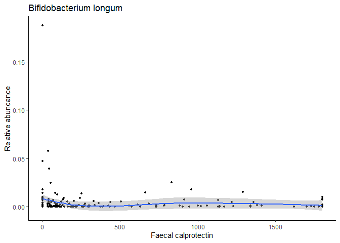<!-- -->

    ## `geom_smooth()` using method = 'loess' and formula 'y ~ x'

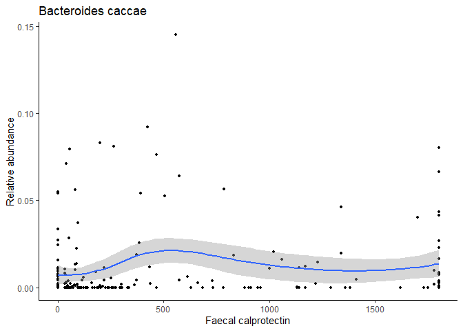<!-- -->

    ## `geom_smooth()` using method = 'loess' and formula 'y ~ x'

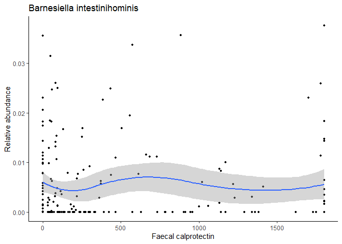<!-- -->

    ## `geom_smooth()` using method = 'loess' and formula 'y ~ x'

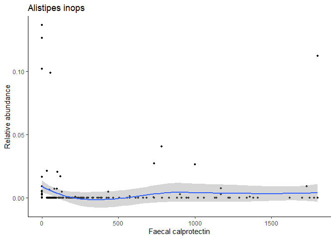<!-- -->

    ## `geom_smooth()` using method = 'loess' and formula 'y ~ x'

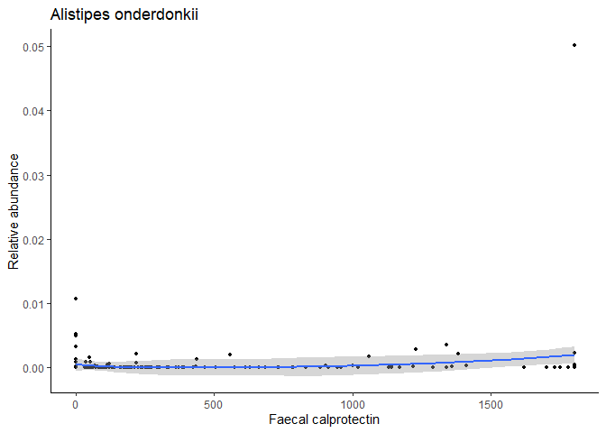<!-- -->

    ## `geom_smooth()` using method = 'loess' and formula 'y ~ x'

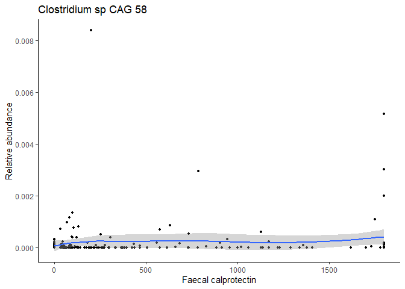<!-- -->

    ## `geom_smooth()` using method = 'loess' and formula 'y ~ x'

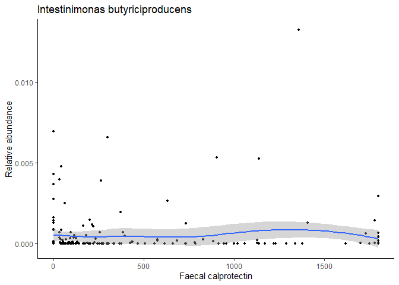<!-- -->

    ## `geom_smooth()` using method = 'loess' and formula 'y ~ x'

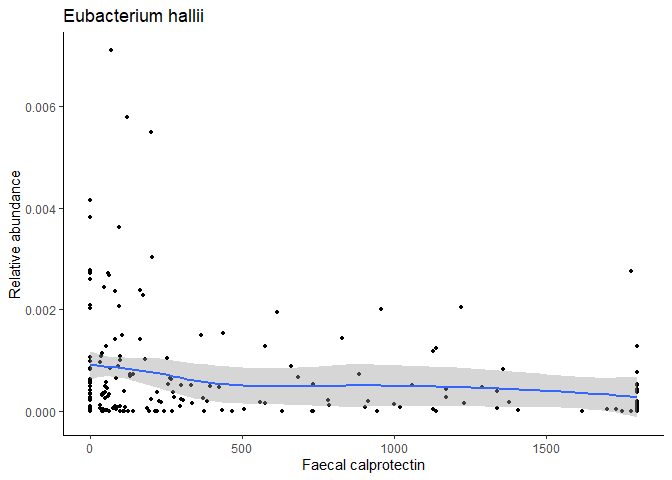<!-- -->

    ## `geom_smooth()` using method = 'loess' and formula 'y ~ x'

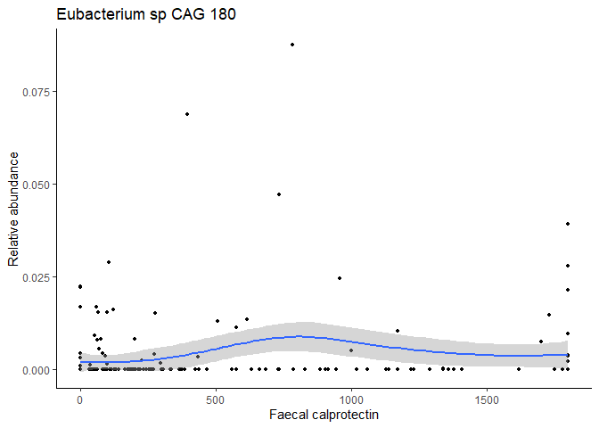<!-- -->

    ## `geom_smooth()` using method = 'loess' and formula 'y ~ x'

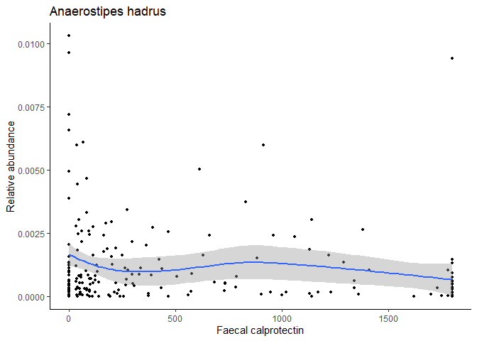<!-- -->

    ## `geom_smooth()` using method = 'loess' and formula 'y ~ x'

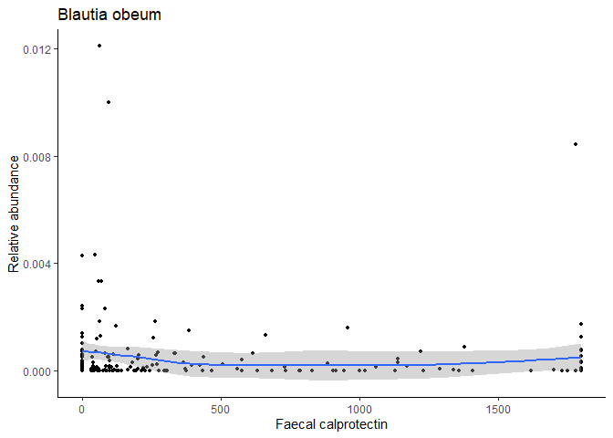<!-- -->

    ## `geom_smooth()` using method = 'loess' and formula 'y ~ x'

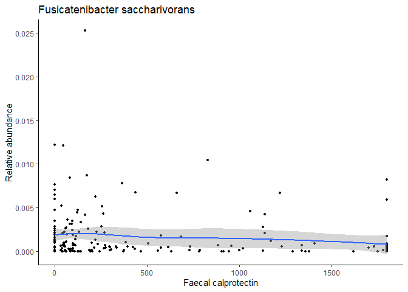<!-- -->

    ## `geom_smooth()` using method = 'loess' and formula 'y ~ x'

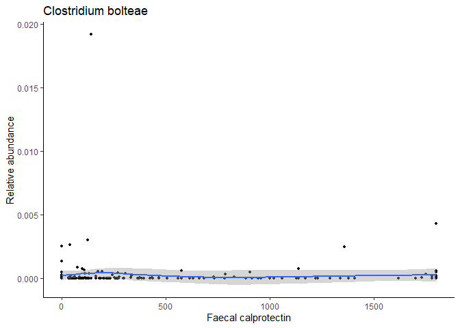<!-- -->

    ## `geom_smooth()` using method = 'loess' and formula 'y ~ x'

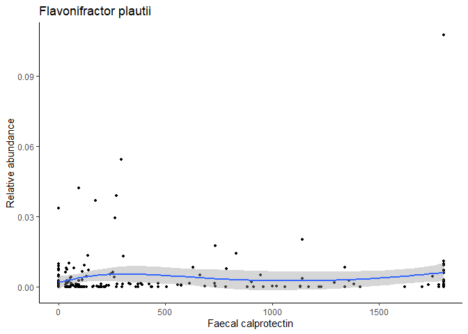<!-- -->

    ## `geom_smooth()` using method = 'loess' and formula 'y ~ x'

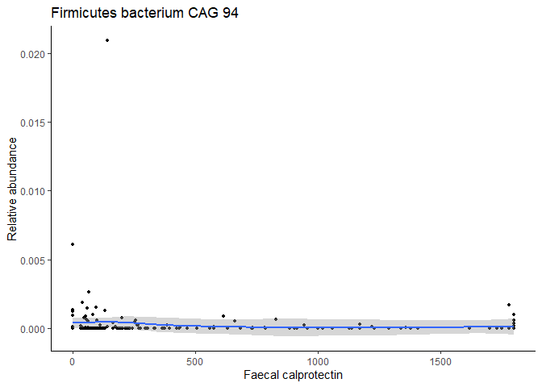<!-- -->

``` r
#Plot all together:
temp2 <- temp1 %>% filter(Var %in% spec)
ggplot(temp2, aes(x=f_cal_current, y=Val))+
  geom_point(size=1)+geom_smooth(se=T)+theme_classic()+facet_wrap(~Var1, scales="free_y", ncol=3)+ylab("Relative abundance")+xlab("Faecal calprotectin")
```

    ## `geom_smooth()` using method = 'loess' and formula 'y ~ x'

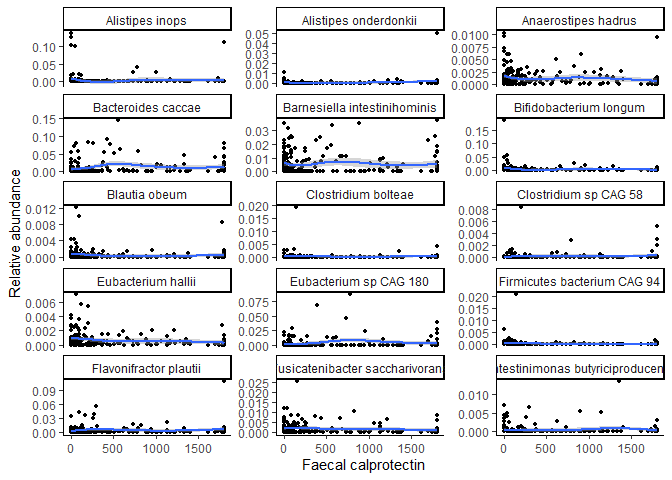<!-- -->

``` r
#Investigate results without interaction term: Disease score, zero inflated:
ggplot(res_disease_zero)+
  geom_histogram(aes(x=pvalue), bins=30, breaks = seq(0, 1, by=1/30), color="black", fill = "lightblue")+
  theme_classic()+ xlab("p-value")+ylab("Count")+ggtitle("Zero-inflated disease score")
```

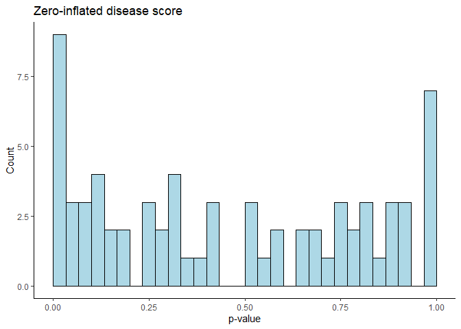<!-- -->

``` r
sig <- res_disease_zero %>% filter(p_adj<0.05)
sig 
```

    ##                                Estimate Std.Error  pvalue   padj
    ## s__Bifidobacterium_catenulatum    0.355     0.093 0.00015 0.0081
    ##                                                          bugs method  p_adj
    ## s__Bifidobacterium_catenulatum s__Bifidobacterium_catenulatum NBZIMM 0.0105

``` r
spec <- sig$bugs
for (i in spec){
  test <- temp_meta[,i]
  test <- ifelse(test==0, "Absent", "Present")
  temp_meta$test <- test
  j <- gsub("s__", "", i)
  j <- gsub("_", " ", j)
  p <- ggplot(data=temp_meta)+
    geom_boxplot(aes(x=test, y=f_cal_current, color=test), outlier.size=1)+theme_classic()+xlab(" ")+ylab("Faecal calprotectin") + ggtitle(as.character(j))+theme(legend.position="none")
 print(p)

}
```

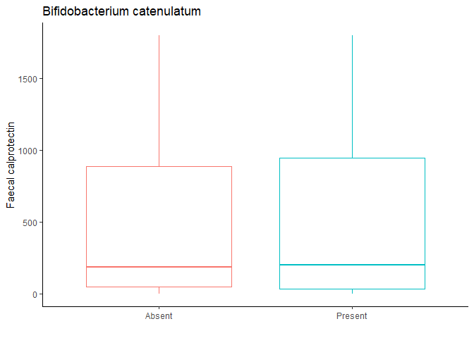<!-- -->
