Functional analyses of using NBZIMM and ZIGMM
================

  - [Read in packages and data](#read-in-packages-and-data)
  - [Cluster pathways based on
    correlation](#cluster-pathways-based-on-correlation)
  - [Test the association between clinical disease score and
    pathways](#test-the-association-between-clinical-disease-score-and-pathways)
  - [Test the association between paraclinical disease score and
    pathways](#test-the-association-between-paraclinical-disease-score-and-pathways)
  - [Cluster ECs based on
    correlation](#cluster-ecs-based-on-correlation)
  - [Test the association between clinical disease score and
    ECs](#test-the-association-between-clinical-disease-score-and-ecs)
  - [Test the association between paraclinical disease score and
    ECs](#test-the-association-between-paraclinical-disease-score-and-ecs)
  - [Cluster KOs based on
    correlation](#cluster-kos-based-on-correlation)
  - [Test the association between clinical disease score and
    KOs](#test-the-association-between-clinical-disease-score-and-kos)
  - [Test the association between paraclinical disease score and
    KOs](#test-the-association-between-paraclinical-disease-score-and-kos)

# Read in packages and data

Load in packages and path to folder:

``` r
library(tidyverse)
library(caret)
library(phyloseq)
library(NBZIMM)
library(vegan)
library(metaMint)
library(lme4)
library(lmerTest)
library(nlme)
library(zCompositions)
path = "C:/Users/Tom/Documents/10. semester/V1/data/"
```

Load in data:

``` r
#Load in humann - OBS: first 3 columns: J_ID, UNMAPPED and UNINTEGRATED
pathway <- read.delim(file=paste0(path, "humann3_processed_output/processed_tables/", "pathway_count_unstratified_mean50_var50.txt")) 
EC <- read.delim(file=paste0(path, "humann3_processed_output/processed_tables/", "EC_relab_unstratified_mean75_var75.txt"))
KO <- read.delim(file=paste0(path, "humann3_processed_output/processed_tables/", "KO_relab_unstratified_mean75_var75.txt"))

#Load in meta data:
meta <- read.delim(paste0(path, "metadata/", "preped_metadata_filtered.txt"))

#Merge with meta data 
pathway_meta <- merge(meta, pathway, by.x="J_ID", by.y="J_ID")
EC_meta <- merge(meta, EC, by.x="J_ID", by.y="J_ID")
KO_meta <- merge(meta, KO, by.x="J_ID", by.y="J_ID")
```

# Cluster pathways based on correlation

The number of pathways to be tested are very large. Cluster those that
are very correlated to test fewer\!

``` r
#Reduce the numer to be tested! Remove those with high positive correlation: Do this based on relative abundance!
pathway_relab <-read.delim(file=paste0(path, "humann3_processed_output/processed_tables/", "pathway_relab_unstratified.txt")) 
pathway_relab <- pathway_relab[, colnames(pathway)]

pathway1 <- pathway_relab[, -c(1)]

# Ward Hierarchical Clustering
dissimilarity = 1-abs(cor(pathway1, method='spearman')) # generate distance between columns so use trans
d <- as.dist(dissimilarity) 

fit <- hclust(d, method="ward.D")
plot(fit, labels = F)

# cut tree into groups by hight
groups <- cutree(fit, h=0.25) # cut tree based on hight
table(groups) #64 different groups 
```

    ## groups
    ##  1  2  3  4  5  6  7  8  9 10 11 12 13 14 15 16 17 18 19 20 21 22 23 24 25 26 
    ##  2  2  1  4  4  3  1  2  2  1  4  2  9  1  2  2  1  1  3  3  1  2  2  5  1  1 
    ## 27 28 29 30 31 32 33 34 35 36 37 38 39 40 41 42 43 44 45 46 47 48 49 50 51 52 
    ##  1  1  3  2  1  2  1  1  1  2  2  2  3  2  2  2  1  3  2  3  2  1  1  1  2  1 
    ## 53 54 55 56 57 58 59 60 61 62 63 
    ##  1  1  1  1  1  1  1  1  1  1  1

``` r
rect.hclust(fit, h=0.25, border="red") # draw dendogram with red borders around the clusters
```

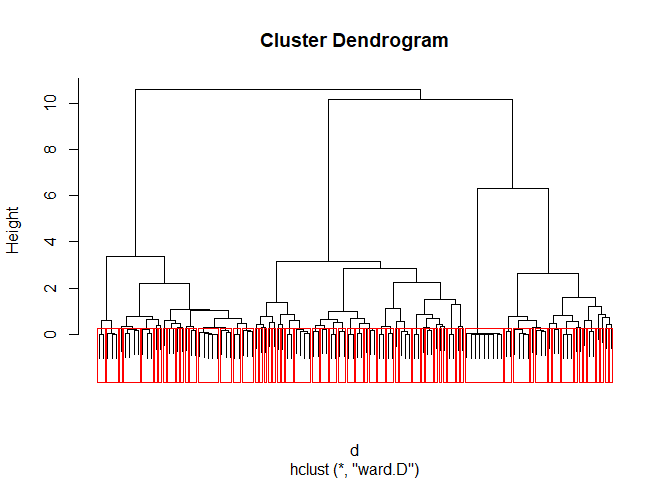<!-- -->

``` r
#Plot correlations
non.singles = as.numeric(names(table(groups)[table(groups) != 1]))
for (c in non.singles){
    cluster1 <- pathway1[,groups == c]
    plot(cluster1, main=c)
}
```

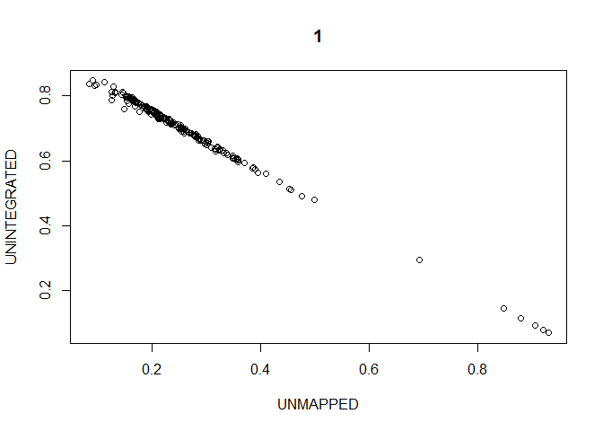<!-- -->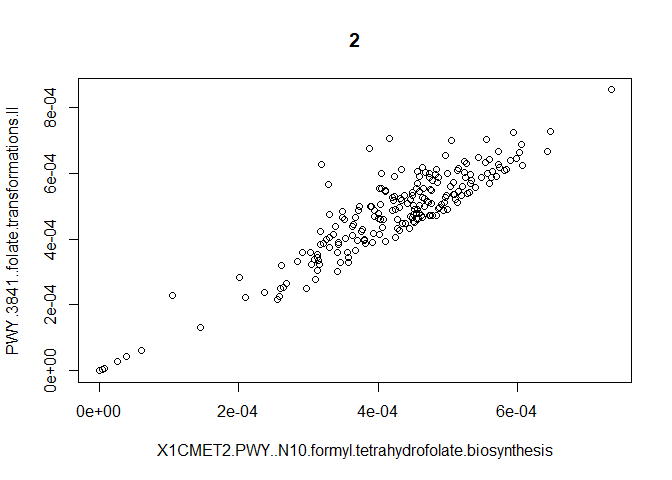<!-- -->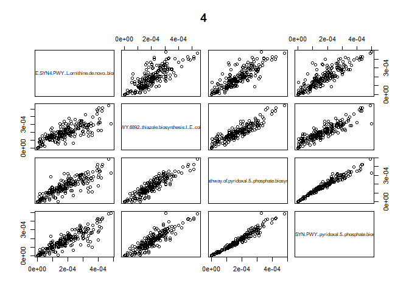<!-- -->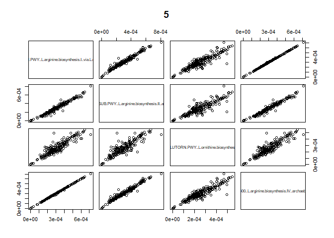<!-- -->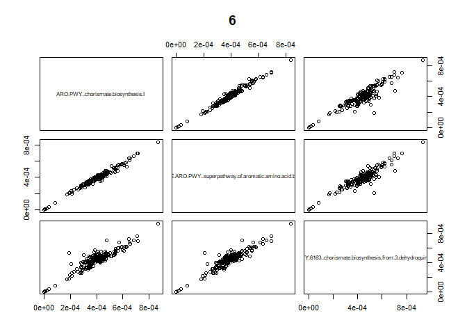<!-- -->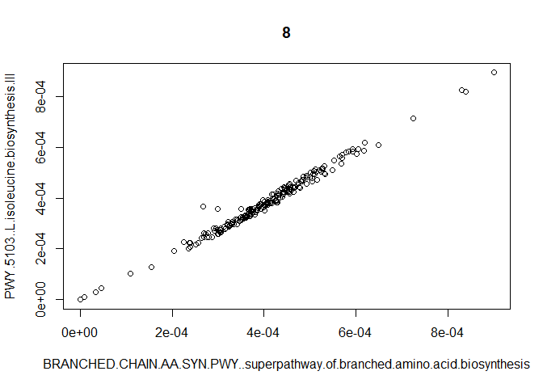<!-- -->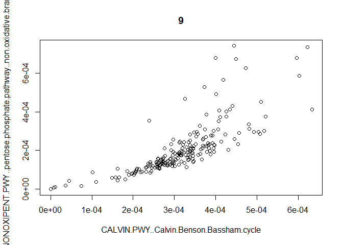<!-- -->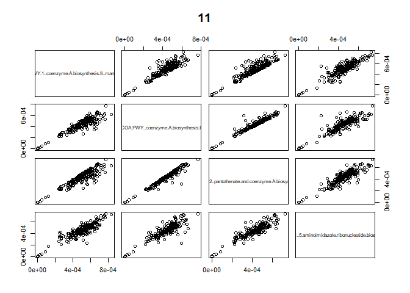<!-- -->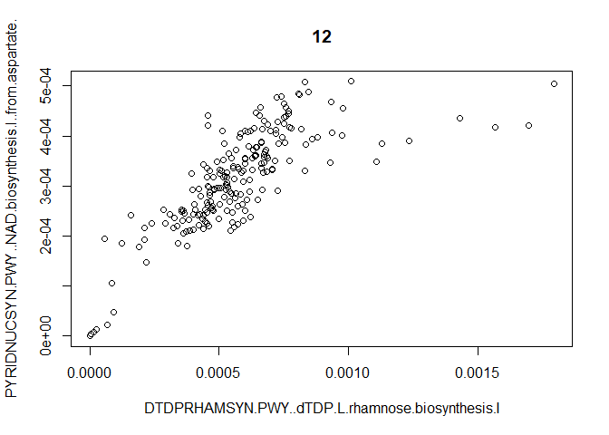<!-- -->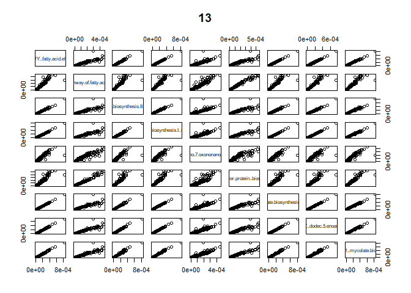<!-- -->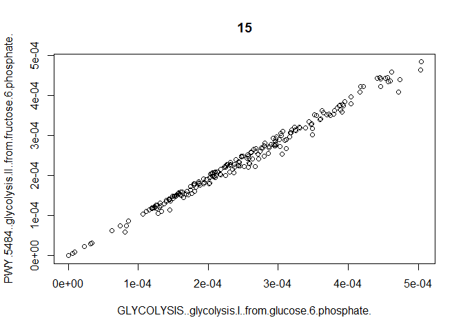<!-- -->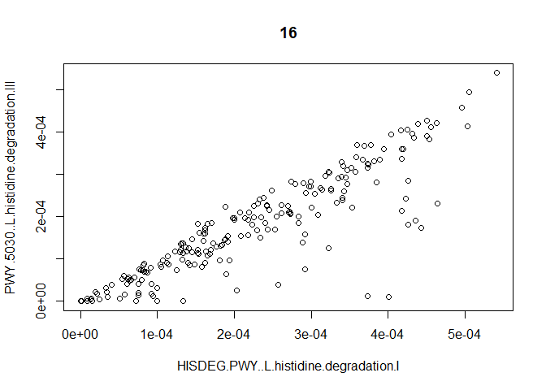<!-- -->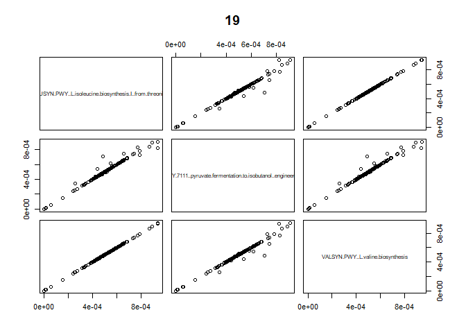<!-- -->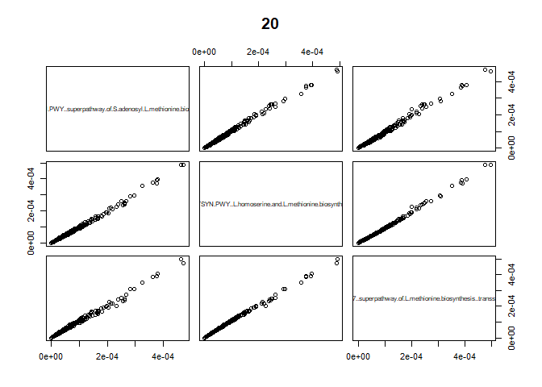<!-- -->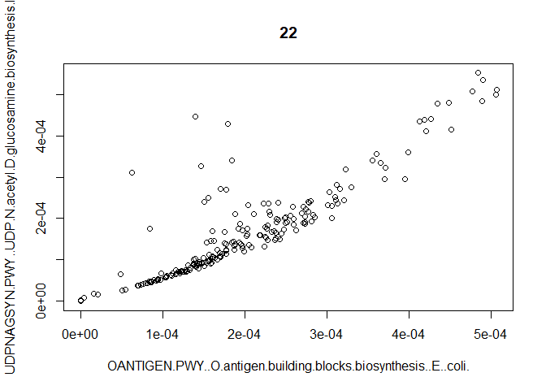<!-- -->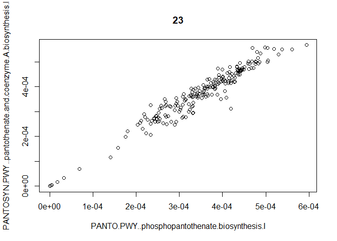<!-- -->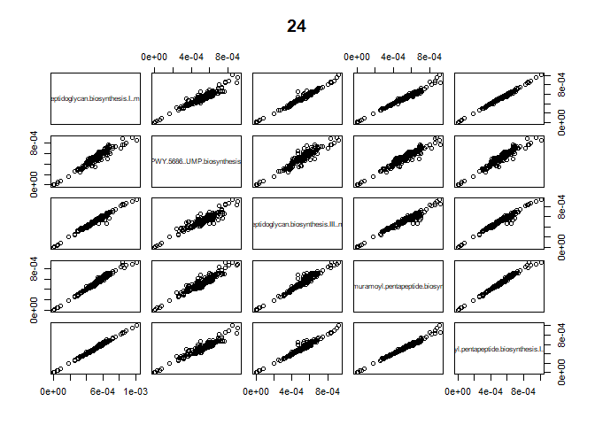<!-- -->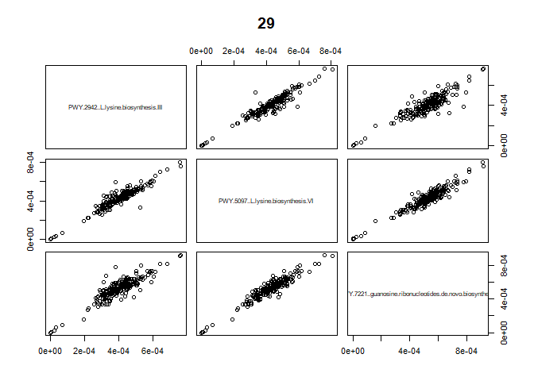<!-- --><!-- -->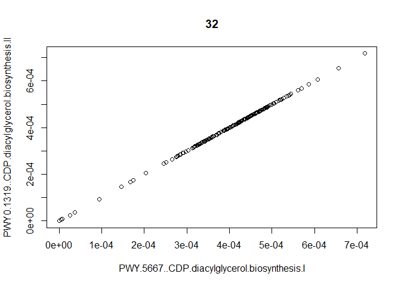<!-- -->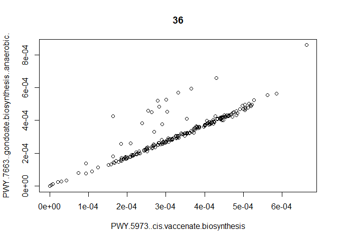<!-- -->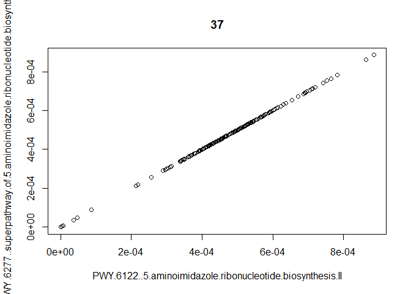<!-- -->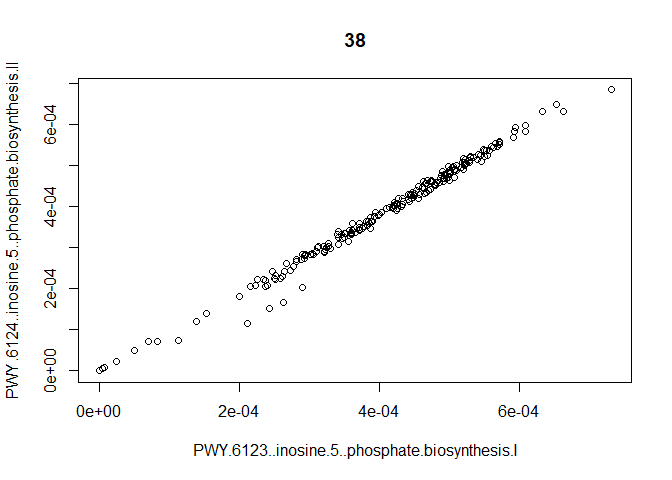<!-- -->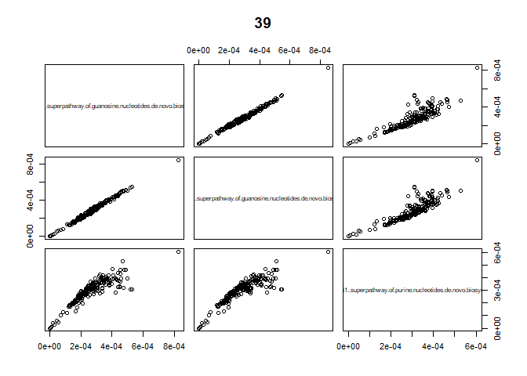<!-- -->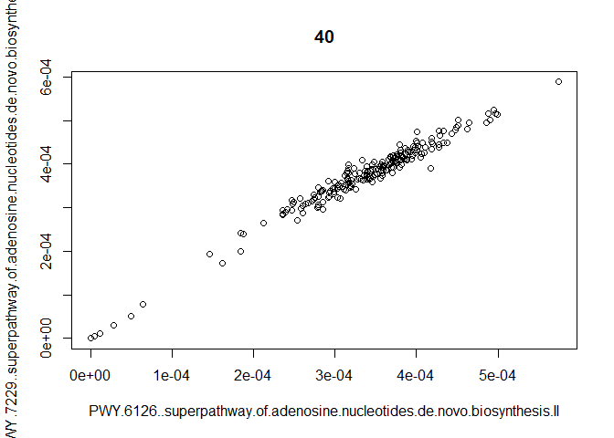<!-- -->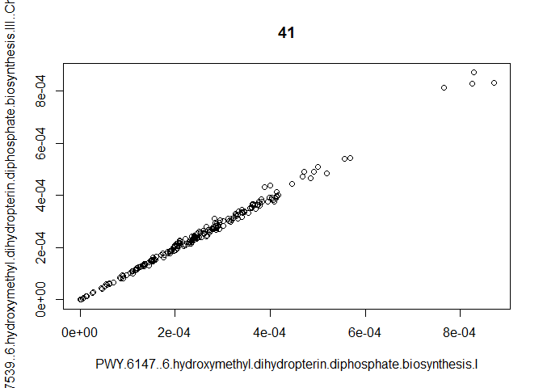<!-- -->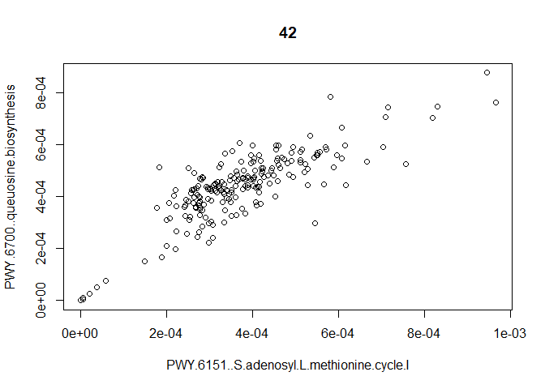<!-- -->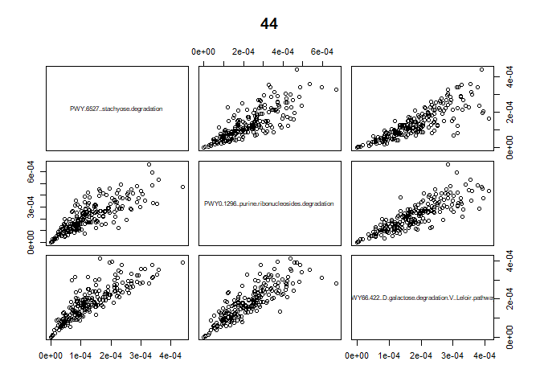<!-- -->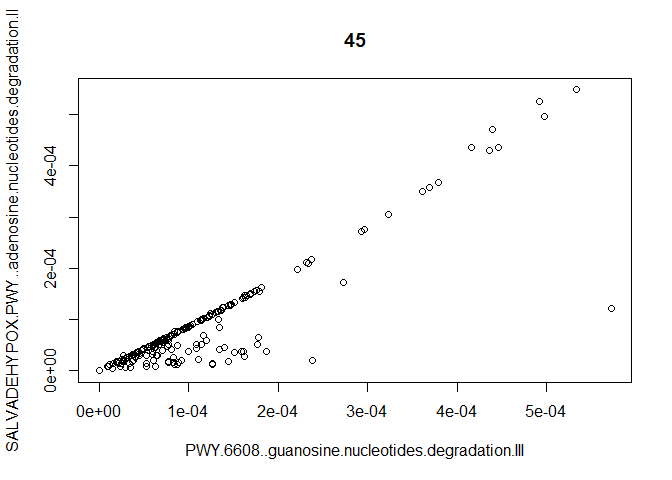<!-- -->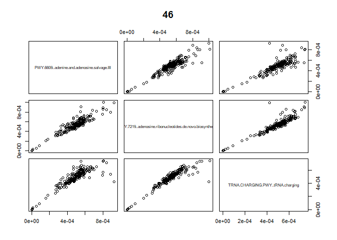<!-- --><!-- -->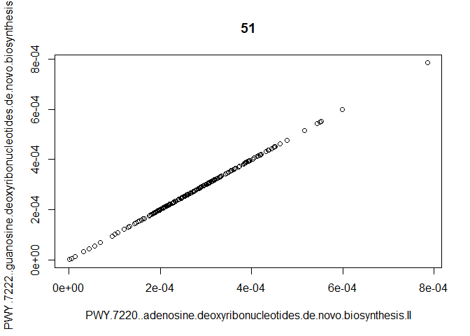<!-- -->

``` r
# select cluster representative
reps = vector()
singles = as.numeric(names(table(groups)[table(groups) == 1]))
for (n in singles){
    reps[n] = names(groups[groups == n])
}
        
for (c in non.singles){
  cluster1 <- pathway1[,groups == c] 
  col_mean <- apply(cluster1, 2, mean)
  reps[c] <-  names(sort(col_mean, decreasing=T))[1]
}

#These are the pathways in the different clusters:
for (c in 1: length(table(groups))){
          cluster1 <- pathway1[,groups == c] 
          print(c)
          print(names(cluster1))
        }
```

    ## [1] 1
    ## [1] "UNMAPPED"     "UNINTEGRATED"
    ## [1] 2
    ## [1] "X1CMET2.PWY..N10.formyl.tetrahydrofolate.biosynthesis"
    ## [2] "PWY.3841..folate.transformations.II"                  
    ## [1] 3
    ## NULL
    ## [1] 4
    ## [1] "ARGININE.SYN4.PWY..L.ornithine.de.novo..biosynthesis"                     
    ## [2] "PWY.6892..thiazole.biosynthesis.I..E..coli."                              
    ## [3] "PWY0.845..superpathway.of.pyridoxal.5..phosphate.biosynthesis.and.salvage"
    ## [4] "PYRIDOXSYN.PWY..pyridoxal.5..phosphate.biosynthesis.I"                    
    ## [1] 5
    ## [1] "ARGSYN.PWY..L.arginine.biosynthesis.I..via.L.ornithine."  
    ## [2] "ARGSYNBSUB.PWY..L.arginine.biosynthesis.II..acetyl.cycle."
    ## [3] "GLUTORN.PWY..L.ornithine.biosynthesis"                    
    ## [4] "PWY.7400..L.arginine.biosynthesis.IV..archaebacteria."    
    ## [1] 6
    ## [1] "ARO.PWY..chorismate.biosynthesis.I"                                
    ## [2] "COMPLETE.ARO.PWY..superpathway.of.aromatic.amino.acid.biosynthesis"
    ## [3] "PWY.6163..chorismate.biosynthesis.from.3.dehydroquinate"           
    ## [1] 7
    ## NULL
    ## [1] 8
    ## [1] "BRANCHED.CHAIN.AA.SYN.PWY..superpathway.of.branched.amino.acid.biosynthesis"
    ## [2] "PWY.5103..L.isoleucine.biosynthesis.III"                                    
    ## [1] 9
    ## [1] "CALVIN.PWY..Calvin.Benson.Bassham.cycle"                         
    ## [2] "NONOXIPENT.PWY..pentose.phosphate.pathway..non.oxidative.branch."
    ## [1] 10
    ## NULL
    ## [1] 11
    ## [1] "COA.PWY.1..coenzyme.A.biosynthesis.II..mammalian."       
    ## [2] "COA.PWY..coenzyme.A.biosynthesis.I"                      
    ## [3] "PWY.4242..pantothenate.and.coenzyme.A.biosynthesis.III"  
    ## [4] "PWY.6121..5.aminoimidazole.ribonucleotide.biosynthesis.I"
    ## [1] 12
    ## [1] "DTDPRHAMSYN.PWY..dTDP.L.rhamnose.biosynthesis.I"     
    ## [2] "PYRIDNUCSYN.PWY..NAD.biosynthesis.I..from.aspartate."
    ## [1] 13
    ## [1] "FASYN.ELONG.PWY..fatty.acid.elongation....saturated"                            
    ## [2] "FASYN.INITIAL.PWY..superpathway.of.fatty.acid.biosynthesis.initiation..E..coli."
    ## [3] "PWY.5989..stearate.biosynthesis.II..bacteria.and.plants."                       
    ## [4] "PWY.6282..palmitoleate.biosynthesis.I..from..5Z..dodec.5.enoate."               
    ## [5] "PWY.6519..8.amino.7.oxononanoate.biosynthesis.I"                                
    ## [6] "PWY.7388..octanoyl..acyl.carrier.protein..biosynthesis..mitochondria..yeast."   
    ## [7] "PWY.7664..oleate.biosynthesis.IV..anaerobic."                                   
    ## [8] "PWY0.862...5Z..dodec.5.enoate.biosynthesis"                                     
    ## [9] "PWYG.321..mycolate.biosynthesis"                                                
    ## [1] 14
    ## NULL
    ## [1] 15
    ## [1] "GLYCOLYSIS..glycolysis.I..from.glucose.6.phosphate."
    ## [2] "PWY.5484..glycolysis.II..from.fructose.6.phosphate."
    ## [1] 16
    ## [1] "HISDEG.PWY..L.histidine.degradation.I"
    ## [2] "PWY.5030..L.histidine.degradation.III"
    ## [1] 17
    ## NULL
    ## [1] 18
    ## NULL
    ## [1] 19
    ## [1] "ILEUSYN.PWY..L.isoleucine.biosynthesis.I..from.threonine." 
    ## [2] "PWY.7111..pyruvate.fermentation.to.isobutanol..engineered."
    ## [3] "VALSYN.PWY..L.valine.biosynthesis"                         
    ## [1] 20
    ## [1] "MET.SAM.PWY..superpathway.of.S.adenosyl.L.methionine.biosynthesis"     
    ## [2] "METSYN.PWY..L.homoserine.and.L.methionine.biosynthesis"                
    ## [3] "PWY.5347..superpathway.of.L.methionine.biosynthesis..transsulfuration."
    ## [1] 21
    ## NULL
    ## [1] 22
    ## [1] "OANTIGEN.PWY..O.antigen.building.blocks.biosynthesis..E..coli."
    ## [2] "UDPNAGSYN.PWY..UDP.N.acetyl.D.glucosamine.biosynthesis.I"      
    ## [1] 23
    ## [1] "PANTO.PWY..phosphopantothenate.biosynthesis.I"           
    ## [2] "PANTOSYN.PWY..pantothenate.and.coenzyme.A.biosynthesis.I"
    ## [1] 24
    ## [1] "PEPTIDOGLYCANSYN.PWY..peptidoglycan.biosynthesis.I..meso.diaminopimelate.containing."        
    ## [2] "PWY.5686..UMP.biosynthesis"                                                                  
    ## [3] "PWY.6385..peptidoglycan.biosynthesis.III..mycobacteria."                                     
    ## [4] "PWY.6386..UDP.N.acetylmuramoyl.pentapeptide.biosynthesis.II..lysine.containing."             
    ## [5] "PWY.6387..UDP.N.acetylmuramoyl.pentapeptide.biosynthesis.I..meso.diaminopimelate.containing."
    ## [1] 25
    ## NULL
    ## [1] 26
    ## NULL
    ## [1] 27
    ## NULL
    ## [1] 28
    ## NULL
    ## [1] 29
    ## [1] "PWY.2942..L.lysine.biosynthesis.III"                     
    ## [2] "PWY.5097..L.lysine.biosynthesis.VI"                      
    ## [3] "PWY.7221..guanosine.ribonucleotides.de.novo.biosynthesis"
    ## [1] 30
    ## [1] "PWY.3001..superpathway.of.L.isoleucine.biosynthesis.I"
    ## [2] "THRESYN.PWY..superpathway.of.L.threonine.biosynthesis"
    ## [1] 31
    ## NULL
    ## [1] 32
    ## [1] "PWY.5667..CDP.diacylglycerol.biosynthesis.I"  
    ## [2] "PWY0.1319..CDP.diacylglycerol.biosynthesis.II"
    ## [1] 33
    ## NULL
    ## [1] 34
    ## NULL
    ## [1] 35
    ## NULL
    ## [1] 36
    ## [1] "PWY.5973..cis.vaccenate.biosynthesis"       
    ## [2] "PWY.7663..gondoate.biosynthesis..anaerobic."
    ## [1] 37
    ## [1] "PWY.6122..5.aminoimidazole.ribonucleotide.biosynthesis.II"             
    ## [2] "PWY.6277..superpathway.of.5.aminoimidazole.ribonucleotide.biosynthesis"
    ## [1] 38
    ## [1] "PWY.6123..inosine.5..phosphate.biosynthesis.I" 
    ## [2] "PWY.6124..inosine.5..phosphate.biosynthesis.II"
    ## [1] 39
    ## [1] "PWY.6125..superpathway.of.guanosine.nucleotides.de.novo.biosynthesis.II"
    ## [2] "PWY.7228..superpathway.of.guanosine.nucleotides.de.novo.biosynthesis.I" 
    ## [3] "PWY.841..superpathway.of.purine.nucleotides.de.novo.biosynthesis.I"     
    ## [1] 40
    ## [1] "PWY.6126..superpathway.of.adenosine.nucleotides.de.novo.biosynthesis.II"
    ## [2] "PWY.7229..superpathway.of.adenosine.nucleotides.de.novo.biosynthesis.I" 
    ## [1] 41
    ## [1] "PWY.6147..6.hydroxymethyl.dihydropterin.diphosphate.biosynthesis.I"              
    ## [2] "PWY.7539..6.hydroxymethyl.dihydropterin.diphosphate.biosynthesis.III..Chlamydia."
    ## [1] 42
    ## [1] "PWY.6151..S.adenosyl.L.methionine.cycle.I"
    ## [2] "PWY.6700..queuosine.biosynthesis"         
    ## [1] 43
    ## NULL
    ## [1] 44
    ## [1] "PWY.6527..stachyose.degradation"                      
    ## [2] "PWY0.1296..purine.ribonucleosides.degradation"        
    ## [3] "PWY66.422..D.galactose.degradation.V..Leloir.pathway."
    ## [1] 45
    ## [1] "PWY.6608..guanosine.nucleotides.degradation.III"       
    ## [2] "SALVADEHYPOX.PWY..adenosine.nucleotides.degradation.II"
    ## [1] 46
    ## [1] "PWY.6609..adenine.and.adenosine.salvage.III"             
    ## [2] "PWY.7219..adenosine.ribonucleotides.de.novo.biosynthesis"
    ## [3] "TRNA.CHARGING.PWY..tRNA.charging"                        
    ## [1] 47
    ## [1] "PWY.6703..preQ0.biosynthesis"                                  
    ## [2] "THISYN.PWY..superpathway.of.thiamin.diphosphate.biosynthesis.I"
    ## [1] 48
    ## NULL
    ## [1] 49
    ## NULL
    ## [1] 50
    ## NULL
    ## [1] 51
    ## [1] "PWY.7220..adenosine.deoxyribonucleotides.de.novo.biosynthesis.II"
    ## [2] "PWY.7222..guanosine.deoxyribonucleotides.de.novo.biosynthesis.II"
    ## [1] 52
    ## NULL
    ## [1] 53
    ## NULL
    ## [1] 54
    ## NULL
    ## [1] 55
    ## NULL
    ## [1] 56
    ## NULL
    ## [1] 57
    ## NULL
    ## [1] 58
    ## NULL
    ## [1] 59
    ## NULL
    ## [1] 60
    ## NULL
    ## [1] 61
    ## NULL
    ## [1] 62
    ## NULL
    ## [1] 63
    ## NULL

``` r
#NULL means that there is only one pathway in the cluster
```

# Test the association between clinical disease score and pathways

Analysis of pathways and clinical disease score:

``` r
#Model the pathway counts - only the representatives
pathway_meta_sub <- pathway_meta %>% filter(!is.na(score))
pheno <- pathway_meta_sub[,reps] #Only the representatives

#Is variance higher than the mean? 
mean(apply(pheno, 2, FUN=mean)) 
```

    ## [1] 128073.6

``` r
mean(apply(pheno, 2, FUN=stats::var)) 
```

    ## [1] 728446559553

``` r
#The variance is much higher than the mean! Use a NB
#Variance to mean ratio:
mean(apply(pheno, 2, function(x) var(x)/mean(x)))
```

    ## [1] 95822.17

``` r
sd(apply(pheno, 2, function(x) var(x)/mean(x)))
```

    ## [1] 735284.9

``` r
#Is there zero-inflation?
mean(apply(pheno, 2, function(x) sum(x==0)/dim(pheno)[1]))
```

    ## [1] 0.01248892

``` r
sd(apply(pheno, 2, function(x) sum(x==0)/dim(pheno)[1])) 
```

    ## [1] 0.06198116

``` r
#On average, 0.6% of samples have zeros. No zero-inflation!

N <- pathway_meta_sub$rdepth
person_ID <- as.factor(pathway_meta_sub$person_ID)
sex <-  as.factor(pathway_meta_sub$sex)
age_gr <-  as.factor(pathway_meta_sub$age_gr)
study_gr <-  as.factor(pathway_meta_sub$study_gr)
asa <-  as.factor(pathway_meta_sub$asa)
bio <-  as.factor(pathway_meta_sub$bio)
pred <-  as.factor(pathway_meta_sub$pred_total)
score_num <- pathway_meta_sub$score_num
time_point <- pathway_meta_sub$time_point

clinical = cbind.data.frame(person_ID, sex, age_gr, study_gr,asa, bio, pred, score_num, N, time_point)

#Test using NB:
f_inter <- mms(y=pheno, fixed= ~study_gr+sex+asa+bio+pred+ age_gr*score_num + offset(log(N)), data=clinical, random = ~1|person_ID, method="nb", correlation=corAR1(form=~time_point|person_ID))
```

    ## Analyzing 63 responses: 
    ## 1 2 3 4 5 6 7 8 9 10 11 12 13 14 15 16 17 18 19 20 21 22 23 24 25 26 27 28 29 30 31 32 33 34 35 36 37 38 39 40 41 42 43 44 45 46 47 48 49 50 51 52 53 54 55 56 57 58 59 60 61 62 63 
    ##  Computational time: 0.443 minutes

``` r
#Find taxa with significant (p<0.05) interaction. 
res_inter=as.data.frame(get.fixed(f_inter, part="dist", vr.name="age_gr2:score_num"))
res_inter$bugs <- rownames(res_inter)
res_inter$p_adj <- p.adjust(res_inter$pvalue, method="BH")
write.table(res_inter, file = paste0(path, "Results/", "Pathway_interaction.txt"), col.names=T, row.names=F)
res_inter_sig <- res_inter %>% filter(p_adj < 0.05)
res_inter_sig #None!
```

    ## [1] Estimate  Std.Error pvalue    padj      bugs      p_adj    
    ## <0 rows> (or 0-length row.names)

``` r
#Divide dataset into with and witout interaction:
pheno_1 <- pheno[, setdiff(colnames(pheno), rownames(res_inter_sig))]

#Analyse again with and without interaction
f_nointer<- mms(y=pheno_1, fixed= ~study_gr+sex+asa+bio+pred+age_gr+score_num+offset(log(N)), data=clinical, random = ~1|person_ID, method="nb", correlation=corAR1(form=~time_point|person_ID))
```

    ## Analyzing 63 responses: 
    ## 1 2 3 4 5 6 7 8 9 10 11 12 13 14 15 16 17 18 19 20 21 22 23 24 25 26 27 28 29 30 31 32 33 34 35 36 37 38 39 40 41 42 43 44 45 46 47 48 49 50 51 52 53 54 55 56 57 58 59 60 61 62 63 
    ##  Computational time: 0.411 minutes

``` r
#Results: Interaction, disease score:
res=as.data.frame(get.fixed(f_inter, part="dist", vr.name="score_num"))
res$p_adj <- p.adjust(res$pvalue, method="BH")
res$bugs <- rownames(res)
write.table(res, file = paste0(path, "Results/", "Pathway_interaction_disease.txt"), col.names=T, row.names=F)
res_inter_disease <- res

#Result: Disease score without interaction:
res=as.data.frame(get.fixed(f_nointer, part="dist", vr.name="score_num"))
res$p_adj <- p.adjust(res$pvalue, method="BH")
res$bugs <- rownames(res)
write.table(res, file = paste0(path, "Results/", "Pathway_disease.txt"), col.names=T, row.names=F)
res_disease <- res


##Investigate results!
#Make histograms of p-values from the interaction analysis:
ggplot(res_inter)+
  geom_histogram(aes(x=pvalue), bins=30, breaks = seq(0, 1, by=1/30), color="black", fill = "lightblue")+
  theme_classic()+ xlab("p-value")+ylab("Count")+ggtitle("Interaction term")
```

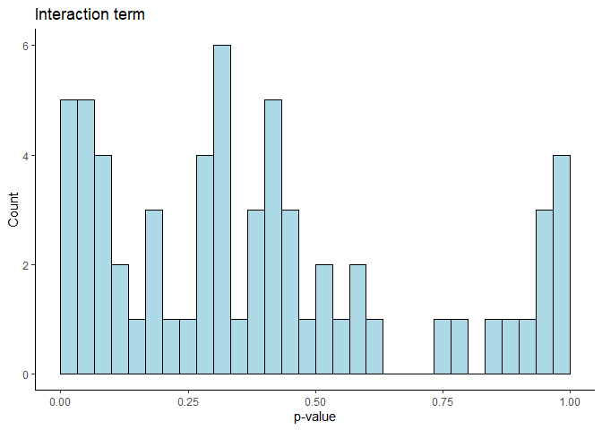<!-- -->

``` r
#Extract the significant in interaction term together with the disease score estimate
sig <- res_inter %>% filter(p_adj<0.05)
sig #None
```

    ## [1] Estimate  Std.Error pvalue    padj      bugs      p_adj    
    ## <0 rows> (or 0-length row.names)

``` r
#Investigate results without interaction term: Disease score:
ggplot(res_disease)+
  geom_histogram(aes(x=pvalue), bins=30, breaks = seq(0, 1, by=1/30), color="black", fill = "lightblue")+
  theme_classic()+ xlab("p-value")+ylab("Count")+ggtitle("Disease score")
```

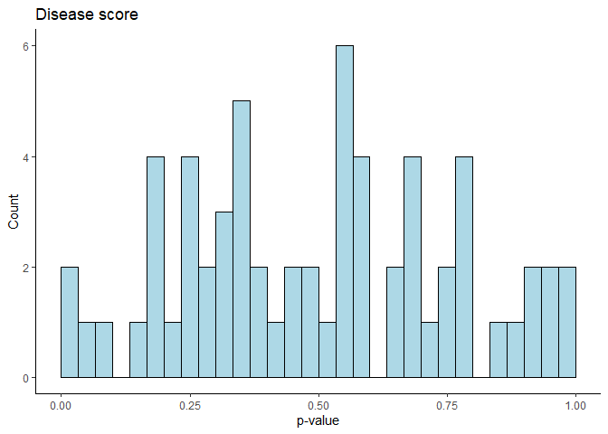<!-- -->

``` r
sig <- res_disease %>% filter(p_adj<0.05)
sig 
```

    ##                                     Estimate Std.Error pvalue  padj  p_adj
    ## PWY.3841..folate.transformations.II   -0.055     0.016  7e-04 0.044 0.0441
    ##                                                                    bugs
    ## PWY.3841..folate.transformations.II PWY.3841..folate.transformations.II

``` r
#Are they in a group? If yes, which one?
for (c in 1: length(table(groups))){
    cluster1 <- pathway1[,groups == c] 
    for (i in 1:length(sig$bugs)){
      if(sig$bugs[i] %in% names(cluster1)){
            print(names(cluster1))
          }
    }}
```

    ## [1] "X1CMET2.PWY..N10.formyl.tetrahydrofolate.biosynthesis"
    ## [2] "PWY.3841..folate.transformations.II"

``` r
#Plot distribution:
temp <- cbind(clinical, pheno)
temp$score_num1 <- ifelse(temp$score_num==1, "Remission", ifelse(temp$score_num==2, "Mild", ifelse(temp$score_num==3, "Moderate", "Severe")))
temp$score_num1 <-factor(temp$score_num1, levels=c("Remission", "Mild", "Moderate", "Severe"))


ggplot(data=temp)+
  geom_boxplot(aes(x=score_num1, y=PWY.3841..folate.transformations.II/N, color=score_num1))+theme_classic()+xlab("")+ggtitle("Folate transformations II")+theme(legend.position="none")+ylab("Relative abundance")
```

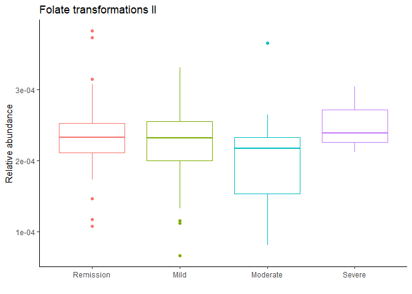<!-- -->

``` r
#Are there more with p-val <0.05 than expected by chance?
#Interaction:
sig <- res_inter %>% filter(pvalue<0.05)
dim(sig)[1]
```

    ## [1] 7

``` r
binom.test(dim(sig)[1], dim(res_inter)[1], p=0.05)$p.value
```

    ## [1] 0.03744458

``` r
#Yes!

#Disease score:
sig <- res_disease %>% filter(pvalue<0.05)
dim(sig)[1]
```

    ## [1] 2

``` r
binom.test(dim(sig)[1], dim(res_disease)[1], p=0.05)$p.value
```

    ## [1] 0.7713153

``` r
#No!

#Top 5 from interaction:
res_inter <- res_inter %>% arrange(pvalue)
row.names(res_inter) <- NULL 
res_inter[1:5, ]
```

    ##   Estimate Std.Error pvalue padj
    ## 1    0.129     0.046 0.0061 0.19
    ## 2    0.100     0.036 0.0064 0.19
    ## 3    0.354     0.140 0.0120 0.19
    ## 4    0.085     0.034 0.0140 0.19
    ## 5    0.263     0.106 0.0150 0.19
    ##                                                                              bugs
    ## 1                       PWY.6122..5.aminoimidazole.ribonucleotide.biosynthesis.II
    ## 2 PWY.6386..UDP.N.acetylmuramoyl.pentapeptide.biosynthesis.II..lysine.containing.
    ## 3                       PWY.1269..CMP.3.deoxy.D.manno.octulosonate.biosynthesis.I
    ## 4                        PWY.7221..guanosine.ribonucleotides.de.novo.biosynthesis
    ## 5                                 PWY.7234..inosine.5..phosphate.biosynthesis.III
    ##   p_adj
    ## 1 0.189
    ## 2 0.189
    ## 3 0.189
    ## 4 0.189
    ## 5 0.189

``` r
test <- res_inter$bugs[1:5]
test
```

    ## [1] "PWY.6122..5.aminoimidazole.ribonucleotide.biosynthesis.II"                      
    ## [2] "PWY.6386..UDP.N.acetylmuramoyl.pentapeptide.biosynthesis.II..lysine.containing."
    ## [3] "PWY.1269..CMP.3.deoxy.D.manno.octulosonate.biosynthesis.I"                      
    ## [4] "PWY.7221..guanosine.ribonucleotides.de.novo.biosynthesis"                       
    ## [5] "PWY.7234..inosine.5..phosphate.biosynthesis.III"

``` r
#Are they in a group? If yes, which one?
for (c in 1: length(table(groups))){
    cluster1 <- pathway1[,groups == c] 
    for (i in 1:length(test)){
      if(test[i] %in% names(cluster1)){
            print(names(cluster1))
          }}
        }
```

    ## [1] "PEPTIDOGLYCANSYN.PWY..peptidoglycan.biosynthesis.I..meso.diaminopimelate.containing."        
    ## [2] "PWY.5686..UMP.biosynthesis"                                                                  
    ## [3] "PWY.6385..peptidoglycan.biosynthesis.III..mycobacteria."                                     
    ## [4] "PWY.6386..UDP.N.acetylmuramoyl.pentapeptide.biosynthesis.II..lysine.containing."             
    ## [5] "PWY.6387..UDP.N.acetylmuramoyl.pentapeptide.biosynthesis.I..meso.diaminopimelate.containing."
    ## [1] "PWY.2942..L.lysine.biosynthesis.III"                     
    ## [2] "PWY.5097..L.lysine.biosynthesis.VI"                      
    ## [3] "PWY.7221..guanosine.ribonucleotides.de.novo.biosynthesis"
    ## [1] "PWY.6122..5.aminoimidazole.ribonucleotide.biosynthesis.II"             
    ## [2] "PWY.6277..superpathway.of.5.aminoimidazole.ribonucleotide.biosynthesis"

# Test the association between paraclinical disease score and pathways

Analysis of pathways and faecal calprotectin:

``` r
#Model the pathway counts
pathway_meta_sub <- pathway_meta %>% filter(!is.na(f_cal_current))
pheno <- pathway_meta_sub[,reps]

#Is variance higher than the mean? 
mean(apply(pheno, 2, FUN=mean))
```

    ## [1] 128415.2

``` r
mean(apply(pheno, 2, FUN=stats::var))
```

    ## [1] 733949541973

``` r
#The variance is higher than the mean! Use NB

#Is there zero-inflation?
mean(apply(pheno, 2, function(x) sum(x==0)/dim(pheno)[1]))
```

    ## [1] 0.01269841

``` r
sd(apply(pheno, 2, function(x) sum(x==0)/dim(pheno)[1]))
```

    ## [1] 0.06349827

``` r
#On average, 0.6% of samples have zeros. No zero-inflation!

N <- pathway_meta_sub$rdepth
person_ID <- as.factor(pathway_meta_sub$person_ID)
sex <-  as.factor(pathway_meta_sub$sex)
age_gr <-  as.factor(pathway_meta_sub$age_gr)
study_gr <-  as.factor(pathway_meta_sub$study_gr)
asa <-  as.factor(pathway_meta_sub$asa)
bio <-  as.factor(pathway_meta_sub$bio)
pred <-  as.factor(pathway_meta_sub$pred_total)
fcal <- log(pathway_meta_sub$fcal+1)
time_point <- pathway_meta_sub$time_point

clinical = cbind.data.frame(person_ID, sex, age_gr, study_gr,asa, bio, pred, fcal, N, time_point)

#Test using NB:
f_inter <- mms(y=pheno, fixed= ~study_gr+sex+asa+bio+pred+ age_gr*fcal + offset(log(N)), data=clinical, random = ~1|person_ID, method="nb", correlation=corAR1(form=~time_point|person_ID))
```

    ## Analyzing 63 responses: 
    ## 1 2 3 4 5 6 7 8 9 10 11 12 13 14 15 16 17 18 19 20 21 22 23 24 25 26 27 28 29 30 31 32 33 34 35 36 37 38 39 40 41 42 43 44 45 46 47 48 49 50 51 52 53 54 55 56 57 58 59 60 61 62 63 
    ##  Computational time: 0.357 minutes

``` r
#Find taxa with significant (p<0.05) interaction. 
res_inter=as.data.frame(get.fixed(f_inter, part="dist", vr.name="age_gr2:fcal"))
res_inter$bugs <- rownames(res_inter)
res_inter$p_adj <- p.adjust(res_inter$pvalue, method="BH")
write.table(res_inter, file = paste0(path, "Results/", "Fcal_Pathway_interaction.txt"), col.names=T, row.names=F)
res_inter_sig <- res_inter %>% filter(p_adj < 0.05)

#Divide dataset into with and witout interaction:
pheno_1 <- pheno[, setdiff(colnames(pheno), rownames(res_inter_sig))]

#Analyse again with and without interaction
f_nointer<- mms(y=pheno_1, fixed= ~study_gr+sex+asa+bio+pred+age_gr+fcal+offset(log(N)), data=clinical, random = ~1|person_ID, method="nb", correlation=corAR1(form=~time_point|person_ID))
```

    ## Analyzing 63 responses: 
    ## 1 2 3 4 5 6 7 8 9 10 11 12 13 14 15 16 17 18 19 20 21 22 23 24 25 26 27 28 29 30 31 32 33 34 35 36 37 38 39 40 41 42 43 44 45 46 47 48 49 50 51 52 53 54 55 56 57 58 59 60 61 62 63 
    ##  Computational time: 0.336 minutes

``` r
#Results: Interaction, disease score:
res=as.data.frame(get.fixed(f_inter, part="dist", vr.name="fcal"))
res$p_adj <- p.adjust(res$pvalue, method="BH")
res$bugs <- rownames(res)
write.table(res, file = paste0(path, "Results/", "Fcal_Pathway_interaction_disease.txt"), col.names=T, row.names=F)
res_inter_disease <- res

#Result: Disease score without interaction:
res=as.data.frame(get.fixed(f_nointer, part="dist", vr.name="fcal"))
res$p_adj <- p.adjust(res$pvalue, method="BH")
res$bugs <- rownames(res)
write.table(res, file = paste0(path, "Results/", "Fcal_Pathway_disease.txt"), col.names=T, row.names=F)
res_disease <- res


##Investigate results!
#Make histograms of p-values from the interaction analysis:
ggplot(res_inter)+
  geom_histogram(aes(x=pvalue), bins=30, breaks = seq(0, 1, by=1/30), color="black", fill = "lightblue")+
  theme_classic()+ xlab("p-value")+ylab("Count")+ggtitle("Interaction term")
```

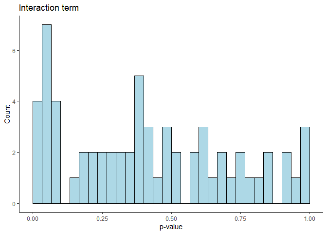<!-- -->

``` r
#Extract the significant in interaction term together with the disease score estimate
sig <- res_inter %>% filter(p_adj<0.05)
sig #None!
```

    ## [1] Estimate  Std.Error pvalue    padj      bugs      p_adj    
    ## <0 rows> (or 0-length row.names)

``` r
#Investigate results without interaction term: Disease score:
ggplot(res_disease)+
  geom_histogram(aes(x=pvalue), bins=30, breaks = seq(0, 1, by=1/30), color="black", fill = "lightblue")+
  theme_classic()+ xlab("p-value")+ylab("Count")+ggtitle("Disease score")
```

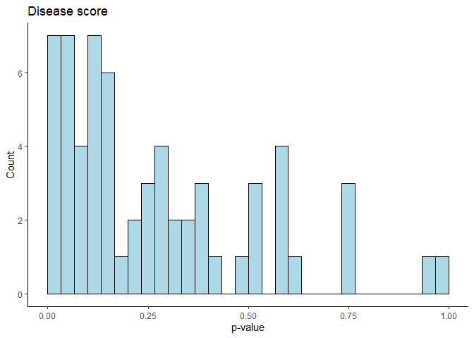<!-- -->

``` r
sig <- res_disease %>% filter(p_adj<0.05)
sig #None
```

    ## [1] Estimate  Std.Error pvalue    padj      p_adj     bugs     
    ## <0 rows> (or 0-length row.names)

``` r
#Are there more with p-val <0.05 than expected by chance?
sig <- res_inter %>% filter(pvalue<0.05)
dim(sig)[1]
```

    ## [1] 5

``` r
binom.test(dim(sig)[1], dim(res_inter)[1], p=0.05)$p.value
```

    ## [1] 0.246115

``` r
#No..

sig <- res_disease %>% filter(pvalue<0.05)
dim(sig)[1]
```

    ## [1] 11

``` r
binom.test(dim(sig)[1], dim(res_disease)[1], p=0.05)$p.value
```

    ## [1] 0.0002684783

``` r
#There are more with p-val <0.05 than expected!!


#Top 5 disease:
res_disease <- res_disease %>% arrange(pvalue)
row.names(res_disease) <- NULL 
res_disease[1:5, ]
```

    ##   Estimate Std.Error pvalue padj p_adj
    ## 1   -0.188     0.069 0.0072 0.19 0.189
    ## 2    0.295     0.114 0.0100 0.19 0.189
    ## 3   -0.246     0.095 0.0100 0.19 0.189
    ## 4   -0.136     0.053 0.0120 0.19 0.189
    ## 5   -0.398     0.167 0.0190 0.23 0.231
    ##                                                     bugs
    ## 1                         PWY.6737..starch.degradation.V
    ## 2                     PWY.2941..L.lysine.biosynthesis.II
    ## 3                  TRPSYN.PWY..L.tryptophan.biosynthesis
    ## 4                PWY.1042..glycolysis.IV..plant.cytosol.
    ## 5 PWY.7237..myo...chiro..and.scillo.inositol.degradation

``` r
test <- res_disease$bugs[1:5]
test
```

    ## [1] "PWY.6737..starch.degradation.V"                        
    ## [2] "PWY.2941..L.lysine.biosynthesis.II"                    
    ## [3] "TRPSYN.PWY..L.tryptophan.biosynthesis"                 
    ## [4] "PWY.1042..glycolysis.IV..plant.cytosol."               
    ## [5] "PWY.7237..myo...chiro..and.scillo.inositol.degradation"

``` r
#Are they in a group? If yes, which one?
for (c in 1: length(table(groups))){
    cluster1 <- pathway1[,groups == c] 
    for (i in 1:length(test)){
      if(test[i] %in% names(cluster1)){
            print(names(cluster1))
          }
    }   }
```

# Cluster ECs based on correlation

Test the EC groups. Here, I only have relative abundance data.
Therefore, it will be modelled using gaussian and not negative binomial
distributions.

The number of ECs to be tested are very large. Cluster those that are
very correlated to test fewer\!

``` r
EC_1 <- EC[,-c(1)]
# Ward Hierarchical Clustering
dissimilarity = 1-abs(cor(EC_1, method='spearman')) # generate distance between columns so use trans
d <- as.dist(dissimilarity) 

fit <- hclust(d, method="ward.D")
par(mfrow=c(1,1))
plot(fit, labels = F)

# cut tree into groups by hight
groups <- cutree(fit, h=0.25) # cut tree based on hight
table(groups) #107 different groups 
```

    ## groups
    ##   1   2   3   4   5   6   7   8   9  10  11  12  13  14  15  16  17  18  19  20 
    ##   2   1   1   1   1   2   2   2   1   1   2   3   2   1   3   1   1   2   3   1 
    ##  21  22  23  24  25  26  27  28  29  30  31  32  33  34  35  36  37  38  39  40 
    ##   1   1   1   2   6   1   1   1   2   1   2   1   1   1   1   1   1   1   2   4 
    ##  41  42  43  44  45  46  47  48  49  50  51  52  53  54  55  56  57  58  59  60 
    ##   1   1   1   2   2   1   2   2   2   2   1   1   3   4   3   2   1   1   1   1 
    ##  61  62  63  64  65  66  67  68  69  70  71  72  73  74  75  76  77  78  79  80 
    ##   2   1   1   1   1   1   1   3   1   1   3   1   1   1   2   1   1   1   1   1 
    ##  81  82  83  84  85  86  87  88  89  90  91  92  93  94  95  96  97  98  99 100 
    ##   1   1   1   1   1   1   1   1   1   1   1   1   1   1   1   1   1   1   1   1 
    ## 101 102 103 104 105 106 107 
    ##   1   1   1   1   1   1   1

``` r
rect.hclust(fit, h=0.25, border="red") # draw dendogram with red borders around the clusters
```

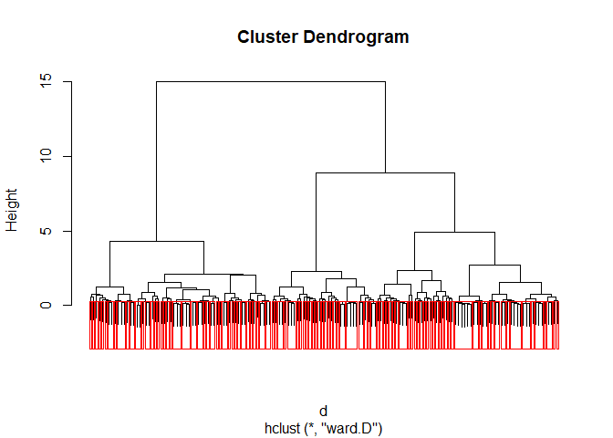<!-- -->

``` r
#Plot correlations
non.singles = as.numeric(names(table(groups)[table(groups) != 1]))
for (c in non.singles){
    cluster1 <- EC_1[,groups == c]
    plot(cluster1, main=c)
}
```

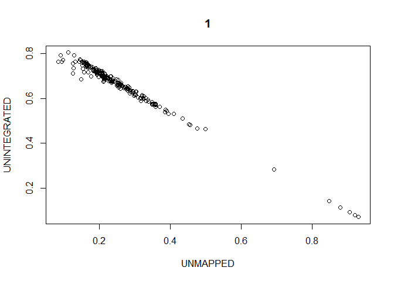<!-- -->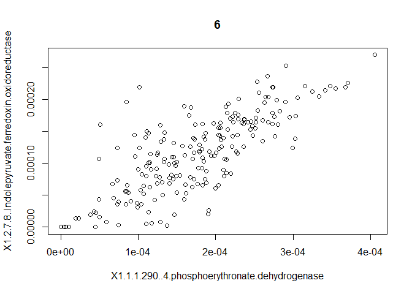<!-- -->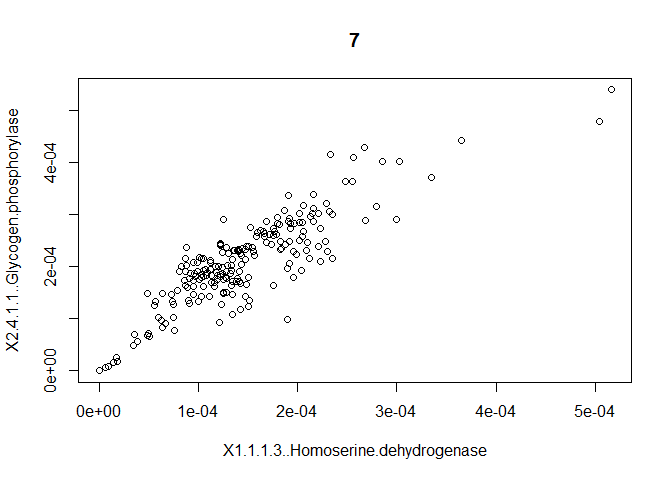<!-- -->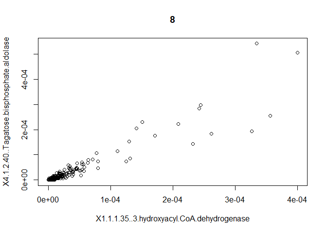<!-- -->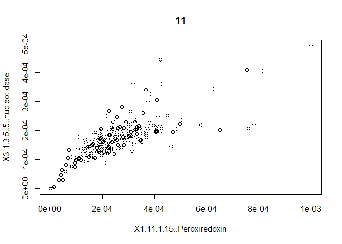<!-- -->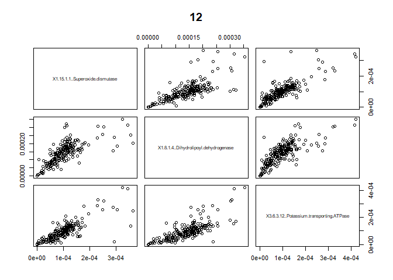<!-- -->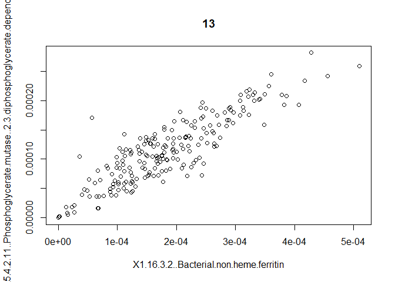<!-- -->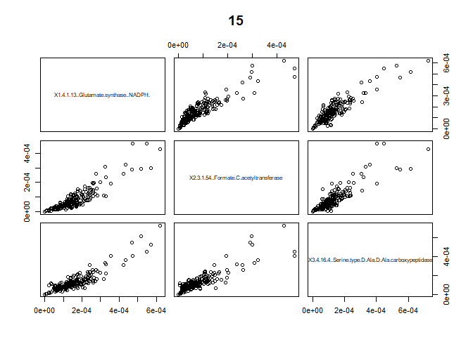<!-- -->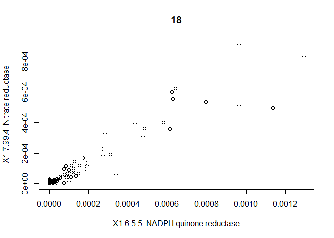<!-- -->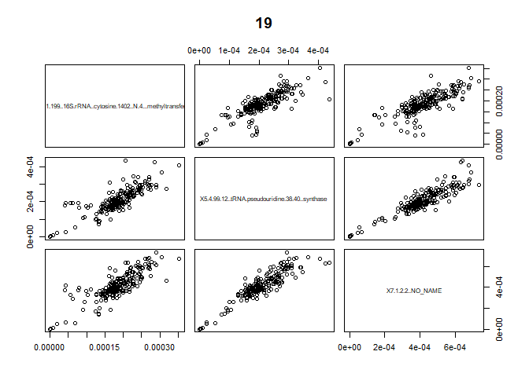<!-- -->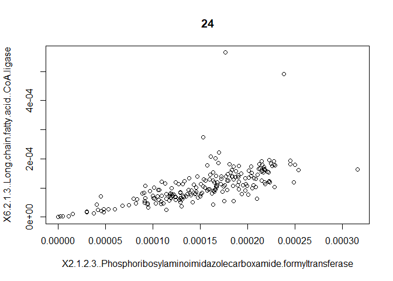<!-- -->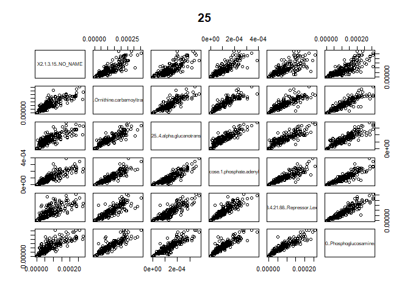<!-- -->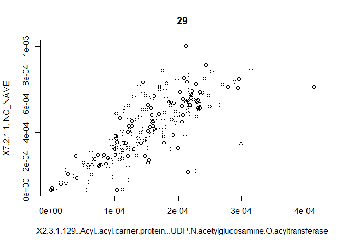<!-- --><!-- --><!-- --><!-- --><!-- --><!-- --><!-- --><!-- --><!-- --><!-- --><!-- --><!-- --><!-- --><!-- --><!-- --><!-- --><!-- --><!-- -->

``` r
# select cluster representative
reps = vector()
singles = as.numeric(names(table(groups)[table(groups) == 1]))
for (n in singles){
    reps[n] = names(groups[groups == n])
}
        
for (c in non.singles){
  cluster1 <- EC_1[,groups == c] 
  col_mean <- apply(cluster1, 2, mean)
  reps[c] <-  names(sort(col_mean, decreasing=T))[1]
}

#These are the pathways in the different clusters:
for (c in 1: length(table(groups))){
          cluster1 <- EC_1[,groups == c] 
          print(c)
          print(names(cluster1))
        }
```

    ## [1] 1
    ## [1] "UNMAPPED"     "UNINTEGRATED"
    ## [1] 2
    ## NULL
    ## [1] 3
    ## NULL
    ## [1] 4
    ## NULL
    ## [1] 5
    ## NULL
    ## [1] 6
    ## [1] "X1.1.1.290..4.phosphoerythronate.dehydrogenase"    
    ## [2] "X1.2.7.8..Indolepyruvate.ferredoxin.oxidoreductase"
    ## [1] 7
    ## [1] "X1.1.1.3..Homoserine.dehydrogenase" "X2.4.1.1..Glycogen.phosphorylase"  
    ## [1] 8
    ## [1] "X1.1.1.35..3.hydroxyacyl.CoA.dehydrogenase"
    ## [2] "X4.1.2.40..Tagatose.bisphosphate.aldolase" 
    ## [1] 9
    ## NULL
    ## [1] 10
    ## NULL
    ## [1] 11
    ## [1] "X1.11.1.15..Peroxiredoxin" "X3.1.3.5..5..nucleotidase"
    ## [1] 12
    ## [1] "X1.15.1.1..Superoxide.dismutase"         
    ## [2] "X1.8.1.4..Dihydrolipoyl.dehydrogenase"   
    ## [3] "X3.6.3.12..Potassium.transporting.ATPase"
    ## [1] 13
    ## [1] "X1.16.3.2..Bacterial.non.heme.ferritin"                               
    ## [2] "X5.4.2.11..Phosphoglycerate.mutase..2.3.diphosphoglycerate.dependent."
    ## [1] 14
    ## NULL
    ## [1] 15
    ## [1] "X1.4.1.13..Glutamate.synthase..NADPH."              
    ## [2] "X2.3.1.54..Formate.C.acetyltransferase"             
    ## [3] "X3.4.16.4..Serine.type.D.Ala.D.Ala.carboxypeptidase"
    ## [1] 16
    ## NULL
    ## [1] 17
    ## NULL
    ## [1] 18
    ## [1] "X1.6.5.5..NADPH.quinone.reductase" "X1.7.99.4..Nitrate.reductase"     
    ## [1] 19
    ## [1] "X2.1.1.199..16S.rRNA..cytosine.1402..N.4...methyltransferase"
    ## [2] "X5.4.99.12..tRNA.pseudouridine.38.40..synthase"              
    ## [3] "X7.1.2.2..NO_NAME"                                           
    ## [1] 20
    ## NULL
    ## [1] 21
    ## NULL
    ## [1] 22
    ## NULL
    ## [1] 23
    ## NULL
    ## [1] 24
    ## [1] "X2.1.2.3..Phosphoribosylaminoimidazolecarboxamide.formyltransferase"
    ## [2] "X6.2.1.3..Long.chain.fatty.acid..CoA.ligase"                        
    ## [1] 25
    ## [1] "X2.1.3.15..NO_NAME"                                
    ## [2] "X2.1.3.3..Ornithine.carbamoyltransferase"          
    ## [3] "X2.4.1.25..4.alpha.glucanotransferase"             
    ## [4] "X2.7.7.27..Glucose.1.phosphate.adenylyltransferase"
    ## [5] "X3.4.21.88..Repressor.LexA"                        
    ## [6] "X5.4.2.10..Phosphoglucosamine.mutase"              
    ## [1] 26
    ## NULL
    ## [1] 27
    ## NULL
    ## [1] 28
    ## NULL
    ## [1] 29
    ## [1] "X2.3.1.129..Acyl..acyl.carrier.protein...UDP.N.acetylglucosamine.O.acyltransferase"
    ## [2] "X7.2.1.1..NO_NAME"                                                                 
    ## [1] 30
    ## NULL
    ## [1] 31
    ## [1] "X2.3.1.41..Beta.ketoacyl..acyl.carrier.protein..synthase.I"
    ## [2] "X3.1.11.5..Exodeoxyribonuclease.V"                         
    ## [1] 32
    ## NULL
    ## [1] 33
    ## NULL
    ## [1] 34
    ## NULL
    ## [1] 35
    ## NULL
    ## [1] 36
    ## NULL
    ## [1] 37
    ## NULL
    ## [1] 38
    ## NULL
    ## [1] 39
    ## [1] "X2.5.1.54..3.deoxy.7.phosphoheptulonate.synthase"         
    ## [2] "X2.7.3.9..Phosphoenolpyruvate..protein.phosphotransferase"
    ## [1] 40
    ## [1] "X2.5.1.7..UDP.N.acetylglucosamine.1.carboxyvinyltransferase"
    ## [2] "X3.5.1.88..Peptide.deformylase"                             
    ## [3] "X5.99.1.3..DNA.topoisomerase..ATP.hydrolyzing."             
    ## [4] "X6.1.1.20..Phenylalanine..tRNA.ligase"                      
    ## [1] 41
    ## NULL
    ## [1] 42
    ## NULL
    ## [1] 43
    ## NULL
    ## [1] 44
    ## [1] "X2.7.1.69..Protein.N.pi..phosphohistidine..sugar.phosphotransferase"
    ## [2] "X4.3.1.17..L.serine.ammonia.lyase"                                  
    ## [1] 45
    ## [1] "X2.7.1.71..Shikimate.kinase"    "X2.8.1.7..Cysteine.desulfurase"
    ## [1] 46
    ## NULL
    ## [1] 47
    ## [1] "X2.7.13.3..Histidine.kinase"               
    ## [2] "X3.2.1.177..Alpha.D.xyloside.xylohydrolase"
    ## [1] 48
    ## [1] "X2.7.2.4..Aspartate.kinase"                           
    ## [2] "X4.2.99.18..DNA..apurinic.or.apyrimidinic.site..lyase"
    ## [1] 49
    ## [1] "X2.7.7.24..Glucose.1.phosphate.thymidylyltransferase"
    ## [2] "X5.1.3.13..dTDP.4.dehydrorhamnose.3.5.epimerase"     
    ## [1] 50
    ## [1] "X2.7.7.4..Sulfate.adenylyltransferase"
    ## [2] "X6.4.1.2..Acetyl.CoA.carboxylase"     
    ## [1] 51
    ## NULL
    ## [1] 52
    ## NULL
    ## [1] 53
    ## [1] "X2.7.7.6..DNA.directed.RNA.polymerase"
    ## [2] "X3.4.21.53..Endopeptidase.La"         
    ## [3] "X6.1.1.14..Glycine..tRNA.ligase"      
    ## [1] 54
    ## [1] "X2.7.7.65..Diguanylate.cyclase"                        
    ## [2] "X3.1.4.52..Cyclic.guanylate.specific.phosphodiesterase"
    ## [3] "X3.2.1.86..6.phospho.beta.glucosidase"                 
    ## [4] "X3.6.3.17..Monosaccharide.transporting.ATPase"         
    ## [1] 55
    ## [1] "X2.7.7.7..DNA.directed.DNA.polymerase"              
    ## [2] "X3.1.22.4..Crossover.junction.endodeoxyribonuclease"
    ## [3] "X5.1.1.1..Alanine.racemase"                         
    ## [1] 56
    ## [1] "X2.8.1.13..tRNA.uridine.2.sulfurtransferase"
    ## [2] "X6.2.1.30..Phenylacetate..CoA.ligase"       
    ## [1] 57
    ## NULL
    ## [1] 58
    ## NULL
    ## [1] 59
    ## NULL
    ## [1] 60
    ## NULL
    ## [1] 61
    ## [1] "X3.1.26.5..Ribonuclease.P"         "X3.6.1.66..XTP.dITP.diphosphatase"
    ## [1] 62
    ## NULL
    ## [1] 63
    ## NULL
    ## [1] 64
    ## NULL
    ## [1] 65
    ## NULL
    ## [1] 66
    ## NULL
    ## [1] 67
    ## NULL
    ## [1] 68
    ## [1] "X3.2.1.22..Alpha.galactosidase"                         
    ## [2] "X3.2.1.23..Beta.galactosidase"                          
    ## [3] "X3.2.1.55..Non.reducing.end.alpha.L.arabinofuranosidase"
    ## [1] 69
    ## NULL
    ## [1] 70
    ## NULL
    ## [1] 71
    ## [1] "X3.2.1.52..Beta.N.acetylhexosaminidase"       
    ## [2] "X3.4.14.12..Xaa.Xaa.Pro.tripeptidyl.peptidase"
    ## [3] "X5.1.3.3..Aldose.1.epimerase"                 
    ## [1] 72
    ## NULL
    ## [1] 73
    ## NULL
    ## [1] 74
    ## NULL
    ## [1] 75
    ## [1] "X3.4.21.107..Peptidase.Do" "X3.6.4.13..RNA.helicase"  
    ## [1] 76
    ## NULL
    ## [1] 77
    ## NULL
    ## [1] 78
    ## NULL
    ## [1] 79
    ## NULL
    ## [1] 80
    ## NULL
    ## [1] 81
    ## NULL
    ## [1] 82
    ## NULL
    ## [1] 83
    ## NULL
    ## [1] 84
    ## NULL
    ## [1] 85
    ## NULL
    ## [1] 86
    ## NULL
    ## [1] 87
    ## NULL
    ## [1] 88
    ## NULL
    ## [1] 89
    ## NULL
    ## [1] 90
    ## NULL
    ## [1] 91
    ## NULL
    ## [1] 92
    ## NULL
    ## [1] 93
    ## NULL
    ## [1] 94
    ## NULL
    ## [1] 95
    ## NULL
    ## [1] 96
    ## NULL
    ## [1] 97
    ## NULL
    ## [1] 98
    ## NULL
    ## [1] 99
    ## NULL
    ## [1] 100
    ## NULL
    ## [1] 101
    ## NULL
    ## [1] 102
    ## NULL
    ## [1] 103
    ## NULL
    ## [1] 104
    ## NULL
    ## [1] 105
    ## NULL
    ## [1] 106
    ## NULL
    ## [1] 107
    ## NULL

``` r
#NULL means that there is only one pathway in the cluster
```

# Test the association between clinical disease score and ECs

Analysis of EC and clinical disease score:

``` r
#Model the pathway counts - only the representatives
EC_meta_sub <- EC_meta %>% filter(!is.na(score))
pheno <- EC_meta_sub[,reps] #Only the representatives

#Is it gaussian?
for (i in colnames(pheno)[1:5]){
  p <- ggplot(pheno)+
    geom_histogram(aes_string(x=i), bins=30)+ggtitle(i)
  print(p)
}
```

<!-- --><!-- --><!-- --><!-- --><!-- -->

``` r
for (i in colnames(pheno)[1:5]){
  test <- asin(sqrt(pheno[, i]))
  p <- ggplot()+
    geom_histogram(aes_string(x=test), bins=30)+ggtitle(i)
  print(p)
}
```

<!-- --><!-- --><!-- --><!-- --><!-- -->

``` r
#The arcsine square root transformation might overall be a better fit

#Is there zero-inflation?
mean(apply(pheno, 2, function(x) sum(x==0)/dim(pheno)[1]))
```

    ## [1] 0.002704113

``` r
sd(apply(pheno, 2, function(x) sum(x==0)/dim(pheno)[1])) 
```

    ## [1] 0.02116414

``` r
#On average, 0.3% of samples have zeros. No zero-inflation!

person_ID <- as.factor(EC_meta_sub$person_ID)
sex <-  as.factor(EC_meta_sub$sex)
age_gr <-  as.factor(EC_meta_sub$age_gr)
study_gr <-  as.factor(EC_meta_sub$study_gr)
asa <-  as.factor(EC_meta_sub$asa)
bio <-  as.factor(EC_meta_sub$bio)
pred <-  as.factor(EC_meta_sub$pred_total)
score_num <- as.numeric(EC_meta_sub$score_num)
time_point <- as.numeric(EC_meta_sub$time_point)

clinical = cbind.data.frame(person_ID, sex, age_gr, study_gr,asa, bio, pred, score_num, time_point)

#Test using linear mixed models:
#Random intercept -> gaussian:
f1_score <- data.frame()
f1_inter <- data.frame()
for (i in 1:length(pheno)){
  variable <- asin(sqrt(pheno[,i]))
  clinical$variable <- variable
  variable_name <- colnames(pheno)[i]
  lme_cer <- lme(variable ~ study_gr+sex+asa+bio+pred+age_gr*score_num, random=~1|person_ID, data=clinical, correlation = corAR1(form=~time_point|person_ID))

  coef <- summary(lme_cer)$tTable
  #Extract disease score information
  df_score <- t(as.data.frame(coef["score_num",]))
  row.names(df_score) <- as.character(variable_name)
  f1_score <- rbind(f1_score, df_score)
  #Extract information on interaction term
  df_inter <- t(as.data.frame(coef["age_gr2:score_num",]))
  row.names(df_inter) <- as.character(variable_name)
  f1_inter <- rbind(f1_inter, df_inter)
}

#Adjusted p-value:
f1_score$padj <- p.adjust(f1_score$`p-value`, method="BH")
f1_inter$padj <- p.adjust(f1_inter$`p-value`, method="BH")

#Save results:
write.table(f1_score, file = paste0(path, "Results/", "EC_interaction_disease.txt"), col.names=T)
write.table(f1_inter, file = paste0(path, "Results/", "EC_interaction.txt"), col.names=T)

#Which EC had significant interaction?
inter_sig <- f1_inter %>%filter(padj<0.05)
inter_sig
```

    ## [1] Value     Std.Error DF        t-value   p-value   padj     
    ## <0 rows> (or 0-length row.names)

``` r
#None!

#What is the distribution of p-values
ggplot(f1_inter)+
  geom_histogram(aes(x=`p-value`), bins=30, breaks = seq(0, 1, by=1/30), color="black", fill = "lightblue")+
  theme_classic()+ xlab("p-value")+ylab("Count")+ggtitle("Interaction term")
```

<!-- -->

``` r
#Are there more with p<0.05 than expected?:
sig <- f1_inter %>%filter(`p-value`<0.05)
binom.test(dim(sig)[1], dim(f1_inter)[1], p=0.05)$p.value
```

    ## [1] 0.01146634

``` r
#Yes!

#Top 5 with lowest p-value:
sig <- sig %>% arrange(`p-value`)
sig[1:5, ]
```

    ##                                                                       Value
    ## X2.4.2.14..Amidophosphoribosyltransferase                      0.0009969984
    ## X3.1.11.6..Exodeoxyribonuclease.VII                            0.0010667877
    ## X6.3.5.5..Carbamoyl.phosphate.synthase..glutamine.hydrolyzing. 0.0008533778
    ## X3.1.26.4..Ribonuclease.H                                      0.0010946506
    ## X2.5.1.15..Dihydropteroate.synthase                            0.0013518430
    ##                                                                   Std.Error  DF
    ## X2.4.2.14..Amidophosphoribosyltransferase                      0.0003021006 140
    ## X3.1.11.6..Exodeoxyribonuclease.VII                            0.0003274553 140
    ## X6.3.5.5..Carbamoyl.phosphate.synthase..glutamine.hydrolyzing. 0.0002683920 140
    ## X3.1.26.4..Ribonuclease.H                                      0.0003731555 140
    ## X2.5.1.15..Dihydropteroate.synthase                            0.0004642645 140
    ##                                                                 t-value
    ## X2.4.2.14..Amidophosphoribosyltransferase                      3.300220
    ## X3.1.11.6..Exodeoxyribonuclease.VII                            3.257812
    ## X6.3.5.5..Carbamoyl.phosphate.synthase..glutamine.hydrolyzing. 3.179595
    ## X3.1.26.4..Ribonuclease.H                                      2.933497
    ## X2.5.1.15..Dihydropteroate.synthase                            2.911795
    ##                                                                    p-value
    ## X2.4.2.14..Amidophosphoribosyltransferase                      0.001225565
    ## X3.1.11.6..Exodeoxyribonuclease.VII                            0.001408956
    ## X6.3.5.5..Carbamoyl.phosphate.synthase..glutamine.hydrolyzing. 0.001815937
    ## X3.1.26.4..Ribonuclease.H                                      0.003917496
    ## X2.5.1.15..Dihydropteroate.synthase                            0.004183208
    ##                                                                      padj
    ## X2.4.2.14..Amidophosphoribosyltransferase                      0.06476841
    ## X3.1.11.6..Exodeoxyribonuclease.VII                            0.06476841
    ## X6.3.5.5..Carbamoyl.phosphate.synthase..glutamine.hydrolyzing. 0.06476841
    ## X3.1.26.4..Ribonuclease.H                                      0.08952065
    ## X2.5.1.15..Dihydropteroate.synthase                            0.08952065

``` r
test <- row.names(sig)[1:5]
test
```

    ## [1] "X2.4.2.14..Amidophosphoribosyltransferase"                     
    ## [2] "X3.1.11.6..Exodeoxyribonuclease.VII"                           
    ## [3] "X6.3.5.5..Carbamoyl.phosphate.synthase..glutamine.hydrolyzing."
    ## [4] "X3.1.26.4..Ribonuclease.H"                                     
    ## [5] "X2.5.1.15..Dihydropteroate.synthase"

``` r
#Are they in a group? If yes, which one?
for (c in 1: length(table(groups))){
    cluster1 <- EC_1[,groups == c] 
    for (i in 1:length(test)){
      if(test[i] %in% names(cluster1)){
            print(names(cluster1))
          }}
}

#Test without age interaction then:
f1_score_2 <- data.frame()
for (i in 1:length(pheno)){
  variable <- asin(sqrt(pheno[,i]))
  clinical$variable <- variable
  variable_name <- colnames(pheno)[i]
  lme_cer <- lme(variable ~ study_gr+sex+asa+bio+pred+age_gr+score_num, random=~1|person_ID, data=clinical, correlation = corAR1(form=~time_point|person_ID))

  coef <- summary(lme_cer)$tTable
  #Extract disease score information
  df_score <- t(as.data.frame(coef["score_num",]))
  row.names(df_score) <- as.character(variable_name)
  f1_score_2 <- rbind(f1_score_2, df_score)

}

#Adjusted p-value:
f1_score_2$padj <- p.adjust(f1_score_2$`p-value`, method="BH")

#Save results:
write.table(f1_score_2, file = paste0(path, "Results/", "EC_disease.txt"), col.names=T)

#Which EC had significant disease score?
disease_sig <- f1_score_2 %>%filter(padj<0.05)
disease_sig
```

    ## [1] Value     Std.Error DF        t-value   p-value   padj     
    ## <0 rows> (or 0-length row.names)

``` r
#None!

#What is the distribution of p-values
ggplot(f1_score_2)+
  geom_histogram(aes(x=`p-value`), bins=30, breaks = seq(0, 1, by=1/30), color="black", fill = "lightblue")+
  theme_classic()+ xlab("p-value")+ylab("Count")+ggtitle("Interaction term")
```

<!-- -->

``` r
#Are there more with p<0.05 than expected?:
sig <- f1_score_2 %>%filter(`p-value`<0.05)
binom.test(dim(sig)[1], dim(f1_score_2)[1], p=0.05)$p.value
```

    ## [1] 0.4999388

``` r
#No!
```

# Test the association between paraclinical disease score and ECs

Analysis of ECs and faecal calprotectin:

``` r
#Model the pathway counts - only the representatives
EC_meta_sub <- EC_meta %>% filter(!is.na(f_cal_current))
pheno <- EC_meta_sub[,reps] #Only the representatives

person_ID <- as.factor(EC_meta_sub$person_ID)
sex <-  as.factor(EC_meta_sub$sex)
age_gr <-  as.factor(EC_meta_sub$age_gr)
study_gr <-  as.factor(EC_meta_sub$study_gr)
asa <-  as.factor(EC_meta_sub$asa)
bio <-  as.factor(EC_meta_sub$bio)
pred <-  as.factor(EC_meta_sub$pred_total)
fcal <- as.numeric(EC_meta_sub$f_cal_current) #Not transformed! Because of LMM
time_point <- as.numeric(EC_meta_sub$time_point)

clinical = cbind.data.frame(person_ID, sex, age_gr, study_gr,asa, bio, pred, fcal, time_point)

#Test using linear mixed models:
#Random intercept -> gaussian:
f1_score <- data.frame()
f1_inter <- data.frame()
for (i in 1:length(pheno)){
  variable <- asin(sqrt(pheno[,i]))
  clinical$variable <- variable
  variable_name <- colnames(pheno)[i]
  lme_cer <- lme(variable ~ study_gr+sex+asa+bio+pred+age_gr*fcal, random=~1|person_ID, data=clinical, correlation = corAR1(form=~time_point|person_ID))

  coef <- summary(lme_cer)$tTable
  #Extract disease score information
  df_score <- t(as.data.frame(coef["fcal",]))
  row.names(df_score) <- as.character(variable_name)
  f1_score <- rbind(f1_score, df_score)
  #Extract infromation on interaction term
  df_inter <- t(as.data.frame(coef["age_gr2:fcal",]))
  row.names(df_inter) <- as.character(variable_name)
  f1_inter <- rbind(f1_inter, df_inter)
}

#Adjusted p-value:
f1_score$padj <- p.adjust(f1_score$`p-value`, method="BH")
f1_inter$padj <- p.adjust(f1_inter$`p-value`, method="BH")

#Save results:
write.table(f1_score, file = paste0(path, "Results/", "Paraclinical_EC_interaction_disease.txt"), col.names=T)
write.table(f1_inter, file = paste0(path, "Results/", "Paraclinical_EC_interaction.txt"), col.names=T)

#Which EC had significant interaction?
inter_sig <- f1_inter %>%filter(padj<0.05)
inter_sig
```

    ## [1] Value     Std.Error DF        t-value   p-value   padj     
    ## <0 rows> (or 0-length row.names)

``` r
#None!

#What is the distribution of p-values
ggplot(f1_inter)+
  geom_histogram(aes(x=`p-value`), bins=30, breaks = seq(0, 1, by=1/30), color="black", fill = "lightblue")+
  theme_classic()+ xlab("p-value")+ylab("Count")+ggtitle("Interaction term")
```

<!-- -->

``` r
#Are there more with p<0.05 than expected?:
sig <- f1_inter %>%filter(`p-value`<0.05)
binom.test(dim(sig)[1], dim(f1_inter)[1], p=0.05)$p.value
```

    ## [1] 1

``` r
#No!


#Test without age interaction then:
f1_score_2 <- data.frame()
for (i in 1:length(pheno)){
  variable <- asin(sqrt(pheno[,i]))
  clinical$variable <- variable
  variable_name <- colnames(pheno)[i]
  lme_cer <- lme(variable ~ study_gr+sex+asa+bio+pred+age_gr+fcal, random=~1|person_ID, data=clinical, correlation = corAR1(form=~time_point|person_ID))

  coef <- summary(lme_cer)$tTable
  #Extract disease score information
  df_score <- t(as.data.frame(coef["fcal",]))
  row.names(df_score) <- as.character(variable_name)
  f1_score_2 <- rbind(f1_score_2, df_score)

}

#Adjusted p-value:
f1_score_2$padj <- p.adjust(f1_score_2$`p-value`, method="BH")

#Save results:
write.table(f1_score_2, file = paste0(path, "Results/", "Paraclinical_EC_disease.txt"), col.names=T)


#Which EC had significant disease score?
disease_sig <- f1_score_2 %>%filter(padj<0.05)
disease_sig
```

    ## [1] Value     Std.Error DF        t-value   p-value   padj     
    ## <0 rows> (or 0-length row.names)

``` r
#None!

#What is the distribution of p-values
ggplot(f1_score_2)+
  geom_histogram(aes(x=`p-value`), bins=30, breaks = seq(0, 1, by=1/30), color="black", fill = "lightblue")+
  theme_classic()+ xlab("p-value")+ylab("Count")+ggtitle("Interaction term")
```

<!-- -->

``` r
#Are there more with p<0.05 than expected?:
sig <- f1_score_2 %>%filter(`p-value`<0.05)
binom.test(dim(sig)[1], dim(f1_score_2)[1], p=0.05)$p.value
```

    ## [1] 0.1153822

``` r
#No!
```

# Cluster KOs based on correlation

Test the KO groups. Here, I only have relative abundance data.
Therefore, it will be modelled using gaussian and not negative binomial
distributions.

The number of KOs to be tested are very large. Cluster those that are
very correlated to test fewer\!

``` r
KO_1 <- KO[,-c(1)]
# Ward Hierarchical Clustering
dissimilarity = 1-abs(cor(KO_1, method='spearman')) # generate distance between columns so use trans
d <- as.dist(dissimilarity) 

fit <- hclust(d, method="ward.D")
par(mfrow=c(1,1))
plot(fit, labels = F)

# cut tree into groups by hight
groups <- cutree(fit, h=0.25) # cut tree based on hight
table(groups) #118 different groups 
```

    ## groups
    ##   1   2   3   4   5   6   7   8   9  10  11  12  13  14  15  16  17  18  19  20 
    ##   2   4   5  16   1   2   9  12   6   8   2   5   4   7   3   5   8   3  11   1 
    ##  21  22  23  24  25  26  27  28  29  30  31  32  33  34  35  36  37  38  39  40 
    ##   4   3  10   3  10   2   5   3   1   7   8   1   7   3   6   6   4   2   6   9 
    ##  41  42  43  44  45  46  47  48  49  50  51  52  53  54  55  56  57  58  59  60 
    ##   5   2   3   6   2   3   5   1   2   3   8   1   3   7   3   1   5   3   6   7 
    ##  61  62  63  64  65  66  67  68  69  70  71  72  73  74  75  76  77  78  79  80 
    ##   6   1   1   3   1   1   1   2   1   6   7   1   1   2   2   2   1   1   1   2 
    ##  81  82  83  84  85  86  87  88  89  90  91  92  93  94  95  96  97  98  99 100 
    ##   2   1   1   1   2   2   1   1   1   3   2   1   3   4   1   1   1   1   2   2 
    ## 101 102 103 104 105 106 107 108 109 110 111 112 113 114 115 116 117 118 
    ##   1   1   2   1   1   2   1   1   1   1   1   1   1   2   1   1   1   1

``` r
rect.hclust(fit, h=0.25, border="red") # draw dendogram with red borders around the clusters
```

<!-- -->

``` r
#Plot correlations
non.singles = as.numeric(names(table(groups)[table(groups) != 1]))
for (c in non.singles){
    cluster1 <- KO_1[,groups == c]
    plot(cluster1, main=c)
}
```

<!-- --><!-- --><!-- --><!-- --><!-- --><!-- --><!-- --><!-- --><!-- --><!-- --><!-- --><!-- --><!-- --><!-- --><!-- --><!-- --><!-- --><!-- --><!-- --><!-- --><!-- --><!-- --><!-- --><!-- --><!-- --><!-- --><!-- --><!-- --><!-- --><!-- --><!-- --><!-- --><!-- --><!-- --><!-- --><!-- --><!-- --><!-- --><!-- --><!-- --><!-- --><!-- --><!-- --><!-- --><!-- --><!-- --><!-- --><!-- --><!-- --><!-- --><!-- --><!-- --><!-- --><!-- --><!-- --><!-- --><!-- --><!-- --><!-- --><!-- --><!-- --><!-- --><!-- --><!-- --><!-- --><!-- --><!-- --><!-- --><!-- --><!-- --><!-- --><!-- --><!-- --><!-- -->

``` r
# select cluster representative
reps = vector()
singles = as.numeric(names(table(groups)[table(groups) == 1]))
for (n in singles){
    reps[n] = names(groups[groups == n])
}
        
for (c in non.singles){
  cluster1 <- KO_1[,groups == c] 
  col_mean <- apply(cluster1, 2, mean)
  reps[c] <-  names(sort(col_mean, decreasing=T))[1]
}

#These are the pathways in the different clusters:
for (c in 1: length(table(groups))){
          cluster1 <- KO_1[,groups == c] 
          print(c)
          print(names(cluster1))
        }
```

    ## [1] 1
    ## [1] "UNMAPPED"     "UNINTEGRATED"
    ## [1] 2
    ## [1] "K00014..shikimate.dehydrogenase..EC.1.1.1.25."           
    ## [2] "K01433..formyltetrahydrofolate.deformylase..EC.3.5.1.10."
    ## [3] "K06871..NO_NAME"                                         
    ## [4] "K09816..zinc.transport.system.permease.protein"          
    ## [1] 3
    ## [1] "K00024..malate.dehydrogenase..EC.1.1.1.37."                                       
    ## [2] "K00350..Na..transporting.NADH.ubiquinone.oxidoreductase.subunit.E"                
    ## [3] "K00605..aminomethyltransferase..EC.2.1.2.10."                                     
    ## [4] "K06973..NO_NAME"                                                                  
    ## [5] "K15633..2.3.bisphosphoglycerate.independent.phosphoglycerate.mutase..EC.5.4.2.12."
    ## [1] 4
    ##  [1] "K00052..3.isopropylmalate.dehydrogenase..EC.1.1.1.85."                  
    ##  [2] "K00600..glycine.hydroxymethyltransferase..EC.2.1.2.1."                  
    ##  [3] "K01000..phospho.N.acetylmuramoyl.pentapeptide.transferase..EC.2.7.8.13."
    ##  [4] "K01409..O.sialoglycoprotein.endopeptidase"                              
    ##  [5] "K01868..threonyl.tRNA.synthetase..EC.6.1.1.3."                          
    ##  [6] "K01939..adenylosuccinate.synthase..EC.6.3.4.4."                         
    ##  [7] "K01951..GMP.synthase..glutamine.hydrolysing...EC.6.3.5.2."              
    ##  [8] "K02356..elongation.factor.EF.P"                                         
    ##  [9] "K02888..large.subunit.ribosomal.protein.L21"                            
    ## [10] "K02945..small.subunit.ribosomal.protein.S1"                             
    ## [11] "K02967..small.subunit.ribosomal.protein.S2"                             
    ## [12] "K02996..small.subunit.ribosomal.protein.S9"                             
    ## [13] "K03040..DNA.directed.RNA.polymerase.subunit.alpha..EC.2.7.7.6."         
    ## [14] "K03043..DNA.directed.RNA.polymerase.subunit.beta..EC.2.7.7.6."          
    ## [15] "K04078..chaperonin.GroES"                                               
    ## [16] "K09903..uridylate.kinase..EC.2.7.4.22."                                 
    ## [1] 5
    ## NULL
    ## [1] 6
    ## [1] "K00059..3.oxoacyl..acyl.carrier.protein..reductase..EC.1.1.1.100."
    ## [2] "K02834..ribosome.binding.factor.A"                                
    ## [1] 7
    ## [1] "K00099..1.deoxy.D.xylulose.5.phosphate.reductoisomerase..EC.1.1.1.267."
    ## [2] "K00651..homoserine.O.succinyltransferase..EC.2.3.1.46."                
    ## [3] "K00759..adenine.phosphoribosyltransferase..EC.2.4.2.7."                
    ## [4] "K00766..anthranilate.phosphoribosyltransferase..EC.2.4.2.18."          
    ## [5] "K01887..arginyl.tRNA.synthetase..EC.6.1.1.19."                         
    ## [6] "K01889..phenylalanyl.tRNA.synthetase.alpha.chain..EC.6.1.1.20."        
    ## [7] "K02313..chromosomal.replication.initiator.protein"                     
    ## [8] "K02519..translation.initiation.factor.IF.2"                            
    ## [9] "K02528..dimethyladenosine.transferase"                                 
    ## [1] 8
    ##  [1] "K00145..N.acetyl.gamma.glutamyl.phosphate.reductase..EC.1.2.1.38."                                                                              
    ##  [2] "K00331..NADH.quinone.oxidoreductase.subunit.B..EC.1.6.5.3."                                                                                     
    ##  [3] "K00606..3.methyl.2.oxobutanoate.hydroxymethyltransferase..EC.2.1.2.11."                                                                         
    ##  [4] "K00876..uridine.kinase..EC.2.7.1.48."                                                                                                           
    ##  [5] "K01647..citrate.synthase..EC.2.3.3.1."                                                                                                          
    ##  [6] "K01812..glucuronate.isomerase..EC.5.3.1.12."                                                                                                    
    ##  [7] "K03296..hydrophobic.amphiphilic.exporter.1..mainly.G..bacteria...HAE1.family"                                                                   
    ##  [8] "K07568..S.adenosylmethionine.tRNA.ribosyltransferase.isomerase"                                                                                 
    ##  [9] "K10206..LL.diaminopimelate.aminotransferase..EC.2.6.1.83."                                                                                      
    ## [10] "K11755..phosphoribosyl.ATP.pyrophosphohydrolase...phosphoribosyl.AMP.cyclohydrolase..EC.3.6.1.31.3.5.4.19."                                     
    ## [11] "K14652..3.4.dihydroxy.2.butanone.4.phosphate.synthase...GTP.cyclohydrolase.II..EC.4.1.99.12.3.5.4.25."                                          
    ## [12] "K16363..UDP.3.O..3.hydroxymyristoyl..N.acetylglucosamine.deacetylase...3.hydroxyacyl..acyl.carrier.protein..dehydratase..EC.3.5.1.108.4.2.1.59."
    ## [1] 9
    ## [1] "K00147..glutamate.5.semialdehyde.dehydrogenase..EC.1.2.1.41."                               
    ## [2] "K00384..thioredoxin.reductase..NADPH...EC.1.8.1.9."                                         
    ## [3] "K01462..NO_NAME"                                                                            
    ## [4] "K01924..UDP.N.acetylmuramate..alanine.ligase..EC.6.3.2.8."                                  
    ## [5] "K01928..UDP.N.acetylmuramoyl.L.alanyl.D.glutamate..2.6.diaminopimelate.ligase..EC.6.3.2.13."
    ## [6] "K02860..16S.rRNA.processing.protein.RimM"                                                   
    ## [1] 10
    ## [1] "K00262..glutamate.dehydrogenase..NADP....EC.1.4.1.4."      
    ## [2] "K00957..sulfate.adenylyltransferase.subunit.2..EC.2.7.7.4."
    ## [3] "K01805..xylose.isomerase..EC.5.3.1.5."                     
    ## [4] "K01893..asparaginyl.tRNA.synthetase..EC.6.1.1.22."         
    ## [5] "K02118..V.A.type.H..Na..transporting.ATPase.subunit.B"     
    ## [6] "K03615..electron.transport.complex.protein.RnfC"           
    ## [7] "K09014..Fe.S.cluster.assembly.protein.SufB"                
    ## [8] "K18682..ribonucrease.Y..EC.3.1....."                       
    ## [1] 11
    ## [1] "K00266..glutamate.synthase..NADPH.NADH..small.chain..EC.1.4.1.13.1.4.1.14."
    ## [2] "K06919..NO_NAME"                                                           
    ## [1] 12
    ## [1] "K00297..methylenetetrahydrofolate.reductase..NADPH...EC.1.5.1.20."         
    ## [2] "K00615..transketolase..EC.2.2.1.1."                                        
    ## [3] "K01520..dUTP.pyrophosphatase..EC.3.6.1.23."                                
    ## [4] "K04068..anaerobic.ribonucleoside.triphosphate.reductase.activating.protein"
    ## [5] "K04069..pyruvate.formate.lyase.activating.enzyme"                          
    ## [1] 13
    ## [1] "K00330..NADH.quinone.oxidoreductase.subunit.A..EC.1.6.5.3." 
    ## [2] "K00912..tetraacyldisaccharide.4..kinase..EC.2.7.1.130."     
    ## [3] "K01546..K..transporting.ATPase.ATPase.A.chain..EC.3.6.3.12."
    ## [4] "K03644..lipoyl.synthase..EC.2.8.1.8."                       
    ## [1] 14
    ## [1] "K00337..NADH.quinone.oxidoreductase.subunit.H..EC.1.6.5.3."           
    ## [2] "K01425..glutaminase..EC.3.5.1.2."                                     
    ## [3] "K01686..mannonate.dehydratase..EC.4.2.1.8."                           
    ## [4] "K01818..L.fucose.D.arabinose.isomerase..EC.5.3.1.25.5.3.1.3."         
    ## [5] "K03474..pyridoxine.5.phosphate.synthase..EC.2.6.99.2."                
    ## [6] "K09810..lipoprotein.releasing.system.ATP.binding.protein..EC.3.6.3..."
    ## [7] "K09888..hypothetical.protein"                                         
    ## [1] 15
    ## [1] "K00339..NADH.quinone.oxidoreductase.subunit.J..EC.1.6.5.3."
    ## [2] "K01813..L.rhamnose.isomerase..EC.5.3.1.14."                
    ## [3] "K09808..lipoprotein.releasing.system.permease.protein"     
    ## [1] 16
    ## [1] "K00346..Na..transporting.NADH.ubiquinone.oxidoreductase.subunit.A"
    ## [2] "K01284..peptidyl.dipeptidase.Dcp"                                 
    ## [3] "K01710..dTDP.glucose.4.6.dehydratase..EC.4.2.1.46."               
    ## [4] "K03561..biopolymer.transport.protein.ExbB"                        
    ## [5] "K03771..peptidyl.prolyl.cis.trans.isomerase.SurA"                 
    ## [1] 17
    ## [1] "K00525..ribonucleoside.diphosphate.reductase.alpha.chain..EC.1.17.4.1."        
    ## [2] "K00791..tRNA.dimethylallyltransferase..EC.2.5.1.75."                           
    ## [3] "K01892..histidyl.tRNA.synthetase..EC.6.1.1.21."                                
    ## [4] "K02548..1.4.dihydroxy.2.naphthoate.octaprenyltransferase..EC.2.5.1.74.2.5.1..."
    ## [5] "K03177..tRNA.pseudouridine.synthase.B"                                         
    ## [6] "K03550..holliday.junction.DNA.helicase.RuvA..EC.3.6.4.12."                     
    ## [7] "K03589..cell.division.protein.FtsQ"                                            
    ## [8] "K03701..excinuclease.ABC.subunit.A"                                            
    ## [1] 18
    ## [1] "K00554..tRNA..guanine.N1...methyltransferase"                                          
    ## [2] "K00820..glucosamine..fructose.6.phosphate.aminotransferase..isomerizing...EC.2.6.1.16."
    ## [3] "K10773..endonuclease.III..EC.4.2.99.18."                                               
    ## [1] 19
    ##  [1] "K00560..thymidylate.synthase..EC.2.1.1.45."                                 
    ##  [2] "K00790..UDP.N.acetylglucosamine.1.carboxyvinyltransferase..EC.2.5.1.7."     
    ##  [3] "K01495..GTP.cyclohydrolase.I..EC.3.5.4.16."                                 
    ##  [4] "K01696..tryptophan.synthase.beta.chain..EC.4.2.1.20."                       
    ##  [5] "K01714..4.hydroxy.tetrahydrodipicolinate.synthase..EC.4.3.3.7."             
    ##  [6] "K01914..aspartate..ammonia.ligase..EC.6.3.1.1."                             
    ##  [7] "K02564..glucosamine.6.phosphate.deaminase..EC.3.5.99.6."                    
    ##  [8] "K02897..large.subunit.ribosomal.protein.L25"                                
    ##  [9] "K03070..preprotein.translocase.subunit.SecA"                                
    ## [10] "K08289..phosphoribosylglycinamide.formyltransferase.2..EC.2.1.2.2."         
    ## [11] "K17828..dihydroorotate.dehydrogenase..NAD...catalytic.subunit..EC.1.3.1.14."
    ## [1] 20
    ## NULL
    ## [1] 21
    ## [1] "K00566..tRNA.specific.2.thiouridylase..EC.2.8.1..."                
    ## [2] "K00800..3.phosphoshikimate.1.carboxyvinyltransferase..EC.2.5.1.19."
    ## [3] "K01736..chorismate.synthase..EC.4.2.3.5."                          
    ## [4] "K03650..tRNA.modification.GTPase"                                  
    ## [1] 22
    ## [1] "K00602..phosphoribosylaminoimidazolecarboxamide.formyltransferase...IMP.cyclohydrolase..EC.2.1.2.3.3.5.4.10."
    ## [2] "K01755..argininosuccinate.lyase..EC.4.3.2.1."                                                                
    ## [3] "K03664..SsrA.binding.protein"                                                                                
    ## [1] 23
    ##  [1] "K00609..aspartate.carbamoyltransferase.catalytic.subunit..EC.2.1.3.2."                                                 
    ##  [2] "K00783..hypothetical.protein"                                                                                          
    ##  [3] "K01159..crossover.junction.endodeoxyribonuclease.RuvC..EC.3.1.22.4."                                                   
    ##  [4] "K01491..methylenetetrahydrofolate.dehydrogenase..NADP.....methenyltetrahydrofolate.cyclohydrolase..EC.1.5.1.5.3.5.4.9."
    ##  [5] "K01874..methionyl.tRNA.synthetase..EC.6.1.1.10."                                                                       
    ##  [6] "K01885..glutamyl.tRNA.synthetase..EC.6.1.1.17."                                                                        
    ##  [7] "K02884..large.subunit.ribosomal.protein.L19"                                                                           
    ##  [8] "K02956..small.subunit.ribosomal.protein.S15"                                                                           
    ##  [9] "K04043..molecular.chaperone.DnaK"                                                                                      
    ## [10] "K06168..bifunctional.enzyme.involved.in.thiolation.and.methylation.of.tRNA"                                            
    ## [1] 24
    ## [1] "K00616..transaldolase..EC.2.2.1.2." "K03744..LemA.protein"              
    ## [3] "K06949..ribosome.biogenesis.GTPase"
    ## [1] 25
    ##  [1] "K00648..3.oxoacyl..acyl.carrier.protein..synthase.III..EC.2.3.1.180."             
    ##  [2] "K00788..thiamine.phosphate.pyrophosphorylase..EC.2.5.1.3."                        
    ##  [3] "K00945..cytidylate.kinase..EC.2.7.4.14."                                          
    ##  [4] "K01585..arginine.decarboxylase..EC.4.1.1.19."                                     
    ##  [5] "K01613..phosphatidylserine.decarboxylase..EC.4.1.1.65."                           
    ##  [6] "K02536..UDP.3.O..3.hydroxymyristoyl..glucosamine.N.acyltransferase..EC.2.3.1.191."
    ##  [7] "K02914..large.subunit.ribosomal.protein.L34"                                      
    ##  [8] "K03282..large.conductance.mechanosensitive.channel..MscL.family"                  
    ##  [9] "K03495..glucose.inhibited.division.protein.A"                                     
    ## [10] "K06942..NO_NAME"                                                                  
    ## [1] 26
    ## [1] "K00705..4.alpha.glucanotransferase..EC.2.4.1.25."       
    ## [2] "K01990..ABC.2.type.transport.system.ATP.binding.protein"
    ## [1] 27
    ## [1] "K00762..orotate.phosphoribosyltransferase..EC.2.4.2.10."
    ## [2] "K02110..F.type.H..transporting.ATPase.subunit.c"        
    ## [3] "K02876..large.subunit.ribosomal.protein.L15"            
    ## [4] "K02899..large.subunit.ribosomal.protein.L27"            
    ## [5] "K02959..small.subunit.ribosomal.protein.S16"            
    ## [1] 28
    ## [1] "K00765..ATP.phosphoribosyltransferase..EC.2.4.2.17."
    ## [2] "K01785..aldose.1.epimerase..EC.5.1.3.3."            
    ## [3] "K06153..undecaprenyl.diphosphatase..EC.3.6.1.27."   
    ## [1] 29
    ## NULL
    ## [1] 30
    ## [1] "K00789..S.adenosylmethionine.synthetase..EC.2.5.1.6."
    ## [2] "K01803..triosephosphate.isomerase..TIM...EC.5.3.1.1."
    ## [3] "K01866..tyrosyl.tRNA.synthetase..EC.6.1.1.1."        
    ## [4] "K02355..elongation.factor.EF.G"                      
    ## [5] "K02933..large.subunit.ribosomal.protein.L6"          
    ## [6] "K02968..small.subunit.ribosomal.protein.S20"         
    ## [7] "K07114..NO_NAME"                                     
    ## [1] 31
    ## [1] "K00794..6.7.dimethyl.8.ribityllumazine.synthase..EC.2.5.1.78."
    ## [2] "K00850..6.phosphofructokinase.1..EC.2.7.1.11."                
    ## [3] "K00857..thymidine.kinase..EC.2.7.1.21."                       
    ## [4] "K01610..phosphoenolpyruvate.carboxykinase..ATP...EC.4.1.1.49."
    ## [5] "K02078..acyl.carrier.protein"                                 
    ## [6] "K03555..DNA.mismatch.repair.protein.MutS"                     
    ## [7] "K03977..GTP.binding.protein"                                  
    ## [8] "K09748..hypothetical.protein"                                 
    ## [1] 32
    ## NULL
    ## [1] 33
    ## [1] "K00860..adenylylsulfate.kinase..EC.2.7.1.25."                                                                             
    ## [2] "K00891..shikimate.kinase..EC.2.7.1.71."                                                                                   
    ## [3] "K03183..demethylmenaquinone.methyltransferase...2.methoxy.6.polyprenyl.1.4.benzoquinol.methylase..EC.2.1.1.163.2.1.1.201."
    ## [4] "K03534..L.rhamnose.mutarotase"                                                                                            
    ## [5] "K04564..superoxide.dismutase..Fe.Mn.family..EC.1.15.1.1."                                                                 
    ## [6] "K06920..7.cyano.7.deazaguanine.synthase..EC.6.3.4.20."                                                                    
    ## [7] "K15977..NO_NAME"                                                                                                          
    ## [1] 34
    ## [1] "K00925..acetate.kinase..EC.2.7.2.1."         
    ## [2] "K03572..DNA.mismatch.repair.protein.MutL"    
    ## [3] "K03648..uracil.DNA.glycosylase..EC.3.2.2.27."
    ## [1] 35
    ## [1] "K00930..acetylglutamate.kinase..EC.2.7.2.8."                                         
    ## [2] "K01056..peptidyl.tRNA.hydrolase..PTH1.family"                                        
    ## [3] "K02895..large.subunit.ribosomal.protein.L24"                                         
    ## [4] "K03526...E..4.hydroxy.3.methylbut.2.enyl.diphosphate.synthase..EC.1.17.7.1.1.17.7.3."
    ## [5] "K03979..GTP.binding.protein"                                                         
    ## [6] "K06941..ribosomal.RNA.large.subunit.methyltransferase.N"                             
    ## [1] 36
    ## [1] "K00939..adenylate.kinase..EC.2.7.4.3."                           
    ## [2] "K01591..orotidine.5..phosphate.decarboxylase..EC.4.1.1.23."      
    ## [3] "K01810..glucose.6.phosphate.isomerase..EC.5.3.1.9."              
    ## [4] "K02112..F.type.H..transporting.ATPase.subunit.beta..EC.3.6.3.14."
    ## [5] "K02926..large.subunit.ribosomal.protein.L4"                      
    ## [6] "K03629..DNA.replication.and.repair.protein.RecF"                 
    ## [1] 37
    ## [1] "K00942..guanylate.kinase..EC.2.7.4.8."                                                        
    ## [2] "K01703..3.isopropylmalate..R..2.methylmalate.dehydratase.large.subunit..EC.4.2.1.33.4.2.1.35."
    ## [3] "K03530..DNA.binding.protein.HU.beta"                                                          
    ## [4] "K06187..recombination.protein.RecR"                                                           
    ## [1] 38
    ## [1] "K00948..ribose.phosphate.pyrophosphokinase..EC.2.7.6.1."
    ## [2] "K03147..phosphomethylpyrimidine.synthase..EC.4.1.99.17."
    ## [1] 39
    ## [1] "K00954..pantetheine.phosphate.adenylyltransferase..EC.2.7.7.3."      
    ## [2] "K01925..UDP.N.acetylmuramoylalanine..D.glutamate.ligase..EC.6.3.2.9."
    ## [3] "K03685..ribonuclease.III..EC.3.1.26.3."                              
    ## [4] "K03925..MraZ.protein"                                                
    ## [5] "K06287..septum.formation.protein"                                    
    ## [6] "K21636..NO_NAME"                                                     
    ## [1] 40
    ## [1] "K00962..polyribonucleotide.nucleotidyltransferase..EC.2.7.7.8."
    ## [2] "K02863..large.subunit.ribosomal.protein.L1"                    
    ## [3] "K02867..large.subunit.ribosomal.protein.L11"                   
    ## [4] "K02879..large.subunit.ribosomal.protein.L17"                   
    ## [5] "K02887..large.subunit.ribosomal.protein.L20"                   
    ## [6] "K02906..large.subunit.ribosomal.protein.L3"                    
    ## [7] "K02935..large.subunit.ribosomal.protein.L7.L12"                
    ## [8] "K02990..small.subunit.ribosomal.protein.S6"                    
    ## [9] "K03046..DNA.directed.RNA.polymerase.subunit.beta...EC.2.7.7.6."
    ## [1] 41
    ## [1] "K00971..mannose.1.phosphate.guanylyltransferase..EC.2.7.7.13."
    ## [2] "K03797..carboxyl.terminal.processing.protease"                
    ## [3] "K05515..penicillin.binding.protein.2"                         
    ## [4] "K07164..NO_NAME"                                              
    ## [5] "K21574..NO_NAME"                                              
    ## [1] 42
    ## [1] "K00981..phosphatidate.cytidylyltransferase..EC.2.7.7.41."
    ## [2] "K07001..NO_NAME"                                         
    ## [1] 43
    ## [1] "K00991..2.C.methyl.D.erythritol.4.phosphate.cytidylyltransferase..EC.2.7.7.60."
    ## [2] "K02036..phosphate.transport.system.ATP.binding.protein..EC.3.6.3.27."          
    ## [3] "K02113..F.type.H..transporting.ATPase.subunit.delta"                           
    ## [1] 44
    ## [1] "K01126..glycerophosphoryl.diester.phosphodiesterase..EC.3.1.4.46."
    ## [2] "K02429..MFS.transporter..FHS.family..L.fucose.permease"           
    ## [3] "K03585..membrane.fusion.protein..multidrug.efflux.system"         
    ## [4] "K03654..ATP.dependent.DNA.helicase.RecQ..EC.3.6.4.12."            
    ## [5] "K07322..regulator.of.cell.morphogenesis.and.NO.signaling"         
    ## [6] "K16089..NO_NAME"                                                  
    ## [1] 45
    ## [1] "K01187..alpha.glucosidase..EC.3.2.1.20."
    ## [2] "K05349..beta.glucosidase..EC.3.2.1.21." 
    ## [1] 46
    ## [1] "K01190..beta.galactosidase..EC.3.2.1.23." 
    ## [2] "K05970..sialate.O.acetylesterase"         
    ## [3] "K07407..alpha.galactosidase..EC.3.2.1.22."
    ## [1] 47
    ## [1] "K01206..alpha.L.fucosidase..EC.3.2.1.51."                              
    ## [2] "K03088..RNA.polymerase.sigma.70.factor..ECF.subfamily"                 
    ## [3] "K10947..PadR.family.transcriptional.regulator..regulatory.protein.PadR"
    ## [4] "K12373..hexosaminidase..EC.3.2.1.52."                                  
    ## [5] "K21572..NO_NAME"                                                       
    ## [1] 48
    ## NULL
    ## [1] 49
    ## [1] "K01358..ATP.dependent.Clp.protease..protease.subunit..EC.3.4.21.92."
    ## [2] "K02835..peptide.chain.release.factor.RF.1"                          
    ## [1] 50
    ## [1] "K01372..bleomycin.hydrolase"             
    ## [2] "K01681..aconitate.hydratase..EC.4.2.1.3."
    ## [3] "K03154..sulfur.carrier.protein"          
    ## [1] 51
    ## [1] "K01468..imidazolonepropionase..EC.3.5.2.7."                  
    ## [2] "K02005..HlyD.family.secretion.protein"                       
    ## [3] "K03150..2.iminoacetate.synthase..EC.4.1.99.19."              
    ## [4] "K04079..molecular.chaperone.HtpG"                            
    ## [5] "K07085..NO_NAME"                                             
    ## [6] "K07148..NO_NAME"                                             
    ## [7] "K13378..NADH.quinone.oxidoreductase.subunit.C.D..EC.1.6.5.3."
    ## [8] "K18785..NO_NAME"                                             
    ## [1] 52
    ## NULL
    ## [1] 53
    ## [1] "K01619..deoxyribose.phosphate.aldolase..EC.4.1.2.4."
    ## [2] "K01872..alanyl.tRNA.synthetase..EC.6.1.1.7."        
    ## [3] "K01881..prolyl.tRNA.synthetase..EC.6.1.1.15."       
    ## [1] 54
    ## [1] "K01687..dihydroxy.acid.dehydratase..EC.4.2.1.9."                  
    ## [2] "K01876..aspartyl.tRNA.synthetase..EC.6.1.1.12."                   
    ## [3] "K02111..F.type.H..transporting.ATPase.subunit.alpha..EC.3.6.3.14."
    ## [4] "K02358..elongation.factor.EF.Tu"                                  
    ## [5] "K02878..large.subunit.ribosomal.protein.L16"                      
    ## [6] "K02886..large.subunit.ribosomal.protein.L2"                       
    ## [7] "K04077..chaperonin.GroEL"                                         
    ## [1] 55
    ## [1] "K01689..enolase..EC.4.2.1.11."                                              
    ## [2] "K01770..2.C.methyl.D.erythritol.2.4.cyclodiphosphate.synthase..EC.4.6.1.12."
    ## [3] "K02838..ribosome.recycling.factor"                                          
    ## [1] 56
    ## NULL
    ## [1] 57
    ## [1] "K01745..histidine.ammonia.lyase..EC.4.3.1.3."          
    ## [2] "K03340..diaminopimelate.dehydrogenase..EC.1.4.1.16."   
    ## [3] "K06001..tryptophan.synthase.beta.chain..EC.4.2.1.20."  
    ## [4] "K09457..7.cyano.7.deazaguanine.reductase..EC.1.7.1.13."
    ## [5] "K13043..NO_NAME"                                       
    ## [1] 58
    ## [1] "K01752..L.serine.dehydratase..EC.4.3.1.17."                                
    ## [2] "K01815..4.deoxy.L.threo.5.hexosulose.uronate.ketol.isomerase..EC.5.3.1.17."
    ## [3] "K06872..NO_NAME"                                                           
    ## [1] 59
    ## [1] "K01814..phosphoribosylformimino.5.aminoimidazole.carboxamide.ribotide.isomerase..EC.5.3.1.16."
    ## [2] "K01921..D.alanine.D.alanine.ligase..EC.6.3.2.4."                                              
    ## [3] "K02437..glycine.cleavage.system.H.protein"                                                    
    ## [4] "K03501..glucose.inhibited.division.protein.B"                                                 
    ## [5] "K04567..lysyl.tRNA.synthetase..class.II..EC.6.1.1.6."                                         
    ## [6] "K07560..D.tyrosyl.tRNA.Tyr..deacylase"                                                        
    ## [1] 60
    ## [1] "K01834..2.3.bisphosphoglycerate.dependent.phosphoglycerate.mutase..EC.5.4.2.11."
    ## [2] "K01915..glutamine.synthetase..EC.6.3.1.2."                                      
    ## [3] "K02109..F.type.H..transporting.ATPase.subunit.b"                                
    ## [4] "K03402..transcriptional.regulator.of.arginine.metabolism"                       
    ## [5] "K03470..ribonuclease.HII..EC.3.1.26.4."                                         
    ## [6] "K03544..ATP.dependent.Clp.protease.ATP.binding.subunit.ClpX"                    
    ## [7] "K03695..ATP.dependent.Clp.protease.ATP.binding.subunit.ClpB"                    
    ## [1] 61
    ## [1] "K01835..phosphoglucomutase..EC.5.4.2.2."                                                                                                   
    ## [2] "K01869..leucyl.tRNA.synthetase..EC.6.1.1.4."                                                                                               
    ## [3] "K01883..cysteinyl.tRNA.synthetase..EC.6.1.1.16."                                                                                           
    ## [4] "K02500..cyclase..EC.4.1.3..."                                                                                                              
    ## [5] "K02563..UDP.N.acetylglucosamine..N.acetylmuramyl..pentapeptide..pyrophosphoryl.undecaprenol.N.acetylglucosamine.transferase..EC.2.4.1.227."
    ## [6] "K03584..DNA.repair.protein.RecO..recombination.protein.O."                                                                                 
    ## [1] 62
    ## NULL
    ## [1] 63
    ## NULL
    ## [1] 64
    ## [1] "K02004..NO_NAME"                                         
    ## [2] "K03438..S.adenosyl.methyltransferase"                    
    ## [3] "K03816..xanthine.phosphoribosyltransferase..EC.2.4.2.22."
    ## [1] 65
    ## NULL
    ## [1] 66
    ## NULL
    ## [1] 67
    ## NULL
    ## [1] 68
    ## [1] "K02030..polar.amino.acid.transport.system.substrate.binding.protein"             
    ## [2] "K10117..raffinose.stachyose.melibiose.transport.system.substrate.binding.protein"
    ## [1] 69
    ## NULL
    ## [1] 70
    ## [1] "K02357..elongation.factor.EF.Ts"                          
    ## [2] "K02961..small.subunit.ribosomal.protein.S17"              
    ## [3] "K02982..small.subunit.ribosomal.protein.S3"               
    ## [4] "K02988..small.subunit.ribosomal.protein.S5"               
    ## [5] "K03551..holliday.junction.DNA.helicase.RuvB..EC.3.6.4.12."
    ## [6] "K03596..GTP.binding.protein.LepA"                         
    ## [1] 71
    ## [1] "K02518..translation.initiation.factor.IF.1" 
    ## [2] "K02881..large.subunit.ribosomal.protein.L18"
    ## [3] "K02907..large.subunit.ribosomal.protein.L30"
    ## [4] "K02916..large.subunit.ribosomal.protein.L35"
    ## [5] "K02939..large.subunit.ribosomal.protein.L9" 
    ## [6] "K02954..small.subunit.ribosomal.protein.S14"
    ## [7] "K02963..small.subunit.ribosomal.protein.S18"
    ## [1] 72
    ## NULL
    ## [1] 73
    ## NULL
    ## [1] 74
    ## [1] "K02864..large.subunit.ribosomal.protein.L10"          
    ## [2] "K03704..cold.shock.protein..beta.ribbon..CspA.family."
    ## [1] 75
    ## [1] "K02874..large.subunit.ribosomal.protein.L14"
    ## [2] "K02952..small.subunit.ribosomal.protein.S13"
    ## [1] 76
    ## [1] "K02890..large.subunit.ribosomal.protein.L22"
    ## [2] "K02931..large.subunit.ribosomal.protein.L5" 
    ## [1] 77
    ## NULL
    ## [1] 78
    ## NULL
    ## [1] 79
    ## NULL
    ## [1] 80
    ## [1] "K02909..large.subunit.ribosomal.protein.L31"
    ## [2] "K03149..thiazole.synthase..EC.2.8.1.10."    
    ## [1] 81
    ## [1] "K02911..large.subunit.ribosomal.protein.L32"
    ## [2] "K02992..small.subunit.ribosomal.protein.S7" 
    ## [1] 82
    ## NULL
    ## [1] 83
    ## NULL
    ## [1] 84
    ## NULL
    ## [1] 85
    ## [1] "K02948..small.subunit.ribosomal.protein.S11"
    ## [2] "K02994..small.subunit.ribosomal.protein.S8" 
    ## [1] 86
    ## [1] "K02950..small.subunit.ribosomal.protein.S12"
    ## [2] "K02986..small.subunit.ribosomal.protein.S4" 
    ## [1] 87
    ## NULL
    ## [1] 88
    ## NULL
    ## [1] 89
    ## NULL
    ## [1] 90
    ## [1] "K03073..preprotein.translocase.subunit.SecE"
    ## [2] "K03559..biopolymer.transport.protein.ExbD"  
    ## [3] "K06142..outer.membrane.protein"             
    ## [1] 91
    ## [1] "K03075..preprotein.translocase.subunit.SecG"
    ## [2] "K03536..ribonuclease.P.protein.component"   
    ## [1] 92
    ## NULL
    ## [1] 93
    ## [1] "K03269..UDP.2.3.diacylglucosamine.hydrolase..EC.3.6.1.54."
    ## [2] "K03588..cell.division.protein.FtsW"                       
    ## [3] "K11991..tRNA.specific.adenosine.deaminase"                
    ## [1] 94
    ## [1] "K03310..alanine.or.glycine.cation.symporter..AGCS.family"
    ## [2] "K03499..trk.system.potassium.uptake.protein.TrkA"        
    ## [3] "K03671..thioredoxin.1"                                   
    ## [4] "K07240..chromate.transporter"                            
    ## [1] 95
    ## NULL
    ## [1] 96
    ## NULL
    ## [1] 97
    ## NULL
    ## [1] 98
    ## NULL
    ## [1] 99
    ## [1] "K03553..recombination.protein.RecA" "K03703..excinuclease.ABC.subunit.C"
    ## [1] 100
    ## [1] "K03602..exodeoxyribonuclease.VII.small.subunit..EC.3.1.11.6."
    ## [2] "K06889..NO_NAME"                                             
    ## [1] 101
    ## NULL
    ## [1] 102
    ## NULL
    ## [1] 103
    ## [1] "K03832..periplasmic.protein.TonB" "K21571..NO_NAME"                 
    ## [1] 104
    ## NULL
    ## [1] 105
    ## NULL
    ## [1] 106
    ## [1] "K06911..NO_NAME" "K06975..NO_NAME"
    ## [1] 107
    ## NULL
    ## [1] 108
    ## NULL
    ## [1] 109
    ## NULL
    ## [1] 110
    ## NULL
    ## [1] 111
    ## NULL
    ## [1] 112
    ## NULL
    ## [1] 113
    ## NULL
    ## [1] 114
    ## [1] "K16786..energy.coupling.factor.transport.system.ATP.binding.protein..EC.3.6.3..."
    ## [2] "K16787..energy.coupling.factor.transport.system.ATP.binding.protein..EC.3.6.3..."
    ## [1] 115
    ## NULL
    ## [1] 116
    ## NULL
    ## [1] 117
    ## NULL
    ## [1] 118
    ## NULL

``` r
#NULL means that there is only one pathway in the cluster
```

# Test the association between clinical disease score and KOs

Analysis of KO and clinical disease score:

``` r
#Model the pathway counts - only the representatives
KO_meta_sub <- KO_meta %>% filter(!is.na(score))
pheno <- KO_meta_sub[,reps] #Only the representatives

#Is it gaussian?
for (i in colnames(pheno)[1:5]){
  p <- ggplot(pheno)+
    geom_histogram(aes_string(x=i), bins=30)+ggtitle(i)
  print(p)
}
```

<!-- --><!-- --><!-- --><!-- --><!-- -->

``` r
for (i in colnames(pheno)[1:5]){
  test <- asin(sqrt(pheno[, i]))
  p <- ggplot()+
    geom_histogram(aes_string(x=test), bins=30)+ggtitle(i)
  print(p)
}
```

<!-- --><!-- --><!-- --><!-- --><!-- -->

``` r
#The arcsine square root transformation might overall be a better fit

#Is there zero-inflation?
mean(apply(pheno, 2, function(x) sum(x==0)/dim(pheno)[1]))
```

    ## [1] 0.009937193

``` r
sd(apply(pheno, 2, function(x) sum(x==0)/dim(pheno)[1]))
```

    ## [1] 0.0313996

``` r
#On average, 1% of samples have zeros. No zero-inflation!

person_ID <- as.factor(KO_meta_sub$person_ID)
sex <-  as.factor(KO_meta_sub$sex)
age_gr <-  as.factor(KO_meta_sub$age_gr)
study_gr <-  as.factor(KO_meta_sub$study_gr)
asa <-  as.factor(KO_meta_sub$asa)
bio <-  as.factor(KO_meta_sub$bio)
pred <-  as.factor(KO_meta_sub$pred_total)
score_num <- as.numeric(KO_meta_sub$score_num)
time_point <- as.numeric(KO_meta_sub$time_point)

clinical = cbind.data.frame(person_ID, sex, age_gr, study_gr,asa, bio, pred, score_num, time_point)

#Test using linear mixed models:
#Random intercept -> gaussian:
f1_score <- data.frame()
f1_inter <- data.frame()
for (i in 1:length(pheno)){
  variable <- asin(sqrt(pheno[,i]))
  clinical$variable <- variable
  variable_name <- colnames(pheno)[i]
  lme_cer <- lme(variable ~ study_gr+sex+asa+bio+pred+age_gr*score_num, random=~1|person_ID, data=clinical, correlation = corAR1(form=~time_point|person_ID))

  coef <- summary(lme_cer)$tTable
  #Extract disease score information
  df_score <- t(as.data.frame(coef["score_num",]))
  row.names(df_score) <- as.character(variable_name)
  f1_score <- rbind(f1_score, df_score)
  #Extract infromation on interaction term
  df_inter <- t(as.data.frame(coef["age_gr2:score_num",]))
  row.names(df_inter) <- as.character(variable_name)
  f1_inter <- rbind(f1_inter, df_inter)
}

#Adjusted p-value:
f1_score$padj <- p.adjust(f1_score$`p-value`, method="BH")
f1_inter$padj <- p.adjust(f1_inter$`p-value`, method="BH")

#Save results:
write.table(f1_score, file = paste0(path, "Results/", "KO_interaction_disease.txt"), col.names=T)
write.table(f1_inter, file = paste0(path, "Results/", "KO_interaction.txt"), col.names=T)

#Which EC had significant interaction?
inter_sig <- f1_inter %>%filter(padj<0.05)
inter_sig
```

    ## [1] Value     Std.Error DF        t-value   p-value   padj     
    ## <0 rows> (or 0-length row.names)

``` r
#None!

#What is the distribution of p-values
ggplot(f1_inter)+
  geom_histogram(aes(x=`p-value`), bins=30, breaks = seq(0, 1, by=1/30), color="black", fill = "lightblue")+
  theme_classic()+ xlab("p-value")+ylab("Count")+ggtitle("Interaction term")
```

<!-- -->

``` r
#Are there more with p<0.05 than expected?:
sig <- f1_inter %>%filter(`p-value`<0.05)
binom.test(dim(sig)[1], dim(f1_inter)[1], p=0.05)$p.value
```

    ## [1] 0.08898075

``` r
#No!


#Test without age interaction then:
f1_score_2 <- data.frame()
for (i in 1:length(pheno)){
  variable <- asin(sqrt(pheno[,i]))
  clinical$variable <- variable
  variable_name <- colnames(pheno)[i]
  lme_cer <- lme(variable ~ study_gr+sex+asa+bio+pred+age_gr+score_num, random=~1|person_ID, data=clinical, correlation = corAR1(form=~time_point|person_ID))

  coef <- summary(lme_cer)$tTable
  #Extract disease score information
  df_score <- t(as.data.frame(coef["score_num",]))
  row.names(df_score) <- as.character(variable_name)
  f1_score_2 <- rbind(f1_score_2, df_score)

}

#Adjusted p-value:
f1_score_2$padj <- p.adjust(f1_score_2$`p-value`, method="BH")

#Save results:
write.table(f1_score_2, file = paste0(path, "Results/", "KO_disease.txt"), col.names=T)


#Which EC had significant disease score?
disease_sig <- f1_score_2 %>%filter(padj<0.05)
disease_sig
```

    ## [1] Value     Std.Error DF        t-value   p-value   padj     
    ## <0 rows> (or 0-length row.names)

``` r
#None!

#What is the distribution of p-values
ggplot(f1_score_2)+
  geom_histogram(aes(x=`p-value`), bins=30, breaks = seq(0, 1, by=1/30), color="black", fill = "lightblue")+
  theme_classic()+ xlab("p-value")+ylab("Count")+ggtitle("Interaction term")
```

<!-- -->

``` r
#Are there more with p<0.05 than expected?:
sig <- f1_score_2 %>%filter(`p-value`<0.05)
binom.test(dim(sig)[1], dim(f1_score_2)[1], p=0.05)$p.value
```

    ## [1] 0.5303994

``` r
#No!
```

# Test the association between paraclinical disease score and KOs

Analysis of KOs and faecal calprotectin:

``` r
#Model the pathway counts - only the representatives
KO_meta_sub <- KO_meta %>% filter(!is.na(f_cal_current))
pheno <- KO_meta_sub[,reps] #Only the representatives

person_ID <- as.factor(KO_meta_sub$person_ID)
sex <-  as.factor(KO_meta_sub$sex)
age_gr <-  as.factor(KO_meta_sub$age_gr)
study_gr <-  as.factor(KO_meta_sub$study_gr)
asa <-  as.factor(KO_meta_sub$asa)
bio <-  as.factor(KO_meta_sub$bio)
pred <-  as.factor(KO_meta_sub$pred_total)
fcal <- as.numeric(KO_meta_sub$f_cal_current) #Not transformed! Because of LMM
time_point <- as.numeric(KO_meta_sub$time_point)

clinical = cbind.data.frame(person_ID, sex, age_gr, study_gr,asa, bio, pred, fcal, time_point)

#Test using linear mixed models:
#Random intercept -> gaussian:
f1_score <- data.frame()
f1_inter <- data.frame()
for (i in 1:length(pheno)){
  variable <- asin(sqrt(pheno[,i]))
  clinical$variable <- variable
  variable_name <- colnames(pheno)[i]
  lme_cer <- lme(variable ~ study_gr+sex+asa+bio+pred+age_gr*fcal, random=~1|person_ID, data=clinical, correlation = corAR1(form=~time_point|person_ID))

  coef <- summary(lme_cer)$tTable
  #Extract disease score information
  df_score <- t(as.data.frame(coef["fcal",]))
  row.names(df_score) <- as.character(variable_name)
  f1_score <- rbind(f1_score, df_score)
  #Extract infromation on interaction term
  df_inter <- t(as.data.frame(coef["age_gr2:fcal",]))
  row.names(df_inter) <- as.character(variable_name)
  f1_inter <- rbind(f1_inter, df_inter)
}

#Adjusted p-value:
f1_score$padj <- p.adjust(f1_score$`p-value`, method="BH")
f1_inter$padj <- p.adjust(f1_inter$`p-value`, method="BH")

#Save results:
write.table(f1_score, file = paste0(path, "Results/", "Paraclinical_KO_interaction_disease.txt"), col.names=T)
write.table(f1_inter, file = paste0(path, "Results/", "Paraclinical_KO_interaction.txt"), col.names=T)

#Which KO had significant interaction?
inter_sig <- f1_inter %>%filter(padj<0.05)
inter_sig
```

    ## [1] Value     Std.Error DF        t-value   p-value   padj     
    ## <0 rows> (or 0-length row.names)

``` r
#None!

#What is the distribution of p-values
ggplot(f1_inter)+
  geom_histogram(aes(x=`p-value`), bins=30, breaks = seq(0, 1, by=1/30), color="black", fill = "lightblue")+
  theme_classic()+ xlab("p-value")+ylab("Count")+ggtitle("Interaction term")
```

<!-- -->

``` r
#Are there more with p<0.05 than expected?:
sig <- f1_inter %>%filter(`p-value`<0.05)
binom.test(dim(sig)[1], dim(f1_inter)[1], p=0.05)$p.value
```

    ## [1] 0.6691084

``` r
#No!


#Test without age interaction then:
f1_score_2 <- data.frame()
for (i in 1:length(pheno)){
  variable <- asin(sqrt(pheno[,i]))
  clinical$variable <- variable
  variable_name <- colnames(pheno)[i]
  lme_cer <- lme(variable ~ study_gr+sex+asa+bio+pred+age_gr+fcal, random=~1|person_ID, data=clinical, correlation = corAR1(form=~time_point|person_ID))

  coef <- summary(lme_cer)$tTable
  #Extract disease score information
  df_score <- t(as.data.frame(coef["fcal",]))
  row.names(df_score) <- as.character(variable_name)
  f1_score_2 <- rbind(f1_score_2, df_score)

}

#Adjusted p-value:
f1_score_2$padj <- p.adjust(f1_score_2$`p-value`, method="BH")

#Save results:
write.table(f1_score_2, file = paste0(path, "Results/", "Paraclinical_KO_disease.txt"), col.names=T)


#Which KO had significant disease score?
disease_sig <- f1_score_2 %>%filter(padj<0.05)
disease_sig
```

    ## [1] Value     Std.Error DF        t-value   p-value   padj     
    ## <0 rows> (or 0-length row.names)

``` r
#None!

#What is the distribution of p-values
ggplot(f1_score_2)+
  geom_histogram(aes(x=`p-value`), bins=30, breaks = seq(0, 1, by=1/30), color="black", fill = "lightblue")+
  theme_classic()+ xlab("p-value")+ylab("Count")+ggtitle("Interaction term")
```

<!-- -->

``` r
#Are there more with p<0.05 than expected?:
sig <- f1_score_2 %>%filter(`p-value`<0.05)
binom.test(dim(sig)[1], dim(f1_score_2)[1], p=0.05)$p.value
```

    ## [1] 0.5303994

``` r
#No!
```
