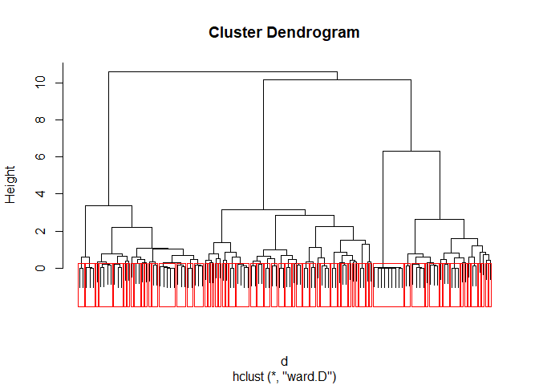
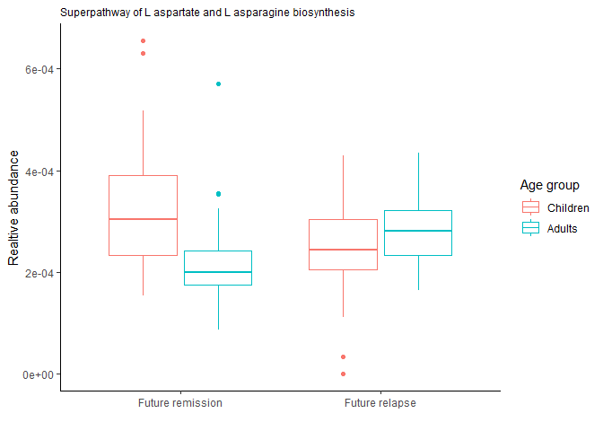
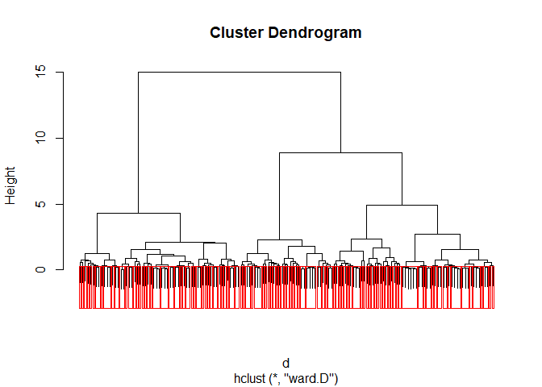
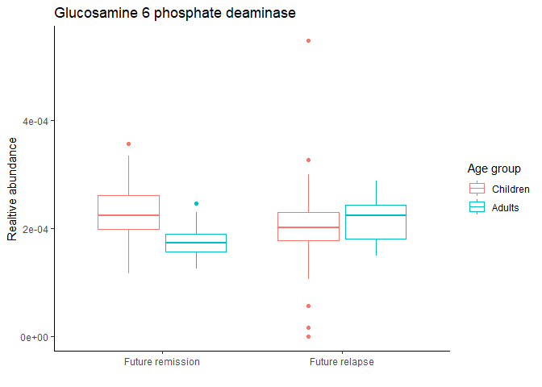
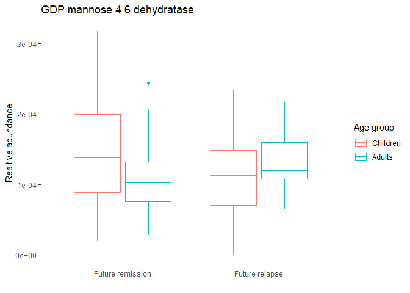
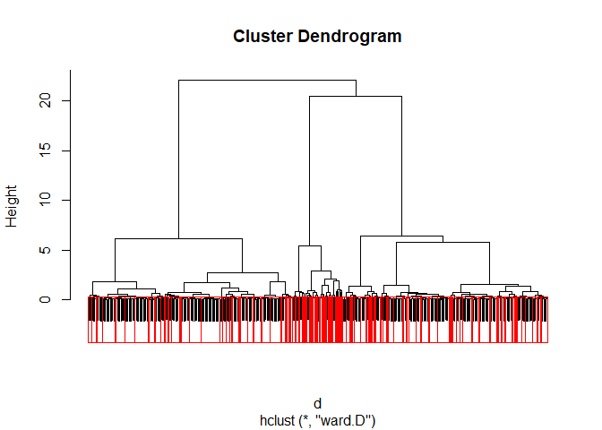

Implied causality
================

  - [Load in packages and data](#load-in-packages-and-data)
  - [Which species are important for the future paraclinical
    remission/disease?](#which-species-are-important-for-the-future-paraclinical-remissiondisease)
  - [Which species are important for the future clinical
    remission/disease?](#which-species-are-important-for-the-future-clinical-remissiondisease)
  - [Which pathways are important for the future paraclinical
    remission/disease?](#which-pathways-are-important-for-the-future-paraclinical-remissiondisease)
  - [Which pathways are important for the future clinical
    remission/disease?](#which-pathways-are-important-for-the-future-clinical-remissiondisease)
  - [Which ECs are important for the future paraclinical
    remission/disease?](#which-ecs-are-important-for-the-future-paraclinical-remissiondisease)
  - [Which ECs are important for the future clinical
    remission/disease?](#which-ecs-are-important-for-the-future-clinical-remissiondisease)
  - [Which KOs are important for the future paraclinical
    remission/disease?](#which-kos-are-important-for-the-future-paraclinical-remissiondisease)
  - [Which KOs are important for the future clinical
    remission/disease?](#which-kos-are-important-for-the-future-clinical-remissiondisease)

# Load in packages and data

Load in packages and path to folder:

``` r
library(tidyverse)
library(caret)
library(phyloseq)
library(NBZIMM)
library(vegan)
library(metaMint)
library(lme4)
library(lmerTest)
library(nlme)
library(zCompositions)
library(broom)
library(MuMIn)
path = "C:/Users/Tom/Documents/10. semester/V1/data/"
```

Load in data:

``` r
#Load in metaphlan dataframe
ps_relab <- readRDS(paste0(path, "humann3_processed_output/Phyloseq/","ps_relab_50mean_50var_zero.rds"))

#Load in humann - OBS: first 3 columns: J_ID, UNMAPPED and UNINTEGRATED
pathway <- read.delim(file=paste0(path, "humann3_processed_output/processed_tables/", "pathway_relab_unstratified_mean50_var50.txt")) 
EC <- read.delim(file=paste0(path, "humann3_processed_output/processed_tables/", "EC_relab_unstratified_mean75_var75.txt"))
KO <- read.delim(file=paste0(path, "humann3_processed_output/processed_tables/", "KO_relab_unstratified_mean75_var75.txt"))
```

``` r
#Load in new metedata - with shifted disease score columns
meta <-  read_delim(file = paste0(path, "metadata/Tilpasset_metadata_timelag.txt"), col_names = T, delim= "\t")
meta <- as_tibble(meta)
```

``` r
#Calculate BMI
meta <- meta %>% mutate(BMI = weight/(height/100)^2)

#Make column with categorical disease scores
meta <- meta %>% mutate(score_p = ifelse(pucai_current < 10, "remission", ifelse(pucai_current <= 34, "mild", ifelse(pucai_current<=64, "moderate", ifelse(pucai_current>64, "severe", "NA")))))
meta <- meta %>% mutate(score_s = ifelse(sccai_current<3, "remission", ifelse(sccai_current<=5, "mild", ifelse(sccai_current<=11, "moderate", ifelse(sccai_current>11, "severe", "NA")))))
meta <- meta %>% mutate(score = ifelse(is.na(score_p), score_s, ifelse(is.na(score_s), score_p, "NA")))
meta$score <- factor(meta$score, levels = c("remission", "mild", "moderate", "severe", "NA"))
meta$score_binary <- as.factor(ifelse(meta$score == "remission", 0, 1))

meta <- meta %>% mutate(score_p = ifelse(pucai_future < 10, "remission", ifelse(pucai_future <= 34, "mild", ifelse(pucai_future<=64, "moderate", ifelse(pucai_future>64, "severe", "NA")))))
meta <- meta %>% mutate(score_s = ifelse(sccai_future<3, "remission", ifelse(sccai_future<=5, "mild", ifelse(sccai_future<=11, "moderate", ifelse(sccai_future>11, "severe", "NA")))))
meta <- meta %>% mutate(score_future = ifelse(is.na(score_p), score_s, ifelse(is.na(score_s), score_p, "NA")))
meta$score_future <- factor(meta$score_future, levels = c("remission", "mild", "moderate", "severe", "NA"))
meta$score_binary_future <- as.factor(ifelse(meta$score_future == "remission", 0, 1))

meta$binary_fcal <- as.factor(ifelse(meta$f_cal_current<250, 0, 1))
meta$binary_fcal_future <- as.factor(ifelse(meta$f_cal_future<250, 0, 1))

#Modify data: factorial
meta$sex <- as.factor(meta$sex)
meta$age_gr <- as.factor(meta$age_gr)
meta$person_ID <- as.factor(meta$person_ID)
meta$study_gr <- as.factor(meta$study_gr)
```

# Which species are important for the future paraclinical remission/disease?

Analysis of single species\! Test the paraclinical remission/disease
using logistic mixed models.

``` r
#Add new metadata to phyloseq
meta_sam <- meta
meta_sam <- sample_data(meta_sam)
sample_names(meta_sam) <- meta$J_ID
otu <- otu_table(ps_relab)
tax <- tax_table(ps_relab)

ps <- phyloseq(otu, tax, meta_sam)

#Make dataframe to test selected species
ps1 <- subset_samples(ps, !is.na(binary_fcal_future))
specie_df1 <- as.data.frame(as.matrix(t(otu_table(ps1))))
meta_df1 <- as.data.frame(sample_data(ps1))

meta_new <- meta_df1
meta_new <- as.data.frame(as.matrix(meta_new))
meta_new$binary_fcal <- as.factor(meta_new$binary_fcal)
meta_new$binary_fcal_future <- as.factor(meta_new$binary_fcal_future)
meta_new$BMI <- as.numeric(meta_new$BMI)
meta_new$age_gr <- as.factor(meta_new$age_gr)
meta_new$pred_future <- as.factor(meta_new$pred_future)
meta_new$asa_future <- as.factor(meta_new$asa_future)
meta_new$l_asa_future <- as.factor(meta_new$l_asa_future)
meta_new$aza_future <- as.factor(meta_new$aza_future)


###Divide species into 2 groups: absent and present
df_test2 <- specie_df1
for (i in 1:dim(df_test2)[2]){
  m1 <- mean(df_test2[,i])
  for (j in 1:dim(df_test2)[1]){
    df_test2[j,i] <- ifelse(df_test2[j,i]==0, "absent", "present")  
  }
  df_test2[,i] <- factor(df_test2[,i], levels=c("absent", "present"))
}

spec <- colnames(df_test2)
df_test2$J_ID <- rownames(df_test2)
df2 <- merge(meta_new, df_test2, by.x="J_ID", by.y="J_ID")

#First: check for interaction with age
res_age <- data.frame()
for (i in spec){
  form <- paste0("binary_fcal_future~binary_fcal+BMI+sex+asa_future+aza_future+l_asa_future+pred_future+", i, "*age_gr+(1|person_ID)")
  model <- glmer(formula=as.formula(form), data=df2, family = "binomial", na.action=na.omit)
  df <- as.data.frame(summary(model)$coefficients)
  res_1 <- df[grep(i, row.names(df)),]
  res_1$bug <- i
  res_age <- rbind(res_age, res_1)
}
```

``` r
res_inter <- res_age[grep("age_gr2", row.names(res_age)),]
res_inter$padj <- p.adjust(res_inter$`Pr(>|z|)`, method="BH")
res_test <- res_inter %>% filter(padj<0.05)
res_test
```

    ##                                               Estimate  Std. Error   z value
    ## s__Odoribacter_splanchnicuspresent:age_gr2 -0.02905817 0.004981233  -5.83353
    ## s__Gemmiger_formicilispresent:age_gr2       1.45016196 0.004974294 291.53119
    ##                                                Pr(>|z|)
    ## s__Odoribacter_splanchnicuspresent:age_gr2 5.426695e-09
    ## s__Gemmiger_formicilispresent:age_gr2      0.000000e+00
    ##                                                                    bug
    ## s__Odoribacter_splanchnicuspresent:age_gr2 s__Odoribacter_splanchnicus
    ## s__Gemmiger_formicilispresent:age_gr2           s__Gemmiger_formicilis
    ##                                                    padj
    ## s__Odoribacter_splanchnicuspresent:age_gr2 2.007877e-07
    ## s__Gemmiger_formicilispresent:age_gr2      0.000000e+00

``` r
res_test1 <- res_inter %>% filter(`Pr(>|z|)`<0.05)

#Fit again to ensure convergence!
model1 <- glmer(formula=binary_fcal_future~binary_fcal+BMI+sex+asa_future+aza_future+l_asa_future+pred_future+s__Odoribacter_splanchnicus*age_gr+(1|person_ID), data=df2, family = "binomial", na.action=na.omit)
```

    ## Warning in checkConv(attr(opt, "derivs"), opt$par, ctrl = control$checkConv, :
    ## Model failed to converge with max|grad| = 0.0143467 (tol = 0.002, component 1)

``` r
model2 <- glmer(formula=binary_fcal_future~binary_fcal+BMI+sex+asa_future+aza_future+l_asa_future+pred_future+s__Gemmiger_formicilis*age_gr+(1|person_ID), data=df2, family = "binomial", na.action=na.omit)
```

    ## Warning in checkConv(attr(opt, "derivs"), opt$par, ctrl = control$checkConv, :
    ## Model failed to converge with max|grad| = 0.0142828 (tol = 0.002, component 1)

``` r
model1 <- glmer(formula=binary_fcal_future~binary_fcal+BMI+sex+asa_future+aza_future+l_asa_future+pred_future+s__Odoribacter_splanchnicus*age_gr+(1|person_ID), data=df2, family = "binomial", na.action=na.omit, control=glmerControl(optimizer="bobyqa"))
summary(model1)
```

    ## Generalized linear mixed model fit by maximum likelihood (Laplace
    ##   Approximation) [glmerMod]
    ##  Family: binomial  ( logit )
    ## Formula: 
    ## binary_fcal_future ~ binary_fcal + BMI + sex + asa_future + aza_future +  
    ##     l_asa_future + pred_future + s__Odoribacter_splanchnicus *  
    ##     age_gr + (1 | person_ID)
    ##    Data: df2
    ## Control: glmerControl(optimizer = "bobyqa")
    ## 
    ##      AIC      BIC   logLik deviance df.resid 
    ##    181.5    216.7    -78.8    157.5      126 
    ## 
    ## Scaled residuals: 
    ##     Min      1Q  Median      3Q     Max 
    ## -1.6214 -0.6207 -0.3994  0.7188  3.9902 
    ## 
    ## Random effects:
    ##  Groups    Name        Variance Std.Dev.
    ##  person_ID (Intercept) 0.3791   0.6157  
    ## Number of obs: 138, groups:  person_ID, 44
    ## 
    ## Fixed effects:
    ##                                            Estimate Std. Error z value Pr(>|z|)
    ## (Intercept)                                 2.72099    1.29214   2.106   0.0352
    ## binary_fcal1                                1.01208    0.44301   2.285   0.0223
    ## BMI                                        -0.14854    0.05870  -2.531   0.0114
    ## sex1                                       -0.04460    0.48361  -0.092   0.9265
    ## asa_future1                                -0.51970    0.59322  -0.876   0.3810
    ## aza_future1                                -0.29753    0.50549  -0.589   0.5561
    ## l_asa_future1                              -0.14334    0.61177  -0.234   0.8147
    ## pred_future1                               -0.77819    1.02087  -0.762   0.4459
    ## s__Odoribacter_splanchnicuspresent          0.27968    0.58876   0.475   0.6348
    ## age_gr2                                    -0.41034    0.99471  -0.413   0.6800
    ## s__Odoribacter_splanchnicuspresent:age_gr2 -0.03263    1.05276  -0.031   0.9753
    ##                                             
    ## (Intercept)                                *
    ## binary_fcal1                               *
    ## BMI                                        *
    ## sex1                                        
    ## asa_future1                                 
    ## aza_future1                                 
    ## l_asa_future1                               
    ## pred_future1                                
    ## s__Odoribacter_splanchnicuspresent          
    ## age_gr2                                     
    ## s__Odoribacter_splanchnicuspresent:age_gr2  
    ## ---
    ## Signif. codes:  0 '***' 0.001 '**' 0.01 '*' 0.05 '.' 0.1 ' ' 1
    ## 
    ## Correlation of Fixed Effects:
    ##             (Intr) bnry_1 BMI    sex1   as_ft1 az_ft1 l_s_f1 prd_f1 s__Od_
    ## binary_fcl1 -0.266                                                        
    ## BMI         -0.831  0.148                                                 
    ## sex1        -0.006  0.059 -0.122                                          
    ## asa_future1 -0.356 -0.026 -0.016 -0.145                                   
    ## aza_future1 -0.252 -0.093 -0.037  0.044  0.370                            
    ## l_asa_futr1  0.007 -0.067 -0.065  0.036  0.026  0.071                     
    ## pred_futur1 -0.016 -0.147 -0.048 -0.113  0.116 -0.021 -0.063              
    ## s__Odrbctr_  0.030 -0.038 -0.191  0.122 -0.239 -0.055 -0.164  0.078       
    ## age_gr2     -0.052  0.036 -0.253 -0.028  0.310  0.201  0.028  0.047  0.232
    ## s__Odrb_:_2  0.066 -0.060  0.066 -0.032  0.032 -0.027  0.058  0.003 -0.506
    ##             ag_gr2
    ## binary_fcl1       
    ## BMI               
    ## sex1              
    ## asa_future1       
    ## aza_future1       
    ## l_asa_futr1       
    ## pred_futur1       
    ## s__Odrbctr_       
    ## age_gr2           
    ## s__Odrb_:_2 -0.772

``` r
model2 <- glmer(formula=binary_fcal_future~binary_fcal+BMI+sex+asa_future+aza_future+l_asa_future+pred_future+s__Gemmiger_formicilis*age_gr+(1|person_ID), data=df2, family = "binomial", na.action=na.omit, control=glmerControl(optimizer="bobyqa"))
summary(model2)#no convergence
```

    ## Generalized linear mixed model fit by maximum likelihood (Laplace
    ##   Approximation) [glmerMod]
    ##  Family: binomial  ( logit )
    ## Formula: 
    ## binary_fcal_future ~ binary_fcal + BMI + sex + asa_future + aza_future +  
    ##     l_asa_future + pred_future + s__Gemmiger_formicilis * age_gr +  
    ##     (1 | person_ID)
    ##    Data: df2
    ## Control: glmerControl(optimizer = "bobyqa")
    ## 
    ##      AIC      BIC   logLik deviance df.resid 
    ##    180.3    215.4    -78.1    156.3      126 
    ## 
    ## Scaled residuals: 
    ##     Min      1Q  Median      3Q     Max 
    ## -1.7951 -0.6292 -0.3717  0.7469  4.1257 
    ## 
    ## Random effects:
    ##  Groups    Name        Variance Std.Dev.
    ##  person_ID (Intercept) 0.3672   0.606   
    ## Number of obs: 138, groups:  person_ID, 44
    ## 
    ## Fixed effects:
    ##                                       Estimate Std. Error z value Pr(>|z|)   
    ## (Intercept)                            2.73830    1.34155   2.041  0.04124 * 
    ## binary_fcal1                           1.06760    0.44214   2.415  0.01575 * 
    ## BMI                                   -0.15304    0.05821  -2.629  0.00856 **
    ## sex1                                  -0.02279    0.48044  -0.047  0.96217   
    ## asa_future1                           -0.30161    0.58229  -0.518  0.60447   
    ## aza_future1                           -0.31183    0.51895  -0.601  0.54792   
    ## l_asa_future1                         -0.16974    0.60839  -0.279  0.78024   
    ## pred_future1                          -0.85199    1.01210  -0.842  0.39990   
    ## s__Gemmiger_formicilispresent          0.02623    0.57973   0.045  0.96391   
    ## age_gr2                               -1.54353    1.32161  -1.168  0.24284   
    ## s__Gemmiger_formicilispresent:age_gr2  1.45067    1.43728   1.009  0.31282   
    ## ---
    ## Signif. codes:  0 '***' 0.001 '**' 0.01 '*' 0.05 '.' 0.1 ' ' 1
    ## 
    ## Correlation of Fixed Effects:
    ##             (Intr) bnry_1 BMI    sex1   as_ft1 az_ft1 l_s_f1 prd_f1 s__Gm_
    ## binary_fcl1 -0.243                                                        
    ## BMI         -0.815  0.118                                                 
    ## sex1        -0.005  0.071 -0.118                                          
    ## asa_future1 -0.300 -0.020 -0.101 -0.094                                   
    ## aza_future1 -0.308 -0.101 -0.022  0.045  0.324                            
    ## l_asa_futr1  0.054 -0.077 -0.085  0.044 -0.028  0.029                     
    ## pred_futur1 -0.014 -0.149 -0.037 -0.124  0.131 -0.009 -0.053              
    ## s__Gmmgr_fr -0.286  0.018  0.042  0.005 -0.069  0.232 -0.174  0.007       
    ## age_gr2     -0.115 -0.057 -0.054 -0.083  0.056  0.239  0.054  0.065  0.284
    ## s__Gmmg_:_2  0.176  0.047 -0.145  0.070  0.186 -0.158 -0.004 -0.022 -0.443
    ##             ag_gr2
    ## binary_fcl1       
    ## BMI               
    ## sex1              
    ## asa_future1       
    ## aza_future1       
    ## l_asa_futr1       
    ## pred_futur1       
    ## s__Gmmgr_fr       
    ## age_gr2           
    ## s__Gmmg_:_2 -0.880

``` r
#The results were not significant, when the models actually reaches convergence!!

#Look into pval<0.05 - not statistically significant, but perhaps indications!
model1 <- glmer(formula=binary_fcal_future~binary_fcal+BMI+sex+asa_future+aza_future+l_asa_future+pred_future+s__Bifidobacterium_pseudocatenulatum*age_gr+(1|person_ID), data=df2, family = "binomial", na.action=na.omit)
```

    ## boundary (singular) fit: see ?isSingular

``` r
model2 <- glmer(formula=binary_fcal_future~binary_fcal+BMI+sex+asa_future+aza_future+l_asa_future+pred_future+s__Bacteroides_dorei*age_gr+(1|person_ID), data=df2, family = "binomial", na.action=na.omit)
model3 <- glmer(formula=binary_fcal_future~binary_fcal+BMI+sex+asa_future+aza_future+l_asa_future+pred_future+s__Escherichia_coli*age_gr+(1|person_ID), data=df2, family = "binomial", na.action=na.omit)
```

    ## boundary (singular) fit: see ?isSingular

``` r
summary(model1) #isSingular?
```

    ## Generalized linear mixed model fit by maximum likelihood (Laplace
    ##   Approximation) [glmerMod]
    ##  Family: binomial  ( logit )
    ## Formula: 
    ## binary_fcal_future ~ binary_fcal + BMI + sex + asa_future + aza_future +  
    ##     l_asa_future + pred_future + s__Bifidobacterium_pseudocatenulatum *  
    ##     age_gr + (1 | person_ID)
    ##    Data: df2
    ## 
    ##      AIC      BIC   logLik deviance df.resid 
    ##    174.3    209.5    -75.2    150.3      126 
    ## 
    ## Scaled residuals: 
    ##     Min      1Q  Median      3Q     Max 
    ## -1.7487 -0.6689 -0.3575  0.7335  6.2663 
    ## 
    ## Random effects:
    ##  Groups    Name        Variance Std.Dev.
    ##  person_ID (Intercept) 0        0       
    ## Number of obs: 138, groups:  person_ID, 44
    ## 
    ## Fixed effects:
    ##                                                      Estimate Std. Error
    ## (Intercept)                                          1.735415   1.161175
    ## binary_fcal1                                         1.174561   0.415456
    ## BMI                                                 -0.133501   0.053583
    ## sex1                                                -0.384761   0.445303
    ## asa_future1                                         -0.369084   0.536355
    ## aza_future1                                          0.001501   0.465900
    ## l_asa_future1                                       -0.191310   0.561860
    ## pred_future1                                        -1.036101   0.943247
    ## s__Bifidobacterium_pseudocatenulatumpresent          1.426470   0.536233
    ## age_gr2                                              0.580340   0.647332
    ## s__Bifidobacterium_pseudocatenulatumpresent:age_gr2 -2.008057   0.922445
    ##                                                     z value Pr(>|z|)   
    ## (Intercept)                                           1.495  0.13504   
    ## binary_fcal1                                          2.827  0.00470 **
    ## BMI                                                  -2.491  0.01272 * 
    ## sex1                                                 -0.864  0.38756   
    ## asa_future1                                          -0.688  0.49137   
    ## aza_future1                                           0.003  0.99743   
    ## l_asa_future1                                        -0.340  0.73349   
    ## pred_future1                                         -1.098  0.27201   
    ## s__Bifidobacterium_pseudocatenulatumpresent           2.660  0.00781 **
    ## age_gr2                                               0.897  0.36998   
    ## s__Bifidobacterium_pseudocatenulatumpresent:age_gr2  -2.177  0.02949 * 
    ## ---
    ## Signif. codes:  0 '***' 0.001 '**' 0.01 '*' 0.05 '.' 0.1 ' ' 1
    ## 
    ## Correlation of Fixed Effects:
    ##             (Intr) bnry_1 BMI    sex1   as_ft1 az_ft1 l_s_f1 prd_f1 s__Bf_
    ## binary_fcl1 -0.209                                                        
    ## BMI         -0.812  0.077                                                 
    ## sex1        -0.009  0.026 -0.017                                          
    ## asa_future1 -0.326 -0.051 -0.123 -0.149                                   
    ## aza_future1 -0.232 -0.147 -0.113 -0.012  0.405                            
    ## l_asa_futr1  0.032 -0.116 -0.079  0.082 -0.039  0.024                     
    ## pred_futur1  0.023 -0.162 -0.066 -0.122  0.164 -0.017 -0.032              
    ## s__Bfdbctr_ -0.132  0.100 -0.108 -0.267  0.055  0.172 -0.089 -0.108       
    ## age_gr2     -0.035  0.002 -0.379 -0.175  0.436  0.329  0.001  0.066  0.446
    ## s__Bfdb_:_2  0.153 -0.112 -0.018  0.198  0.000 -0.150  0.063  0.058 -0.602
    ##             ag_gr2
    ## binary_fcl1       
    ## BMI               
    ## sex1              
    ## asa_future1       
    ## aza_future1       
    ## l_asa_futr1       
    ## pred_futur1       
    ## s__Bfdbctr_       
    ## age_gr2           
    ## s__Bfdb_:_2 -0.519
    ## optimizer (Nelder_Mead) convergence code: 0 (OK)
    ## boundary (singular) fit: see ?isSingular

``` r
summary(model2)
```

    ## Generalized linear mixed model fit by maximum likelihood (Laplace
    ##   Approximation) [glmerMod]
    ##  Family: binomial  ( logit )
    ## Formula: 
    ## binary_fcal_future ~ binary_fcal + BMI + sex + asa_future + aza_future +  
    ##     l_asa_future + pred_future + s__Bacteroides_dorei * age_gr +  
    ##     (1 | person_ID)
    ##    Data: df2
    ## 
    ##      AIC      BIC   logLik deviance df.resid 
    ##    174.5    209.6    -75.2    150.5      126 
    ## 
    ## Scaled residuals: 
    ##     Min      1Q  Median      3Q     Max 
    ## -1.9348 -0.6430 -0.3565  0.6532  5.0616 
    ## 
    ## Random effects:
    ##  Groups    Name        Variance Std.Dev.
    ##  person_ID (Intercept) 0.168    0.4099  
    ## Number of obs: 138, groups:  person_ID, 44
    ## 
    ## Fixed effects:
    ##                                     Estimate Std. Error z value Pr(>|z|)  
    ## (Intercept)                          1.43652    1.28290   1.120   0.2628  
    ## binary_fcal1                         0.99490    0.43855   2.269   0.0233 *
    ## BMI                                 -0.10467    0.05548  -1.887   0.0592 .
    ## sex1                                -0.32009    0.51314  -0.624   0.5328  
    ## asa_future1                         -0.36072    0.57396  -0.628   0.5297  
    ## aza_future1                         -0.19125    0.51417  -0.372   0.7099  
    ## l_asa_future1                       -0.24385    0.59346  -0.411   0.6811  
    ## pred_future1                        -1.13039    1.02589  -1.102   0.2705  
    ## s__Bacteroides_doreipresent          1.26009    0.61080   2.063   0.0391 *
    ## age_gr2                              0.67104    0.69702   0.963   0.3357  
    ## s__Bacteroides_doreipresent:age_gr2 -2.38470    0.96276  -2.477   0.0133 *
    ## ---
    ## Signif. codes:  0 '***' 0.001 '**' 0.01 '*' 0.05 '.' 0.1 ' ' 1
    ## 
    ## Correlation of Fixed Effects:
    ##             (Intr) bnry_1 BMI    sex1   as_ft1 az_ft1 l_s_f1 prd_f1 s__Bc_
    ## binary_fcl1 -0.235                                                        
    ## BMI         -0.827  0.126                                                 
    ## sex1         0.141  0.069 -0.161                                          
    ## asa_future1 -0.375 -0.042 -0.062 -0.170                                   
    ## aza_future1 -0.265 -0.103 -0.071 -0.052  0.400                            
    ## l_asa_futr1  0.022 -0.048 -0.109  0.024 -0.012  0.100                     
    ## pred_futur1  0.075 -0.160 -0.109 -0.064  0.126 -0.007 -0.045              
    ## s__Bctrds_d -0.314 -0.070  0.168 -0.395  0.066  0.156 -0.046 -0.153       
    ## age_gr2     -0.068 -0.075 -0.278 -0.079  0.432  0.176 -0.042  0.025  0.302
    ## s__Bctr_:_2  0.172  0.071 -0.129  0.107 -0.014  0.089  0.157  0.125 -0.591
    ##             ag_gr2
    ## binary_fcl1       
    ## BMI               
    ## sex1              
    ## asa_future1       
    ## aza_future1       
    ## l_asa_futr1       
    ## pred_futur1       
    ## s__Bctrds_d       
    ## age_gr2           
    ## s__Bctr_:_2 -0.538

``` r
summary(model3) #isSingular?
```

    ## Generalized linear mixed model fit by maximum likelihood (Laplace
    ##   Approximation) [glmerMod]
    ##  Family: binomial  ( logit )
    ## Formula: 
    ## binary_fcal_future ~ binary_fcal + BMI + sex + asa_future + aza_future +  
    ##     l_asa_future + pred_future + s__Escherichia_coli * age_gr +  
    ##     (1 | person_ID)
    ##    Data: df2
    ## 
    ##      AIC      BIC   logLik deviance df.resid 
    ##    168.6    203.7    -72.3    144.6      126 
    ## 
    ## Scaled residuals: 
    ##     Min      1Q  Median      3Q     Max 
    ## -2.2909 -0.5992 -0.3343  0.6815  4.4353 
    ## 
    ## Random effects:
    ##  Groups    Name        Variance Std.Dev.
    ##  person_ID (Intercept) 0        0       
    ## Number of obs: 138, groups:  person_ID, 44
    ## 
    ## Fixed effects:
    ##                                    Estimate Std. Error z value Pr(>|z|)    
    ## (Intercept)                         1.37450    1.19348   1.152 0.249456    
    ## binary_fcal1                        1.14355    0.42513   2.690 0.007148 ** 
    ## BMI                                -0.15009    0.05342  -2.810 0.004957 ** 
    ## sex1                                0.08718    0.45366   0.192 0.847606    
    ## asa_future1                        -0.54273    0.56039  -0.968 0.332803    
    ## aza_future1                        -0.46036    0.47835  -0.962 0.335857    
    ## l_asa_future1                      -0.21735    0.56994  -0.381 0.702943    
    ## pred_future1                       -0.62749    1.05097  -0.597 0.550468    
    ## s__Escherichia_colipresent          2.11972    0.62764   3.377 0.000732 ***
    ## age_gr2                             1.12409    0.86025   1.307 0.191317    
    ## s__Escherichia_colipresent:age_gr2 -2.03889    0.93725  -2.175 0.029600 *  
    ## ---
    ## Signif. codes:  0 '***' 0.001 '**' 0.01 '*' 0.05 '.' 0.1 ' ' 1
    ## 
    ## Correlation of Fixed Effects:
    ##             (Intr) bnry_1 BMI    sex1   as_ft1 az_ft1 l_s_f1 prd_f1 s__Es_
    ## binary_fcl1 -0.223                                                        
    ## BMI         -0.755  0.084                                                 
    ## sex1         0.003  0.054 -0.134                                          
    ## asa_future1 -0.336 -0.085 -0.084 -0.147                                   
    ## aza_future1 -0.129 -0.175 -0.129  0.089  0.377                            
    ## l_asa_futr1  0.054 -0.089 -0.110  0.033 -0.023  0.069                     
    ## pred_futur1  0.023 -0.173 -0.069 -0.109  0.104  0.006 -0.084              
    ## s__Eschrch_ -0.243  0.107 -0.143  0.079 -0.064 -0.156 -0.077  0.023       
    ## age_gr2     -0.085 -0.006 -0.381 -0.073  0.284  0.139  0.079  0.078  0.544
    ## s__Esch_:_2  0.095 -0.066  0.147  0.041  0.094  0.072 -0.049 -0.036 -0.659
    ##             ag_gr2
    ## binary_fcl1       
    ## BMI               
    ## sex1              
    ## asa_future1       
    ## aza_future1       
    ## l_asa_futr1       
    ## pred_futur1       
    ## s__Eschrch_       
    ## age_gr2           
    ## s__Esch_:_2 -0.756
    ## optimizer (Nelder_Mead) convergence code: 0 (OK)
    ## boundary (singular) fit: see ?isSingular

``` r
#Ended up detecting 3 - is this more than expected?
binom.test(3, 75, p=0.05)$p.value
```

    ## [1] 1

``` r
#No!
```

``` r
#Test without the interaction term!
spec_1 <- colnames(df_test2)[1:75]

res <- data.frame()
for (i in spec_1){
  form <- paste0("binary_fcal_future~binary_fcal+BMI+sex+asa_future+aza_future+l_asa_future+pred_future+", i, "+(1|person_ID)")
  model <- glmer(formula=as.formula(form), data=df2, family = "binomial", na.action=na.omit)
  df <- as.data.frame(summary(model)$coefficients)
  res_1 <- df[grep(i, row.names(df)),]
  res_1$bug <- i
  res <- rbind(res, res_1)
}
```

``` r
res$padj <- p.adjust(res$`Pr(>|z|)`, method = "BH")
res_sig1 <- res %>% filter(`Pr(>|z|)`<0.05)
res_sig <- res %>% filter(padj<0.05)

spec <- unique(res_sig$bug)
spec1 <- unique(res_sig1$bug)

#go with the padj<0.05 and refit to ensure convergence!:
j <- 1
for (i in spec){
  form <- paste0("binary_fcal_future~binary_fcal+BMI+sex+asa_future+aza_future+l_asa_future+pred_future+", i, "+(1|person_ID)")
  model <- glmer(formula=form, family="binomial", data=df2, na.action=na.omit)
  assign(paste0("model", j), model)
  j <- j+1
  
}
```

    ## Warning in checkConv(attr(opt, "derivs"), opt$par, ctrl = control$checkConv, :
    ## Model failed to converge with max|grad| = 0.0147583 (tol = 0.002, component 1)

    ## Warning in checkConv(attr(opt, "derivs"), opt$par, ctrl = control$checkConv, :
    ## Model failed to converge with max|grad| = 0.0150547 (tol = 0.002, component 1)

``` r
model1 <- glmer(formula=binary_fcal_future~binary_fcal+sex+BMI+asa_future+aza_future+l_asa_future+pred_future+s__Odoribacter_splanchnicus+(1|person_ID), family="binomial", data=df2, control=glmerControl(optimizer="bobyqa"))
summary(model1)
```

    ## Generalized linear mixed model fit by maximum likelihood (Laplace
    ##   Approximation) [glmerMod]
    ##  Family: binomial  ( logit )
    ## Formula: 
    ## binary_fcal_future ~ binary_fcal + sex + BMI + asa_future + aza_future +  
    ##     l_asa_future + pred_future + s__Odoribacter_splanchnicus +  
    ##     (1 | person_ID)
    ##    Data: df2
    ## Control: glmerControl(optimizer = "bobyqa")
    ## 
    ##      AIC      BIC   logLik deviance df.resid 
    ##    178.0    207.3    -79.0    158.0      128 
    ## 
    ## Scaled residuals: 
    ##     Min      1Q  Median      3Q     Max 
    ## -1.6440 -0.6209 -0.3782  0.7469  4.2474 
    ## 
    ## Random effects:
    ##  Groups    Name        Variance Std.Dev.
    ##  person_ID (Intercept) 0.3753   0.6126  
    ## Number of obs: 138, groups:  person_ID, 44
    ## 
    ## Fixed effects:
    ##                                    Estimate Std. Error z value Pr(>|z|)   
    ## (Intercept)                         2.76332    1.29034   2.142  0.03223 * 
    ## binary_fcal1                        0.99980    0.44060   2.269  0.02326 * 
    ## sex1                               -0.07369    0.48052  -0.153  0.87812   
    ## BMI                                -0.16322    0.05562  -2.935  0.00334 **
    ## asa_future1                        -0.30604    0.50272  -0.609  0.54268   
    ## aza_future1                        -0.20222    0.48495  -0.417  0.67669   
    ## l_asa_future1                      -0.09840    0.60249  -0.163  0.87027   
    ## pred_future1                       -0.72829    1.01447  -0.718  0.47282   
    ## s__Odoribacter_splanchnicuspresent  0.17563    0.48476   0.362  0.71712   
    ## ---
    ## Signif. codes:  0 '***' 0.001 '**' 0.01 '*' 0.05 '.' 0.1 ' ' 1
    ## 
    ## Correlation of Fixed Effects:
    ##             (Intr) bnry_1 sex1   BMI    as_ft1 az_ft1 l_s_f1 prd_f1
    ## binary_fcl1 -0.262                                                 
    ## sex1         0.001  0.054                                          
    ## BMI         -0.887  0.155 -0.161                                   
    ## asa_future1 -0.426 -0.012 -0.127  0.193                            
    ## aza_future1 -0.265 -0.095  0.068  0.063  0.280                     
    ## l_asa_futr1  0.004 -0.056  0.050 -0.039 -0.047  0.047              
    ## pred_futur1 -0.008 -0.150 -0.099 -0.034  0.086 -0.041 -0.075       
    ## s__Odrbctr_  0.078 -0.093  0.112 -0.303 -0.136  0.001 -0.123  0.120

``` r
model2 <- glmer(formula=binary_fcal_future~binary_fcal+sex+BMI+asa_future+aza_future+l_asa_future+pred_future+s__Alistipes_shahii+(1|person_ID), family="binomial", data=df2, control=glmerControl(optimizer="nlminbwrap"))
summary(model2)
```

    ## Generalized linear mixed model fit by maximum likelihood (Laplace
    ##   Approximation) [glmerMod]
    ##  Family: binomial  ( logit )
    ## Formula: 
    ## binary_fcal_future ~ binary_fcal + sex + BMI + asa_future + aza_future +  
    ##     l_asa_future + pred_future + s__Alistipes_shahii + (1 | person_ID)
    ##    Data: df2
    ## Control: glmerControl(optimizer = "nlminbwrap")
    ## 
    ##      AIC      BIC   logLik deviance df.resid 
    ##    176.4    205.7    -78.2    156.4      128 
    ## 
    ## Scaled residuals: 
    ##     Min      1Q  Median      3Q     Max 
    ## -1.9267 -0.6502 -0.3567  0.7063  4.3647 
    ## 
    ## Random effects:
    ##  Groups    Name        Variance Std.Dev.
    ##  person_ID (Intercept) 0.3934   0.6272  
    ## Number of obs: 138, groups:  person_ID, 44
    ## 
    ## Fixed effects:
    ##                            Estimate Std. Error z value Pr(>|z|)   
    ## (Intercept)                 2.64500    1.29440   2.043  0.04101 * 
    ## binary_fcal1                0.94343    0.44732   2.109  0.03494 * 
    ## sex1                       -0.17752    0.49045  -0.362  0.71738   
    ## BMI                        -0.16841    0.05493  -3.066  0.00217 **
    ## asa_future1                -0.31187    0.50052  -0.623  0.53322   
    ## aza_future1                -0.02586    0.50697  -0.051  0.95931   
    ## l_asa_future1              -0.21872    0.61881  -0.353  0.72375   
    ## pred_future1               -0.76661    1.00535  -0.763  0.44574   
    ## s__Alistipes_shahiipresent  0.63537    0.50306   1.263  0.20659   
    ## ---
    ## Signif. codes:  0 '***' 0.001 '**' 0.01 '*' 0.05 '.' 0.1 ' ' 1
    ## 
    ## Correlation of Fixed Effects:
    ##             (Intr) bnry_1 sex1   BMI    as_ft1 az_ft1 l_s_f1 prd_f1
    ## binary_fcl1 -0.260                                                 
    ## sex1        -0.016  0.083                                          
    ## BMI         -0.887  0.162 -0.094                                   
    ## asa_future1 -0.416 -0.007 -0.102  0.167                            
    ## aza_future1 -0.253 -0.117  0.045  0.001  0.254                     
    ## l_asa_futr1  0.016 -0.035  0.092 -0.041 -0.051  0.008              
    ## pred_futur1 -0.010 -0.148 -0.111 -0.002  0.101 -0.044 -0.056       
    ## s__Alstps_s  0.018 -0.150 -0.150 -0.229 -0.056  0.242 -0.199 -0.006

``` r
#They were only significant because they didn't reach convergence!!


#Try out the last 8 with p-val<0.05:
spec2 <- spec1[!(spec1 %in%spec)]
spec2
```

    ## [1] "s__Bifidobacterium_adolescentis" "s__Bifidobacterium_bifidum"     
    ## [3] "s__Bifidobacterium_longum"       "s__Alistipes_indistinctus"      
    ## [5] "s__Streptococcus_parasanguinis"  "s__Clostridium_bolteae"         
    ## [7] "s__Oscillibacter_sp_57_20"       "s__Escherichia_coli"

``` r
j <- 1
for (i in spec2){
  form <- paste0("binary_fcal_future~binary_fcal+BMI+sex+asa_future+aza_future+l_asa_future+pred_future+", i, "+(1|person_ID)")
  model <- glmer(formula=form, family="binomial", data=df2, na.action=na.omit)
  assign(paste0("model", j), model)
  j <- j+1
  
}
```

    ## Warning in checkConv(attr(opt, "derivs"), opt$par, ctrl = control$checkConv, :
    ## Model failed to converge with max|grad| = 0.061433 (tol = 0.002, component 1)

    ## Warning in checkConv(attr(opt, "derivs"), opt$par, ctrl = control$checkConv, :
    ## Model failed to converge with max|grad| = 0.00385928 (tol = 0.002, component 1)

    ## Warning in checkConv(attr(opt, "derivs"), opt$par, ctrl = control$checkConv, :
    ## Model failed to converge with max|grad| = 0.163468 (tol = 0.002, component 1)

    ## Warning in checkConv(attr(opt, "derivs"), opt$par, ctrl = control$checkConv, :
    ## Model failed to converge with max|grad| = 0.00734291 (tol = 0.002, component 1)

    ## Warning in checkConv(attr(opt, "derivs"), opt$par, ctrl = control$checkConv, :
    ## Model failed to converge with max|grad| = 0.00468003 (tol = 0.002, component 1)

``` r
model1 <- glmer(formula=binary_fcal_future~binary_fcal+BMI+sex+asa_future+aza_future+l_asa_future+pred_future+s__Bifidobacterium_adolescentis+(1|person_ID), family="binomial", data=df2, control=glmerControl(optimizer="nlminbwrap"))
summary(model1)
```

    ## Generalized linear mixed model fit by maximum likelihood (Laplace
    ##   Approximation) [glmerMod]
    ##  Family: binomial  ( logit )
    ## Formula: 
    ## binary_fcal_future ~ binary_fcal + BMI + sex + asa_future + aza_future +  
    ##     l_asa_future + pred_future + s__Bifidobacterium_adolescentis +  
    ##     (1 | person_ID)
    ##    Data: df2
    ## Control: glmerControl(optimizer = "nlminbwrap")
    ## 
    ##      AIC      BIC   logLik deviance df.resid 
    ##    172.0    201.3    -76.0    152.0      128 
    ## 
    ## Scaled residuals: 
    ##     Min      1Q  Median      3Q     Max 
    ## -1.6139 -0.6025 -0.3609  0.6421  2.7493 
    ## 
    ## Random effects:
    ##  Groups    Name        Variance Std.Dev.
    ##  person_ID (Intercept) 0.9238   0.9612  
    ## Number of obs: 138, groups:  person_ID, 44
    ## 
    ## Fixed effects:
    ##                                        Estimate Std. Error z value Pr(>|z|)   
    ## (Intercept)                             3.72359    1.64288   2.266  0.02342 * 
    ## binary_fcal1                            0.93587    0.48290   1.938  0.05262 . 
    ## BMI                                    -0.16281    0.06162  -2.642  0.00824 **
    ## sex1                                   -0.09579    0.56390  -0.170  0.86512   
    ## asa_future1                            -0.25050    0.57219  -0.438  0.66154   
    ## aza_future1                            -0.27768    0.56376  -0.493  0.62233   
    ## l_asa_future1                          -0.03579    0.65608  -0.055  0.95649   
    ## pred_future1                           -1.04723    1.10698  -0.946  0.34414   
    ## s__Bifidobacterium_adolescentispresent -1.30048    0.61614  -2.111  0.03480 * 
    ## ---
    ## Signif. codes:  0 '***' 0.001 '**' 0.01 '*' 0.05 '.' 0.1 ' ' 1
    ## 
    ## Correlation of Fixed Effects:
    ##             (Intr) bnry_1 BMI    sex1   as_ft1 az_ft1 l_s_f1 prd_f1
    ## binary_fcl1 -0.268                                                 
    ## BMI         -0.894  0.150                                          
    ## sex1        -0.020  0.080 -0.132                                   
    ## asa_future1 -0.365 -0.029  0.157 -0.124                            
    ## aza_future1 -0.300 -0.089  0.110  0.082  0.259                     
    ## l_asa_futr1  0.039 -0.068 -0.106  0.037 -0.065  0.046              
    ## pred_futur1 -0.032 -0.162 -0.004 -0.090  0.096 -0.042 -0.074       
    ## s__Bfdbctr_ -0.428  0.115  0.212  0.033 -0.033  0.105 -0.012  0.109

``` r
model2 <- glmer(formula=binary_fcal_future~binary_fcal+BMI+sex+asa_future+aza_future+l_asa_future+pred_future+s__Bifidobacterium_bifidum+(1|person_ID), family="binomial", data=df2, control=glmerControl(optimizer="bobyqa"))
summary(model2)
```

    ## Generalized linear mixed model fit by maximum likelihood (Laplace
    ##   Approximation) [glmerMod]
    ##  Family: binomial  ( logit )
    ## Formula: 
    ## binary_fcal_future ~ binary_fcal + BMI + sex + asa_future + aza_future +  
    ##     l_asa_future + pred_future + s__Bifidobacterium_bifidum +  
    ##     (1 | person_ID)
    ##    Data: df2
    ## Control: glmerControl(optimizer = "bobyqa")
    ## 
    ##      AIC      BIC   logLik deviance df.resid 
    ##    173.5    202.8    -76.8    153.5      128 
    ## 
    ## Scaled residuals: 
    ##     Min      1Q  Median      3Q     Max 
    ## -1.6523 -0.6877 -0.4058  0.7282  3.7779 
    ## 
    ## Random effects:
    ##  Groups    Name        Variance Std.Dev.
    ##  person_ID (Intercept) 0.2326   0.4823  
    ## Number of obs: 138, groups:  person_ID, 44
    ## 
    ## Fixed effects:
    ##                                   Estimate Std. Error z value Pr(>|z|)   
    ## (Intercept)                        3.22603    1.29925   2.483  0.01303 * 
    ## binary_fcal1                       0.99603    0.43859   2.271  0.02315 * 
    ## BMI                               -0.16285    0.05162  -3.155  0.00161 **
    ## sex1                              -0.20866    0.47404  -0.440  0.65981   
    ## asa_future1                       -0.20232    0.48995  -0.413  0.67965   
    ## aza_future1                        0.05196    0.48422   0.107  0.91454   
    ## l_asa_future1                      0.07733    0.57966   0.133  0.89388   
    ## pred_future1                      -0.99075    1.01460  -0.976  0.32882   
    ## s__Bifidobacterium_bifidumpresent -0.95855    0.46118  -2.078  0.03767 * 
    ## ---
    ## Signif. codes:  0 '***' 0.001 '**' 0.01 '*' 0.05 '.' 0.1 ' ' 1
    ## 
    ## Correlation of Fixed Effects:
    ##             (Intr) bnry_1 BMI    sex1   as_ft1 az_ft1 l_s_f1 prd_f1
    ## binary_fcl1 -0.251                                                 
    ## BMI         -0.904  0.118                                          
    ## sex1        -0.063  0.110 -0.091                                   
    ## asa_future1 -0.371 -0.047  0.149 -0.172                            
    ## aza_future1 -0.186 -0.099  0.022  0.038  0.282                     
    ## l_asa_futr1  0.012 -0.046 -0.075  0.055 -0.065  0.092              
    ## pred_futur1 -0.033 -0.150  0.006 -0.095  0.083 -0.055 -0.070       
    ## s__Bfdbctr_ -0.304  0.063  0.183  0.161 -0.084 -0.210 -0.087  0.126

``` r
model3 <- glmer(formula=binary_fcal_future~binary_fcal+BMI+sex+asa_future+aza_future+l_asa_future+pred_future+s__Bifidobacterium_longum+(1|person_ID), family="binomial", data=df2, control=glmerControl(optimizer="bobyqa"))
summary(model3)
```

    ## Generalized linear mixed model fit by maximum likelihood (Laplace
    ##   Approximation) [glmerMod]
    ##  Family: binomial  ( logit )
    ## Formula: 
    ## binary_fcal_future ~ binary_fcal + BMI + sex + asa_future + aza_future +  
    ##     l_asa_future + pred_future + s__Bifidobacterium_longum +  
    ##     (1 | person_ID)
    ##    Data: df2
    ## Control: glmerControl(optimizer = "bobyqa")
    ## 
    ##      AIC      BIC   logLik deviance df.resid 
    ##    168.5    197.8    -74.3    148.5      128 
    ## 
    ## Scaled residuals: 
    ##     Min      1Q  Median      3Q     Max 
    ## -1.6499 -0.5813 -0.3519  0.6039  5.8156 
    ## 
    ## Random effects:
    ##  Groups    Name        Variance Std.Dev.
    ##  person_ID (Intercept) 0.8916   0.9443  
    ## Number of obs: 138, groups:  person_ID, 44
    ## 
    ## Fixed effects:
    ##                                  Estimate Std. Error z value Pr(>|z|)   
    ## (Intercept)                       6.56938    2.28688   2.873  0.00407 **
    ## binary_fcal1                      0.88062    0.48406   1.819  0.06887 . 
    ## BMI                              -0.23316    0.07200  -3.238  0.00120 **
    ## sex1                             -0.09261    0.57188  -0.162  0.87135   
    ## asa_future1                      -0.34273    0.58490  -0.586  0.55790   
    ## aza_future1                      -0.54300    0.59429  -0.914  0.36088   
    ## l_asa_future1                     0.05973    0.66686   0.090  0.92864   
    ## pred_future1                     -0.90341    1.07654  -0.839  0.40137   
    ## s__Bifidobacterium_longumpresent -2.36637    0.94630  -2.501  0.01240 * 
    ## ---
    ## Signif. codes:  0 '***' 0.001 '**' 0.01 '*' 0.05 '.' 0.1 ' ' 1
    ## 
    ## Correlation of Fixed Effects:
    ##             (Intr) bnry_1 BMI    sex1   as_ft1 az_ft1 l_s_f1 prd_f1
    ## binary_fcl1 -0.239                                                 
    ## BMI         -0.908  0.154                                          
    ## sex1        -0.024  0.097 -0.089                                   
    ## asa_future1 -0.294 -0.033  0.143 -0.153                            
    ## aza_future1 -0.368 -0.056  0.200  0.072  0.266                     
    ## l_asa_futr1  0.028 -0.062 -0.083  0.040 -0.081  0.040              
    ## pred_futur1 -0.043 -0.169  0.009 -0.121  0.097 -0.014 -0.088       
    ## s__Bfdbctr_ -0.771  0.129  0.556  0.019  0.048  0.267 -0.012  0.080

``` r
summary(model4)
```

    ## Generalized linear mixed model fit by maximum likelihood (Laplace
    ##   Approximation) [glmerMod]
    ##  Family: binomial  ( logit )
    ## Formula: 
    ## binary_fcal_future ~ binary_fcal + BMI + sex + asa_future + aza_future +  
    ##     l_asa_future + pred_future + s__Alistipes_indistinctus +  
    ##     (1 | person_ID)
    ##    Data: df2
    ## 
    ##      AIC      BIC   logLik deviance df.resid 
    ##    173.5    202.7    -76.7    153.5      128 
    ## 
    ## Scaled residuals: 
    ##     Min      1Q  Median      3Q     Max 
    ## -2.2028 -0.6981 -0.3425  0.7744  4.3359 
    ## 
    ## Random effects:
    ##  Groups    Name        Variance Std.Dev.
    ##  person_ID (Intercept) 0.1011   0.3179  
    ## Number of obs: 138, groups:  person_ID, 44
    ## 
    ## Fixed effects:
    ##                                   Estimate Std. Error z value Pr(>|z|)    
    ## (Intercept)                       2.820160   1.202013   2.346 0.018966 *  
    ## binary_fcal1                      1.007265   0.422862   2.382 0.017218 *  
    ## BMI                              -0.180184   0.052415  -3.438 0.000587 ***
    ## sex1                             -0.313400   0.452071  -0.693 0.488150    
    ## asa_future1                      -0.271798   0.472109  -0.576 0.564811    
    ## aza_future1                      -0.026539   0.458399  -0.058 0.953833    
    ## l_asa_future1                    -0.005482   0.578715  -0.009 0.992441    
    ## pred_future1                     -0.674274   0.980781  -0.687 0.491776    
    ## s__Alistipes_indistinctuspresent  1.013917   0.468597   2.164 0.030485 *  
    ## ---
    ## Signif. codes:  0 '***' 0.001 '**' 0.01 '*' 0.05 '.' 0.1 ' ' 1
    ## 
    ## Correlation of Fixed Effects:
    ##             (Intr) bnry_1 BMI    sex1   as_ft1 az_ft1 l_s_f1 prd_f1
    ## binary_fcl1 -0.244                                                 
    ## BMI         -0.896  0.122                                          
    ## sex1        -0.042  0.065 -0.049                                   
    ## asa_future1 -0.432 -0.044  0.166 -0.113                            
    ## aza_future1 -0.210 -0.112 -0.023  0.040  0.291                     
    ## l_asa_futr1  0.023 -0.080 -0.089  0.058 -0.074  0.059              
    ## pred_futur1 -0.018 -0.140  0.000 -0.091  0.092 -0.029 -0.050       
    ## s__Alstps_n  0.169 -0.052 -0.337 -0.251  0.001  0.144  0.036  0.008

``` r
summary(model5)
```

    ## Generalized linear mixed model fit by maximum likelihood (Laplace
    ##   Approximation) [glmerMod]
    ##  Family: binomial  ( logit )
    ## Formula: 
    ## binary_fcal_future ~ binary_fcal + BMI + sex + asa_future + aza_future +  
    ##     l_asa_future + pred_future + s__Streptococcus_parasanguinis +  
    ##     (1 | person_ID)
    ##    Data: df2
    ## 
    ##      AIC      BIC   logLik deviance df.resid 
    ##    173.9    203.2    -77.0    153.9      128 
    ## 
    ## Scaled residuals: 
    ##     Min      1Q  Median      3Q     Max 
    ## -1.9278 -0.6706 -0.4022  0.7480  4.3751 
    ## 
    ## Random effects:
    ##  Groups    Name        Variance Std.Dev.
    ##  person_ID (Intercept) 0.1148   0.3388  
    ## Number of obs: 138, groups:  person_ID, 44
    ## 
    ## Fixed effects:
    ##                                       Estimate Std. Error z value Pr(>|z|)    
    ## (Intercept)                            2.71029    1.21131   2.237 0.025255 *  
    ## binary_fcal1                           1.19626    0.44183   2.708 0.006779 ** 
    ## BMI                                   -0.17993    0.05310  -3.389 0.000703 ***
    ## sex1                                  -0.02854    0.44565  -0.064 0.948940    
    ## asa_future1                           -0.37172    0.47519  -0.782 0.434064    
    ## aza_future1                           -0.30816    0.46322  -0.665 0.505884    
    ## l_asa_future1                         -0.14001    0.57590  -0.243 0.807921    
    ## pred_future1                          -0.44208    0.96905  -0.456 0.648245    
    ## s__Streptococcus_parasanguinispresent  0.92111    0.44859   2.053 0.040038 *  
    ## ---
    ## Signif. codes:  0 '***' 0.001 '**' 0.01 '*' 0.05 '.' 0.1 ' ' 1
    ## 
    ## Correlation of Fixed Effects:
    ##             (Intr) bnry_1 BMI    sex1   as_ft1 az_ft1 l_s_f1 prd_f1
    ## binary_fcl1 -0.257                                                 
    ## BMI         -0.886  0.083                                          
    ## sex1         0.017  0.056 -0.152                                   
    ## asa_future1 -0.413 -0.038  0.161 -0.134                            
    ## aza_future1 -0.252 -0.128  0.079  0.062  0.315                     
    ## l_asa_futr1  0.051 -0.088 -0.087  0.052 -0.076  0.029              
    ## pred_futur1  0.021 -0.099 -0.075 -0.114  0.087 -0.049 -0.078       
    ## s__Strptcc_  0.096  0.178 -0.319  0.054 -0.093 -0.143 -0.076  0.153

``` r
model6 <- glmer(formula=binary_fcal_future~binary_fcal+BMI+sex+asa_future+aza_future+l_asa_future+pred_future+s__Clostridium_bolteae+(1|person_ID), family="binomial", data=df2, control=glmerControl(optimizer="bobyqa"))
summary(model6)
```

    ## Generalized linear mixed model fit by maximum likelihood (Laplace
    ##   Approximation) [glmerMod]
    ##  Family: binomial  ( logit )
    ## Formula: 
    ## binary_fcal_future ~ binary_fcal + BMI + sex + asa_future + aza_future +  
    ##     l_asa_future + pred_future + s__Clostridium_bolteae + (1 |      person_ID)
    ##    Data: df2
    ## Control: glmerControl(optimizer = "bobyqa")
    ## 
    ##      AIC      BIC   logLik deviance df.resid 
    ##    168.6    197.9    -74.3    148.6      128 
    ## 
    ## Scaled residuals: 
    ##     Min      1Q  Median      3Q     Max 
    ## -2.0231 -0.6395 -0.3379  0.6546  5.2229 
    ## 
    ## Random effects:
    ##  Groups    Name        Variance Std.Dev.
    ##  person_ID (Intercept) 0.2239   0.4732  
    ## Number of obs: 138, groups:  person_ID, 44
    ## 
    ## Fixed effects:
    ##                               Estimate Std. Error z value Pr(>|z|)    
    ## (Intercept)                    3.96024    1.39532   2.838 0.004536 ** 
    ## binary_fcal1                   1.20410    0.44650   2.697 0.007002 ** 
    ## BMI                           -0.18702    0.05483  -3.411 0.000647 ***
    ## sex1                          -0.50819    0.49267  -1.032 0.302304    
    ## asa_future1                   -0.32177    0.49876  -0.645 0.518840    
    ## aza_future1                   -0.36272    0.49954  -0.726 0.467765    
    ## l_asa_future1                 -0.15523    0.60099  -0.258 0.796178    
    ## pred_future1                  -0.64997    1.06097  -0.613 0.540126    
    ## s__Clostridium_bolteaepresent -1.56985    0.55428  -2.832 0.004622 ** 
    ## ---
    ## Signif. codes:  0 '***' 0.001 '**' 0.01 '*' 0.05 '.' 0.1 ' ' 1
    ## 
    ## Correlation of Fixed Effects:
    ##             (Intr) bnry_1 BMI    sex1   as_ft1 az_ft1 l_s_f1 prd_f1
    ## binary_fcl1 -0.145                                                 
    ## BMI         -0.913  0.057                                          
    ## sex1        -0.141  0.012 -0.017                                   
    ## asa_future1 -0.408 -0.061  0.172 -0.095                            
    ## aza_future1 -0.317 -0.144  0.118  0.124  0.308                     
    ## l_asa_futr1 -0.017 -0.072 -0.063  0.089 -0.048  0.061              
    ## pred_futur1  0.013 -0.120 -0.033 -0.138  0.122 -0.064 -0.041       
    ## s__Clstrdm_ -0.437 -0.134  0.330  0.306  0.061  0.194  0.078 -0.020

``` r
model7 <- glmer(formula=binary_fcal_future~binary_fcal+BMI+sex+asa_future+aza_future+l_asa_future+pred_future+s__Oscillibacter_sp_57_20+(1|person_ID), family="binomial", data=df2, control=glmerControl(optimizer="bobyqa"))
summary(model7)
```

    ## Generalized linear mixed model fit by maximum likelihood (Laplace
    ##   Approximation) [glmerMod]
    ##  Family: binomial  ( logit )
    ## Formula: 
    ## binary_fcal_future ~ binary_fcal + BMI + sex + asa_future + aza_future +  
    ##     l_asa_future + pred_future + s__Oscillibacter_sp_57_20 +  
    ##     (1 | person_ID)
    ##    Data: df2
    ## Control: glmerControl(optimizer = "bobyqa")
    ## 
    ##      AIC      BIC   logLik deviance df.resid 
    ##    171.1    200.4    -75.6    151.1      128 
    ## 
    ## Scaled residuals: 
    ##     Min      1Q  Median      3Q     Max 
    ## -1.9297 -0.6398 -0.3438  0.6742  4.3348 
    ## 
    ## Random effects:
    ##  Groups    Name        Variance Std.Dev.
    ##  person_ID (Intercept) 0.2579   0.5078  
    ## Number of obs: 138, groups:  person_ID, 44
    ## 
    ## Fixed effects:
    ##                                  Estimate Std. Error z value Pr(>|z|)   
    ## (Intercept)                       1.82166    1.30284   1.398  0.16205   
    ## binary_fcal1                      0.82092    0.44993   1.825  0.06807 . 
    ## BMI                              -0.16227    0.05394  -3.008  0.00263 **
    ## sex1                             -0.27191    0.47624  -0.571  0.56803   
    ## asa_future1                      -0.20320    0.49943  -0.407  0.68411   
    ## aza_future1                       0.14416    0.50577   0.285  0.77562   
    ## l_asa_future1                    -0.15384    0.60545  -0.254  0.79943   
    ## pred_future1                     -0.55121    0.98288  -0.561  0.57493   
    ## s__Oscillibacter_sp_57_20present  1.36442    0.55865   2.442  0.01459 * 
    ## ---
    ## Signif. codes:  0 '***' 0.001 '**' 0.01 '*' 0.05 '.' 0.1 ' ' 1
    ## 
    ## Correlation of Fixed Effects:
    ##             (Intr) bnry_1 BMI    sex1   as_ft1 az_ft1 l_s_f1 prd_f1
    ## binary_fcl1 -0.209                                                 
    ## BMI         -0.855  0.161                                          
    ## sex1         0.013  0.085 -0.104                                   
    ## asa_future1 -0.447 -0.031  0.177 -0.108                            
    ## aza_future1 -0.287 -0.157  0.012  0.051  0.312                     
    ## l_asa_futr1  0.020 -0.054 -0.052  0.100 -0.067  0.017              
    ## pred_futur1 -0.006 -0.168 -0.038 -0.084  0.114 -0.025 -0.037       
    ## s__O__57_20 -0.142 -0.210 -0.190 -0.167  0.039  0.221 -0.100  0.051

``` r
summary(model8)
```

    ## Generalized linear mixed model fit by maximum likelihood (Laplace
    ##   Approximation) [glmerMod]
    ##  Family: binomial  ( logit )
    ## Formula: 
    ## binary_fcal_future ~ binary_fcal + BMI + sex + asa_future + aza_future +  
    ##     l_asa_future + pred_future + s__Escherichia_coli + (1 | person_ID)
    ##    Data: df2
    ## 
    ##      AIC      BIC   logLik deviance df.resid 
    ##    169.6    198.9    -74.8    149.6      128 
    ## 
    ## Scaled residuals: 
    ##     Min      1Q  Median      3Q     Max 
    ## -1.7083 -0.6247 -0.3558  0.7235  4.4462 
    ## 
    ## Random effects:
    ##  Groups    Name        Variance Std.Dev.
    ##  person_ID (Intercept) 0.1553   0.3941  
    ## Number of obs: 138, groups:  person_ID, 44
    ## 
    ## Fixed effects:
    ##                            Estimate Std. Error z value Pr(>|z|)   
    ## (Intercept)                 1.77394    1.26276   1.405  0.16008   
    ## binary_fcal1                1.07011    0.43962   2.434  0.01493 * 
    ## BMI                        -0.15561    0.05137  -3.029  0.00245 **
    ## sex1                        0.09521    0.46713   0.204  0.83849   
    ## asa_future1                -0.29451    0.48915  -0.602  0.54712   
    ## aza_future1                -0.35748    0.47672  -0.750  0.45333   
    ## l_asa_future1              -0.29718    0.57844  -0.514  0.60742   
    ## pred_future1               -0.68250    1.03103  -0.662  0.50799   
    ## s__Escherichia_colipresent  1.35483    0.48702   2.782  0.00540 **
    ## ---
    ## Signif. codes:  0 '***' 0.001 '**' 0.01 '*' 0.05 '.' 0.1 ' ' 1
    ## 
    ## Correlation of Fixed Effects:
    ##             (Intr) bnry_1 BMI    sex1   as_ft1 az_ft1 l_s_f1 prd_f1
    ## binary_fcl1 -0.280                                                 
    ## BMI         -0.870  0.151                                          
    ## sex1        -0.001  0.058 -0.171                                   
    ## asa_future1 -0.430 -0.019  0.179 -0.130                            
    ## aza_future1 -0.240 -0.088  0.083  0.076  0.292                     
    ## l_asa_futr1  0.029 -0.041 -0.057  0.049 -0.064  0.072              
    ## pred_futur1  0.013 -0.171 -0.025 -0.116  0.089 -0.020 -0.098       
    ## s__Eschrch_ -0.141  0.016 -0.136  0.116 -0.024 -0.169 -0.157  0.009

``` r
#Ended up detecting 8! Is this more than expected?
binom.test(8, 75, p=0.05)$p.value
```

    ## [1] 0.033628

``` r
#Yes!
```

Model everything again, but using the relative abundance instead of
presence/absence:

``` r
specie_df1$J_ID <- rownames(specie_df1)
df3 <- merge(meta_new, specie_df1, by.x="J_ID", by.y="J_ID")

spec <- colnames(df_test2)[1:75]

#First: check for interaction with age
res_age <- data.frame()
for (i in spec){
  form <- paste0("binary_fcal_future~binary_fcal+BMI+sex+asa_future+aza_future+l_asa_future+pred_future+", i, "*age_gr+(1|person_ID)")
  model <- glmer(formula=as.formula(form), data=df3, family = "binomial", na.action=na.omit)
  df <- as.data.frame(summary(model)$coefficients)
  res_1 <- df[grep(i, row.names(df)),]
  res_1$bug <- i
  res_age <- rbind(res_age, res_1)
}
```

``` r
res_inter <- res_age[grep("age_gr2", row.names(res_age)),]
res_inter$padj <- p.adjust(res_inter$`Pr(>|z|)`, method="BH")
res_test <- res_inter %>% filter(padj<0.05)
res_test
```

    ##                                                Estimate  Std. Error    z value
    ## s__Prevotella_copri:age_gr2                  0.06236774 0.005048217   12.35441
    ## s__Fusicatenibacter_saccharivorans:age_gr2  -3.27934328 0.004974219 -659.26797
    ## s__Parasutterella_excrementihominis:age_gr2  6.75731013 0.005109281 1322.55585
    ##                                                 Pr(>|z|)
    ## s__Prevotella_copri:age_gr2                 4.611357e-35
    ## s__Fusicatenibacter_saccharivorans:age_gr2  0.000000e+00
    ## s__Parasutterella_excrementihominis:age_gr2 0.000000e+00
    ##                                                                             bug
    ## s__Prevotella_copri:age_gr2                                 s__Prevotella_copri
    ## s__Fusicatenibacter_saccharivorans:age_gr2   s__Fusicatenibacter_saccharivorans
    ## s__Parasutterella_excrementihominis:age_gr2 s__Parasutterella_excrementihominis
    ##                                                     padj
    ## s__Prevotella_copri:age_gr2                 1.152839e-33
    ## s__Fusicatenibacter_saccharivorans:age_gr2  0.000000e+00
    ## s__Parasutterella_excrementihominis:age_gr2 0.000000e+00

``` r
res_test1 <- res_inter %>% filter(`Pr(>|z|)`<0.05)

#Fit again to ensure convergence!
j <- 1
for (i in res_test$bug){
  form <- paste0("binary_fcal_future~binary_fcal+BMI+sex+asa_future+aza_future+l_asa_future+pred_future+", i, "*age_gr+(1|person_ID)")
  model <- glmer(formula=as.formula(form), data=df3, family = "binomial", na.action=na.omit)
  assign(paste0("model", j), model)
  j <- j+1
}
```

    ## Warning in checkConv(attr(opt, "derivs"), opt$par, ctrl = control$checkConv, :
    ## Model failed to converge with max|grad| = 0.0142029 (tol = 0.002, component 1)

    ## Warning in checkConv(attr(opt, "derivs"), opt$par, ctrl = control$checkConv, :
    ## Model failed to converge with max|grad| = 0.0143605 (tol = 0.002, component 1)

    ## Warning in checkConv(attr(opt, "derivs"), opt$par, ctrl = control$checkConv, :
    ## Model failed to converge with max|grad| = 0.0140052 (tol = 0.002, component 1)

``` r
model1 <- glmer(formula=binary_fcal_future~binary_fcal+BMI+sex+asa_future+aza_future+l_asa_future+pred_future+s__Prevotella_copri*age_gr+(1|person_ID), data=df3, family = "binomial", na.action=na.omit, control=glmerControl(optimizer="bobyqa"))
summary(model1)
```

    ## Generalized linear mixed model fit by maximum likelihood (Laplace
    ##   Approximation) [glmerMod]
    ##  Family: binomial  ( logit )
    ## Formula: 
    ## binary_fcal_future ~ binary_fcal + BMI + sex + asa_future + aza_future +  
    ##     l_asa_future + pred_future + s__Prevotella_copri * age_gr +  
    ##     (1 | person_ID)
    ##    Data: df3
    ## Control: glmerControl(optimizer = "bobyqa")
    ## 
    ##      AIC      BIC   logLik deviance df.resid 
    ##    180.7    215.8    -78.4    156.7      126 
    ## 
    ## Scaled residuals: 
    ##     Min      1Q  Median      3Q     Max 
    ## -1.7094 -0.6306 -0.3889  0.7389  3.0660 
    ## 
    ## Random effects:
    ##  Groups    Name        Variance Std.Dev.
    ##  person_ID (Intercept) 0.3589   0.5991  
    ## Number of obs: 138, groups:  person_ID, 44
    ## 
    ## Fixed effects:
    ##                             Estimate Std. Error z value Pr(>|z|)  
    ## (Intercept)                  2.70794    1.29521   2.091   0.0366 *
    ## binary_fcal1                 0.99768    0.44641   2.235   0.0254 *
    ## BMI                         -0.14634    0.05756  -2.542   0.0110 *
    ## sex1                        -0.04401    0.48567  -0.091   0.9278  
    ## asa_future1                 -0.38977    0.57865  -0.674   0.5006  
    ## aza_future1                 -0.15106    0.51407  -0.294   0.7689  
    ## l_asa_future1               -0.11451    0.59727  -0.192   0.8480  
    ## pred_future1                -0.56744    1.06444  -0.533   0.5940  
    ## s__Prevotella_copri         -0.03299    0.04358  -0.757   0.4490  
    ## age_gr2                     -0.44304    0.61561  -0.720   0.4717  
    ## s__Prevotella_copri:age_gr2  0.06277    0.06454   0.972   0.3308  
    ## ---
    ## Signif. codes:  0 '***' 0.001 '**' 0.01 '*' 0.05 '.' 0.1 ' ' 1
    ## 
    ## Correlation of Fixed Effects:
    ##             (Intr) bnry_1 BMI    sex1   as_ft1 az_ft1 l_s_f1 prd_f1 s__Pr_
    ## binary_fcl1 -0.280                                                        
    ## BMI         -0.843  0.162                                                 
    ## sex1         0.023  0.033 -0.123                                          
    ## asa_future1 -0.359 -0.038 -0.063 -0.134                                   
    ## aza_future1 -0.217 -0.123 -0.076  0.072  0.363                            
    ## l_asa_futr1  0.009 -0.066 -0.095  0.038 -0.018  0.052                     
    ## pred_futur1  0.027 -0.177 -0.071 -0.078  0.120  0.037 -0.065              
    ## s__Prvtll_c -0.110  0.109  0.106 -0.116 -0.008 -0.186  0.046 -0.216       
    ## age_gr2      0.021 -0.035 -0.377 -0.048  0.456  0.228  0.082  0.055  0.087
    ## s__Prvt_:_2  0.001 -0.034 -0.041  0.005  0.100  0.202 -0.037  0.183 -0.681
    ##             ag_gr2
    ## binary_fcl1       
    ## BMI               
    ## sex1              
    ## asa_future1       
    ## aza_future1       
    ## l_asa_futr1       
    ## pred_futur1       
    ## s__Prvtll_c       
    ## age_gr2           
    ## s__Prvt_:_2 -0.184

``` r
model2 <- glmer(formula=binary_fcal_future~binary_fcal+BMI+sex+asa_future+aza_future+l_asa_future+pred_future+s__Fusicatenibacter_saccharivorans *age_gr+(1|person_ID), data=df3, family = "binomial", na.action=na.omit, control=glmerControl(optimizer="bobyqa"))
summary(model2)
```

    ## Generalized linear mixed model fit by maximum likelihood (Laplace
    ##   Approximation) [glmerMod]
    ##  Family: binomial  ( logit )
    ## Formula: 
    ## binary_fcal_future ~ binary_fcal + BMI + sex + asa_future + aza_future +  
    ##     l_asa_future + pred_future + s__Fusicatenibacter_saccharivorans *  
    ##     age_gr + (1 | person_ID)
    ##    Data: df3
    ## Control: glmerControl(optimizer = "bobyqa")
    ## 
    ##      AIC      BIC   logLik deviance df.resid 
    ##    179.6    214.7    -77.8    155.6      126 
    ## 
    ## Scaled residuals: 
    ##     Min      1Q  Median      3Q     Max 
    ## -1.6579 -0.6485 -0.3726  0.7674  4.5891 
    ## 
    ## Random effects:
    ##  Groups    Name        Variance Std.Dev.
    ##  person_ID (Intercept) 0.3792   0.6158  
    ## Number of obs: 138, groups:  person_ID, 44
    ## 
    ## Fixed effects:
    ##                                            Estimate Std. Error z value Pr(>|z|)
    ## (Intercept)                                 2.59973    1.28879   2.017   0.0437
    ## binary_fcal1                                1.01398    0.44448   2.281   0.0225
    ## BMI                                        -0.14492    0.05812  -2.493   0.0127
    ## sex1                                       -0.13132    0.48465  -0.271   0.7864
    ## asa_future1                                -0.46237    0.58765  -0.787   0.4314
    ## aza_future1                                -0.20932    0.51043  -0.410   0.6817
    ## l_asa_future1                              -0.17066    0.63336  -0.269   0.7876
    ## pred_future1                               -0.77234    1.01402  -0.762   0.4463
    ## s__Fusicatenibacter_saccharivorans          1.02759    1.14358   0.899   0.3689
    ## age_gr2                                     0.15708    0.70314   0.223   0.8232
    ## s__Fusicatenibacter_saccharivorans:age_gr2 -3.27226    2.75969  -1.186   0.2357
    ##                                             
    ## (Intercept)                                *
    ## binary_fcal1                               *
    ## BMI                                        *
    ## sex1                                        
    ## asa_future1                                 
    ## aza_future1                                 
    ## l_asa_future1                               
    ## pred_future1                                
    ## s__Fusicatenibacter_saccharivorans          
    ## age_gr2                                     
    ## s__Fusicatenibacter_saccharivorans:age_gr2  
    ## ---
    ## Signif. codes:  0 '***' 0.001 '**' 0.01 '*' 0.05 '.' 0.1 ' ' 1
    ## 
    ## Correlation of Fixed Effects:
    ##             (Intr) bnry_1 BMI    sex1   as_ft1 az_ft1 l_s_f1 prd_f1 s__Fs_
    ## binary_fcl1 -0.263                                                        
    ## BMI         -0.832  0.138                                                 
    ## sex1        -0.025  0.086 -0.093                                          
    ## asa_future1 -0.347 -0.056 -0.076 -0.119                                   
    ## aza_future1 -0.246 -0.104 -0.049  0.036  0.353                            
    ## l_asa_futr1  0.026 -0.116 -0.076  0.026 -0.001  0.055                     
    ## pred_futur1 -0.010 -0.134 -0.065 -0.102  0.145 -0.025 -0.077              
    ## s__Fsctnbc_ -0.005  0.068 -0.120  0.052 -0.056  0.006 -0.216  0.115       
    ## age_gr2      0.026 -0.067 -0.359 -0.098  0.383  0.286  0.040  0.081  0.231
    ## s__Fsct_:_2 -0.010  0.032  0.014  0.077  0.111 -0.102  0.044  0.028 -0.395
    ##             ag_gr2
    ## binary_fcl1       
    ## BMI               
    ## sex1              
    ## asa_future1       
    ## aza_future1       
    ## l_asa_futr1       
    ## pred_futur1       
    ## s__Fsctnbc_       
    ## age_gr2           
    ## s__Fsct_:_2 -0.484

``` r
model3 <- glmer(formula=binary_fcal_future~binary_fcal+BMI+sex+asa_future+aza_future+l_asa_future+pred_future+s__Parasutterella_excrementihominis*age_gr+(1|person_ID), data=df3, family = "binomial", na.action=na.omit, control=glmerControl(optimizer="nlminbwrap"))
```

    ## boundary (singular) fit: see ?isSingular

``` r
summary(model3)
```

    ## Generalized linear mixed model fit by maximum likelihood (Laplace
    ##   Approximation) [glmerMod]
    ##  Family: binomial  ( logit )
    ## Formula: 
    ## binary_fcal_future ~ binary_fcal + BMI + sex + asa_future + aza_future +  
    ##     l_asa_future + pred_future + s__Parasutterella_excrementihominis *  
    ##     age_gr + (1 | person_ID)
    ##    Data: df3
    ## Control: glmerControl(optimizer = "nlminbwrap")
    ## 
    ##      AIC      BIC   logLik deviance df.resid 
    ##    178.8    214.0    -77.4    154.8      126 
    ## 
    ## Scaled residuals: 
    ##     Min      1Q  Median      3Q     Max 
    ## -1.9501 -0.6566 -0.4028  0.7858  3.0717 
    ## 
    ## Random effects:
    ##  Groups    Name        Variance  Std.Dev.
    ##  person_ID (Intercept) 1.124e-10 1.06e-05
    ## Number of obs: 138, groups:  person_ID, 44
    ## 
    ## Fixed effects:
    ##                                             Estimate Std. Error z value
    ## (Intercept)                                  2.77171    1.14820   2.414
    ## binary_fcal1                                 1.17880    0.40566   2.906
    ## BMI                                         -0.14340    0.05312  -2.699
    ## sex1                                        -0.11868    0.42747  -0.278
    ## asa_future1                                 -0.63079    0.53445  -1.180
    ## aza_future1                                 -0.20726    0.44860  -0.462
    ## l_asa_future1                               -0.11381    0.53903  -0.211
    ## pred_future1                                -0.83100    0.94949  -0.875
    ## s__Parasutterella_excrementihominis         -0.48355    1.40156  -0.345
    ## age_gr2                                     -0.63785    0.57397  -1.111
    ## s__Parasutterella_excrementihominis:age_gr2  6.25109    3.57392   1.749
    ##                                             Pr(>|z|)   
    ## (Intercept)                                  0.01578 * 
    ## binary_fcal1                                 0.00366 **
    ## BMI                                          0.00694 **
    ## sex1                                         0.78129   
    ## asa_future1                                  0.23789   
    ## aza_future1                                  0.64407   
    ## l_asa_future1                                0.83278   
    ## pred_future1                                 0.38146   
    ## s__Parasutterella_excrementihominis          0.73009   
    ## age_gr2                                      0.26644   
    ## s__Parasutterella_excrementihominis:age_gr2  0.08028 . 
    ## ---
    ## Signif. codes:  0 '***' 0.001 '**' 0.01 '*' 0.05 '.' 0.1 ' ' 1
    ## 
    ## Correlation of Fixed Effects:
    ##             (Intr) bnry_1 BMI    sex1   as_ft1 az_ft1 l_s_f1 prd_f1 s__Pr_
    ## binary_fcl1 -0.169                                                        
    ## BMI         -0.840  0.070                                                 
    ## sex1         0.047  0.035 -0.161                                          
    ## asa_future1 -0.427 -0.076  0.005 -0.120                                   
    ## aza_future1 -0.173 -0.154 -0.125  0.063  0.344                            
    ## l_asa_futr1  0.074 -0.104 -0.169  0.064 -0.019  0.065                     
    ## pred_futur1 -0.022 -0.154 -0.041 -0.133  0.157 -0.012 -0.025              
    ## s__Prsttrl_  0.193 -0.063 -0.266  0.083 -0.035  0.079  0.101  0.032       
    ## age_gr2      0.008 -0.112 -0.380 -0.001  0.512  0.260  0.103  0.116  0.157
    ## s__Prst_:_2  0.165  0.101 -0.107 -0.089 -0.158  0.041 -0.089 -0.018 -0.335
    ##             ag_gr2
    ## binary_fcl1       
    ## BMI               
    ## sex1              
    ## asa_future1       
    ## aza_future1       
    ## l_asa_futr1       
    ## pred_futur1       
    ## s__Prsttrl_       
    ## age_gr2           
    ## s__Prst_:_2 -0.303
    ## optimizer (nlminbwrap) convergence code: 0 (OK)
    ## boundary (singular) fit: see ?isSingular

``` r
#None were significant after reaching convergence.. 

#Look into pval<0.05 - not statistically significant, but perhaps indications!
model1 <- glmer(formula=binary_fcal_future~binary_fcal+BMI+sex+asa_future+aza_future+l_asa_future+pred_future+s__Eubacterium_hallii*age_gr+(1|person_ID), data=df3, family = "binomial", na.action=na.omit)
```

    ## Warning in checkConv(attr(opt, "derivs"), opt$par, ctrl = control$checkConv, :
    ## Model failed to converge with max|grad| = 0.0274358 (tol = 0.002, component 1)

``` r
model1 <- glmer(formula=binary_fcal_future~binary_fcal+BMI+sex+asa_future+aza_future+l_asa_future+pred_future+s__Eubacterium_hallii*age_gr+(1|person_ID), data=df3, family = "binomial", na.action=na.omit, control=glmerControl(optimizer="nlminbwrap"))
```

    ## Warning in optwrap(optimizer, devfun, start, rho$lower, control = control, :
    ## convergence code 1 from nlminbwrap: false convergence (8)

    ## boundary (singular) fit: see ?isSingular

``` r
summary(model1)
```

    ## Generalized linear mixed model fit by maximum likelihood (Laplace
    ##   Approximation) [glmerMod]
    ##  Family: binomial  ( logit )
    ## Formula: 
    ## binary_fcal_future ~ binary_fcal + BMI + sex + asa_future + aza_future +  
    ##     l_asa_future + pred_future + s__Eubacterium_hallii * age_gr +  
    ##     (1 | person_ID)
    ##    Data: df3
    ## Control: glmerControl(optimizer = "nlminbwrap")
    ## 
    ##      AIC      BIC   logLik deviance df.resid 
    ##    175.3    210.4    -75.7    151.3      126 
    ## 
    ## Scaled residuals: 
    ##     Min      1Q  Median      3Q     Max 
    ## -1.8800 -0.6763 -0.3233  0.7313  3.1453 
    ## 
    ## Random effects:
    ##  Groups    Name        Variance  Std.Dev. 
    ##  person_ID (Intercept) 5.705e-11 7.553e-06
    ## Number of obs: 138, groups:  person_ID, 44
    ## 
    ## Fixed effects:
    ##                               Estimate Std. Error z value Pr(>|z|)   
    ## (Intercept)                     1.8981     1.1290   1.681   0.0927 . 
    ## binary_fcal1                    1.1675     0.4214   2.770   0.0056 **
    ## BMI                            -0.1261     0.0511  -2.468   0.0136 * 
    ## sex1                           -0.1356     0.4229  -0.321   0.7484   
    ## asa_future1                    -0.3832     0.5452  -0.703   0.4821   
    ## aza_future1                    -0.1769     0.4535  -0.390   0.6964   
    ## l_asa_future1                   0.1174     0.5766   0.204   0.8387   
    ## pred_future1                   -0.9196     0.9390  -0.979   0.3274   
    ## s__Eubacterium_hallii           4.6287     2.8708   1.612   0.1069   
    ## age_gr2                         0.6176     0.6603   0.935   0.3496   
    ## s__Eubacterium_hallii:age_gr2 -15.3644     7.5118  -2.045   0.0408 * 
    ## ---
    ## Signif. codes:  0 '***' 0.001 '**' 0.01 '*' 0.05 '.' 0.1 ' ' 1
    ## 
    ## Correlation of Fixed Effects:
    ##             (Intr) bnry_1 BMI    sex1   as_ft1 az_ft1 l_s_f1 prd_f1 s__Eb_
    ## binary_fcl1 -0.253                                                        
    ## BMI         -0.799  0.094                                                 
    ## sex1        -0.008  0.051 -0.097                                          
    ## asa_future1 -0.386 -0.052 -0.085 -0.099                                   
    ## aza_future1 -0.207 -0.126 -0.130  0.044  0.395                            
    ## l_asa_futr1  0.053 -0.130 -0.119  0.029 -0.027  0.030                     
    ## pred_futur1  0.038 -0.177 -0.084 -0.101  0.132 -0.004 -0.052              
    ## s__Ebctrm_h -0.157  0.222 -0.067 -0.043  0.041  0.089 -0.037 -0.048       
    ## age_gr2     -0.073 -0.025 -0.311 -0.077  0.454  0.247  0.132  0.045  0.290
    ## s__Ebct_:_2  0.161 -0.075 -0.104  0.053 -0.003  0.002 -0.087  0.053 -0.366
    ##             ag_gr2
    ## binary_fcl1       
    ## BMI               
    ## sex1              
    ## asa_future1       
    ## aza_future1       
    ## l_asa_futr1       
    ## pred_futur1       
    ## s__Ebctrm_h       
    ## age_gr2           
    ## s__Ebct_:_2 -0.514
    ## optimizer (nlminbwrap) convergence code: 1 (false convergence (8))
    ## boundary (singular) fit: see ?isSingular

``` r
#couldn't reach convergence! But! Also only 1/75 have pval<0.05
binom.test(1, 75, p=0.05)$p.value
```

    ## [1] 0.1866168

``` r
#Test without the interaction term!
spec_1 <- colnames(df_test2)[1:75]

res <- data.frame()
for (i in spec_1){
  form <- paste0("binary_fcal_future~binary_fcal+BMI+sex+asa_future+aza_future+l_asa_future+pred_future+", i, "+(1|person_ID)")
  model <- glmer(formula=as.formula(form), data=df3, family = "binomial", na.action=na.omit)
  df <- as.data.frame(summary(model)$coefficients)
  res_1 <- df[grep(i, row.names(df)),]
  res_1$bug <- i
  res <- rbind(res, res_1)
}
```

``` r
res$padj <- p.adjust(res$`Pr(>|z|)`, method = "BH")
res_sig1 <- res %>% filter(`Pr(>|z|)`<0.05)
res_sig <- res %>% filter(padj<0.05)

spec <- unique(res_sig$bug)
spec1 <- unique(res_sig1$bug)

#go with the padj<0.05: Refit to ensure convergence:
j <- 1
for (i in spec){
  form <- paste0("binary_fcal_future~binary_fcal+BMI+sex+asa_future+aza_future+l_asa_future+pred_future+", i, "+(1|person_ID)")
  model <- glmer(formula=form, family="binomial", data=df3, na.action=na.omit)
  assign(paste0("model", j), model)
  j <- j+1
  
}
```

    ## Warning in checkConv(attr(opt, "derivs"), opt$par, ctrl = control$checkConv, :
    ## Model failed to converge with max|grad| = 0.0149315 (tol = 0.002, component 1)

    ## Warning in checkConv(attr(opt, "derivs"), opt$par, ctrl = control$checkConv, :
    ## Model failed to converge with max|grad| = 0.0144592 (tol = 0.002, component 1)

    ## Warning in checkConv(attr(opt, "derivs"), opt$par, ctrl = control$checkConv, :
    ## Model failed to converge with max|grad| = 0.0140201 (tol = 0.002, component 1)

    ## Warning in checkConv(attr(opt, "derivs"), opt$par, ctrl = control$checkConv, :
    ## Model failed to converge with max|grad| = 0.014554 (tol = 0.002, component 1)

    ## Warning in checkConv(attr(opt, "derivs"), opt$par, ctrl = control$checkConv, :
    ## Model failed to converge with max|grad| = 0.0144163 (tol = 0.002, component 1)

    ## Warning in checkConv(attr(opt, "derivs"), opt$par, ctrl = control$checkConv, :
    ## Model failed to converge with max|grad| = 0.0141717 (tol = 0.002, component 1)

``` r
model1 <- glmer(formula=binary_fcal_future~binary_fcal+BMI+sex+asa_future+aza_future+l_asa_future+pred_future+s__Eubacterium_hallii+(1|person_ID), family="binomial", data=df3, control=glmerControl(optimizer="bobyqa"))
summary(model1)
```

    ## Generalized linear mixed model fit by maximum likelihood (Laplace
    ##   Approximation) [glmerMod]
    ##  Family: binomial  ( logit )
    ## Formula: 
    ## binary_fcal_future ~ binary_fcal + BMI + sex + asa_future + aza_future +  
    ##     l_asa_future + pred_future + s__Eubacterium_hallii + (1 |      person_ID)
    ##    Data: df3
    ## Control: glmerControl(optimizer = "bobyqa")
    ## 
    ##      AIC      BIC   logLik deviance df.resid 
    ##    178.1    207.4    -79.1    158.1      128 
    ## 
    ## Scaled residuals: 
    ##     Min      1Q  Median      3Q     Max 
    ## -1.6938 -0.6472 -0.3775  0.7577  4.1537 
    ## 
    ## Random effects:
    ##  Groups    Name        Variance Std.Dev.
    ##  person_ID (Intercept) 0.3652   0.6043  
    ## Number of obs: 138, groups:  person_ID, 44
    ## 
    ## Fixed effects:
    ##                       Estimate Std. Error z value Pr(>|z|)   
    ## (Intercept)            2.77391    1.30649   2.123  0.03374 * 
    ## binary_fcal1           0.99261    0.46153   2.151  0.03150 * 
    ## BMI                   -0.15746    0.05276  -2.985  0.00284 **
    ## sex1                  -0.09590    0.47576  -0.202  0.84025   
    ## asa_future1           -0.28980    0.49997  -0.580  0.56216   
    ## aza_future1           -0.21075    0.48559  -0.434  0.66428   
    ## l_asa_future1         -0.06084    0.59948  -0.101  0.91916   
    ## pred_future1          -0.77922    1.00428  -0.776  0.43781   
    ## s__Eubacterium_hallii -0.31766    2.18279  -0.146  0.88429   
    ## ---
    ## Signif. codes:  0 '***' 0.001 '**' 0.01 '*' 0.05 '.' 0.1 ' ' 1
    ## 
    ## Correlation of Fixed Effects:
    ##             (Intr) bnry_1 BMI    sex1   as_ft1 az_ft1 l_s_f1 prd_f1
    ## binary_fcl1 -0.302                                                 
    ## BMI         -0.889  0.126                                          
    ## sex1        -0.014  0.071 -0.132                                   
    ## asa_future1 -0.429  0.010  0.156 -0.110                            
    ## aza_future1 -0.280 -0.059  0.067  0.067  0.290                     
    ## l_asa_futr1  0.041 -0.103 -0.078  0.055 -0.083  0.032              
    ## pred_futur1 -0.022 -0.121 -0.001 -0.115  0.108 -0.038 -0.064       
    ## s__Ebctrm_h -0.195  0.310 -0.011  0.028  0.113  0.101 -0.135  0.035

``` r
model2 <- glmer(formula=binary_fcal_future~binary_fcal+BMI+sex+asa_future+aza_future+l_asa_future+pred_future+s__Anaeromassilibacillus_sp_An250+(1|person_ID), family="binomial", data=df3, control=glmerControl(optimizer="bobyqa"))
summary(model2)
```

    ## Generalized linear mixed model fit by maximum likelihood (Laplace
    ##   Approximation) [glmerMod]
    ##  Family: binomial  ( logit )
    ## Formula: 
    ## binary_fcal_future ~ binary_fcal + BMI + sex + asa_future + aza_future +  
    ##     l_asa_future + pred_future + s__Anaeromassilibacillus_sp_An250 +  
    ##     (1 | person_ID)
    ##    Data: df3
    ## Control: glmerControl(optimizer = "bobyqa")
    ## 
    ##      AIC      BIC   logLik deviance df.resid 
    ##    177.1    206.4    -78.5    157.1      128 
    ## 
    ## Scaled residuals: 
    ##     Min      1Q  Median      3Q     Max 
    ## -1.6815 -0.6438 -0.3826  0.7313  3.9892 
    ## 
    ## Random effects:
    ##  Groups    Name        Variance Std.Dev.
    ##  person_ID (Intercept) 0.3807   0.617   
    ## Number of obs: 138, groups:  person_ID, 44
    ## 
    ## Fixed effects:
    ##                                   Estimate Std. Error z value Pr(>|z|)   
    ## (Intercept)                        2.76493    1.29055   2.142  0.03216 * 
    ## binary_fcal1                       0.98359    0.44177   2.226  0.02598 * 
    ## BMI                               -0.15400    0.05301  -2.905  0.00367 **
    ## sex1                              -0.08547    0.47901  -0.178  0.85838   
    ## asa_future1                       -0.32893    0.50952  -0.646  0.51856   
    ## aza_future1                       -0.14681    0.49028  -0.299  0.76461   
    ## l_asa_future1                     -0.09239    0.59870  -0.154  0.87737   
    ## pred_future1                      -0.77555    1.00785  -0.770  0.44159   
    ## s__Anaeromassilibacillus_sp_An250 -2.40313    3.41995  -0.703  0.48226   
    ## ---
    ## Signif. codes:  0 '***' 0.001 '**' 0.01 '*' 0.05 '.' 0.1 ' ' 1
    ## 
    ## Correlation of Fixed Effects:
    ##             (Intr) bnry_1 BMI    sex1   as_ft1 az_ft1 l_s_f1 prd_f1
    ## binary_fcl1 -0.256                                                 
    ## BMI         -0.900  0.137                                          
    ## sex1        -0.018  0.058 -0.131                                   
    ## asa_future1 -0.420 -0.036  0.140 -0.092                            
    ## aza_future1 -0.264 -0.106  0.071  0.070  0.278                     
    ## l_asa_futr1  0.000 -0.062 -0.070  0.065 -0.057  0.044              
    ## pred_futur1 -0.018 -0.138  0.003 -0.119  0.104 -0.047 -0.056       
    ## s__An__A250 -0.061  0.016 -0.066  0.042  0.176 -0.063  0.029 -0.006

``` r
model3 <- glmer(formula=binary_fcal_future~binary_fcal+BMI+sex+asa_future+aza_future+l_asa_future+pred_future+s__Ruminococcus_bicirculans+(1|person_ID), family="binomial", data=df3, control=glmerControl(optimizer="bobyqa"))
summary(model3)
```

    ## Generalized linear mixed model fit by maximum likelihood (Laplace
    ##   Approximation) [glmerMod]
    ##  Family: binomial  ( logit )
    ## Formula: 
    ## binary_fcal_future ~ binary_fcal + BMI + sex + asa_future + aza_future +  
    ##     l_asa_future + pred_future + s__Ruminococcus_bicirculans +  
    ##     (1 | person_ID)
    ##    Data: df3
    ## Control: glmerControl(optimizer = "bobyqa")
    ## 
    ##      AIC      BIC   logLik deviance df.resid 
    ##    178.0    207.2    -79.0    158.0      128 
    ## 
    ## Scaled residuals: 
    ##     Min      1Q  Median      3Q     Max 
    ## -1.7137 -0.6489 -0.3842  0.7542  4.1802 
    ## 
    ## Random effects:
    ##  Groups    Name        Variance Std.Dev.
    ##  person_ID (Intercept) 0.3597   0.5997  
    ## Number of obs: 138, groups:  person_ID, 44
    ## 
    ## Fixed effects:
    ##                             Estimate Std. Error z value Pr(>|z|)   
    ## (Intercept)                  2.71690    1.27612   2.129  0.03325 * 
    ## binary_fcal1                 1.00206    0.43876   2.284  0.02238 * 
    ## BMI                         -0.15452    0.05289  -2.922  0.00348 **
    ## sex1                        -0.09211    0.47577  -0.194  0.84649   
    ## asa_future1                 -0.29460    0.49742  -0.592  0.55368   
    ## aza_future1                 -0.18625    0.48278  -0.386  0.69966   
    ## l_asa_future1               -0.04921    0.59598  -0.083  0.93420   
    ## pred_future1                -0.73495    1.01211  -0.726  0.46774   
    ## s__Ruminococcus_bicirculans -0.29119    0.74510  -0.391  0.69594   
    ## ---
    ## Signif. codes:  0 '***' 0.001 '**' 0.01 '*' 0.05 '.' 0.1 ' ' 1
    ## 
    ## Correlation of Fixed Effects:
    ##             (Intr) bnry_1 BMI    sex1   as_ft1 az_ft1 l_s_f1 prd_f1
    ## binary_fcl1 -0.255                                                 
    ## BMI         -0.904  0.124                                          
    ## sex1        -0.013  0.062 -0.126                                   
    ## asa_future1 -0.416 -0.020  0.150 -0.118                            
    ## aza_future1 -0.263 -0.104  0.072  0.070  0.271                     
    ## l_asa_futr1  0.014 -0.070 -0.068  0.056 -0.074  0.051              
    ## pred_futur1 -0.015 -0.141  0.009 -0.127  0.101 -0.037 -0.052       
    ## s__Rmncccs_  0.012  0.057 -0.108  0.019  0.043 -0.061 -0.105 -0.095

``` r
model4 <- glmer(formula=binary_fcal_future~binary_fcal+BMI+sex+asa_future+aza_future+l_asa_future+pred_future+s__Veillonella_dispar+(1|person_ID), family="binomial", data=df3, control=glmerControl(optimizer="bobyqa"))
summary(model4)
```

    ## Generalized linear mixed model fit by maximum likelihood (Laplace
    ##   Approximation) [glmerMod]
    ##  Family: binomial  ( logit )
    ## Formula: 
    ## binary_fcal_future ~ binary_fcal + BMI + sex + asa_future + aza_future +  
    ##     l_asa_future + pred_future + s__Veillonella_dispar + (1 |      person_ID)
    ##    Data: df3
    ## Control: glmerControl(optimizer = "bobyqa")
    ## 
    ##      AIC      BIC   logLik deviance df.resid 
    ##    177.5    206.8    -78.8    157.5      128 
    ## 
    ## Scaled residuals: 
    ##     Min      1Q  Median      3Q     Max 
    ## -1.6905 -0.6357 -0.3681  0.7549  4.3598 
    ## 
    ## Random effects:
    ##  Groups    Name        Variance Std.Dev.
    ##  person_ID (Intercept) 0.3695   0.6078  
    ## Number of obs: 138, groups:  person_ID, 44
    ## 
    ## Fixed effects:
    ##                       Estimate Std. Error z value Pr(>|z|)   
    ## (Intercept)            2.65031    1.28736   2.059  0.03952 * 
    ## binary_fcal1           1.06321    0.44456   2.392  0.01678 * 
    ## BMI                   -0.15680    0.05281  -2.969  0.00299 **
    ## sex1                  -0.05473    0.47954  -0.114  0.90914   
    ## asa_future1           -0.26338    0.49902  -0.528  0.59765   
    ## aza_future1           -0.22186    0.48567  -0.457  0.64781   
    ## l_asa_future1         -0.10826    0.59706  -0.181  0.85611   
    ## pred_future1          -0.77015    1.00480  -0.766  0.44340   
    ## s__Veillonella_dispar  1.01047    1.35024   0.748  0.45424   
    ## ---
    ## Signif. codes:  0 '***' 0.001 '**' 0.01 '*' 0.05 '.' 0.1 ' ' 1
    ## 
    ## Correlation of Fixed Effects:
    ##             (Intr) bnry_1 BMI    sex1   as_ft1 az_ft1 l_s_f1 prd_f1
    ## binary_fcl1 -0.267                                                 
    ## BMI         -0.906  0.135                                          
    ## sex1        -0.017  0.078 -0.130                                   
    ## asa_future1 -0.419 -0.017  0.157 -0.110                            
    ## aza_future1 -0.263 -0.104  0.070  0.058  0.280                     
    ## l_asa_futr1  0.015 -0.073 -0.074  0.050 -0.072  0.049              
    ## pred_futur1 -0.014 -0.138 -0.002 -0.115  0.104 -0.041 -0.062       
    ## s__Vllnll_d -0.056  0.128 -0.011  0.107  0.032 -0.043 -0.087  0.001

``` r
model5 <- glmer(formula=binary_fcal_future~binary_fcal+BMI+sex+asa_future+aza_future+l_asa_future+pred_future+s__Proteobacteria_bacterium_CAG_139+(1|person_ID), family="binomial", data=df3, control=glmerControl(optimizer="bobyqa"))
summary(model5)
```

    ## Generalized linear mixed model fit by maximum likelihood (Laplace
    ##   Approximation) [glmerMod]
    ##  Family: binomial  ( logit )
    ## Formula: 
    ## binary_fcal_future ~ binary_fcal + BMI + sex + asa_future + aza_future +  
    ##     l_asa_future + pred_future + s__Proteobacteria_bacterium_CAG_139 +  
    ##     (1 | person_ID)
    ##    Data: df3
    ## Control: glmerControl(optimizer = "bobyqa")
    ## 
    ##      AIC      BIC   logLik deviance df.resid 
    ##    178.1    207.4    -79.1    158.1      128 
    ## 
    ## Scaled residuals: 
    ##     Min      1Q  Median      3Q     Max 
    ## -1.7078 -0.6422 -0.3733  0.7515  4.2307 
    ## 
    ## Random effects:
    ##  Groups    Name        Variance Std.Dev.
    ##  person_ID (Intercept) 0.3762   0.6134  
    ## Number of obs: 138, groups:  person_ID, 44
    ## 
    ## Fixed effects:
    ##                                     Estimate Std. Error z value Pr(>|z|)   
    ## (Intercept)                          2.72772    1.28587   2.121  0.03390 * 
    ## binary_fcal1                         1.01597    0.43963   2.311  0.02084 * 
    ## BMI                                 -0.15721    0.05293  -2.970  0.00298 **
    ## sex1                                -0.08605    0.47993  -0.179  0.85770   
    ## asa_future1                         -0.27205    0.50202  -0.542  0.58788   
    ## aza_future1                         -0.20912    0.48580  -0.430  0.66687   
    ## l_asa_future1                       -0.07905    0.59716  -0.132  0.89468   
    ## pred_future1                        -0.78196    1.00735  -0.776  0.43760   
    ## s__Proteobacteria_bacterium_CAG_139 -0.08369    0.55393  -0.151  0.87991   
    ## ---
    ## Signif. codes:  0 '***' 0.001 '**' 0.01 '*' 0.05 '.' 0.1 ' ' 1
    ## 
    ## Correlation of Fixed Effects:
    ##             (Intr) bnry_1 BMI    sex1   as_ft1 az_ft1 l_s_f1 prd_f1
    ## binary_fcl1 -0.258                                                 
    ## BMI         -0.909  0.135                                          
    ## sex1        -0.014  0.069 -0.126                                   
    ## asa_future1 -0.419 -0.023  0.161 -0.100                            
    ## aza_future1 -0.263 -0.098  0.065  0.057  0.269                     
    ## l_asa_futr1  0.017 -0.068 -0.082  0.051 -0.075  0.052              
    ## pred_futur1 -0.012 -0.142 -0.003 -0.121  0.097 -0.038 -0.057       
    ## s__P__CAG_1  0.045 -0.032 -0.041 -0.107 -0.124  0.073  0.070  0.051

``` r
model6 <- glmer(formula=binary_fcal_future~binary_fcal+BMI+sex+asa_future+aza_future+l_asa_future+pred_future+s__Akkermansia_muciniphila+(1|person_ID), family="binomial", data=df3, control=glmerControl(optimizer="bobyqa"))
summary(model6)
```

    ## Generalized linear mixed model fit by maximum likelihood (Laplace
    ##   Approximation) [glmerMod]
    ##  Family: binomial  ( logit )
    ## Formula: 
    ## binary_fcal_future ~ binary_fcal + BMI + sex + asa_future + aza_future +  
    ##     l_asa_future + pred_future + s__Akkermansia_muciniphila +  
    ##     (1 | person_ID)
    ##    Data: df3
    ## Control: glmerControl(optimizer = "bobyqa")
    ## 
    ##      AIC      BIC   logLik deviance df.resid 
    ##    178.0    207.3    -79.0    158.0      128 
    ## 
    ## Scaled residuals: 
    ##     Min      1Q  Median      3Q     Max 
    ## -1.7002 -0.6474 -0.3748  0.7382  4.3171 
    ## 
    ## Random effects:
    ##  Groups    Name        Variance Std.Dev.
    ##  person_ID (Intercept) 0.3675   0.6062  
    ## Number of obs: 138, groups:  person_ID, 44
    ## 
    ## Fixed effects:
    ##                            Estimate Std. Error z value Pr(>|z|)   
    ## (Intercept)                 2.70115    1.28608   2.100  0.03570 * 
    ## binary_fcal1                1.00717    0.43916   2.293  0.02182 * 
    ## BMI                        -0.15869    0.05295  -2.997  0.00273 **
    ## sex1                       -0.09393    0.47619  -0.197  0.84363   
    ## asa_future1                -0.23024    0.52260  -0.441  0.65953   
    ## aza_future1                -0.20315    0.48356  -0.420  0.67440   
    ## l_asa_future1              -0.05717    0.59679  -0.096  0.92369   
    ## pred_future1               -0.74236    1.01111  -0.734  0.46283   
    ## s__Akkermansia_muciniphila  0.07140    0.22360   0.319  0.74948   
    ## ---
    ## Signif. codes:  0 '***' 0.001 '**' 0.01 '*' 0.05 '.' 0.1 ' ' 1
    ## 
    ## Correlation of Fixed Effects:
    ##             (Intr) bnry_1 BMI    sex1   as_ft1 az_ft1 l_s_f1 prd_f1
    ## binary_fcl1 -0.252                                                 
    ## BMI         -0.897  0.136                                          
    ## sex1        -0.006  0.064 -0.134                                   
    ## asa_future1 -0.421 -0.038  0.128 -0.110                            
    ## aza_future1 -0.268 -0.095  0.070  0.067  0.268                     
    ## l_asa_futr1  0.008 -0.068 -0.085  0.060 -0.043  0.046              
    ## pred_futur1 -0.022 -0.143 -0.008 -0.116  0.127 -0.040 -0.055       
    ## s__Akkrmns_ -0.077 -0.049 -0.079 -0.004  0.311 -0.001  0.078  0.097

``` r
#Nothing is significant after convergence is reached

#Try out the last 3 with pval<0.05 and ensure convergence:
spec2 <- spec1[!(spec1 %in%spec)]

model1 <- glmer(formula=binary_fcal_future~binary_fcal+BMI+sex+asa_future+aza_future+l_asa_future+pred_future+s__Collinsella_aerofaciens+(1|person_ID), family="binomial", data=df3)

model2 <- glmer(formula=binary_fcal_future~binary_fcal+BMI+sex+asa_future+aza_future+l_asa_future+pred_future+s__Pseudoflavonifractor_sp_An184+(1|person_ID), family="binomial", data=df3)
```

    ## Warning in checkConv(attr(opt, "derivs"), opt$par, ctrl = control$checkConv, :
    ## Model failed to converge with max|grad| = 0.0668819 (tol = 0.002, component 1)

``` r
model3 <- glmer(formula=binary_fcal_future~binary_fcal+BMI+sex+asa_future+aza_future+l_asa_future+pred_future+s__Ruminococcus_bromii+(1|person_ID), family="binomial", data=df3)
```

    ## Warning in checkConv(attr(opt, "derivs"), opt$par, ctrl = control$checkConv, :
    ## Model failed to converge with max|grad| = 0.00294074 (tol = 0.002, component 1)

``` r
summary(model1)
```

    ## Generalized linear mixed model fit by maximum likelihood (Laplace
    ##   Approximation) [glmerMod]
    ##  Family: binomial  ( logit )
    ## Formula: 
    ## binary_fcal_future ~ binary_fcal + BMI + sex + asa_future + aza_future +  
    ##     l_asa_future + pred_future + s__Collinsella_aerofaciens +  
    ##     (1 | person_ID)
    ##    Data: df3
    ## 
    ##      AIC      BIC   logLik deviance df.resid 
    ##    172.6    201.9    -76.3    152.6      128 
    ## 
    ## Scaled residuals: 
    ##     Min      1Q  Median      3Q     Max 
    ## -1.7242 -0.6609 -0.3361  0.7536  5.8790 
    ## 
    ## Random effects:
    ##  Groups    Name        Variance Std.Dev.
    ##  person_ID (Intercept) 0.1131   0.3363  
    ## Number of obs: 138, groups:  person_ID, 44
    ## 
    ## Fixed effects:
    ##                            Estimate Std. Error z value Pr(>|z|)    
    ## (Intercept)                  3.1170     1.2409   2.512 0.012009 *  
    ## binary_fcal1                 1.0905     0.4297   2.538 0.011154 *  
    ## BMI                         -0.1781     0.0527  -3.380 0.000725 ***
    ## sex1                        -0.1827     0.4495  -0.407 0.684317    
    ## asa_future1                 -0.5616     0.4900  -1.146 0.251738    
    ## aza_future1                 -0.1890     0.4529  -0.417 0.676428    
    ## l_asa_future1               -0.1959     0.5747  -0.341 0.733173    
    ## pred_future1                -1.0126     1.0151  -0.997 0.318541    
    ## s__Collinsella_aerofaciens   0.2510     0.1143   2.195 0.028129 *  
    ## ---
    ## Signif. codes:  0 '***' 0.001 '**' 0.01 '*' 0.05 '.' 0.1 ' ' 1
    ## 
    ## Correlation of Fixed Effects:
    ##             (Intr) bnry_1 BMI    sex1   as_ft1 az_ft1 l_s_f1 prd_f1
    ## binary_fcl1 -0.221                                                 
    ## BMI         -0.914  0.094                                          
    ## sex1        -0.022  0.065 -0.097                                   
    ## asa_future1 -0.459 -0.055  0.225 -0.118                            
    ## aza_future1 -0.215 -0.126  0.017  0.067  0.286                     
    ## l_asa_futr1 -0.010 -0.098 -0.042  0.071 -0.034  0.041              
    ## pred_futur1 -0.045 -0.149  0.035 -0.106  0.131 -0.023 -0.025       
    ## s__Cllnsll_  0.219  0.068 -0.261 -0.066 -0.253 -0.043 -0.140 -0.135

``` r
model2 <- glmer(formula=binary_fcal_future~binary_fcal+BMI+sex+asa_future+aza_future+l_asa_future+pred_future+s__Pseudoflavonifractor_sp_An184+(1|person_ID), family="binomial", data=df3, control=glmerControl(optimizer="nlminbwrap"))
summary(model2)
```

    ## Generalized linear mixed model fit by maximum likelihood (Laplace
    ##   Approximation) [glmerMod]
    ##  Family: binomial  ( logit )
    ## Formula: 
    ## binary_fcal_future ~ binary_fcal + BMI + sex + asa_future + aza_future +  
    ##     l_asa_future + pred_future + s__Pseudoflavonifractor_sp_An184 +  
    ##     (1 | person_ID)
    ##    Data: df3
    ## Control: glmerControl(optimizer = "nlminbwrap")
    ## 
    ##      AIC      BIC   logLik deviance df.resid 
    ##    169.5    198.8    -74.8    149.5      128 
    ## 
    ## Scaled residuals: 
    ##     Min      1Q  Median      3Q     Max 
    ## -1.8435 -0.5915 -0.3534  0.6413  3.9159 
    ## 
    ## Random effects:
    ##  Groups    Name        Variance Std.Dev.
    ##  person_ID (Intercept) 0.4701   0.6856  
    ## Number of obs: 138, groups:  person_ID, 44
    ## 
    ## Fixed effects:
    ##                                   Estimate Std. Error z value Pr(>|z|)  
    ## (Intercept)                        2.46174    1.33511   1.844   0.0652 .
    ## binary_fcal1                       1.13897    0.45811   2.486   0.0129 *
    ## BMI                               -0.14003    0.05528  -2.533   0.0113 *
    ## sex1                              -0.22280    0.49928  -0.446   0.6554  
    ## asa_future1                       -0.13541    0.52544  -0.258   0.7966  
    ## aza_future1                       -0.13998    0.52398  -0.267   0.7894  
    ## l_asa_future1                     -0.15225    0.62582  -0.243   0.8078  
    ## pred_future1                      -0.11954    1.17118  -0.102   0.9187  
    ## s__Pseudoflavonifractor_sp_An184 -13.18740    6.72584  -1.961   0.0499 *
    ## ---
    ## Signif. codes:  0 '***' 0.001 '**' 0.01 '*' 0.05 '.' 0.1 ' ' 1
    ## 
    ## Correlation of Fixed Effects:
    ##             (Intr) bnry_1 BMI    sex1   as_ft1 az_ft1 l_s_f1 prd_f1
    ## binary_fcl1 -0.231                                                 
    ## BMI         -0.911  0.132                                          
    ## sex1        -0.010  0.043 -0.129                                   
    ## asa_future1 -0.397 -0.040  0.142 -0.130                            
    ## aza_future1 -0.255 -0.156  0.068  0.040  0.264                     
    ## l_asa_futr1  0.016 -0.107 -0.083  0.079 -0.053  0.029              
    ## pred_futur1 -0.037 -0.090  0.022 -0.090  0.136 -0.094 -0.003       
    ## s__Ps__A184  0.031 -0.103 -0.078  0.050 -0.042  0.077  0.014 -0.247

``` r
model3 <- glmer(formula=binary_fcal_future~binary_fcal+BMI+sex+asa_future+aza_future+l_asa_future+pred_future+s__Ruminococcus_bromii+(1|person_ID), family="binomial", data=df3, control=glmerControl(optimizer="nlminbwrap"))
summary(model3)
```

    ## Generalized linear mixed model fit by maximum likelihood (Laplace
    ##   Approximation) [glmerMod]
    ##  Family: binomial  ( logit )
    ## Formula: 
    ## binary_fcal_future ~ binary_fcal + BMI + sex + asa_future + aza_future +  
    ##     l_asa_future + pred_future + s__Ruminococcus_bromii + (1 |      person_ID)
    ##    Data: df3
    ## Control: glmerControl(optimizer = "nlminbwrap")
    ## 
    ##      AIC      BIC   logLik deviance df.resid 
    ##    171.5    200.7    -75.7    151.5      128 
    ## 
    ## Scaled residuals: 
    ##     Min      1Q  Median      3Q     Max 
    ## -1.8436 -0.6826 -0.3253  0.7141  3.3285 
    ## 
    ## Random effects:
    ##  Groups    Name        Variance Std.Dev.
    ##  person_ID (Intercept) 0.4392   0.6628  
    ## Number of obs: 138, groups:  person_ID, 44
    ## 
    ## Fixed effects:
    ##                        Estimate Std. Error z value Pr(>|z|)   
    ## (Intercept)             3.03621    1.33127   2.281  0.02257 * 
    ## binary_fcal1            1.08237    0.45146   2.397  0.01651 * 
    ## BMI                    -0.14719    0.05319  -2.767  0.00565 **
    ## sex1                   -0.16664    0.49678  -0.335  0.73730   
    ## asa_future1            -0.55850    0.53061  -1.053  0.29254   
    ## aza_future1            -0.24050    0.50060  -0.480  0.63094   
    ## l_asa_future1          -0.06313    0.63098  -0.100  0.92030   
    ## pred_future1           -1.07562    1.02525  -1.049  0.29412   
    ## s__Ruminococcus_bromii -1.03879    0.51653  -2.011  0.04432 * 
    ## ---
    ## Signif. codes:  0 '***' 0.001 '**' 0.01 '*' 0.05 '.' 0.1 ' ' 1
    ## 
    ## Correlation of Fixed Effects:
    ##             (Intr) bnry_1 BMI    sex1   as_ft1 az_ft1 l_s_f1 prd_f1
    ## binary_fcl1 -0.233                                                 
    ## BMI         -0.894  0.118                                          
    ## sex1        -0.043  0.060 -0.115                                   
    ## asa_future1 -0.449 -0.020  0.163 -0.078                            
    ## aza_future1 -0.272 -0.102  0.076  0.085  0.254                     
    ## l_asa_futr1  0.036 -0.098 -0.092  0.035 -0.087  0.026              
    ## pred_futur1 -0.050 -0.144  0.013 -0.097  0.130 -0.036 -0.055       
    ## s__Rmncccs_ -0.179 -0.074  0.029  0.048  0.226  0.014  0.048  0.131

``` r
#Ended up with 3/75 were significant:
binom.test(3, 75, p=0.05)$p.value
```

    ## [1] 1

# Which species are important for the future clinical remission/disease?

Repeat analyses with clinical disease score instead:

``` r
#Make dataframe to test selected species
ps1 <- subset_samples(ps, !is.na(score_binary_future))
specie_df1 <- as.data.frame(as.matrix(t(otu_table(ps1))))
meta_df1 <- as.data.frame(sample_data(ps1))

meta_new <- meta_df1
meta_new <- as.data.frame(as.matrix(meta_new))
meta_new$score_binary <- as.factor(meta_new$score_binary)
meta_new$score_binary_future <- as.factor(meta_new$score_binary_future)
meta_new$BMI <- as.numeric(meta_new$BMI)
meta_new$age_gr <- as.factor(meta_new$age_gr)
meta_new$pred_future <- as.factor(meta_new$pred_future)
meta_new$asa_future <- as.factor(meta_new$asa_future)
meta_new$l_asa_future <- as.factor(meta_new$l_asa_future)
meta_new$aza_future <- as.factor(meta_new$aza_future)


###Divide species into 2 groups: absent and present
df_test2 <- specie_df1
for (i in 1:dim(df_test2)[2]){
  m1 <- mean(df_test2[,i])
  for (j in 1:dim(df_test2)[1]){
    df_test2[j,i] <- ifelse(df_test2[j,i]==0, "absent", "present")  
  }
  df_test2[,i] <- factor(df_test2[,i], levels=c("absent", "present"))
}
```

``` r
spec <- colnames(df_test2)
df_test2$J_ID <- rownames(df_test2)
df2 <- merge(meta_new, df_test2, by.x="J_ID", by.y="J_ID")

#First: check for interaction with age
res_age <- data.frame()
for (i in spec){
  form <- paste0("score_binary_future~score_binary+BMI+sex+asa_future+aza_future+l_asa_future+pred_future+", i, "*age_gr+(1|person_ID)")
  model <- glmer(formula=as.formula(form), data=df2, family = "binomial", na.action=na.omit)
  df <- as.data.frame(summary(model)$coefficients)
  res_1 <- df[grep(i, row.names(df)),]
  res_1$bug <- i
  res_age <- rbind(res_age, res_1)
}
```

    ## Warning in checkConv(attr(opt, "derivs"), opt$par, ctrl = control$checkConv, :
    ## Model failed to converge with max|grad| = 0.149896 (tol = 0.002, component 1)

    ## boundary (singular) fit: see ?isSingular

    ## Warning in checkConv(attr(opt, "derivs"), opt$par, ctrl = control$checkConv, :
    ## Model failed to converge with max|grad| = 0.128775 (tol = 0.002, component 1)

    ## Warning in checkConv(attr(opt, "derivs"), opt$par, ctrl = control$checkConv, :
    ## Model failed to converge with max|grad| = 0.011707 (tol = 0.002, component 1)

    ## Warning in checkConv(attr(opt, "derivs"), opt$par, ctrl = control$checkConv, :
    ## Model failed to converge with max|grad| = 0.0282883 (tol = 0.002, component 1)

    ## Warning in checkConv(attr(opt, "derivs"), opt$par, ctrl = control$checkConv, :
    ## Model failed to converge with max|grad| = 0.0550291 (tol = 0.002, component 1)

    ## Warning in checkConv(attr(opt, "derivs"), opt$par, ctrl = control$checkConv, :
    ## Model failed to converge with max|grad| = 0.0293921 (tol = 0.002, component 1)

    ## Warning in checkConv(attr(opt, "derivs"), opt$par, ctrl = control$checkConv, :
    ## Model failed to converge with max|grad| = 0.0343672 (tol = 0.002, component 1)

    ## Warning in checkConv(attr(opt, "derivs"), opt$par, ctrl = control$checkConv, :
    ## Model failed to converge with max|grad| = 0.0034294 (tol = 0.002, component 1)

    ## Warning in checkConv(attr(opt, "derivs"), opt$par, ctrl = control$checkConv, :
    ## Model failed to converge with max|grad| = 0.148828 (tol = 0.002, component 1)

    ## Warning in checkConv(attr(opt, "derivs"), opt$par, ctrl = control$checkConv, :
    ## Model failed to converge with max|grad| = 0.0102664 (tol = 0.002, component 1)

    ## Warning in checkConv(attr(opt, "derivs"), opt$par, ctrl = control$checkConv, :
    ## Model failed to converge with max|grad| = 0.0273718 (tol = 0.002, component 1)

    ## Warning in checkConv(attr(opt, "derivs"), opt$par, ctrl = control$checkConv, :
    ## Model failed to converge with max|grad| = 0.00920706 (tol = 0.002, component 1)

    ## Warning in checkConv(attr(opt, "derivs"), opt$par, ctrl = control$checkConv, : Model is nearly unidentifiable: large eigenvalue ratio
    ##  - Rescale variables?

    ## Warning in checkConv(attr(opt, "derivs"), opt$par, ctrl = control$checkConv, :
    ## Model failed to converge with max|grad| = 0.0258038 (tol = 0.002, component 1)

    ## Warning in checkConv(attr(opt, "derivs"), opt$par, ctrl = control$checkConv, :
    ## Model failed to converge with max|grad| = 0.00944462 (tol = 0.002, component 1)

    ## Warning in checkConv(attr(opt, "derivs"), opt$par, ctrl = control$checkConv, :
    ## Model failed to converge with max|grad| = 0.0625409 (tol = 0.002, component 1)

    ## Warning in checkConv(attr(opt, "derivs"), opt$par, ctrl = control$checkConv, :
    ## Model failed to converge with max|grad| = 0.105084 (tol = 0.002, component 1)

    ## Warning in checkConv(attr(opt, "derivs"), opt$par, ctrl = control$checkConv, :
    ## Model failed to converge with max|grad| = 0.0474007 (tol = 0.002, component 1)

    ## boundary (singular) fit: see ?isSingular

    ## Warning in checkConv(attr(opt, "derivs"), opt$par, ctrl = control$checkConv, :
    ## Model failed to converge with max|grad| = 0.186712 (tol = 0.002, component 1)

    ## Warning in checkConv(attr(opt, "derivs"), opt$par, ctrl = control$checkConv, :
    ## Model failed to converge with max|grad| = 0.00917437 (tol = 0.002, component 1)

    ## Warning in checkConv(attr(opt, "derivs"), opt$par, ctrl = control$checkConv, :
    ## Model failed to converge with max|grad| = 0.0771278 (tol = 0.002, component 1)

    ## Warning in checkConv(attr(opt, "derivs"), opt$par, ctrl = control$checkConv, :
    ## Model failed to converge with max|grad| = 0.00977143 (tol = 0.002, component 1)

    ## Warning in checkConv(attr(opt, "derivs"), opt$par, ctrl = control$checkConv, :
    ## Model failed to converge with max|grad| = 0.0222611 (tol = 0.002, component 1)

    ## Warning in checkConv(attr(opt, "derivs"), opt$par, ctrl = control$checkConv, :
    ## Model failed to converge with max|grad| = 0.0885509 (tol = 0.002, component 1)

    ## Warning in checkConv(attr(opt, "derivs"), opt$par, ctrl = control$checkConv, :
    ## Model failed to converge with max|grad| = 0.105072 (tol = 0.002, component 1)

    ## Warning in checkConv(attr(opt, "derivs"), opt$par, ctrl = control$checkConv, :
    ## Model failed to converge with max|grad| = 0.0470114 (tol = 0.002, component 1)

    ## boundary (singular) fit: see ?isSingular

    ## Warning in vcov.merMod(object, use.hessian = use.hessian): variance-covariance matrix computed from finite-difference Hessian is
    ## not positive definite or contains NA values: falling back to var-cov estimated from RX

    ## Warning in vcov.merMod(object, correlation = correlation, sigm = sig): variance-covariance matrix computed from finite-difference Hessian is
    ## not positive definite or contains NA values: falling back to var-cov estimated from RX

    ## Warning in checkConv(attr(opt, "derivs"), opt$par, ctrl = control$checkConv, :
    ## unable to evaluate scaled gradient

    ## Warning in checkConv(attr(opt, "derivs"), opt$par, ctrl = control$checkConv, :
    ## Hessian is numerically singular: parameters are not uniquely determined

    ## Warning in vcov.merMod(object, use.hessian = use.hessian): variance-covariance matrix computed from finite-difference Hessian is
    ## not positive definite or contains NA values: falling back to var-cov estimated from RX

    ## Warning in vcov.merMod(object, correlation = correlation, sigm = sig): variance-covariance matrix computed from finite-difference Hessian is
    ## not positive definite or contains NA values: falling back to var-cov estimated from RX

    ## Warning in checkConv(attr(opt, "derivs"), opt$par, ctrl = control$checkConv, :
    ## Model failed to converge with max|grad| = 0.0151339 (tol = 0.002, component 1)

    ## Warning in checkConv(attr(opt, "derivs"), opt$par, ctrl = control$checkConv, :
    ## unable to evaluate scaled gradient

    ## Warning in checkConv(attr(opt, "derivs"), opt$par, ctrl = control$checkConv, :
    ## Model failed to converge: degenerate Hessian with 1 negative eigenvalues

    ## Warning in vcov.merMod(object, use.hessian = use.hessian): variance-covariance matrix computed from finite-difference Hessian is
    ## not positive definite or contains NA values: falling back to var-cov estimated from RX

    ## Warning in vcov.merMod(object, correlation = correlation, sigm = sig): variance-covariance matrix computed from finite-difference Hessian is
    ## not positive definite or contains NA values: falling back to var-cov estimated from RX

    ## Warning in checkConv(attr(opt, "derivs"), opt$par, ctrl = control$checkConv, :
    ## Model failed to converge with max|grad| = 0.0194549 (tol = 0.002, component 1)

    ## Warning in checkConv(attr(opt, "derivs"), opt$par, ctrl = control$checkConv, :
    ## unable to evaluate scaled gradient

    ## Warning in checkConv(attr(opt, "derivs"), opt$par, ctrl = control$checkConv, :
    ## Model failed to converge: degenerate Hessian with 1 negative eigenvalues

    ## Warning in vcov.merMod(object, use.hessian = use.hessian): variance-covariance matrix computed from finite-difference Hessian is
    ## not positive definite or contains NA values: falling back to var-cov estimated from RX

    ## Warning in vcov.merMod(object, correlation = correlation, sigm = sig): variance-covariance matrix computed from finite-difference Hessian is
    ## not positive definite or contains NA values: falling back to var-cov estimated from RX

    ## Warning in checkConv(attr(opt, "derivs"), opt$par, ctrl = control$checkConv, :
    ## Model failed to converge with max|grad| = 0.00207568 (tol = 0.002, component 1)

    ## Warning in checkConv(attr(opt, "derivs"), opt$par, ctrl = control$checkConv, :
    ## Model failed to converge with max|grad| = 0.0273893 (tol = 0.002, component 1)

    ## Warning in checkConv(attr(opt, "derivs"), opt$par, ctrl = control$checkConv, :
    ## Model failed to converge with max|grad| = 0.0363597 (tol = 0.002, component 1)

    ## Warning in checkConv(attr(opt, "derivs"), opt$par, ctrl = control$checkConv, :
    ## Model failed to converge with max|grad| = 0.040426 (tol = 0.002, component 1)

    ## Warning in checkConv(attr(opt, "derivs"), opt$par, ctrl = control$checkConv, : Model is nearly unidentifiable: large eigenvalue ratio
    ##  - Rescale variables?

    ## Warning in checkConv(attr(opt, "derivs"), opt$par, ctrl = control$checkConv, :
    ## unable to evaluate scaled gradient

    ## Warning in checkConv(attr(opt, "derivs"), opt$par, ctrl = control$checkConv, :
    ## Model failed to converge: degenerate Hessian with 1 negative eigenvalues

    ## Warning in vcov.merMod(object, use.hessian = use.hessian): variance-covariance matrix computed from finite-difference Hessian is
    ## not positive definite or contains NA values: falling back to var-cov estimated from RX

    ## Warning in vcov.merMod(object, correlation = correlation, sigm = sig): variance-covariance matrix computed from finite-difference Hessian is
    ## not positive definite or contains NA values: falling back to var-cov estimated from RX

    ## Warning in checkConv(attr(opt, "derivs"), opt$par, ctrl = control$checkConv, : Model is nearly unidentifiable: large eigenvalue ratio
    ##  - Rescale variables?

    ## Warning in checkConv(attr(opt, "derivs"), opt$par, ctrl = control$checkConv, :
    ## Model failed to converge with max|grad| = 0.123656 (tol = 0.002, component 1)

    ## Warning in checkConv(attr(opt, "derivs"), opt$par, ctrl = control$checkConv, :
    ## Model failed to converge with max|grad| = 0.00457253 (tol = 0.002, component 1)

    ## Warning in checkConv(attr(opt, "derivs"), opt$par, ctrl = control$checkConv, : Model is nearly unidentifiable: large eigenvalue ratio
    ##  - Rescale variables?

    ## Warning in checkConv(attr(opt, "derivs"), opt$par, ctrl = control$checkConv, :
    ## Model failed to converge with max|grad| = 0.0314554 (tol = 0.002, component 1)

    ## Warning in checkConv(attr(opt, "derivs"), opt$par, ctrl = control$checkConv, :
    ## Model failed to converge with max|grad| = 0.0722352 (tol = 0.002, component 1)

    ## boundary (singular) fit: see ?isSingular

    ## Warning in checkConv(attr(opt, "derivs"), opt$par, ctrl = control$checkConv, :
    ## Model failed to converge with max|grad| = 0.0274651 (tol = 0.002, component 1)

    ## boundary (singular) fit: see ?isSingular

    ## Warning in checkConv(attr(opt, "derivs"), opt$par, ctrl = control$checkConv, :
    ## Model failed to converge with max|grad| = 0.226245 (tol = 0.002, component 1)

    ## Warning in checkConv(attr(opt, "derivs"), opt$par, ctrl = control$checkConv, :
    ## Model failed to converge with max|grad| = 0.150386 (tol = 0.002, component 1)

    ## fixed-effect model matrix is rank deficient so dropping 1 column / coefficient

    ## Warning in checkConv(attr(opt, "derivs"), opt$par, ctrl = control$checkConv, :
    ## Model failed to converge with max|grad| = 0.00817771 (tol = 0.002, component 1)

    ## Warning in checkConv(attr(opt, "derivs"), opt$par, ctrl = control$checkConv, :
    ## Model failed to converge with max|grad| = 0.00917479 (tol = 0.002, component 1)

    ## Warning in checkConv(attr(opt, "derivs"), opt$par, ctrl = control$checkConv, :
    ## unable to evaluate scaled gradient

    ## Warning in checkConv(attr(opt, "derivs"), opt$par, ctrl = control$checkConv, :
    ## Model failed to converge: degenerate Hessian with 1 negative eigenvalues

    ## Warning in vcov.merMod(object, use.hessian = use.hessian): variance-covariance matrix computed from finite-difference Hessian is
    ## not positive definite or contains NA values: falling back to var-cov estimated from RX

    ## Warning in vcov.merMod(object, correlation = correlation, sigm = sig): variance-covariance matrix computed from finite-difference Hessian is
    ## not positive definite or contains NA values: falling back to var-cov estimated from RX

    ## Warning in checkConv(attr(opt, "derivs"), opt$par, ctrl = control$checkConv, :
    ## Model failed to converge with max|grad| = 0.0406889 (tol = 0.002, component 1)

    ## Warning in checkConv(attr(opt, "derivs"), opt$par, ctrl = control$checkConv, :
    ## Model failed to converge with max|grad| = 0.0100331 (tol = 0.002, component 1)

    ## Warning in checkConv(attr(opt, "derivs"), opt$par, ctrl = control$checkConv, :
    ## Model failed to converge with max|grad| = 0.183652 (tol = 0.002, component 1)

    ## Warning in checkConv(attr(opt, "derivs"), opt$par, ctrl = control$checkConv, :
    ## Model failed to converge with max|grad| = 0.0561018 (tol = 0.002, component 1)

    ## Warning in checkConv(attr(opt, "derivs"), opt$par, ctrl = control$checkConv, :
    ## Model failed to converge with max|grad| = 0.00616551 (tol = 0.002, component 1)

    ## Warning in checkConv(attr(opt, "derivs"), opt$par, ctrl = control$checkConv, :
    ## unable to evaluate scaled gradient

    ## Warning in checkConv(attr(opt, "derivs"), opt$par, ctrl = control$checkConv, :
    ## Model failed to converge: degenerate Hessian with 1 negative eigenvalues

    ## Warning in vcov.merMod(object, use.hessian = use.hessian): variance-covariance matrix computed from finite-difference Hessian is
    ## not positive definite or contains NA values: falling back to var-cov estimated from RX

    ## Warning in vcov.merMod(object, correlation = correlation, sigm = sig): variance-covariance matrix computed from finite-difference Hessian is
    ## not positive definite or contains NA values: falling back to var-cov estimated from RX

    ## Warning in checkConv(attr(opt, "derivs"), opt$par, ctrl = control$checkConv, :
    ## Model failed to converge with max|grad| = 0.0359329 (tol = 0.002, component 1)

    ## Warning in checkConv(attr(opt, "derivs"), opt$par, ctrl = control$checkConv, :
    ## Model failed to converge with max|grad| = 0.0199383 (tol = 0.002, component 1)

    ## boundary (singular) fit: see ?isSingular

    ## Warning in checkConv(attr(opt, "derivs"), opt$par, ctrl = control$checkConv, :
    ## Model failed to converge with max|grad| = 0.010136 (tol = 0.002, component 1)

    ## Warning in checkConv(attr(opt, "derivs"), opt$par, ctrl = control$checkConv, :
    ## Model failed to converge with max|grad| = 0.0694323 (tol = 0.002, component 1)

    ## Warning in checkConv(attr(opt, "derivs"), opt$par, ctrl = control$checkConv, :
    ## Model failed to converge with max|grad| = 0.0654829 (tol = 0.002, component 1)

    ## Warning in checkConv(attr(opt, "derivs"), opt$par, ctrl = control$checkConv, :
    ## unable to evaluate scaled gradient

    ## Warning in checkConv(attr(opt, "derivs"), opt$par, ctrl = control$checkConv, :
    ## Model failed to converge: degenerate Hessian with 1 negative eigenvalues

    ## Warning in vcov.merMod(object, use.hessian = use.hessian): variance-covariance matrix computed from finite-difference Hessian is
    ## not positive definite or contains NA values: falling back to var-cov estimated from RX

    ## Warning in vcov.merMod(object, correlation = correlation, sigm = sig): variance-covariance matrix computed from finite-difference Hessian is
    ## not positive definite or contains NA values: falling back to var-cov estimated from RX

    ## Warning in checkConv(attr(opt, "derivs"), opt$par, ctrl = control$checkConv, :
    ## Model failed to converge with max|grad| = 0.0159048 (tol = 0.002, component 1)

    ## boundary (singular) fit: see ?isSingular

``` r
res_inter <- res_age[grep("age_gr2", row.names(res_age)),]
res_inter$padj <- p.adjust(res_inter$`Pr(>|z|)`, method="BH")
res_test <- res_inter %>% filter(padj<0.05)
res_test
```

    ##                                                Estimate  Std. Error    z value
    ## s__Bacteroides_xylanisolvenspresent:age_gr2  -1.2410738 0.007654579 -162.13483
    ## s__Parabacteroides_distasonispresent:age_gr2 -0.3911067 0.007632569  -51.24181
    ## s__Flavonifractor_plautiipresent:age_gr2      1.2175911 0.007751676  157.07455
    ## s__Eubacterium_siraeumpresent:age_gr2        -0.3482021 0.008205191  -42.43680
    ##                                              Pr(>|z|)
    ## s__Bacteroides_xylanisolvenspresent:age_gr2         0
    ## s__Parabacteroides_distasonispresent:age_gr2        0
    ## s__Flavonifractor_plautiipresent:age_gr2            0
    ## s__Eubacterium_siraeumpresent:age_gr2               0
    ##                                                                        bug padj
    ## s__Bacteroides_xylanisolvenspresent:age_gr2   s__Bacteroides_xylanisolvens    0
    ## s__Parabacteroides_distasonispresent:age_gr2 s__Parabacteroides_distasonis    0
    ## s__Flavonifractor_plautiipresent:age_gr2         s__Flavonifractor_plautii    0
    ## s__Eubacterium_siraeumpresent:age_gr2               s__Eubacterium_siraeum    0

``` r
res_test1 <- res_inter %>% filter(`Pr(>|z|)`<0.05)

#Fit again to ensure convergence!
model1 <- glmer(formula=score_binary_future~score_binary+BMI+sex+asa_future+aza_future+l_asa_future+pred_future+s__Bacteroides_xylanisolvens*age_gr+(1|person_ID), data=df2, family = "binomial", na.action=na.omit)
```

    ## Warning in checkConv(attr(opt, "derivs"), opt$par, ctrl = control$checkConv, :
    ## Model failed to converge with max|grad| = 0.00944462 (tol = 0.002, component 1)

``` r
model2 <- glmer(formula=score_binary_future~score_binary+BMI+sex+asa_future+aza_future+l_asa_future+pred_future+s__Parabacteroides_distasonis*age_gr+(1|person_ID), data=df2, family = "binomial", na.action=na.omit)
```

    ## Warning in checkConv(attr(opt, "derivs"), opt$par, ctrl = control$checkConv, :
    ## Model failed to converge with max|grad| = 0.00977143 (tol = 0.002, component 1)

``` r
model3 <- glmer(formula=score_binary_future~score_binary+BMI+sex+asa_future+aza_future+l_asa_future+pred_future+s__Flavonifractor_plautii*age_gr+(1|person_ID), data=df2, family = "binomial", na.action=na.omit)
```

    ## Warning in checkConv(attr(opt, "derivs"), opt$par, ctrl = control$checkConv, :
    ## Model failed to converge with max|grad| = 0.00917479 (tol = 0.002, component 1)

``` r
model4 <- glmer(formula=score_binary_future~score_binary+BMI+sex+asa_future+aza_future+l_asa_future+pred_future+s__Eubacterium_siraeum*age_gr+(1|person_ID), data=df2, family = "binomial", na.action=na.omit)
```

    ## Warning in checkConv(attr(opt, "derivs"), opt$par, ctrl = control$checkConv, :
    ## Model failed to converge with max|grad| = 0.0100331 (tol = 0.002, component 1)

``` r
#Different optimizer to reach covergence!

model1 <- glmer(formula=score_binary_future~score_binary+BMI+sex+asa_future+aza_future+l_asa_future+pred_future+s__Bacteroides_xylanisolvens*age_gr+(1|person_ID), data=df2, family = "binomial", na.action=na.omit, control=glmerControl(optimizer="bobyqa"))

model2 <- glmer(formula=score_binary_future~score_binary+BMI+sex+asa_future+aza_future+l_asa_future+pred_future+s__Parabacteroides_distasonis*age_gr+(1|person_ID), data=df2, family = "binomial", na.action=na.omit, control=glmerControl(optimizer="nlminbwrap"))
```

    ## boundary (singular) fit: see ?isSingular

``` r
model3 <- glmer(formula=score_binary_future~score_binary+BMI+sex+asa_future+aza_future+l_asa_future+pred_future+s__Flavonifractor_plautii*age_gr+(1|person_ID), data=df2, family = "binomial", na.action=na.omit, control=glmerControl(optimizer="bobyqa"))

model4 <- glmer(formula=score_binary_future~score_binary+BMI+sex+asa_future+aza_future+l_asa_future+pred_future+s__Eubacterium_siraeum*age_gr+(1|person_ID), data=df2, family = "binomial", na.action=na.omit, control=glmerControl(optimizer="bobyqa"))

summary(model1)
```

    ## Generalized linear mixed model fit by maximum likelihood (Laplace
    ##   Approximation) [glmerMod]
    ##  Family: binomial  ( logit )
    ## Formula: score_binary_future ~ score_binary + BMI + sex + asa_future +  
    ##     aza_future + l_asa_future + pred_future + s__Bacteroides_xylanisolvens *  
    ##     age_gr + (1 | person_ID)
    ##    Data: df2
    ## Control: glmerControl(optimizer = "bobyqa")
    ## 
    ##      AIC      BIC   logLik deviance df.resid 
    ##    135.3    170.5    -55.7    111.3      127 
    ## 
    ## Scaled residuals: 
    ##     Min      1Q  Median      3Q     Max 
    ## -2.3478 -0.3557 -0.2673 -0.1500  4.8352 
    ## 
    ## Random effects:
    ##  Groups    Name        Variance Std.Dev.
    ##  person_ID (Intercept) 0.2298   0.4793  
    ## Number of obs: 139, groups:  person_ID, 46
    ## 
    ## Fixed effects:
    ##                                             Estimate Std. Error z value
    ## (Intercept)                                 -2.56672    1.51838  -1.690
    ## score_binary1                                1.56315    0.53675   2.912
    ## BMI                                         -0.01837    0.05990  -0.307
    ## sex1                                        -0.24858    0.55496  -0.448
    ## asa_future1                                  0.27509    0.70329   0.391
    ## aza_future1                                  0.60764    0.61927   0.981
    ## l_asa_future1                                2.52230    0.79354   3.179
    ## pred_future1                                -0.32521    1.07917  -0.301
    ## s__Bacteroides_xylanisolvenspresent          0.25198    0.69740   0.361
    ## age_gr2                                      0.58021    1.01128   0.574
    ## s__Bacteroides_xylanisolvenspresent:age_gr2 -1.24579    1.17605  -1.059
    ##                                             Pr(>|z|)   
    ## (Intercept)                                  0.09095 . 
    ## score_binary1                                0.00359 **
    ## BMI                                          0.75904   
    ## sex1                                         0.65420   
    ## asa_future1                                  0.69568   
    ## aza_future1                                  0.32648   
    ## l_asa_future1                                0.00148 **
    ## pred_future1                                 0.76314   
    ## s__Bacteroides_xylanisolvenspresent          0.71787   
    ## age_gr2                                      0.56614   
    ## s__Bacteroides_xylanisolvenspresent:age_gr2  0.28946   
    ## ---
    ## Signif. codes:  0 '***' 0.001 '**' 0.01 '*' 0.05 '.' 0.1 ' ' 1
    ## 
    ## Correlation of Fixed Effects:
    ##             (Intr) scr_b1 BMI    sex1   as_ft1 az_ft1 l_s_f1 prd_f1 s__Bc_
    ## score_bnry1 -0.117                                                        
    ## BMI         -0.691 -0.044                                                 
    ## sex1        -0.006 -0.054 -0.081                                          
    ## asa_future1 -0.430 -0.033 -0.095  0.028                                   
    ## aza_future1 -0.379 -0.059 -0.101 -0.039  0.403                            
    ## l_asa_futr1 -0.068 -0.141 -0.192 -0.104  0.083  0.310                     
    ## pred_futur1  0.000 -0.015 -0.045 -0.125  0.130 -0.063 -0.115              
    ## s__Bctrds_x -0.432  0.116  0.065 -0.077  0.026  0.214  0.000 -0.020       
    ## age_gr2     -0.098  0.110 -0.360 -0.155  0.240  0.284  0.050  0.011  0.482
    ## s__Bctr_:_2  0.164 -0.091  0.012  0.176  0.132 -0.121 -0.067  0.071 -0.612
    ##             ag_gr2
    ## score_bnry1       
    ## BMI               
    ## sex1              
    ## asa_future1       
    ## aza_future1       
    ## l_asa_futr1       
    ## pred_futur1       
    ## s__Bctrds_x       
    ## age_gr2           
    ## s__Bctr_:_2 -0.688

``` r
summary(model2)
```

    ## Generalized linear mixed model fit by maximum likelihood (Laplace
    ##   Approximation) [glmerMod]
    ##  Family: binomial  ( logit )
    ## Formula: score_binary_future ~ score_binary + BMI + sex + asa_future +  
    ##     aza_future + l_asa_future + pred_future + s__Parabacteroides_distasonis *  
    ##     age_gr + (1 | person_ID)
    ##    Data: df2
    ## Control: glmerControl(optimizer = "nlminbwrap")
    ## 
    ##      AIC      BIC   logLik deviance df.resid 
    ##    135.5    170.7    -55.8    111.5      127 
    ## 
    ## Scaled residuals: 
    ##     Min      1Q  Median      3Q     Max 
    ## -2.7721 -0.4025 -0.2782 -0.1821  4.2148 
    ## 
    ## Random effects:
    ##  Groups    Name        Variance  Std.Dev. 
    ##  person_ID (Intercept) 6.627e-12 2.574e-06
    ## Number of obs: 139, groups:  person_ID, 46
    ## 
    ## Fixed effects:
    ##                                                Estimate Std. Error z value
    ## (Intercept)                                  -2.4700830  1.4094702  -1.752
    ## score_binary1                                 1.5882274  0.4930510   3.221
    ## BMI                                           0.0005519  0.0584041   0.009
    ## sex1                                         -0.1349312  0.5181846  -0.260
    ## asa_future1                                   0.4346544  0.6301211   0.690
    ## aza_future1                                   0.5295642  0.5588121   0.948
    ## l_asa_future1                                 2.4748570  0.5900227   4.195
    ## pred_future1                                 -0.3141895  1.0175797  -0.309
    ## s__Parabacteroides_distasonispresent         -0.5309711  0.7294928  -0.728
    ## age_gr2                                       0.0710752  1.1595913   0.061
    ## s__Parabacteroides_distasonispresent:age_gr2 -0.3572011  1.3080603  -0.273
    ##                                              Pr(>|z|)    
    ## (Intercept)                                   0.07969 .  
    ## score_binary1                                 0.00128 ** 
    ## BMI                                           0.99246    
    ## sex1                                          0.79456    
    ## asa_future1                                   0.49032    
    ## aza_future1                                   0.34330    
    ## l_asa_future1                                2.73e-05 ***
    ## pred_future1                                  0.75750    
    ## s__Parabacteroides_distasonispresent          0.46670    
    ## age_gr2                                       0.95113    
    ## s__Parabacteroides_distasonispresent:age_gr2  0.78479    
    ## ---
    ## Signif. codes:  0 '***' 0.001 '**' 0.01 '*' 0.05 '.' 0.1 ' ' 1
    ## 
    ## Correlation of Fixed Effects:
    ##             (Intr) scr_b1 BMI    sex1   as_ft1 az_ft1 l_s_f1 prd_f1 s__Pr_
    ## score_bnry1 -0.166                                                        
    ## BMI         -0.700 -0.083                                                 
    ## sex1        -0.093 -0.025 -0.098                                          
    ## asa_future1 -0.346  0.038 -0.096 -0.022                                   
    ## aza_future1 -0.390  0.029 -0.027  0.032  0.337                            
    ## l_asa_futr1  0.067  0.108 -0.145 -0.075 -0.060  0.136                     
    ## pred_futur1 -0.099 -0.050 -0.039 -0.140  0.141  0.014 -0.102              
    ## s__Prbctrd_ -0.355  0.061 -0.092  0.155 -0.049  0.184 -0.121  0.173       
    ## age_gr2     -0.358  0.129 -0.128  0.134  0.254  0.356 -0.021  0.154  0.520
    ## s__Prbc_:_2  0.468 -0.125 -0.188 -0.184  0.011 -0.223  0.003 -0.123 -0.580
    ##             ag_gr2
    ## score_bnry1       
    ## BMI               
    ## sex1              
    ## asa_future1       
    ## aza_future1       
    ## l_asa_futr1       
    ## pred_futur1       
    ## s__Prbctrd_       
    ## age_gr2           
    ## s__Prbc_:_2 -0.811
    ## optimizer (nlminbwrap) convergence code: 0 (OK)
    ## boundary (singular) fit: see ?isSingular

``` r
summary(model3)
```

    ## Generalized linear mixed model fit by maximum likelihood (Laplace
    ##   Approximation) [glmerMod]
    ##  Family: binomial  ( logit )
    ## Formula: score_binary_future ~ score_binary + BMI + sex + asa_future +  
    ##     aza_future + l_asa_future + pred_future + s__Flavonifractor_plautii *  
    ##     age_gr + (1 | person_ID)
    ##    Data: df2
    ## Control: glmerControl(optimizer = "bobyqa")
    ## 
    ##      AIC      BIC   logLik deviance df.resid 
    ##    136.0    171.2    -56.0    112.0      127 
    ## 
    ## Scaled residuals: 
    ##     Min      1Q  Median      3Q     Max 
    ## -2.4750 -0.3578 -0.2657 -0.1698  4.0273 
    ## 
    ## Random effects:
    ##  Groups    Name        Variance Std.Dev.
    ##  person_ID (Intercept) 0.2287   0.4783  
    ## Number of obs: 139, groups:  person_ID, 46
    ## 
    ## Fixed effects:
    ##                                          Estimate Std. Error z value Pr(>|z|)
    ## (Intercept)                              -2.17568    1.48607  -1.464  0.14318
    ## score_binary1                             1.55813    0.53742   2.899  0.00374
    ## BMI                                      -0.01365    0.06068  -0.225  0.82205
    ## sex1                                     -0.25466    0.56818  -0.448  0.65401
    ## asa_future1                               0.51714    0.68604   0.754  0.45097
    ## aza_future1                               0.52863    0.60673   0.871  0.38360
    ## l_asa_future1                             2.49379    0.80415   3.101  0.00193
    ## pred_future1                             -0.30956    1.05222  -0.294  0.76861
    ## s__Flavonifractor_plautiipresent         -0.54211    0.96012  -0.565  0.57233
    ## age_gr2                                  -1.17517    1.56223  -0.752  0.45191
    ## s__Flavonifractor_plautiipresent:age_gr2  1.22077    1.66655   0.733  0.46386
    ##                                            
    ## (Intercept)                                
    ## score_binary1                            **
    ## BMI                                        
    ## sex1                                       
    ## asa_future1                                
    ## aza_future1                                
    ## l_asa_future1                            **
    ## pred_future1                               
    ## s__Flavonifractor_plautiipresent           
    ## age_gr2                                    
    ## s__Flavonifractor_plautiipresent:age_gr2   
    ## ---
    ## Signif. codes:  0 '***' 0.001 '**' 0.01 '*' 0.05 '.' 0.1 ' ' 1
    ## 
    ## Correlation of Fixed Effects:
    ##             (Intr) scr_b1 BMI    sex1   as_ft1 az_ft1 l_s_f1 prd_f1 s__Fl_
    ## score_bnry1  0.004                                                        
    ## BMI         -0.569 -0.055                                                 
    ## sex1        -0.105 -0.064 -0.153                                          
    ## asa_future1 -0.343  0.009 -0.119 -0.054                                   
    ## aza_future1 -0.376 -0.103 -0.090  0.004  0.355                            
    ## l_asa_futr1 -0.139 -0.162 -0.187 -0.059  0.046  0.326                     
    ## pred_futur1 -0.070 -0.037 -0.044 -0.106  0.116 -0.037 -0.093              
    ## s__Flvnfrc_ -0.435 -0.140 -0.201  0.262 -0.060  0.136  0.136  0.111       
    ## age_gr2     -0.241 -0.027 -0.258  0.198  0.046  0.216  0.038  0.108  0.575
    ## s__Flvn_:_2  0.296  0.079  0.032 -0.234  0.182 -0.127 -0.069 -0.078 -0.611
    ##             ag_gr2
    ## score_bnry1       
    ## BMI               
    ## sex1              
    ## asa_future1       
    ## aza_future1       
    ## l_asa_futr1       
    ## pred_futur1       
    ## s__Flvnfrc_       
    ## age_gr2           
    ## s__Flvn_:_2 -0.884

``` r
summary(model4)
```

    ## Generalized linear mixed model fit by maximum likelihood (Laplace
    ##   Approximation) [glmerMod]
    ##  Family: binomial  ( logit )
    ## Formula: score_binary_future ~ score_binary + BMI + sex + asa_future +  
    ##     aza_future + l_asa_future + pred_future + s__Eubacterium_siraeum *  
    ##     age_gr + (1 | person_ID)
    ##    Data: df2
    ## Control: glmerControl(optimizer = "bobyqa")
    ## 
    ##      AIC      BIC   logLik deviance df.resid 
    ##    135.7    170.9    -55.9    111.7      127 
    ## 
    ## Scaled residuals: 
    ##     Min      1Q  Median      3Q     Max 
    ## -2.3793 -0.3800 -0.2712 -0.1788  4.5668 
    ## 
    ## Random effects:
    ##  Groups    Name        Variance Std.Dev.
    ##  person_ID (Intercept) 0.258    0.5079  
    ## Number of obs: 139, groups:  person_ID, 46
    ## 
    ## Fixed effects:
    ##                                       Estimate Std. Error z value Pr(>|z|)   
    ## (Intercept)                           -2.79881    1.42051  -1.970  0.04881 * 
    ## score_binary1                          1.57760    0.55317   2.852  0.00435 **
    ## BMI                                   -0.02072    0.06113  -0.339  0.73465   
    ## sex1                                  -0.19514    0.58234  -0.335  0.73755   
    ## asa_future1                            0.35434    0.69574   0.509  0.61054   
    ## aza_future1                            0.76012    0.65833   1.155  0.24825   
    ## l_asa_future1                          2.58611    0.82404   3.138  0.00170 **
    ## pred_future1                          -0.35154    1.09583  -0.321  0.74836   
    ## s__Eubacterium_siraeumpresent          0.61632    0.68379   0.901  0.36742   
    ## age_gr2                               -0.03214    1.01958  -0.032  0.97485   
    ## s__Eubacterium_siraeumpresent:age_gr2 -0.37965    1.26236  -0.301  0.76361   
    ## ---
    ## Signif. codes:  0 '***' 0.001 '**' 0.01 '*' 0.05 '.' 0.1 ' ' 1
    ## 
    ## Correlation of Fixed Effects:
    ##             (Intr) scr_b1 BMI    sex1   as_ft1 az_ft1 l_s_f1 prd_f1 s__Eb_
    ## score_bnry1 -0.043                                                        
    ## BMI         -0.725 -0.095                                                 
    ## sex1        -0.055 -0.064 -0.054                                          
    ## asa_future1 -0.419 -0.075 -0.063  0.063                                   
    ## aza_future1 -0.311 -0.028 -0.131 -0.110  0.267                            
    ## l_asa_futr1 -0.121 -0.177 -0.170 -0.043  0.089  0.286                     
    ## pred_futur1  0.061 -0.014 -0.042 -0.175  0.098 -0.083 -0.174              
    ## s__Ebctrm_s -0.221  0.081 -0.067 -0.059 -0.084  0.296  0.143 -0.141       
    ## age_gr2     -0.145 -0.033 -0.232  0.179  0.433  0.045  0.120 -0.055  0.215
    ## s__Ebct_:_2  0.300  0.116 -0.125 -0.257 -0.170  0.093 -0.226  0.172 -0.424
    ##             ag_gr2
    ## score_bnry1       
    ## BMI               
    ## sex1              
    ## asa_future1       
    ## aza_future1       
    ## l_asa_futr1       
    ## pred_futur1       
    ## s__Ebctrm_s       
    ## age_gr2           
    ## s__Ebct_:_2 -0.700

``` r
#The results were not significant, when the models actually reaches convergence!!

#Look into pval<0.05 - not statistically significant, but perhaps indications!
model1 <- glmer(formula=score_binary_future~score_binary+BMI+sex+asa_future+aza_future+l_asa_future+pred_future+s__Oscillibacter_sp_57_20*age_gr+(1|person_ID), data=df2, family = "binomial", na.action=na.omit)
```

    ## boundary (singular) fit: see ?isSingular

``` r
summary(model1) #isSingular?
```

    ## Generalized linear mixed model fit by maximum likelihood (Laplace
    ##   Approximation) [glmerMod]
    ##  Family: binomial  ( logit )
    ## Formula: score_binary_future ~ score_binary + BMI + sex + asa_future +  
    ##     aza_future + l_asa_future + pred_future + s__Oscillibacter_sp_57_20 *  
    ##     age_gr + (1 | person_ID)
    ##    Data: df2
    ## 
    ##      AIC      BIC   logLik deviance df.resid 
    ##    127.6    162.8    -51.8    103.6      127 
    ## 
    ## Scaled residuals: 
    ##     Min      1Q  Median      3Q     Max 
    ## -4.3019 -0.4155 -0.2214 -0.1524  4.4730 
    ## 
    ## Random effects:
    ##  Groups    Name        Variance Std.Dev.
    ##  person_ID (Intercept) 0        0       
    ## Number of obs: 139, groups:  person_ID, 46
    ## 
    ## Fixed effects:
    ##                                           Estimate Std. Error z value Pr(>|z|)
    ## (Intercept)                              -3.720317   1.465873  -2.538 0.011150
    ## score_binary1                             1.679584   0.514706   3.263 0.001102
    ## BMI                                      -0.003258   0.059708  -0.055 0.956484
    ## sex1                                     -0.484113   0.560365  -0.864 0.387630
    ## asa_future1                               0.053420   0.697526   0.077 0.938954
    ## aza_future1                               0.612190   0.586530   1.044 0.296602
    ## l_asa_future1                             2.405586   0.623465   3.858 0.000114
    ## pred_future1                             -0.431356   1.092230  -0.395 0.692893
    ## s__Oscillibacter_sp_57_20present          1.963997   0.755754   2.599 0.009357
    ## age_gr2                                   1.920306   1.285040   1.494 0.135083
    ## s__Oscillibacter_sp_57_20present:age_gr2 -3.102159   1.351506  -2.295 0.021714
    ##                                             
    ## (Intercept)                              *  
    ## score_binary1                            ** 
    ## BMI                                         
    ## sex1                                        
    ## asa_future1                                 
    ## aza_future1                                 
    ## l_asa_future1                            ***
    ## pred_future1                                
    ## s__Oscillibacter_sp_57_20present         ** 
    ## age_gr2                                     
    ## s__Oscillibacter_sp_57_20present:age_gr2 *  
    ## ---
    ## Signif. codes:  0 '***' 0.001 '**' 0.01 '*' 0.05 '.' 0.1 ' ' 1
    ## 
    ## Correlation of Fixed Effects:
    ##              (Intr) scr_b1 BMI    sex1   as_ft1 az_ft1 l_s_f1 prd_f1
    ## score_bnry1  -0.179                                                 
    ## BMI          -0.738 -0.072                                          
    ## sex1          0.137 -0.123 -0.201                                   
    ## asa_future1  -0.349 -0.021 -0.076  0.059                            
    ## aza_future1  -0.273 -0.016 -0.089  0.013  0.384                     
    ## l_asa_futr1  -0.064  0.098 -0.127 -0.134 -0.076  0.226              
    ## pred_futur1   0.012 -0.057 -0.046 -0.140  0.131 -0.053 -0.095       
    ## s__Os__57_20 -0.442  0.166  0.122 -0.249 -0.144  0.053  0.179 -0.060
    ## age_gr2       0.049  0.116 -0.390 -0.048  0.130  0.056 -0.009 -0.043
    ## s__O__57_20:  0.050 -0.120  0.100  0.129  0.183  0.065 -0.025  0.101
    ##              s__Os__57_20 ag_gr2
    ## score_bnry1                     
    ## BMI                             
    ## sex1                            
    ## asa_future1                     
    ## aza_future1                     
    ## l_asa_futr1                     
    ## pred_futur1                     
    ## s__Os__57_20                    
    ## age_gr2       0.351             
    ## s__O__57_20: -0.543       -0.818
    ## optimizer (Nelder_Mead) convergence code: 0 (OK)
    ## boundary (singular) fit: see ?isSingular

``` r
#Ended up detecting 1 - is this more than expected?
binom.test(1, 75, p=0.05)$p.value
```

    ## [1] 0.1866168

``` r
#No!
```

``` r
#Test without the interaction term!
spec_1 <- colnames(df_test2)[1:75]

res <- data.frame()
for (i in spec_1){
  form <- paste0("score_binary_future~score_binary+BMI+sex+asa_future+aza_future+l_asa_future+pred_future+", i, "+(1|person_ID)")
  model <- glmer(formula=as.formula(form), data=df2, family = "binomial", na.action=na.omit)
  df <- as.data.frame(summary(model)$coefficients)
  res_1 <- df[grep(i, row.names(df)),]
  res_1$bug <- i
  res <- rbind(res, res_1)
}

res$padj <- p.adjust(res$`Pr(>|z|)`, method = "BH")
res_sig1 <- res %>% filter(`Pr(>|z|)`<0.05)
res_sig <- res %>% filter(padj<0.05)

spec <- unique(res_sig$bug)
spec1 <- unique(res_sig1$bug)
```

``` r
#go with the padj<0.05, and ensure convergence!:
j <- 1
for (i in spec){
  form <- paste0("score_binary_future~score_binary+BMI+sex+asa_future+aza_future+l_asa_future+pred_future+", i, "+(1|person_ID)")
  model <- glmer(formula=form, family="binomial", data=df2, na.action=na.omit)
  assign(paste0("model", j), model)
  j <- j+1
  
}
```

    ## Warning in checkConv(attr(opt, "derivs"), opt$par, ctrl = control$checkConv, :
    ## Model failed to converge with max|grad| = 0.0093692 (tol = 0.002, component 1)

    ## Warning in checkConv(attr(opt, "derivs"), opt$par, ctrl = control$checkConv, :
    ## Model failed to converge with max|grad| = 0.00930694 (tol = 0.002, component 1)

    ## Warning in checkConv(attr(opt, "derivs"), opt$par, ctrl = control$checkConv, :
    ## Model failed to converge with max|grad| = 0.00958813 (tol = 0.002, component 1)

``` r
model1 <- glmer(formula=score_binary_future~score_binary+sex+BMI+asa_future+aza_future+l_asa_future+pred_future+s__Bacteroides_dorei+(1|person_ID), family="binomial", data=df2, control=glmerControl(optimizer="bobyqa"))
summary(model1)
```

    ## Generalized linear mixed model fit by maximum likelihood (Laplace
    ##   Approximation) [glmerMod]
    ##  Family: binomial  ( logit )
    ## Formula: score_binary_future ~ score_binary + sex + BMI + asa_future +  
    ##     aza_future + l_asa_future + pred_future + s__Bacteroides_dorei +  
    ##     (1 | person_ID)
    ##    Data: df2
    ## Control: glmerControl(optimizer = "bobyqa")
    ## 
    ##      AIC      BIC   logLik deviance df.resid 
    ##    132.3    161.6    -56.1    112.3      129 
    ## 
    ## Scaled residuals: 
    ##     Min      1Q  Median      3Q     Max 
    ## -2.5112 -0.3371 -0.2629 -0.1828  4.4927 
    ## 
    ## Random effects:
    ##  Groups    Name        Variance Std.Dev.
    ##  person_ID (Intercept) 0.2285   0.478   
    ## Number of obs: 139, groups:  person_ID, 46
    ## 
    ## Fixed effects:
    ##                             Estimate Std. Error z value Pr(>|z|)   
    ## (Intercept)                 -2.77496    1.38270  -2.007  0.04476 * 
    ## score_binary1                1.56089    0.53654   2.909  0.00362 **
    ## sex1                        -0.32531    0.61424  -0.530  0.59638   
    ## BMI                         -0.02095    0.05239  -0.400  0.68927   
    ## asa_future1                  0.53251    0.60162   0.885  0.37609   
    ## aza_future1                  0.69963    0.59432   1.177  0.23911   
    ## l_asa_future1                2.56460    0.79190   3.239  0.00120 **
    ## pred_future1                -0.24083    1.04182  -0.231  0.81719   
    ## s__Bacteroides_doreipresent  0.35678    0.58958   0.605  0.54509   
    ## ---
    ## Signif. codes:  0 '***' 0.001 '**' 0.01 '*' 0.05 '.' 0.1 ' ' 1
    ## 
    ## Correlation of Fixed Effects:
    ##             (Intr) scr_b1 sex1   BMI    as_ft1 az_ft1 l_s_f1 prd_f1
    ## score_bnry1 -0.094                                                 
    ## sex1         0.141 -0.067                                          
    ## BMI         -0.806 -0.034 -0.185                                   
    ## asa_future1 -0.523 -0.049 -0.041  0.149                            
    ## aza_future1 -0.396 -0.098 -0.106  0.049  0.329                     
    ## l_asa_futr1 -0.062 -0.143 -0.101 -0.234  0.075  0.328              
    ## pred_futur1 -0.005 -0.025 -0.105  0.006  0.089 -0.094 -0.132       
    ## s__Bctrds_d -0.265  0.115 -0.459  0.087  0.084  0.188  0.011 -0.023

``` r
model2 <- glmer(formula=score_binary_future~score_binary+sex+BMI+asa_future+aza_future+l_asa_future+pred_future+s__Parabacteroides_distasonis+(1|person_ID), family="binomial", data=df2, control=glmerControl(optimizer="bobyqa"))
summary(model2)
```

    ## Generalized linear mixed model fit by maximum likelihood (Laplace
    ##   Approximation) [glmerMod]
    ##  Family: binomial  ( logit )
    ## Formula: score_binary_future ~ score_binary + sex + BMI + asa_future +  
    ##     aza_future + l_asa_future + pred_future + s__Parabacteroides_distasonis +  
    ##     (1 | person_ID)
    ##    Data: df2
    ## Control: glmerControl(optimizer = "bobyqa")
    ## 
    ##      AIC      BIC   logLik deviance df.resid 
    ##    131.6    160.9    -55.8    111.6      129 
    ## 
    ## Scaled residuals: 
    ##     Min      1Q  Median      3Q     Max 
    ## -2.4449 -0.3906 -0.2561 -0.1707  3.9418 
    ## 
    ## Random effects:
    ##  Groups    Name        Variance Std.Dev.
    ##  person_ID (Intercept) 0.2336   0.4833  
    ## Number of obs: 139, groups:  person_ID, 46
    ## 
    ## Fixed effects:
    ##                                      Estimate Std. Error z value Pr(>|z|)    
    ## (Intercept)                          -2.34944    1.35224  -1.737 0.082309 .  
    ## score_binary1                         1.52937    0.53342   2.867 0.004142 ** 
    ## sex1                                 -0.17958    0.54678  -0.328 0.742592    
    ## BMI                                  -0.01093    0.05395  -0.203 0.839502    
    ## asa_future1                           0.55664    0.60888   0.914 0.360611    
    ## aza_future1                           0.59721    0.58336   1.024 0.305961    
    ## l_asa_future1                         2.60673    0.78567   3.318 0.000907 ***
    ## pred_future1                         -0.35008    1.05665  -0.331 0.740413    
    ## s__Parabacteroides_distasonispresent -0.64589    0.62832  -1.028 0.303968    
    ## ---
    ## Signif. codes:  0 '***' 0.001 '**' 0.01 '*' 0.05 '.' 0.1 ' ' 1
    ## 
    ## Correlation of Fixed Effects:
    ##             (Intr) scr_b1 sex1   BMI    as_ft1 az_ft1 l_s_f1 prd_f1
    ## score_bnry1 -0.050                                                 
    ## sex1         0.022 -0.004                                          
    ## BMI         -0.767 -0.067 -0.178                                   
    ## asa_future1 -0.494 -0.063 -0.039  0.155                            
    ## aza_future1 -0.384 -0.119 -0.043  0.058  0.314                     
    ## l_asa_futr1 -0.061 -0.130 -0.104 -0.177  0.117  0.318              
    ## pred_futur1 -0.036 -0.035 -0.141 -0.012  0.085 -0.078 -0.132       
    ## s__Prbctrd_ -0.103  0.011  0.072 -0.227 -0.125  0.012 -0.154  0.126

``` r
model3 <- glmer(formula=score_binary_future~score_binary+sex+BMI+asa_future+aza_future+l_asa_future+pred_future+s__Clostridium_sp_CAG_58+(1|person_ID), family="binomial", data=df2, control=glmerControl(optimizer="bobyqa"))
summary(model3)
```

    ## Generalized linear mixed model fit by maximum likelihood (Laplace
    ##   Approximation) [glmerMod]
    ##  Family: binomial  ( logit )
    ## Formula: score_binary_future ~ score_binary + sex + BMI + asa_future +  
    ##     aza_future + l_asa_future + pred_future + s__Clostridium_sp_CAG_58 +  
    ##     (1 | person_ID)
    ##    Data: df2
    ## Control: glmerControl(optimizer = "bobyqa")
    ## 
    ##      AIC      BIC   logLik deviance df.resid 
    ##    131.9    161.2    -56.0    111.9      129 
    ## 
    ## Scaled residuals: 
    ##     Min      1Q  Median      3Q     Max 
    ## -2.9254 -0.3560 -0.2552 -0.1630  4.5997 
    ## 
    ## Random effects:
    ##  Groups    Name        Variance Std.Dev.
    ##  person_ID (Intercept) 0.2413   0.4912  
    ## Number of obs: 139, groups:  person_ID, 46
    ## 
    ## Fixed effects:
    ##                                 Estimate Std. Error z value Pr(>|z|)    
    ## (Intercept)                     -2.53850    1.33599  -1.900 0.057422 .  
    ## score_binary1                    1.58979    0.53662   2.963 0.003050 ** 
    ## sex1                            -0.07226    0.55685  -0.130 0.896748    
    ## BMI                             -0.03755    0.05470  -0.687 0.492371    
    ## asa_future1                      0.52766    0.60778   0.868 0.385292    
    ## aza_future1                      0.63541    0.58722   1.082 0.279224    
    ## l_asa_future1                    2.63879    0.77692   3.396 0.000683 ***
    ## pred_future1                    -0.15406    1.06224  -0.145 0.884683    
    ## s__Clostridium_sp_CAG_58present  0.48216    0.56631   0.851 0.394545    
    ## ---
    ## Signif. codes:  0 '***' 0.001 '**' 0.01 '*' 0.05 '.' 0.1 ' ' 1
    ## 
    ## Correlation of Fixed Effects:
    ##             (Intr) scr_b1 sex1   BMI    as_ft1 az_ft1 l_s_f1 prd_f1
    ## score_bnry1 -0.061                                                 
    ## sex1         0.028  0.012                                          
    ## BMI         -0.771 -0.106 -0.218                                   
    ## asa_future1 -0.526 -0.040  0.007  0.112                            
    ## aza_future1 -0.385 -0.110 -0.031  0.047  0.330                     
    ## l_asa_futr1 -0.071 -0.090 -0.067 -0.260  0.090  0.320              
    ## pred_futur1 -0.021 -0.027 -0.121 -0.014  0.108 -0.081 -0.099       
    ## s__C__CAG_5 -0.006  0.140  0.175 -0.311  0.068  0.032  0.172  0.077

``` r
#They were only significant because they didn't reach convergence!!

#Try out the last 5 with p-value<0.05:
spec2 <- spec1[!(spec1 %in%spec)]

j <- 1
for (i in spec2){
  form <- paste0("score_binary_future~score_binary+BMI+sex+asa_future+aza_future+l_asa_future+pred_future+", i, "+(1|person_ID)")
  model <- glmer(formula=form, family="binomial", data=df2, na.action=na.omit)
  assign(paste0("model", j), model)
  j <- j+1
  
}
```

    ## boundary (singular) fit: see ?isSingular
    ## boundary (singular) fit: see ?isSingular

    ## Warning in checkConv(attr(opt, "derivs"), opt$par, ctrl = control$checkConv, :
    ## Model failed to converge with max|grad| = 0.00262118 (tol = 0.002, component 1)

``` r
model1 <- glmer(formula=score_binary_future~score_binary+BMI+sex+asa_future+aza_future+l_asa_future+pred_future+s__Eubacterium_sp_CAG_180+(1|person_ID), family="binomial", data=df2, control=glmerControl(optimizer="nlminbwrap"))
```

    ## boundary (singular) fit: see ?isSingular

``` r
summary(model1)
```

    ## Generalized linear mixed model fit by maximum likelihood (Laplace
    ##   Approximation) [glmerMod]
    ##  Family: binomial  ( logit )
    ## Formula: score_binary_future ~ score_binary + BMI + sex + asa_future +  
    ##     aza_future + l_asa_future + pred_future + s__Eubacterium_sp_CAG_180 +  
    ##     (1 | person_ID)
    ##    Data: df2
    ## Control: glmerControl(optimizer = "nlminbwrap")
    ## 
    ##      AIC      BIC   logLik deviance df.resid 
    ##    127.3    156.6    -53.6    107.3      129 
    ## 
    ## Scaled residuals: 
    ##     Min      1Q  Median      3Q     Max 
    ## -2.7324 -0.4016 -0.2467 -0.1367  4.6416 
    ## 
    ## Random effects:
    ##  Groups    Name        Variance Std.Dev.
    ##  person_ID (Intercept) 0        0       
    ## Number of obs: 139, groups:  person_ID, 46
    ## 
    ## Fixed effects:
    ##                                  Estimate Std. Error z value Pr(>|z|)    
    ## (Intercept)                      -2.96116    1.36174  -2.175  0.02966 *  
    ## score_binary1                     1.62128    0.49838   3.253  0.00114 ** 
    ## BMI                              -0.03157    0.05238  -0.603  0.54675    
    ## sex1                             -0.11297    0.51496  -0.219  0.82636    
    ## asa_future1                       0.60477    0.58001   1.043  0.29709    
    ## aza_future1                       0.88012    0.55596   1.583  0.11341    
    ## l_asa_future1                     2.60519    0.60713   4.291 1.78e-05 ***
    ## pred_future1                     -0.34244    1.09839  -0.312  0.75522    
    ## s__Eubacterium_sp_CAG_180present  1.29571    0.55565   2.332  0.01971 *  
    ## ---
    ## Signif. codes:  0 '***' 0.001 '**' 0.01 '*' 0.05 '.' 0.1 ' ' 1
    ## 
    ## Correlation of Fixed Effects:
    ##             (Intr) scr_b1 BMI    sex1   as_ft1 az_ft1 l_s_f1 prd_f1
    ## score_bnry1 -0.185                                                 
    ## BMI         -0.816 -0.059                                          
    ## sex1        -0.021  0.010 -0.158                                   
    ## asa_future1 -0.521  0.040  0.171 -0.026                            
    ## aza_future1 -0.396  0.022  0.069  0.062  0.305                     
    ## l_asa_futr1 -0.015  0.115 -0.230 -0.009 -0.002  0.232              
    ## pred_futur1 -0.003 -0.090 -0.012 -0.134  0.123 -0.084 -0.078       
    ## s__E__CAG_1 -0.216  0.116 -0.079  0.032  0.145  0.283  0.238 -0.057
    ## optimizer (nlminbwrap) convergence code: 0 (OK)
    ## boundary (singular) fit: see ?isSingular

``` r
summary(model2)
```

    ## Generalized linear mixed model fit by maximum likelihood (Laplace
    ##   Approximation) [glmerMod]
    ##  Family: binomial  ( logit )
    ## Formula: score_binary_future ~ score_binary + BMI + sex + asa_future +  
    ##     aza_future + l_asa_future + pred_future + s__Clostridium_bolteae +  
    ##     (1 | person_ID)
    ##    Data: df2
    ## 
    ##      AIC      BIC   logLik deviance df.resid 
    ##    127.6    156.9    -53.8    107.6      129 
    ## 
    ## Scaled residuals: 
    ##     Min      1Q  Median      3Q     Max 
    ## -3.4332 -0.3926 -0.2701 -0.1259  4.9395 
    ## 
    ## Random effects:
    ##  Groups    Name        Variance Std.Dev.
    ##  person_ID (Intercept) 0.02617  0.1618  
    ## Number of obs: 139, groups:  person_ID, 46
    ## 
    ## Fixed effects:
    ##                               Estimate Std. Error z value Pr(>|z|)    
    ## (Intercept)                   -1.83762    1.31282  -1.400  0.16159    
    ## score_binary1                  1.49517    0.53511   2.794  0.00520 ** 
    ## BMI                           -0.03468    0.05050  -0.687  0.49227    
    ## sex1                          -0.49454    0.54206  -0.912  0.36159    
    ## asa_future1                    0.56065    0.58365   0.961  0.33676    
    ## aza_future1                    0.55239    0.56240   0.982  0.32600    
    ## l_asa_future1                  2.54021    0.76368   3.326  0.00088 ***
    ## pred_future1                   0.15440    1.03491   0.149  0.88140    
    ## s__Clostridium_bolteaepresent -1.52199    0.72977  -2.086  0.03702 *  
    ## ---
    ## Signif. codes:  0 '***' 0.001 '**' 0.01 '*' 0.05 '.' 0.1 ' ' 1
    ## 
    ## Correlation of Fixed Effects:
    ##             (Intr) scr_b1 BMI    sex1   as_ft1 az_ft1 l_s_f1 prd_f1
    ## score_bnry1 -0.137                                                 
    ## BMI         -0.826  0.020                                          
    ## sex1        -0.048 -0.021 -0.093                                   
    ## asa_future1 -0.493 -0.052  0.133 -0.023                            
    ## aza_future1 -0.331 -0.110  0.021 -0.030  0.319                     
    ## l_asa_futr1  0.002 -0.171 -0.262 -0.157  0.082  0.321              
    ## pred_futur1 -0.023 -0.002  0.004 -0.164  0.113 -0.075 -0.050       
    ## s__Clstrdm_ -0.172  0.040  0.138  0.281 -0.077 -0.030 -0.234 -0.115

``` r
model3 <- glmer(formula=score_binary_future~score_binary+BMI+sex+asa_future+aza_future+l_asa_future+pred_future+s__Dialister_invisus+(1|person_ID), family="binomial", data=df2, control=glmerControl(optimizer="bobyqa"))
```

    ## boundary (singular) fit: see ?isSingular

``` r
summary(model3)
```

    ## Generalized linear mixed model fit by maximum likelihood (Laplace
    ##   Approximation) [glmerMod]
    ##  Family: binomial  ( logit )
    ## Formula: score_binary_future ~ score_binary + BMI + sex + asa_future +  
    ##     aza_future + l_asa_future + pred_future + s__Dialister_invisus +  
    ##     (1 | person_ID)
    ##    Data: df2
    ## Control: glmerControl(optimizer = "bobyqa")
    ## 
    ##      AIC      BIC   logLik deviance df.resid 
    ##    126.3    155.7    -53.2    106.3      129 
    ## 
    ## Scaled residuals: 
    ##     Min      1Q  Median      3Q     Max 
    ## -2.3921 -0.3755 -0.2756 -0.1310  5.5789 
    ## 
    ## Random effects:
    ##  Groups    Name        Variance Std.Dev.
    ##  person_ID (Intercept) 0        0       
    ## Number of obs: 139, groups:  person_ID, 46
    ## 
    ## Fixed effects:
    ##                             Estimate Std. Error z value Pr(>|z|)    
    ## (Intercept)                 -2.11592    1.29319  -1.636  0.10180    
    ## score_binary1                1.63543    0.50347   3.248  0.00116 ** 
    ## BMI                         -0.03175    0.05106  -0.622  0.53409    
    ## sex1                        -0.29147    0.52922  -0.551  0.58181    
    ## asa_future1                  0.58667    0.58156   1.009  0.31307    
    ## aza_future1                  1.32985    0.62557   2.126  0.03352 *  
    ## l_asa_future1                2.58886    0.63045   4.106 4.02e-05 ***
    ## pred_future1                -0.55954    1.03748  -0.539  0.58966    
    ## s__Dialister_invisuspresent -1.53638    0.64098  -2.397  0.01653 *  
    ## ---
    ## Signif. codes:  0 '***' 0.001 '**' 0.01 '*' 0.05 '.' 0.1 ' ' 1
    ## 
    ## Correlation of Fixed Effects:
    ##             (Intr) scr_b1 BMI    sex1   as_ft1 az_ft1 l_s_f1 prd_f1
    ## score_bnry1 -0.130                                                 
    ## BMI         -0.846 -0.096                                          
    ## sex1        -0.019 -0.063 -0.166                                   
    ## asa_future1 -0.497  0.036  0.151  0.050                            
    ## aza_future1 -0.243  0.063 -0.007 -0.004  0.300                     
    ## l_asa_futr1  0.116  0.114 -0.260 -0.114 -0.079  0.240              
    ## pred_futur1 -0.033 -0.095  0.012 -0.112  0.083 -0.133 -0.133       
    ## s__Dlstr_nv -0.068 -0.109  0.091  0.097 -0.114 -0.516 -0.211  0.162
    ## optimizer (bobyqa) convergence code: 0 (OK)
    ## boundary (singular) fit: see ?isSingular

``` r
model4 <- glmer(formula=score_binary_future~score_binary+BMI+sex+asa_future+aza_future+l_asa_future+pred_future+s__Escherichia_coli+(1|person_ID), family="binomial", data=df2, control=glmerControl(optimizer="bobyqa"))
summary(model4)
```

    ## Generalized linear mixed model fit by maximum likelihood (Laplace
    ##   Approximation) [glmerMod]
    ##  Family: binomial  ( logit )
    ## Formula: score_binary_future ~ score_binary + BMI + sex + asa_future +  
    ##     aza_future + l_asa_future + pred_future + s__Escherichia_coli +  
    ##     (1 | person_ID)
    ##    Data: df2
    ## Control: glmerControl(optimizer = "bobyqa")
    ## 
    ##      AIC      BIC   logLik deviance df.resid 
    ##    122.6    152.0    -51.3    102.6      129 
    ## 
    ## Scaled residuals: 
    ##     Min      1Q  Median      3Q     Max 
    ## -2.7597 -0.3632 -0.2509 -0.0878  3.7217 
    ## 
    ## Random effects:
    ##  Groups    Name        Variance Std.Dev.
    ##  person_ID (Intercept) 0.1103   0.3321  
    ## Number of obs: 139, groups:  person_ID, 46
    ## 
    ## Fixed effects:
    ##                            Estimate Std. Error z value Pr(>|z|)    
    ## (Intercept)                -4.20448    1.53082  -2.747 0.006022 ** 
    ## score_binary1               1.66652    0.53702   3.103 0.001914 ** 
    ## BMI                        -0.02782    0.05078  -0.548 0.583863    
    ## sex1                        0.03601    0.56153   0.064 0.948874    
    ## asa_future1                 0.20229    0.59065   0.342 0.731988    
    ## aza_future1                 0.42903    0.56055   0.765 0.444051    
    ## l_asa_future1               2.38213    0.72265   3.296 0.000979 ***
    ## pred_future1               -0.01901    1.13945  -0.017 0.986691    
    ## s__Escherichia_colipresent  2.33693    0.92296   2.532 0.011341 *  
    ## ---
    ## Signif. codes:  0 '***' 0.001 '**' 0.01 '*' 0.05 '.' 0.1 ' ' 1
    ## 
    ## Correlation of Fixed Effects:
    ##             (Intr) scr_b1 BMI    sex1   as_ft1 az_ft1 l_s_f1 prd_f1
    ## score_bnry1 -0.121                                                 
    ## BMI         -0.660 -0.084                                          
    ## sex1         0.026 -0.044 -0.227                                   
    ## asa_future1 -0.323 -0.102  0.141  0.053                            
    ## aza_future1 -0.319 -0.079  0.064  0.029  0.283                     
    ## l_asa_futr1 -0.172  0.016 -0.192 -0.070 -0.073  0.216              
    ## pred_futur1 -0.057 -0.034  0.004 -0.101  0.060 -0.005 -0.054       
    ## s__Eschrch_ -0.550  0.100 -0.055  0.019 -0.130  0.021  0.252  0.042

``` r
summary(model5)
```

    ## Generalized linear mixed model fit by maximum likelihood (Laplace
    ##   Approximation) [glmerMod]
    ##  Family: binomial  ( logit )
    ## Formula: score_binary_future ~ score_binary + BMI + sex + asa_future +  
    ##     aza_future + l_asa_future + pred_future + s__Akkermansia_muciniphila +  
    ##     (1 | person_ID)
    ##    Data: df2
    ## 
    ##      AIC      BIC   logLik deviance df.resid 
    ##    124.7    154.1    -52.4    104.7      129 
    ## 
    ## Scaled residuals: 
    ##     Min      1Q  Median      3Q     Max 
    ## -2.8891 -0.4206 -0.2377 -0.1278  3.7827 
    ## 
    ## Random effects:
    ##  Groups    Name        Variance Std.Dev.
    ##  person_ID (Intercept) 0.04489  0.2119  
    ## Number of obs: 139, groups:  person_ID, 46
    ## 
    ## Fixed effects:
    ##                                   Estimate Std. Error z value Pr(>|z|)    
    ## (Intercept)                       -3.23151    1.34700  -2.399 0.016438 *  
    ## score_binary1                      1.76061    0.54960   3.203 0.001358 ** 
    ## BMI                               -0.05909    0.05430  -1.088 0.276444    
    ## sex1                              -0.10461    0.54244  -0.193 0.847074    
    ## asa_future1                        1.24059    0.66364   1.869 0.061570 .  
    ## aza_future1                        0.83996    0.57980   1.449 0.147420    
    ## l_asa_future1                      2.94850    0.80388   3.668 0.000245 ***
    ## pred_future1                       0.15049    1.08242   0.139 0.889427    
    ## s__Akkermansia_muciniphilapresent  1.75951    0.66309   2.654 0.007966 ** 
    ## ---
    ## Signif. codes:  0 '***' 0.001 '**' 0.01 '*' 0.05 '.' 0.1 ' ' 1
    ## 
    ## Correlation of Fixed Effects:
    ##             (Intr) scr_b1 BMI    sex1   as_ft1 az_ft1 l_s_f1 prd_f1
    ## score_bnry1 -0.106                                                 
    ## BMI         -0.683 -0.125                                          
    ## sex1         0.047  0.011 -0.219                                   
    ## asa_future1 -0.561  0.060  0.007  0.013                            
    ## aza_future1 -0.388 -0.048 -0.028  0.003  0.325                     
    ## l_asa_futr1 -0.104 -0.034 -0.339 -0.076  0.143  0.359              
    ## pred_futur1 -0.061 -0.013  0.017 -0.169  0.139 -0.058 -0.101       
    ## s__Akkrmns_ -0.268  0.139 -0.304  0.010  0.460  0.254  0.444  0.082

``` r
#Ended up detecting 5! Is this more than expected?
binom.test(5, 75, p=0.05)$p.value
```

    ## [1] 0.4267437

``` r
#No..
```

Test the clinical disease score again, but modelled as relative
abundance instead of presence/absence:

``` r
specie_df1$J_ID <- rownames(specie_df1)
df3 <- merge(meta_new, specie_df1, by.x="J_ID", by.y="J_ID")

spec <- colnames(df_test2)[1:75]

#First: check for interaction with age
res_age <- data.frame()
for (i in spec){
  form <- paste0("score_binary_future~score_binary+BMI+sex+asa_future+aza_future+l_asa_future+pred_future+", i, "*age_gr+(1|person_ID)")
  model <- glmer(formula=as.formula(form), data=df3, family = "binomial", na.action=na.omit)
  df <- as.data.frame(summary(model)$coefficients)
  res_1 <- df[grep(i, row.names(df)),]
  res_1$bug <- i
  res_age <- rbind(res_age, res_1)
}
```

``` r
res_inter <- res_age[grep("age_gr2", row.names(res_age)),]
res_inter$padj <- p.adjust(res_inter$`Pr(>|z|)`, method="BH")
res_test <- res_inter %>% filter(padj<0.05)
res_test
```

    ## [1] Estimate   Std. Error z value    Pr(>|z|)   bug        padj      
    ## <0 rows> (or 0-length row.names)

``` r
res_test1 <- res_inter %>% filter(`Pr(>|z|)`<0.05)

#Look into pval<0.05 - not statistically significant, but perhaps indications!
spec <- res_test1$bug
j <- 1
for (i in spec){
  form <- paste0("score_binary_future~score_binary+BMI+sex+asa_future+aza_future+l_asa_future+pred_future+", i, "*age_gr+(1|person_ID)")
  model <- glmer(formula=as.formula(form), data=df3, family = "binomial", na.action=na.omit)
  assign(paste0("model", j), model)
  j <- j+1
}
```

    ## Warning in checkConv(attr(opt, "derivs"), opt$par, ctrl = control$checkConv, :
    ## Model failed to converge with max|grad| = 0.0120099 (tol = 0.002, component 1)

    ## Warning in checkConv(attr(opt, "derivs"), opt$par, ctrl = control$checkConv, :
    ## Model failed to converge with max|grad| = 0.0162332 (tol = 0.002, component 1)

    ## boundary (singular) fit: see ?isSingular

``` r
model1 <- glmer(formula=score_binary_future~score_binary+BMI+sex+asa_future+aza_future+l_asa_future+pred_future+s__Eubacterium_hallii*age_gr+(1|person_ID), data=df3, family = "binomial", na.action=na.omit, control=glmerControl(optimizer="nlminbwrap"))
```

    ## boundary (singular) fit: see ?isSingular

``` r
model2 <- glmer(formula=score_binary_future~score_binary+BMI+sex+asa_future+aza_future+l_asa_future+pred_future+s__Eubacterium_hallii*age_gr+(1|person_ID), data=df3, family = "binomial", na.action=na.omit, control=glmerControl(optimizer="bobyqa"))
```

    ## Warning in optwrap(optimizer, devfun, start, rho$lower, control = control, :
    ## convergence code 1 from bobyqa: bobyqa -- maximum number of function evaluations
    ## exceeded

``` r
model4 <- glmer(formula=score_binary_future~score_binary+BMI+sex+asa_future+aza_future+l_asa_future+pred_future+s__Eubacterium_hallii*age_gr+(1|person_ID), data=df3, family = "binomial", na.action=na.omit, control=glmerControl(optimizer="bobyqa"))
```

    ## Warning in optwrap(optimizer, devfun, start, rho$lower, control = control, :
    ## convergence code 1 from bobyqa: bobyqa -- maximum number of function evaluations
    ## exceeded

``` r
summary(model1) #isSingular
```

    ## Generalized linear mixed model fit by maximum likelihood (Laplace
    ##   Approximation) [glmerMod]
    ##  Family: binomial  ( logit )
    ## Formula: score_binary_future ~ score_binary + BMI + sex + asa_future +  
    ##     aza_future + l_asa_future + pred_future + s__Eubacterium_hallii *  
    ##     age_gr + (1 | person_ID)
    ##    Data: df3
    ## Control: glmerControl(optimizer = "nlminbwrap")
    ## 
    ##      AIC      BIC   logLik deviance df.resid 
    ##    132.8    168.0    -54.4    108.8      127 
    ## 
    ## Scaled residuals: 
    ##     Min      1Q  Median      3Q     Max 
    ## -3.1829 -0.3883 -0.2742 -0.0969  4.8113 
    ## 
    ## Random effects:
    ##  Groups    Name        Variance  Std.Dev. 
    ##  person_ID (Intercept) 1.531e-11 3.912e-06
    ## Number of obs: 139, groups:  person_ID, 46
    ## 
    ## Fixed effects:
    ##                               Estimate Std. Error z value Pr(>|z|)    
    ## (Intercept)                   -2.19295    1.28226  -1.710  0.08722 .  
    ## score_binary1                  1.43543    0.51611   2.781  0.00541 ** 
    ## BMI                           -0.01431    0.05529  -0.259  0.79577    
    ## sex1                          -0.12231    0.51674  -0.237  0.81289    
    ## asa_future1                    0.47018    0.68028   0.691  0.48947    
    ## aza_future1                    0.54713    0.56453   0.969  0.33245    
    ## l_asa_future1                  2.47200    0.61638   4.011 6.06e-05 ***
    ## pred_future1                   0.06186    1.02594   0.060  0.95192    
    ## s__Eubacterium_hallii         -9.42955    6.93373  -1.360  0.17384    
    ## age_gr2                       -0.84149    0.79518  -1.058  0.28995    
    ## s__Eubacterium_hallii:age_gr2 12.37228    7.28041   1.699  0.08924 .  
    ## ---
    ## Signif. codes:  0 '***' 0.001 '**' 0.01 '*' 0.05 '.' 0.1 ' ' 1
    ## 
    ## Correlation of Fixed Effects:
    ##             (Intr) scr_b1 BMI    sex1   as_ft1 az_ft1 l_s_f1 prd_f1 s__Eb_
    ## score_bnry1 -0.168                                                        
    ## BMI         -0.736 -0.066                                                 
    ## sex1        -0.038 -0.082 -0.106                                          
    ## asa_future1 -0.430 -0.014 -0.114  0.029                                   
    ## aza_future1 -0.329 -0.047 -0.083  0.010  0.432                            
    ## l_asa_futr1  0.086 -0.008 -0.174 -0.081 -0.031  0.166                     
    ## pred_futur1 -0.045 -0.092 -0.034 -0.136  0.187  0.003 -0.010              
    ## s__Ebctrm_h -0.138  0.238  0.041  0.026 -0.133 -0.128 -0.289 -0.114       
    ## age_gr2      0.023  0.029 -0.437 -0.040  0.382  0.262 -0.036  0.016  0.200
    ## s__Ebct_:_2  0.103 -0.163 -0.033  0.000  0.142  0.115  0.225  0.131 -0.926
    ##             ag_gr2
    ## score_bnry1       
    ## BMI               
    ## sex1              
    ## asa_future1       
    ## aza_future1       
    ## l_asa_futr1       
    ## pred_futur1       
    ## s__Ebctrm_h       
    ## age_gr2           
    ## s__Ebct_:_2 -0.341
    ## optimizer (nlminbwrap) convergence code: 0 (OK)
    ## boundary (singular) fit: see ?isSingular

``` r
summary(model2) #convergence trouble
```

    ## Generalized linear mixed model fit by maximum likelihood (Laplace
    ##   Approximation) [glmerMod]
    ##  Family: binomial  ( logit )
    ## Formula: score_binary_future ~ score_binary + BMI + sex + asa_future +  
    ##     aza_future + l_asa_future + pred_future + s__Eubacterium_hallii *  
    ##     age_gr + (1 | person_ID)
    ##    Data: df3
    ## Control: glmerControl(optimizer = "bobyqa")
    ## 
    ##      AIC      BIC   logLik deviance df.resid 
    ##    132.6    167.8    -54.3    108.6      127 
    ## 
    ## Scaled residuals: 
    ##     Min      1Q  Median      3Q     Max 
    ## -2.8482 -0.3763 -0.2471 -0.0886  4.4469 
    ## 
    ## Random effects:
    ##  Groups    Name        Variance Std.Dev.
    ##  person_ID (Intercept) 0.404    0.6356  
    ## Number of obs: 139, groups:  person_ID, 46
    ## 
    ## Fixed effects:
    ##                                Estimate Std. Error z value Pr(>|z|)   
    ## (Intercept)                    -2.25111    1.42701  -1.578  0.11468   
    ## score_binary1                   1.33743    0.59255   2.257  0.02400 * 
    ## BMI                            -0.01288    0.06185  -0.208  0.83505   
    ## sex1                           -0.14061    0.57978  -0.243  0.80838   
    ## asa_future1                     0.47356    0.73459   0.645  0.51915   
    ## aza_future1                     0.56696    0.62368   0.909  0.36332   
    ## l_asa_future1                   2.69884    0.88278   3.057  0.00223 **
    ## pred_future1                    0.03103    1.10539   0.028  0.97761   
    ## s__Eubacterium_hallii         -10.36678    7.77355  -1.334  0.18234   
    ## age_gr2                        -0.91042    0.87974  -1.035  0.30073   
    ## s__Eubacterium_hallii:age_gr2  13.03004    7.98216   1.632  0.10260   
    ## ---
    ## Signif. codes:  0 '***' 0.001 '**' 0.01 '*' 0.05 '.' 0.1 ' ' 1
    ## 
    ## Correlation of Fixed Effects:
    ##             (Intr) scr_b1 BMI    sex1   as_ft1 az_ft1 l_s_f1 prd_f1 s__Eb_
    ## score_bnry1 -0.104                                                        
    ## BMI         -0.747 -0.090                                                 
    ## sex1        -0.014 -0.033 -0.124                                          
    ## asa_future1 -0.432 -0.002 -0.098  0.022                                   
    ## aza_future1 -0.330 -0.055 -0.071 -0.011  0.424                            
    ## l_asa_futr1 -0.003 -0.272 -0.103 -0.092 -0.003  0.163                     
    ## pred_futur1 -0.043 -0.046 -0.032 -0.123  0.186 -0.008 -0.058              
    ## s__Ebctrm_h -0.090  0.324  0.006  0.040 -0.115 -0.111 -0.393 -0.088       
    ## age_gr2      0.039  0.131 -0.434 -0.036  0.370  0.243 -0.142  0.036  0.261
    ## s__Ebct_:_2  0.070 -0.225 -0.006 -0.008  0.130  0.096  0.291  0.120 -0.926
    ##             ag_gr2
    ## score_bnry1       
    ## BMI               
    ## sex1              
    ## asa_future1       
    ## aza_future1       
    ## l_asa_futr1       
    ## pred_futur1       
    ## s__Ebctrm_h       
    ## age_gr2           
    ## s__Ebct_:_2 -0.371
    ## optimizer (bobyqa) convergence code: 1 (bobyqa -- maximum number of function evaluations exceeded)

``` r
summary(model3)
```

    ## Generalized linear mixed model fit by maximum likelihood (Laplace
    ##   Approximation) [glmerMod]
    ##  Family: binomial  ( logit )
    ## Formula: score_binary_future ~ score_binary + BMI + sex + asa_future +  
    ##     aza_future + l_asa_future + pred_future + s__Roseburia_intestinalis *  
    ##     age_gr + (1 | person_ID)
    ##    Data: df3
    ## 
    ##      AIC      BIC   logLik deviance df.resid 
    ##    129.6    164.8    -52.8    105.6      127 
    ## 
    ## Scaled residuals: 
    ##     Min      1Q  Median      3Q     Max 
    ## -3.3027 -0.3960 -0.2309 -0.0982  4.8116 
    ## 
    ## Random effects:
    ##  Groups    Name        Variance Std.Dev.
    ##  person_ID (Intercept) 0.003874 0.06224 
    ## Number of obs: 139, groups:  person_ID, 46
    ## 
    ## Fixed effects:
    ##                                   Estimate Std. Error z value Pr(>|z|)    
    ## (Intercept)                       -1.51690    1.33049  -1.140 0.254243    
    ## score_binary1                      1.68090    0.52953   3.174 0.001502 ** 
    ## BMI                               -0.01870    0.05832  -0.321 0.748519    
    ## sex1                              -0.12332    0.54528  -0.226 0.821084    
    ## asa_future1                       -0.06597    0.67786  -0.097 0.922466    
    ## aza_future1                        0.02868    0.60080   0.048 0.961930    
    ## l_asa_future1                      2.70633    0.78623   3.442 0.000577 ***
    ## pred_future1                      -0.45523    1.06360  -0.428 0.668646    
    ## s__Roseburia_intestinalis         -2.79803    1.42379  -1.965 0.049392 *  
    ## age_gr2                           -1.13006    0.82933  -1.363 0.173005    
    ## s__Roseburia_intestinalis:age_gr2  4.33027    2.07374   2.088 0.036784 *  
    ## ---
    ## Signif. codes:  0 '***' 0.001 '**' 0.01 '*' 0.05 '.' 0.1 ' ' 1
    ## 
    ## Correlation of Fixed Effects:
    ##             (Intr) scr_b1 BMI    sex1   as_ft1 az_ft1 l_s_f1 prd_f1 s__Rs_
    ## score_bnry1 -0.071                                                        
    ## BMI         -0.748 -0.056                                                 
    ## sex1         0.026 -0.045 -0.149                                          
    ## asa_future1 -0.440 -0.071 -0.101  0.034                                   
    ## aza_future1 -0.381 -0.109 -0.063 -0.031  0.440                            
    ## l_asa_futr1  0.007 -0.039 -0.163 -0.117 -0.036  0.182                     
    ## pred_futur1 -0.019 -0.078 -0.034 -0.206  0.123 -0.006 -0.138              
    ## s__Rsbr_nts -0.166 -0.080  0.033  0.018  0.096  0.193 -0.271  0.111       
    ## age_gr2     -0.016  0.002 -0.411 -0.008  0.488  0.337 -0.167  0.100  0.289
    ## s__Rsbr_:_2  0.198  0.064 -0.048  0.008 -0.190 -0.223  0.246 -0.060 -0.722
    ##             ag_gr2
    ## score_bnry1       
    ## BMI               
    ## sex1              
    ## asa_future1       
    ## aza_future1       
    ## l_asa_futr1       
    ## pred_futur1       
    ## s__Rsbr_nts       
    ## age_gr2           
    ## s__Rsbr_:_2 -0.487

``` r
summary(model4) #Convergence trouble
```

    ## Generalized linear mixed model fit by maximum likelihood (Laplace
    ##   Approximation) [glmerMod]
    ##  Family: binomial  ( logit )
    ## Formula: score_binary_future ~ score_binary + BMI + sex + asa_future +  
    ##     aza_future + l_asa_future + pred_future + s__Eubacterium_hallii *  
    ##     age_gr + (1 | person_ID)
    ##    Data: df3
    ## Control: glmerControl(optimizer = "bobyqa")
    ## 
    ##      AIC      BIC   logLik deviance df.resid 
    ##    132.6    167.8    -54.3    108.6      127 
    ## 
    ## Scaled residuals: 
    ##     Min      1Q  Median      3Q     Max 
    ## -2.8482 -0.3763 -0.2471 -0.0886  4.4469 
    ## 
    ## Random effects:
    ##  Groups    Name        Variance Std.Dev.
    ##  person_ID (Intercept) 0.404    0.6356  
    ## Number of obs: 139, groups:  person_ID, 46
    ## 
    ## Fixed effects:
    ##                                Estimate Std. Error z value Pr(>|z|)   
    ## (Intercept)                    -2.25111    1.42701  -1.578  0.11468   
    ## score_binary1                   1.33743    0.59255   2.257  0.02400 * 
    ## BMI                            -0.01288    0.06185  -0.208  0.83505   
    ## sex1                           -0.14061    0.57978  -0.243  0.80838   
    ## asa_future1                     0.47356    0.73459   0.645  0.51915   
    ## aza_future1                     0.56696    0.62368   0.909  0.36332   
    ## l_asa_future1                   2.69884    0.88278   3.057  0.00223 **
    ## pred_future1                    0.03103    1.10539   0.028  0.97761   
    ## s__Eubacterium_hallii         -10.36678    7.77355  -1.334  0.18234   
    ## age_gr2                        -0.91042    0.87974  -1.035  0.30073   
    ## s__Eubacterium_hallii:age_gr2  13.03004    7.98216   1.632  0.10260   
    ## ---
    ## Signif. codes:  0 '***' 0.001 '**' 0.01 '*' 0.05 '.' 0.1 ' ' 1
    ## 
    ## Correlation of Fixed Effects:
    ##             (Intr) scr_b1 BMI    sex1   as_ft1 az_ft1 l_s_f1 prd_f1 s__Eb_
    ## score_bnry1 -0.104                                                        
    ## BMI         -0.747 -0.090                                                 
    ## sex1        -0.014 -0.033 -0.124                                          
    ## asa_future1 -0.432 -0.002 -0.098  0.022                                   
    ## aza_future1 -0.330 -0.055 -0.071 -0.011  0.424                            
    ## l_asa_futr1 -0.003 -0.272 -0.103 -0.092 -0.003  0.163                     
    ## pred_futur1 -0.043 -0.046 -0.032 -0.123  0.186 -0.008 -0.058              
    ## s__Ebctrm_h -0.090  0.324  0.006  0.040 -0.115 -0.111 -0.393 -0.088       
    ## age_gr2      0.039  0.131 -0.434 -0.036  0.370  0.243 -0.142  0.036  0.261
    ## s__Ebct_:_2  0.070 -0.225 -0.006 -0.008  0.130  0.096  0.291  0.120 -0.926
    ##             ag_gr2
    ## score_bnry1       
    ## BMI               
    ## sex1              
    ## asa_future1       
    ## aza_future1       
    ## l_asa_futr1       
    ## pred_futur1       
    ## s__Ebctrm_h       
    ## age_gr2           
    ## s__Ebct_:_2 -0.371
    ## optimizer (bobyqa) convergence code: 1 (bobyqa -- maximum number of function evaluations exceeded)

``` r
#couldn't reach convergence! But! Also only 1/75 have pval<0.05
binom.test(1, 75, p=0.05)$p.value
```

    ## [1] 0.1866168

``` r
#Test without the interaction term!
spec_1 <- colnames(df_test2)[1:75]

res <- data.frame()
for (i in spec_1){
  form <- paste0("score_binary_future~score_binary+BMI+sex+asa_future+aza_future+l_asa_future+pred_future+", i, "+(1|person_ID)")
  model <- glmer(formula=as.formula(form), data=df3, family = "binomial", na.action=na.omit)
  df <- as.data.frame(summary(model)$coefficients)
  res_1 <- df[grep(i, row.names(df)),]
  res_1$bug <- i
  res <- rbind(res, res_1)
}
```

``` r
res$padj <- p.adjust(res$`Pr(>|z|)`, method = "BH")
res_sig1 <- res %>% filter(`Pr(>|z|)`<0.05)
res_sig <- res %>% filter(padj<0.05)

spec <- unique(res_sig$bug)
spec1 <- unique(res_sig1$bug)

#go with the padj<0.05 and refit to ensure convergence:
j <- 1
for (i in spec){
  form <- paste0("score_binary_future~score_binary+BMI+sex+asa_future+aza_future+l_asa_future+pred_future+", i, "+(1|person_ID)")
  model <- glmer(formula=form, family="binomial", data=df3, na.action=na.omit)
  assign(paste0("model", j), model)
  j <- j+1
  
}
```

    ## Warning in checkConv(attr(opt, "derivs"), opt$par, ctrl = control$checkConv, :
    ## Model failed to converge with max|grad| = 0.00895816 (tol = 0.002, component 1)

    ## Warning in checkConv(attr(opt, "derivs"), opt$par, ctrl = control$checkConv, :
    ## Model failed to converge with max|grad| = 0.0145384 (tol = 0.002, component 1)

``` r
model1 <- glmer(formula=score_binary_future~score_binary+BMI+sex+asa_future+aza_future+l_asa_future+pred_future+s__Eubacterium_hallii+(1|person_ID), family="binomial", data=df3, control=glmerControl(optimizer="nlminbwrap"))
```

    ## boundary (singular) fit: see ?isSingular

``` r
summary(model1)
```

    ## Generalized linear mixed model fit by maximum likelihood (Laplace
    ##   Approximation) [glmerMod]
    ##  Family: binomial  ( logit )
    ## Formula: score_binary_future ~ score_binary + BMI + sex + asa_future +  
    ##     aza_future + l_asa_future + pred_future + s__Eubacterium_hallii +  
    ##     (1 | person_ID)
    ##    Data: df3
    ## Control: glmerControl(optimizer = "nlminbwrap")
    ## 
    ##      AIC      BIC   logLik deviance df.resid 
    ##    132.8    162.1    -56.4    112.8      129 
    ## 
    ## Scaled residuals: 
    ##     Min      1Q  Median      3Q     Max 
    ## -2.7595 -0.3722 -0.2794 -0.1962  4.2138 
    ## 
    ## Random effects:
    ##  Groups    Name        Variance  Std.Dev. 
    ##  person_ID (Intercept) 2.031e-11 4.506e-06
    ## Number of obs: 139, groups:  person_ID, 46
    ## 
    ## Fixed effects:
    ##                       Estimate Std. Error z value Pr(>|z|)    
    ## (Intercept)           -2.48190    1.24806  -1.989  0.04674 *  
    ## score_binary1          1.58583    0.49906   3.178  0.00148 ** 
    ## BMI                   -0.02201    0.04860  -0.453  0.65060    
    ## sex1                  -0.13826    0.50712  -0.273  0.78514    
    ## asa_future1            0.46046    0.56671   0.813  0.41650    
    ## aza_future1            0.56913    0.52360   1.087  0.27705    
    ## l_asa_future1          2.41306    0.59596   4.049 5.14e-05 ***
    ## pred_future1          -0.19973    1.00663  -0.198  0.84272    
    ## s__Eubacterium_hallii -0.06755    2.61131  -0.026  0.97936    
    ## ---
    ## Signif. codes:  0 '***' 0.001 '**' 0.01 '*' 0.05 '.' 0.1 ' ' 1
    ## 
    ## Correlation of Fixed Effects:
    ##             (Intr) scr_b1 BMI    sex1   as_ft1 az_ft1 l_s_f1 prd_f1
    ## score_bnry1 -0.162                                                 
    ## BMI         -0.811 -0.119                                          
    ## sex1        -0.017 -0.043 -0.165                                   
    ## asa_future1 -0.523  0.043  0.150  0.028                            
    ## aza_future1 -0.367  0.021  0.069  0.029  0.289                     
    ## l_asa_futr1  0.084  0.054 -0.191 -0.077 -0.110  0.138              
    ## pred_futur1 -0.031 -0.059 -0.004 -0.151  0.122 -0.056 -0.087       
    ## s__Ebctrm_h -0.133  0.233 -0.127  0.049  0.132  0.135 -0.204  0.004
    ## optimizer (nlminbwrap) convergence code: 0 (OK)
    ## boundary (singular) fit: see ?isSingular

``` r
summary(model2)
```

    ## Generalized linear mixed model fit by maximum likelihood (Laplace
    ##   Approximation) [glmerMod]
    ##  Family: binomial  ( logit )
    ## Formula: score_binary_future ~ score_binary + BMI + sex + asa_future +  
    ##     aza_future + l_asa_future + pred_future + s__Faecalibacterium_prausnitzii +  
    ##     (1 | person_ID)
    ##    Data: df3
    ## 
    ##      AIC      BIC   logLik deviance df.resid 
    ##    130.9    160.2    -55.4    110.9      129 
    ## 
    ## Scaled residuals: 
    ##     Min      1Q  Median      3Q     Max 
    ## -1.7384 -0.3657 -0.2762 -0.1529  5.9397 
    ## 
    ## Random effects:
    ##  Groups    Name        Variance Std.Dev.
    ##  person_ID (Intercept) 0.2336   0.4833  
    ## Number of obs: 139, groups:  person_ID, 46
    ## 
    ## Fixed effects:
    ##                                  Estimate Std. Error  z value Pr(>|z|)    
    ## (Intercept)                     -2.107598   0.007741 -272.275  < 2e-16 ***
    ## score_binary1                    1.633389   0.007738  211.094  < 2e-16 ***
    ## BMI                             -0.035926   0.006490   -5.535 3.11e-08 ***
    ## sex1                            -0.101197   0.007739  -13.076  < 2e-16 ***
    ## asa_future1                      0.651953   0.007740   84.236  < 2e-16 ***
    ## aza_future1                      0.595348   0.007740   76.921  < 2e-16 ***
    ## l_asa_future1                    2.712442   0.007739  350.507  < 2e-16 ***
    ## pred_future1                    -0.298720   0.007738  -38.602  < 2e-16 ***
    ## s__Faecalibacterium_prausnitzii -0.205876   0.007727  -26.645  < 2e-16 ***
    ## ---
    ## Signif. codes:  0 '***' 0.001 '**' 0.01 '*' 0.05 '.' 0.1 ' ' 1
    ## 
    ## Correlation of Fixed Effects:
    ##             (Intr) scr_b1 BMI    sex1   as_ft1 az_ft1 l_s_f1 prd_f1
    ## score_bnry1  0.000                                                 
    ## BMI         -0.016 -0.009                                          
    ## sex1         0.000  0.000 -0.007                                   
    ## asa_future1  0.000  0.000 -0.011  0.000                            
    ## aza_future1  0.000  0.000 -0.006  0.000  0.000                     
    ## l_asa_futr1  0.000  0.000 -0.005  0.000  0.000  0.000              
    ## pred_futur1  0.000  0.000 -0.001  0.000  0.000  0.000  0.000       
    ## s__Fclbctr_ -0.001 -0.001 -0.027  0.000 -0.001  0.000 -0.001  0.000
    ## optimizer (Nelder_Mead) convergence code: 0 (OK)
    ## Model failed to converge with max|grad| = 0.0145384 (tol = 0.002, component 1)

``` r
model3 <- glmer(formula=score_binary_future~score_binary+BMI+sex+asa_future+aza_future+l_asa_future+pred_future+s__Ruminococcus_bicirculans+(1|person_ID), family="binomial", data=df3, control=glmerControl(optimizer="nlminbwrap"))
```

    ## boundary (singular) fit: see ?isSingular

``` r
summary(model3)
```

    ## Generalized linear mixed model fit by maximum likelihood (Laplace
    ##   Approximation) [glmerMod]
    ##  Family: binomial  ( logit )
    ## Formula: score_binary_future ~ score_binary + BMI + sex + asa_future +  
    ##     aza_future + l_asa_future + pred_future + s__Ruminococcus_bicirculans +  
    ##     (1 | person_ID)
    ##    Data: df3
    ## Control: glmerControl(optimizer = "nlminbwrap")
    ## 
    ##      AIC      BIC   logLik deviance df.resid 
    ##    132.8    162.1    -56.4    112.8      129 
    ## 
    ## Scaled residuals: 
    ##     Min      1Q  Median      3Q     Max 
    ## -2.7770 -0.3739 -0.2796 -0.1973  4.1969 
    ## 
    ## Random effects:
    ##  Groups    Name        Variance  Std.Dev. 
    ##  person_ID (Intercept) 1.888e-11 4.345e-06
    ## Number of obs: 139, groups:  person_ID, 46
    ## 
    ## Fixed effects:
    ##                             Estimate Std. Error z value Pr(>|z|)    
    ## (Intercept)                 -2.49070    1.23729  -2.013  0.04411 *  
    ## score_binary1                1.58852    0.48543   3.272  0.00107 ** 
    ## BMI                         -0.02125    0.04884  -0.435  0.66345    
    ## sex1                        -0.13822    0.50678  -0.273  0.78506    
    ## asa_future1                  0.45723    0.56290   0.812  0.41663    
    ## aza_future1                  0.57204    0.51853   1.103  0.26994    
    ## l_asa_future1                2.41492    0.58556   4.124 3.72e-05 ***
    ## pred_future1                -0.18559    1.01530  -0.183  0.85496    
    ## s__Ruminococcus_bicirculans -0.08224    0.73323  -0.112  0.91070    
    ## ---
    ## Signif. codes:  0 '***' 0.001 '**' 0.01 '*' 0.05 '.' 0.1 ' ' 1
    ## 
    ## Correlation of Fixed Effects:
    ##             (Intr) scr_b1 BMI    sex1   as_ft1 az_ft1 l_s_f1 prd_f1
    ## score_bnry1 -0.137                                                 
    ## BMI         -0.836 -0.091                                          
    ## sex1        -0.012 -0.059 -0.157                                   
    ## asa_future1 -0.509  0.014  0.154  0.022                            
    ## aza_future1 -0.355 -0.012  0.089  0.023  0.272                     
    ## l_asa_futr1  0.057  0.106 -0.206 -0.071 -0.091  0.170              
    ## pred_futur1 -0.034 -0.058  0.017 -0.156  0.111 -0.054 -0.077       
    ## s__Rmncccs_  0.030 -0.003 -0.159  0.017  0.074 -0.013 -0.083 -0.122
    ## optimizer (nlminbwrap) convergence code: 0 (OK)
    ## boundary (singular) fit: see ?isSingular

``` r
#Nothing is significant after convergence is reached

#Try out the last 4 with pval<0.05:
spec2 <- spec1[!(spec1 %in%spec)]

model1 <- glmer(formula=score_binary_future~score_binary+BMI+sex+asa_future+aza_future+l_asa_future+pred_future+s__Bifidobacterium_longum+(1|person_ID), family="binomial", data=df3)
```

    ## Warning in checkConv(attr(opt, "derivs"), opt$par, ctrl = control$checkConv, :
    ## Model failed to converge with max|grad| = 0.00895816 (tol = 0.002, component 1)

``` r
model2 <- glmer(formula=score_binary_future~score_binary+BMI+sex+asa_future+aza_future+l_asa_future+pred_future+s__Anaerostipes_hadrus+(1|person_ID), family="binomial", data=df3)
```

    ## Warning in checkConv(attr(opt, "derivs"), opt$par, ctrl = control$checkConv, :
    ## Model failed to converge with max|grad| = 0.00241872 (tol = 0.002, component 1)

``` r
model3 <- glmer(formula=score_binary_future~score_binary+BMI+sex+asa_future+aza_future+l_asa_future+pred_future+s__Eubacterium_rectale+(1|person_ID), family="binomial", data=df3)
```

    ## Warning in checkConv(attr(opt, "derivs"), opt$par, ctrl = control$checkConv, :
    ## Model failed to converge with max|grad| = 0.00530905 (tol = 0.002, component 1)

``` r
model4 <- glmer(formula=score_binary_future~score_binary+BMI+sex+asa_future+aza_future+l_asa_future+pred_future+s__Faecalibacterium_prausnitzii+(1|person_ID), family="binomial", data=df3)
```

    ## Warning in checkConv(attr(opt, "derivs"), opt$par, ctrl = control$checkConv, :
    ## Model failed to converge with max|grad| = 0.0145384 (tol = 0.002, component 1)

``` r
#Different optimizer:
model1 <- glmer(formula=score_binary_future~score_binary+BMI+sex+asa_future+aza_future+l_asa_future+pred_future+s__Bifidobacterium_longum+(1|person_ID), family="binomial", data=df3, control=glmerControl(optimizer="bobyqa"))

model2 <- glmer(formula=score_binary_future~score_binary+BMI+sex+asa_future+aza_future+l_asa_future+pred_future+s__Anaerostipes_hadrus+(1|person_ID), family="binomial", data=df3, control=glmerControl(optimizer="Nelder_Mead"))

model3 <- glmer(formula=score_binary_future~score_binary+BMI+sex+asa_future+aza_future+l_asa_future+pred_future+s__Eubacterium_rectale+(1|person_ID), family="binomial", data=df3, control=glmerControl(optimizer="Nelder_Mead"))

model4 <- glmer(formula=score_binary_future~score_binary+BMI+sex+asa_future+aza_future+l_asa_future+pred_future+s__Faecalibacterium_prausnitzii+(1|person_ID), family="binomial", data=df3, control=glmerControl(optimizer="nlminbwrap"))
```

    ## boundary (singular) fit: see ?isSingular

``` r
summary(model1)
```

    ## Generalized linear mixed model fit by maximum likelihood (Laplace
    ##   Approximation) [glmerMod]
    ##  Family: binomial  ( logit )
    ## Formula: score_binary_future ~ score_binary + BMI + sex + asa_future +  
    ##     aza_future + l_asa_future + pred_future + s__Bifidobacterium_longum +  
    ##     (1 | person_ID)
    ##    Data: df3
    ## Control: glmerControl(optimizer = "bobyqa")
    ## 
    ##      AIC      BIC   logLik deviance df.resid 
    ##    131.2    160.5    -55.6    111.2      129 
    ## 
    ## Scaled residuals: 
    ##     Min      1Q  Median      3Q     Max 
    ## -2.9059 -0.3623 -0.2758 -0.1732  3.9787 
    ## 
    ## Random effects:
    ##  Groups    Name        Variance Std.Dev.
    ##  person_ID (Intercept) 0.2122   0.4606  
    ## Number of obs: 139, groups:  person_ID, 46
    ## 
    ## Fixed effects:
    ##                           Estimate Std. Error z value Pr(>|z|)   
    ## (Intercept)               -2.63890    1.34611  -1.960  0.04995 * 
    ## score_binary1              1.47856    0.53617   2.758  0.00582 **
    ## BMI                       -0.01174    0.05179  -0.227  0.82065   
    ## sex1                      -0.26765    0.55172  -0.485  0.62759   
    ## asa_future1                0.63128    0.60836   1.038  0.29942   
    ## aza_future1                0.67282    0.57889   1.162  0.24513   
    ## l_asa_future1              2.50640    0.80815   3.101  0.00193 **
    ## pred_future1              -0.31153    1.05841  -0.294  0.76850   
    ## s__Bifidobacterium_longum -0.36615    0.36412  -1.006  0.31463   
    ## ---
    ## Signif. codes:  0 '***' 0.001 '**' 0.01 '*' 0.05 '.' 0.1 ' ' 1
    ## 
    ## Correlation of Fixed Effects:
    ##             (Intr) scr_b1 BMI    sex1   as_ft1 az_ft1 l_s_f1 prd_f1
    ## score_bnry1 -0.035                                                 
    ## BMI         -0.812 -0.072                                          
    ## sex1         0.032  0.011 -0.186                                   
    ## asa_future1 -0.535 -0.082  0.195 -0.046                            
    ## aza_future1 -0.388 -0.124  0.072 -0.027  0.331                     
    ## l_asa_futr1 -0.109 -0.158 -0.184 -0.118  0.074  0.308              
    ## pred_futur1 -0.009 -0.021 -0.009 -0.112  0.082 -0.086 -0.122       
    ## s__Bfdbctr_  0.011  0.078 -0.132  0.154 -0.157 -0.066 -0.023  0.081

``` r
summary(model2)
```

    ## Generalized linear mixed model fit by maximum likelihood (Laplace
    ##   Approximation) [glmerMod]
    ##  Family: binomial  ( logit )
    ## Formula: score_binary_future ~ score_binary + BMI + sex + asa_future +  
    ##     aza_future + l_asa_future + pred_future + s__Anaerostipes_hadrus +  
    ##     (1 | person_ID)
    ##    Data: df3
    ## Control: glmerControl(optimizer = "Nelder_Mead")
    ## 
    ##      AIC      BIC   logLik deviance df.resid 
    ##    126.0    155.3    -53.0    106.0      129 
    ## 
    ## Scaled residuals: 
    ##     Min      1Q  Median      3Q     Max 
    ## -1.8867 -0.3683 -0.2513 -0.0852  6.3128 
    ## 
    ## Random effects:
    ##  Groups    Name        Variance Std.Dev.
    ##  person_ID (Intercept) 0.2802   0.5293  
    ## Number of obs: 139, groups:  person_ID, 46
    ## 
    ## Fixed effects:
    ##                        Estimate Std. Error z value Pr(>|z|)    
    ## (Intercept)            -2.21174    1.38891  -1.592 0.111289    
    ## score_binary1           1.50472    0.52839   2.848 0.004403 ** 
    ## BMI                    -0.02345    0.05331  -0.440 0.659937    
    ## sex1                   -0.24793    0.56246  -0.441 0.659366    
    ## asa_future1             0.57268    0.61501   0.931 0.351769    
    ## aza_future1             0.80895    0.62315   1.298 0.194229    
    ## l_asa_future1           2.86676    0.84726   3.384 0.000716 ***
    ## pred_future1           -0.29495    1.10712  -0.266 0.789922    
    ## s__Anaerostipes_hadrus -3.90395    1.78683  -2.185 0.028901 *  
    ## ---
    ## Signif. codes:  0 '***' 0.001 '**' 0.01 '*' 0.05 '.' 0.1 ' ' 1
    ## 
    ## Correlation of Fixed Effects:
    ##             (Intr) scr_b1 BMI    sex1   as_ft1 az_ft1 l_s_f1 prd_f1
    ## score_bnry1 -0.101                                                 
    ## BMI         -0.812 -0.059                                          
    ## sex1        -0.027 -0.032 -0.135                                   
    ## asa_future1 -0.503 -0.032  0.142  0.008                            
    ## aza_future1 -0.369 -0.066  0.035 -0.001  0.298                     
    ## l_asa_futr1 -0.070 -0.044 -0.211 -0.081  0.078  0.394              
    ## pred_futur1 -0.024 -0.020 -0.004 -0.104  0.096 -0.072 -0.108       
    ## s__Anrstps_ -0.036  0.040  0.040  0.053 -0.094 -0.222 -0.358  0.043

``` r
summary(model3)
```

    ## Generalized linear mixed model fit by maximum likelihood (Laplace
    ##   Approximation) [glmerMod]
    ##  Family: binomial  ( logit )
    ## Formula: score_binary_future ~ score_binary + BMI + sex + asa_future +  
    ##     aza_future + l_asa_future + pred_future + s__Eubacterium_rectale +  
    ##     (1 | person_ID)
    ##    Data: df3
    ## Control: glmerControl(optimizer = "Nelder_Mead")
    ## 
    ##      AIC      BIC   logLik deviance df.resid 
    ##    123.6    152.9    -51.8    103.6      129 
    ## 
    ## Scaled residuals: 
    ##     Min      1Q  Median      3Q     Max 
    ## -2.7113 -0.3285 -0.2206 -0.1012  3.5853 
    ## 
    ## Random effects:
    ##  Groups    Name        Variance Std.Dev.
    ##  person_ID (Intercept) 0.3417   0.5846  
    ## Number of obs: 139, groups:  person_ID, 46
    ## 
    ## Fixed effects:
    ##                        Estimate Std. Error z value Pr(>|z|)   
    ## (Intercept)            -3.23211    1.45713  -2.218  0.02655 * 
    ## score_binary1           1.82377    0.57933   3.148  0.00164 **
    ## BMI                    -0.03293    0.05751  -0.573  0.56696   
    ## sex1                   -0.39497    0.60117  -0.657  0.51118   
    ## asa_future1             0.75050    0.64216   1.169  0.24252   
    ## aza_future1             1.02762    0.64549   1.592  0.11138   
    ## l_asa_future1           2.75085    0.90522   3.039  0.00237 **
    ## pred_future1           -0.02533    1.09461  -0.023  0.98154   
    ## s__Eubacterium_rectale  0.61723    0.23719   2.602  0.00926 **
    ## ---
    ## Signif. codes:  0 '***' 0.001 '**' 0.01 '*' 0.05 '.' 0.1 ' ' 1
    ## 
    ## Correlation of Fixed Effects:
    ##             (Intr) scr_b1 BMI    sex1   as_ft1 az_ft1 l_s_f1 prd_f1
    ## score_bnry1 -0.121                                                 
    ## BMI         -0.755 -0.067                                          
    ## sex1         0.080 -0.077 -0.126                                   
    ## asa_future1 -0.498 -0.013  0.063 -0.069                            
    ## aza_future1 -0.394 -0.020 -0.032 -0.110  0.355                     
    ## l_asa_futr1 -0.143 -0.034 -0.264 -0.136  0.141  0.387              
    ## pred_futur1 -0.032 -0.043 -0.037 -0.175  0.153 -0.032 -0.030       
    ## s__Ebctrm_r -0.287  0.147 -0.152 -0.175  0.282  0.405  0.458  0.073

``` r
summary(model4)
```

    ## Generalized linear mixed model fit by maximum likelihood (Laplace
    ##   Approximation) [glmerMod]
    ##  Family: binomial  ( logit )
    ## Formula: score_binary_future ~ score_binary + BMI + sex + asa_future +  
    ##     aza_future + l_asa_future + pred_future + s__Faecalibacterium_prausnitzii +  
    ##     (1 | person_ID)
    ##    Data: df3
    ## Control: glmerControl(optimizer = "nlminbwrap")
    ## 
    ##      AIC      BIC   logLik deviance df.resid 
    ##    130.9    160.3    -55.5    110.9      129 
    ## 
    ## Scaled residuals: 
    ##     Min      1Q  Median      3Q     Max 
    ## -1.8879 -0.3948 -0.2951 -0.1599  6.1564 
    ## 
    ## Random effects:
    ##  Groups    Name        Variance  Std.Dev. 
    ##  person_ID (Intercept) 4.557e-12 2.135e-06
    ## Number of obs: 139, groups:  person_ID, 46
    ## 
    ## Fixed effects:
    ##                                 Estimate Std. Error z value Pr(>|z|)    
    ## (Intercept)                     -2.02597    1.28882  -1.572 0.115962    
    ## score_binary1                    1.68499    0.49775   3.385 0.000711 ***
    ## BMI                             -0.03611    0.05035  -0.717 0.473298    
    ## sex1                            -0.08159    0.50808  -0.161 0.872423    
    ## asa_future1                      0.62941    0.58175   1.082 0.279293    
    ## aza_future1                      0.54340    0.51974   1.046 0.295777    
    ## l_asa_future1                    2.57758    0.61339   4.202 2.64e-05 ***
    ## pred_future1                    -0.28004    1.06331  -0.263 0.792268    
    ## s__Faecalibacterium_prausnitzii -0.20465    0.15771  -1.298 0.194405    
    ## ---
    ## Signif. codes:  0 '***' 0.001 '**' 0.01 '*' 0.05 '.' 0.1 ' ' 1
    ## 
    ## Correlation of Fixed Effects:
    ##             (Intr) scr_b1 BMI    sex1   as_ft1 az_ft1 l_s_f1 prd_f1
    ## score_bnry1 -0.078                                                 
    ## BMI         -0.848 -0.144                                          
    ## sex1        -0.013 -0.014 -0.164                                   
    ## asa_future1 -0.412  0.073  0.091  0.040                            
    ## aza_future1 -0.347 -0.019  0.092  0.055  0.241                     
    ## l_asa_futr1  0.137  0.143 -0.277 -0.039 -0.016  0.139              
    ## pred_futur1 -0.047 -0.064  0.016 -0.145  0.093 -0.050 -0.112       
    ## s__Fclbctr_ -0.250 -0.184  0.222 -0.084 -0.238  0.026 -0.274  0.065
    ## optimizer (nlminbwrap) convergence code: 0 (OK)
    ## boundary (singular) fit: see ?isSingular

``` r
#Ended up with 2/75 were significant:
binom.test(2, 75, p=0.05)$p.value
```

    ## [1] 0.5908125

# Which pathways are important for the future paraclinical remission/disease?

Test pathways\! Paraclinical remission/disease:

The number of pathways to be tested are very large. Cluster those that
are very correlated to test fewer\!

``` r
#Reduce the numer to be tested! Remove those with high positive correlation: Do this based on relative abundance!
pathway1 <- pathway[, -c(1)] #remove the ID column

# Ward Hierarchical Clustering
dissimilarity = 1-abs(cor(pathway1, method='spearman')) # generate distance between columns so use trans
d <- as.dist(dissimilarity) 

fit <- hclust(d, method="ward.D")
plot(fit, labels = F)

# cut tree into groups by hight
groups <- cutree(fit, h=0.25) # cut tree based on hight
table(groups) #63 different groups
```

    ## groups
    ##  1  2  3  4  5  6  7  8  9 10 11 12 13 14 15 16 17 18 19 20 21 22 23 24 25 26 
    ##  2  2  1  4  4  3  1  2  2  1  4  2  9  1  2  2  1  1  3  3  1  2  2  5  1  1 
    ## 27 28 29 30 31 32 33 34 35 36 37 38 39 40 41 42 43 44 45 46 47 48 49 50 51 52 
    ##  1  1  3  2  1  2  1  1  1  2  2  2  3  2  2  2  1  3  2  3  2  1  1  1  2  1 
    ## 53 54 55 56 57 58 59 60 61 62 63 
    ##  1  1  1  1  1  1  1  1  1  1  1

``` r
rect.hclust(fit, h=0.25, border="red") # draw dendogram with red borders around the clusters
```

<!-- -->

``` r
#Plot correlations - the correlations are plotted in script nr. 7
non.singles = as.numeric(names(table(groups)[table(groups) != 1]))

# select cluster representative
reps = vector()
singles = as.numeric(names(table(groups)[table(groups) == 1]))
for (n in singles){
    reps[n] = names(groups[groups == n])
}
        
for (c in non.singles){
  cluster1 <- pathway1[,groups == c] 
  col_mean <- apply(cluster1, 2, mean)
  reps[c] <-  names(sort(col_mean, decreasing=T))[1]
}
```

``` r
#Make dataframe:
pathway_meta <- merge(pathway, meta, by.x = "J_ID", by.y="J_ID")
pathway_meta_sub <- pathway_meta %>% filter(!is.na(f_cal_future))


##Model with relab:
#First: check for interaction with age
res_age <- data.frame()
for (i in reps){
  form <- paste0("binary_fcal_future~binary_fcal+BMI+sex+asa_future+aza_future+l_asa_future+pred_future+scale(", i, ")*age_gr+(1|person_ID)")
  model <- glmer(formula=as.formula(form), data=pathway_meta_sub, family = "binomial", na.action=na.omit)
  df <- as.data.frame(summary(model)$coefficients)
  res_1 <- df[grep(i, row.names(df)),]
  res_1$bug <- i
  res_age <- rbind(res_age, res_1)
}
```

``` r
res_inter <- res_age[grep("age_gr2", row.names(res_age)),]
res_inter$padj <- p.adjust(res_inter$`Pr(>|z|)`, method="BH")
res_test <- res_inter %>% filter(padj<0.05)
res_test
```

    ##                                                                                       Estimate
    ## scale(ASPASN.PWY..superpathway.of.L.aspartate.and.L.asparagine.biosynthesis):age_gr2 1.7617782
    ## scale(CITRULBIO.PWY..L.citrulline.biosynthesis):age_gr2                              0.7555631
    ## scale(COA.PWY.1..coenzyme.A.biosynthesis.II..mammalian.):age_gr2                     0.3108300
    ## scale(PWY.7357..thiamin.formation.from.pyrithiamine.and.oxythiamine..yeast.):age_gr2 0.7216335
    ##                                                                                       Std. Error
    ## scale(ASPASN.PWY..superpathway.of.L.aspartate.and.L.asparagine.biosynthesis):age_gr2 0.588531556
    ## scale(CITRULBIO.PWY..L.citrulline.biosynthesis):age_gr2                              0.005184293
    ## scale(COA.PWY.1..coenzyme.A.biosynthesis.II..mammalian.):age_gr2                     0.004827719
    ## scale(PWY.7357..thiamin.formation.from.pyrithiamine.and.oxythiamine..yeast.):age_gr2 0.004978869
    ##                                                                                         z value
    ## scale(ASPASN.PWY..superpathway.of.L.aspartate.and.L.asparagine.biosynthesis):age_gr2   2.993515
    ## scale(CITRULBIO.PWY..L.citrulline.biosynthesis):age_gr2                              145.740805
    ## scale(COA.PWY.1..coenzyme.A.biosynthesis.II..mammalian.):age_gr2                      64.384445
    ## scale(PWY.7357..thiamin.formation.from.pyrithiamine.and.oxythiamine..yeast.):age_gr2 144.939233
    ##                                                                                         Pr(>|z|)
    ## scale(ASPASN.PWY..superpathway.of.L.aspartate.and.L.asparagine.biosynthesis):age_gr2 0.002757837
    ## scale(CITRULBIO.PWY..L.citrulline.biosynthesis):age_gr2                              0.000000000
    ## scale(COA.PWY.1..coenzyme.A.biosynthesis.II..mammalian.):age_gr2                     0.000000000
    ## scale(PWY.7357..thiamin.formation.from.pyrithiamine.and.oxythiamine..yeast.):age_gr2 0.000000000
    ##                                                                                                                                                        bug
    ## scale(ASPASN.PWY..superpathway.of.L.aspartate.and.L.asparagine.biosynthesis):age_gr2 ASPASN.PWY..superpathway.of.L.aspartate.and.L.asparagine.biosynthesis
    ## scale(CITRULBIO.PWY..L.citrulline.biosynthesis):age_gr2                                                           CITRULBIO.PWY..L.citrulline.biosynthesis
    ## scale(COA.PWY.1..coenzyme.A.biosynthesis.II..mammalian.):age_gr2                                         COA.PWY.1..coenzyme.A.biosynthesis.II..mammalian.
    ## scale(PWY.7357..thiamin.formation.from.pyrithiamine.and.oxythiamine..yeast.):age_gr2 PWY.7357..thiamin.formation.from.pyrithiamine.and.oxythiamine..yeast.
    ##                                                                                            padj
    ## scale(ASPASN.PWY..superpathway.of.L.aspartate.and.L.asparagine.biosynthesis):age_gr2 0.04343593
    ## scale(CITRULBIO.PWY..L.citrulline.biosynthesis):age_gr2                              0.00000000
    ## scale(COA.PWY.1..coenzyme.A.biosynthesis.II..mammalian.):age_gr2                     0.00000000
    ## scale(PWY.7357..thiamin.formation.from.pyrithiamine.and.oxythiamine..yeast.):age_gr2 0.00000000

``` r
res_test1 <- res_inter %>% filter(`Pr(>|z|)`<0.05)

#Fit again to ensure convergence!
j <- 1
for (i in res_test$bug){
  form <- paste0("binary_fcal_future~binary_fcal+BMI+sex+asa_future+aza_future+l_asa_future+pred_future+scale(", i, ")*age_gr+(1|person_ID)")
  model <- glmer(formula=as.formula(form), data=pathway_meta_sub, family = "binomial", na.action=na.omit)
  assign(paste0("model", j), model)
  j <- j+1
}
```

    ## Warning in checkConv(attr(opt, "derivs"), opt$par, ctrl = control$checkConv, :
    ## Model failed to converge with max|grad| = 0.0198451 (tol = 0.002, component 1)

    ## Warning in checkConv(attr(opt, "derivs"), opt$par, ctrl = control$checkConv, :
    ## Model failed to converge with max|grad| = 0.0145295 (tol = 0.002, component 1)

    ## Warning in checkConv(attr(opt, "derivs"), opt$par, ctrl = control$checkConv, :
    ## Model failed to converge with max|grad| = 0.0149039 (tol = 0.002, component 1)

    ## Warning in checkConv(attr(opt, "derivs"), opt$par, ctrl = control$checkConv, :
    ## Model failed to converge with max|grad| = 0.0146124 (tol = 0.002, component 1)

``` r
#All must be refit with different optimizer!

model1 <- glmer(binary_fcal_future~binary_fcal+BMI+sex+asa_future+aza_future+l_asa_future+pred_future+scale(ASPASN.PWY..superpathway.of.L.aspartate.and.L.asparagine.biosynthesis)*age_gr+(1|person_ID), data=pathway_meta_sub, family = "binomial", na.action=na.omit, control=glmerControl(optimizer="bobyqa"))

model2 <- glmer(binary_fcal_future~binary_fcal+BMI+sex+asa_future+aza_future+l_asa_future+pred_future+scale(CITRULBIO.PWY..L.citrulline.biosynthesis)*age_gr+(1|person_ID), data=pathway_meta_sub, family = "binomial", na.action=na.omit, control=glmerControl(optimizer="bobyqa"))

model3 <- glmer(binary_fcal_future~binary_fcal+BMI+sex+asa_future+aza_future+l_asa_future+pred_future+scale(COA.PWY.1..coenzyme.A.biosynthesis.II..mammalian.)*age_gr+(1|person_ID), data=pathway_meta_sub, family = "binomial", na.action=na.omit, control=glmerControl(optimizer="bobyqa"))

model4 <- glmer(binary_fcal_future~binary_fcal+BMI+sex+asa_future+aza_future+l_asa_future+pred_future+scale(PWY.7357..thiamin.formation.from.pyrithiamine.and.oxythiamine..yeast.)*age_gr+(1|person_ID), data=pathway_meta_sub, family = "binomial", na.action=na.omit, control=glmerControl(optimizer="nlminbwrap"))

summary(model1)
```

    ## Generalized linear mixed model fit by maximum likelihood (Laplace
    ##   Approximation) [glmerMod]
    ##  Family: binomial  ( logit )
    ## Formula: 
    ## binary_fcal_future ~ binary_fcal + BMI + sex + asa_future + aza_future +  
    ##     l_asa_future + pred_future + scale(ASPASN.PWY..superpathway.of.L.aspartate.and.L.asparagine.biosynthesis) *  
    ##     age_gr + (1 | person_ID)
    ##    Data: pathway_meta_sub
    ## Control: glmerControl(optimizer = "bobyqa")
    ## 
    ##      AIC      BIC   logLik deviance df.resid 
    ##    172.9    208.1    -74.4    148.9      127 
    ## 
    ## Scaled residuals: 
    ##     Min      1Q  Median      3Q     Max 
    ## -3.1818 -0.6068 -0.3326  0.7141  2.8720 
    ## 
    ## Random effects:
    ##  Groups    Name        Variance Std.Dev.
    ##  person_ID (Intercept) 0.1508   0.3883  
    ## Number of obs: 139, groups:  person_ID, 44
    ## 
    ## Fixed effects:
    ##                                                                                      Estimate
    ## (Intercept)                                                                           2.82957
    ## binary_fcal1                                                                          0.73296
    ## BMI                                                                                  -0.14650
    ## sex1                                                                                 -0.33913
    ## asa_future                                                                           -0.18770
    ## aza_future                                                                           -0.19340
    ## l_asa_future                                                                         -0.22372
    ## pred_future                                                                          -0.18592
    ## scale(ASPASN.PWY..superpathway.of.L.aspartate.and.L.asparagine.biosynthesis)         -0.72784
    ## age_gr2                                                                              -0.07831
    ## scale(ASPASN.PWY..superpathway.of.L.aspartate.and.L.asparagine.biosynthesis):age_gr2  1.76247
    ##                                                                                      Std. Error
    ## (Intercept)                                                                             1.25683
    ## binary_fcal1                                                                            0.45058
    ## BMI                                                                                     0.05639
    ## sex1                                                                                    0.47606
    ## asa_future                                                                              0.59170
    ## aza_future                                                                              0.49412
    ## l_asa_future                                                                            0.60831
    ## pred_future                                                                             0.92794
    ## scale(ASPASN.PWY..superpathway.of.L.aspartate.and.L.asparagine.biosynthesis)            0.30297
    ## age_gr2                                                                                 0.60981
    ## scale(ASPASN.PWY..superpathway.of.L.aspartate.and.L.asparagine.biosynthesis):age_gr2    0.58865
    ##                                                                                      z value
    ## (Intercept)                                                                            2.251
    ## binary_fcal1                                                                           1.627
    ## BMI                                                                                   -2.598
    ## sex1                                                                                  -0.712
    ## asa_future                                                                            -0.317
    ## aza_future                                                                            -0.391
    ## l_asa_future                                                                          -0.368
    ## pred_future                                                                           -0.200
    ## scale(ASPASN.PWY..superpathway.of.L.aspartate.and.L.asparagine.biosynthesis)          -2.402
    ## age_gr2                                                                               -0.128
    ## scale(ASPASN.PWY..superpathway.of.L.aspartate.and.L.asparagine.biosynthesis):age_gr2   2.994
    ##                                                                                      Pr(>|z|)
    ## (Intercept)                                                                           0.02436
    ## binary_fcal1                                                                          0.10380
    ## BMI                                                                                   0.00938
    ## sex1                                                                                  0.47623
    ## asa_future                                                                            0.75108
    ## aza_future                                                                            0.69549
    ## l_asa_future                                                                          0.71304
    ## pred_future                                                                           0.84120
    ## scale(ASPASN.PWY..superpathway.of.L.aspartate.and.L.asparagine.biosynthesis)          0.01629
    ## age_gr2                                                                               0.89781
    ## scale(ASPASN.PWY..superpathway.of.L.aspartate.and.L.asparagine.biosynthesis):age_gr2  0.00275
    ##                                                                                        
    ## (Intercept)                                                                          * 
    ## binary_fcal1                                                                           
    ## BMI                                                                                  **
    ## sex1                                                                                   
    ## asa_future                                                                             
    ## aza_future                                                                             
    ## l_asa_future                                                                           
    ## pred_future                                                                            
    ## scale(ASPASN.PWY..superpathway.of.L.aspartate.and.L.asparagine.biosynthesis)         * 
    ## age_gr2                                                                                
    ## scale(ASPASN.PWY..superpathway.of.L.aspartate.and.L.asparagine.biosynthesis):age_gr2 **
    ## ---
    ## Signif. codes:  0 '***' 0.001 '**' 0.01 '*' 0.05 '.' 0.1 ' ' 1
    ## 
    ## Correlation of Fixed Effects:
    ##                           (Intr) bnry_1 BMI    sex1   as_ftr az_ftr l_s_ft
    ## binary_fcl1               -0.321                                          
    ## BMI                       -0.835  0.217                                   
    ## sex1                      -0.015  0.083 -0.089                            
    ## asa_future                -0.347 -0.066 -0.094 -0.154                     
    ## aza_future                -0.172 -0.162 -0.132  0.092  0.366              
    ## l_asa_futur                0.035 -0.095 -0.121  0.038 -0.014  0.044       
    ## pred_future                0.058 -0.143 -0.118 -0.084  0.087  0.032 -0.025
    ## sc(ASPASN.PWY....L...L..) -0.112  0.159  0.047  0.175  0.012 -0.002  0.135
    ## age_gr2                    0.038 -0.092 -0.420 -0.072  0.520  0.262  0.119
    ## s(ASPASN.PWY....L...L..):  0.144 -0.130 -0.155 -0.203  0.132 -0.012 -0.027
    ##                           prd_ft sc(ASPASN.PWY....L...L..) ag_gr2
    ## binary_fcl1                                                      
    ## BMI                                                              
    ## sex1                                                             
    ## asa_future                                                       
    ## aza_future                                                       
    ## l_asa_futur                                                      
    ## pred_future                                                      
    ## sc(ASPASN.PWY....L...L..)  0.035                                 
    ## age_gr2                    0.089  0.004                          
    ## s(ASPASN.PWY....L...L..): -0.090 -0.543                     0.180

``` r
summary(model2)
```

    ## Generalized linear mixed model fit by maximum likelihood (Laplace
    ##   Approximation) [glmerMod]
    ##  Family: binomial  ( logit )
    ## Formula: 
    ## binary_fcal_future ~ binary_fcal + BMI + sex + asa_future + aza_future +  
    ##     l_asa_future + pred_future + scale(CITRULBIO.PWY..L.citrulline.biosynthesis) *  
    ##     age_gr + (1 | person_ID)
    ##    Data: pathway_meta_sub
    ## Control: glmerControl(optimizer = "bobyqa")
    ## 
    ##      AIC      BIC   logLik deviance df.resid 
    ##    182.5    217.7    -79.3    158.5      127 
    ## 
    ## Scaled residuals: 
    ##     Min      1Q  Median      3Q     Max 
    ## -1.6442 -0.6885 -0.3707  0.7137  5.2457 
    ## 
    ## Random effects:
    ##  Groups    Name        Variance Std.Dev.
    ##  person_ID (Intercept) 0.3785   0.6152  
    ## Number of obs: 139, groups:  person_ID, 44
    ## 
    ## Fixed effects:
    ##                                                         Estimate Std. Error
    ## (Intercept)                                              2.99010    1.31910
    ## binary_fcal1                                             1.00459    0.44313
    ## BMI                                                     -0.15770    0.05961
    ## sex1                                                    -0.05438    0.48073
    ## asa_future                                              -0.28372    0.58326
    ## aza_future                                              -0.40944    0.52330
    ## l_asa_future                                            -0.34089    0.61694
    ## pred_future                                             -0.50955    0.92573
    ## scale(CITRULBIO.PWY..L.citrulline.biosynthesis)         -0.39516    0.28001
    ## age_gr2                                                 -0.25200    0.60775
    ## scale(CITRULBIO.PWY..L.citrulline.biosynthesis):age_gr2  0.75433    0.51123
    ##                                                         z value Pr(>|z|)   
    ## (Intercept)                                               2.267  0.02340 * 
    ## binary_fcal1                                              2.267  0.02339 * 
    ## BMI                                                      -2.646  0.00815 **
    ## sex1                                                     -0.113  0.90994   
    ## asa_future                                               -0.486  0.62666   
    ## aza_future                                               -0.782  0.43396   
    ## l_asa_future                                             -0.553  0.58057   
    ## pred_future                                              -0.550  0.58203   
    ## scale(CITRULBIO.PWY..L.citrulline.biosynthesis)          -1.411  0.15818   
    ## age_gr2                                                  -0.415  0.67840   
    ## scale(CITRULBIO.PWY..L.citrulline.biosynthesis):age_gr2   1.475  0.14008   
    ## ---
    ## Signif. codes:  0 '***' 0.001 '**' 0.01 '*' 0.05 '.' 0.1 ' ' 1
    ## 
    ## Correlation of Fixed Effects:
    ##                        (Intr) bnry_1 BMI    sex1   as_ftr az_ftr l_s_ft prd_ft
    ## binary_fcl1            -0.238                                                 
    ## BMI                    -0.848  0.115                                          
    ## sex1                   -0.012  0.082 -0.089                                   
    ## asa_future             -0.308 -0.040 -0.109 -0.141                            
    ## aza_future             -0.277 -0.099 -0.014  0.024  0.362                     
    ## l_asa_futur            -0.035 -0.099 -0.028  0.055 -0.054  0.070              
    ## pred_future            -0.037 -0.126 -0.030 -0.160  0.131  0.032  0.003       
    ## sc(CITRULBIO.PWY..L..) -0.165 -0.096  0.195  0.062 -0.075  0.023  0.172  0.173
    ## age_gr2                 0.059 -0.030 -0.423 -0.052  0.493  0.248  0.039  0.104
    ## s(CITRULBIO.PWY..L..):  0.246  0.044 -0.260  0.024  0.087 -0.179 -0.184 -0.218
    ##                        sc(CITRULBIO.PWY..L..) ag_gr2
    ## binary_fcl1                                         
    ## BMI                                                 
    ## sex1                                                
    ## asa_future                                          
    ## aza_future                                          
    ## l_asa_futur                                         
    ## pred_future                                         
    ## sc(CITRULBIO.PWY..L..)                              
    ## age_gr2                -0.088                       
    ## s(CITRULBIO.PWY..L..): -0.622                  0.123

``` r
summary(model3)
```

    ## Generalized linear mixed model fit by maximum likelihood (Laplace
    ##   Approximation) [glmerMod]
    ##  Family: binomial  ( logit )
    ## Formula: 
    ## binary_fcal_future ~ binary_fcal + BMI + sex + asa_future + aza_future +  
    ##     l_asa_future + pred_future + scale(COA.PWY.1..coenzyme.A.biosynthesis.II..mammalian.) *  
    ##     age_gr + (1 | person_ID)
    ##    Data: pathway_meta_sub
    ## Control: glmerControl(optimizer = "bobyqa")
    ## 
    ##      AIC      BIC   logLik deviance df.resid 
    ##    184.2    219.4    -80.1    160.2      127 
    ## 
    ## Scaled residuals: 
    ##     Min      1Q  Median      3Q     Max 
    ## -1.6842 -0.6508 -0.4062  0.7378  4.0222 
    ## 
    ## Random effects:
    ##  Groups    Name        Variance Std.Dev.
    ##  person_ID (Intercept) 0.3883   0.6231  
    ## Number of obs: 139, groups:  person_ID, 44
    ## 
    ## Fixed effects:
    ##                                                                  Estimate
    ## (Intercept)                                                       2.57178
    ## binary_fcal1                                                      0.91840
    ## BMI                                                              -0.13748
    ## sex1                                                             -0.10858
    ## asa_future                                                       -0.32924
    ## aza_future                                                       -0.34817
    ## l_asa_future                                                     -0.10951
    ## pred_future                                                      -0.30271
    ## scale(COA.PWY.1..coenzyme.A.biosynthesis.II..mammalian.)         -0.26111
    ## age_gr2                                                          -0.35852
    ## scale(COA.PWY.1..coenzyme.A.biosynthesis.II..mammalian.):age_gr2  0.30919
    ##                                                                  Std. Error
    ## (Intercept)                                                         1.28215
    ## binary_fcal1                                                        0.44506
    ## BMI                                                                 0.05726
    ## sex1                                                                0.48425
    ## asa_future                                                          0.58289
    ## aza_future                                                          0.50748
    ## l_asa_future                                                        0.59759
    ## pred_future                                                         0.92218
    ## scale(COA.PWY.1..coenzyme.A.biosynthesis.II..mammalian.)            0.24925
    ## age_gr2                                                             0.62776
    ## scale(COA.PWY.1..coenzyme.A.biosynthesis.II..mammalian.):age_gr2    0.53337
    ##                                                                  z value
    ## (Intercept)                                                        2.006
    ## binary_fcal1                                                       2.064
    ## BMI                                                               -2.401
    ## sex1                                                              -0.224
    ## asa_future                                                        -0.565
    ## aza_future                                                        -0.686
    ## l_asa_future                                                      -0.183
    ## pred_future                                                       -0.328
    ## scale(COA.PWY.1..coenzyme.A.biosynthesis.II..mammalian.)          -1.048
    ## age_gr2                                                           -0.571
    ## scale(COA.PWY.1..coenzyme.A.biosynthesis.II..mammalian.):age_gr2   0.580
    ##                                                                  Pr(>|z|)  
    ## (Intercept)                                                        0.0449 *
    ## binary_fcal1                                                       0.0391 *
    ## BMI                                                                0.0164 *
    ## sex1                                                               0.8226  
    ## asa_future                                                         0.5722  
    ## aza_future                                                         0.4927  
    ## l_asa_future                                                       0.8546  
    ## pred_future                                                        0.7427  
    ## scale(COA.PWY.1..coenzyme.A.biosynthesis.II..mammalian.)           0.2948  
    ## age_gr2                                                            0.5679  
    ## scale(COA.PWY.1..coenzyme.A.biosynthesis.II..mammalian.):age_gr2   0.5621  
    ## ---
    ## Signif. codes:  0 '***' 0.001 '**' 0.01 '*' 0.05 '.' 0.1 ' ' 1
    ## 
    ## Correlation of Fixed Effects:
    ##                          (Intr) bnry_1 BMI    sex1   as_ftr az_ftr l_s_ft
    ## binary_fcl1              -0.271                                          
    ## BMI                      -0.837  0.152                                   
    ## sex1                     -0.014  0.093 -0.089                            
    ## asa_future               -0.332 -0.060 -0.097 -0.152                     
    ## aza_future               -0.263 -0.092 -0.045  0.053  0.368              
    ## l_asa_futur              -0.001 -0.071 -0.088  0.044 -0.017  0.074       
    ## pred_future               0.024 -0.115 -0.094 -0.157  0.144  0.002 -0.047
    ## sc(COA.PWY.1...A..II...)  0.011  0.066  0.011  0.142 -0.089  0.025 -0.069
    ## age_gr2                   0.011 -0.052 -0.393 -0.072  0.504  0.290  0.091
    ## s(COA.PWY.1...A..II...):  0.009  0.039  0.033 -0.010 -0.086 -0.072 -0.045
    ##                          prd_ft sc(COA.PWY.1...A..II...) ag_gr2
    ## binary_fcl1                                                    
    ## BMI                                                            
    ## sex1                                                           
    ## asa_future                                                     
    ## aza_future                                                     
    ## l_asa_futur                                                    
    ## pred_future                                                    
    ## sc(COA.PWY.1...A..II...)  0.114                                
    ## age_gr2                   0.133 -0.059                         
    ## s(COA.PWY.1...A..II...): -0.097 -0.448                   -0.215

``` r
summary(model4)
```

    ## Generalized linear mixed model fit by maximum likelihood (Laplace
    ##   Approximation) [glmerMod]
    ##  Family: binomial  ( logit )
    ## Formula: 
    ## binary_fcal_future ~ binary_fcal + BMI + sex + asa_future + aza_future +  
    ##     l_asa_future + pred_future + scale(PWY.7357..thiamin.formation.from.pyrithiamine.and.oxythiamine..yeast.) *  
    ##     age_gr + (1 | person_ID)
    ##    Data: pathway_meta_sub
    ## Control: glmerControl(optimizer = "nlminbwrap")
    ## 
    ##      AIC      BIC   logLik deviance df.resid 
    ##    182.7    218.0    -79.4    158.7      127 
    ## 
    ## Scaled residuals: 
    ##     Min      1Q  Median      3Q     Max 
    ## -1.6074 -0.6509 -0.3754  0.6728  3.5724 
    ## 
    ## Random effects:
    ##  Groups    Name        Variance Std.Dev.
    ##  person_ID (Intercept) 0.3857   0.6211  
    ## Number of obs: 139, groups:  person_ID, 44
    ## 
    ## Fixed effects:
    ##                                                                                      Estimate
    ## (Intercept)                                                                           2.46886
    ## binary_fcal1                                                                          0.98001
    ## BMI                                                                                  -0.12746
    ## sex1                                                                                 -0.08902
    ## asa_future                                                                           -0.44514
    ## aza_future                                                                           -0.35685
    ## l_asa_future                                                                         -0.15721
    ## pred_future                                                                          -0.31502
    ## scale(PWY.7357..thiamin.formation.from.pyrithiamine.and.oxythiamine..yeast.)         -0.32117
    ## age_gr2                                                                              -0.48069
    ## scale(PWY.7357..thiamin.formation.from.pyrithiamine.and.oxythiamine..yeast.):age_gr2  0.73109
    ##                                                                                      Std. Error
    ## (Intercept)                                                                             1.29606
    ## binary_fcal1                                                                            0.45398
    ## BMI                                                                                     0.05802
    ## sex1                                                                                    0.49180
    ## asa_future                                                                              0.59423
    ## aza_future                                                                              0.51139
    ## l_asa_future                                                                            0.59512
    ## pred_future                                                                             0.92659
    ## scale(PWY.7357..thiamin.formation.from.pyrithiamine.and.oxythiamine..yeast.)            0.26802
    ## age_gr2                                                                                 0.61666
    ## scale(PWY.7357..thiamin.formation.from.pyrithiamine.and.oxythiamine..yeast.):age_gr2    0.50424
    ##                                                                                      z value
    ## (Intercept)                                                                            1.905
    ## binary_fcal1                                                                           2.159
    ## BMI                                                                                   -2.197
    ## sex1                                                                                  -0.181
    ## asa_future                                                                            -0.749
    ## aza_future                                                                            -0.698
    ## l_asa_future                                                                          -0.264
    ## pred_future                                                                           -0.340
    ## scale(PWY.7357..thiamin.formation.from.pyrithiamine.and.oxythiamine..yeast.)          -1.198
    ## age_gr2                                                                               -0.780
    ## scale(PWY.7357..thiamin.formation.from.pyrithiamine.and.oxythiamine..yeast.):age_gr2   1.450
    ##                                                                                      Pr(>|z|)
    ## (Intercept)                                                                            0.0568
    ## binary_fcal1                                                                           0.0309
    ## BMI                                                                                    0.0280
    ## sex1                                                                                   0.8564
    ## asa_future                                                                             0.4538
    ## aza_future                                                                             0.4853
    ## l_asa_future                                                                           0.7917
    ## pred_future                                                                            0.7339
    ## scale(PWY.7357..thiamin.formation.from.pyrithiamine.and.oxythiamine..yeast.)           0.2308
    ## age_gr2                                                                                0.4357
    ## scale(PWY.7357..thiamin.formation.from.pyrithiamine.and.oxythiamine..yeast.):age_gr2   0.1471
    ##                                                                                       
    ## (Intercept)                                                                          .
    ## binary_fcal1                                                                         *
    ## BMI                                                                                  *
    ## sex1                                                                                  
    ## asa_future                                                                            
    ## aza_future                                                                            
    ## l_asa_future                                                                          
    ## pred_future                                                                           
    ## scale(PWY.7357..thiamin.formation.from.pyrithiamine.and.oxythiamine..yeast.)          
    ## age_gr2                                                                               
    ## scale(PWY.7357..thiamin.formation.from.pyrithiamine.and.oxythiamine..yeast.):age_gr2  
    ## ---
    ## Signif. codes:  0 '***' 0.001 '**' 0.01 '*' 0.05 '.' 0.1 ' ' 1
    ## 
    ## Correlation of Fixed Effects:
    ##                        (Intr) bnry_1 BMI    sex1   as_ftr az_ftr l_s_ft prd_ft
    ## binary_fcl1            -0.265                                                 
    ## BMI                    -0.836  0.148                                          
    ## sex1                   -0.003  0.106 -0.109                                   
    ## asa_future             -0.335 -0.080 -0.091 -0.156                            
    ## aza_future             -0.265 -0.094 -0.049  0.057  0.374                     
    ## l_asa_futur            -0.006 -0.058 -0.083  0.054 -0.024  0.078              
    ## pred_future             0.029 -0.108 -0.100 -0.144  0.133 -0.005 -0.045       
    ## sc(PWY.7357..........)  0.068  0.068 -0.081  0.169 -0.079 -0.003 -0.019  0.139
    ## age_gr2                 0.018 -0.036 -0.406 -0.035  0.490  0.296  0.075  0.135
    ## s(PWY.7357..........):  0.012  0.077  0.054 -0.001 -0.155 -0.061 -0.042 -0.039
    ##                        sc(PWY.7357..........) ag_gr2
    ## binary_fcl1                                         
    ## BMI                                                 
    ## sex1                                                
    ## asa_future                                          
    ## aza_future                                          
    ## l_asa_futur                                         
    ## pred_future                                         
    ## sc(PWY.7357..........)                              
    ## age_gr2                 0.038                       
    ## s(PWY.7357..........): -0.497                 -0.155

``` r
res_test
```

    ##                                                                                       Estimate
    ## scale(ASPASN.PWY..superpathway.of.L.aspartate.and.L.asparagine.biosynthesis):age_gr2 1.7617782
    ## scale(CITRULBIO.PWY..L.citrulline.biosynthesis):age_gr2                              0.7555631
    ## scale(COA.PWY.1..coenzyme.A.biosynthesis.II..mammalian.):age_gr2                     0.3108300
    ## scale(PWY.7357..thiamin.formation.from.pyrithiamine.and.oxythiamine..yeast.):age_gr2 0.7216335
    ##                                                                                       Std. Error
    ## scale(ASPASN.PWY..superpathway.of.L.aspartate.and.L.asparagine.biosynthesis):age_gr2 0.588531556
    ## scale(CITRULBIO.PWY..L.citrulline.biosynthesis):age_gr2                              0.005184293
    ## scale(COA.PWY.1..coenzyme.A.biosynthesis.II..mammalian.):age_gr2                     0.004827719
    ## scale(PWY.7357..thiamin.formation.from.pyrithiamine.and.oxythiamine..yeast.):age_gr2 0.004978869
    ##                                                                                         z value
    ## scale(ASPASN.PWY..superpathway.of.L.aspartate.and.L.asparagine.biosynthesis):age_gr2   2.993515
    ## scale(CITRULBIO.PWY..L.citrulline.biosynthesis):age_gr2                              145.740805
    ## scale(COA.PWY.1..coenzyme.A.biosynthesis.II..mammalian.):age_gr2                      64.384445
    ## scale(PWY.7357..thiamin.formation.from.pyrithiamine.and.oxythiamine..yeast.):age_gr2 144.939233
    ##                                                                                         Pr(>|z|)
    ## scale(ASPASN.PWY..superpathway.of.L.aspartate.and.L.asparagine.biosynthesis):age_gr2 0.002757837
    ## scale(CITRULBIO.PWY..L.citrulline.biosynthesis):age_gr2                              0.000000000
    ## scale(COA.PWY.1..coenzyme.A.biosynthesis.II..mammalian.):age_gr2                     0.000000000
    ## scale(PWY.7357..thiamin.formation.from.pyrithiamine.and.oxythiamine..yeast.):age_gr2 0.000000000
    ##                                                                                                                                                        bug
    ## scale(ASPASN.PWY..superpathway.of.L.aspartate.and.L.asparagine.biosynthesis):age_gr2 ASPASN.PWY..superpathway.of.L.aspartate.and.L.asparagine.biosynthesis
    ## scale(CITRULBIO.PWY..L.citrulline.biosynthesis):age_gr2                                                           CITRULBIO.PWY..L.citrulline.biosynthesis
    ## scale(COA.PWY.1..coenzyme.A.biosynthesis.II..mammalian.):age_gr2                                         COA.PWY.1..coenzyme.A.biosynthesis.II..mammalian.
    ## scale(PWY.7357..thiamin.formation.from.pyrithiamine.and.oxythiamine..yeast.):age_gr2 PWY.7357..thiamin.formation.from.pyrithiamine.and.oxythiamine..yeast.
    ##                                                                                            padj
    ## scale(ASPASN.PWY..superpathway.of.L.aspartate.and.L.asparagine.biosynthesis):age_gr2 0.04343593
    ## scale(CITRULBIO.PWY..L.citrulline.biosynthesis):age_gr2                              0.00000000
    ## scale(COA.PWY.1..coenzyme.A.biosynthesis.II..mammalian.):age_gr2                     0.00000000
    ## scale(PWY.7357..thiamin.formation.from.pyrithiamine.and.oxythiamine..yeast.):age_gr2 0.00000000

``` r
#One was significant after reaching convergence.. 

#Look into pval<0.05 - not statistically significant, but perhaps indications!
spec2 <- res_test1$bug[!(res_test1$bug %in% res_test$bug)]

j <- 1
for (i in spec2){
  form <- paste0("binary_fcal_future~binary_fcal+BMI+sex+asa_future+aza_future+l_asa_future+pred_future+scale(", i, ")*age_gr+(1|person_ID)")
  model <- glmer(formula=as.formula(form), data=pathway_meta_sub, family = "binomial", na.action=na.omit)
  assign(paste0("model", j), model)
  j <- j+1
}
```

    ## Warning in checkConv(attr(opt, "derivs"), opt$par, ctrl = control$checkConv, :
    ## Model failed to converge with max|grad| = 0.0481124 (tol = 0.002, component 1)

    ## Warning in checkConv(attr(opt, "derivs"), opt$par, ctrl = control$checkConv, :
    ## Model failed to converge with max|grad| = 0.010421 (tol = 0.002, component 1)

    ## Warning in checkConv(attr(opt, "derivs"), opt$par, ctrl = control$checkConv, :
    ## Model failed to converge with max|grad| = 0.0455902 (tol = 0.002, component 1)

    ## Warning in checkConv(attr(opt, "derivs"), opt$par, ctrl = control$checkConv, :
    ## Model failed to converge with max|grad| = 0.176824 (tol = 0.002, component 1)

    ## Warning in checkConv(attr(opt, "derivs"), opt$par, ctrl = control$checkConv, :
    ## Model failed to converge with max|grad| = 0.00873219 (tol = 0.002, component 1)

    ## Warning in checkConv(attr(opt, "derivs"), opt$par, ctrl = control$checkConv, :
    ## Model failed to converge with max|grad| = 0.0383806 (tol = 0.002, component 1)

    ## Warning in checkConv(attr(opt, "derivs"), opt$par, ctrl = control$checkConv, :
    ## Model failed to converge with max|grad| = 0.0339934 (tol = 0.002, component 1)

    ## Warning in checkConv(attr(opt, "derivs"), opt$par, ctrl = control$checkConv, :
    ## Model failed to converge with max|grad| = 0.012562 (tol = 0.002, component 1)

    ## Warning in checkConv(attr(opt, "derivs"), opt$par, ctrl = control$checkConv, :
    ## Model failed to converge with max|grad| = 0.0196866 (tol = 0.002, component 1)

    ## Warning in checkConv(attr(opt, "derivs"), opt$par, ctrl = control$checkConv, :
    ## Model failed to converge with max|grad| = 0.0656608 (tol = 0.002, component 1)

    ## Warning in checkConv(attr(opt, "derivs"), opt$par, ctrl = control$checkConv, :
    ## Model failed to converge with max|grad| = 0.0468702 (tol = 0.002, component 1)

    ## Warning in checkConv(attr(opt, "derivs"), opt$par, ctrl = control$checkConv, :
    ## Model failed to converge with max|grad| = 0.0029929 (tol = 0.002, component 1)

    ## Warning in checkConv(attr(opt, "derivs"), opt$par, ctrl = control$checkConv, :
    ## Model failed to converge with max|grad| = 0.0337189 (tol = 0.002, component 1)

    ## Warning in checkConv(attr(opt, "derivs"), opt$par, ctrl = control$checkConv, :
    ## Model failed to converge with max|grad| = 0.0139397 (tol = 0.002, component 1)

``` r
#All but model1 and 10 must be refit!


model2 <- glmer(binary_fcal_future~binary_fcal+BMI+sex+asa_future+aza_future+l_asa_future+pred_future+scale(HISDEG.PWY..L.histidine.degradation.I)*age_gr+(1|person_ID), data=pathway_meta_sub, family = "binomial", na.action=na.omit, control=glmerControl(optimizer="bobyqa"))

model3 <- glmer(binary_fcal_future~binary_fcal+BMI+sex+asa_future+aza_future+l_asa_future+pred_future+scale(HISTSYN.PWY..L.histidine.biosynthesis)*age_gr+(1|person_ID), data=pathway_meta_sub, family = "binomial", na.action=na.omit, control=glmerControl(optimizer="bobyqa"))

model4 <- glmer(binary_fcal_future~binary_fcal+BMI+sex+asa_future+aza_future+l_asa_future+pred_future+scale(PANTOSYN.PWY..pantothenate.and.coenzyme.A.biosynthesis.I)*age_gr+(1|person_ID), data=pathway_meta_sub, family = "binomial", na.action=na.omit, control=glmerControl(optimizer="nlminbwrap"))

model5 <- glmer(binary_fcal_future~binary_fcal+BMI+sex+asa_future+aza_future+l_asa_future+pred_future+scale(PWY.1042..glycolysis.IV..plant.cytosol.)*age_gr+(1|person_ID), data=pathway_meta_sub, family = "binomial", na.action=na.omit, control=glmerControl(optimizer="nlminbwrap"))

model6 <- glmer(binary_fcal_future~binary_fcal+BMI+sex+asa_future+aza_future+l_asa_future+pred_future+scale(PWY.1269..CMP.3.deoxy.D.manno.octulosonate.biosynthesis.I)*age_gr+(1|person_ID), data=pathway_meta_sub, family = "binomial", na.action=na.omit, control=glmerControl(optimizer="bobyqa"))

model7 <- glmer(binary_fcal_future~binary_fcal+BMI+sex+asa_future+aza_future+l_asa_future+pred_future+scale(PWY.7221..guanosine.ribonucleotides.de.novo.biosynthesis)*age_gr+(1|person_ID), data=pathway_meta_sub, family = "binomial", na.action=na.omit, control=glmerControl(optimizer="bobyqa"))

model8 <- glmer(binary_fcal_future~binary_fcal+BMI+sex+asa_future+aza_future+l_asa_future+pred_future+scale(PWY.3001..superpathway.of.L.isoleucine.biosynthesis.I)*age_gr+(1|person_ID), data=pathway_meta_sub, family = "binomial", na.action=na.omit, control=glmerControl(optimizer="bobyqa"))

model9 <- glmer(binary_fcal_future~binary_fcal+BMI+sex+asa_future+aza_future+l_asa_future+pred_future+scale(PWY0.1319..CDP.diacylglycerol.biosynthesis.II)*age_gr+(1|person_ID), data=pathway_meta_sub, family = "binomial", na.action=na.omit, control=glmerControl(optimizer="bobyqa"))

model11 <- glmer(binary_fcal_future~binary_fcal+BMI+sex+asa_future+aza_future+l_asa_future+pred_future+scale(PWY.5973..cis.vaccenate.biosynthesis)*age_gr+(1|person_ID), data=pathway_meta_sub, family = "binomial", na.action=na.omit, control=glmerControl(optimizer="bobyqa"))

model12 <- glmer(binary_fcal_future~binary_fcal+BMI+sex+asa_future+aza_future+l_asa_future+pred_future+scale(PWY.6123..inosine.5..phosphate.biosynthesis.I)*age_gr+(1|person_ID), data=pathway_meta_sub, family = "binomial", na.action=na.omit, control=glmerControl(optimizer="bobyqa"))

model13 <- glmer(binary_fcal_future~binary_fcal+BMI+sex+asa_future+aza_future+l_asa_future+pred_future+scale(PWY.7229..superpathway.of.adenosine.nucleotides.de.novo.biosynthesis.I)*age_gr+(1|person_ID), data=pathway_meta_sub, family = "binomial", na.action=na.omit, control=glmerControl(optimizer="bobyqa"))

model14 <- glmer(binary_fcal_future~binary_fcal+BMI+sex+asa_future+aza_future+l_asa_future+pred_future+scale(PWY.6147..6.hydroxymethyl.dihydropterin.diphosphate.biosynthesis.I)*age_gr+(1|person_ID), data=pathway_meta_sub, family = "binomial", na.action=na.omit, control=glmerControl(optimizer="bobyqa"))

model15 <- glmer(binary_fcal_future~binary_fcal+BMI+sex+asa_future+aza_future+l_asa_future+pred_future+scale(PWY.6168..flavin.biosynthesis.III..fungi.)*age_gr+(1|person_ID), data=pathway_meta_sub, family = "binomial", na.action=na.omit, control=glmerControl(optimizer="bobyqa"))

model16 <- glmer(binary_fcal_future~binary_fcal+BMI+sex+asa_future+aza_future+l_asa_future+pred_future+scale(RIBOSYN2.PWY..flavin.biosynthesis.I..bacteria.and.plants.)*age_gr+(1|person_ID), data=pathway_meta_sub, family = "binomial", na.action=na.omit, control=glmerControl(optimizer="bobyqa"))

summary(model16)
```

    ## Generalized linear mixed model fit by maximum likelihood (Laplace
    ##   Approximation) [glmerMod]
    ##  Family: binomial  ( logit )
    ## Formula: 
    ## binary_fcal_future ~ binary_fcal + BMI + sex + asa_future + aza_future +  
    ##     l_asa_future + pred_future + scale(RIBOSYN2.PWY..flavin.biosynthesis.I..bacteria.and.plants.) *  
    ##     age_gr + (1 | person_ID)
    ##    Data: pathway_meta_sub
    ## Control: glmerControl(optimizer = "bobyqa")
    ## 
    ##      AIC      BIC   logLik deviance df.resid 
    ##    178.4    213.6    -77.2    154.4      127 
    ## 
    ## Scaled residuals: 
    ##     Min      1Q  Median      3Q     Max 
    ## -1.9204 -0.6208 -0.3439  0.7515  3.7531 
    ## 
    ## Random effects:
    ##  Groups    Name        Variance Std.Dev.
    ##  person_ID (Intercept) 0.3208   0.5664  
    ## Number of obs: 139, groups:  person_ID, 44
    ## 
    ## Fixed effects:
    ##                                                                          Estimate
    ## (Intercept)                                                               2.49392
    ## binary_fcal1                                                              1.05747
    ## BMI                                                                      -0.13984
    ## sex1                                                                     -0.20319
    ## asa_future                                                               -0.27340
    ## aza_future                                                               -0.26484
    ## l_asa_future                                                             -0.15246
    ## pred_future                                                              -0.37696
    ## scale(RIBOSYN2.PWY..flavin.biosynthesis.I..bacteria.and.plants.)         -0.59319
    ## age_gr2                                                                  -0.34894
    ## scale(RIBOSYN2.PWY..flavin.biosynthesis.I..bacteria.and.plants.):age_gr2  1.22214
    ##                                                                          Std. Error
    ## (Intercept)                                                                 1.29499
    ## binary_fcal1                                                                0.45184
    ## BMI                                                                         0.05792
    ## sex1                                                                        0.49186
    ## asa_future                                                                  0.59084
    ## aza_future                                                                  0.50506
    ## l_asa_future                                                                0.60669
    ## pred_future                                                                 0.97103
    ## scale(RIBOSYN2.PWY..flavin.biosynthesis.I..bacteria.and.plants.)            0.30900
    ## age_gr2                                                                     0.61153
    ## scale(RIBOSYN2.PWY..flavin.biosynthesis.I..bacteria.and.plants.):age_gr2    0.55255
    ##                                                                          z value
    ## (Intercept)                                                                1.926
    ## binary_fcal1                                                               2.340
    ## BMI                                                                       -2.414
    ## sex1                                                                      -0.413
    ## asa_future                                                                -0.463
    ## aza_future                                                                -0.524
    ## l_asa_future                                                              -0.251
    ## pred_future                                                               -0.388
    ## scale(RIBOSYN2.PWY..flavin.biosynthesis.I..bacteria.and.plants.)          -1.920
    ## age_gr2                                                                   -0.571
    ## scale(RIBOSYN2.PWY..flavin.biosynthesis.I..bacteria.and.plants.):age_gr2   2.212
    ##                                                                          Pr(>|z|)
    ## (Intercept)                                                                0.0541
    ## binary_fcal1                                                               0.0193
    ## BMI                                                                        0.0158
    ## sex1                                                                       0.6795
    ## asa_future                                                                 0.6436
    ## aza_future                                                                 0.6000
    ## l_asa_future                                                               0.8016
    ## pred_future                                                                0.6979
    ## scale(RIBOSYN2.PWY..flavin.biosynthesis.I..bacteria.and.plants.)           0.0549
    ## age_gr2                                                                    0.5683
    ## scale(RIBOSYN2.PWY..flavin.biosynthesis.I..bacteria.and.plants.):age_gr2   0.0270
    ##                                                                           
    ## (Intercept)                                                              .
    ## binary_fcal1                                                             *
    ## BMI                                                                      *
    ## sex1                                                                      
    ## asa_future                                                                
    ## aza_future                                                                
    ## l_asa_future                                                              
    ## pred_future                                                               
    ## scale(RIBOSYN2.PWY..flavin.biosynthesis.I..bacteria.and.plants.)         .
    ## age_gr2                                                                   
    ## scale(RIBOSYN2.PWY..flavin.biosynthesis.I..bacteria.and.plants.):age_gr2 *
    ## ---
    ## Signif. codes:  0 '***' 0.001 '**' 0.01 '*' 0.05 '.' 0.1 ' ' 1
    ## 
    ## Correlation of Fixed Effects:
    ##                            (Intr) bnry_1 BMI    sex1   as_ftr az_ftr l_s_ft
    ## binary_fcl1                -0.289                                          
    ## BMI                        -0.836  0.162                                   
    ## sex1                        0.010  0.029 -0.113                            
    ## asa_future                 -0.358 -0.015 -0.079 -0.141                     
    ## aza_future                 -0.207 -0.121 -0.100  0.103  0.361              
    ## l_asa_futur                 0.003 -0.077 -0.080  0.055 -0.036  0.052       
    ## pred_future                 0.062 -0.168 -0.110 -0.091  0.095  0.013 -0.030
    ## sc(RIBOSYN2.PWY....I.....) -0.050 -0.069  0.076  0.155 -0.046  0.035  0.077
    ## age_gr2                     0.025 -0.043 -0.402 -0.037  0.478  0.274  0.077
    ## s(RIBOSYN2.PWY....I.....): -0.030  0.134 -0.016 -0.175  0.094 -0.002  0.002
    ##                            prd_ft sc(RIBOSYN2.PWY....I.....) ag_gr2
    ## binary_fcl1                                                        
    ## BMI                                                                
    ## sex1                                                               
    ## asa_future                                                         
    ## aza_future                                                         
    ## l_asa_futur                                                        
    ## pred_future                                                        
    ## sc(RIBOSYN2.PWY....I.....)  0.169                                  
    ## age_gr2                     0.097 -0.061                           
    ## s(RIBOSYN2.PWY....I.....): -0.149 -0.610                     -0.036

``` r
#17/63 have pval<0.05 - one were significant with padj<0.05
binom.test(17, 63, p=0.05)$p.value
```

    ## [1] 8.421138e-09

``` r
#Where they in groups with other?
#Are they in a group? If yes, which one?
for (c in 1: length(table(groups))){
    cluster1 <- pathway1[,groups == c] 
    for (i in 1:length(spec2)){
      if(spec2[i] %in% names(cluster1)){
            print(names(cluster1))
          }
    }}
```

    ## [1] "DTDPRHAMSYN.PWY..dTDP.L.rhamnose.biosynthesis.I"     
    ## [2] "PYRIDNUCSYN.PWY..NAD.biosynthesis.I..from.aspartate."
    ## [1] "HISDEG.PWY..L.histidine.degradation.I"
    ## [2] "PWY.5030..L.histidine.degradation.III"
    ## [1] "PANTO.PWY..phosphopantothenate.biosynthesis.I"           
    ## [2] "PANTOSYN.PWY..pantothenate.and.coenzyme.A.biosynthesis.I"
    ## [1] "PWY.2942..L.lysine.biosynthesis.III"                     
    ## [2] "PWY.5097..L.lysine.biosynthesis.VI"                      
    ## [3] "PWY.7221..guanosine.ribonucleotides.de.novo.biosynthesis"
    ## [1] "PWY.3001..superpathway.of.L.isoleucine.biosynthesis.I"
    ## [2] "THRESYN.PWY..superpathway.of.L.threonine.biosynthesis"
    ## [1] "PWY.5667..CDP.diacylglycerol.biosynthesis.I"  
    ## [2] "PWY0.1319..CDP.diacylglycerol.biosynthesis.II"
    ## [1] "PWY.5973..cis.vaccenate.biosynthesis"       
    ## [2] "PWY.7663..gondoate.biosynthesis..anaerobic."
    ## [1] "PWY.6123..inosine.5..phosphate.biosynthesis.I" 
    ## [2] "PWY.6124..inosine.5..phosphate.biosynthesis.II"
    ## [1] "PWY.6126..superpathway.of.adenosine.nucleotides.de.novo.biosynthesis.II"
    ## [2] "PWY.7229..superpathway.of.adenosine.nucleotides.de.novo.biosynthesis.I" 
    ## [1] "PWY.6147..6.hydroxymethyl.dihydropterin.diphosphate.biosynthesis.I"              
    ## [2] "PWY.7539..6.hydroxymethyl.dihydropterin.diphosphate.biosynthesis.III..Chlamydia."

``` r
for (c in 1: length(table(groups))){
    cluster1 <- pathway1[,groups == c] 
      if("ASPASN.PWY..superpathway.of.L.aspartate.and.L.asparagine.biosynthesis" %in% names(cluster1)){
            print(names(cluster1))
          }
    }

#Visualise the results:
pathway_meta_sub$age_gr1 <- ifelse(pathway_meta_sub$age_gr==1, "Children", "Adults")
pathway_meta_sub$age_gr1 <-factor(pathway_meta_sub$age_gr1, levels=c("Children", "Adults"))
pathway_meta_sub$binary_fcal_future1 <- ifelse(pathway_meta_sub$binary_fcal_future==0, "Future remission", "Future relapse")
pathway_meta_sub$binary_fcal_future1 <-factor(pathway_meta_sub$binary_fcal_future1, levels=c("Future remission", "Future relapse"))

p <- ggplot(data=pathway_meta_sub)+geom_boxplot(aes(x=binary_fcal_future1, y=ASPASN.PWY..superpathway.of.L.aspartate.and.L.asparagine.biosynthesis, color=age_gr1))+ggtitle("Superpathway of L aspartate and L asparagine biosynthesis")+theme_classic()+xlab(" ")+ylab("Realtive abundance")+labs(color="Age group")+theme(plot.title = element_text(size = 8.8))
p
```

<!-- -->

``` r
#Test without the interaction term!
res <- data.frame()
for (i in reps){
  form <- paste0("binary_fcal_future~binary_fcal+BMI+sex+asa_future+aza_future+l_asa_future+pred_future+scale(", i, ")+(1|person_ID)")
  model <- glmer(formula=as.formula(form), data=pathway_meta_sub, family = "binomial", na.action=na.omit)
  df <- as.data.frame(summary(model)$coefficients)
  res_1 <- df[grep(i, row.names(df)),]
  res_1$bug <- i
  res <- rbind(res, res_1)
}
```

``` r
res$padj <- p.adjust(res$`Pr(>|z|)`, method = "BH")
res_sig1 <- res %>% filter(`Pr(>|z|)`<0.05)
res_sig <- res %>% filter(padj<0.05)

spec <- unique(res_sig$bug)
spec1 <- unique(res_sig1$bug)

#go with the padj<0.05:
model1 <- glmer(binary_fcal_future~binary_fcal+BMI+sex+asa_future+aza_future+l_asa_future+pred_future+scale(HSERMETANA.PWY..L.methionine.biosynthesis.III)+(1|person_ID), data=pathway_meta_sub, family = "binomial", na.action=na.omit)
```

    ## Warning in checkConv(attr(opt, "derivs"), opt$par, ctrl = control$checkConv, :
    ## Model failed to converge with max|grad| = 0.0148898 (tol = 0.002, component 1)

``` r
model2 <- glmer(binary_fcal_future~binary_fcal+BMI+sex+asa_future+aza_future+l_asa_future+pred_future+scale(PWY.7111..pyruvate.fermentation.to.isobutanol..engineered.)+(1|person_ID), data=pathway_meta_sub, family = "binomial", na.action=na.omit)
```

    ## Warning in checkConv(attr(opt, "derivs"), opt$par, ctrl = control$checkConv, :
    ## Model failed to converge with max|grad| = 0.0167653 (tol = 0.002, component 1)

``` r
#Different optimizer

model1 <- glmer(binary_fcal_future~binary_fcal+BMI+sex+asa_future+aza_future+l_asa_future+pred_future+scale(HSERMETANA.PWY..L.methionine.biosynthesis.III)+(1|person_ID), data=pathway_meta_sub, family = "binomial", na.action=na.omit, control=glmerControl(optimizer="nlminbwrap"))
summary(model1)
```

    ## Generalized linear mixed model fit by maximum likelihood (Laplace
    ##   Approximation) [glmerMod]
    ##  Family: binomial  ( logit )
    ## Formula: 
    ## binary_fcal_future ~ binary_fcal + BMI + sex + asa_future + aza_future +  
    ##     l_asa_future + pred_future + scale(HSERMETANA.PWY..L.methionine.biosynthesis.III) +  
    ##     (1 | person_ID)
    ##    Data: pathway_meta_sub
    ## Control: glmerControl(optimizer = "nlminbwrap")
    ## 
    ##      AIC      BIC   logLik deviance df.resid 
    ##    180.2    209.5    -80.1    160.2      129 
    ## 
    ## Scaled residuals: 
    ##     Min      1Q  Median      3Q     Max 
    ## -1.5590 -0.6762 -0.3899  0.7416  3.3166 
    ## 
    ## Random effects:
    ##  Groups    Name        Variance Std.Dev.
    ##  person_ID (Intercept) 0.3998   0.6323  
    ## Number of obs: 139, groups:  person_ID, 44
    ## 
    ## Fixed effects:
    ##                                                      Estimate Std. Error
    ## (Intercept)                                           2.57219    1.28862
    ## binary_fcal1                                          0.88674    0.43789
    ## BMI                                                  -0.14343    0.05329
    ## sex1                                                 -0.21816    0.49721
    ## asa_future                                           -0.23841    0.50082
    ## aza_future                                           -0.33783    0.49452
    ## l_asa_future                                         -0.11589    0.59792
    ## pred_future                                          -0.21862    0.88985
    ## scale(HSERMETANA.PWY..L.methionine.biosynthesis.III) -0.29151    0.23936
    ##                                                      z value Pr(>|z|)   
    ## (Intercept)                                            1.996  0.04593 * 
    ## binary_fcal1                                           2.025  0.04286 * 
    ## BMI                                                   -2.692  0.00711 **
    ## sex1                                                  -0.439  0.66083   
    ## asa_future                                            -0.476  0.63405   
    ## aza_future                                            -0.683  0.49452   
    ## l_asa_future                                          -0.194  0.84632   
    ## pred_future                                           -0.246  0.80593   
    ## scale(HSERMETANA.PWY..L.methionine.biosynthesis.III)  -1.218  0.22326   
    ## ---
    ## Signif. codes:  0 '***' 0.001 '**' 0.01 '*' 0.05 '.' 0.1 ' ' 1
    ## 
    ## Correlation of Fixed Effects:
    ##             (Intr) bnry_1 BMI    sex1   as_ftr az_ftr l_s_ft prd_ft
    ## binary_fcl1 -0.256                                                 
    ## BMI         -0.904  0.128                                          
    ## sex1        -0.010  0.088 -0.148                                   
    ## asa_future  -0.390 -0.023  0.124 -0.113                            
    ## aza_future  -0.276 -0.084  0.066  0.113  0.272                     
    ## l_asa_futur  0.004 -0.071 -0.070  0.056 -0.068  0.064              
    ## pred_future  0.018 -0.113 -0.050 -0.126  0.098 -0.026 -0.045       
    ## s(HSERMETAN  0.032  0.068 -0.124  0.271  0.044  0.154  0.004  0.087

``` r
model2 <- glmer(binary_fcal_future~binary_fcal+BMI+sex+asa_future+aza_future+l_asa_future+pred_future+scale(PWY.7111..pyruvate.fermentation.to.isobutanol..engineered.)+(1|person_ID), data=pathway_meta_sub, family = "binomial", na.action=na.omit, control=glmerControl(optimizer="bobyqa"))
summary(model2)
```

    ## Generalized linear mixed model fit by maximum likelihood (Laplace
    ##   Approximation) [glmerMod]
    ##  Family: binomial  ( logit )
    ## Formula: 
    ## binary_fcal_future ~ binary_fcal + BMI + sex + asa_future + aza_future +  
    ##     l_asa_future + pred_future + scale(PWY.7111..pyruvate.fermentation.to.isobutanol..engineered.) +  
    ##     (1 | person_ID)
    ##    Data: pathway_meta_sub
    ## Control: glmerControl(optimizer = "bobyqa")
    ## 
    ##      AIC      BIC   logLik deviance df.resid 
    ##    177.2    206.5    -78.6    157.2      129 
    ## 
    ## Scaled residuals: 
    ##     Min      1Q  Median      3Q     Max 
    ## -1.5128 -0.6893 -0.3595  0.6916  4.4683 
    ## 
    ## Random effects:
    ##  Groups    Name        Variance Std.Dev.
    ##  person_ID (Intercept) 0.3305   0.5749  
    ## Number of obs: 139, groups:  person_ID, 44
    ## 
    ## Fixed effects:
    ##                                                                   Estimate
    ## (Intercept)                                                         2.7043
    ## binary_fcal1                                                        0.7936
    ## BMI                                                                -0.1527
    ## sex1                                                               -0.1997
    ## asa_future                                                         -0.1386
    ## aza_future                                                         -0.2295
    ## l_asa_future                                                       -0.2129
    ## pred_future                                                        -0.1857
    ## scale(PWY.7111..pyruvate.fermentation.to.isobutanol..engineered.)  -0.4887
    ##                                                                   Std. Error
    ## (Intercept)                                                           1.2912
    ## binary_fcal1                                                          0.4451
    ## BMI                                                                   0.0528
    ## sex1                                                                  0.4869
    ## asa_future                                                            0.5065
    ## aza_future                                                            0.4887
    ## l_asa_future                                                          0.5900
    ## pred_future                                                           0.9226
    ## scale(PWY.7111..pyruvate.fermentation.to.isobutanol..engineered.)     0.2465
    ##                                                                   z value
    ## (Intercept)                                                         2.094
    ## binary_fcal1                                                        1.783
    ## BMI                                                                -2.891
    ## sex1                                                               -0.410
    ## asa_future                                                         -0.274
    ## aza_future                                                         -0.470
    ## l_asa_future                                                       -0.361
    ## pred_future                                                        -0.201
    ## scale(PWY.7111..pyruvate.fermentation.to.isobutanol..engineered.)  -1.983
    ##                                                                   Pr(>|z|)   
    ## (Intercept)                                                        0.03622 * 
    ## binary_fcal1                                                       0.07454 . 
    ## BMI                                                                0.00384 **
    ## sex1                                                               0.68174   
    ## asa_future                                                         0.78438   
    ## aza_future                                                         0.63867   
    ## l_asa_future                                                       0.71826   
    ## pred_future                                                        0.84051   
    ## scale(PWY.7111..pyruvate.fermentation.to.isobutanol..engineered.)  0.04738 * 
    ## ---
    ## Signif. codes:  0 '***' 0.001 '**' 0.01 '*' 0.05 '.' 0.1 ' ' 1
    ## 
    ## Correlation of Fixed Effects:
    ##             (Intr) bnry_1 BMI    sex1   as_ftr az_ftr l_s_ft prd_ft
    ## binary_fcl1 -0.272                                                 
    ## BMI         -0.908  0.146                                          
    ## sex1         0.016  0.092 -0.159                                   
    ## asa_future  -0.423 -0.042  0.170 -0.158                            
    ## aza_future  -0.270 -0.093  0.064  0.086  0.292                     
    ## l_asa_futur  0.003 -0.051 -0.069  0.078 -0.084  0.053              
    ## pred_future  0.040 -0.128 -0.059 -0.140  0.070 -0.026 -0.061       
    ## s(PWY.7111. -0.061  0.138  0.035  0.183 -0.058  0.024  0.080  0.051

``` r
#Only one is significant after convergence is reached - and not significant with padj<0.05

#Ended up with 1/63 were significant:
binom.test(1, 63, p=0.05)$p.value
```

    ## [1] 0.3770857

# Which pathways are important for the future clinical remission/disease?

Repeat analyses with clinical disease score instead:

``` r
#Make dataframe:
pathway_meta_sub <- pathway_meta %>% filter(!is.na(score_future))


##Model with relab:
#First: check for interaction with age
res_age <- data.frame()
for (i in reps){
  form <- paste0("score_binary_future~score_binary+BMI+sex+asa_future+aza_future+l_asa_future+pred_future+scale(", i, ")*age_gr+(1|person_ID)")
  model <- glmer(formula=as.formula(form), data=pathway_meta_sub, family = "binomial", na.action=na.omit)
  df <- as.data.frame(summary(model)$coefficients)
  res_1 <- df[grep(i, row.names(df)),]
  res_1$bug <- i
  res_age <- rbind(res_age, res_1)
}
```

``` r
res_inter <- res_age[grep("age_gr2", row.names(res_age)),]
res_inter$padj <- p.adjust(res_inter$`Pr(>|z|)`, method="BH")
res_test <- res_inter %>% filter(padj<0.05)
res_test
```

    ##                                                         Estimate  Std. Error
    ## scale(CALVIN.PWY..Calvin.Benson.Bassham.cycle):age_gr2  1.063458 0.007472606
    ## scale(PWY.6936..seleno.amino.acid.biosynthesis):age_gr2 1.134360 0.007399883
    ##                                                          z value Pr(>|z|)
    ## scale(CALVIN.PWY..Calvin.Benson.Bassham.cycle):age_gr2  142.3142        0
    ## scale(PWY.6936..seleno.amino.acid.biosynthesis):age_gr2 153.2943        0
    ##                                                                                              bug
    ## scale(CALVIN.PWY..Calvin.Benson.Bassham.cycle):age_gr2   CALVIN.PWY..Calvin.Benson.Bassham.cycle
    ## scale(PWY.6936..seleno.amino.acid.biosynthesis):age_gr2 PWY.6936..seleno.amino.acid.biosynthesis
    ##                                                         padj
    ## scale(CALVIN.PWY..Calvin.Benson.Bassham.cycle):age_gr2     0
    ## scale(PWY.6936..seleno.amino.acid.biosynthesis):age_gr2    0

``` r
res_test1 <- res_inter %>% filter(`Pr(>|z|)`<0.05)

#Fit again to ensure convergence!
j <- 1
for (i in res_test1$bug){
  form <- paste0("score_binary_future~score_binary+BMI+sex+asa_future+aza_future+l_asa_future+pred_future+scale(", i, ")*age_gr+(1|person_ID)")
  model <- glmer(formula=as.formula(form), data=pathway_meta_sub, family = "binomial", na.action=na.omit)
  assign(paste0("model", j), model)
  j <- j+1
}
```

    ## Warning in checkConv(attr(opt, "derivs"), opt$par, ctrl = control$checkConv, :
    ## Model failed to converge with max|grad| = 0.0102428 (tol = 0.002, component 1)

    ## Warning in checkConv(attr(opt, "derivs"), opt$par, ctrl = control$checkConv, :
    ## Model failed to converge with max|grad| = 0.124691 (tol = 0.002, component 1)

    ## Warning in checkConv(attr(opt, "derivs"), opt$par, ctrl = control$checkConv, :
    ## Model failed to converge with max|grad| = 0.0160222 (tol = 0.002, component 1)

``` r
#All must be refit!

model1 <- glmer(score_binary_future~score_binary+BMI+sex+asa_future+aza_future+l_asa_future+pred_future+scale(CALVIN.PWY..Calvin.Benson.Bassham.cycle)*age_gr+(1|person_ID), data=pathway_meta_sub, family = "binomial", na.action=na.omit, control=glmerControl(optimizer="nlminbwrap"))
```

    ## boundary (singular) fit: see ?isSingular

``` r
model2 <- glmer(score_binary_future~score_binary+BMI+sex+asa_future+aza_future+l_asa_future+pred_future+scale(PWY.7111..pyruvate.fermentation.to.isobutanol..engineered.)*age_gr+(1|person_ID), data=pathway_meta_sub, family = "binomial", na.action=na.omit, control=glmerControl(optimizer="bobyqa"))

model3 <- glmer(score_binary_future~score_binary+BMI+sex+asa_future+aza_future+l_asa_future+pred_future+scale(PWY.6936..seleno.amino.acid.biosynthesis)*age_gr+(1|person_ID), data=pathway_meta_sub, family = "binomial", na.action=na.omit, control=glmerControl(optimizer="nlminbwrap"))
```

    ## boundary (singular) fit: see ?isSingular

``` r
summary(model1)
```

    ## Generalized linear mixed model fit by maximum likelihood (Laplace
    ##   Approximation) [glmerMod]
    ##  Family: binomial  ( logit )
    ## Formula: score_binary_future ~ score_binary + BMI + sex + asa_future +  
    ##     aza_future + l_asa_future + pred_future + scale(CALVIN.PWY..Calvin.Benson.Bassham.cycle) *  
    ##     age_gr + (1 | person_ID)
    ##    Data: pathway_meta_sub
    ## Control: glmerControl(optimizer = "nlminbwrap")
    ## 
    ##      AIC      BIC   logLik deviance df.resid 
    ##    135.7    171.0    -55.8    111.7      128 
    ## 
    ## Scaled residuals: 
    ##     Min      1Q  Median      3Q     Max 
    ## -2.7939 -0.3997 -0.2714 -0.1552  4.4477 
    ## 
    ## Random effects:
    ##  Groups    Name        Variance  Std.Dev. 
    ##  person_ID (Intercept) 6.924e-12 2.631e-06
    ## Number of obs: 140, groups:  person_ID, 46
    ## 
    ## Fixed effects:
    ##                                                         Estimate Std. Error
    ## (Intercept)                                            -2.944638   1.294815
    ## score_binary1                                           1.528594   0.493126
    ## BMI                                                     0.008668   0.057473
    ## sex1                                                   -0.202174   0.517676
    ## asa_future                                              0.346207   0.671754
    ## aza_future                                              0.345173   0.541904
    ## l_asa_future                                            2.638893   0.623908
    ## pred_future                                             0.221595   0.912719
    ## scale(CALVIN.PWY..Calvin.Benson.Bassham.cycle)         -0.432924   0.297523
    ## age_gr2                                                -0.559757   0.802422
    ## scale(CALVIN.PWY..Calvin.Benson.Bassham.cycle):age_gr2  1.042236   0.617193
    ##                                                        z value Pr(>|z|)    
    ## (Intercept)                                             -2.274  0.02296 *  
    ## score_binary1                                            3.100  0.00194 ** 
    ## BMI                                                      0.151  0.88012    
    ## sex1                                                    -0.391  0.69614    
    ## asa_future                                               0.515  0.60629    
    ## aza_future                                               0.637  0.52415    
    ## l_asa_future                                             4.230 2.34e-05 ***
    ## pred_future                                              0.243  0.80817    
    ## scale(CALVIN.PWY..Calvin.Benson.Bassham.cycle)          -1.455  0.14564    
    ## age_gr2                                                 -0.698  0.48544    
    ## scale(CALVIN.PWY..Calvin.Benson.Bassham.cycle):age_gr2   1.689  0.09128 .  
    ## ---
    ## Signif. codes:  0 '***' 0.001 '**' 0.01 '*' 0.05 '.' 0.1 ' ' 1
    ## 
    ## Correlation of Fixed Effects:
    ##                        (Intr) scr_b1 BMI    sex1   as_ftr az_ftr l_s_ft prd_ft
    ## score_bnry1            -0.117                                                 
    ## BMI                    -0.763 -0.111                                          
    ## sex1                    0.019 -0.050 -0.134                                   
    ## asa_future             -0.419  0.044 -0.123 -0.001                            
    ## aza_future             -0.311 -0.009 -0.054 -0.002  0.370                     
    ## l_asa_futur            -0.059  0.060 -0.071 -0.130 -0.047  0.094              
    ## pred_future            -0.013 -0.074 -0.064 -0.192  0.138  0.018 -0.046       
    ## sc(CALVIN.PWY..C.B.B.)  0.202  0.095 -0.123  0.159 -0.092  0.059 -0.373  0.068
    ## age_gr2                 0.080  0.040 -0.500 -0.002  0.503  0.248 -0.065  0.076
    ## s(CALVIN.PWY..C.B.B.): -0.133 -0.018  0.205 -0.114 -0.180 -0.075  0.298 -0.020
    ##                        sc(CALVIN.PWY..C.B.B.) ag_gr2
    ## score_bnry1                                         
    ## BMI                                                 
    ## sex1                                                
    ## asa_future                                          
    ## aza_future                                          
    ## l_asa_futur                                         
    ## pred_future                                         
    ## sc(CALVIN.PWY..C.B.B.)                              
    ## age_gr2                -0.052                       
    ## s(CALVIN.PWY..C.B.B.): -0.509                 -0.418
    ## optimizer (nlminbwrap) convergence code: 0 (OK)
    ## boundary (singular) fit: see ?isSingular

``` r
summary(model2)
```

    ## Generalized linear mixed model fit by maximum likelihood (Laplace
    ##   Approximation) [glmerMod]
    ##  Family: binomial  ( logit )
    ## Formula: score_binary_future ~ score_binary + BMI + sex + asa_future +  
    ##     aza_future + l_asa_future + pred_future + scale(PWY.7111..pyruvate.fermentation.to.isobutanol..engineered.) *  
    ##     age_gr + (1 | person_ID)
    ##    Data: pathway_meta_sub
    ## Control: glmerControl(optimizer = "bobyqa")
    ## 
    ##      AIC      BIC   logLik deviance df.resid 
    ##    129.5    164.8    -52.8    105.5      128 
    ## 
    ## Scaled residuals: 
    ##     Min      1Q  Median      3Q     Max 
    ## -2.7084 -0.3340 -0.2223 -0.0946  4.5682 
    ## 
    ## Random effects:
    ##  Groups    Name        Variance Std.Dev.
    ##  person_ID (Intercept) 0.7114   0.8435  
    ## Number of obs: 140, groups:  person_ID, 46
    ## 
    ## Fixed effects:
    ##                                                                           Estimate
    ## (Intercept)                                                               -4.06990
    ## score_binary1                                                              1.06366
    ## BMI                                                                        0.03483
    ## sex1                                                                      -0.35883
    ## asa_future                                                                 0.96387
    ## aza_future                                                                 0.63567
    ## l_asa_future                                                               2.71995
    ## pred_future                                                                0.24996
    ## scale(PWY.7111..pyruvate.fermentation.to.isobutanol..engineered.)         -0.99693
    ## age_gr2                                                                   -0.29263
    ## scale(PWY.7111..pyruvate.fermentation.to.isobutanol..engineered.):age_gr2  1.73837
    ##                                                                           Std. Error
    ## (Intercept)                                                                  1.85412
    ## score_binary1                                                                0.64233
    ## BMI                                                                          0.07252
    ## sex1                                                                         0.64186
    ## asa_future                                                                   0.83577
    ## aza_future                                                                   0.76338
    ## l_asa_future                                                                 0.98528
    ## pred_future                                                                  1.12171
    ## scale(PWY.7111..pyruvate.fermentation.to.isobutanol..engineered.)            0.46567
    ## age_gr2                                                                      0.86246
    ## scale(PWY.7111..pyruvate.fermentation.to.isobutanol..engineered.):age_gr2    0.86062
    ##                                                                           z value
    ## (Intercept)                                                                -2.195
    ## score_binary1                                                               1.656
    ## BMI                                                                         0.480
    ## sex1                                                                       -0.559
    ## asa_future                                                                  1.153
    ## aza_future                                                                  0.833
    ## l_asa_future                                                                2.761
    ## pred_future                                                                 0.223
    ## scale(PWY.7111..pyruvate.fermentation.to.isobutanol..engineered.)          -2.141
    ## age_gr2                                                                    -0.339
    ## scale(PWY.7111..pyruvate.fermentation.to.isobutanol..engineered.):age_gr2   2.020
    ##                                                                           Pr(>|z|)
    ## (Intercept)                                                                0.02816
    ## score_binary1                                                              0.09773
    ## BMI                                                                        0.63102
    ## sex1                                                                       0.57614
    ## asa_future                                                                 0.24880
    ## aza_future                                                                 0.40502
    ## l_asa_future                                                               0.00577
    ## pred_future                                                                0.82366
    ## scale(PWY.7111..pyruvate.fermentation.to.isobutanol..engineered.)          0.03229
    ## age_gr2                                                                    0.73439
    ## scale(PWY.7111..pyruvate.fermentation.to.isobutanol..engineered.):age_gr2  0.04339
    ##                                                                             
    ## (Intercept)                                                               * 
    ## score_binary1                                                             . 
    ## BMI                                                                         
    ## sex1                                                                        
    ## asa_future                                                                  
    ## aza_future                                                                  
    ## l_asa_future                                                              **
    ## pred_future                                                                 
    ## scale(PWY.7111..pyruvate.fermentation.to.isobutanol..engineered.)         * 
    ## age_gr2                                                                     
    ## scale(PWY.7111..pyruvate.fermentation.to.isobutanol..engineered.):age_gr2 * 
    ## ---
    ## Signif. codes:  0 '***' 0.001 '**' 0.01 '*' 0.05 '.' 0.1 ' ' 1
    ## 
    ## Correlation of Fixed Effects:
    ##                      (Intr) scr_b1 BMI    sex1   as_ftr az_ftr l_s_ft prd_ft
    ## score_bnry1           0.214                                                 
    ## BMI                  -0.774 -0.205                                          
    ## sex1                  0.126  0.041 -0.189                                   
    ## asa_future           -0.565 -0.217  0.057 -0.119                            
    ## aza_future           -0.441 -0.268  0.036 -0.058  0.462                     
    ## l_asa_futur          -0.363 -0.324  0.030 -0.153  0.311  0.463              
    ## pred_future           0.044  0.029 -0.072 -0.087  0.050 -0.092 -0.111       
    ## sc(PWY.7111........)  0.425  0.367 -0.232  0.227 -0.393 -0.187 -0.333  0.011
    ## age_gr2               0.160  0.113 -0.500 -0.034  0.315  0.107 -0.086  0.053
    ## s(PWY.7111........): -0.534 -0.403  0.332 -0.176  0.380  0.327  0.474 -0.005
    ##                      sc(PWY.7111........) ag_gr2
    ## score_bnry1                                     
    ## BMI                                             
    ## sex1                                            
    ## asa_future                                      
    ## aza_future                                      
    ## l_asa_futur                                     
    ## pred_future                                     
    ## sc(PWY.7111........)                            
    ## age_gr2              -0.073                     
    ## s(PWY.7111........): -0.719               -0.199

``` r
summary(model3)
```

    ## Generalized linear mixed model fit by maximum likelihood (Laplace
    ##   Approximation) [glmerMod]
    ##  Family: binomial  ( logit )
    ## Formula: score_binary_future ~ score_binary + BMI + sex + asa_future +  
    ##     aza_future + l_asa_future + pred_future + scale(PWY.6936..seleno.amino.acid.biosynthesis) *  
    ##     age_gr + (1 | person_ID)
    ##    Data: pathway_meta_sub
    ## Control: glmerControl(optimizer = "nlminbwrap")
    ## 
    ##      AIC      BIC   logLik deviance df.resid 
    ##    134.4    169.7    -55.2    110.4      128 
    ## 
    ## Scaled residuals: 
    ##     Min      1Q  Median      3Q     Max 
    ## -2.9229 -0.3916 -0.2803 -0.1434  4.1651 
    ## 
    ## Random effects:
    ##  Groups    Name        Variance  Std.Dev. 
    ##  person_ID (Intercept) 5.565e-12 2.359e-06
    ## Number of obs: 140, groups:  person_ID, 46
    ## 
    ## Fixed effects:
    ##                                                         Estimate Std. Error
    ## (Intercept)                                             -2.55238    1.28498
    ## score_binary1                                            1.59021    0.49222
    ## BMI                                                      0.00313    0.05630
    ## sex1                                                    -0.42604    0.55598
    ## asa_future                                               0.37298    0.68548
    ## aza_future                                               0.26755    0.55341
    ## l_asa_future                                             2.56479    0.60263
    ## pred_future                                              0.05129    0.91933
    ## scale(PWY.6936..seleno.amino.acid.biosynthesis)         -0.60657    0.32413
    ## age_gr2                                                 -0.33251    0.68880
    ## scale(PWY.6936..seleno.amino.acid.biosynthesis):age_gr2  1.08404    0.61162
    ##                                                         z value Pr(>|z|)    
    ## (Intercept)                                              -1.986  0.04700 *  
    ## score_binary1                                             3.231  0.00123 ** 
    ## BMI                                                       0.056  0.95567    
    ## sex1                                                     -0.766  0.44350    
    ## asa_future                                                0.544  0.58636    
    ## aza_future                                                0.483  0.62877    
    ## l_asa_future                                              4.256 2.08e-05 ***
    ## pred_future                                               0.056  0.95551    
    ## scale(PWY.6936..seleno.amino.acid.biosynthesis)          -1.871  0.06129 .  
    ## age_gr2                                                  -0.483  0.62929    
    ## scale(PWY.6936..seleno.amino.acid.biosynthesis):age_gr2   1.772  0.07632 .  
    ## ---
    ## Signif. codes:  0 '***' 0.001 '**' 0.01 '*' 0.05 '.' 0.1 ' ' 1
    ## 
    ## Correlation of Fixed Effects:
    ##                   (Intr) scr_b1 BMI    sex1   as_ftr az_ftr l_s_ft prd_ft
    ## score_bnry1       -0.160                                                 
    ## BMI               -0.761 -0.061                                          
    ## sex1               0.014 -0.082 -0.138                                   
    ## asa_future        -0.452  0.025 -0.080 -0.043                            
    ## aza_future        -0.302 -0.026 -0.079  0.046  0.376                     
    ## l_asa_futur        0.008  0.087 -0.106 -0.172 -0.053  0.099              
    ## pred_future       -0.022 -0.048 -0.096 -0.156  0.178  0.023 -0.049       
    ## sc(PWY.6936.....)  0.093  0.011 -0.134  0.370 -0.110  0.107 -0.268  0.087
    ## age_gr2            0.094  0.052 -0.515  0.021  0.421  0.259 -0.042  0.112
    ## s(PWY.6936.....):  0.068  0.051  0.078 -0.149 -0.219 -0.161  0.230 -0.178
    ##                   sc(PWY.6936.....) ag_gr2
    ## score_bnry1                               
    ## BMI                                       
    ## sex1                                      
    ## asa_future                                
    ## aza_future                                
    ## l_asa_futur                               
    ## pred_future                               
    ## sc(PWY.6936.....)                         
    ## age_gr2            0.068                  
    ## s(PWY.6936.....): -0.513            -0.076
    ## optimizer (nlminbwrap) convergence code: 0 (OK)
    ## boundary (singular) fit: see ?isSingular

``` r
#One was significant after reaching convergence.. and not with padj

#1/63 have pval<0.05 - one were significant with padj<0.05
binom.test(1, 63, p=0.05)$p.value
```

    ## [1] 0.3770857

``` r
#Test without the interaction term!
res <- data.frame()
for (i in reps){
  form <- paste0("score_binary_future~score_binary+BMI+sex+asa_future+aza_future+l_asa_future+pred_future+scale(", i, ")+(1|person_ID)")
  model <- glmer(formula=as.formula(form), data=pathway_meta_sub, family = "binomial", na.action=na.omit)
  df <- as.data.frame(summary(model)$coefficients)
  res_1 <- df[grep(i, row.names(df)),]
  res_1$bug <- i
  res <- rbind(res, res_1)
}
```

    ## boundary (singular) fit: see ?isSingular

``` r
res$padj <- p.adjust(res$`Pr(>|z|)`, method = "BH")
res_sig1 <- res %>% filter(`Pr(>|z|)`<0.05)
res_sig <- res %>% filter(padj<0.05) #None!

spec1 <- unique(res_sig1$bug)

#Investigate the one:
model1 <- glmer(score_binary_future~score_binary+BMI+sex+asa_future+aza_future+l_asa_future+pred_future+scale(PWY.4981..L.proline.biosynthesis.II..from.arginine.)+(1|person_ID), data=pathway_meta_sub, family = "binomial", na.action=na.omit)
```

    ## Warning in checkConv(attr(opt, "derivs"), opt$par, ctrl = control$checkConv, :
    ## Model failed to converge with max|grad| = 0.0188479 (tol = 0.002, component 1)

``` r
model1 <- glmer(score_binary_future~score_binary+BMI+sex+asa_future+aza_future+l_asa_future+pred_future+scale(PWY.4981..L.proline.biosynthesis.II..from.arginine.)+(1|person_ID), data=pathway_meta_sub, family = "binomial", na.action=na.omit, control=glmerControl(optimizer="bobyqa"))

summary(model1)
```

    ## Generalized linear mixed model fit by maximum likelihood (Laplace
    ##   Approximation) [glmerMod]
    ##  Family: binomial  ( logit )
    ## Formula: score_binary_future ~ score_binary + BMI + sex + asa_future +  
    ##     aza_future + l_asa_future + pred_future + scale(PWY.4981..L.proline.biosynthesis.II..from.arginine.) +  
    ##     (1 | person_ID)
    ##    Data: pathway_meta_sub
    ## Control: glmerControl(optimizer = "bobyqa")
    ## 
    ##      AIC      BIC   logLik deviance df.resid 
    ##    127.9    157.3    -53.9    107.9      130 
    ## 
    ## Scaled residuals: 
    ##     Min      1Q  Median      3Q     Max 
    ## -2.8648 -0.3716 -0.2363 -0.0451  3.8211 
    ## 
    ## Random effects:
    ##  Groups    Name        Variance Std.Dev.
    ##  person_ID (Intercept) 0.739    0.8597  
    ## Number of obs: 140, groups:  person_ID, 46
    ## 
    ## Fixed effects:
    ##                                                            Estimate Std. Error
    ## (Intercept)                                                -3.37029    1.57441
    ## score_binary1                                               1.16731    0.58539
    ## BMI                                                        -0.01704    0.05920
    ## sex1                                                       -0.21056    0.63048
    ## asa_future                                                  1.03317    0.68872
    ## aza_future                                                  0.91355    0.66446
    ## l_asa_future                                                3.32370    1.03967
    ## pred_future                                                 0.63177    1.13939
    ## scale(PWY.4981..L.proline.biosynthesis.II..from.arginine.) -0.94003    0.43507
    ##                                                            z value Pr(>|z|)   
    ## (Intercept)                                                 -2.141  0.03230 * 
    ## score_binary1                                                1.994  0.04614 * 
    ## BMI                                                         -0.288  0.77347   
    ## sex1                                                        -0.334  0.73840   
    ## asa_future                                                   1.500  0.13358   
    ## aza_future                                                   1.375  0.16917   
    ## l_asa_future                                                 3.197  0.00139 **
    ## pred_future                                                  0.554  0.57925   
    ## scale(PWY.4981..L.proline.biosynthesis.II..from.arginine.)  -2.161  0.03072 * 
    ## ---
    ## Signif. codes:  0 '***' 0.001 '**' 0.01 '*' 0.05 '.' 0.1 ' ' 1
    ## 
    ## Correlation of Fixed Effects:
    ##             (Intr) scr_b1 BMI    sex1   as_ftr az_ftr l_s_ft prd_ft
    ## score_bnry1  0.017                                                 
    ## BMI         -0.798 -0.074                                          
    ## sex1         0.042 -0.049 -0.162                                   
    ## asa_future  -0.539 -0.087  0.122 -0.028                            
    ## aza_future  -0.428 -0.128  0.094 -0.059  0.367                     
    ## l_asa_futur -0.227 -0.200 -0.153 -0.103  0.246  0.342              
    ## pred_future -0.064 -0.106  0.041 -0.169  0.123 -0.048  0.004       
    ## s(PWY.4981.  0.276  0.269  0.003  0.110 -0.294 -0.300 -0.567 -0.046

``` r
#Only one is significant after convergence is reached - and not significant with padj<0.05


#Ended up with 1/63 were significant:
binom.test(1, 63, p=0.05)$p.value
```

    ## [1] 0.3770857

# Which ECs are important for the future paraclinical remission/disease?

Test the EC: Paraclinical remission/disease:

The number of pathways to be tested are very large. Cluster those that
are very correlated to test fewer\!

``` r
#Reduce the numer to be tested! Remove those with high positive correlation: Do this based on relative abundance!
EC1 <- EC[, -c(1)] #remove the ID column

# Ward Hierarchical Clustering
dissimilarity = 1-abs(cor(EC1, method='spearman')) # generate distance between columns so use trans
d <- as.dist(dissimilarity) 

fit <- hclust(d, method="ward.D")
plot(fit, labels = F)

# cut tree into groups by hight
groups <- cutree(fit, h=0.25) # cut tree based on hight
table(groups) #107 different groups
```

    ## groups
    ##   1   2   3   4   5   6   7   8   9  10  11  12  13  14  15  16  17  18  19  20 
    ##   2   1   1   1   1   2   2   2   1   1   2   3   2   1   3   1   1   2   3   1 
    ##  21  22  23  24  25  26  27  28  29  30  31  32  33  34  35  36  37  38  39  40 
    ##   1   1   1   2   6   1   1   1   2   1   2   1   1   1   1   1   1   1   2   4 
    ##  41  42  43  44  45  46  47  48  49  50  51  52  53  54  55  56  57  58  59  60 
    ##   1   1   1   2   2   1   2   2   2   2   1   1   3   4   3   2   1   1   1   1 
    ##  61  62  63  64  65  66  67  68  69  70  71  72  73  74  75  76  77  78  79  80 
    ##   2   1   1   1   1   1   1   3   1   1   3   1   1   1   2   1   1   1   1   1 
    ##  81  82  83  84  85  86  87  88  89  90  91  92  93  94  95  96  97  98  99 100 
    ##   1   1   1   1   1   1   1   1   1   1   1   1   1   1   1   1   1   1   1   1 
    ## 101 102 103 104 105 106 107 
    ##   1   1   1   1   1   1   1

``` r
rect.hclust(fit, h=0.25, border="red") # draw dendogram with red borders around the clusters
```

<!-- -->

``` r
#Plot correlations - they are plot in the script nr. 7
non.singles = as.numeric(names(table(groups)[table(groups) != 1]))

# select cluster representative
reps = vector()
singles = as.numeric(names(table(groups)[table(groups) == 1]))
for (n in singles){
    reps[n] = names(groups[groups == n])
}
        
for (c in non.singles){
  cluster1 <- EC1[,groups == c] 
  col_mean <- apply(cluster1, 2, mean)
  reps[c] <-  names(sort(col_mean, decreasing=T))[1]
}
```

``` r
#Make dataframe:
EC_meta <- merge(EC, meta, by.x = "J_ID", by.y="J_ID")
EC_meta_sub <- EC_meta %>% filter(!is.na(f_cal_future))


##Model with relab:
#First: check for interaction with age
res_age <- data.frame()
for (i in reps){
  form <- paste0("binary_fcal_future~binary_fcal+BMI+sex+asa_future+aza_future+l_asa_future+pred_future+scale(", i, ")*age_gr+(1|person_ID)")
  model <- glmer(formula=as.formula(form), data=EC_meta_sub, family = "binomial", na.action=na.omit)
  df <- as.data.frame(summary(model)$coefficients)
  res_1 <- df[grep(i, row.names(df)),]
  res_1$bug <- i
  res_age <- rbind(res_age, res_1)
}
```

``` r
res_inter <- res_age[grep("age_gr2", row.names(res_age)),]
res_inter$padj <- p.adjust(res_inter$`Pr(>|z|)`, method="BH")
res_test <- res_inter %>% filter(padj<0.05)
res_test
```

    ##                                                                                     Estimate
    ## scale(X1.1.1.290..4.phosphoerythronate.dehydrogenase):age_gr2                      1.2063900
    ## scale(X1.4.1.13..Glutamate.synthase..NADPH.):age_gr2                               0.5064531
    ## scale(X2.4.2.14..Amidophosphoribosyltransferase):age_gr2                          -0.2549400
    ## scale(X2.4.99.17..S.adenosylmethionine.tRNA.ribosyltransferase.isomerase):age_gr2  1.3095443
    ## scale(X2.7.1.33..Pantothenate.kinase):age_gr2                                     -0.2637342
    ## scale(X2.7.7.7..DNA.directed.DNA.polymerase):age_gr2                              -0.3273656
    ## scale(X3.1.3.11..Fructose.bisphosphatase):age_gr2                                  0.8916856
    ## scale(X3.5.99.6..Glucosamine.6.phosphate.deaminase):age_gr2                        2.1870540
    ## scale(X3.6.3.31..Polyamine.transporting.ATPase):age_gr2                           -0.8714954
    ## scale(X4.1.1.70..Glutaconyl.CoA.decarboxylase):age_gr2                             0.3094681
    ## scale(X4.2.1.47..GDP.mannose.4.6.dehydratase):age_gr2                              2.0241555
    ## scale(X5.1.3.4..L.ribulose.5.phosphate.4.epimerase):age_gr2                        0.5242815
    ##                                                                                    Std. Error
    ## scale(X1.1.1.290..4.phosphoerythronate.dehydrogenase):age_gr2                     0.005169881
    ## scale(X1.4.1.13..Glutamate.synthase..NADPH.):age_gr2                              0.004870193
    ## scale(X2.4.2.14..Amidophosphoribosyltransferase):age_gr2                          0.004945353
    ## scale(X2.4.99.17..S.adenosylmethionine.tRNA.ribosyltransferase.isomerase):age_gr2 0.005064740
    ## scale(X2.7.1.33..Pantothenate.kinase):age_gr2                                     0.004916923
    ## scale(X2.7.7.7..DNA.directed.DNA.polymerase):age_gr2                              0.004911468
    ## scale(X3.1.3.11..Fructose.bisphosphatase):age_gr2                                 0.004792675
    ## scale(X3.5.99.6..Glucosamine.6.phosphate.deaminase):age_gr2                       0.747213813
    ## scale(X3.6.3.31..Polyamine.transporting.ATPase):age_gr2                           0.004762767
    ## scale(X4.1.1.70..Glutaconyl.CoA.decarboxylase):age_gr2                            0.004860811
    ## scale(X4.2.1.47..GDP.mannose.4.6.dehydratase):age_gr2                             0.644681215
    ## scale(X5.1.3.4..L.ribulose.5.phosphate.4.epimerase):age_gr2                       0.004823452
    ##                                                                                       z value
    ## scale(X1.1.1.290..4.phosphoerythronate.dehydrogenase):age_gr2                      233.349666
    ## scale(X1.4.1.13..Glutamate.synthase..NADPH.):age_gr2                               103.990345
    ## scale(X2.4.2.14..Amidophosphoribosyltransferase):age_gr2                           -51.551423
    ## scale(X2.4.99.17..S.adenosylmethionine.tRNA.ribosyltransferase.isomerase):age_gr2  258.561024
    ## scale(X2.7.1.33..Pantothenate.kinase):age_gr2                                      -53.638048
    ## scale(X2.7.7.7..DNA.directed.DNA.polymerase):age_gr2                               -66.653313
    ## scale(X3.1.3.11..Fructose.bisphosphatase):age_gr2                                  186.051776
    ## scale(X3.5.99.6..Glucosamine.6.phosphate.deaminase):age_gr2                          2.926945
    ## scale(X3.6.3.31..Polyamine.transporting.ATPase):age_gr2                           -182.980900
    ## scale(X4.1.1.70..Glutaconyl.CoA.decarboxylase):age_gr2                              63.665944
    ## scale(X4.2.1.47..GDP.mannose.4.6.dehydratase):age_gr2                                3.139777
    ## scale(X5.1.3.4..L.ribulose.5.phosphate.4.epimerase):age_gr2                        108.694254
    ##                                                                                      Pr(>|z|)
    ## scale(X1.1.1.290..4.phosphoerythronate.dehydrogenase):age_gr2                     0.000000000
    ## scale(X1.4.1.13..Glutamate.synthase..NADPH.):age_gr2                              0.000000000
    ## scale(X2.4.2.14..Amidophosphoribosyltransferase):age_gr2                          0.000000000
    ## scale(X2.4.99.17..S.adenosylmethionine.tRNA.ribosyltransferase.isomerase):age_gr2 0.000000000
    ## scale(X2.7.1.33..Pantothenate.kinase):age_gr2                                     0.000000000
    ## scale(X2.7.7.7..DNA.directed.DNA.polymerase):age_gr2                              0.000000000
    ## scale(X3.1.3.11..Fructose.bisphosphatase):age_gr2                                 0.000000000
    ## scale(X3.5.99.6..Glucosamine.6.phosphate.deaminase):age_gr2                       0.003423090
    ## scale(X3.6.3.31..Polyamine.transporting.ATPase):age_gr2                           0.000000000
    ## scale(X4.1.1.70..Glutaconyl.CoA.decarboxylase):age_gr2                            0.000000000
    ## scale(X4.2.1.47..GDP.mannose.4.6.dehydratase):age_gr2                             0.001690763
    ## scale(X5.1.3.4..L.ribulose.5.phosphate.4.epimerase):age_gr2                       0.000000000
    ##                                                                                                                                                  bug
    ## scale(X1.1.1.290..4.phosphoerythronate.dehydrogenase):age_gr2                                         X1.1.1.290..4.phosphoerythronate.dehydrogenase
    ## scale(X1.4.1.13..Glutamate.synthase..NADPH.):age_gr2                                                           X1.4.1.13..Glutamate.synthase..NADPH.
    ## scale(X2.4.2.14..Amidophosphoribosyltransferase):age_gr2                                                   X2.4.2.14..Amidophosphoribosyltransferase
    ## scale(X2.4.99.17..S.adenosylmethionine.tRNA.ribosyltransferase.isomerase):age_gr2 X2.4.99.17..S.adenosylmethionine.tRNA.ribosyltransferase.isomerase
    ## scale(X2.7.1.33..Pantothenate.kinase):age_gr2                                                                         X2.7.1.33..Pantothenate.kinase
    ## scale(X2.7.7.7..DNA.directed.DNA.polymerase):age_gr2                                                           X2.7.7.7..DNA.directed.DNA.polymerase
    ## scale(X3.1.3.11..Fructose.bisphosphatase):age_gr2                                                                 X3.1.3.11..Fructose.bisphosphatase
    ## scale(X3.5.99.6..Glucosamine.6.phosphate.deaminase):age_gr2                                             X3.5.99.6..Glucosamine.6.phosphate.deaminase
    ## scale(X3.6.3.31..Polyamine.transporting.ATPase):age_gr2                                                     X3.6.3.31..Polyamine.transporting.ATPase
    ## scale(X4.1.1.70..Glutaconyl.CoA.decarboxylase):age_gr2                                                       X4.1.1.70..Glutaconyl.CoA.decarboxylase
    ## scale(X4.2.1.47..GDP.mannose.4.6.dehydratase):age_gr2                                                         X4.2.1.47..GDP.mannose.4.6.dehydratase
    ## scale(X5.1.3.4..L.ribulose.5.phosphate.4.epimerase):age_gr2                                             X5.1.3.4..L.ribulose.5.phosphate.4.epimerase
    ##                                                                                         padj
    ## scale(X1.1.1.290..4.phosphoerythronate.dehydrogenase):age_gr2                     0.00000000
    ## scale(X1.4.1.13..Glutamate.synthase..NADPH.):age_gr2                              0.00000000
    ## scale(X2.4.2.14..Amidophosphoribosyltransferase):age_gr2                          0.00000000
    ## scale(X2.4.99.17..S.adenosylmethionine.tRNA.ribosyltransferase.isomerase):age_gr2 0.00000000
    ## scale(X2.7.1.33..Pantothenate.kinase):age_gr2                                     0.00000000
    ## scale(X2.7.7.7..DNA.directed.DNA.polymerase):age_gr2                              0.00000000
    ## scale(X3.1.3.11..Fructose.bisphosphatase):age_gr2                                 0.00000000
    ## scale(X3.5.99.6..Glucosamine.6.phosphate.deaminase):age_gr2                       0.03052255
    ## scale(X3.6.3.31..Polyamine.transporting.ATPase):age_gr2                           0.00000000
    ## scale(X4.1.1.70..Glutaconyl.CoA.decarboxylase):age_gr2                            0.00000000
    ## scale(X4.2.1.47..GDP.mannose.4.6.dehydratase):age_gr2                             0.01644651
    ## scale(X5.1.3.4..L.ribulose.5.phosphate.4.epimerase):age_gr2                       0.00000000

``` r
res_test1 <- res_inter %>% filter(`Pr(>|z|)`<0.05)

#Fit again to ensure convergence!
j <- 1
for (i in res_test$bug){
  form <- paste0("binary_fcal_future~binary_fcal+BMI+sex+asa_future+aza_future+l_asa_future+pred_future+scale(", i, ")*age_gr+(1|person_ID)")
  model <- glmer(formula=as.formula(form), data=EC_meta_sub, family = "binomial", na.action=na.omit)
  assign(paste0("model", j), model)
  j <- j+1
}
```

    ## Warning in checkConv(attr(opt, "derivs"), opt$par, ctrl = control$checkConv, :
    ## Model failed to converge with max|grad| = 0.0137199 (tol = 0.002, component 1)

    ## Warning in checkConv(attr(opt, "derivs"), opt$par, ctrl = control$checkConv, :
    ## Model failed to converge with max|grad| = 0.0145948 (tol = 0.002, component 1)

    ## Warning in checkConv(attr(opt, "derivs"), opt$par, ctrl = control$checkConv, :
    ## Model failed to converge with max|grad| = 0.015539 (tol = 0.002, component 1)

    ## Warning in checkConv(attr(opt, "derivs"), opt$par, ctrl = control$checkConv, :
    ## Model failed to converge with max|grad| = 0.0147444 (tol = 0.002, component 1)

    ## Warning in checkConv(attr(opt, "derivs"), opt$par, ctrl = control$checkConv, :
    ## Model failed to converge with max|grad| = 0.0145163 (tol = 0.002, component 1)

    ## Warning in checkConv(attr(opt, "derivs"), opt$par, ctrl = control$checkConv, :
    ## Model failed to converge with max|grad| = 0.0147074 (tol = 0.002, component 1)

    ## Warning in checkConv(attr(opt, "derivs"), opt$par, ctrl = control$checkConv, :
    ## Model failed to converge with max|grad| = 0.0153803 (tol = 0.002, component 1)

    ## Warning in checkConv(attr(opt, "derivs"), opt$par, ctrl = control$checkConv, :
    ## Model failed to converge with max|grad| = 0.0178995 (tol = 0.002, component 1)

    ## Warning in checkConv(attr(opt, "derivs"), opt$par, ctrl = control$checkConv, :
    ## Model failed to converge with max|grad| = 0.0150216 (tol = 0.002, component 1)

    ## Warning in checkConv(attr(opt, "derivs"), opt$par, ctrl = control$checkConv, :
    ## Model failed to converge with max|grad| = 0.0156826 (tol = 0.002, component 1)

    ## boundary (singular) fit: see ?isSingular

    ## Warning in checkConv(attr(opt, "derivs"), opt$par, ctrl = control$checkConv, :
    ## Model failed to converge with max|grad| = 0.014954 (tol = 0.002, component 1)

``` r
#All must be refit!

model2 <- glmer(binary_fcal_future~binary_fcal+BMI+sex+asa_future+aza_future+l_asa_future+pred_future+scale(X1.1.1.290..4.phosphoerythronate.dehydrogenase)*age_gr+(1|person_ID), data=EC_meta_sub, family = "binomial", na.action=na.omit, control=glmerControl(optimizer="bobyqa"))

model3 <- glmer(binary_fcal_future~binary_fcal+BMI+sex+asa_future+aza_future+l_asa_future+pred_future+scale(X1.4.1.13..Glutamate.synthase..NADPH.)*age_gr+(1|person_ID), data=EC_meta_sub, family = "binomial", na.action=na.omit, control=glmerControl(optimizer="bobyqa"))

model3 <- glmer(binary_fcal_future~binary_fcal+BMI+sex+asa_future+aza_future+l_asa_future+pred_future+scale(X2.4.2.14..Amidophosphoribosyltransferase)*age_gr+(1|person_ID), data=EC_meta_sub, family = "binomial", na.action=na.omit, control=glmerControl(optimizer="nlminbwrap"))

model4 <- glmer(binary_fcal_future~binary_fcal+BMI+sex+asa_future+aza_future+l_asa_future+pred_future+scale(X2.4.99.17..S.adenosylmethionine.tRNA.ribosyltransferase.isomerase)*age_gr+(1|person_ID), data=EC_meta_sub, family = "binomial", na.action=na.omit, control=glmerControl(optimizer="nlminbwrap"))

model5 <- glmer(binary_fcal_future~binary_fcal+BMI+sex+asa_future+aza_future+l_asa_future+pred_future+scale(X2.7.1.33..Pantothenate.kinase)*age_gr+(1|person_ID), data=EC_meta_sub, family = "binomial", na.action=na.omit, control=glmerControl(optimizer="bobyqa"))

model6 <- glmer(binary_fcal_future~binary_fcal+BMI+sex+asa_future+aza_future+l_asa_future+pred_future+scale(X2.7.7.7..DNA.directed.DNA.polymerase)*age_gr+(1|person_ID), data=EC_meta_sub, family = "binomial", na.action=na.omit, control=glmerControl(optimizer="bobyqa"))

model7 <- glmer(binary_fcal_future~binary_fcal+BMI+sex+asa_future+aza_future+l_asa_future+pred_future+scale(X3.1.3.11..Fructose.bisphosphatase)*age_gr+(1|person_ID), data=EC_meta_sub, family = "binomial", na.action=na.omit, control=glmerControl(optimizer="nlminbwrap"))

model8 <- glmer(binary_fcal_future~binary_fcal+BMI+sex+asa_future+aza_future+l_asa_future+pred_future+scale(X3.5.99.6..Glucosamine.6.phosphate.deaminase)*age_gr+(1|person_ID), data=EC_meta_sub, family = "binomial", na.action=na.omit, control=glmerControl(optimizer="bobyqa"))

model9 <- glmer(binary_fcal_future~binary_fcal+BMI+sex+asa_future+aza_future+l_asa_future+pred_future+scale(X3.6.3.31..Polyamine.transporting.ATPase)*age_gr+(1|person_ID), data=EC_meta_sub, family = "binomial", na.action=na.omit, control=glmerControl(optimizer="nlminbwrap"))

model10 <- glmer(binary_fcal_future~binary_fcal+BMI+sex+asa_future+aza_future+l_asa_future+pred_future+scale(X4.1.1.70..Glutaconyl.CoA.decarboxylase)*age_gr+(1|person_ID), data=EC_meta_sub, family = "binomial", na.action=na.omit, control=glmerControl(optimizer="nlminbwrap"))

model11 <- glmer(binary_fcal_future~binary_fcal+BMI+sex+asa_future+aza_future+l_asa_future+pred_future+scale(X4.2.1.47..GDP.mannose.4.6.dehydratase)*age_gr+(1|person_ID), data=EC_meta_sub, family = "binomial", na.action=na.omit, control=glmerControl(optimizer="nlminbwrap")) #isSingular?
```

    ## boundary (singular) fit: see ?isSingular

``` r
model12 <- glmer(binary_fcal_future~binary_fcal+BMI+sex+asa_future+aza_future+l_asa_future+pred_future+scale(X5.1.3.4..L.ribulose.5.phosphate.4.epimerase)*age_gr+(1|person_ID), data=EC_meta_sub, family = "binomial", na.action=na.omit, control=glmerControl(optimizer="nlminbwrap")) #No convergence!
```

    ## Warning in checkConv(attr(opt, "derivs"), opt$par, ctrl = control$checkConv, :
    ## Model failed to converge with max|grad| = 0.0146668 (tol = 0.002, component 1)

``` r
summary(model1)
```

    ## Generalized linear mixed model fit by maximum likelihood (Laplace
    ##   Approximation) [glmerMod]
    ##  Family: binomial  ( logit )
    ## Formula: 
    ## binary_fcal_future ~ binary_fcal + BMI + sex + asa_future + aza_future +  
    ##     l_asa_future + pred_future + scale(X1.1.1.290..4.phosphoerythronate.dehydrogenase) *  
    ##     age_gr + (1 | person_ID)
    ##    Data: EC_meta_sub
    ## 
    ##      AIC      BIC   logLik deviance df.resid 
    ##    180.2    215.5    -78.1    156.2      127 
    ## 
    ## Scaled residuals: 
    ##     Min      1Q  Median      3Q     Max 
    ## -1.7651 -0.6862 -0.3694  0.6862  6.3600 
    ## 
    ## Random effects:
    ##  Groups    Name        Variance Std.Dev.
    ##  person_ID (Intercept) 0.3728   0.6105  
    ## Number of obs: 139, groups:  person_ID, 44
    ## 
    ## Fixed effects:
    ##                                                                Estimate
    ## (Intercept)                                                    3.531877
    ## binary_fcal1                                                   0.909488
    ## BMI                                                           -0.176810
    ## sex1                                                          -0.021030
    ## asa_future                                                    -0.330169
    ## aza_future                                                    -0.597464
    ## l_asa_future                                                  -0.188130
    ## pred_future                                                   -0.672417
    ## scale(X1.1.1.290..4.phosphoerythronate.dehydrogenase)         -0.430403
    ## age_gr2                                                       -0.189697
    ## scale(X1.1.1.290..4.phosphoerythronate.dehydrogenase):age_gr2  1.206390
    ##                                                               Std. Error
    ## (Intercept)                                                     0.005170
    ## binary_fcal1                                                    0.005170
    ## BMI                                                             0.004668
    ## sex1                                                            0.005170
    ## asa_future                                                      0.005170
    ## aza_future                                                      0.005170
    ## l_asa_future                                                    0.005170
    ## pred_future                                                     0.005170
    ## scale(X1.1.1.290..4.phosphoerythronate.dehydrogenase)           0.005169
    ## age_gr2                                                         0.005171
    ## scale(X1.1.1.290..4.phosphoerythronate.dehydrogenase):age_gr2   0.005170
    ##                                                                z value Pr(>|z|)
    ## (Intercept)                                                    683.126  < 2e-16
    ## binary_fcal1                                                   175.921  < 2e-16
    ## BMI                                                            -37.877  < 2e-16
    ## sex1                                                            -4.068 4.75e-05
    ## asa_future                                                     -63.865  < 2e-16
    ## aza_future                                                    -115.565  < 2e-16
    ## l_asa_future                                                   -36.390  < 2e-16
    ## pred_future                                                   -130.068  < 2e-16
    ## scale(X1.1.1.290..4.phosphoerythronate.dehydrogenase)          -83.273  < 2e-16
    ## age_gr2                                                        -36.686  < 2e-16
    ## scale(X1.1.1.290..4.phosphoerythronate.dehydrogenase):age_gr2  233.350  < 2e-16
    ##                                                                  
    ## (Intercept)                                                   ***
    ## binary_fcal1                                                  ***
    ## BMI                                                           ***
    ## sex1                                                          ***
    ## asa_future                                                    ***
    ## aza_future                                                    ***
    ## l_asa_future                                                  ***
    ## pred_future                                                   ***
    ## scale(X1.1.1.290..4.phosphoerythronate.dehydrogenase)         ***
    ## age_gr2                                                       ***
    ## scale(X1.1.1.290..4.phosphoerythronate.dehydrogenase):age_gr2 ***
    ## ---
    ## Signif. codes:  0 '***' 0.001 '**' 0.01 '*' 0.05 '.' 0.1 ' ' 1
    ## 
    ## Correlation of Fixed Effects:
    ##                     (Intr) bnry_1 BMI    sex1   as_ftr az_ftr l_s_ft prd_ft
    ## binary_fcl1          0.000                                                 
    ## BMI                 -0.010 -0.005                                          
    ## sex1                 0.000  0.000 -0.004                                   
    ## asa_future           0.000  0.000 -0.007  0.000                            
    ## aza_future           0.000  0.000 -0.004  0.000  0.000                     
    ## l_asa_futur          0.000  0.000 -0.001  0.000  0.000  0.000              
    ## pred_future          0.000  0.000 -0.001  0.000  0.000  0.000  0.000       
    ## sc(X1.1.1.290..4..)  0.000  0.000  0.000  0.000  0.000  0.000  0.000  0.000
    ## age_gr2              0.000  0.000 -0.004  0.000  0.000  0.000  0.000  0.000
    ## s(X1.1.1.290..4..):  0.000  0.000  0.000  0.000  0.000  0.000  0.000  0.000
    ##                     sc(X1.1.1.290..4..) ag_gr2
    ## binary_fcl1                                   
    ## BMI                                           
    ## sex1                                          
    ## asa_future                                    
    ## aza_future                                    
    ## l_asa_futur                                   
    ## pred_future                                   
    ## sc(X1.1.1.290..4..)                           
    ## age_gr2              0.000                    
    ## s(X1.1.1.290..4..):  0.000               0.000
    ## optimizer (Nelder_Mead) convergence code: 0 (OK)
    ## Model failed to converge with max|grad| = 0.0137199 (tol = 0.002, component 1)

``` r
summary(model2)
```

    ## Generalized linear mixed model fit by maximum likelihood (Laplace
    ##   Approximation) [glmerMod]
    ##  Family: binomial  ( logit )
    ## Formula: 
    ## binary_fcal_future ~ binary_fcal + BMI + sex + asa_future + aza_future +  
    ##     l_asa_future + pred_future + scale(X1.1.1.290..4.phosphoerythronate.dehydrogenase) *  
    ##     age_gr + (1 | person_ID)
    ##    Data: EC_meta_sub
    ## Control: glmerControl(optimizer = "bobyqa")
    ## 
    ##      AIC      BIC   logLik deviance df.resid 
    ##    180.2    215.5    -78.1    156.2      127 
    ## 
    ## Scaled residuals: 
    ##     Min      1Q  Median      3Q     Max 
    ## -1.7660 -0.6845 -0.3717  0.6880  6.3740 
    ## 
    ## Random effects:
    ##  Groups    Name        Variance Std.Dev.
    ##  person_ID (Intercept) 0.3618   0.6015  
    ## Number of obs: 139, groups:  person_ID, 44
    ## 
    ## Fixed effects:
    ##                                                               Estimate
    ## (Intercept)                                                    3.53342
    ## binary_fcal1                                                   0.90821
    ## BMI                                                           -0.17704
    ## sex1                                                          -0.01914
    ## asa_future                                                    -0.33028
    ## aza_future                                                    -0.59237
    ## l_asa_future                                                  -0.18411
    ## pred_future                                                   -0.66980
    ## scale(X1.1.1.290..4.phosphoerythronate.dehydrogenase)         -0.43154
    ## age_gr2                                                       -0.18539
    ## scale(X1.1.1.290..4.phosphoerythronate.dehydrogenase):age_gr2  1.20672
    ##                                                               Std. Error
    ## (Intercept)                                                      1.40215
    ## binary_fcal1                                                     0.44921
    ## BMI                                                              0.06215
    ## sex1                                                             0.49147
    ## asa_future                                                       0.58953
    ## aza_future                                                       0.53493
    ## l_asa_future                                                     0.62057
    ## pred_future                                                      0.92882
    ## scale(X1.1.1.290..4.phosphoerythronate.dehydrogenase)            0.28700
    ## age_gr2                                                          0.61249
    ## scale(X1.1.1.290..4.phosphoerythronate.dehydrogenase):age_gr2    0.57291
    ##                                                               z value Pr(>|z|)
    ## (Intercept)                                                     2.520  0.01174
    ## binary_fcal1                                                    2.022  0.04320
    ## BMI                                                            -2.849  0.00439
    ## sex1                                                           -0.039  0.96894
    ## asa_future                                                     -0.560  0.57532
    ## aza_future                                                     -1.107  0.26813
    ## l_asa_future                                                   -0.297  0.76671
    ## pred_future                                                    -0.721  0.47083
    ## scale(X1.1.1.290..4.phosphoerythronate.dehydrogenase)          -1.504  0.13268
    ## age_gr2                                                        -0.303  0.76214
    ## scale(X1.1.1.290..4.phosphoerythronate.dehydrogenase):age_gr2   2.106  0.03518
    ##                                                                 
    ## (Intercept)                                                   * 
    ## binary_fcal1                                                  * 
    ## BMI                                                           **
    ## sex1                                                            
    ## asa_future                                                      
    ## aza_future                                                      
    ## l_asa_future                                                    
    ## pred_future                                                     
    ## scale(X1.1.1.290..4.phosphoerythronate.dehydrogenase)           
    ## age_gr2                                                         
    ## scale(X1.1.1.290..4.phosphoerythronate.dehydrogenase):age_gr2 * 
    ## ---
    ## Signif. codes:  0 '***' 0.001 '**' 0.01 '*' 0.05 '.' 0.1 ' ' 1
    ## 
    ## Correlation of Fixed Effects:
    ##                     (Intr) bnry_1 BMI    sex1   as_ftr az_ftr l_s_ft prd_ft
    ## binary_fcl1         -0.271                                                 
    ## BMI                 -0.860  0.161                                          
    ## sex1                 0.004  0.037 -0.099                                   
    ## asa_future          -0.326 -0.022 -0.073 -0.146                            
    ## aza_future          -0.311 -0.086  0.028  0.030  0.370                     
    ## l_asa_futur          0.003 -0.112 -0.066  0.079 -0.057  0.054              
    ## pred_future         -0.069 -0.103 -0.006 -0.162  0.143  0.071 -0.032       
    ## sc(X1.1.1.290..4..) -0.236 -0.091  0.210  0.140 -0.046  0.200  0.131  0.182
    ## age_gr2              0.076 -0.060 -0.424 -0.042  0.483  0.244  0.068  0.105
    ## s(X1.1.1.290..4..):  0.372 -0.074 -0.359  0.055  0.029 -0.256 -0.020 -0.246
    ##                     sc(X1.1.1.290..4..) ag_gr2
    ## binary_fcl1                                   
    ## BMI                                           
    ## sex1                                          
    ## asa_future                                    
    ## aza_future                                    
    ## l_asa_futur                                   
    ## pred_future                                   
    ## sc(X1.1.1.290..4..)                           
    ## age_gr2             -0.051                    
    ## s(X1.1.1.290..4..): -0.573               0.113

``` r
summary(model3)
```

    ## Generalized linear mixed model fit by maximum likelihood (Laplace
    ##   Approximation) [glmerMod]
    ##  Family: binomial  ( logit )
    ## Formula: 
    ## binary_fcal_future ~ binary_fcal + BMI + sex + asa_future + aza_future +  
    ##     l_asa_future + pred_future + scale(X2.4.2.14..Amidophosphoribosyltransferase) *  
    ##     age_gr + (1 | person_ID)
    ##    Data: EC_meta_sub
    ## Control: glmerControl(optimizer = "nlminbwrap")
    ## 
    ##      AIC      BIC   logLik deviance df.resid 
    ##    184.8    220.0    -80.4    160.8      127 
    ## 
    ## Scaled residuals: 
    ##     Min      1Q  Median      3Q     Max 
    ## -1.6932 -0.6928 -0.3918  0.7558  3.2915 
    ## 
    ## Random effects:
    ##  Groups    Name        Variance Std.Dev.
    ##  person_ID (Intercept) 0.4214   0.6491  
    ## Number of obs: 139, groups:  person_ID, 44
    ## 
    ## Fixed effects:
    ##                                                          Estimate Std. Error
    ## (Intercept)                                               2.58228    1.29853
    ## binary_fcal1                                              0.91110    0.44321
    ## BMI                                                      -0.14003    0.05792
    ## sex1                                                     -0.03774    0.48265
    ## asa_future                                               -0.29641    0.58580
    ## aza_future                                               -0.30628    0.51372
    ## l_asa_future                                             -0.10491    0.60790
    ## pred_future                                              -0.26119    0.92239
    ## scale(X2.4.2.14..Amidophosphoribosyltransferase)         -0.08467    0.25169
    ## age_gr2                                                  -0.32823    0.61490
    ## scale(X2.4.2.14..Amidophosphoribosyltransferase):age_gr2 -0.25167    0.57724
    ##                                                          z value Pr(>|z|)  
    ## (Intercept)                                                1.989   0.0467 *
    ## binary_fcal1                                               2.056   0.0398 *
    ## BMI                                                       -2.417   0.0156 *
    ## sex1                                                      -0.078   0.9377  
    ## asa_future                                                -0.506   0.6129  
    ## aza_future                                                -0.596   0.5510  
    ## l_asa_future                                              -0.173   0.8630  
    ## pred_future                                               -0.283   0.7770  
    ## scale(X2.4.2.14..Amidophosphoribosyltransferase)          -0.336   0.7366  
    ## age_gr2                                                   -0.534   0.5935  
    ## scale(X2.4.2.14..Amidophosphoribosyltransferase):age_gr2  -0.436   0.6628  
    ## ---
    ## Signif. codes:  0 '***' 0.001 '**' 0.01 '*' 0.05 '.' 0.1 ' ' 1
    ## 
    ## Correlation of Fixed Effects:
    ##                  (Intr) bnry_1 BMI    sex1   as_ftr az_ftr l_s_ft prd_ft
    ## binary_fcl1      -0.250                                                 
    ## BMI              -0.841  0.141                                          
    ## sex1             -0.012  0.075 -0.102                                   
    ## asa_future       -0.338 -0.064 -0.087 -0.121                            
    ## aza_future       -0.280 -0.107 -0.019  0.051  0.366                     
    ## l_asa_futur       0.000 -0.085 -0.092  0.052 -0.003  0.078              
    ## pred_future       0.031 -0.105 -0.091 -0.157  0.122 -0.026 -0.050       
    ## sc(X2.4.2.14..A)  0.112  0.099 -0.091  0.054 -0.109 -0.087 -0.042  0.133
    ## age_gr2           0.021 -0.045 -0.399 -0.041  0.490  0.276  0.086  0.122
    ## s(X2.4.2.14..A): -0.044 -0.001  0.113 -0.047 -0.111 -0.018 -0.079 -0.020
    ##                  sc(X2.4.2.14..A) ag_gr2
    ## binary_fcl1                             
    ## BMI                                     
    ## sex1                                    
    ## asa_future                              
    ## aza_future                              
    ## l_asa_futur                             
    ## pred_future                             
    ## sc(X2.4.2.14..A)                        
    ## age_gr2           0.023                 
    ## s(X2.4.2.14..A): -0.387           -0.139

``` r
summary(model4)
```

    ## Generalized linear mixed model fit by maximum likelihood (Laplace
    ##   Approximation) [glmerMod]
    ##  Family: binomial  ( logit )
    ## Formula: 
    ## binary_fcal_future ~ binary_fcal + BMI + sex + asa_future + aza_future +  
    ##     l_asa_future + pred_future + scale(X2.4.99.17..S.adenosylmethionine.tRNA.ribosyltransferase.isomerase) *  
    ##     age_gr + (1 | person_ID)
    ##    Data: EC_meta_sub
    ## Control: glmerControl(optimizer = "nlminbwrap")
    ## 
    ##      AIC      BIC   logLik deviance df.resid 
    ##    180.1    215.3    -78.0    156.1      127 
    ## 
    ## Scaled residuals: 
    ##     Min      1Q  Median      3Q     Max 
    ## -1.7848 -0.6318 -0.3802  0.7117  8.2219 
    ## 
    ## Random effects:
    ##  Groups    Name        Variance Std.Dev.
    ##  person_ID (Intercept) 0.4305   0.6561  
    ## Number of obs: 139, groups:  person_ID, 44
    ## 
    ## Fixed effects:
    ##                                                                                   Estimate
    ## (Intercept)                                                                        2.99602
    ## binary_fcal1                                                                       0.98786
    ## BMI                                                                               -0.16032
    ## sex1                                                                              -0.35918
    ## asa_future                                                                        -0.14849
    ## aza_future                                                                        -0.47703
    ## l_asa_future                                                                      -0.22606
    ## pred_future                                                                       -0.52348
    ## scale(X2.4.99.17..S.adenosylmethionine.tRNA.ribosyltransferase.isomerase)         -0.41092
    ## age_gr2                                                                           -0.38877
    ## scale(X2.4.99.17..S.adenosylmethionine.tRNA.ribosyltransferase.isomerase):age_gr2  1.32413
    ##                                                                                   Std. Error
    ## (Intercept)                                                                          1.35982
    ## binary_fcal1                                                                         0.44572
    ## BMI                                                                                  0.06149
    ## sex1                                                                                 0.51323
    ## asa_future                                                                           0.60675
    ## aza_future                                                                           0.52506
    ## l_asa_future                                                                         0.63048
    ## pred_future                                                                          0.94485
    ## scale(X2.4.99.17..S.adenosylmethionine.tRNA.ribosyltransferase.isomerase)            0.26222
    ## age_gr2                                                                              0.63615
    ## scale(X2.4.99.17..S.adenosylmethionine.tRNA.ribosyltransferase.isomerase):age_gr2    0.64961
    ##                                                                                   z value
    ## (Intercept)                                                                         2.203
    ## binary_fcal1                                                                        2.216
    ## BMI                                                                                -2.607
    ## sex1                                                                               -0.700
    ## asa_future                                                                         -0.245
    ## aza_future                                                                         -0.909
    ## l_asa_future                                                                       -0.359
    ## pred_future                                                                        -0.554
    ## scale(X2.4.99.17..S.adenosylmethionine.tRNA.ribosyltransferase.isomerase)          -1.567
    ## age_gr2                                                                            -0.611
    ## scale(X2.4.99.17..S.adenosylmethionine.tRNA.ribosyltransferase.isomerase):age_gr2   2.038
    ##                                                                                   Pr(>|z|)
    ## (Intercept)                                                                        0.02758
    ## binary_fcal1                                                                       0.02667
    ## BMI                                                                                0.00913
    ## sex1                                                                               0.48402
    ## asa_future                                                                         0.80667
    ## aza_future                                                                         0.36360
    ## l_asa_future                                                                       0.71993
    ## pred_future                                                                        0.57955
    ## scale(X2.4.99.17..S.adenosylmethionine.tRNA.ribosyltransferase.isomerase)          0.11710
    ## age_gr2                                                                            0.54111
    ## scale(X2.4.99.17..S.adenosylmethionine.tRNA.ribosyltransferase.isomerase):age_gr2  0.04151
    ##                                                                                     
    ## (Intercept)                                                                       * 
    ## binary_fcal1                                                                      * 
    ## BMI                                                                               **
    ## sex1                                                                                
    ## asa_future                                                                          
    ## aza_future                                                                          
    ## l_asa_future                                                                        
    ## pred_future                                                                         
    ## scale(X2.4.99.17..S.adenosylmethionine.tRNA.ribosyltransferase.isomerase)           
    ## age_gr2                                                                             
    ## scale(X2.4.99.17..S.adenosylmethionine.tRNA.ribosyltransferase.isomerase):age_gr2 * 
    ## ---
    ## Signif. codes:  0 '***' 0.001 '**' 0.01 '*' 0.05 '.' 0.1 ' ' 1
    ## 
    ## Correlation of Fixed Effects:
    ##                          (Intr) bnry_1 BMI    sex1   as_ftr az_ftr l_s_ft
    ## binary_fcl1              -0.249                                          
    ## BMI                      -0.847  0.128                                   
    ## sex1                     -0.089  0.060 -0.005                            
    ## asa_future               -0.288 -0.021 -0.133 -0.161                     
    ## aza_future               -0.257 -0.112 -0.035  0.091  0.342              
    ## l_asa_futur              -0.018 -0.101 -0.044  0.082 -0.063  0.067       
    ## pred_future               0.001 -0.128 -0.057 -0.100  0.099  0.037 -0.050
    ## sc(X2.4.99.17..S..RNA..) -0.124 -0.076  0.148  0.219 -0.091  0.111  0.058
    ## age_gr2                   0.002 -0.027 -0.360 -0.040  0.463  0.286  0.074
    ## s(X2.4.99.17..S..RNA..):  0.220  0.014 -0.248 -0.298  0.182 -0.148 -0.086
    ##                          prd_ft sc(X2.4.99.17..S..RNA..) ag_gr2
    ## binary_fcl1                                                    
    ## BMI                                                            
    ## sex1                                                           
    ## asa_future                                                     
    ## aza_future                                                     
    ## l_asa_futur                                                    
    ## pred_future                                                    
    ## sc(X2.4.99.17..S..RNA..)  0.176                                
    ## age_gr2                   0.111 -0.098                         
    ## s(X2.4.99.17..S..RNA..): -0.152 -0.514                   -0.101

``` r
summary(model5)
```

    ## Generalized linear mixed model fit by maximum likelihood (Laplace
    ##   Approximation) [glmerMod]
    ##  Family: binomial  ( logit )
    ## Formula: 
    ## binary_fcal_future ~ binary_fcal + BMI + sex + asa_future + aza_future +  
    ##     l_asa_future + pred_future + scale(X2.7.1.33..Pantothenate.kinase) *  
    ##     age_gr + (1 | person_ID)
    ##    Data: EC_meta_sub
    ## Control: glmerControl(optimizer = "bobyqa")
    ## 
    ##      AIC      BIC   logLik deviance df.resid 
    ##    184.9    220.1    -80.4    160.9      127 
    ## 
    ## Scaled residuals: 
    ##     Min      1Q  Median      3Q     Max 
    ## -1.7134 -0.6800 -0.3981  0.7584  3.3878 
    ## 
    ## Random effects:
    ##  Groups    Name        Variance Std.Dev.
    ##  person_ID (Intercept) 0.3787   0.6154  
    ## Number of obs: 139, groups:  person_ID, 44
    ## 
    ## Fixed effects:
    ##                                                Estimate Std. Error z value
    ## (Intercept)                                    2.638745   1.275806   2.068
    ## binary_fcal1                                   0.928864   0.441344   2.105
    ## BMI                                           -0.142809   0.057124  -2.500
    ## sex1                                          -0.084051   0.489357  -0.172
    ## asa_future                                    -0.272497   0.592230  -0.460
    ## aza_future                                    -0.335088   0.504658  -0.664
    ## l_asa_future                                  -0.136922   0.603179  -0.227
    ## pred_future                                   -0.187040   0.915432  -0.204
    ## scale(X2.7.1.33..Pantothenate.kinase)         -0.008844   0.272079  -0.033
    ## age_gr2                                       -0.315582   0.606828  -0.520
    ## scale(X2.7.1.33..Pantothenate.kinase):age_gr2 -0.262370   0.478786  -0.548
    ##                                               Pr(>|z|)  
    ## (Intercept)                                     0.0386 *
    ## binary_fcal1                                    0.0353 *
    ## BMI                                             0.0124 *
    ## sex1                                            0.8636  
    ## asa_future                                      0.6454  
    ## aza_future                                      0.5067  
    ## l_asa_future                                    0.8204  
    ## pred_future                                     0.8381  
    ## scale(X2.7.1.33..Pantothenate.kinase)           0.9741  
    ## age_gr2                                         0.6030  
    ## scale(X2.7.1.33..Pantothenate.kinase):age_gr2   0.5837  
    ## ---
    ## Signif. codes:  0 '***' 0.001 '**' 0.01 '*' 0.05 '.' 0.1 ' ' 1
    ## 
    ## Correlation of Fixed Effects:
    ##                   (Intr) bnry_1 BMI    sex1   as_ftr az_ftr l_s_ft prd_ft
    ## binary_fcl1       -0.257                                                 
    ## BMI               -0.839  0.141                                          
    ## sex1               0.000  0.095 -0.097                                   
    ## asa_future        -0.330 -0.065 -0.096 -0.174                            
    ## aza_future        -0.269 -0.089 -0.029  0.060  0.342                     
    ## l_asa_futur        0.001 -0.096 -0.085  0.015  0.000  0.063              
    ## pred_future        0.031 -0.111 -0.096 -0.141  0.130 -0.007 -0.058       
    ## sc(X2.7.1.33..P.)  0.103  0.102 -0.101  0.214 -0.135  0.046 -0.120  0.104
    ## age_gr2            0.019 -0.049 -0.398 -0.077  0.502  0.273  0.082  0.121
    ## s(X2.7.1.33..P.): -0.059 -0.026  0.141  0.008 -0.158 -0.039  0.034 -0.079
    ##                   sc(X2.7.1.33..P.) ag_gr2
    ## binary_fcl1                               
    ## BMI                                       
    ## sex1                                      
    ## asa_future                                
    ## aza_future                                
    ## l_asa_futur                               
    ## pred_future                               
    ## sc(X2.7.1.33..P.)                         
    ## age_gr2           -0.031                  
    ## s(X2.7.1.33..P.): -0.506            -0.115

``` r
summary(model6)
```

    ## Generalized linear mixed model fit by maximum likelihood (Laplace
    ##   Approximation) [glmerMod]
    ##  Family: binomial  ( logit )
    ## Formula: 
    ## binary_fcal_future ~ binary_fcal + BMI + sex + asa_future + aza_future +  
    ##     l_asa_future + pred_future + scale(X2.7.7.7..DNA.directed.DNA.polymerase) *  
    ##     age_gr + (1 | person_ID)
    ##    Data: EC_meta_sub
    ## Control: glmerControl(optimizer = "bobyqa")
    ## 
    ##      AIC      BIC   logLik deviance df.resid 
    ##    184.7    219.9    -80.4    160.7      127 
    ## 
    ## Scaled residuals: 
    ##     Min      1Q  Median      3Q     Max 
    ## -1.6467 -0.6780 -0.3958  0.7670  3.6330 
    ## 
    ## Random effects:
    ##  Groups    Name        Variance Std.Dev.
    ##  person_ID (Intercept) 0.3886   0.6234  
    ## Number of obs: 139, groups:  person_ID, 44
    ## 
    ## Fixed effects:
    ##                                                      Estimate Std. Error
    ## (Intercept)                                           2.62323    1.28898
    ## binary_fcal1                                          0.87125    0.44664
    ## BMI                                                  -0.14173    0.05751
    ## sex1                                                 -0.08877    0.48162
    ## asa_future                                           -0.26610    0.58700
    ## aza_future                                           -0.32450    0.50937
    ## l_asa_future                                         -0.07617    0.60804
    ## pred_future                                          -0.23611    0.90280
    ## scale(X2.7.7.7..DNA.directed.DNA.polymerase)         -0.09583    0.23527
    ## age_gr2                                              -0.27993    0.61532
    ## scale(X2.7.7.7..DNA.directed.DNA.polymerase):age_gr2 -0.32790    0.64960
    ##                                                      z value Pr(>|z|)  
    ## (Intercept)                                            2.035   0.0418 *
    ## binary_fcal1                                           1.951   0.0511 .
    ## BMI                                                   -2.464   0.0137 *
    ## sex1                                                  -0.184   0.8538  
    ## asa_future                                            -0.453   0.6503  
    ## aza_future                                            -0.637   0.5241  
    ## l_asa_future                                          -0.125   0.9003  
    ## pred_future                                           -0.262   0.7937  
    ## scale(X2.7.7.7..DNA.directed.DNA.polymerase)          -0.407   0.6838  
    ## age_gr2                                               -0.455   0.6492  
    ## scale(X2.7.7.7..DNA.directed.DNA.polymerase):age_gr2  -0.505   0.6137  
    ## ---
    ## Signif. codes:  0 '***' 0.001 '**' 0.01 '*' 0.05 '.' 0.1 ' ' 1
    ## 
    ## Correlation of Fixed Effects:
    ##                         (Intr) bnry_1 BMI    sex1   as_ftr az_ftr l_s_ft prd_ft
    ## binary_fcl1             -0.245                                                 
    ## BMI                     -0.842  0.144                                          
    ## sex1                    -0.009  0.100 -0.090                                   
    ## asa_future              -0.330 -0.089 -0.093 -0.154                            
    ## aza_future              -0.283 -0.110 -0.014  0.038  0.362                     
    ## l_asa_futur              0.002 -0.113 -0.092  0.025  0.010  0.074              
    ## pred_future              0.032 -0.103 -0.094 -0.149  0.122 -0.017 -0.056       
    ## sc(X2.7.7.7..DNA..DNA.)  0.129  0.155 -0.087  0.144 -0.154 -0.119 -0.113  0.089
    ## age_gr2                  0.029 -0.076 -0.404 -0.075  0.506  0.269  0.100  0.114
    ## s(X2.7.7.7..DNA..DNA.): -0.113  0.072  0.156  0.024 -0.131  0.070 -0.078 -0.019
    ##                         sc(X2.7.7.7..DNA..DNA.) ag_gr2
    ## binary_fcl1                                           
    ## BMI                                                   
    ## sex1                                                  
    ## asa_future                                            
    ## aza_future                                            
    ## l_asa_futur                                           
    ## pred_future                                           
    ## sc(X2.7.7.7..DNA..DNA.)                               
    ## age_gr2                 -0.066                        
    ## s(X2.7.7.7..DNA..DNA.): -0.308                  -0.162

``` r
summary(model7)
```

    ## Generalized linear mixed model fit by maximum likelihood (Laplace
    ##   Approximation) [glmerMod]
    ##  Family: binomial  ( logit )
    ## Formula: 
    ## binary_fcal_future ~ binary_fcal + BMI + sex + asa_future + aza_future +  
    ##     l_asa_future + pred_future + scale(X3.1.3.11..Fructose.bisphosphatase) *  
    ##     age_gr + (1 | person_ID)
    ##    Data: EC_meta_sub
    ## Control: glmerControl(optimizer = "nlminbwrap")
    ## 
    ##      AIC      BIC   logLik deviance df.resid 
    ##    183.0    218.2    -79.5    159.0      127 
    ## 
    ## Scaled residuals: 
    ##     Min      1Q  Median      3Q     Max 
    ## -1.7248 -0.6706 -0.3566  0.7210  3.7139 
    ## 
    ## Random effects:
    ##  Groups    Name        Variance Std.Dev.
    ##  person_ID (Intercept) 0.4142   0.6435  
    ## Number of obs: 139, groups:  person_ID, 44
    ## 
    ## Fixed effects:
    ##                                                   Estimate Std. Error z value
    ## (Intercept)                                        2.76213    1.31183   2.106
    ## binary_fcal1                                       0.94517    0.46016   2.054
    ## BMI                                               -0.13742    0.05832  -2.356
    ## sex1                                              -0.08992    0.48639  -0.185
    ## asa_future                                        -0.53886    0.60810  -0.886
    ## aza_future                                        -0.27800    0.52007  -0.535
    ## l_asa_future                                      -0.23899    0.60563  -0.395
    ## pred_future                                       -0.34549    0.90281  -0.383
    ## scale(X3.1.3.11..Fructose.bisphosphatase)         -0.16013    0.27412  -0.584
    ## age_gr2                                           -0.37693    0.60937  -0.619
    ## scale(X3.1.3.11..Fructose.bisphosphatase):age_gr2  0.89316    0.60201   1.484
    ##                                                   Pr(>|z|)  
    ## (Intercept)                                         0.0352 *
    ## binary_fcal1                                        0.0400 *
    ## BMI                                                 0.0185 *
    ## sex1                                                0.8533  
    ## asa_future                                          0.3755  
    ## aza_future                                          0.5930  
    ## l_asa_future                                        0.6931  
    ## pred_future                                         0.7020  
    ## scale(X3.1.3.11..Fructose.bisphosphatase)           0.5591  
    ## age_gr2                                             0.5362  
    ## scale(X3.1.3.11..Fructose.bisphosphatase):age_gr2   0.1379  
    ## ---
    ## Signif. codes:  0 '***' 0.001 '**' 0.01 '*' 0.05 '.' 0.1 ' ' 1
    ## 
    ## Correlation of Fixed Effects:
    ##                   (Intr) bnry_1 BMI    sex1   as_ftr az_ftr l_s_ft prd_ft
    ## binary_fcl1       -0.240                                                 
    ## BMI               -0.837  0.140                                          
    ## sex1              -0.027  0.084 -0.088                                   
    ## asa_future        -0.356 -0.099 -0.075 -0.110                            
    ## aza_future        -0.257 -0.121 -0.039  0.046  0.365                     
    ## l_asa_futur        0.023 -0.081 -0.105  0.041 -0.018  0.050              
    ## pred_future        0.015 -0.141 -0.092 -0.160  0.166 -0.011 -0.030       
    ## sc(X3.1.3.11..F.)  0.067  0.202 -0.049  0.027 -0.134 -0.118  0.016  0.025
    ## age_gr2            0.032 -0.037 -0.408 -0.050  0.467  0.274  0.056  0.130
    ## s(X3.1.3.11..F.):  0.115 -0.013 -0.027 -0.084 -0.169  0.059 -0.139 -0.094
    ##                   sc(X3.1.3.11..F.) ag_gr2
    ## binary_fcl1                               
    ## BMI                                       
    ## sex1                                      
    ## asa_future                                
    ## aza_future                                
    ## l_asa_futur                               
    ## pred_future                               
    ## sc(X3.1.3.11..F.)                         
    ## age_gr2           -0.018                  
    ## s(X3.1.3.11..F.): -0.426            -0.033

``` r
summary(model8)
```

    ## Generalized linear mixed model fit by maximum likelihood (Laplace
    ##   Approximation) [glmerMod]
    ##  Family: binomial  ( logit )
    ## Formula: 
    ## binary_fcal_future ~ binary_fcal + BMI + sex + asa_future + aza_future +  
    ##     l_asa_future + pred_future + scale(X3.5.99.6..Glucosamine.6.phosphate.deaminase) *  
    ##     age_gr + (1 | person_ID)
    ##    Data: EC_meta_sub
    ## Control: glmerControl(optimizer = "bobyqa")
    ## 
    ##      AIC      BIC   logLik deviance df.resid 
    ##    174.4    209.6    -75.2    150.4      127 
    ## 
    ## Scaled residuals: 
    ##     Min      1Q  Median      3Q     Max 
    ## -1.6106 -0.6636 -0.3062  0.6537  4.6462 
    ## 
    ## Random effects:
    ##  Groups    Name        Variance Std.Dev.
    ##  person_ID (Intercept) 0.1801   0.4244  
    ## Number of obs: 139, groups:  person_ID, 44
    ## 
    ## Fixed effects:
    ##                                                             Estimate Std. Error
    ## (Intercept)                                                  1.67417    1.23764
    ## binary_fcal1                                                 1.07301    0.44967
    ## BMI                                                         -0.09156    0.05641
    ## sex1                                                        -0.11369    0.47248
    ## asa_future                                                  -0.31507    0.58484
    ## aza_future                                                  -0.35028    0.49159
    ## l_asa_future                                                -0.21156    0.60951
    ## pred_future                                                 -0.22810    0.89681
    ## scale(X3.5.99.6..Glucosamine.6.phosphate.deaminase)         -0.31772    0.25202
    ## age_gr2                                                     -0.33058    0.59791
    ## scale(X3.5.99.6..Glucosamine.6.phosphate.deaminase):age_gr2  2.18598    0.74691
    ##                                                             z value Pr(>|z|)   
    ## (Intercept)                                                   1.353  0.17615   
    ## binary_fcal1                                                  2.386  0.01702 * 
    ## BMI                                                          -1.623  0.10456   
    ## sex1                                                         -0.241  0.80985   
    ## asa_future                                                   -0.539  0.59008   
    ## aza_future                                                   -0.713  0.47613   
    ## l_asa_future                                                 -0.347  0.72852   
    ## pred_future                                                  -0.254  0.79923   
    ## scale(X3.5.99.6..Glucosamine.6.phosphate.deaminase)          -1.261  0.20742   
    ## age_gr2                                                      -0.553  0.58033   
    ## scale(X3.5.99.6..Glucosamine.6.phosphate.deaminase):age_gr2   2.927  0.00343 **
    ## ---
    ## Signif. codes:  0 '***' 0.001 '**' 0.01 '*' 0.05 '.' 0.1 ' ' 1
    ## 
    ## Correlation of Fixed Effects:
    ##                      (Intr) bnry_1 BMI    sex1   as_ftr az_ftr l_s_ft prd_ft
    ## binary_fcl1          -0.298                                                 
    ## BMI                  -0.836  0.189                                          
    ## sex1                 -0.020  0.082 -0.072                                   
    ## asa_future           -0.343 -0.054 -0.099 -0.161                            
    ## aza_future           -0.209 -0.134 -0.103  0.027  0.397                     
    ## l_asa_futur           0.082 -0.132 -0.142  0.043 -0.065  0.029              
    ## pred_future           0.057 -0.132 -0.147 -0.173  0.159  0.037 -0.019       
    ## sc(X3.5.99.6..G.6..)  0.136 -0.091 -0.180  0.191 -0.061  0.018  0.154  0.064
    ## age_gr2               0.070 -0.094 -0.423 -0.079  0.470  0.259  0.087  0.158
    ## s(X3.5.99.6..G.6..): -0.127  0.026  0.155 -0.035  0.038 -0.058 -0.055 -0.045
    ##                      sc(X3.5.99.6..G.6..) ag_gr2
    ## binary_fcl1                                     
    ## BMI                                             
    ## sex1                                            
    ## asa_future                                      
    ## aza_future                                      
    ## l_asa_futur                                     
    ## pred_future                                     
    ## sc(X3.5.99.6..G.6..)                            
    ## age_gr2               0.067                     
    ## s(X3.5.99.6..G.6..): -0.281               -0.023

``` r
summary(model9)
```

    ## Generalized linear mixed model fit by maximum likelihood (Laplace
    ##   Approximation) [glmerMod]
    ##  Family: binomial  ( logit )
    ## Formula: 
    ## binary_fcal_future ~ binary_fcal + BMI + sex + asa_future + aza_future +  
    ##     l_asa_future + pred_future + scale(X3.6.3.31..Polyamine.transporting.ATPase) *  
    ##     age_gr + (1 | person_ID)
    ##    Data: EC_meta_sub
    ## Control: glmerControl(optimizer = "nlminbwrap")
    ## 
    ##      AIC      BIC   logLik deviance df.resid 
    ##    183.3    218.5    -79.7    159.3      127 
    ## 
    ## Scaled residuals: 
    ##     Min      1Q  Median      3Q     Max 
    ## -1.7381 -0.6739 -0.3929  0.7577  2.9299 
    ## 
    ## Random effects:
    ##  Groups    Name        Variance Std.Dev.
    ##  person_ID (Intercept) 0.4056   0.6369  
    ## Number of obs: 139, groups:  person_ID, 44
    ## 
    ## Fixed effects:
    ##                                                         Estimate Std. Error
    ## (Intercept)                                              2.93149    1.32345
    ## binary_fcal1                                             0.86394    0.45069
    ## BMI                                                     -0.15743    0.05983
    ## sex1                                                    -0.22142    0.51432
    ## asa_future                                              -0.21023    0.58470
    ## aza_future                                              -0.31379    0.51075
    ## l_asa_future                                            -0.10688    0.61272
    ## pred_future                                             -0.12197    0.93063
    ## scale(X3.6.3.31..Polyamine.transporting.ATPase)          0.05974    0.24111
    ## age_gr2                                                 -0.42016    0.62062
    ## scale(X3.6.3.31..Polyamine.transporting.ATPase):age_gr2 -0.87018    0.65636
    ##                                                         z value Pr(>|z|)   
    ## (Intercept)                                               2.215   0.0268 * 
    ## binary_fcal1                                              1.917   0.0552 . 
    ## BMI                                                      -2.631   0.0085 **
    ## sex1                                                     -0.431   0.6668   
    ## asa_future                                               -0.360   0.7192   
    ## aza_future                                               -0.614   0.5390   
    ## l_asa_future                                             -0.174   0.8615   
    ## pred_future                                              -0.131   0.8957   
    ## scale(X3.6.3.31..Polyamine.transporting.ATPase)           0.248   0.8043   
    ## age_gr2                                                  -0.677   0.4984   
    ## scale(X3.6.3.31..Polyamine.transporting.ATPase):age_gr2  -1.326   0.1849   
    ## ---
    ## Signif. codes:  0 '***' 0.001 '**' 0.01 '*' 0.05 '.' 0.1 ' ' 1
    ## 
    ## Correlation of Fixed Effects:
    ##                       (Intr) bnry_1 BMI    sex1   as_ftr az_ftr l_s_ft prd_ft
    ## binary_fcl1           -0.279                                                 
    ## BMI                   -0.849  0.161                                          
    ## sex1                  -0.089  0.138 -0.022                                   
    ## asa_future            -0.276 -0.071 -0.132 -0.159                            
    ## aza_future            -0.266 -0.113 -0.016  0.039  0.351                     
    ## l_asa_futur            0.007 -0.089 -0.086  0.047 -0.023  0.069              
    ## pred_future            0.041 -0.098 -0.113 -0.130  0.142 -0.025 -0.053       
    ## sc(X3.6.3.31..P..ATP)  0.059  0.140 -0.145  0.177  0.023 -0.068  0.008  0.155
    ## age_gr2                0.004 -0.023 -0.358  0.012  0.444  0.258  0.082  0.128
    ## s(X3.6.3.31..P..ATP): -0.223  0.105  0.285  0.245 -0.203  0.002 -0.015 -0.080
    ##                       sc(X3.6.3.31..P..ATP) ag_gr2
    ## binary_fcl1                                       
    ## BMI                                               
    ## sex1                                              
    ## asa_future                                        
    ## aza_future                                        
    ## l_asa_futur                                       
    ## pred_future                                       
    ## sc(X3.6.3.31..P..ATP)                             
    ## age_gr2                0.134                      
    ## s(X3.6.3.31..P..ATP): -0.308                 0.073

``` r
summary(model10)
```

    ## Generalized linear mixed model fit by maximum likelihood (Laplace
    ##   Approximation) [glmerMod]
    ##  Family: binomial  ( logit )
    ## Formula: 
    ## binary_fcal_future ~ binary_fcal + BMI + sex + asa_future + aza_future +  
    ##     l_asa_future + pred_future + scale(X4.1.1.70..Glutaconyl.CoA.decarboxylase) *  
    ##     age_gr + (1 | person_ID)
    ##    Data: EC_meta_sub
    ## Control: glmerControl(optimizer = "nlminbwrap")
    ## 
    ##      AIC      BIC   logLik deviance df.resid 
    ##    184.1    219.3    -80.0    160.1      127 
    ## 
    ## Scaled residuals: 
    ##     Min      1Q  Median      3Q     Max 
    ## -1.6873 -0.6595 -0.4021  0.7265  3.8994 
    ## 
    ## Random effects:
    ##  Groups    Name        Variance Std.Dev.
    ##  person_ID (Intercept) 0.4388   0.6624  
    ## Number of obs: 139, groups:  person_ID, 44
    ## 
    ## Fixed effects:
    ##                                                         Estimate Std. Error
    ## (Intercept)                                             2.694468   1.319192
    ## binary_fcal1                                            1.019485   0.455726
    ## BMI                                                    -0.142618   0.059018
    ## sex1                                                   -0.006617   0.500305
    ## asa_future                                             -0.425869   0.583272
    ## aza_future                                             -0.335613   0.516604
    ## l_asa_future                                           -0.039445   0.608594
    ## pred_future                                            -0.378870   0.932298
    ## scale(X4.1.1.70..Glutaconyl.CoA.decarboxylase)         -0.271386   0.252649
    ## age_gr2                                                -0.419766   0.617405
    ## scale(X4.1.1.70..Glutaconyl.CoA.decarboxylase):age_gr2  0.319321   0.514643
    ##                                                        z value Pr(>|z|)  
    ## (Intercept)                                              2.043   0.0411 *
    ## binary_fcal1                                             2.237   0.0253 *
    ## BMI                                                     -2.417   0.0157 *
    ## sex1                                                    -0.013   0.9894  
    ## asa_future                                              -0.730   0.4653  
    ## aza_future                                              -0.650   0.5159  
    ## l_asa_future                                            -0.065   0.9483  
    ## pred_future                                             -0.406   0.6845  
    ## scale(X4.1.1.70..Glutaconyl.CoA.decarboxylase)          -1.074   0.2828  
    ## age_gr2                                                 -0.680   0.4966  
    ## scale(X4.1.1.70..Glutaconyl.CoA.decarboxylase):age_gr2   0.620   0.5349  
    ## ---
    ## Signif. codes:  0 '***' 0.001 '**' 0.01 '*' 0.05 '.' 0.1 ' ' 1
    ## 
    ## Correlation of Fixed Effects:
    ##                      (Intr) bnry_1 BMI    sex1   as_ftr az_ftr l_s_ft prd_ft
    ## binary_fcl1          -0.268                                                 
    ## BMI                  -0.846  0.151                                          
    ## sex1                 -0.050  0.126 -0.057                                   
    ## asa_future           -0.316 -0.071 -0.096 -0.150                            
    ## aza_future           -0.257 -0.102 -0.038  0.033  0.364                     
    ## l_asa_futur           0.015 -0.044 -0.099  0.065 -0.042  0.071              
    ## pred_future           0.010 -0.152 -0.074 -0.183  0.162 -0.002 -0.072       
    ## sc(X4.1.1.70..G.CA.) -0.080 -0.121  0.096 -0.031  0.051  0.000 -0.163  0.168
    ## age_gr2               0.032 -0.064 -0.398 -0.073  0.491  0.285  0.057  0.143
    ## s(X4.1.1.70..G.CA.): -0.079  0.228  0.078  0.217 -0.114 -0.079  0.089 -0.142
    ##                      sc(X4.1.1.70..G.CA.) ag_gr2
    ## binary_fcl1                                     
    ## BMI                                             
    ## sex1                                            
    ## asa_future                                      
    ## aza_future                                      
    ## l_asa_futur                                     
    ## pred_future                                     
    ## sc(X4.1.1.70..G.CA.)                            
    ## age_gr2               0.045                     
    ## s(X4.1.1.70..G.CA.): -0.494               -0.120

``` r
summary(model11)
```

    ## Generalized linear mixed model fit by maximum likelihood (Laplace
    ##   Approximation) [glmerMod]
    ##  Family: binomial  ( logit )
    ## Formula: 
    ## binary_fcal_future ~ binary_fcal + BMI + sex + asa_future + aza_future +  
    ##     l_asa_future + pred_future + scale(X4.2.1.47..GDP.mannose.4.6.dehydratase) *  
    ##     age_gr + (1 | person_ID)
    ##    Data: EC_meta_sub
    ## Control: glmerControl(optimizer = "nlminbwrap")
    ## 
    ##      AIC      BIC   logLik deviance df.resid 
    ##    170.2    205.4    -73.1    146.2      127 
    ## 
    ## Scaled residuals: 
    ##     Min      1Q  Median      3Q     Max 
    ## -2.1236 -0.6268 -0.2755  0.7128  2.9634 
    ## 
    ## Random effects:
    ##  Groups    Name        Variance Std.Dev.
    ##  person_ID (Intercept) 0        0       
    ## Number of obs: 139, groups:  person_ID, 44
    ## 
    ## Fixed effects:
    ##                                                        Estimate Std. Error
    ## (Intercept)                                            2.831262   1.162016
    ## binary_fcal1                                           1.181939   0.431843
    ## BMI                                                   -0.163626   0.054072
    ## sex1                                                  -0.201252   0.448043
    ## asa_future                                            -0.005482   0.577488
    ## aza_future                                            -0.539462   0.480422
    ## l_asa_future                                          -0.418492   0.584523
    ## pred_future                                           -0.449353   0.894918
    ## scale(X4.2.1.47..GDP.mannose.4.6.dehydratase)         -0.821407   0.274054
    ## age_gr2                                               -0.006393   0.579804
    ## scale(X4.2.1.47..GDP.mannose.4.6.dehydratase):age_gr2  2.024155   0.644681
    ##                                                       z value Pr(>|z|)   
    ## (Intercept)                                             2.437  0.01483 * 
    ## binary_fcal1                                            2.737  0.00620 **
    ## BMI                                                    -3.026  0.00248 **
    ## sex1                                                   -0.449  0.65330   
    ## asa_future                                             -0.009  0.99243   
    ## aza_future                                             -1.123  0.26148   
    ## l_asa_future                                           -0.716  0.47402   
    ## pred_future                                            -0.502  0.61559   
    ## scale(X4.2.1.47..GDP.mannose.4.6.dehydratase)          -2.997  0.00272 **
    ## age_gr2                                                -0.011  0.99120   
    ## scale(X4.2.1.47..GDP.mannose.4.6.dehydratase):age_gr2   3.140  0.00169 **
    ## ---
    ## Signif. codes:  0 '***' 0.001 '**' 0.01 '*' 0.05 '.' 0.1 ' ' 1
    ## 
    ## Correlation of Fixed Effects:
    ##                          (Intr) bnry_1 BMI    sex1   as_ftr az_ftr l_s_ft
    ## binary_fcl1              -0.237                                          
    ## BMI                      -0.822  0.109                                   
    ## sex1                      0.016 -0.006 -0.084                            
    ## asa_future               -0.361  0.013 -0.114 -0.173                     
    ## aza_future               -0.170 -0.220 -0.122  0.095  0.340              
    ## l_asa_futur               0.027 -0.162 -0.104  0.032 -0.017  0.091       
    ## pred_future               0.052 -0.144 -0.116 -0.141  0.112  0.043 -0.008
    ## sc(X4.2.1.47..GDP..4.6.) -0.164 -0.144  0.190  0.077 -0.032  0.201  0.184
    ## age_gr2                   0.077 -0.072 -0.473 -0.094  0.528  0.240  0.108
    ## s(X4.2.1.47..GDP..4.6.):  0.096  0.191 -0.228 -0.153  0.257 -0.139 -0.067
    ##                          prd_ft sc(X4.2.1.47..GDP..4.6.) ag_gr2
    ## binary_fcl1                                                    
    ## BMI                                                            
    ## sex1                                                           
    ## asa_future                                                     
    ## aza_future                                                     
    ## l_asa_futur                                                    
    ## pred_future                                                    
    ## sc(X4.2.1.47..GDP..4.6.)  0.103                                
    ## age_gr2                   0.107 -0.128                         
    ## s(X4.2.1.47..GDP..4.6.): -0.056 -0.511                    0.207
    ## optimizer (nlminbwrap) convergence code: 0 (OK)
    ## boundary (singular) fit: see ?isSingular

``` r
summary(model12)
```

    ## Generalized linear mixed model fit by maximum likelihood (Laplace
    ##   Approximation) [glmerMod]
    ##  Family: binomial  ( logit )
    ## Formula: 
    ## binary_fcal_future ~ binary_fcal + BMI + sex + asa_future + aza_future +  
    ##     l_asa_future + pred_future + scale(X5.1.3.4..L.ribulose.5.phosphate.4.epimerase) *  
    ##     age_gr + (1 | person_ID)
    ##    Data: EC_meta_sub
    ## Control: glmerControl(optimizer = "nlminbwrap")
    ## 
    ##      AIC      BIC   logLik deviance df.resid 
    ##    184.4    219.6    -80.2    160.4      127 
    ## 
    ## Scaled residuals: 
    ##     Min      1Q  Median      3Q     Max 
    ## -1.6551 -0.6782 -0.3891  0.7609  3.5387 
    ## 
    ## Random effects:
    ##  Groups    Name        Variance Std.Dev.
    ##  person_ID (Intercept) 0.3983   0.6311  
    ## Number of obs: 139, groups:  person_ID, 44
    ## 
    ## Fixed effects:
    ##                                                              Estimate
    ## (Intercept)                                                  2.612375
    ## binary_fcal1                                                 0.917666
    ## BMI                                                         -0.137750
    ## sex1                                                        -0.005220
    ## asa_future                                                  -0.379840
    ## aza_future                                                  -0.337844
    ## l_asa_future                                                -0.143258
    ## pred_future                                                 -0.180741
    ## scale(X5.1.3.4..L.ribulose.5.phosphate.4.epimerase)         -0.071213
    ## age_gr2                                                     -0.356364
    ## scale(X5.1.3.4..L.ribulose.5.phosphate.4.epimerase):age_gr2  0.525000
    ##                                                             Std. Error z value
    ## (Intercept)                                                   0.700684   3.728
    ## binary_fcal1                                                  0.448928   2.044
    ## BMI                                                           0.004736 -29.083
    ## sex1                                                          0.478877  -0.011
    ## asa_future                                                    0.574242  -0.661
    ## aza_future                                                    0.519122  -0.651
    ## l_asa_future                                                  0.596805  -0.240
    ## pred_future                                                   0.910686  -0.198
    ## scale(X5.1.3.4..L.ribulose.5.phosphate.4.epimerase)           0.258568  -0.275
    ## age_gr2                                                       0.554719  -0.642
    ## scale(X5.1.3.4..L.ribulose.5.phosphate.4.epimerase):age_gr2   0.548606   0.957
    ##                                                             Pr(>|z|)    
    ## (Intercept)                                                 0.000193 ***
    ## binary_fcal1                                                0.040941 *  
    ## BMI                                                          < 2e-16 ***
    ## sex1                                                        0.991303    
    ## asa_future                                                  0.508316    
    ## aza_future                                                  0.515177    
    ## l_asa_future                                                0.810298    
    ## pred_future                                                 0.842680    
    ## scale(X5.1.3.4..L.ribulose.5.phosphate.4.epimerase)         0.782998    
    ## age_gr2                                                     0.520599    
    ## scale(X5.1.3.4..L.ribulose.5.phosphate.4.epimerase):age_gr2 0.338582    
    ## ---
    ## Signif. codes:  0 '***' 0.001 '**' 0.01 '*' 0.05 '.' 0.1 ' ' 1
    ## 
    ## Correlation of Fixed Effects:
    ##                        (Intr) bnry_1 BMI    sex1   as_ftr az_ftr l_s_ft prd_ft
    ## binary_fcl1            -0.258                                                 
    ## BMI                    -0.142  0.006                                          
    ## sex1                   -0.172  0.100  0.001                                   
    ## asa_future             -0.749 -0.054  0.000 -0.142                            
    ## aza_future             -0.539 -0.122  0.019  0.035  0.375                     
    ## l_asa_futur            -0.108 -0.050  0.009  0.030 -0.054  0.049              
    ## pred_future            -0.100 -0.111 -0.001 -0.174  0.143 -0.014 -0.049       
    ## sc(X5.1.3.4..L..5..4.)  0.033  0.200  0.010  0.037 -0.101 -0.173  0.042  0.003
    ## age_gr2                -0.617  0.027  0.000 -0.097  0.483  0.287  0.024  0.104
    ## s(X5.1.3.4..L..5..4.):  0.004 -0.095 -0.023  0.052  0.025  0.029 -0.011  0.024
    ##                        sc(X5.1.3.4..L..5..4.) ag_gr2
    ## binary_fcl1                                         
    ## BMI                                                 
    ## sex1                                                
    ## asa_future                                          
    ## aza_future                                          
    ## l_asa_futur                                         
    ## pred_future                                         
    ## sc(X5.1.3.4..L..5..4.)                              
    ## age_gr2                -0.036                       
    ## s(X5.1.3.4..L..5..4.): -0.467                  0.034
    ## optimizer (nlminbwrap) convergence code: 0 (OK)
    ## Model failed to converge with max|grad| = 0.0146668 (tol = 0.002, component 1)

``` r
#4 were significant after reaching convergence.. Only 2 with the same p-value

#Look into pval<0.05 - not statistically significant, but perhaps indications!
spec2 <- res_test1$bug[!(res_test1$bug %in% res_test$bug)]

j <- 1
for (i in spec2){
  form <- paste0("binary_fcal_future~binary_fcal+BMI+sex+asa_future+aza_future+l_asa_future+pred_future+scale(", i, ")*age_gr+(1|person_ID)")
  model <- glmer(formula=as.formula(form), data=EC_meta_sub, family = "binomial", na.action=na.omit)
  assign(paste0("model", j), model)
  j <- j+1
}
```

    ## Warning in checkConv(attr(opt, "derivs"), opt$par, ctrl = control$checkConv, :
    ## Model failed to converge with max|grad| = 0.0056738 (tol = 0.002, component 1)

    ## boundary (singular) fit: see ?isSingular

    ## Warning in checkConv(attr(opt, "derivs"), opt$par, ctrl = control$checkConv, :
    ## Model failed to converge with max|grad| = 0.0105159 (tol = 0.002, component 1)

    ## boundary (singular) fit: see ?isSingular

    ## Warning in checkConv(attr(opt, "derivs"), opt$par, ctrl = control$checkConv, :
    ## Model failed to converge with max|grad| = 0.00500193 (tol = 0.002, component 1)

    ## boundary (singular) fit: see ?isSingular

    ## Warning in checkConv(attr(opt, "derivs"), opt$par, ctrl = control$checkConv, :
    ## Model failed to converge with max|grad| = 0.00243603 (tol = 0.002, component 1)

    ## Warning in checkConv(attr(opt, "derivs"), opt$par, ctrl = control$checkConv, :
    ## Model failed to converge with max|grad| = 0.0194742 (tol = 0.002, component 1)

``` r
#All but model 1, 2 and 7 must be refit!

model3 <- glmer(binary_fcal_future~binary_fcal+BMI+sex+asa_future+aza_future+l_asa_future+pred_future+scale(X2.4.1.129..Peptidoglycan.glycosyltransferase)*age_gr+(1|person_ID), data=EC_meta_sub, family = "binomial", na.action=na.omit, control=glmerControl(optimizer="bobyqa"))

model4 <- glmer(binary_fcal_future~binary_fcal+BMI+sex+asa_future+aza_future+l_asa_future+pred_future+scale(X2.4.1.212..Hyaluronan.synthase)*age_gr+(1|person_ID), data=EC_meta_sub, family = "binomial", na.action=na.omit, control=glmerControl(optimizer="bobyqa")) #isSingular?
```

    ## boundary (singular) fit: see ?isSingular

``` r
model5 <- glmer(binary_fcal_future~binary_fcal+BMI+sex+asa_future+aza_future+l_asa_future+pred_future+scale(X2.7.7.24..Glucose.1.phosphate.thymidylyltransferase)*age_gr+(1|person_ID), data=EC_meta_sub, family = "binomial", na.action=na.omit, control=glmerControl(optimizer="bobyqa"))

model6 <- glmer(binary_fcal_future~binary_fcal+BMI+sex+asa_future+aza_future+l_asa_future+pred_future+scale(X3.1.3.15..Histidinol.phosphatase)*age_gr+(1|person_ID), data=EC_meta_sub, family = "binomial", na.action=na.omit, control=glmerControl(optimizer="bobyqa")) #isSingular?
```

    ## boundary (singular) fit: see ?isSingular

``` r
model8 <- glmer(binary_fcal_future~binary_fcal+BMI+sex+asa_future+aza_future+l_asa_future+pred_future+scale(X5.1.3.3..Aldose.1.epimerase)*age_gr+(1|person_ID), data=EC_meta_sub, family = "binomial", na.action=na.omit, control=glmerControl(optimizer="bobyqa"))

model9 <- glmer(binary_fcal_future~binary_fcal+BMI+sex+asa_future+aza_future+l_asa_future+pred_future+scale(X4.2.1.46..dTDP.glucose.4.6.dehydratase)*age_gr+(1|person_ID), data=EC_meta_sub, family = "binomial", na.action=na.omit, control=glmerControl(optimizer="bobyqa")) #isSingular?
```

    ## boundary (singular) fit: see ?isSingular

``` r
model10 <- glmer(binary_fcal_future~binary_fcal+BMI+sex+asa_future+aza_future+l_asa_future+pred_future+scale(X5.1.3.2..UDP.glucose.4.epimerase)*age_gr+(1|person_ID), data=EC_meta_sub, family = "binomial", na.action=na.omit, control=glmerControl(optimizer="bobyqa"))

model11 <- glmer(binary_fcal_future~binary_fcal+BMI+sex+asa_future+aza_future+l_asa_future+pred_future+scale(X5.3.1.17..5.dehydro.4.deoxy.D.glucuronate.isomerase)*age_gr+(1|person_ID), data=EC_meta_sub, family = "binomial", na.action=na.omit, control=glmerControl(optimizer="bobyqa"))

summary(model11)
```

    ## Generalized linear mixed model fit by maximum likelihood (Laplace
    ##   Approximation) [glmerMod]
    ##  Family: binomial  ( logit )
    ## Formula: 
    ## binary_fcal_future ~ binary_fcal + BMI + sex + asa_future + aza_future +  
    ##     l_asa_future + pred_future + scale(X5.3.1.17..5.dehydro.4.deoxy.D.glucuronate.isomerase) *  
    ##     age_gr + (1 | person_ID)
    ##    Data: EC_meta_sub
    ## Control: glmerControl(optimizer = "bobyqa")
    ## 
    ##      AIC      BIC   logLik deviance df.resid 
    ##    176.0    211.2    -76.0    152.0      127 
    ## 
    ## Scaled residuals: 
    ##     Min      1Q  Median      3Q     Max 
    ## -1.6085 -0.6694 -0.3084  0.7248  4.1773 
    ## 
    ## Random effects:
    ##  Groups    Name        Variance Std.Dev.
    ##  person_ID (Intercept) 0.2979   0.5458  
    ## Number of obs: 139, groups:  person_ID, 44
    ## 
    ## Fixed effects:
    ##                                                                     Estimate
    ## (Intercept)                                                          2.08391
    ## binary_fcal1                                                         1.01778
    ## BMI                                                                 -0.10914
    ## sex1                                                                -0.34352
    ## asa_future                                                          -0.09483
    ## aza_future                                                          -0.81691
    ## l_asa_future                                                        -0.53827
    ## pred_future                                                         -0.25955
    ## scale(X5.3.1.17..5.dehydro.4.deoxy.D.glucuronate.isomerase)         -0.87896
    ## age_gr2                                                             -0.26478
    ## scale(X5.3.1.17..5.dehydro.4.deoxy.D.glucuronate.isomerase):age_gr2  1.95373
    ##                                                                     Std. Error
    ## (Intercept)                                                            1.28586
    ## binary_fcal1                                                           0.45623
    ## BMI                                                                    0.05883
    ## sex1                                                                   0.48703
    ## asa_future                                                             0.58068
    ## aza_future                                                             0.54733
    ## l_asa_future                                                           0.62473
    ## pred_future                                                            0.94165
    ## scale(X5.3.1.17..5.dehydro.4.deoxy.D.glucuronate.isomerase)            0.37935
    ## age_gr2                                                                0.62314
    ## scale(X5.3.1.17..5.dehydro.4.deoxy.D.glucuronate.isomerase):age_gr2    0.83043
    ##                                                                     z value
    ## (Intercept)                                                           1.621
    ## binary_fcal1                                                          2.231
    ## BMI                                                                  -1.855
    ## sex1                                                                 -0.705
    ## asa_future                                                           -0.163
    ## aza_future                                                           -1.493
    ## l_asa_future                                                         -0.862
    ## pred_future                                                          -0.276
    ## scale(X5.3.1.17..5.dehydro.4.deoxy.D.glucuronate.isomerase)          -2.317
    ## age_gr2                                                              -0.425
    ## scale(X5.3.1.17..5.dehydro.4.deoxy.D.glucuronate.isomerase):age_gr2   2.353
    ##                                                                     Pr(>|z|)  
    ## (Intercept)                                                           0.1051  
    ## binary_fcal1                                                          0.0257 *
    ## BMI                                                                   0.0636 .
    ## sex1                                                                  0.4806  
    ## asa_future                                                            0.8703  
    ## aza_future                                                            0.1356  
    ## l_asa_future                                                          0.3889  
    ## pred_future                                                           0.7828  
    ## scale(X5.3.1.17..5.dehydro.4.deoxy.D.glucuronate.isomerase)           0.0205 *
    ## age_gr2                                                               0.6709  
    ## scale(X5.3.1.17..5.dehydro.4.deoxy.D.glucuronate.isomerase):age_gr2   0.0186 *
    ## ---
    ## Signif. codes:  0 '***' 0.001 '**' 0.01 '*' 0.05 '.' 0.1 ' ' 1
    ## 
    ## Correlation of Fixed Effects:
    ##                          (Intr) bnry_1 BMI    sex1   as_ftr az_ftr l_s_ft
    ## binary_fcl1              -0.295                                          
    ## BMI                      -0.836  0.171                                   
    ## sex1                     -0.001  0.056 -0.139                            
    ## asa_future               -0.314 -0.047 -0.098 -0.131                     
    ## aza_future               -0.231 -0.102 -0.070  0.155  0.277              
    ## l_asa_futur               0.030 -0.119 -0.110  0.116 -0.070  0.131       
    ## pred_future               0.055 -0.117 -0.121 -0.154  0.139  0.005 -0.048
    ## sc(X5.3.1.17..5..4..D..)  0.027 -0.067 -0.031  0.187 -0.084  0.246  0.216
    ## age_gr2                   0.069 -0.051 -0.450 -0.018  0.483  0.248  0.075
    ## s(X5.3.1.17..5..4..D..):  0.059 -0.039 -0.050 -0.172  0.206 -0.358 -0.192
    ##                          prd_ft sc(X5.3.1.17..5..4..D..) ag_gr2
    ## binary_fcl1                                                    
    ## BMI                                                            
    ## sex1                                                           
    ## asa_future                                                     
    ## aza_future                                                     
    ## l_asa_futur                                                    
    ## pred_future                                                    
    ## sc(X5.3.1.17..5..4..D..)  0.068                                
    ## age_gr2                   0.135 -0.081                         
    ## s(X5.3.1.17..5..4..D..):  0.028 -0.561                    0.120

``` r
#15/107 have pval<0.05 - one were significant with padj<0.05
binom.test(15, 107, p=0.05)$p.value
```

    ## [1] 0.0002911072

``` r
#Do they belong to a cluster?
test <- c(spec2, "X3.5.99.6..Glucosamine.6.phosphate.deaminase", "X4.2.1.47..GDP.mannose.4.6.dehydratase", "X1.1.1.290..4.phosphoerythronate.dehydrogenase", "X2.4.99.17..S.adenosylmethionine.tRNA.ribosyltransferase.isomerase")

for (c in 1: length(table(groups))){
    cluster1 <- EC1[,groups == c] 
    for (i in 1:length(test)){
      if(test[i] %in% names(cluster1)){
            print(names(cluster1))
          }}
}
```

    ## [1] "X1.1.1.290..4.phosphoerythronate.dehydrogenase"    
    ## [2] "X1.2.7.8..Indolepyruvate.ferredoxin.oxidoreductase"
    ## [1] "X2.7.7.24..Glucose.1.phosphate.thymidylyltransferase"
    ## [2] "X5.1.3.13..dTDP.4.dehydrorhamnose.3.5.epimerase"     
    ## [1] "X3.2.1.22..Alpha.galactosidase"                         
    ## [2] "X3.2.1.23..Beta.galactosidase"                          
    ## [3] "X3.2.1.55..Non.reducing.end.alpha.L.arabinofuranosidase"
    ## [1] "X3.2.1.52..Beta.N.acetylhexosaminidase"       
    ## [2] "X3.4.14.12..Xaa.Xaa.Pro.tripeptidyl.peptidase"
    ## [3] "X5.1.3.3..Aldose.1.epimerase"

``` r
#Visualise results:
EC_meta_sub$age_gr1 <- ifelse(EC_meta_sub$age_gr==1, "Children", "Adults")
EC_meta_sub$age_gr1 <-factor(EC_meta_sub$age_gr1, levels=c("Children", "Adults"))
EC_meta_sub$binary_fcal_future1 <- ifelse(EC_meta_sub$binary_fcal_future==0, "Future remission", "Future relapse")
EC_meta_sub$binary_fcal_future1 <-factor(EC_meta_sub$binary_fcal_future1, levels=c("Future remission", "Future relapse"))

nice <- c("Glucosamine 6 phosphate deaminase", "GDP mannose 4 6 dehydratase")
test <- c("X3.5.99.6..Glucosamine.6.phosphate.deaminase", "X4.2.1.47..GDP.mannose.4.6.dehydratase")

for (i in 1:2){
  p <- ggplot(data=EC_meta_sub)+geom_boxplot(aes_string(x="binary_fcal_future1", y=test[i], color="age_gr1"))+ggtitle(nice[i])+theme_classic()+xlab(" ")+ylab("Realtive abundance")+labs(color="Age group")
  print(p)
    
}
```

<!-- --><!-- -->

``` r
#Test without the interaction term!
res <- data.frame()
for (i in reps){
  form <- paste0("binary_fcal_future~binary_fcal+BMI+sex+asa_future+aza_future+l_asa_future+pred_future+scale(", i, ")+(1|person_ID)")
  model <- glmer(formula=as.formula(form), data=EC_meta_sub, family = "binomial", na.action=na.omit)
  df <- as.data.frame(summary(model)$coefficients)
  res_1 <- df[grep(i, row.names(df)),]
  res_1$bug <- i
  res <- rbind(res, res_1)
}
```

``` r
res$padj <- p.adjust(res$`Pr(>|z|)`, method = "BH")
res_sig1 <- res %>% filter(`Pr(>|z|)`<0.05)
res_sig <- res %>% filter(padj<0.05)

spec <- unique(res_sig$bug)
spec1 <- unique(res_sig1$bug)

#go with the padj<0.05:
model1 <- glmer(binary_fcal_future~binary_fcal+BMI+sex+asa_future+aza_future+l_asa_future+pred_future+scale(X2.7.1.33..Pantothenate.kinase)+(1|person_ID), data=EC_meta_sub, family = "binomial", na.action=na.omit)
```

    ## Warning in checkConv(attr(opt, "derivs"), opt$par, ctrl = control$checkConv, :
    ## Model failed to converge with max|grad| = 0.0147268 (tol = 0.002, component 1)

``` r
model2 <- glmer(binary_fcal_future~binary_fcal+BMI+sex+asa_future+aza_future+l_asa_future+pred_future+scale(X2.7.7.7..DNA.directed.DNA.polymerase)+(1|person_ID), data=EC_meta_sub, family = "binomial", na.action=na.omit)
```

    ## Warning in checkConv(attr(opt, "derivs"), opt$par, ctrl = control$checkConv, :
    ## Model failed to converge with max|grad| = 0.0153759 (tol = 0.002, component 1)

``` r
model3 <- glmer(binary_fcal_future~binary_fcal+BMI+sex+asa_future+aza_future+l_asa_future+pred_future+scale(X3.1.21.3..Type.I.site.specific.deoxyribonuclease)+(1|person_ID), data=EC_meta_sub, family = "binomial", na.action=na.omit)

#Different optimizer:

model1 <- glmer(binary_fcal_future~binary_fcal+BMI+sex+asa_future+aza_future+l_asa_future+pred_future+scale(X2.7.1.33..Pantothenate.kinase)+(1|person_ID), data=EC_meta_sub, family = "binomial", na.action=na.omit, control=glmerControl(optimizer="bobyqa"))

model2 <- glmer(binary_fcal_future~binary_fcal+BMI+sex+asa_future+aza_future+l_asa_future+pred_future+scale(X2.7.7.7..DNA.directed.DNA.polymerase)+(1|person_ID), data=EC_meta_sub, family = "binomial", na.action=na.omit, control=glmerControl(optimizer="bobyqa"))

model3 <- glmer(binary_fcal_future~binary_fcal+BMI+sex+asa_future+aza_future+l_asa_future+pred_future+scale(X3.1.21.3..Type.I.site.specific.deoxyribonuclease)+(1|person_ID), data=EC_meta_sub, family = "binomial", na.action=na.omit, control=glmerControl(optimizer="bobyqa"))

summary(model1)
```

    ## Generalized linear mixed model fit by maximum likelihood (Laplace
    ##   Approximation) [glmerMod]
    ##  Family: binomial  ( logit )
    ## Formula: 
    ## binary_fcal_future ~ binary_fcal + BMI + sex + asa_future + aza_future +  
    ##     l_asa_future + pred_future + scale(X2.7.1.33..Pantothenate.kinase) +  
    ##     (1 | person_ID)
    ##    Data: EC_meta_sub
    ## Control: glmerControl(optimizer = "bobyqa")
    ## 
    ##      AIC      BIC   logLik deviance df.resid 
    ##    181.6    210.9    -80.8    161.6      129 
    ## 
    ## Scaled residuals: 
    ##     Min      1Q  Median      3Q     Max 
    ## -1.6856 -0.6870 -0.3851  0.7750  3.8669 
    ## 
    ## Random effects:
    ##  Groups    Name        Variance Std.Dev.
    ##  person_ID (Intercept) 0.3864   0.6216  
    ## Number of obs: 139, groups:  person_ID, 44
    ## 
    ## Fixed effects:
    ##                                       Estimate Std. Error z value Pr(>|z|)   
    ## (Intercept)                            2.64804    1.27931   2.070  0.03846 * 
    ## binary_fcal1                           0.90106    0.43993   2.048  0.04054 * 
    ## BMI                                   -0.15327    0.05251  -2.919  0.00351 **
    ## sex1                                  -0.10939    0.48736  -0.224  0.82241   
    ## asa_future                            -0.15004    0.50798  -0.295  0.76771   
    ## aza_future                            -0.27061    0.48747  -0.555  0.57880   
    ## l_asa_future                          -0.10014    0.59682  -0.168  0.86675   
    ## pred_future                           -0.16794    0.90026  -0.187  0.85202   
    ## scale(X2.7.1.33..Pantothenate.kinase) -0.10687    0.23318  -0.458  0.64672   
    ## ---
    ## Signif. codes:  0 '***' 0.001 '**' 0.01 '*' 0.05 '.' 0.1 ' ' 1
    ## 
    ## Correlation of Fixed Effects:
    ##             (Intr) bnry_1 BMI    sex1   as_ftr az_ftr l_s_ft prd_ft
    ## binary_fcl1 -0.258                                                 
    ## BMI         -0.908  0.135                                          
    ## sex1         0.007  0.093 -0.145                                   
    ## asa_future  -0.404 -0.048  0.149 -0.166                            
    ## aza_future  -0.284 -0.079  0.087  0.082  0.258                     
    ## l_asa_futur -0.002 -0.076 -0.061  0.028 -0.047  0.047              
    ## pred_future  0.030 -0.110 -0.053 -0.131  0.073 -0.038 -0.068       
    ## s(X2.7.1.33  0.086  0.091 -0.086  0.238 -0.220  0.069 -0.120  0.100

``` r
summary(model2)
```

    ## Generalized linear mixed model fit by maximum likelihood (Laplace
    ##   Approximation) [glmerMod]
    ##  Family: binomial  ( logit )
    ## Formula: 
    ## binary_fcal_future ~ binary_fcal + BMI + sex + asa_future + aza_future +  
    ##     l_asa_future + pred_future + scale(X2.7.7.7..DNA.directed.DNA.polymerase) +  
    ##     (1 | person_ID)
    ##    Data: EC_meta_sub
    ## Control: glmerControl(optimizer = "bobyqa")
    ## 
    ##      AIC      BIC   logLik deviance df.resid 
    ##    181.3    210.6    -80.6    161.3      129 
    ## 
    ## Scaled residuals: 
    ##     Min      1Q  Median      3Q     Max 
    ## -1.6064 -0.6977 -0.3840  0.7687  3.9651 
    ## 
    ## Random effects:
    ##  Groups    Name        Variance Std.Dev.
    ##  person_ID (Intercept) 0.3853   0.6207  
    ## Number of obs: 139, groups:  person_ID, 44
    ## 
    ## Fixed effects:
    ##                                              Estimate Std. Error z value
    ## (Intercept)                                   2.59197    1.28378   2.019
    ## binary_fcal1                                  0.86535    0.44331   1.952
    ## BMI                                          -0.15095    0.05268  -2.865
    ## sex1                                         -0.10512    0.47900  -0.219
    ## asa_future                                   -0.14423    0.50366  -0.286
    ## aza_future                                   -0.23032    0.48693  -0.473
    ## l_asa_future                                 -0.07449    0.59865  -0.124
    ## pred_future                                  -0.19059    0.89260  -0.214
    ## scale(X2.7.7.7..DNA.directed.DNA.polymerase) -0.15369    0.22297  -0.689
    ##                                              Pr(>|z|)   
    ## (Intercept)                                   0.04349 * 
    ## binary_fcal1                                  0.05094 . 
    ## BMI                                           0.00416 **
    ## sex1                                          0.82629   
    ## asa_future                                    0.77459   
    ## aza_future                                    0.63621   
    ## l_asa_future                                  0.90097   
    ## pred_future                                   0.83092   
    ## scale(X2.7.7.7..DNA.directed.DNA.polymerase)  0.49064   
    ## ---
    ## Signif. codes:  0 '***' 0.001 '**' 0.01 '*' 0.05 '.' 0.1 ' ' 1
    ## 
    ## Correlation of Fixed Effects:
    ##             (Intr) bnry_1 BMI    sex1   as_ftr az_ftr l_s_ft prd_ft
    ## binary_fcl1 -0.239                                                 
    ## BMI         -0.908  0.119                                          
    ## sex1         0.003  0.095 -0.142                                   
    ## asa_future  -0.409 -0.056  0.150 -0.142                            
    ## aza_future  -0.291 -0.103  0.094  0.059  0.287                     
    ## l_asa_futur -0.008 -0.091 -0.053  0.037 -0.052  0.062              
    ## pred_future  0.032 -0.098 -0.055 -0.140  0.074 -0.047 -0.068       
    ## s(X2.7.7.7.  0.110  0.171 -0.108  0.145 -0.163 -0.067 -0.142  0.109

``` r
summary(model3)
```

    ## Generalized linear mixed model fit by maximum likelihood (Laplace
    ##   Approximation) [glmerMod]
    ##  Family: binomial  ( logit )
    ## Formula: 
    ## binary_fcal_future ~ binary_fcal + BMI + sex + asa_future + aza_future +  
    ##     l_asa_future + pred_future + scale(X3.1.21.3..Type.I.site.specific.deoxyribonuclease) +  
    ##     (1 | person_ID)
    ##    Data: EC_meta_sub
    ## Control: glmerControl(optimizer = "bobyqa")
    ## 
    ##      AIC      BIC   logLik deviance df.resid 
    ##    176.9    206.2    -78.5    156.9      129 
    ## 
    ## Scaled residuals: 
    ##     Min      1Q  Median      3Q     Max 
    ## -2.4335 -0.6655 -0.4130  0.7019  4.2159 
    ## 
    ## Random effects:
    ##  Groups    Name        Variance Std.Dev.
    ##  person_ID (Intercept) 0.114    0.3377  
    ## Number of obs: 139, groups:  person_ID, 44
    ## 
    ## Fixed effects:
    ##                                                          Estimate Std. Error
    ## (Intercept)                                               2.52318    1.18505
    ## binary_fcal1                                              0.90908    0.43805
    ## BMI                                                      -0.14488    0.04882
    ## sex1                                                     -0.19756    0.44642
    ## asa_future                                               -0.24956    0.47813
    ## aza_future                                               -0.21558    0.45197
    ## l_asa_future                                             -0.09129    0.57020
    ## pred_future                                              -0.10487    0.86725
    ## scale(X3.1.21.3..Type.I.site.specific.deoxyribonuclease) -0.47917    0.21979
    ##                                                          z value Pr(>|z|)   
    ## (Intercept)                                                2.129   0.0332 * 
    ## binary_fcal1                                               2.075   0.0380 * 
    ## BMI                                                       -2.968   0.0030 **
    ## sex1                                                      -0.443   0.6581   
    ## asa_future                                                -0.522   0.6017   
    ## aza_future                                                -0.477   0.6334   
    ## l_asa_future                                              -0.160   0.8728   
    ## pred_future                                               -0.121   0.9038   
    ## scale(X3.1.21.3..Type.I.site.specific.deoxyribonuclease)  -2.180   0.0292 * 
    ## ---
    ## Signif. codes:  0 '***' 0.001 '**' 0.01 '*' 0.05 '.' 0.1 ' ' 1
    ## 
    ## Correlation of Fixed Effects:
    ##             (Intr) bnry_1 BMI    sex1   as_ftr az_ftr l_s_ft prd_ft
    ## binary_fcl1 -0.295                                                 
    ## BMI         -0.903  0.169                                          
    ## sex1        -0.017  0.100 -0.124                                   
    ## asa_future  -0.399 -0.054  0.132 -0.138                            
    ## aza_future  -0.227 -0.102  0.014  0.088  0.279                     
    ## l_asa_futur  0.022 -0.049 -0.080  0.055 -0.106  0.049              
    ## pred_future  0.033 -0.115 -0.062 -0.160  0.097 -0.032 -0.047       
    ## s(X3.1.21.3 -0.037  0.059  0.010  0.147  0.043  0.014 -0.001  0.008

``` r
#Only one is significant after convergence is reached - and not significant with padj<0.05


#Ended up with 1/107 were significant:
binom.test(1, 107, p=0.05)$p.value #-> unlikely to be this few!
```

    ## [1] 0.04574752

# Which ECs are important for the future clinical remission/disease?

Repeat analyses with clinical disease score instead:

``` r
#Make dataframe:
EC_meta_sub <- EC_meta %>% filter(!is.na(score_future))


##Model with relab:
#First: check for interaction with age
res_age <- data.frame()
for (i in reps){
  form <- paste0("score_binary_future~score_binary+BMI+sex+asa_future+aza_future+l_asa_future+pred_future+scale(", i, ")*age_gr+(1|person_ID)")
  model <- glmer(formula=as.formula(form), data=EC_meta_sub, family = "binomial", na.action=na.omit)
  df <- as.data.frame(summary(model)$coefficients)
  res_1 <- df[grep(i, row.names(df)),]
  res_1$bug <- i
  res_age <- rbind(res_age, res_1)
}
```

``` r
res_inter <- res_age[grep("age_gr2", row.names(res_age)),]
res_inter$padj <- p.adjust(res_inter$`Pr(>|z|)`, method="BH")
res_test <- res_inter %>% filter(padj<0.05)
res_test
```

    ##                                                          Estimate  Std. Error
    ## scale(X2.7.1.180..FAD.protein.FMN.transferase):age_gr2  0.6842552 0.007041413
    ## scale(X3.6.3.31..Polyamine.transporting.ATPase):age_gr2 0.9301315 0.006472869
    ##                                                           z value Pr(>|z|)
    ## scale(X2.7.1.180..FAD.protein.FMN.transferase):age_gr2   97.17583        0
    ## scale(X3.6.3.31..Polyamine.transporting.ATPase):age_gr2 143.69694        0
    ##                                                                                              bug
    ## scale(X2.7.1.180..FAD.protein.FMN.transferase):age_gr2   X2.7.1.180..FAD.protein.FMN.transferase
    ## scale(X3.6.3.31..Polyamine.transporting.ATPase):age_gr2 X3.6.3.31..Polyamine.transporting.ATPase
    ##                                                         padj
    ## scale(X2.7.1.180..FAD.protein.FMN.transferase):age_gr2     0
    ## scale(X3.6.3.31..Polyamine.transporting.ATPase):age_gr2    0

``` r
res_test1 <- res_inter %>% filter(`Pr(>|z|)`<0.05)

#Fit again to ensure convergence!
j <- 1
for (i in res_test1$bug){
  form <- paste0("score_binary_future~score_binary+BMI+sex+asa_future+aza_future+l_asa_future+pred_future+scale(", i, ")*age_gr+(1|person_ID)")
  model <- glmer(formula=as.formula(form), data=EC_meta_sub, family = "binomial", na.action=na.omit)
  assign(paste0("model", j), model)
  j <- j+1
}
```

    ## Warning in checkConv(attr(opt, "derivs"), opt$par, ctrl = control$checkConv, :
    ## Model failed to converge with max|grad| = 0.0108259 (tol = 0.002, component 1)

    ## boundary (singular) fit: see ?isSingular

    ## Warning in checkConv(attr(opt, "derivs"), opt$par, ctrl = control$checkConv, :
    ## Model failed to converge with max|grad| = 0.0341681 (tol = 0.002, component 1)

    ## Warning in checkConv(attr(opt, "derivs"), opt$par, ctrl = control$checkConv, :
    ## Model failed to converge with max|grad| = 0.243029 (tol = 0.002, component 1)

    ## Warning in checkConv(attr(opt, "derivs"), opt$par, ctrl = control$checkConv, :
    ## Model failed to converge with max|grad| = 0.0116065 (tol = 0.002, component 1)

    ## boundary (singular) fit: see ?isSingular

``` r
#All must be refit!

model1 <- glmer(score_binary_future~score_binary+BMI+sex+asa_future+aza_future+l_asa_future+pred_future+scale(X2.7.1.180..FAD.protein.FMN.transferase)*age_gr+(1|person_ID), data=EC_meta_sub, family = "binomial", na.action=na.omit, control=glmerControl(optimizer="nlminbwrap"))#isSingular?
```

    ## boundary (singular) fit: see ?isSingular

``` r
model2 <- glmer(score_binary_future~score_binary+BMI+sex+asa_future+aza_future+l_asa_future+pred_future+scale(X3.1.3.11..Fructose.bisphosphatase)*age_gr+(1|person_ID), data=EC_meta_sub, family = "binomial", na.action=na.omit, control=glmerControl(optimizer="nlminbwrap"))#isSingular?
```

    ## boundary (singular) fit: see ?isSingular

``` r
model3 <- glmer(score_binary_future~score_binary+BMI+sex+asa_future+aza_future+l_asa_future+pred_future+scale(X3.4.21.89..Signal.peptidase.I)*age_gr+(1|person_ID), data=EC_meta_sub, family = "binomial", na.action=na.omit, control=glmerControl(optimizer="nlminbwrap"))#isSingular?
```

    ## boundary (singular) fit: see ?isSingular

``` r
model4 <- glmer(score_binary_future~score_binary+BMI+sex+asa_future+aza_future+l_asa_future+pred_future+scale(X3.6.1.23..dUTP.diphosphatase)*age_gr+(1|person_ID), data=EC_meta_sub, family = "binomial", na.action=na.omit, control=glmerControl(optimizer="nlminbwrap"))

model5 <- glmer(score_binary_future~score_binary+BMI+sex+asa_future+aza_future+l_asa_future+pred_future+scale(X3.6.3.31..Polyamine.transporting.ATPase)*age_gr+(1|person_ID), data=EC_meta_sub, family = "binomial", na.action=na.omit, control=glmerControl(optimizer="bobyqa"))

model6 <- glmer(score_binary_future~score_binary+BMI+sex+asa_future+aza_future+l_asa_future+pred_future+scale(X6.3.1.2..Glutamate..ammonia.ligase)*age_gr+(1|person_ID), data=EC_meta_sub, family = "binomial", na.action=na.omit, control=glmerControl(optimizer="nlminbwrap")) #isSingular?
```

    ## boundary (singular) fit: see ?isSingular

``` r
summary(model1)
```

    ## Generalized linear mixed model fit by maximum likelihood (Laplace
    ##   Approximation) [glmerMod]
    ##  Family: binomial  ( logit )
    ## Formula: score_binary_future ~ score_binary + BMI + sex + asa_future +  
    ##     aza_future + l_asa_future + pred_future + scale(X2.7.1.180..FAD.protein.FMN.transferase) *  
    ##     age_gr + (1 | person_ID)
    ##    Data: EC_meta_sub
    ## Control: glmerControl(optimizer = "nlminbwrap")
    ## 
    ##      AIC      BIC   logLik deviance df.resid 
    ##    138.1    173.4    -57.1    114.1      128 
    ## 
    ## Scaled residuals: 
    ##     Min      1Q  Median      3Q     Max 
    ## -2.5592 -0.3846 -0.2936 -0.1834  4.8166 
    ## 
    ## Random effects:
    ##  Groups    Name        Variance  Std.Dev. 
    ##  person_ID (Intercept) 1.254e-11 3.541e-06
    ## Number of obs: 140, groups:  person_ID, 46
    ## 
    ## Fixed effects:
    ##                                                         Estimate Std. Error
    ## (Intercept)                                            -2.731352   1.287694
    ## score_binary1                                           1.593092   0.498512
    ## BMI                                                    -0.004591   0.057257
    ## sex1                                                   -0.006842   0.520326
    ## asa_future                                              0.434969   0.645278
    ## aza_future                                              0.415318   0.546958
    ## l_asa_future                                            2.288367   0.575611
    ## pred_future                                             0.065212   0.937137
    ## scale(X2.7.1.180..FAD.protein.FMN.transferase)         -0.210617   0.258620
    ## age_gr2                                                -0.242312   0.703700
    ## scale(X2.7.1.180..FAD.protein.FMN.transferase):age_gr2  0.693981   0.873828
    ##                                                        z value Pr(>|z|)    
    ## (Intercept)                                             -2.121  0.03391 *  
    ## score_binary1                                            3.196  0.00139 ** 
    ## BMI                                                     -0.080  0.93609    
    ## sex1                                                    -0.013  0.98951    
    ## asa_future                                               0.674  0.50026    
    ## aza_future                                               0.759  0.44766    
    ## l_asa_future                                             3.976 7.02e-05 ***
    ## pred_future                                              0.070  0.94452    
    ## scale(X2.7.1.180..FAD.protein.FMN.transferase)          -0.814  0.41542    
    ## age_gr2                                                 -0.344  0.73059    
    ## scale(X2.7.1.180..FAD.protein.FMN.transferase):age_gr2   0.794  0.42709    
    ## ---
    ## Signif. codes:  0 '***' 0.001 '**' 0.01 '*' 0.05 '.' 0.1 ' ' 1
    ## 
    ## Correlation of Fixed Effects:
    ##                           (Intr) scr_b1 BMI    sex1   as_ftr az_ftr l_s_ft
    ## score_bnry1               -0.187                                          
    ## BMI                       -0.776 -0.027                                   
    ## sex1                      -0.096  0.006 -0.020                            
    ## asa_future                -0.390  0.020 -0.128 -0.027                     
    ## aza_future                -0.248 -0.053 -0.117 -0.051  0.379              
    ## l_asa_futur                0.049  0.099 -0.162 -0.064 -0.078  0.125       
    ## pred_future               -0.005 -0.067 -0.078 -0.216  0.156  0.026 -0.026
    ## sc(X2.7.1.180..FAD..FMN.) -0.022  0.163  0.060  0.033 -0.050 -0.090 -0.007
    ## age_gr2                    0.104 -0.004 -0.523 -0.086  0.493  0.307 -0.029
    ## s(X2.7.1.180..FAD..FMN.): -0.224  0.133  0.259  0.263 -0.079 -0.195 -0.008
    ##                           prd_ft sc(X2.7.1.180..FAD..FMN.) ag_gr2
    ## score_bnry1                                                      
    ## BMI                                                              
    ## sex1                                                             
    ## asa_future                                                       
    ## aza_future                                                       
    ## l_asa_futur                                                      
    ## pred_future                                                      
    ## sc(X2.7.1.180..FAD..FMN.)  0.223                                 
    ## age_gr2                    0.123 -0.137                          
    ## s(X2.7.1.180..FAD..FMN.): -0.205 -0.239                    -0.197
    ## optimizer (nlminbwrap) convergence code: 0 (OK)
    ## boundary (singular) fit: see ?isSingular

``` r
summary(model2)
```

    ## Generalized linear mixed model fit by maximum likelihood (Laplace
    ##   Approximation) [glmerMod]
    ##  Family: binomial  ( logit )
    ## Formula: score_binary_future ~ score_binary + BMI + sex + asa_future +  
    ##     aza_future + l_asa_future + pred_future + scale(X3.1.3.11..Fructose.bisphosphatase) *  
    ##     age_gr + (1 | person_ID)
    ##    Data: EC_meta_sub
    ## Control: glmerControl(optimizer = "nlminbwrap")
    ## 
    ##      AIC      BIC   logLik deviance df.resid 
    ##    131.8    167.1    -53.9    107.8      128 
    ## 
    ## Scaled residuals: 
    ##     Min      1Q  Median      3Q     Max 
    ## -3.0972 -0.3842 -0.2784 -0.1131  5.6385 
    ## 
    ## Random effects:
    ##  Groups    Name        Variance Std.Dev.
    ##  person_ID (Intercept) 0        0       
    ## Number of obs: 140, groups:  person_ID, 46
    ## 
    ## Fixed effects:
    ##                                                    Estimate Std. Error z value
    ## (Intercept)                                       -2.693901   1.296481  -2.078
    ## score_binary1                                      1.507469   0.502706   2.999
    ## BMI                                                0.007523   0.056351   0.133
    ## sex1                                              -0.326954   0.529025  -0.618
    ## asa_future                                         0.271560   0.681798   0.398
    ## aza_future                                         0.516731   0.553462   0.934
    ## l_asa_future                                       2.373575   0.607399   3.908
    ## pred_future                                        0.087863   0.943720   0.093
    ## scale(X3.1.3.11..Fructose.bisphosphatase)         -0.468278   0.301931  -1.551
    ## age_gr2                                           -0.455066   0.717867  -0.634
    ## scale(X3.1.3.11..Fructose.bisphosphatase):age_gr2  1.974098   0.823592   2.397
    ##                                                   Pr(>|z|)    
    ## (Intercept)                                        0.03772 *  
    ## score_binary1                                      0.00271 ** 
    ## BMI                                                0.89380    
    ## sex1                                               0.53656    
    ## asa_future                                         0.69041    
    ## aza_future                                         0.35049    
    ## l_asa_future                                      9.32e-05 ***
    ## pred_future                                        0.92582    
    ## scale(X3.1.3.11..Fructose.bisphosphatase)          0.12091    
    ## age_gr2                                            0.52614    
    ## scale(X3.1.3.11..Fructose.bisphosphatase):age_gr2  0.01653 *  
    ## ---
    ## Signif. codes:  0 '***' 0.001 '**' 0.01 '*' 0.05 '.' 0.1 ' ' 1
    ## 
    ## Correlation of Fixed Effects:
    ##                   (Intr) scr_b1 BMI    sex1   as_ftr az_ftr l_s_ft prd_ft
    ## score_bnry1       -0.163                                                 
    ## BMI               -0.760 -0.087                                          
    ## sex1              -0.032 -0.071 -0.104                                   
    ## asa_future        -0.453  0.061 -0.091  0.041                            
    ## aza_future        -0.323 -0.012 -0.029 -0.034  0.360                     
    ## l_asa_futur       -0.024  0.093 -0.107 -0.115 -0.014  0.136              
    ## pred_future        0.007 -0.055 -0.098 -0.185  0.140 -0.011 -0.021       
    ## sc(X3.1.3.11..F.)  0.167  0.052 -0.097  0.102 -0.178 -0.048 -0.147  0.099
    ## age_gr2            0.034  0.073 -0.469  0.016  0.483  0.236 -0.056  0.121
    ## s(X3.1.3.11..F.): -0.032  0.051  0.118 -0.171 -0.179  0.053  0.135 -0.073
    ##                   sc(X3.1.3.11..F.) ag_gr2
    ## score_bnry1                               
    ## BMI                                       
    ## sex1                                      
    ## asa_future                                
    ## aza_future                                
    ## l_asa_futur                               
    ## pred_future                               
    ## sc(X3.1.3.11..F.)                         
    ## age_gr2           -0.049                  
    ## s(X3.1.3.11..F.): -0.341            -0.217
    ## optimizer (nlminbwrap) convergence code: 0 (OK)
    ## boundary (singular) fit: see ?isSingular

``` r
summary(model3)
```

    ## Generalized linear mixed model fit by maximum likelihood (Laplace
    ##   Approximation) [glmerMod]
    ##  Family: binomial  ( logit )
    ## Formula: score_binary_future ~ score_binary + BMI + sex + asa_future +  
    ##     aza_future + l_asa_future + pred_future + scale(X3.4.21.89..Signal.peptidase.I) *  
    ##     age_gr + (1 | person_ID)
    ##    Data: EC_meta_sub
    ## Control: glmerControl(optimizer = "nlminbwrap")
    ## 
    ##      AIC      BIC   logLik deviance df.resid 
    ##    133.5    168.8    -54.7    109.5      128 
    ## 
    ## Scaled residuals: 
    ##     Min      1Q  Median      3Q     Max 
    ## -2.7660 -0.3815 -0.2613 -0.1012  5.0647 
    ## 
    ## Random effects:
    ##  Groups    Name        Variance  Std.Dev. 
    ##  person_ID (Intercept) 7.177e-12 2.679e-06
    ## Number of obs: 140, groups:  person_ID, 46
    ## 
    ## Fixed effects:
    ##                                                Estimate Std. Error z value
    ## (Intercept)                                   -2.808203   1.290415  -2.176
    ## score_binary1                                  1.652368   0.505479   3.269
    ## BMI                                            0.003605   0.059125   0.061
    ## sex1                                           0.073471   0.527683   0.139
    ## asa_future                                     0.272134   0.649414   0.419
    ## aza_future                                     0.293613   0.544916   0.539
    ## l_asa_future                                   2.461178   0.591948   4.158
    ## pred_future                                   -0.027895   0.916377  -0.030
    ## scale(X3.4.21.89..Signal.peptidase.I)         -0.322066   0.242410  -1.329
    ## age_gr2                                       -0.591794   0.763904  -0.775
    ## scale(X3.4.21.89..Signal.peptidase.I):age_gr2  1.442908   0.619874   2.328
    ##                                               Pr(>|z|)    
    ## (Intercept)                                    0.02954 *  
    ## score_binary1                                  0.00108 ** 
    ## BMI                                            0.95138    
    ## sex1                                           0.88927    
    ## asa_future                                     0.67518    
    ## aza_future                                     0.59001    
    ## l_asa_future                                  3.21e-05 ***
    ## pred_future                                    0.97572    
    ## scale(X3.4.21.89..Signal.peptidase.I)          0.18398    
    ## age_gr2                                        0.43852    
    ## scale(X3.4.21.89..Signal.peptidase.I):age_gr2  0.01993 *  
    ## ---
    ## Signif. codes:  0 '***' 0.001 '**' 0.01 '*' 0.05 '.' 0.1 ' ' 1
    ## 
    ## Correlation of Fixed Effects:
    ##                      (Intr) scr_b1 BMI    sex1   as_ftr az_ftr l_s_ft prd_ft
    ## score_bnry1          -0.192                                                 
    ## BMI                  -0.782 -0.035                                          
    ## sex1                 -0.062 -0.008 -0.058                                   
    ## asa_future           -0.305  0.004 -0.191 -0.063                            
    ## aza_future           -0.296  0.006 -0.064  0.025  0.341                     
    ## l_asa_futur          -0.010  0.134 -0.107 -0.035 -0.097  0.114              
    ## pred_future           0.048 -0.099 -0.125 -0.207  0.173  0.000 -0.060       
    ## sc(X3.4.21.89..S..I) -0.048  0.083  0.062  0.121 -0.056  0.120 -0.083  0.033
    ## age_gr2               0.176 -0.040 -0.549 -0.069  0.494  0.239 -0.099  0.136
    ## s(X3.4.21.89..S..I): -0.189  0.160  0.194  0.159 -0.157 -0.038  0.216 -0.170
    ##                      sc(X3.4.21.89..S..I) ag_gr2
    ## score_bnry1                                     
    ## BMI                                             
    ## sex1                                            
    ## asa_future                                      
    ## aza_future                                      
    ## l_asa_futur                                     
    ## pred_future                                     
    ## sc(X3.4.21.89..S..I)                            
    ## age_gr2              -0.106                     
    ## s(X3.4.21.89..S..I): -0.342               -0.367
    ## optimizer (nlminbwrap) convergence code: 0 (OK)
    ## boundary (singular) fit: see ?isSingular

``` r
summary(model4)
```

    ## Generalized linear mixed model fit by maximum likelihood (Laplace
    ##   Approximation) [glmerMod]
    ##  Family: binomial  ( logit )
    ## Formula: score_binary_future ~ score_binary + BMI + sex + asa_future +  
    ##     aza_future + l_asa_future + pred_future + scale(X3.6.1.23..dUTP.diphosphatase) *  
    ##     age_gr + (1 | person_ID)
    ##    Data: EC_meta_sub
    ## Control: glmerControl(optimizer = "nlminbwrap")
    ## 
    ##      AIC      BIC   logLik deviance df.resid 
    ##    131.7    167.0    -53.9    107.7      128 
    ## 
    ## Scaled residuals: 
    ##     Min      1Q  Median      3Q     Max 
    ## -2.5302 -0.3278 -0.2144 -0.0775  5.4391 
    ## 
    ## Random effects:
    ##  Groups    Name        Variance Std.Dev.
    ##  person_ID (Intercept) 1.183    1.088   
    ## Number of obs: 140, groups:  person_ID, 46
    ## 
    ## Fixed effects:
    ##                                              Estimate Std. Error z value
    ## (Intercept)                                  -2.76163    1.71760  -1.608
    ## score_binary1                                 1.50601    0.61772   2.438
    ## BMI                                          -0.01514    0.07630  -0.198
    ## sex1                                         -0.44149    0.69938  -0.631
    ## asa_future                                    0.38169    0.83750   0.456
    ## aza_future                                    0.62185    0.73409   0.847
    ## l_asa_future                                  2.85041    0.97821   2.914
    ## pred_future                                   0.02320    1.09982   0.021
    ## scale(X3.6.1.23..dUTP.diphosphatase)         -0.73399    0.52405  -1.401
    ## age_gr2                                      -0.38073    0.90782  -0.419
    ## scale(X3.6.1.23..dUTP.diphosphatase):age_gr2  1.97949    0.94133   2.103
    ##                                              Pr(>|z|)   
    ## (Intercept)                                   0.10787   
    ## score_binary1                                 0.01477 * 
    ## BMI                                           0.84266   
    ## sex1                                          0.52787   
    ## asa_future                                    0.64857   
    ## aza_future                                    0.39694   
    ## l_asa_future                                  0.00357 **
    ## pred_future                                   0.98317   
    ## scale(X3.6.1.23..dUTP.diphosphatase)          0.16133   
    ## age_gr2                                       0.67493   
    ## scale(X3.6.1.23..dUTP.diphosphatase):age_gr2  0.03548 * 
    ## ---
    ## Signif. codes:  0 '***' 0.001 '**' 0.01 '*' 0.05 '.' 0.1 ' ' 1
    ## 
    ## Correlation of Fixed Effects:
    ##                     (Intr) scr_b1 BMI    sex1   as_ftr az_ftr l_s_ft prd_ft
    ## score_bnry1          0.013                                                 
    ## BMI                 -0.756 -0.146                                          
    ## sex1                 0.037 -0.037 -0.114                                   
    ## asa_future          -0.453 -0.019 -0.081 -0.007                            
    ## aza_future          -0.314 -0.026 -0.108 -0.054  0.444                     
    ## l_asa_futur         -0.107 -0.115 -0.150 -0.163  0.067  0.209              
    ## pred_future          0.047  0.002 -0.089 -0.100  0.111 -0.029 -0.146       
    ## sc(X3.6.1.23..UTP.)  0.244  0.264 -0.135  0.202 -0.077 -0.081 -0.316  0.131
    ## age_gr2              0.045  0.082 -0.444  0.013  0.457  0.265 -0.070  0.114
    ## s(X3.6.1.23..UTP.): -0.081 -0.015 -0.079 -0.226  0.030  0.157  0.365 -0.113
    ##                     sc(X3.6.1.23..UTP.) ag_gr2
    ## score_bnry1                                   
    ## BMI                                           
    ## sex1                                          
    ## asa_future                                    
    ## aza_future                                    
    ## l_asa_futur                                   
    ## pred_future                                   
    ## sc(X3.6.1.23..UTP.)                           
    ## age_gr2             -0.019                    
    ## s(X3.6.1.23..UTP.): -0.622              -0.063

``` r
summary(model5)
```

    ## Generalized linear mixed model fit by maximum likelihood (Laplace
    ##   Approximation) [glmerMod]
    ##  Family: binomial  ( logit )
    ## Formula: score_binary_future ~ score_binary + BMI + sex + asa_future +  
    ##     aza_future + l_asa_future + pred_future + scale(X3.6.3.31..Polyamine.transporting.ATPase) *  
    ##     age_gr + (1 | person_ID)
    ##    Data: EC_meta_sub
    ## Control: glmerControl(optimizer = "bobyqa")
    ## 
    ##      AIC      BIC   logLik deviance df.resid 
    ##    137.0    172.3    -56.5    113.0      128 
    ## 
    ## Scaled residuals: 
    ##     Min      1Q  Median      3Q     Max 
    ## -2.4809 -0.3463 -0.2563 -0.1407  3.7891 
    ## 
    ## Random effects:
    ##  Groups    Name        Variance Std.Dev.
    ##  person_ID (Intercept) 0.4293   0.6552  
    ## Number of obs: 140, groups:  person_ID, 46
    ## 
    ## Fixed effects:
    ##                                                         Estimate Std. Error
    ## (Intercept)                                             -3.08689    1.50592
    ## score_binary1                                            1.39723    0.56132
    ## BMI                                                      0.01651    0.06589
    ## sex1                                                    -0.22841    0.60165
    ## asa_future                                               0.40129    0.75936
    ## aza_future                                               0.52483    0.62180
    ## l_asa_future                                             2.57192    0.85423
    ## pred_future                                              0.08109    1.01178
    ## scale(X3.6.3.31..Polyamine.transporting.ATPase)         -0.39072    0.40310
    ## age_gr2                                                 -0.39387    0.76448
    ## scale(X3.6.3.31..Polyamine.transporting.ATPase):age_gr2  0.92233    0.77245
    ##                                                         z value Pr(>|z|)   
    ## (Intercept)                                              -2.050  0.04038 * 
    ## score_binary1                                             2.489  0.01280 * 
    ## BMI                                                       0.251  0.80213   
    ## sex1                                                     -0.380  0.70422   
    ## asa_future                                                0.528  0.59718   
    ## aza_future                                                0.844  0.39864   
    ## l_asa_future                                              3.011  0.00261 **
    ## pred_future                                               0.080  0.93612   
    ## scale(X3.6.3.31..Polyamine.transporting.ATPase)          -0.969  0.33240   
    ## age_gr2                                                  -0.515  0.60641   
    ## scale(X3.6.3.31..Polyamine.transporting.ATPase):age_gr2   1.194  0.23247   
    ## ---
    ## Signif. codes:  0 '***' 0.001 '**' 0.01 '*' 0.05 '.' 0.1 ' ' 1
    ## 
    ## Correlation of Fixed Effects:
    ##                       (Intr) scr_b1 BMI    sex1   as_ftr az_ftr l_s_ft prd_ft
    ## score_bnry1            0.043                                                 
    ## BMI                   -0.751 -0.145                                          
    ## sex1                   0.094  0.031 -0.186                                   
    ## asa_future            -0.456 -0.074 -0.104 -0.070                            
    ## aza_future            -0.382 -0.120 -0.028 -0.067  0.437                     
    ## l_asa_futur           -0.211 -0.200 -0.068 -0.146  0.196  0.298              
    ## pred_future            0.065  0.004 -0.113 -0.112  0.075 -0.041 -0.132       
    ## sc(X3.6.3.31..P..ATP)  0.313  0.258 -0.286  0.299 -0.142 -0.128 -0.297  0.238
    ## age_gr2                0.094  0.103 -0.500  0.017  0.436  0.215 -0.043  0.128
    ## s(X3.6.3.31..P..ATP): -0.158 -0.106  0.302 -0.080 -0.182 -0.025  0.034 -0.059
    ##                       sc(X3.6.3.31..P..ATP) ag_gr2
    ## score_bnry1                                       
    ## BMI                                               
    ## sex1                                              
    ## asa_future                                        
    ## aza_future                                        
    ## l_asa_futur                                       
    ## pred_future                                       
    ## sc(X3.6.3.31..P..ATP)                             
    ## age_gr2                0.092                      
    ## s(X3.6.3.31..P..ATP): -0.462                -0.168

``` r
summary(model6)
```

    ## Generalized linear mixed model fit by maximum likelihood (Laplace
    ##   Approximation) [glmerMod]
    ##  Family: binomial  ( logit )
    ## Formula: score_binary_future ~ score_binary + BMI + sex + asa_future +  
    ##     aza_future + l_asa_future + pred_future + scale(X6.3.1.2..Glutamate..ammonia.ligase) *  
    ##     age_gr + (1 | person_ID)
    ##    Data: EC_meta_sub
    ## Control: glmerControl(optimizer = "nlminbwrap")
    ## 
    ##      AIC      BIC   logLik deviance df.resid 
    ##    131.6    166.9    -53.8    107.6      128 
    ## 
    ## Scaled residuals: 
    ##     Min      1Q  Median      3Q     Max 
    ## -3.1247 -0.3681 -0.2509 -0.1545  4.5311 
    ## 
    ## Random effects:
    ##  Groups    Name        Variance Std.Dev.
    ##  person_ID (Intercept) 0        0       
    ## Number of obs: 140, groups:  person_ID, 46
    ## 
    ## Fixed effects:
    ##                                                    Estimate Std. Error z value
    ## (Intercept)                                        -2.86555    1.30328  -2.199
    ## score_binary1                                       1.52189    0.49842   3.053
    ## BMI                                                 0.01250    0.05817   0.215
    ## sex1                                               -0.43120    0.54151  -0.796
    ## asa_future                                          0.49784    0.71435   0.697
    ## aza_future                                          0.34727    0.55786   0.623
    ## l_asa_future                                        2.45047    0.58970   4.155
    ## pred_future                                        -0.26289    0.97465  -0.270
    ## scale(X6.3.1.2..Glutamate..ammonia.ligase)         -0.88182    0.34653  -2.545
    ## age_gr2                                            -0.31636    0.71636  -0.442
    ## scale(X6.3.1.2..Glutamate..ammonia.ligase):age_gr2  1.13988    0.55379   2.058
    ##                                                    Pr(>|z|)    
    ## (Intercept)                                         0.02790 *  
    ## score_binary1                                       0.00226 ** 
    ## BMI                                                 0.82983    
    ## sex1                                                0.42586    
    ## asa_future                                          0.48586    
    ## aza_future                                          0.53361    
    ## l_asa_future                                       3.25e-05 ***
    ## pred_future                                         0.78737    
    ## scale(X6.3.1.2..Glutamate..ammonia.ligase)          0.01094 *  
    ## age_gr2                                             0.65877    
    ## scale(X6.3.1.2..Glutamate..ammonia.ligase):age_gr2  0.03956 *  
    ## ---
    ## Signif. codes:  0 '***' 0.001 '**' 0.01 '*' 0.05 '.' 0.1 ' ' 1
    ## 
    ## Correlation of Fixed Effects:
    ##                    (Intr) scr_b1 BMI    sex1   as_ftr az_ftr l_s_ft prd_ft
    ## score_bnry1        -0.143                                                 
    ## BMI                -0.744 -0.086                                          
    ## sex1                0.007 -0.034 -0.128                                   
    ## asa_future         -0.435  0.030 -0.126 -0.067                            
    ## aza_future         -0.297 -0.015 -0.098  0.035  0.371                     
    ## l_asa_futur         0.036  0.087 -0.152 -0.107 -0.063  0.120              
    ## pred_future        -0.011 -0.077 -0.086 -0.151  0.158  0.022 -0.082       
    ## sc(X6.3.1.2..G...)  0.104  0.011 -0.088  0.271 -0.110  0.045 -0.185  0.201
    ## age_gr2             0.057  0.042 -0.521 -0.011  0.496  0.296 -0.016  0.126
    ## s(X6.3.1.2..G...): -0.049 -0.003  0.178 -0.059 -0.194 -0.102  0.120 -0.177
    ##                    sc(X6.3.1.2..G...) ag_gr2
    ## score_bnry1                                 
    ## BMI                                         
    ## sex1                                        
    ## asa_future                                  
    ## aza_future                                  
    ## l_asa_futur                                 
    ## pred_future                                 
    ## sc(X6.3.1.2..G...)                          
    ## age_gr2            -0.027                   
    ## s(X6.3.1.2..G...): -0.575             -0.140
    ## optimizer (nlminbwrap) convergence code: 0 (OK)
    ## boundary (singular) fit: see ?isSingular

``` r
#One was significant after reaching convergence.. and not with padj

#4/107 have pval<0.05 - one were significant with padj<0.05
binom.test(4, 107, p=0.05)$p.value
```

    ## [1] 0.8224887

``` r
#Test without the interaction term!
res <- data.frame()
for (i in reps){
  form <- paste0("score_binary_future~score_binary+BMI+sex+asa_future+aza_future+l_asa_future+pred_future+scale(", i, ")+(1|person_ID)")
  model <- glmer(formula=as.formula(form), data=EC_meta_sub, family = "binomial", na.action=na.omit)
  df <- as.data.frame(summary(model)$coefficients)
  res_1 <- df[grep(i, row.names(df)),]
  res_1$bug <- i
  res <- rbind(res, res_1)
}
```

``` r
res$padj <- p.adjust(res$`Pr(>|z|)`, method = "BH")
res_sig1 <- res %>% filter(`Pr(>|z|)`<0.05)
res_sig <- res %>% filter(padj<0.05) #None!

spec1 <- unique(res_sig1$bug)

#Investigate the one:
model1 <- glmer(score_binary_future~score_binary+BMI+sex+asa_future+aza_future+l_asa_future+pred_future+scale(X5.1.3.2..UDP.glucose.4.epimerase)+(1|person_ID), data=EC_meta_sub, family = "binomial", na.action=na.omit)
```

    ## boundary (singular) fit: see ?isSingular

``` r
model1 <- glmer(score_binary_future~score_binary+BMI+sex+asa_future+aza_future+l_asa_future+pred_future+scale(X5.1.3.2..UDP.glucose.4.epimerase)+(1|person_ID), data=EC_meta_sub, family = "binomial", na.action=na.omit, control=glmerControl(optimizer="bobyqa"))
```

    ## boundary (singular) fit: see ?isSingular

``` r
summary(model1)
```

    ## Generalized linear mixed model fit by maximum likelihood (Laplace
    ##   Approximation) [glmerMod]
    ##  Family: binomial  ( logit )
    ## Formula: score_binary_future ~ score_binary + BMI + sex + asa_future +  
    ##     aza_future + l_asa_future + pred_future + scale(X5.1.3.2..UDP.glucose.4.epimerase) +  
    ##     (1 | person_ID)
    ##    Data: EC_meta_sub
    ## Control: glmerControl(optimizer = "bobyqa")
    ## 
    ##      AIC      BIC   logLik deviance df.resid 
    ##    125.9    155.3    -53.0    105.9      130 
    ## 
    ## Scaled residuals: 
    ##     Min      1Q  Median      3Q     Max 
    ## -2.8134 -0.3771 -0.2343 -0.0968  4.3574 
    ## 
    ## Random effects:
    ##  Groups    Name        Variance Std.Dev.
    ##  person_ID (Intercept) 0        0       
    ## Number of obs: 140, groups:  person_ID, 46
    ## 
    ## Fixed effects:
    ##                                          Estimate Std. Error z value Pr(>|z|)
    ## (Intercept)                              -2.66732    1.25865  -2.119 0.034074
    ## score_binary1                             1.73232    0.50649   3.420 0.000626
    ## BMI                                      -0.02228    0.05010  -0.445 0.656595
    ## sex1                                     -0.79385    0.57468  -1.381 0.167166
    ## asa_future                                0.78988    0.57485   1.374 0.169420
    ## aza_future                                0.56468    0.53909   1.047 0.294881
    ## l_asa_future                              2.76673    0.63405   4.364 1.28e-05
    ## pred_future                              -0.07989    0.96171  -0.083 0.933796
    ## scale(X5.1.3.2..UDP.glucose.4.epimerase) -0.84589    0.30266  -2.795 0.005193
    ##                                             
    ## (Intercept)                              *  
    ## score_binary1                            ***
    ## BMI                                         
    ## sex1                                        
    ## asa_future                                  
    ## aza_future                                  
    ## l_asa_future                             ***
    ## pred_future                                 
    ## scale(X5.1.3.2..UDP.glucose.4.epimerase) ** 
    ## ---
    ## Signif. codes:  0 '***' 0.001 '**' 0.01 '*' 0.05 '.' 0.1 ' ' 1
    ## 
    ## Correlation of Fixed Effects:
    ##             (Intr) scr_b1 BMI    sex1   as_ftr az_ftr l_s_ft prd_ft
    ## score_bnry1 -0.183                                                 
    ## BMI         -0.833 -0.086                                          
    ## sex1         0.029 -0.090 -0.130                                   
    ## asa_future  -0.485  0.085  0.113 -0.066                            
    ## aza_future  -0.308  0.018  0.051 -0.054  0.264                     
    ## l_asa_futur -0.003  0.133 -0.212 -0.208  0.059  0.190              
    ## pred_future -0.023 -0.097  0.019 -0.069  0.027 -0.029 -0.096       
    ## s(X5.1.3.2.  0.091 -0.108  0.007  0.429 -0.188 -0.056 -0.372  0.204
    ## optimizer (bobyqa) convergence code: 0 (OK)
    ## boundary (singular) fit: see ?isSingular

``` r
#Only one is significant after convergence is reached - and not significant with padj<0.05


#Ended up with 1/107 were significant:
binom.test(1, 107, p=0.05)$p.value
```

    ## [1] 0.04574752

# Which KOs are important for the future paraclinical remission/disease?

Test KO: Paraclinical remission/disease:

The number of pathways to be tested are very large. Cluster those that
are very correlated to test fewer\!

``` r
#Reduce the numer to be tested! Remove those with high positive correlation:
KO1 <- KO[, -c(1)] #remove the ID column

# Ward Hierarchical Clustering
dissimilarity = 1-abs(cor(KO1, method='spearman')) # generate distance between columns so use trans
d <- as.dist(dissimilarity) 

fit <- hclust(d, method="ward.D")
plot(fit, labels = F)

# cut tree into groups by hight
groups <- cutree(fit, h=0.25) # cut tree based on hight
table(groups) #118 different groups
```

    ## groups
    ##   1   2   3   4   5   6   7   8   9  10  11  12  13  14  15  16  17  18  19  20 
    ##   2   4   5  16   1   2   9  12   6   8   2   5   4   7   3   5   8   3  11   1 
    ##  21  22  23  24  25  26  27  28  29  30  31  32  33  34  35  36  37  38  39  40 
    ##   4   3  10   3  10   2   5   3   1   7   8   1   7   3   6   6   4   2   6   9 
    ##  41  42  43  44  45  46  47  48  49  50  51  52  53  54  55  56  57  58  59  60 
    ##   5   2   3   6   2   3   5   1   2   3   8   1   3   7   3   1   5   3   6   7 
    ##  61  62  63  64  65  66  67  68  69  70  71  72  73  74  75  76  77  78  79  80 
    ##   6   1   1   3   1   1   1   2   1   6   7   1   1   2   2   2   1   1   1   2 
    ##  81  82  83  84  85  86  87  88  89  90  91  92  93  94  95  96  97  98  99 100 
    ##   2   1   1   1   2   2   1   1   1   3   2   1   3   4   1   1   1   1   2   2 
    ## 101 102 103 104 105 106 107 108 109 110 111 112 113 114 115 116 117 118 
    ##   1   1   2   1   1   2   1   1   1   1   1   1   1   2   1   1   1   1

``` r
rect.hclust(fit, h=0.25, border="red") # draw dendogram with red borders around the clusters
```

<!-- -->

``` r
#Plot correlations - they are shown in the script nr. 7
non.singles = as.numeric(names(table(groups)[table(groups) != 1]))

# select cluster representative
reps = vector()
singles = as.numeric(names(table(groups)[table(groups) == 1]))
for (n in singles){
    reps[n] = names(groups[groups == n])
}
        
for (c in non.singles){
  cluster1 <- KO1[,groups == c] 
  col_mean <- apply(cluster1, 2, mean)
  reps[c] <-  names(sort(col_mean, decreasing=T))[1]
}
```

``` r
#Make dataframe:
KO_meta <- merge(KO, meta, by.x = "J_ID", by.y="J_ID")
KO_meta_sub <- KO_meta %>% filter(!is.na(f_cal_future))


##Model with relab:
#First: check for interaction with age
res_age <- data.frame()
for (i in reps){
  form <- paste0("binary_fcal_future~binary_fcal+BMI+sex+asa_future+aza_future+l_asa_future+pred_future+scale(", i, ")*age_gr+(1|person_ID)")
  model <- glmer(formula=as.formula(form), data=KO_meta_sub, family = "binomial", na.action=na.omit)
  df <- as.data.frame(summary(model)$coefficients)
  res_1 <- df[grep(i, row.names(df)),]
  res_1$bug <- i
  res_age <- rbind(res_age, res_1)
}
```

``` r
res_inter <- res_age[grep("age_gr2", row.names(res_age)),]
res_inter$padj <- p.adjust(res_inter$`Pr(>|z|)`, method="BH")
res_test <- res_inter %>% filter(padj<0.05)
res_test
```

    ##                                                              Estimate
    ## scale(K02909..large.subunit.ribosomal.protein.L31):age_gr2 -0.2505704
    ##                                                            Std. Error   z value
    ## scale(K02909..large.subunit.ribosomal.protein.L31):age_gr2  0.0049296 -50.82977
    ##                                                            Pr(>|z|)
    ## scale(K02909..large.subunit.ribosomal.protein.L31):age_gr2        0
    ##                                                                                                    bug
    ## scale(K02909..large.subunit.ribosomal.protein.L31):age_gr2 K02909..large.subunit.ribosomal.protein.L31
    ##                                                            padj
    ## scale(K02909..large.subunit.ribosomal.protein.L31):age_gr2    0

``` r
res_test1 <- res_inter %>% filter(`Pr(>|z|)`<0.05)

#Fit again to ensure convergence!
model1 <- glmer(binary_fcal_future~binary_fcal+BMI+sex+asa_future+aza_future+l_asa_future+pred_future+scale(K02909..large.subunit.ribosomal.protein.L31)*age_gr+(1|person_ID), data=KO_meta_sub, family = "binomial", na.action=na.omit)
```

    ## Warning in checkConv(attr(opt, "derivs"), opt$par, ctrl = control$checkConv, :
    ## Model failed to converge with max|grad| = 0.0153875 (tol = 0.002, component 1)

``` r
model1 <- glmer(binary_fcal_future~binary_fcal+BMI+sex+asa_future+aza_future+l_asa_future+pred_future+scale(K02909..large.subunit.ribosomal.protein.L31)*age_gr+(1|person_ID), data=KO_meta_sub, family = "binomial", na.action=na.omit, control=glmerControl(optimizer="nlminbwrap"))
summary(model1) #not significant any more.. 
```

    ## Generalized linear mixed model fit by maximum likelihood (Laplace
    ##   Approximation) [glmerMod]
    ##  Family: binomial  ( logit )
    ## Formula: 
    ## binary_fcal_future ~ binary_fcal + BMI + sex + asa_future + aza_future +  
    ##     l_asa_future + pred_future + scale(K02909..large.subunit.ribosomal.protein.L31) *  
    ##     age_gr + (1 | person_ID)
    ##    Data: KO_meta_sub
    ## Control: glmerControl(optimizer = "nlminbwrap")
    ## 
    ##      AIC      BIC   logLik deviance df.resid 
    ##    185.0    220.2    -80.5    161.0      127 
    ## 
    ## Scaled residuals: 
    ##     Min      1Q  Median      3Q     Max 
    ## -1.7834 -0.6636 -0.3897  0.7771  3.8908 
    ## 
    ## Random effects:
    ##  Groups    Name        Variance Std.Dev.
    ##  person_ID (Intercept) 0.4161   0.6451  
    ## Number of obs: 139, groups:  person_ID, 44
    ## 
    ## Fixed effects:
    ##                                                             Estimate Std. Error
    ## (Intercept)                                                 2.641311   1.296391
    ## binary_fcal1                                                0.978611   0.448535
    ## BMI                                                        -0.143106   0.058212
    ## sex1                                                        0.004761   0.499799
    ## asa_future                                                 -0.336848   0.592958
    ## aza_future                                                 -0.372925   0.512588
    ## l_asa_future                                               -0.174110   0.604783
    ## pred_future                                                -0.132677   0.932743
    ## scale(K02909..large.subunit.ribosomal.protein.L31)          0.155096   0.277964
    ## age_gr2                                                    -0.371956   0.606135
    ## scale(K02909..large.subunit.ribosomal.protein.L31):age_gr2 -0.253784   0.482129
    ##                                                            z value Pr(>|z|)  
    ## (Intercept)                                                  2.037   0.0416 *
    ## binary_fcal1                                                 2.182   0.0291 *
    ## BMI                                                         -2.458   0.0140 *
    ## sex1                                                         0.010   0.9924  
    ## asa_future                                                  -0.568   0.5700  
    ## aza_future                                                  -0.728   0.4669  
    ## l_asa_future                                                -0.288   0.7734  
    ## pred_future                                                 -0.142   0.8869  
    ## scale(K02909..large.subunit.ribosomal.protein.L31)           0.558   0.5769  
    ## age_gr2                                                     -0.614   0.5394  
    ## scale(K02909..large.subunit.ribosomal.protein.L31):age_gr2  -0.526   0.5986  
    ## ---
    ## Signif. codes:  0 '***' 0.001 '**' 0.01 '*' 0.05 '.' 0.1 ' ' 1
    ## 
    ## Correlation of Fixed Effects:
    ##                     (Intr) bnry_1 BMI    sex1   as_ftr az_ftr l_s_ft prd_ft
    ## binary_fcl1         -0.270                                                 
    ## BMI                 -0.838  0.135                                          
    ## sex1                -0.001  0.071 -0.111                                   
    ## asa_future          -0.328 -0.010 -0.098 -0.151                            
    ## aza_future          -0.273 -0.108 -0.007  0.035  0.331                     
    ## l_asa_futur          0.020 -0.094 -0.085  0.067 -0.063  0.071              
    ## pred_future          0.023 -0.103 -0.100 -0.141  0.155 -0.027 -0.058       
    ## sc(K02909......L31)  0.034  0.110 -0.119  0.232  0.013 -0.099  0.001  0.104
    ## age_gr2              0.027 -0.037 -0.395 -0.040  0.462  0.269  0.065  0.125
    ## s(K02909......L31):  0.024 -0.153  0.095 -0.011 -0.220  0.095  0.098 -0.104
    ##                     sc(K02909......L31) ag_gr2
    ## binary_fcl1                                   
    ## BMI                                           
    ## sex1                                          
    ## asa_future                                    
    ## aza_future                                    
    ## l_asa_futur                                   
    ## pred_future                                   
    ## sc(K02909......L31)                           
    ## age_gr2              0.048                    
    ## s(K02909......L31): -0.592              -0.012

``` r
#Look into pval<0.05 - not statistically significant, but perhaps indications!
spec2 <- res_test1$bug[!(res_test1$bug %in% res_test$bug)]

j <- 1
for (i in spec2){
  form <- paste0("binary_fcal_future~binary_fcal+BMI+sex+asa_future+aza_future+l_asa_future+pred_future+scale(", i, ")*age_gr+(1|person_ID)")
  model <- glmer(formula=as.formula(form), data=KO_meta_sub, family = "binomial", na.action=na.omit)
  assign(paste0("model", j), model)
  j <- j+1
}
```

    ## boundary (singular) fit: see ?isSingular
    ## boundary (singular) fit: see ?isSingular

    ## Warning in checkConv(attr(opt, "derivs"), opt$par, ctrl = control$checkConv, :
    ## Model failed to converge with max|grad| = 0.0242851 (tol = 0.002, component 1)

    ## Warning in checkConv(attr(opt, "derivs"), opt$par, ctrl = control$checkConv, :
    ## Model failed to converge with max|grad| = 0.026471 (tol = 0.002, component 1)

    ## boundary (singular) fit: see ?isSingular

    ## Warning in checkConv(attr(opt, "derivs"), opt$par, ctrl = control$checkConv, :
    ## Model failed to converge with max|grad| = 0.0360394 (tol = 0.002, component 1)

    ## Warning in checkConv(attr(opt, "derivs"), opt$par, ctrl = control$checkConv, :
    ## Model failed to converge with max|grad| = 0.00428158 (tol = 0.002, component 1)

``` r
#All but model 5 must be refit!

model1 <- glmer(binary_fcal_future~binary_fcal+BMI+sex+asa_future+aza_future+l_asa_future+pred_future+scale(K14652..3.4.dihydroxy.2.butanone.4.phosphate.synthase...GTP.cyclohydrolase.II..EC.4.1.99.12.3.5.4.25.)*age_gr+(1|person_ID), data=KO_meta_sub, family = "binomial", na.action=na.omit, control=glmerControl(optimizer="bobyqa")) #isSingular?
```

    ## boundary (singular) fit: see ?isSingular

``` r
model2 <- glmer(binary_fcal_future~binary_fcal+BMI+sex+asa_future+aza_future+l_asa_future+pred_future+scale(K00767..nicotinate.nucleotide.pyrophosphorylase..carboxylating...EC.2.4.2.19.)*age_gr+(1|person_ID), data=KO_meta_sub, family = "binomial", na.action=na.omit, control=glmerControl(optimizer="bobyqa")) #isSingular?
```

    ## boundary (singular) fit: see ?isSingular

``` r
model3 <- glmer(binary_fcal_future~binary_fcal+BMI+sex+asa_future+aza_future+l_asa_future+pred_future+scale(K21574..NO_NAME)*age_gr+(1|person_ID), data=KO_meta_sub, family = "binomial", na.action=na.omit, control=glmerControl(optimizer="bobyqa"))

model4 <- glmer(binary_fcal_future~binary_fcal+BMI+sex+asa_future+aza_future+l_asa_future+pred_future+scale(K03585..membrane.fusion.protein..multidrug.efflux.system)*age_gr+(1|person_ID), data=KO_meta_sub, family = "binomial", na.action=na.omit, control=glmerControl(optimizer="bobyqa"))

model6 <- glmer(binary_fcal_future~binary_fcal+BMI+sex+asa_future+aza_future+l_asa_future+pred_future+scale(K13043..NO_NAME)*age_gr+(1|person_ID), data=KO_meta_sub, family = "binomial", na.action=na.omit, control=glmerControl(optimizer="bobyqa")) #isSingular?
```

    ## boundary (singular) fit: see ?isSingular

``` r
model7 <- glmer(binary_fcal_future~binary_fcal+BMI+sex+asa_future+aza_future+l_asa_future+pred_future+scale(K02965..small.subunit.ribosomal.protein.S19)*age_gr+(1|person_ID), data=KO_meta_sub, family = "binomial", na.action=na.omit, control=glmerControl(optimizer="bobyqa"))

model8 <- glmer(binary_fcal_future~binary_fcal+BMI+sex+asa_future+aza_future+l_asa_future+pred_future+scale(K11991..tRNA.specific.adenosine.deaminase)*age_gr+(1|person_ID), data=KO_meta_sub, family = "binomial", na.action=na.omit, control=glmerControl(optimizer="nlminbwrap"))


summary(model1)
```

    ## Generalized linear mixed model fit by maximum likelihood (Laplace
    ##   Approximation) [glmerMod]
    ##  Family: binomial  ( logit )
    ## Formula: 
    ## binary_fcal_future ~ binary_fcal + BMI + sex + asa_future + aza_future +  
    ##     l_asa_future + pred_future + scale(K14652..3.4.dihydroxy.2.butanone.4.phosphate.synthase...GTP.cyclohydrolase.II..EC.4.1.99.12.3.5.4.25.) *  
    ##     age_gr + (1 | person_ID)
    ##    Data: KO_meta_sub
    ## Control: glmerControl(optimizer = "bobyqa")
    ## 
    ##      AIC      BIC   logLik deviance df.resid 
    ##    177.4    212.7    -76.7    153.4      127 
    ## 
    ## Scaled residuals: 
    ##     Min      1Q  Median      3Q     Max 
    ## -2.0192 -0.6826 -0.3552  0.7168  5.2879 
    ## 
    ## Random effects:
    ##  Groups    Name        Variance Std.Dev.
    ##  person_ID (Intercept) 0        0       
    ## Number of obs: 139, groups:  person_ID, 44
    ## 
    ## Fixed effects:
    ##                                                                                                                      Estimate
    ## (Intercept)                                                                                                           3.21491
    ## binary_fcal1                                                                                                          1.15852
    ## BMI                                                                                                                  -0.15705
    ## sex1                                                                                                                 -0.15684
    ## asa_future                                                                                                           -0.36611
    ## aza_future                                                                                                           -0.72931
    ## l_asa_future                                                                                                         -0.17968
    ## pred_future                                                                                                          -0.49683
    ## scale(K14652..3.4.dihydroxy.2.butanone.4.phosphate.synthase...GTP.cyclohydrolase.II..EC.4.1.99.12.3.5.4.25.)         -0.71873
    ## age_gr2                                                                                                              -0.27807
    ## scale(K14652..3.4.dihydroxy.2.butanone.4.phosphate.synthase...GTP.cyclohydrolase.II..EC.4.1.99.12.3.5.4.25.):age_gr2  1.11831
    ##                                                                                                                      Std. Error
    ## (Intercept)                                                                                                             1.16418
    ## binary_fcal1                                                                                                            0.41736
    ## BMI                                                                                                                     0.05327
    ## sex1                                                                                                                    0.43688
    ## asa_future                                                                                                              0.53592
    ## aza_future                                                                                                              0.49131
    ## l_asa_future                                                                                                            0.55837
    ## pred_future                                                                                                             0.86476
    ## scale(K14652..3.4.dihydroxy.2.butanone.4.phosphate.synthase...GTP.cyclohydrolase.II..EC.4.1.99.12.3.5.4.25.)            0.27524
    ## age_gr2                                                                                                                 0.56591
    ## scale(K14652..3.4.dihydroxy.2.butanone.4.phosphate.synthase...GTP.cyclohydrolase.II..EC.4.1.99.12.3.5.4.25.):age_gr2    0.51079
    ##                                                                                                                      z value
    ## (Intercept)                                                                                                            2.762
    ## binary_fcal1                                                                                                           2.776
    ## BMI                                                                                                                   -2.948
    ## sex1                                                                                                                  -0.359
    ## asa_future                                                                                                            -0.683
    ## aza_future                                                                                                            -1.484
    ## l_asa_future                                                                                                          -0.322
    ## pred_future                                                                                                           -0.575
    ## scale(K14652..3.4.dihydroxy.2.butanone.4.phosphate.synthase...GTP.cyclohydrolase.II..EC.4.1.99.12.3.5.4.25.)          -2.611
    ## age_gr2                                                                                                               -0.491
    ## scale(K14652..3.4.dihydroxy.2.butanone.4.phosphate.synthase...GTP.cyclohydrolase.II..EC.4.1.99.12.3.5.4.25.):age_gr2   2.189
    ##                                                                                                                      Pr(>|z|)
    ## (Intercept)                                                                                                           0.00575
    ## binary_fcal1                                                                                                          0.00551
    ## BMI                                                                                                                   0.00320
    ## sex1                                                                                                                  0.71959
    ## asa_future                                                                                                            0.49452
    ## aza_future                                                                                                            0.13770
    ## l_asa_future                                                                                                          0.74761
    ## pred_future                                                                                                           0.56561
    ## scale(K14652..3.4.dihydroxy.2.butanone.4.phosphate.synthase...GTP.cyclohydrolase.II..EC.4.1.99.12.3.5.4.25.)          0.00902
    ## age_gr2                                                                                                               0.62316
    ## scale(K14652..3.4.dihydroxy.2.butanone.4.phosphate.synthase...GTP.cyclohydrolase.II..EC.4.1.99.12.3.5.4.25.):age_gr2  0.02857
    ##                                                                                                                        
    ## (Intercept)                                                                                                          **
    ## binary_fcal1                                                                                                         **
    ## BMI                                                                                                                  **
    ## sex1                                                                                                                   
    ## asa_future                                                                                                             
    ## aza_future                                                                                                             
    ## l_asa_future                                                                                                           
    ## pred_future                                                                                                            
    ## scale(K14652..3.4.dihydroxy.2.butanone.4.phosphate.synthase...GTP.cyclohydrolase.II..EC.4.1.99.12.3.5.4.25.)         **
    ## age_gr2                                                                                                                
    ## scale(K14652..3.4.dihydroxy.2.butanone.4.phosphate.synthase...GTP.cyclohydrolase.II..EC.4.1.99.12.3.5.4.25.):age_gr2 * 
    ## ---
    ## Signif. codes:  0 '***' 0.001 '**' 0.01 '*' 0.05 '.' 0.1 ' ' 1
    ## 
    ## Correlation of Fixed Effects:
    ##                                                           (Intr) bnry_1 BMI   
    ## binary_fcl1                                               -0.175              
    ## BMI                                                       -0.835  0.092       
    ## sex1                                                      -0.022  0.007 -0.090
    ## asa_future                                                -0.346 -0.055 -0.095
    ## aza_future                                                -0.247 -0.220 -0.073
    ## l_asa_futur                                                0.043 -0.144 -0.126
    ## pred_future                                               -0.015 -0.119 -0.070
    ## sc(K14652..3.4..2..4.....GTP..II..EC.4.1.99.12.3.5.4.25.) -0.280 -0.206  0.207
    ## age_gr2                                                    0.082 -0.135 -0.448
    ## s(K14652..3.4..2..4.....GTP..II..EC.4.1.99.12.3.5.4.25.):  0.237  0.048 -0.198
    ##                                                           sex1   as_ftr az_ftr
    ## binary_fcl1                                                                   
    ## BMI                                                                           
    ## sex1                                                                          
    ## asa_future                                                -0.140              
    ## aza_future                                                 0.127  0.367       
    ## l_asa_futur                                                0.068 -0.017  0.069
    ## pred_future                                               -0.155  0.148  0.059
    ## sc(K14652..3.4..2..4.....GTP..II..EC.4.1.99.12.3.5.4.25.)  0.160  0.011  0.352
    ## age_gr2                                                   -0.006  0.489  0.267
    ## s(K14652..3.4..2..4.....GTP..II..EC.4.1.99.12.3.5.4.25.): -0.006  0.002 -0.262
    ##                                                           l_s_ft prd_ft
    ## binary_fcl1                                                            
    ## BMI                                                                    
    ## sex1                                                                   
    ## asa_future                                                             
    ## aza_future                                                             
    ## l_asa_futur                                                            
    ## pred_future                                               -0.027       
    ## sc(K14652..3.4..2..4.....GTP..II..EC.4.1.99.12.3.5.4.25.)  0.071  0.114
    ## age_gr2                                                    0.104  0.099
    ## s(K14652..3.4..2..4.....GTP..II..EC.4.1.99.12.3.5.4.25.):  0.037 -0.160
    ##                                                           sc(K14652..3.4..2..4.....GTP..II..EC.4.1.99.12.3.5.4.25.)
    ## binary_fcl1                                                                                                        
    ## BMI                                                                                                                
    ## sex1                                                                                                               
    ## asa_future                                                                                                         
    ## aza_future                                                                                                         
    ## l_asa_futur                                                                                                        
    ## pred_future                                                                                                        
    ## sc(K14652..3.4..2..4.....GTP..II..EC.4.1.99.12.3.5.4.25.)                                                          
    ## age_gr2                                                    0.019                                                   
    ## s(K14652..3.4..2..4.....GTP..II..EC.4.1.99.12.3.5.4.25.): -0.577                                                   
    ##                                                           ag_gr2
    ## binary_fcl1                                                     
    ## BMI                                                             
    ## sex1                                                            
    ## asa_future                                                      
    ## aza_future                                                      
    ## l_asa_futur                                                     
    ## pred_future                                                     
    ## sc(K14652..3.4..2..4.....GTP..II..EC.4.1.99.12.3.5.4.25.)       
    ## age_gr2                                                         
    ## s(K14652..3.4..2..4.....GTP..II..EC.4.1.99.12.3.5.4.25.):  0.202
    ## optimizer (bobyqa) convergence code: 0 (OK)
    ## boundary (singular) fit: see ?isSingular

``` r
summary(model2)
```

    ## Generalized linear mixed model fit by maximum likelihood (Laplace
    ##   Approximation) [glmerMod]
    ##  Family: binomial  ( logit )
    ## Formula: 
    ## binary_fcal_future ~ binary_fcal + BMI + sex + asa_future + aza_future +  
    ##     l_asa_future + pred_future + scale(K00767..nicotinate.nucleotide.pyrophosphorylase..carboxylating...EC.2.4.2.19.) *  
    ##     age_gr + (1 | person_ID)
    ##    Data: KO_meta_sub
    ## Control: glmerControl(optimizer = "bobyqa")
    ## 
    ##      AIC      BIC   logLik deviance df.resid 
    ##    175.3    210.5    -75.7    151.3      127 
    ## 
    ## Scaled residuals: 
    ##     Min      1Q  Median      3Q     Max 
    ## -1.6146 -0.6385 -0.3482  0.6830  4.5897 
    ## 
    ## Random effects:
    ##  Groups    Name        Variance Std.Dev.
    ##  person_ID (Intercept) 0        0       
    ## Number of obs: 139, groups:  person_ID, 44
    ## 
    ## Fixed effects:
    ##                                                                                              Estimate
    ## (Intercept)                                                                                   2.65504
    ## binary_fcal1                                                                                  1.07544
    ## BMI                                                                                          -0.13895
    ## sex1                                                                                         -0.20320
    ## asa_future                                                                                   -0.31742
    ## aza_future                                                                                   -0.35688
    ## l_asa_future                                                                                 -0.31793
    ## pred_future                                                                                  -0.18530
    ## scale(K00767..nicotinate.nucleotide.pyrophosphorylase..carboxylating...EC.2.4.2.19.)         -0.78588
    ## age_gr2                                                                                      -0.29007
    ## scale(K00767..nicotinate.nucleotide.pyrophosphorylase..carboxylating...EC.2.4.2.19.):age_gr2  1.15548
    ##                                                                                              Std. Error
    ## (Intercept)                                                                                     1.13440
    ## binary_fcal1                                                                                    0.41701
    ## BMI                                                                                             0.05303
    ## sex1                                                                                            0.43801
    ## asa_future                                                                                      0.53900
    ## aza_future                                                                                      0.46344
    ## l_asa_future                                                                                    0.58478
    ## pred_future                                                                                     0.87895
    ## scale(K00767..nicotinate.nucleotide.pyrophosphorylase..carboxylating...EC.2.4.2.19.)            0.28012
    ## age_gr2                                                                                         0.55632
    ## scale(K00767..nicotinate.nucleotide.pyrophosphorylase..carboxylating...EC.2.4.2.19.):age_gr2    0.48478
    ##                                                                                              z value
    ## (Intercept)                                                                                    2.340
    ## binary_fcal1                                                                                   2.579
    ## BMI                                                                                           -2.620
    ## sex1                                                                                          -0.464
    ## asa_future                                                                                    -0.589
    ## aza_future                                                                                    -0.770
    ## l_asa_future                                                                                  -0.544
    ## pred_future                                                                                   -0.211
    ## scale(K00767..nicotinate.nucleotide.pyrophosphorylase..carboxylating...EC.2.4.2.19.)          -2.806
    ## age_gr2                                                                                       -0.521
    ## scale(K00767..nicotinate.nucleotide.pyrophosphorylase..carboxylating...EC.2.4.2.19.):age_gr2   2.384
    ##                                                                                              Pr(>|z|)
    ## (Intercept)                                                                                   0.01926
    ## binary_fcal1                                                                                  0.00991
    ## BMI                                                                                           0.00878
    ## sex1                                                                                          0.64271
    ## asa_future                                                                                    0.55593
    ## aza_future                                                                                    0.44126
    ## l_asa_future                                                                                  0.58667
    ## pred_future                                                                                   0.83303
    ## scale(K00767..nicotinate.nucleotide.pyrophosphorylase..carboxylating...EC.2.4.2.19.)          0.00502
    ## age_gr2                                                                                       0.60208
    ## scale(K00767..nicotinate.nucleotide.pyrophosphorylase..carboxylating...EC.2.4.2.19.):age_gr2  0.01715
    ##                                                                                                
    ## (Intercept)                                                                                  * 
    ## binary_fcal1                                                                                 **
    ## BMI                                                                                          **
    ## sex1                                                                                           
    ## asa_future                                                                                     
    ## aza_future                                                                                     
    ## l_asa_future                                                                                   
    ## pred_future                                                                                    
    ## scale(K00767..nicotinate.nucleotide.pyrophosphorylase..carboxylating...EC.2.4.2.19.)         **
    ## age_gr2                                                                                        
    ## scale(K00767..nicotinate.nucleotide.pyrophosphorylase..carboxylating...EC.2.4.2.19.):age_gr2 * 
    ## ---
    ## Signif. codes:  0 '***' 0.001 '**' 0.01 '*' 0.05 '.' 0.1 ' ' 1
    ## 
    ## Correlation of Fixed Effects:
    ##                                 (Intr) bnry_1 BMI    sex1   as_ftr az_ftr
    ## binary_fcl1                     -0.234                                   
    ## BMI                             -0.832  0.139                            
    ## sex1                             0.009  0.027 -0.116                     
    ## asa_future                      -0.351 -0.063 -0.097 -0.141              
    ## aza_future                      -0.141 -0.193 -0.179  0.114  0.383       
    ## l_asa_futur                      0.038 -0.164 -0.113  0.045 -0.006  0.052
    ## pred_future                      0.056 -0.133 -0.122 -0.131  0.121  0.018
    ## sc(K00767.........EC.2.4.2.19.) -0.131 -0.117  0.127  0.115 -0.002  0.050
    ## age_gr2                          0.067 -0.120 -0.450 -0.044  0.520  0.300
    ## s(K00767.........EC.2.4.2.19.):  0.045  0.045 -0.070 -0.136  0.080 -0.028
    ##                                 l_s_ft prd_ft sc(K00767.........EC.2.4.2.19.)
    ## binary_fcl1                                                                  
    ## BMI                                                                          
    ## sex1                                                                         
    ## asa_future                                                                   
    ## aza_future                                                                   
    ## l_asa_futur                                                                  
    ## pred_future                     -0.012                                       
    ## sc(K00767.........EC.2.4.2.19.)  0.158  0.030                                
    ## age_gr2                          0.102  0.115 -0.040                         
    ## s(K00767.........EC.2.4.2.19.):  0.004  0.010 -0.567                         
    ##                                 ag_gr2
    ## binary_fcl1                           
    ## BMI                                   
    ## sex1                                  
    ## asa_future                            
    ## aza_future                            
    ## l_asa_futur                           
    ## pred_future                           
    ## sc(K00767.........EC.2.4.2.19.)       
    ## age_gr2                               
    ## s(K00767.........EC.2.4.2.19.):  0.135
    ## optimizer (bobyqa) convergence code: 0 (OK)
    ## boundary (singular) fit: see ?isSingular

``` r
summary(model3)
```

    ## Generalized linear mixed model fit by maximum likelihood (Laplace
    ##   Approximation) [glmerMod]
    ##  Family: binomial  ( logit )
    ## Formula: 
    ## binary_fcal_future ~ binary_fcal + BMI + sex + asa_future + aza_future +  
    ##     l_asa_future + pred_future + scale(K21574..NO_NAME) * age_gr +  
    ##     (1 | person_ID)
    ##    Data: KO_meta_sub
    ## Control: glmerControl(optimizer = "bobyqa")
    ## 
    ##      AIC      BIC   logLik deviance df.resid 
    ##    178.9    214.1    -77.4    154.9      127 
    ## 
    ## Scaled residuals: 
    ##     Min      1Q  Median      3Q     Max 
    ## -1.4836 -0.6918 -0.3380  0.6700  5.4315 
    ## 
    ## Random effects:
    ##  Groups    Name        Variance Std.Dev.
    ##  person_ID (Intercept) 0.3557   0.5964  
    ## Number of obs: 139, groups:  person_ID, 44
    ## 
    ## Fixed effects:
    ##                                Estimate Std. Error z value Pr(>|z|)   
    ## (Intercept)                     3.30847    1.35630   2.439   0.0147 * 
    ## binary_fcal1                    0.97693    0.46027   2.123   0.0338 * 
    ## BMI                            -0.17207    0.06101  -2.820   0.0048 **
    ## sex1                            0.04893    0.49351   0.099   0.9210   
    ## asa_future                     -0.22513    0.59236  -0.380   0.7039   
    ## aza_future                     -0.56786    0.53344  -1.065   0.2871   
    ## l_asa_future                   -0.39850    0.63804  -0.625   0.5323   
    ## pred_future                    -0.40926    0.94234  -0.434   0.6641   
    ## scale(K21574..NO_NAME)         -0.44705    0.26628  -1.679   0.0932 . 
    ## age_gr2                        -0.11607    0.62191  -0.187   0.8520   
    ## scale(K21574..NO_NAME):age_gr2  1.41271    0.63649   2.220   0.0265 * 
    ## ---
    ## Signif. codes:  0 '***' 0.001 '**' 0.01 '*' 0.05 '.' 0.1 ' ' 1
    ## 
    ## Correlation of Fixed Effects:
    ##                     (Intr) bnry_1 BMI    sex1   as_ftr az_ftr l_s_ft prd_ft
    ## binary_fcl1         -0.247                                                 
    ## BMI                 -0.854  0.146                                          
    ## sex1                -0.003  0.008 -0.091                                   
    ## asa_future          -0.298 -0.052 -0.115 -0.120                            
    ## aza_future          -0.291 -0.078  0.009  0.002  0.341                     
    ## l_asa_futur         -0.045 -0.141 -0.021  0.063 -0.042  0.080              
    ## pred_future         -0.001 -0.133 -0.073 -0.174  0.156  0.025 -0.024       
    ## sc(K21574..NO_NAME) -0.229 -0.200  0.218  0.094 -0.016  0.118  0.223  0.138
    ## age_gr2              0.079 -0.092 -0.430 -0.031  0.499  0.227  0.067  0.133
    ## s(K21574..NO_NAME):  0.295 -0.088 -0.309  0.127  0.119 -0.256 -0.121 -0.072
    ##                     sc(K21574..NO_NAME) ag_gr2
    ## binary_fcl1                                   
    ## BMI                                           
    ## sex1                                          
    ## asa_future                                    
    ## aza_future                                    
    ## l_asa_futur                                   
    ## pred_future                                   
    ## sc(K21574..NO_NAME)                           
    ## age_gr2             -0.027                    
    ## s(K21574..NO_NAME): -0.442               0.176

``` r
summary(model4)
```

    ## Generalized linear mixed model fit by maximum likelihood (Laplace
    ##   Approximation) [glmerMod]
    ##  Family: binomial  ( logit )
    ## Formula: 
    ## binary_fcal_future ~ binary_fcal + BMI + sex + asa_future + aza_future +  
    ##     l_asa_future + pred_future + scale(K03585..membrane.fusion.protein..multidrug.efflux.system) *  
    ##     age_gr + (1 | person_ID)
    ##    Data: KO_meta_sub
    ## Control: glmerControl(optimizer = "bobyqa")
    ## 
    ##      AIC      BIC   logLik deviance df.resid 
    ##    181.1    216.3    -78.5    157.1      127 
    ## 
    ## Scaled residuals: 
    ##     Min      1Q  Median      3Q     Max 
    ## -1.8803 -0.6384 -0.3939  0.7520  5.1136 
    ## 
    ## Random effects:
    ##  Groups    Name        Variance Std.Dev.
    ##  person_ID (Intercept) 0.1482   0.3849  
    ## Number of obs: 139, groups:  person_ID, 44
    ## 
    ## Fixed effects:
    ##                                                                           Estimate
    ## (Intercept)                                                              3.3375868
    ## binary_fcal1                                                             0.9580451
    ## BMI                                                                     -0.1703523
    ## sex1                                                                    -0.0003093
    ## asa_future                                                              -0.3792396
    ## aza_future                                                              -0.5045733
    ## l_asa_future                                                            -0.0804858
    ## pred_future                                                             -0.3361397
    ## scale(K03585..membrane.fusion.protein..multidrug.efflux.system)         -0.4686762
    ## age_gr2                                                                 -0.2349073
    ## scale(K03585..membrane.fusion.protein..multidrug.efflux.system):age_gr2  0.9020105
    ##                                                                         Std. Error
    ## (Intercept)                                                              1.2698301
    ## binary_fcal1                                                             0.4340744
    ## BMI                                                                      0.0570931
    ## sex1                                                                     0.4503322
    ## asa_future                                                               0.5575139
    ## aza_future                                                               0.4917216
    ## l_asa_future                                                             0.5777258
    ## pred_future                                                              0.8664372
    ## scale(K03585..membrane.fusion.protein..multidrug.efflux.system)          0.2833965
    ## age_gr2                                                                  0.5727547
    ## scale(K03585..membrane.fusion.protein..multidrug.efflux.system):age_gr2  0.4511377
    ##                                                                         z value
    ## (Intercept)                                                               2.628
    ## binary_fcal1                                                              2.207
    ## BMI                                                                      -2.984
    ## sex1                                                                     -0.001
    ## asa_future                                                               -0.680
    ## aza_future                                                               -1.026
    ## l_asa_future                                                             -0.139
    ## pred_future                                                              -0.388
    ## scale(K03585..membrane.fusion.protein..multidrug.efflux.system)          -1.654
    ## age_gr2                                                                  -0.410
    ## scale(K03585..membrane.fusion.protein..multidrug.efflux.system):age_gr2   1.999
    ##                                                                         Pr(>|z|)
    ## (Intercept)                                                              0.00858
    ## binary_fcal1                                                             0.02731
    ## BMI                                                                      0.00285
    ## sex1                                                                     0.99945
    ## asa_future                                                               0.49636
    ## aza_future                                                               0.30483
    ## l_asa_future                                                             0.88920
    ## pred_future                                                              0.69805
    ## scale(K03585..membrane.fusion.protein..multidrug.efflux.system)          0.09817
    ## age_gr2                                                                  0.68171
    ## scale(K03585..membrane.fusion.protein..multidrug.efflux.system):age_gr2  0.04556
    ##                                                                           
    ## (Intercept)                                                             **
    ## binary_fcal1                                                            * 
    ## BMI                                                                     **
    ## sex1                                                                      
    ## asa_future                                                                
    ## aza_future                                                                
    ## l_asa_future                                                              
    ## pred_future                                                               
    ## scale(K03585..membrane.fusion.protein..multidrug.efflux.system)         . 
    ## age_gr2                                                                   
    ## scale(K03585..membrane.fusion.protein..multidrug.efflux.system):age_gr2 * 
    ## ---
    ## Signif. codes:  0 '***' 0.001 '**' 0.01 '*' 0.05 '.' 0.1 ' ' 1
    ## 
    ## Correlation of Fixed Effects:
    ##                    (Intr) bnry_1 BMI    sex1   as_ftr az_ftr l_s_ft prd_ft
    ## binary_fcl1        -0.242                                                 
    ## BMI                -0.853  0.143                                          
    ## sex1               -0.011  0.046 -0.083                                   
    ## asa_future         -0.323 -0.076 -0.092 -0.136                            
    ## aza_future         -0.282 -0.122 -0.009  0.055  0.376                     
    ## l_asa_futur         0.032 -0.091 -0.101  0.052 -0.033  0.044              
    ## pred_future        -0.004 -0.095 -0.066 -0.178  0.142  0.020 -0.046       
    ## sc(K03585........) -0.306 -0.102  0.279  0.053  0.047  0.217 -0.008  0.023
    ## age_gr2             0.059 -0.086 -0.416 -0.049  0.506  0.262  0.069  0.110
    ## s(K03585........):  0.329 -0.054 -0.331  0.051  0.027 -0.191  0.051 -0.111
    ##                    sc(K03585........) ag_gr2
    ## binary_fcl1                                 
    ## BMI                                         
    ## sex1                                        
    ## asa_future                                  
    ## aza_future                                  
    ## l_asa_futur                                 
    ## pred_future                                 
    ## sc(K03585........)                          
    ## age_gr2            -0.045                   
    ## s(K03585........): -0.660              0.127

``` r
summary(model5)
```

    ## Generalized linear mixed model fit by maximum likelihood (Laplace
    ##   Approximation) [glmerMod]
    ##  Family: binomial  ( logit )
    ## Formula: 
    ## binary_fcal_future ~ binary_fcal + BMI + sex + asa_future + aza_future +  
    ##     l_asa_future + pred_future + scale(K01579..aspartate.1.decarboxylase..EC.4.1.1.11.) *  
    ##     age_gr + (1 | person_ID)
    ##    Data: KO_meta_sub
    ## 
    ##      AIC      BIC   logLik deviance df.resid 
    ##    171.6    206.8    -73.8    147.6      127 
    ## 
    ## Scaled residuals: 
    ##     Min      1Q  Median      3Q     Max 
    ## -2.0800 -0.6052 -0.2901  0.6545  2.6625 
    ## 
    ## Random effects:
    ##  Groups    Name        Variance Std.Dev.
    ##  person_ID (Intercept) 0.2224   0.4716  
    ## Number of obs: 139, groups:  person_ID, 44
    ## 
    ## Fixed effects:
    ##                                                                Estimate
    ## (Intercept)                                                     2.79757
    ## binary_fcal1                                                    1.03246
    ## BMI                                                            -0.14371
    ## sex1                                                           -0.23687
    ## asa_future                                                     -0.31962
    ## aza_future                                                     -0.47290
    ## l_asa_future                                                   -0.25728
    ## pred_future                                                    -0.24730
    ## scale(K01579..aspartate.1.decarboxylase..EC.4.1.1.11.)         -0.64653
    ## age_gr2                                                        -0.19430
    ## scale(K01579..aspartate.1.decarboxylase..EC.4.1.1.11.):age_gr2  1.92403
    ##                                                                Std. Error
    ## (Intercept)                                                       1.27683
    ## binary_fcal1                                                      0.45170
    ## BMI                                                               0.05783
    ## sex1                                                              0.48668
    ## asa_future                                                        0.59152
    ## aza_future                                                        0.51162
    ## l_asa_future                                                      0.62092
    ## pred_future                                                       0.90587
    ## scale(K01579..aspartate.1.decarboxylase..EC.4.1.1.11.)            0.27260
    ## age_gr2                                                           0.62175
    ## scale(K01579..aspartate.1.decarboxylase..EC.4.1.1.11.):age_gr2    0.61841
    ##                                                                z value Pr(>|z|)
    ## (Intercept)                                                      2.191  0.02845
    ## binary_fcal1                                                     2.286  0.02227
    ## BMI                                                             -2.485  0.01296
    ## sex1                                                            -0.487  0.62647
    ## asa_future                                                      -0.540  0.58897
    ## aza_future                                                      -0.924  0.35532
    ## l_asa_future                                                    -0.414  0.67861
    ## pred_future                                                     -0.273  0.78485
    ## scale(K01579..aspartate.1.decarboxylase..EC.4.1.1.11.)          -2.372  0.01770
    ## age_gr2                                                         -0.313  0.75466
    ## scale(K01579..aspartate.1.decarboxylase..EC.4.1.1.11.):age_gr2   3.111  0.00186
    ##                                                                  
    ## (Intercept)                                                    * 
    ## binary_fcal1                                                   * 
    ## BMI                                                            * 
    ## sex1                                                             
    ## asa_future                                                       
    ## aza_future                                                       
    ## l_asa_future                                                     
    ## pred_future                                                      
    ## scale(K01579..aspartate.1.decarboxylase..EC.4.1.1.11.)         * 
    ## age_gr2                                                          
    ## scale(K01579..aspartate.1.decarboxylase..EC.4.1.1.11.):age_gr2 **
    ## ---
    ## Signif. codes:  0 '***' 0.001 '**' 0.01 '*' 0.05 '.' 0.1 ' ' 1
    ## 
    ## Correlation of Fixed Effects:
    ##                               (Intr) bnry_1 BMI    sex1   as_ftr az_ftr l_s_ft
    ## binary_fcl1                   -0.283                                          
    ## BMI                           -0.832  0.167                                   
    ## sex1                          -0.037  0.075 -0.090                            
    ## asa_future                    -0.345 -0.037 -0.095 -0.126                     
    ## aza_future                    -0.194 -0.166 -0.121  0.121  0.365              
    ## l_asa_futur                    0.028 -0.105 -0.112  0.056 -0.038  0.070       
    ## pred_future                    0.046 -0.149 -0.111 -0.126  0.122  0.015 -0.011
    ## sc(K01579...1...EC.4.1.1.11.) -0.133 -0.027  0.078  0.208  0.019  0.148  0.135
    ## age_gr2                        0.059 -0.066 -0.440 -0.026  0.488  0.279  0.108
    ## s(K01579...1...EC.4.1.1.11.):  0.122  0.045 -0.129 -0.094  0.078 -0.121 -0.077
    ##                               prd_ft sc(K01579...1...EC.4.1.1.11.) ag_gr2
    ## binary_fcl1                                                              
    ## BMI                                                                      
    ## sex1                                                                     
    ## asa_future                                                               
    ## aza_future                                                               
    ## l_asa_futur                                                              
    ## pred_future                                                              
    ## sc(K01579...1...EC.4.1.1.11.) -0.006                                     
    ## age_gr2                        0.101 -0.005                              
    ## s(K01579...1...EC.4.1.1.11.): -0.038 -0.472                         0.085

``` r
summary(model6)
```

    ## Generalized linear mixed model fit by maximum likelihood (Laplace
    ##   Approximation) [glmerMod]
    ##  Family: binomial  ( logit )
    ## Formula: 
    ## binary_fcal_future ~ binary_fcal + BMI + sex + asa_future + aza_future +  
    ##     l_asa_future + pred_future + scale(K13043..NO_NAME) * age_gr +  
    ##     (1 | person_ID)
    ##    Data: KO_meta_sub
    ## Control: glmerControl(optimizer = "bobyqa")
    ## 
    ##      AIC      BIC   logLik deviance df.resid 
    ##    178.9    214.1    -77.4    154.9      127 
    ## 
    ## Scaled residuals: 
    ##     Min      1Q  Median      3Q     Max 
    ## -1.7535 -0.6587 -0.3696  0.7459  5.2664 
    ## 
    ## Random effects:
    ##  Groups    Name        Variance Std.Dev.
    ##  person_ID (Intercept) 0        0       
    ## Number of obs: 139, groups:  person_ID, 44
    ## 
    ## Fixed effects:
    ##                                Estimate Std. Error z value Pr(>|z|)  
    ## (Intercept)                     2.61801    1.12986   2.317   0.0205 *
    ## binary_fcal1                    0.99834    0.41481   2.407   0.0161 *
    ## BMI                            -0.12565    0.05245  -2.396   0.0166 *
    ## sex1                           -0.45439    0.45037  -1.009   0.3130  
    ## asa_future                     -0.29065    0.53214  -0.546   0.5849  
    ## aza_future                     -0.59841    0.47293  -1.265   0.2058  
    ## l_asa_future                   -0.43734    0.57434  -0.761   0.4464  
    ## pred_future                    -0.30197    0.85638  -0.353   0.7244  
    ## scale(K13043..NO_NAME)         -0.66203    0.27042  -2.448   0.0144 *
    ## age_gr2                        -0.33616    0.55204  -0.609   0.5426  
    ## scale(K13043..NO_NAME):age_gr2  1.01528    0.51648   1.966   0.0493 *
    ## ---
    ## Signif. codes:  0 '***' 0.001 '**' 0.01 '*' 0.05 '.' 0.1 ' ' 1
    ## 
    ## Correlation of Fixed Effects:
    ##                     (Intr) bnry_1 BMI    sex1   as_ftr az_ftr l_s_ft prd_ft
    ## binary_fcl1         -0.253                                                 
    ## BMI                 -0.826  0.149                                          
    ## sex1                -0.042  0.034 -0.093                                   
    ## asa_future          -0.321 -0.057 -0.123 -0.144                            
    ## aza_future          -0.215 -0.153 -0.127  0.151  0.379                     
    ## l_asa_futur          0.024 -0.127 -0.105  0.116 -0.052  0.099              
    ## pred_future          0.034 -0.125 -0.111 -0.142  0.145  0.033 -0.043       
    ## sc(K13043..NO_NAME) -0.111 -0.064  0.028  0.344 -0.047  0.237  0.205  0.079
    ## age_gr2              0.102 -0.140 -0.474 -0.026  0.507  0.276  0.043  0.140
    ## s(K13043..NO_NAME):  0.180 -0.123 -0.090 -0.240  0.052 -0.248 -0.201  0.003
    ##                     sc(K13043..NO_NAME) ag_gr2
    ## binary_fcl1                                   
    ## BMI                                           
    ## sex1                                          
    ## asa_future                                    
    ## aza_future                                    
    ## l_asa_futur                                   
    ## pred_future                                   
    ## sc(K13043..NO_NAME)                           
    ## age_gr2             -0.007                    
    ## s(K13043..NO_NAME): -0.584               0.134
    ## optimizer (bobyqa) convergence code: 0 (OK)
    ## boundary (singular) fit: see ?isSingular

``` r
summary(model7)
```

    ## Generalized linear mixed model fit by maximum likelihood (Laplace
    ##   Approximation) [glmerMod]
    ##  Family: binomial  ( logit )
    ## Formula: 
    ## binary_fcal_future ~ binary_fcal + BMI + sex + asa_future + aza_future +  
    ##     l_asa_future + pred_future + scale(K02965..small.subunit.ribosomal.protein.S19) *  
    ##     age_gr + (1 | person_ID)
    ##    Data: KO_meta_sub
    ## Control: glmerControl(optimizer = "bobyqa")
    ## 
    ##      AIC      BIC   logLik deviance df.resid 
    ##    179.9    215.1    -78.0    155.9      127 
    ## 
    ## Scaled residuals: 
    ##     Min      1Q  Median      3Q     Max 
    ## -1.7308 -0.7087 -0.3786  0.7006  5.4294 
    ## 
    ## Random effects:
    ##  Groups    Name        Variance Std.Dev.
    ##  person_ID (Intercept) 0.2328   0.4825  
    ## Number of obs: 139, groups:  person_ID, 44
    ## 
    ## Fixed effects:
    ##                                                            Estimate Std. Error
    ## (Intercept)                                                 3.38613    1.32609
    ## binary_fcal1                                                0.95722    0.43863
    ## BMI                                                        -0.16789    0.05852
    ## sex1                                                        0.05381    0.47402
    ## asa_future                                                 -0.48139    0.57303
    ## aza_future                                                 -0.50901    0.51375
    ## l_asa_future                                               -0.10907    0.59626
    ## pred_future                                                -0.78063    0.94182
    ## scale(K02965..small.subunit.ribosomal.protein.S19)         -0.40123    0.26874
    ## age_gr2                                                    -0.24325    0.58845
    ## scale(K02965..small.subunit.ribosomal.protein.S19):age_gr2  1.15939    0.52162
    ##                                                            z value Pr(>|z|)   
    ## (Intercept)                                                  2.553  0.01067 * 
    ## binary_fcal1                                                 2.182  0.02909 * 
    ## BMI                                                         -2.869  0.00412 **
    ## sex1                                                         0.114  0.90963   
    ## asa_future                                                  -0.840  0.40086   
    ## aza_future                                                  -0.991  0.32179   
    ## l_asa_future                                                -0.183  0.85486   
    ## pred_future                                                 -0.829  0.40719   
    ## scale(K02965..small.subunit.ribosomal.protein.S19)          -1.493  0.13543   
    ## age_gr2                                                     -0.413  0.67934   
    ## scale(K02965..small.subunit.ribosomal.protein.S19):age_gr2   2.223  0.02624 * 
    ## ---
    ## Signif. codes:  0 '***' 0.001 '**' 0.01 '*' 0.05 '.' 0.1 ' ' 1
    ## 
    ## Correlation of Fixed Effects:
    ##                     (Intr) bnry_1 BMI    sex1   as_ftr az_ftr l_s_ft prd_ft
    ## binary_fcl1         -0.260                                                 
    ## BMI                 -0.852  0.146                                          
    ## sex1                 0.023  0.056 -0.109                                   
    ## asa_future          -0.362 -0.044 -0.049 -0.167                            
    ## aza_future          -0.297 -0.072 -0.005  0.017  0.395                     
    ## l_asa_futur          0.025 -0.098 -0.098  0.084 -0.040  0.033              
    ## pred_future         -0.081 -0.098 -0.003 -0.203  0.177  0.087 -0.064       
    ## sc(K02965......S19) -0.247 -0.057  0.219  0.084  0.031  0.087  0.093  0.127
    ## age_gr2              0.055 -0.059 -0.413 -0.053  0.480  0.260  0.081  0.110
    ## s(K02965......S19):  0.363 -0.045 -0.316  0.094 -0.087 -0.235  0.035 -0.311
    ##                     sc(K02965......S19) ag_gr2
    ## binary_fcl1                                   
    ## BMI                                           
    ## sex1                                          
    ## asa_future                                    
    ## aza_future                                    
    ## l_asa_futur                                   
    ## pred_future                                   
    ## sc(K02965......S19)                           
    ## age_gr2             -0.028                    
    ## s(K02965......S19): -0.575               0.073

``` r
summary(model8)
```

    ## Generalized linear mixed model fit by maximum likelihood (Laplace
    ##   Approximation) [glmerMod]
    ##  Family: binomial  ( logit )
    ## Formula: 
    ## binary_fcal_future ~ binary_fcal + BMI + sex + asa_future + aza_future +  
    ##     l_asa_future + pred_future + scale(K11991..tRNA.specific.adenosine.deaminase) *  
    ##     age_gr + (1 | person_ID)
    ##    Data: KO_meta_sub
    ## Control: glmerControl(optimizer = "nlminbwrap")
    ## 
    ##      AIC      BIC   logLik deviance df.resid 
    ##    179.6    214.9    -77.8    155.6      127 
    ## 
    ## Scaled residuals: 
    ##     Min      1Q  Median      3Q     Max 
    ## -1.9351 -0.6807 -0.3469  0.6572  4.9271 
    ## 
    ## Random effects:
    ##  Groups    Name        Variance Std.Dev.
    ##  person_ID (Intercept) 0.451    0.6716  
    ## Number of obs: 139, groups:  person_ID, 44
    ## 
    ## Fixed effects:
    ##                                                          Estimate Std. Error
    ## (Intercept)                                               2.74878    1.34843
    ## binary_fcal1                                              0.89764    0.45820
    ## BMI                                                      -0.14231    0.06014
    ## sex1                                                      0.13238    0.52122
    ## asa_future                                               -0.25362    0.60026
    ## aza_future                                               -0.63034    0.54552
    ## l_asa_future                                             -0.34144    0.63117
    ## pred_future                                              -0.45734    0.94583
    ## scale(K11991..tRNA.specific.adenosine.deaminase)         -0.28344    0.27741
    ## age_gr2                                                  -0.24969    0.63126
    ## scale(K11991..tRNA.specific.adenosine.deaminase):age_gr2  1.17942    0.53771
    ##                                                          z value Pr(>|z|)  
    ## (Intercept)                                                2.039   0.0415 *
    ## binary_fcal1                                               1.959   0.0501 .
    ## BMI                                                       -2.366   0.0180 *
    ## sex1                                                       0.254   0.7995  
    ## asa_future                                                -0.423   0.6726  
    ## aza_future                                                -1.155   0.2479  
    ## l_asa_future                                              -0.541   0.5885  
    ## pred_future                                               -0.484   0.6287  
    ## scale(K11991..tRNA.specific.adenosine.deaminase)          -1.022   0.3069  
    ## age_gr2                                                   -0.396   0.6924  
    ## scale(K11991..tRNA.specific.adenosine.deaminase):age_gr2   2.193   0.0283 *
    ## ---
    ## Signif. codes:  0 '***' 0.001 '**' 0.01 '*' 0.05 '.' 0.1 ' ' 1
    ## 
    ## Correlation of Fixed Effects:
    ##                    (Intr) bnry_1 BMI    sex1   as_ftr az_ftr l_s_ft prd_ft
    ## binary_fcl1        -0.301                                                 
    ## BMI                -0.845  0.182                                          
    ## sex1                0.024  0.025 -0.127                                   
    ## asa_future         -0.337 -0.020 -0.078 -0.133                            
    ## aza_future         -0.277 -0.073 -0.014 -0.005  0.334                     
    ## l_asa_futur         0.004 -0.073 -0.075  0.044 -0.071  0.091              
    ## pred_future         0.018 -0.112 -0.097 -0.167  0.132  0.049 -0.013       
    ## sc(K11991..RNA...)  0.013 -0.069 -0.037  0.191 -0.113  0.120  0.131  0.109
    ## age_gr2             0.052 -0.052 -0.416 -0.028  0.477  0.241  0.055  0.130
    ## s(K11991..RNA...):  0.106 -0.067 -0.084  0.128  0.097 -0.273 -0.145 -0.168
    ##                    sc(K11991..RNA...) ag_gr2
    ## binary_fcl1                                 
    ## BMI                                         
    ## sex1                                        
    ## asa_future                                  
    ## aza_future                                  
    ## l_asa_futur                                 
    ## pred_future                                 
    ## sc(K11991..RNA...)                          
    ## age_gr2            -0.006                   
    ## s(K11991..RNA...): -0.512              0.070

``` r
#8/118 have pval<0.05 - one were significant with padj<0.05
binom.test(8, 118, p=0.05)$p.value
```

    ## [1] 0.3919205

``` r
#Test without the interaction term!
res <- data.frame()
for (i in reps){
  form <- paste0("binary_fcal_future~binary_fcal+BMI+sex+asa_future+aza_future+l_asa_future+pred_future+scale(", i, ")+(1|person_ID)")
  model <- glmer(formula=as.formula(form), data=KO_meta_sub, family = "binomial", na.action=na.omit)
  df <- as.data.frame(summary(model)$coefficients)
  res_1 <- df[grep(i, row.names(df)),]
  res_1$bug <- i
  res <- rbind(res, res_1)
}
```

``` r
res$padj <- p.adjust(res$`Pr(>|z|)`, method = "BH")
res_sig1 <- res %>% filter(`Pr(>|z|)`<0.05)
res_sig <- res %>% filter(padj<0.05)

spec <- unique(res_sig$bug)
spec1 <- unique(res_sig1$bug) #The same four!

model1 <- glmer(binary_fcal_future~binary_fcal+BMI+sex+asa_future+aza_future+l_asa_future+pred_future+scale(K00615..transketolase..EC.2.2.1.1.)+(1|person_ID), data=KO_meta_sub, family = "binomial", na.action=na.omit)
```

    ## Warning in checkConv(attr(opt, "derivs"), opt$par, ctrl = control$checkConv, :
    ## Model failed to converge with max|grad| = 0.0150836 (tol = 0.002, component 1)

``` r
model2 <- glmer(binary_fcal_future~binary_fcal+BMI+sex+asa_future+aza_future+l_asa_future+pred_future+scale(K02013..iron.complex.transport.system.ATP.binding.protein..EC.3.6.3.34.)+(1|person_ID), data=KO_meta_sub, family = "binomial", na.action=na.omit)
```

    ## Warning in checkConv(attr(opt, "derivs"), opt$par, ctrl = control$checkConv, :
    ## Model failed to converge with max|grad| = 0.0151929 (tol = 0.002, component 1)

``` r
model3 <- glmer(binary_fcal_future~binary_fcal+BMI+sex+asa_future+aza_future+l_asa_future+pred_future+scale(K02892..large.subunit.ribosomal.protein.L23)+(1|person_ID), data=KO_meta_sub, family = "binomial", na.action=na.omit)
```

    ## Warning in checkConv(attr(opt, "derivs"), opt$par, ctrl = control$checkConv, :
    ## Model failed to converge with max|grad| = 0.0147964 (tol = 0.002, component 1)

``` r
model4 <- glmer(binary_fcal_future~binary_fcal+BMI+sex+asa_future+aza_future+l_asa_future+pred_future+scale(K18220..NO_NAME)+(1|person_ID), data=KO_meta_sub, family = "binomial", na.action=na.omit)
```

    ## Warning in checkConv(attr(opt, "derivs"), opt$par, ctrl = control$checkConv, :
    ## Model failed to converge with max|grad| = 0.0149135 (tol = 0.002, component 1)

``` r
#Different optimizers:

model1 <- glmer(binary_fcal_future~binary_fcal+BMI+sex+asa_future+aza_future+l_asa_future+pred_future+scale(K00615..transketolase..EC.2.2.1.1.)+(1|person_ID), data=KO_meta_sub, family = "binomial", na.action=na.omit, control=glmerControl(optimizer="bobyqa"))

model2 <- glmer(binary_fcal_future~binary_fcal+BMI+sex+asa_future+aza_future+l_asa_future+pred_future+scale(K02013..iron.complex.transport.system.ATP.binding.protein..EC.3.6.3.34.)+(1|person_ID), data=KO_meta_sub, family = "binomial", na.action=na.omit, control=glmerControl(optimizer="bobyqa"))

model3 <- glmer(binary_fcal_future~binary_fcal+BMI+sex+asa_future+aza_future+l_asa_future+pred_future+scale(K02892..large.subunit.ribosomal.protein.L23)+(1|person_ID), data=KO_meta_sub, family = "binomial", na.action=na.omit, control=glmerControl(optimizer="bobyqa"))

model4 <- glmer(binary_fcal_future~binary_fcal+BMI+sex+asa_future+aza_future+l_asa_future+pred_future+scale(K18220..NO_NAME)+(1|person_ID), data=KO_meta_sub, family = "binomial", na.action=na.omit, control=glmerControl(optimizer="nlminbwrap")) #no convergence
```

    ## Warning in checkConv(attr(opt, "derivs"), opt$par, ctrl = control$checkConv, :
    ## Model failed to converge with max|grad| = 0.0146297 (tol = 0.002, component 1)

``` r
summary(model1)
```

    ## Generalized linear mixed model fit by maximum likelihood (Laplace
    ##   Approximation) [glmerMod]
    ##  Family: binomial  ( logit )
    ## Formula: 
    ## binary_fcal_future ~ binary_fcal + BMI + sex + asa_future + aza_future +  
    ##     l_asa_future + pred_future + scale(K00615..transketolase..EC.2.2.1.1.) +  
    ##     (1 | person_ID)
    ##    Data: KO_meta_sub
    ## Control: glmerControl(optimizer = "bobyqa")
    ## 
    ##      AIC      BIC   logLik deviance df.resid 
    ##    181.7    211.0    -80.8    161.7      129 
    ## 
    ## Scaled residuals: 
    ##     Min      1Q  Median      3Q     Max 
    ## -1.6591 -0.6730 -0.3817  0.7827  4.1509 
    ## 
    ## Random effects:
    ##  Groups    Name        Variance Std.Dev.
    ##  person_ID (Intercept) 0.3984   0.6312  
    ## Number of obs: 139, groups:  person_ID, 44
    ## 
    ## Fixed effects:
    ##                                           Estimate Std. Error z value Pr(>|z|)
    ## (Intercept)                                2.66658    1.28562   2.074  0.03806
    ## binary_fcal1                               0.90768    0.43947   2.065  0.03889
    ## BMI                                       -0.15364    0.05296  -2.901  0.00372
    ## sex1                                      -0.05093    0.47476  -0.107  0.91456
    ## asa_future                                -0.20329    0.49723  -0.409  0.68265
    ## aza_future                                -0.25943    0.48785  -0.532  0.59488
    ## l_asa_future                              -0.12394    0.59630  -0.208  0.83535
    ## pred_future                               -0.14864    0.90406  -0.164  0.86941
    ## scale(K00615..transketolase..EC.2.2.1.1.)  0.07307    0.22786   0.321  0.74847
    ##                                             
    ## (Intercept)                               * 
    ## binary_fcal1                              * 
    ## BMI                                       **
    ## sex1                                        
    ## asa_future                                  
    ## aza_future                                  
    ## l_asa_future                                
    ## pred_future                                 
    ## scale(K00615..transketolase..EC.2.2.1.1.)   
    ## ---
    ## Signif. codes:  0 '***' 0.001 '**' 0.01 '*' 0.05 '.' 0.1 ' ' 1
    ## 
    ## Correlation of Fixed Effects:
    ##             (Intr) bnry_1 BMI    sex1   as_ftr az_ftr l_s_ft prd_ft
    ## binary_fcl1 -0.261                                                 
    ## BMI         -0.909  0.138                                          
    ## sex1        -0.016  0.062 -0.122                                   
    ## asa_future  -0.391 -0.025  0.128 -0.120                            
    ## aza_future  -0.287 -0.084  0.088  0.064  0.281                     
    ## l_asa_futur  0.009 -0.079 -0.069  0.056 -0.077  0.052              
    ## pred_future  0.037 -0.119 -0.063 -0.158  0.101 -0.044 -0.063       
    ## s(K00615... -0.090 -0.077  0.112  0.047 -0.010 -0.029  0.057 -0.081

``` r
summary(model2)
```

    ## Generalized linear mixed model fit by maximum likelihood (Laplace
    ##   Approximation) [glmerMod]
    ##  Family: binomial  ( logit )
    ## Formula: 
    ## binary_fcal_future ~ binary_fcal + BMI + sex + asa_future + aza_future +  
    ##     l_asa_future + pred_future + scale(K02013..iron.complex.transport.system.ATP.binding.protein..EC.3.6.3.34.) +  
    ##     (1 | person_ID)
    ##    Data: KO_meta_sub
    ## Control: glmerControl(optimizer = "bobyqa")
    ## 
    ##      AIC      BIC   logLik deviance df.resid 
    ##    181.6    210.9    -80.8    161.6      129 
    ## 
    ## Scaled residuals: 
    ##     Min      1Q  Median      3Q     Max 
    ## -1.7313 -0.6612 -0.3860  0.7808  4.1665 
    ## 
    ## Random effects:
    ##  Groups    Name        Variance Std.Dev.
    ##  person_ID (Intercept) 0.3992   0.6318  
    ## Number of obs: 139, groups:  person_ID, 44
    ## 
    ## Fixed effects:
    ##                                                                                Estimate
    ## (Intercept)                                                                     2.65843
    ## binary_fcal1                                                                    0.91320
    ## BMI                                                                            -0.15380
    ## sex1                                                                           -0.03483
    ## asa_future                                                                     -0.19512
    ## aza_future                                                                     -0.27376
    ## l_asa_future                                                                   -0.11901
    ## pred_future                                                                    -0.13918
    ## scale(K02013..iron.complex.transport.system.ATP.binding.protein..EC.3.6.3.34.)  0.08544
    ##                                                                                Std. Error
    ## (Intercept)                                                                       1.28542
    ## binary_fcal1                                                                      0.43888
    ## BMI                                                                               0.05279
    ## sex1                                                                              0.47798
    ## asa_future                                                                        0.49747
    ## aza_future                                                                        0.49015
    ## l_asa_future                                                                      0.59588
    ## pred_future                                                                       0.90707
    ## scale(K02013..iron.complex.transport.system.ATP.binding.protein..EC.3.6.3.34.)    0.21201
    ##                                                                                z value
    ## (Intercept)                                                                      2.068
    ## binary_fcal1                                                                     2.081
    ## BMI                                                                             -2.913
    ## sex1                                                                            -0.073
    ## asa_future                                                                      -0.392
    ## aza_future                                                                      -0.559
    ## l_asa_future                                                                    -0.200
    ## pred_future                                                                     -0.153
    ## scale(K02013..iron.complex.transport.system.ATP.binding.protein..EC.3.6.3.34.)   0.403
    ##                                                                                Pr(>|z|)
    ## (Intercept)                                                                     0.03863
    ## binary_fcal1                                                                    0.03745
    ## BMI                                                                             0.00357
    ## sex1                                                                            0.94190
    ## asa_future                                                                      0.69490
    ## aza_future                                                                      0.57649
    ## l_asa_future                                                                    0.84170
    ## pred_future                                                                     0.87805
    ## scale(K02013..iron.complex.transport.system.ATP.binding.protein..EC.3.6.3.34.)  0.68696
    ##                                                                                  
    ## (Intercept)                                                                    * 
    ## binary_fcal1                                                                   * 
    ## BMI                                                                            **
    ## sex1                                                                             
    ## asa_future                                                                       
    ## aza_future                                                                       
    ## l_asa_future                                                                     
    ## pred_future                                                                      
    ## scale(K02013..iron.complex.transport.system.ATP.binding.protein..EC.3.6.3.34.)   
    ## ---
    ## Signif. codes:  0 '***' 0.001 '**' 0.01 '*' 0.05 '.' 0.1 ' ' 1
    ## 
    ## Correlation of Fixed Effects:
    ##             (Intr) bnry_1 BMI    sex1   as_ftr az_ftr l_s_ft prd_ft
    ## binary_fcl1 -0.267                                                 
    ## BMI         -0.908  0.146                                          
    ## sex1        -0.022  0.065 -0.118                                   
    ## asa_future  -0.395 -0.024  0.133 -0.117                            
    ## aza_future  -0.279 -0.082  0.082  0.054  0.275                     
    ## l_asa_futur  0.009 -0.073 -0.071  0.063 -0.076  0.048              
    ## pred_future  0.032 -0.123 -0.056 -0.160  0.101 -0.044 -0.062       
    ## s(K02013... -0.086 -0.029  0.082  0.116  0.030 -0.099  0.065 -0.031

``` r
summary(model3)
```

    ## Generalized linear mixed model fit by maximum likelihood (Laplace
    ##   Approximation) [glmerMod]
    ##  Family: binomial  ( logit )
    ## Formula: 
    ## binary_fcal_future ~ binary_fcal + BMI + sex + asa_future + aza_future +  
    ##     l_asa_future + pred_future + scale(K02892..large.subunit.ribosomal.protein.L23) +  
    ##     (1 | person_ID)
    ##    Data: KO_meta_sub
    ## Control: glmerControl(optimizer = "bobyqa")
    ## 
    ##      AIC      BIC   logLik deviance df.resid 
    ##    181.0    210.3    -80.5    161.0      129 
    ## 
    ## Scaled residuals: 
    ##     Min      1Q  Median      3Q     Max 
    ## -1.6351 -0.6679 -0.3908  0.7676  4.7981 
    ## 
    ## Random effects:
    ##  Groups    Name        Variance Std.Dev.
    ##  person_ID (Intercept) 0.377    0.614   
    ## Number of obs: 139, groups:  person_ID, 44
    ## 
    ## Fixed effects:
    ##                                                    Estimate Std. Error z value
    ## (Intercept)                                         2.79084    1.28331   2.175
    ## binary_fcal1                                        0.87837    0.43698   2.010
    ## BMI                                                -0.15631    0.05257  -2.973
    ## sex1                                               -0.08889    0.47594  -0.187
    ## asa_future                                         -0.24028    0.49915  -0.481
    ## aza_future                                         -0.26404    0.48596  -0.543
    ## l_asa_future                                       -0.20710    0.59738  -0.347
    ## pred_future                                        -0.07565    0.89421  -0.085
    ## scale(K02892..large.subunit.ribosomal.protein.L23) -0.19438    0.22152  -0.877
    ##                                                    Pr(>|z|)   
    ## (Intercept)                                         0.02965 * 
    ## binary_fcal1                                        0.04442 * 
    ## BMI                                                 0.00295 **
    ## sex1                                                0.85184   
    ## asa_future                                          0.63024   
    ## aza_future                                          0.58690   
    ## l_asa_future                                        0.72884   
    ## pred_future                                         0.93258   
    ## scale(K02892..large.subunit.ribosomal.protein.L23)  0.38023   
    ## ---
    ## Signif. codes:  0 '***' 0.001 '**' 0.01 '*' 0.05 '.' 0.1 ' ' 1
    ## 
    ## Correlation of Fixed Effects:
    ##             (Intr) bnry_1 BMI    sex1   as_ftr az_ftr l_s_ft prd_ft
    ## binary_fcl1 -0.268                                                 
    ## BMI         -0.906  0.141                                          
    ## sex1        -0.009  0.079 -0.136                                   
    ## asa_future  -0.407 -0.013  0.142 -0.126                            
    ## aza_future  -0.284 -0.090  0.082  0.075  0.282                     
    ## l_asa_futur -0.007 -0.058 -0.063  0.071 -0.063  0.062              
    ## pred_future  0.034 -0.129 -0.056 -0.153  0.086 -0.037 -0.060       
    ## s(K02892... -0.096  0.107  0.040  0.087  0.078  0.032  0.144 -0.052

``` r
summary(model4) #no convergence
```

    ## Generalized linear mixed model fit by maximum likelihood (Laplace
    ##   Approximation) [glmerMod]
    ##  Family: binomial  ( logit )
    ## Formula: 
    ## binary_fcal_future ~ binary_fcal + BMI + sex + asa_future + aza_future +  
    ##     l_asa_future + pred_future + scale(K18220..NO_NAME) + (1 |      person_ID)
    ##    Data: KO_meta_sub
    ## Control: glmerControl(optimizer = "nlminbwrap")
    ## 
    ##      AIC      BIC   logLik deviance df.resid 
    ##    179.5    208.9    -79.8    159.5      129 
    ## 
    ## Scaled residuals: 
    ##     Min      1Q  Median      3Q     Max 
    ## -1.6440 -0.6408 -0.4144  0.7354  3.0250 
    ## 
    ## Random effects:
    ##  Groups    Name        Variance Std.Dev.
    ##  person_ID (Intercept) 0.3941   0.6278  
    ## Number of obs: 139, groups:  person_ID, 44
    ## 
    ## Fixed effects:
    ##                         Estimate Std. Error z value Pr(>|z|)    
    ## (Intercept)             2.478770   0.556782   4.452 8.51e-06 ***
    ## binary_fcal1            0.912074   0.433566   2.104   0.0354 *  
    ## BMI                    -0.139925   0.004749 -29.466  < 2e-16 ***
    ## sex1                   -0.137471   0.477114  -0.288   0.7732    
    ## asa_future             -0.302490   0.498032  -0.607   0.5436    
    ## aza_future             -0.332123   0.491487  -0.676   0.4992    
    ## l_asa_future           -0.074478   0.601001  -0.124   0.9014    
    ## pred_future             0.058265   0.937995   0.062   0.9505    
    ## scale(K18220..NO_NAME) -0.345362   0.240272  -1.437   0.1506    
    ## ---
    ## Signif. codes:  0 '***' 0.001 '**' 0.01 '*' 0.05 '.' 0.1 ' ' 1
    ## 
    ## Correlation of Fixed Effects:
    ##             (Intr) bnry_1 BMI    sex1   as_ftr az_ftr l_s_ft prd_ft
    ## binary_fcl1 -0.325                                                 
    ## BMI         -0.183  0.000                                          
    ## sex1        -0.334  0.096  0.005                                   
    ## asa_future  -0.659 -0.030  0.005 -0.073                            
    ## aza_future  -0.489 -0.102  0.024  0.106  0.272                     
    ## l_asa_futur -0.142 -0.060  0.011  0.052 -0.056  0.061              
    ## pred_future -0.025 -0.106 -0.004 -0.180  0.085 -0.073 -0.041       
    ## s(K18220..N -0.146  0.052  0.025  0.111  0.138  0.148 -0.047 -0.134
    ## optimizer (nlminbwrap) convergence code: 0 (OK)
    ## Model failed to converge with max|grad| = 0.0146297 (tol = 0.002, component 1)

# Which KOs are important for the future clinical remission/disease?

Repeat analyses with clinical disease score instead:

``` r
#Make dataframe:
KO_meta_sub <- KO_meta %>% filter(!is.na(score_future))


##Model with relab:
#First: check for interaction with age
res_age <- data.frame()
for (i in reps){
  form <- paste0("score_binary_future~score_binary+BMI+sex+asa_future+aza_future+l_asa_future+pred_future+scale(", i, ")*age_gr+(1|person_ID)")
  model <- glmer(formula=as.formula(form), data=KO_meta_sub, family = "binomial", na.action=na.omit)
  df <- as.data.frame(summary(model)$coefficients)
  res_1 <- df[grep(i, row.names(df)),]
  res_1$bug <- i
  res_age <- rbind(res_age, res_1)
}
```

``` r
res_inter <- res_age[grep("age_gr2", row.names(res_age)),]
res_inter$padj <- p.adjust(res_inter$`Pr(>|z|)`, method="BH")
res_test <- res_inter %>% filter(padj<0.05)
res_test
```

    ##                                                               Estimate
    ## scale(K00554..tRNA..guanine.N1...methyltransferase):age_gr2 -0.3121273
    ##                                                              Std. Error
    ## scale(K00554..tRNA..guanine.N1...methyltransferase):age_gr2 0.007529785
    ##                                                               z value Pr(>|z|)
    ## scale(K00554..tRNA..guanine.N1...methyltransferase):age_gr2 -41.45235        0
    ##                                                                                                      bug
    ## scale(K00554..tRNA..guanine.N1...methyltransferase):age_gr2 K00554..tRNA..guanine.N1...methyltransferase
    ##                                                             padj
    ## scale(K00554..tRNA..guanine.N1...methyltransferase):age_gr2    0

``` r
res_test1 <- res_inter %>% filter(`Pr(>|z|)`<0.05)

#Fit again to ensure convergence!
j <- 1
for (i in res_test1$bug){
  form <- paste0("score_binary_future~score_binary+BMI+sex+asa_future+aza_future+l_asa_future+pred_future+scale(", i, ")*age_gr+(1|person_ID)")
  model <- glmer(formula=as.formula(form), data=KO_meta_sub, family = "binomial", na.action=na.omit)
  assign(paste0("model", j), model)
  j <- j+1
}
```

    ## Warning in checkConv(attr(opt, "derivs"), opt$par, ctrl = control$checkConv, :
    ## Model failed to converge with max|grad| = 0.0153077 (tol = 0.002, component 1)

    ## Warning in checkConv(attr(opt, "derivs"), opt$par, ctrl = control$checkConv, :
    ## Model failed to converge with max|grad| = 0.00832431 (tol = 0.002, component 1)

``` r
#All must be refit!

model1 <- glmer(score_binary_future~score_binary+BMI+sex+asa_future+aza_future+l_asa_future+pred_future+scale(K00554..tRNA..guanine.N1...methyltransferase)*age_gr+(1|person_ID), data=KO_meta_sub, family = "binomial", na.action=na.omit, control=glmerControl(optimizer="bobyqa"))
```

    ## Warning in optwrap(optimizer, devfun, start, rho$lower, control = control, :
    ## convergence code 1 from bobyqa: bobyqa -- maximum number of function evaluations
    ## exceeded

``` r
model2 <- glmer(score_binary_future~score_binary+BMI+sex+asa_future+aza_future+l_asa_future+pred_future+scale(K02919..large.subunit.ribosomal.protein.L36)*age_gr+(1|person_ID), data=KO_meta_sub, family = "binomial", na.action=na.omit, control=glmerControl(optimizer="bobyqa"))

summary(model1)
```

    ## Generalized linear mixed model fit by maximum likelihood (Laplace
    ##   Approximation) [glmerMod]
    ##  Family: binomial  ( logit )
    ## Formula: score_binary_future ~ score_binary + BMI + sex + asa_future +  
    ##     aza_future + l_asa_future + pred_future + scale(K00554..tRNA..guanine.N1...methyltransferase) *  
    ##     age_gr + (1 | person_ID)
    ##    Data: KO_meta_sub
    ## Control: glmerControl(optimizer = "bobyqa")
    ## 
    ##      AIC      BIC   logLik deviance df.resid 
    ##    137.7    173.0    -56.9    113.7      128 
    ## 
    ## Scaled residuals: 
    ##     Min      1Q  Median      3Q     Max 
    ## -2.8802 -0.3585 -0.2602 -0.1583  4.1816 
    ## 
    ## Random effects:
    ##  Groups    Name        Variance Std.Dev.
    ##  person_ID (Intercept) 0.2542   0.5042  
    ## Number of obs: 140, groups:  person_ID, 46
    ## 
    ## Fixed effects:
    ##                                                             Estimate Std. Error
    ## (Intercept)                                                 -2.62453    1.36912
    ## score_binary1                                                1.57343    0.54655
    ## BMI                                                         -0.01138    0.06086
    ## sex1                                                        -0.35923    0.61276
    ## asa_future                                                   0.49476    0.68747
    ## aza_future                                                   0.54071    0.62343
    ## l_asa_future                                                 2.44147    0.84057
    ## pred_future                                                  0.21544    0.95122
    ## scale(K00554..tRNA..guanine.N1...methyltransferase)         -0.20737    0.36709
    ## age_gr2                                                     -0.30311    0.72495
    ## scale(K00554..tRNA..guanine.N1...methyltransferase):age_gr2 -0.30525    0.64397
    ##                                                             z value Pr(>|z|)   
    ## (Intercept)                                                  -1.917  0.05525 . 
    ## score_binary1                                                 2.879  0.00399 **
    ## BMI                                                          -0.187  0.85173   
    ## sex1                                                         -0.586  0.55771   
    ## asa_future                                                    0.720  0.47172   
    ## aza_future                                                    0.867  0.38577   
    ## l_asa_future                                                  2.905  0.00368 **
    ## pred_future                                                   0.226  0.82082   
    ## scale(K00554..tRNA..guanine.N1...methyltransferase)          -0.565  0.57214   
    ## age_gr2                                                      -0.418  0.67587   
    ## scale(K00554..tRNA..guanine.N1...methyltransferase):age_gr2  -0.474  0.63549   
    ## ---
    ## Signif. codes:  0 '***' 0.001 '**' 0.01 '*' 0.05 '.' 0.1 ' ' 1
    ## 
    ## Correlation of Fixed Effects:
    ##                         (Intr) scr_b1 BMI    sex1   as_ftr az_ftr l_s_ft prd_ft
    ## score_bnry1             -0.019                                                 
    ## BMI                     -0.726 -0.109                                          
    ## sex1                     0.011 -0.036 -0.176                                   
    ## asa_future              -0.448 -0.039 -0.112 -0.011                            
    ## aza_future              -0.341 -0.084 -0.109  0.029  0.393                     
    ## l_asa_futur             -0.132 -0.153 -0.190  0.003  0.140  0.348              
    ## pred_future              0.003 -0.019 -0.075 -0.094  0.107 -0.006 -0.059       
    ## sc(K00554..RNA...N1...)  0.029  0.044 -0.189  0.418 -0.017  0.187  0.205  0.149
    ## age_gr2                  0.067  0.083 -0.454  0.012  0.435  0.189 -0.068  0.117
    ## s(K00554..RNA...N1...): -0.046 -0.088  0.172 -0.060  0.037 -0.276 -0.228 -0.083
    ##                         sc(K00554..RNA...N1...) ag_gr2
    ## score_bnry1                                           
    ## BMI                                                   
    ## sex1                                                  
    ## asa_future                                            
    ## aza_future                                            
    ## l_asa_futur                                           
    ## pred_future                                           
    ## sc(K00554..RNA...N1...)                               
    ## age_gr2                 -0.006                        
    ## s(K00554..RNA...N1...): -0.554                   0.127
    ## optimizer (bobyqa) convergence code: 1 (bobyqa -- maximum number of function evaluations exceeded)

``` r
summary(model2)
```

    ## Generalized linear mixed model fit by maximum likelihood (Laplace
    ##   Approximation) [glmerMod]
    ##  Family: binomial  ( logit )
    ## Formula: score_binary_future ~ score_binary + BMI + sex + asa_future +  
    ##     aza_future + l_asa_future + pred_future + scale(K02919..large.subunit.ribosomal.protein.L36) *  
    ##     age_gr + (1 | person_ID)
    ##    Data: KO_meta_sub
    ## Control: glmerControl(optimizer = "bobyqa")
    ## 
    ##      AIC      BIC   logLik deviance df.resid 
    ##    134.7    170.0    -55.3    110.7      128 
    ## 
    ## Scaled residuals: 
    ##     Min      1Q  Median      3Q     Max 
    ## -2.2336 -0.3735 -0.2587 -0.1380  5.3542 
    ## 
    ## Random effects:
    ##  Groups    Name        Variance Std.Dev.
    ##  person_ID (Intercept) 0.2161   0.4649  
    ## Number of obs: 140, groups:  person_ID, 46
    ## 
    ## Fixed effects:
    ##                                                             Estimate Std. Error
    ## (Intercept)                                                -2.958304   1.436475
    ## score_binary1                                               1.633143   0.547283
    ## BMI                                                        -0.006042   0.060369
    ## sex1                                                       -0.149639   0.555147
    ## asa_future                                                  0.559439   0.706426
    ## aza_future                                                  0.523048   0.621171
    ## l_asa_future                                                2.597234   0.806127
    ## pred_future                                                 0.242037   0.986981
    ## scale(K02919..large.subunit.ribosomal.protein.L36)         -0.380346   0.362889
    ## age_gr2                                                    -0.396043   0.751691
    ## scale(K02919..large.subunit.ribosomal.protein.L36):age_gr2  1.064445   0.537009
    ##                                                            z value Pr(>|z|)   
    ## (Intercept)                                                 -2.059  0.03945 * 
    ## score_binary1                                                2.984  0.00284 **
    ## BMI                                                         -0.100  0.92028   
    ## sex1                                                        -0.270  0.78751   
    ## asa_future                                                   0.792  0.42840   
    ## aza_future                                                   0.842  0.39977   
    ## l_asa_future                                                 3.222  0.00127 **
    ## pred_future                                                  0.245  0.80628   
    ## scale(K02919..large.subunit.ribosomal.protein.L36)          -1.048  0.29459   
    ## age_gr2                                                     -0.527  0.59828   
    ## scale(K02919..large.subunit.ribosomal.protein.L36):age_gr2   1.982  0.04746 * 
    ## ---
    ## Signif. codes:  0 '***' 0.001 '**' 0.01 '*' 0.05 '.' 0.1 ' ' 1
    ## 
    ## Correlation of Fixed Effects:
    ##                     (Intr) scr_b1 BMI    sex1   as_ftr az_ftr l_s_ft prd_ft
    ## score_bnry1         -0.047                                                 
    ## BMI                 -0.743 -0.101                                          
    ## sex1                -0.008 -0.026 -0.102                                   
    ## asa_future          -0.469 -0.011 -0.086 -0.009                            
    ## aza_future          -0.397 -0.116 -0.022 -0.031  0.422                     
    ## l_asa_futur         -0.170 -0.128 -0.102 -0.111  0.120  0.309              
    ## pred_future         -0.006 -0.019 -0.065 -0.186  0.143 -0.008 -0.097       
    ## sc(K02919......L36) -0.023  0.022  0.032  0.132  0.049  0.088 -0.283  0.128
    ## age_gr2              0.103  0.083 -0.481 -0.017  0.399  0.175 -0.046  0.118
    ## s(K02919......L36): -0.214  0.064  0.084 -0.040  0.119  0.063  0.299 -0.074
    ##                     sc(K02919......L36) ag_gr2
    ## score_bnry1                                   
    ## BMI                                           
    ## sex1                                          
    ## asa_future                                    
    ## aza_future                                    
    ## l_asa_futur                                   
    ## pred_future                                   
    ## sc(K02919......L36)                           
    ## age_gr2             -0.044                    
    ## s(K02919......L36): -0.648              -0.153

``` r
#1/118 have pval<0.05 - one were significant with padj<0.05
binom.test(1, 118, p=0.05)$p.value
```

    ## [1] 0.03228291

``` r
#Test without the interaction term!
res <- data.frame()
for (i in reps){
  form <- paste0("score_binary_future~score_binary+BMI+sex+asa_future+aza_future+l_asa_future+pred_future+scale(", i, ")+(1|person_ID)")
  model <- glmer(formula=as.formula(form), data=KO_meta_sub, family = "binomial", na.action=na.omit)
  df <- as.data.frame(summary(model)$coefficients)
  res_1 <- df[grep(i, row.names(df)),]
  res_1$bug <- i
  res <- rbind(res, res_1)
}
```

``` r
res$padj <- p.adjust(res$`Pr(>|z|)`, method = "BH")
res_sig1 <- res %>% filter(`Pr(>|z|)`<0.05)
res_sig <- res %>% filter(padj<0.05) #The same!

spec1 <- unique(res_sig1$bug)

#Investigate:
j <- 1
for (i in spec1){
  form <- paste0("score_binary_future~score_binary+BMI+sex+asa_future+aza_future+l_asa_future+pred_future+scale(", i, ")+(1|person_ID)")
  model <- glmer(formula=as.formula(form), data=KO_meta_sub, family = "binomial", na.action=na.omit)
  assign(paste0("model", j), model)
  j <- j+1
}
```

    ## Warning in checkConv(attr(opt, "derivs"), opt$par, ctrl = control$checkConv, :
    ## Model failed to converge with max|grad| = 0.013083 (tol = 0.002, component 1)

    ## Warning in checkConv(attr(opt, "derivs"), opt$par, ctrl = control$checkConv, :
    ## Model failed to converge with max|grad| = 0.00913037 (tol = 0.002, component 1)

    ## Warning in checkConv(attr(opt, "derivs"), opt$par, ctrl = control$checkConv, :
    ## Model failed to converge with max|grad| = 0.0136483 (tol = 0.002, component 1)

``` r
#All must be refit!

model1 <- glmer(score_binary_future~score_binary+BMI+sex+asa_future+aza_future+l_asa_future+pred_future+scale(K02956..small.subunit.ribosomal.protein.S15)+(1|person_ID), data=KO_meta_sub, family = "binomial", na.action=na.omit, control=glmerControl(optimizer="nlminbwrap")) #isSingular?
```

    ## boundary (singular) fit: see ?isSingular

``` r
model2 <- glmer(score_binary_future~score_binary+BMI+sex+asa_future+aza_future+l_asa_future+pred_future+scale(K02913..large.subunit.ribosomal.protein.L33)+(1|person_ID), data=KO_meta_sub, family = "binomial", na.action=na.omit, control=glmerControl(optimizer="bobyqa"))

model3 <- glmer(score_binary_future~score_binary+BMI+sex+asa_future+aza_future+l_asa_future+pred_future+scale(K03073..preprotein.translocase.subunit.SecE)+(1|person_ID), data=KO_meta_sub, family = "binomial", na.action=na.omit, control=glmerControl(optimizer="nlminbwrap")) #isSingular?
```

    ## boundary (singular) fit: see ?isSingular

``` r
summary(model1)
```

    ## Generalized linear mixed model fit by maximum likelihood (Laplace
    ##   Approximation) [glmerMod]
    ##  Family: binomial  ( logit )
    ## Formula: score_binary_future ~ score_binary + BMI + sex + asa_future +  
    ##     aza_future + l_asa_future + pred_future + scale(K02956..small.subunit.ribosomal.protein.S15) +  
    ##     (1 | person_ID)
    ##    Data: KO_meta_sub
    ## Control: glmerControl(optimizer = "nlminbwrap")
    ## 
    ##      AIC      BIC   logLik deviance df.resid 
    ##    134.0    163.4    -57.0    114.0      130 
    ## 
    ## Scaled residuals: 
    ##     Min      1Q  Median      3Q     Max 
    ## -3.1068 -0.3828 -0.2788 -0.1693  4.5268 
    ## 
    ## Random effects:
    ##  Groups    Name        Variance  Std.Dev. 
    ##  person_ID (Intercept) 6.069e-12 2.464e-06
    ## Number of obs: 140, groups:  person_ID, 46
    ## 
    ## Fixed effects:
    ##                                                    Estimate Std. Error z value
    ## (Intercept)                                        -2.49221    1.24703  -1.999
    ## score_binary1                                       1.63069    0.48512   3.361
    ## BMI                                                -0.02102    0.04898  -0.429
    ## sex1                                               -0.29569    0.53615  -0.552
    ## asa_future                                          0.62155    0.55928   1.111
    ## aza_future                                          0.42386    0.51869   0.817
    ## l_asa_future                                        2.17607    0.58037   3.749
    ## pred_future                                         0.20004    0.89995   0.222
    ## scale(K02956..small.subunit.ribosomal.protein.S15) -0.31534    0.28149  -1.120
    ##                                                    Pr(>|z|)    
    ## (Intercept)                                        0.045661 *  
    ## score_binary1                                      0.000775 ***
    ## BMI                                                0.667739    
    ## sex1                                               0.581287    
    ## asa_future                                         0.266418    
    ## aza_future                                         0.413828    
    ## l_asa_future                                       0.000177 ***
    ## pred_future                                        0.824094    
    ## scale(K02956..small.subunit.ribosomal.protein.S15) 0.262598    
    ## ---
    ## Signif. codes:  0 '***' 0.001 '**' 0.01 '*' 0.05 '.' 0.1 ' ' 1
    ## 
    ## Correlation of Fixed Effects:
    ##             (Intr) scr_b1 BMI    sex1   as_ftr az_ftr l_s_ft prd_ft
    ## score_bnry1 -0.148                                                 
    ## BMI         -0.843 -0.092                                          
    ## sex1        -0.011 -0.051 -0.155                                   
    ## asa_future  -0.497  0.046  0.152 -0.040                            
    ## aza_future  -0.350 -0.021  0.095  0.066  0.263                     
    ## l_asa_futur  0.039  0.103 -0.213  0.017 -0.065  0.164              
    ## pred_future -0.034 -0.096 -0.001 -0.118  0.084 -0.017 -0.005       
    ## s(K02956... -0.025 -0.035  0.003  0.353 -0.116  0.110  0.154  0.163
    ## optimizer (nlminbwrap) convergence code: 0 (OK)
    ## boundary (singular) fit: see ?isSingular

``` r
summary(model2)
```

    ## Generalized linear mixed model fit by maximum likelihood (Laplace
    ##   Approximation) [glmerMod]
    ##  Family: binomial  ( logit )
    ## Formula: score_binary_future ~ score_binary + BMI + sex + asa_future +  
    ##     aza_future + l_asa_future + pred_future + scale(K02913..large.subunit.ribosomal.protein.L33) +  
    ##     (1 | person_ID)
    ##    Data: KO_meta_sub
    ## Control: glmerControl(optimizer = "bobyqa")
    ## 
    ##      AIC      BIC   logLik deviance df.resid 
    ##    131.8    161.2    -55.9    111.8      130 
    ## 
    ## Scaled residuals: 
    ##     Min      1Q  Median      3Q     Max 
    ## -3.7128 -0.3599 -0.2579 -0.1338  4.1977 
    ## 
    ## Random effects:
    ##  Groups    Name        Variance Std.Dev.
    ##  person_ID (Intercept) 0.2349   0.4847  
    ## Number of obs: 140, groups:  person_ID, 46
    ## 
    ## Fixed effects:
    ##                                                    Estimate Std. Error z value
    ## (Intercept)                                        -2.82206    1.35554  -2.082
    ## score_binary1                                       1.56937    0.54691   2.870
    ## BMI                                                -0.01070    0.05182  -0.206
    ## sex1                                               -0.41906    0.57885  -0.724
    ## asa_future                                          0.62874    0.60453   1.040
    ## aza_future                                          0.47341    0.57605   0.822
    ## l_asa_future                                        2.62118    0.81072   3.233
    ## pred_future                                         0.08691    0.95444   0.091
    ## scale(K02913..large.subunit.ribosomal.protein.L33) -0.57518    0.35034  -1.642
    ##                                                    Pr(>|z|)   
    ## (Intercept)                                         0.03735 * 
    ## score_binary1                                       0.00411 **
    ## BMI                                                 0.83643   
    ## sex1                                                0.46910   
    ## asa_future                                          0.29832   
    ## aza_future                                          0.41118   
    ## l_asa_future                                        0.00122 **
    ## pred_future                                         0.92745   
    ## scale(K02913..large.subunit.ribosomal.protein.L33)  0.10063   
    ## ---
    ## Signif. codes:  0 '***' 0.001 '**' 0.01 '*' 0.05 '.' 0.1 ' ' 1
    ## 
    ## Correlation of Fixed Effects:
    ##             (Intr) scr_b1 BMI    sex1   as_ftr az_ftr l_s_ft prd_ft
    ## score_bnry1 -0.045                                                 
    ## BMI         -0.821 -0.068                                          
    ## sex1         0.067 -0.009 -0.204                                   
    ## asa_future  -0.537 -0.063  0.163 -0.035                            
    ## aza_future  -0.371 -0.117  0.063  0.013  0.326                     
    ## l_asa_futur -0.126 -0.146 -0.152 -0.172  0.113  0.273              
    ## pred_future  0.007 -0.032 -0.005 -0.105  0.062 -0.068 -0.129       
    ## s(K02913...  0.135  0.032 -0.113  0.327 -0.085  0.025 -0.236  0.160

``` r
summary(model3)
```

    ## Generalized linear mixed model fit by maximum likelihood (Laplace
    ##   Approximation) [glmerMod]
    ##  Family: binomial  ( logit )
    ## Formula: score_binary_future ~ score_binary + BMI + sex + asa_future +  
    ##     aza_future + l_asa_future + pred_future + scale(K03073..preprotein.translocase.subunit.SecE) +  
    ##     (1 | person_ID)
    ##    Data: KO_meta_sub
    ## Control: glmerControl(optimizer = "nlminbwrap")
    ## 
    ##      AIC      BIC   logLik deviance df.resid 
    ##    133.3    162.7    -56.6    113.3      130 
    ## 
    ## Scaled residuals: 
    ##     Min      1Q  Median      3Q     Max 
    ## -3.4433 -0.4151 -0.2716 -0.1651  4.3210 
    ## 
    ## Random effects:
    ##  Groups    Name        Variance  Std.Dev. 
    ##  person_ID (Intercept) 7.721e-12 2.779e-06
    ## Number of obs: 140, groups:  person_ID, 46
    ## 
    ## Fixed effects:
    ##                                                    Estimate Std. Error z value
    ## (Intercept)                                        -2.44612    1.24566  -1.964
    ## score_binary1                                       1.67724    0.48931   3.428
    ## BMI                                                -0.02658    0.04931  -0.539
    ## sex1                                               -0.26938    0.52127  -0.517
    ## asa_future                                          0.63516    0.55490   1.145
    ## aza_future                                          0.39002    0.52179   0.747
    ## l_asa_future                                        2.33101    0.57612   4.046
    ## pred_future                                         0.28902    0.90749   0.318
    ## scale(K03073..preprotein.translocase.subunit.SecE) -0.36890    0.26876  -1.373
    ##                                                    Pr(>|z|)    
    ## (Intercept)                                        0.049564 *  
    ## score_binary1                                      0.000609 ***
    ## BMI                                                0.589874    
    ## sex1                                               0.605312    
    ## asa_future                                         0.252352    
    ## aza_future                                         0.454777    
    ## l_asa_future                                       5.21e-05 ***
    ## pred_future                                        0.750120    
    ## scale(K03073..preprotein.translocase.subunit.SecE) 0.169877    
    ## ---
    ## Signif. codes:  0 '***' 0.001 '**' 0.01 '*' 0.05 '.' 0.1 ' ' 1
    ## 
    ## Correlation of Fixed Effects:
    ##             (Intr) scr_b1 BMI    sex1   as_ftr az_ftr l_s_ft prd_ft
    ## score_bnry1 -0.147                                                 
    ## BMI         -0.843 -0.105                                          
    ## sex1        -0.011 -0.069 -0.138                                   
    ## asa_future  -0.496  0.053  0.149 -0.020                            
    ## aza_future  -0.350 -0.016  0.103  0.044  0.258                     
    ## l_asa_futur  0.041  0.125 -0.224 -0.066 -0.031  0.151              
    ## pred_future -0.041 -0.089  0.014 -0.162  0.089 -0.024 -0.031       
    ## s(K03073... -0.068 -0.110  0.113  0.253 -0.099  0.133 -0.107  0.081
    ## optimizer (nlminbwrap) convergence code: 0 (OK)
    ## boundary (singular) fit: see ?isSingular

``` r
#None!

#Ended up with 0/118 were significant:
binom.test(0, 118, p=0.05)$p.value
```

    ## [1] 0.004721888
