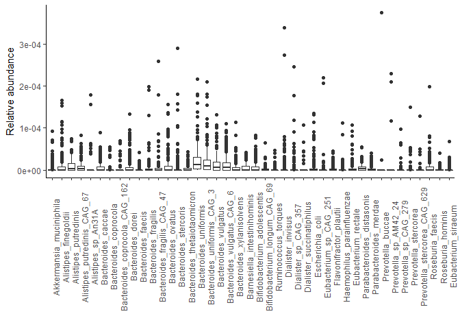
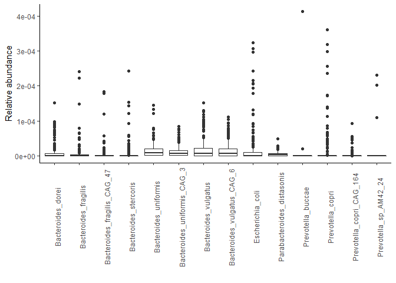
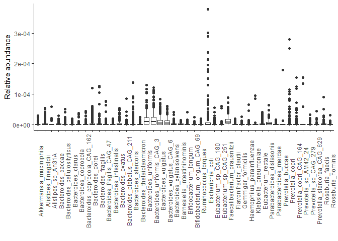

Evaluation of results with significant interaction
================

  - [Read in packages and data](#read-in-packages-and-data)
  - [Refit species associating differently with disease score across age
    group](#refit-species-associating-differently-with-disease-score-across-age-group)
  - [Refit the pathway and two ECs that associated differently with
    disease score at the following time point across age
    groups](#refit-the-pathway-and-two-ecs-that-associated-differently-with-disease-score-at-the-following-time-point-across-age-groups)
  - [Which microbiome species contributes to significant
    pathways?](#which-microbiome-species-contributes-to-significant-pathways)
  - [Which microbiome species contributes to significant
    ECs?](#which-microbiome-species-contributes-to-significant-ecs)

# Read in packages and data

Load in packages and path to folder:

``` r
library(tidyverse)
library(caret)
library(phyloseq)
library(NBZIMM)
library(vegan)
library(lme4)
library(lmerTest)
library(nlme)
path = "C:/Users/Tom/Documents/10. semester/V1/data/"
```

Read in results and dataframes:

``` r
#Phyloseq objects:
ps_count <- readRDS(paste0(path, "humann3_processed_output/Phyloseq/","ps_count_50mean_50var_zero.rds"))

#Meta data:
meta <- read.delim(paste0(path, "metadata/", "preped_metadata_filtered.txt"))

#Merge meta data with phyloseq object to remove those samples with >85% reads removed as human 
rownames(meta) <- meta$J_ID
ps_count <- phyloseq(otu_table(ps_count), tax_table(ps_count), sample_data(meta))

#Results:
clin_res <- read.delim(file = paste0(path, "Results/", "Clinical_interaction.txt"), sep=" ") %>% filter(p_adj<0.05)
clin_res$bugs
```

    ## [1] "s__Bacteroides_ovatus"     "s__Alistipes_indistinctus"
    ## [3] "s__Alistipes_shahii"       "s__Parabacteroides_merdae"
    ## [5] "s__Ruminococcus_torques"

``` r
clin_total <- clin_res$bugs
para_res <- read.delim(file = paste0(path, "Results/", "ParaClinical_interaction.txt"), sep=" ") %>% filter(p_adj<0.05)
para_res$bugs
```

    ## [1] "s__Bacteroides_dorei"       "s__Prevotella_copri"       
    ## [3] "s__Ruminococcus_bromii"     "s__Veillonella_parvula"    
    ## [5] "s__Akkermansia_muciniphila"

``` r
para_zero_res <-  read.delim(file = paste0(path, "Results/", "Paraclinical_interaction_zero.txt"), sep=" ") %>% filter(p_adj<0.05)
para_zero_res$bugs
```

    ## [1] "s__Bacteroides_dorei"   "s__Eubacterium_siraeum"

``` r
para_total <- unique(c(para_res$bugs, para_zero_res$bugs))
```

# Refit species associating differently with disease score across age group

Divide the dataset into children and adults, and test the association
without the covariates:

``` r
ps_count <- subset_samples(ps_count, !is.na(f_cal_current))
ps_count_children <- subset_samples(ps_count, age_gr==1)
ps_count_adults <- subset_samples(ps_count, age_gr==2)

pheno_c <-  as.data.frame(as.matrix(t(otu_table(ps_count_children)))) #No transformation
pheno_a <- as.data.frame(as.matrix(t(otu_table(ps_count_adults))))
clinical_c <- sample_data(ps_count_children)
clinical_a <- sample_data(ps_count_adults)

#Fit model with discrete numeric and binary disease score. Fit with interaction with age:
f_para_c <- mms(y=pheno_c[, para_total], fixed= ~log(f_cal_current+1) + offset(log(rdepth)), data=clinical_c, random = ~1|person_ID, method="zinb", correlation=corAR1(form=~time_point|person_ID), zi_fixed=~log(f_cal_current+1) + offset(log(rdepth)))
```

    ## Analyzing 6 responses:

    ## 
    ## Attaching package: 'MASS'

    ## The following object is masked from 'package:dplyr':
    ## 
    ##     select

    ## 1 2 3 4 5 6 
    ##  Computational time: 0.092 minutes

``` r
f_para_a <- mms(y=pheno_a[, para_total], fixed= ~log(f_cal_current+1) + offset(log(rdepth)), data=clinical_a, random = ~1|person_ID, method="zinb", correlation=corAR1(form=~time_point|person_ID), zi_fixed=~log(f_cal_current+1) + offset(log(rdepth)))
```

    ## Analyzing 6 responses: 
    ## 1 2 3 4 5 6 
    ##  Computational time: 0.078 minutes

``` r
#Find taxa with significant (p-adj<0.05) interaction.  
res_para_c=as.data.frame(get.fixed(f_para_c, part="dist", vr.name="log(f_cal_current + 1)"))
res_para_c$bugs <- rownames(res_para_c)
res_para_c
```

    ##                            Estimate Std.Error  pvalue    padj
    ## s__Bacteroides_dorei          0.049     0.036 1.8e-01 2.2e-01
    ## s__Prevotella_copri           0.100     0.021 8.0e-06 2.4e-05
    ## s__Ruminococcus_bromii       -0.067     0.034 4.8e-02 7.2e-02
    ## s__Veillonella_parvula       -0.267     0.127 3.8e-02 7.2e-02
    ## s__Akkermansia_muciniphila    0.624     0.094 3.3e-09 2.0e-08
    ## s__Eubacterium_siraeum        0.029     0.050 5.6e-01 5.6e-01
    ##                                                  bugs
    ## s__Bacteroides_dorei             s__Bacteroides_dorei
    ## s__Prevotella_copri               s__Prevotella_copri
    ## s__Ruminococcus_bromii         s__Ruminococcus_bromii
    ## s__Veillonella_parvula         s__Veillonella_parvula
    ## s__Akkermansia_muciniphila s__Akkermansia_muciniphila
    ## s__Eubacterium_siraeum         s__Eubacterium_siraeum

``` r
res_para_c_zero=as.data.frame(get.fixed(f_para_c, part="zero", vr.name="log(f_cal_current + 1)"))
res_para_c_zero$bugs <- rownames(res_para_c_zero)
res_para_c_zero
```

    ##                            Estimate Std.Error pvalue padj
    ## s__Bacteroides_dorei         -0.191     0.083   0.02 0.09
    ## s__Prevotella_copri           0.027     0.084   0.74 0.89
    ## s__Ruminococcus_bromii        0.003     0.078   0.97 0.97
    ## s__Veillonella_parvula       -0.184     0.085   0.03 0.09
    ## s__Akkermansia_muciniphila   -0.143     0.107   0.18 0.32
    ## s__Eubacterium_siraeum       -0.101     0.081   0.21 0.32
    ##                                                  bugs
    ## s__Bacteroides_dorei             s__Bacteroides_dorei
    ## s__Prevotella_copri               s__Prevotella_copri
    ## s__Ruminococcus_bromii         s__Ruminococcus_bromii
    ## s__Veillonella_parvula         s__Veillonella_parvula
    ## s__Akkermansia_muciniphila s__Akkermansia_muciniphila
    ## s__Eubacterium_siraeum         s__Eubacterium_siraeum

``` r
res_para_a=as.data.frame(get.fixed(f_para_a, part="dist", vr.name="log(f_cal_current + 1)"))
res_para_a$bugs <- rownames(res_para_a)
res_para_a
```

    ##                            Estimate Std.Error  pvalue    padj
    ## s__Bacteroides_dorei         -0.010     0.031 7.6e-01 7.6e-01
    ## s__Prevotella_copri           0.111     0.057 5.7e-02 1.1e-01
    ## s__Ruminococcus_bromii        0.102     0.044 2.4e-02 7.2e-02
    ## s__Veillonella_parvula        0.293     0.057 4.1e-06 2.5e-05
    ## s__Akkermansia_muciniphila   -0.019     0.055 7.2e-01 7.6e-01
    ## s__Eubacterium_siraeum        0.027     0.051 6.0e-01 7.6e-01
    ##                                                  bugs
    ## s__Bacteroides_dorei             s__Bacteroides_dorei
    ## s__Prevotella_copri               s__Prevotella_copri
    ## s__Ruminococcus_bromii         s__Ruminococcus_bromii
    ## s__Veillonella_parvula         s__Veillonella_parvula
    ## s__Akkermansia_muciniphila s__Akkermansia_muciniphila
    ## s__Eubacterium_siraeum         s__Eubacterium_siraeum

``` r
res_para_a_zero=as.data.frame(get.fixed(f_para_a, part="zero", vr.name="log(f_cal_current + 1)"))
res_para_a_zero$bugs <- rownames(res_para_a_zero)
res_para_a_zero
```

    ##                            Estimate Std.Error pvalue  padj
    ## s__Bacteroides_dorei          0.234     0.105 0.0260 0.078
    ## s__Prevotella_copri          -0.042     0.101 0.6800 0.820
    ## s__Ruminococcus_bromii        0.163     0.111 0.1400 0.280
    ## s__Veillonella_parvula       -0.013     0.095 0.8900 0.890
    ## s__Akkermansia_muciniphila    0.092     0.099 0.3600 0.540
    ## s__Eubacterium_siraeum        0.352     0.132 0.0075 0.045
    ##                                                  bugs
    ## s__Bacteroides_dorei             s__Bacteroides_dorei
    ## s__Prevotella_copri               s__Prevotella_copri
    ## s__Ruminococcus_bromii         s__Ruminococcus_bromii
    ## s__Veillonella_parvula         s__Veillonella_parvula
    ## s__Akkermansia_muciniphila s__Akkermansia_muciniphila
    ## s__Eubacterium_siraeum         s__Eubacterium_siraeum

Clinical disease score:

``` r
ps_count <- readRDS(paste0(path, "humann3_processed_output/Phyloseq/","ps_count_50mean_50var_zero.rds"))
ps_count <- subset_samples(ps_count, !is.na(score_num))
ps_count_children <- subset_samples(ps_count, age_gr==1)
ps_count_adults <- subset_samples(ps_count, age_gr==2)

pheno_c <-  as.data.frame(as.matrix(t(otu_table(ps_count_children)))) #No transformation
pheno_a <- as.data.frame(as.matrix(t(otu_table(ps_count_adults))))
clinical_c <- sample_data(ps_count_children)
clinical_a <- sample_data(ps_count_adults)

#Fit model with discrete numeric and binary disease score. Fit with interaction with age:
f_clin_c <- mms(y=pheno_c[, clin_total], fixed= ~score_num + offset(log(rdepth)), data=clinical_c, random = ~1|person_ID, method="zinb", correlation=corAR1(form=~time_point|person_ID), zi_fixed=~score_num + offset(log(rdepth)))
```

    ## Analyzing 5 responses: 
    ## 1 2 3 4 5 
    ##  Computational time: 0.066 minutes

``` r
f_clin_a <- mms(y=pheno_a[, clin_total], fixed= ~score_num + offset(log(rdepth)), data=clinical_a, random = ~1|person_ID, method="zinb", correlation=corAR1(form=~time_point|person_ID), zi_fixed=~score_num + offset(log(rdepth)))
```

    ## Analyzing 5 responses: 
    ## 1 2 3 4 5 
    ##  Computational time: 0.055 minutes

``` r
#Find taxa with significant (p-adj<0.05) interaction.  
res_clin_c=as.data.frame(get.fixed(f_clin_c, part="dist", vr.name="score_num"))
res_clin_c$bugs <- rownames(res_clin_c)
res_clin_c
```

    ##                           Estimate Std.Error  pvalue    padj
    ## s__Bacteroides_ovatus       -0.541     0.139 0.00019 0.00085
    ## s__Alistipes_indistinctus   -0.753     0.202 0.00034 0.00085
    ## s__Alistipes_shahii         -0.439     0.188 0.02200 0.03700
    ## s__Parabacteroides_merdae   -0.259     0.169 0.13000 0.13000
    ## s__Ruminococcus_torques      0.281     0.134 0.03900 0.04900
    ##                                                bugs
    ## s__Bacteroides_ovatus         s__Bacteroides_ovatus
    ## s__Alistipes_indistinctus s__Alistipes_indistinctus
    ## s__Alistipes_shahii             s__Alistipes_shahii
    ## s__Parabacteroides_merdae s__Parabacteroides_merdae
    ## s__Ruminococcus_torques     s__Ruminococcus_torques

``` r
res_clin_c_zero=as.data.frame(get.fixed(f_clin_c, part="zero", vr.name="score_num"))
res_clin_c_zero$bugs <- rownames(res_clin_c_zero)
res_clin_c_zero
```

    ##                           Estimate Std.Error pvalue padj
    ## s__Bacteroides_ovatus        0.109     0.300  0.720 0.72
    ## s__Alistipes_indistinctus    0.199     0.261  0.450 0.56
    ## s__Alistipes_shahii          0.474     0.253  0.061 0.30
    ## s__Parabacteroides_merdae    0.374     0.281  0.180 0.30
    ## s__Ruminococcus_torques      0.359     0.260  0.170 0.30
    ##                                                bugs
    ## s__Bacteroides_ovatus         s__Bacteroides_ovatus
    ## s__Alistipes_indistinctus s__Alistipes_indistinctus
    ## s__Alistipes_shahii             s__Alistipes_shahii
    ## s__Parabacteroides_merdae s__Parabacteroides_merdae
    ## s__Ruminococcus_torques     s__Ruminococcus_torques

``` r
res_clin_a=as.data.frame(get.fixed(f_clin_a, part="dist", vr.name="score_num"))
res_clin_a$bugs <- rownames(res_clin_a)
res_clin_a
```

    ##                           Estimate Std.Error pvalue padj
    ## s__Bacteroides_ovatus        0.209     0.180  0.250 0.60
    ## s__Alistipes_indistinctus   -0.125     0.188  0.510 0.64
    ## s__Alistipes_shahii          0.117     0.127  0.360 0.60
    ## s__Parabacteroides_merdae    0.024     0.145  0.870 0.87
    ## s__Ruminococcus_torques     -0.331     0.167  0.052 0.26
    ##                                                bugs
    ## s__Bacteroides_ovatus         s__Bacteroides_ovatus
    ## s__Alistipes_indistinctus s__Alistipes_indistinctus
    ## s__Alistipes_shahii             s__Alistipes_shahii
    ## s__Parabacteroides_merdae s__Parabacteroides_merdae
    ## s__Ruminococcus_torques     s__Ruminococcus_torques

``` r
res_clin_a_zero=as.data.frame(get.fixed(f_clin_a, part="zero", vr.name="score_num"))
res_clin_a_zero$bugs <- rownames(res_clin_a_zero)
res_clin_a_zero
```

    ##                           Estimate Std.Error pvalue padj
    ## s__Bacteroides_ovatus        0.617     0.339  0.069 0.17
    ## s__Alistipes_indistinctus    0.732     0.321  0.023 0.12
    ## s__Alistipes_shahii          0.123     0.338  0.710 0.71
    ## s__Parabacteroides_merdae    0.161     0.313  0.610 0.71
    ## s__Ruminococcus_torques     -0.186     0.401  0.640 0.71
    ##                                                bugs
    ## s__Bacteroides_ovatus         s__Bacteroides_ovatus
    ## s__Alistipes_indistinctus s__Alistipes_indistinctus
    ## s__Alistipes_shahii             s__Alistipes_shahii
    ## s__Parabacteroides_merdae s__Parabacteroides_merdae
    ## s__Ruminococcus_torques     s__Ruminococcus_torques

# Refit the pathway and two ECs that associated differently with disease score at the following time point across age groups

Implied causality: Test the one pathway and two ECs again, but divided
into children and adults: Load in data:

``` r
#Load in humann - OBS: first 3 columns: J_ID, UNMAPPED and UNINTEGRATED
pathway <- read.delim(file=paste0(path, "humann3_processed_output/processed_tables/", "pathway_relab_unstratified_mean50_var50.txt")) 
EC <- read.delim(file=paste0(path, "humann3_processed_output/processed_tables/", "EC_relab_unstratified_mean75_var75.txt"))
```

``` r
#Load in new metedata - with shifted disease score columns
meta <-  read_delim(file = paste0(path, "metadata/Tilpasset_metadata_timelag.txt"), col_names = T, delim= "\t")
meta <- as_tibble(meta)
```

``` r
#Calculate BMI
meta <- meta %>% mutate(BMI = weight/(height/100)^2)

#Make column with categorical disease scores
meta <- meta %>% mutate(score_p = ifelse(pucai_current < 10, "remission", ifelse(pucai_current <= 34, "mild", ifelse(pucai_current<=64, "moderate", ifelse(pucai_current>64, "severe", "NA")))))
meta <- meta %>% mutate(score_s = ifelse(sccai_current<3, "remission", ifelse(sccai_current<=5, "mild", ifelse(sccai_current<=11, "moderate", ifelse(sccai_current>11, "severe", "NA")))))
meta <- meta %>% mutate(score = ifelse(is.na(score_p), score_s, ifelse(is.na(score_s), score_p, "NA")))
meta$score <- factor(meta$score, levels = c("remission", "mild", "moderate", "severe", "NA"))
meta$score_binary <- as.factor(ifelse(meta$score == "remission", 0, 1))

meta <- meta %>% mutate(score_p = ifelse(pucai_future < 10, "remission", ifelse(pucai_future <= 34, "mild", ifelse(pucai_future<=64, "moderate", ifelse(pucai_future>64, "severe", "NA")))))
meta <- meta %>% mutate(score_s = ifelse(sccai_future<3, "remission", ifelse(sccai_future<=5, "mild", ifelse(sccai_future<=11, "moderate", ifelse(sccai_future>11, "severe", "NA")))))
meta <- meta %>% mutate(score_future = ifelse(is.na(score_p), score_s, ifelse(is.na(score_s), score_p, "NA")))
meta$score_future <- factor(meta$score_future, levels = c("remission", "mild", "moderate", "severe", "NA"))
meta$score_binary_future <- as.factor(ifelse(meta$score_future == "remission", 0, 1))

meta$binary_fcal <- as.factor(ifelse(meta$f_cal_current<250, 0, 1))
meta$binary_fcal_future <- as.factor(ifelse(meta$f_cal_future<250, 0, 1))

#Modify data: factorial
meta$sex <- as.factor(meta$sex)
meta$age_gr <- as.factor(meta$age_gr)
meta$person_ID <- as.factor(meta$person_ID)
meta$study_gr <- as.factor(meta$study_gr)
```

Test significant pathway:

``` r
#Make dataframe:
pathway_meta <- merge(pathway, meta, by.x = "J_ID", by.y="J_ID")
pathway_meta_sub <- pathway_meta %>% filter(!is.na(f_cal_future))
pathway_c <- pathway_meta_sub %>% filter(age_gr==1)
pathway_a <- pathway_meta_sub %>% filter(age_gr==2)


model_c <- glmer(formula=binary_fcal_future~binary_fcal+scale(ASPASN.PWY..superpathway.of.L.aspartate.and.L.asparagine.biosynthesis)+(1|person_ID), data=pathway_c, family = "binomial", na.action=na.omit)

summary(model_c)
```

    ## Generalized linear mixed model fit by maximum likelihood (Laplace
    ##   Approximation) [glmerMod]
    ##  Family: binomial  ( logit )
    ## Formula: 
    ## binary_fcal_future ~ binary_fcal + scale(ASPASN.PWY..superpathway.of.L.aspartate.and.L.asparagine.biosynthesis) +  
    ##     (1 | person_ID)
    ##    Data: pathway_c
    ## 
    ##      AIC      BIC   logLik deviance df.resid 
    ##    105.3    115.2    -48.7     97.3       82 
    ## 
    ## Scaled residuals: 
    ##     Min      1Q  Median      3Q     Max 
    ## -2.0011 -0.5526 -0.2419  0.5603  1.6918 
    ## 
    ## Random effects:
    ##  Groups    Name        Variance Std.Dev.
    ##  person_ID (Intercept) 1.559    1.249   
    ## Number of obs: 86, groups:  person_ID, 27
    ## 
    ## Fixed effects:
    ##                                                                              Estimate
    ## (Intercept)                                                                   -0.6941
    ## binary_fcal1                                                                   1.0860
    ## scale(ASPASN.PWY..superpathway.of.L.aspartate.and.L.asparagine.biosynthesis)  -0.7339
    ##                                                                              Std. Error
    ## (Intercept)                                                                      0.4847
    ## binary_fcal1                                                                     0.6029
    ## scale(ASPASN.PWY..superpathway.of.L.aspartate.and.L.asparagine.biosynthesis)     0.3668
    ##                                                                              z value
    ## (Intercept)                                                                   -1.432
    ## binary_fcal1                                                                   1.801
    ## scale(ASPASN.PWY..superpathway.of.L.aspartate.and.L.asparagine.biosynthesis)  -2.001
    ##                                                                              Pr(>|z|)
    ## (Intercept)                                                                    0.1521
    ## binary_fcal1                                                                   0.0716
    ## scale(ASPASN.PWY..superpathway.of.L.aspartate.and.L.asparagine.biosynthesis)   0.0454
    ##                                                                               
    ## (Intercept)                                                                   
    ## binary_fcal1                                                                 .
    ## scale(ASPASN.PWY..superpathway.of.L.aspartate.and.L.asparagine.biosynthesis) *
    ## ---
    ## Signif. codes:  0 '***' 0.001 '**' 0.01 '*' 0.05 '.' 0.1 ' ' 1
    ## 
    ## Correlation of Fixed Effects:
    ##             (Intr) bnry_1
    ## binary_fcl1 -0.626       
    ## s(ASPASN.PW -0.001  0.135

``` r
model_a <- glmer(formula=binary_fcal_future~binary_fcal+scale(ASPASN.PWY..superpathway.of.L.aspartate.and.L.asparagine.biosynthesis)+(1|person_ID), data=pathway_a, family = "binomial", na.action=na.omit)
```

    ## boundary (singular) fit: see ?isSingular

``` r
summary(model_a)
```

    ## Generalized linear mixed model fit by maximum likelihood (Laplace
    ##   Approximation) [glmerMod]
    ##  Family: binomial  ( logit )
    ## Formula: 
    ## binary_fcal_future ~ binary_fcal + scale(ASPASN.PWY..superpathway.of.L.aspartate.and.L.asparagine.biosynthesis) +  
    ##     (1 | person_ID)
    ##    Data: pathway_a
    ## 
    ##      AIC      BIC   logLik deviance df.resid 
    ##     67.5     75.6    -29.7     59.5       52 
    ## 
    ## Scaled residuals: 
    ##     Min      1Q  Median      3Q     Max 
    ## -2.1635 -0.5785 -0.4343  0.7485  2.5299 
    ## 
    ## Random effects:
    ##  Groups    Name        Variance Std.Dev.
    ##  person_ID (Intercept) 0        0       
    ## Number of obs: 56, groups:  person_ID, 18
    ## 
    ## Fixed effects:
    ##                                                                              Estimate
    ## (Intercept)                                                                   -1.2389
    ## binary_fcal1                                                                   0.4040
    ## scale(ASPASN.PWY..superpathway.of.L.aspartate.and.L.asparagine.biosynthesis)   0.7158
    ##                                                                              Std. Error
    ## (Intercept)                                                                      0.4372
    ## binary_fcal1                                                                     0.6401
    ## scale(ASPASN.PWY..superpathway.of.L.aspartate.and.L.asparagine.biosynthesis)     0.3431
    ##                                                                              z value
    ## (Intercept)                                                                   -2.833
    ## binary_fcal1                                                                   0.631
    ## scale(ASPASN.PWY..superpathway.of.L.aspartate.and.L.asparagine.biosynthesis)   2.086
    ##                                                                              Pr(>|z|)
    ## (Intercept)                                                                    0.0046
    ## binary_fcal1                                                                   0.5280
    ## scale(ASPASN.PWY..superpathway.of.L.aspartate.and.L.asparagine.biosynthesis)   0.0370
    ##                                                                                
    ## (Intercept)                                                                  **
    ## binary_fcal1                                                                   
    ## scale(ASPASN.PWY..superpathway.of.L.aspartate.and.L.asparagine.biosynthesis) * 
    ## ---
    ## Signif. codes:  0 '***' 0.001 '**' 0.01 '*' 0.05 '.' 0.1 ' ' 1
    ## 
    ## Correlation of Fixed Effects:
    ##             (Intr) bnry_1
    ## binary_fcl1 -0.674       
    ## s(ASPASN.PW -0.149  0.037
    ## optimizer (Nelder_Mead) convergence code: 0 (OK)
    ## boundary (singular) fit: see ?isSingular

Test significant EC:

``` r
#Make dataframe:
EC_meta <- merge(EC, meta, by.x = "J_ID", by.y="J_ID")
EC_meta_sub <- EC_meta %>% filter(!is.na(f_cal_future))
EC_c <- EC_meta_sub%>% filter(age_gr==1)
EC_a <- EC_meta_sub%>% filter(age_gr==2)

model1_c <- glmer(formula=binary_fcal_future~binary_fcal+scale(X3.5.99.6..Glucosamine.6.phosphate.deaminase)+(1|person_ID), data=EC_c, family = "binomial", na.action=na.omit)
summary(model1_c)
```

    ## Generalized linear mixed model fit by maximum likelihood (Laplace
    ##   Approximation) [glmerMod]
    ##  Family: binomial  ( logit )
    ## Formula: 
    ## binary_fcal_future ~ binary_fcal + scale(X3.5.99.6..Glucosamine.6.phosphate.deaminase) +  
    ##     (1 | person_ID)
    ##    Data: EC_c
    ## 
    ##      AIC      BIC   logLik deviance df.resid 
    ##    108.8    118.7    -50.4    100.8       82 
    ## 
    ## Scaled residuals: 
    ##     Min      1Q  Median      3Q     Max 
    ## -1.7339 -0.5338 -0.3628  0.5533  1.7492 
    ## 
    ## Random effects:
    ##  Groups    Name        Variance Std.Dev.
    ##  person_ID (Intercept) 1.502    1.225   
    ## Number of obs: 86, groups:  person_ID, 27
    ## 
    ## Fixed effects:
    ##                                                     Estimate Std. Error z value
    ## (Intercept)                                          -0.7712     0.4739  -1.628
    ## binary_fcal1                                          1.3390     0.5960   2.247
    ## scale(X3.5.99.6..Glucosamine.6.phosphate.deaminase)  -0.2996     0.3200  -0.936
    ##                                                     Pr(>|z|)  
    ## (Intercept)                                           0.1036  
    ## binary_fcal1                                          0.0247 *
    ## scale(X3.5.99.6..Glucosamine.6.phosphate.deaminase)   0.3491  
    ## ---
    ## Signif. codes:  0 '***' 0.001 '**' 0.01 '*' 0.05 '.' 0.1 ' ' 1
    ## 
    ## Correlation of Fixed Effects:
    ##             (Intr) bnry_1
    ## binary_fcl1 -0.634       
    ## s(X3.5.99.6  0.135 -0.150

``` r
model1_a <- glmer(formula=binary_fcal_future~binary_fcal+scale(X3.5.99.6..Glucosamine.6.phosphate.deaminase)+(1|person_ID), data=EC_a, family = "binomial", na.action=na.omit)
```

    ## boundary (singular) fit: see ?isSingular

``` r
summary(model1_a)
```

    ## Generalized linear mixed model fit by maximum likelihood (Laplace
    ##   Approximation) [glmerMod]
    ##  Family: binomial  ( logit )
    ## Formula: 
    ## binary_fcal_future ~ binary_fcal + scale(X3.5.99.6..Glucosamine.6.phosphate.deaminase) +  
    ##     (1 | person_ID)
    ##    Data: EC_a
    ## 
    ##      AIC      BIC   logLik deviance df.resid 
    ##     58.2     66.3    -25.1     50.2       52 
    ## 
    ## Scaled residuals: 
    ##     Min      1Q  Median      3Q     Max 
    ## -1.3108 -0.4713 -0.3427  0.3902  3.3216 
    ## 
    ## Random effects:
    ##  Groups    Name        Variance Std.Dev.
    ##  person_ID (Intercept) 0        0       
    ## Number of obs: 56, groups:  person_ID, 18
    ## 
    ## Fixed effects:
    ##                                                     Estimate Std. Error z value
    ## (Intercept)                                          -1.3966     0.4952  -2.820
    ## binary_fcal1                                          0.3356     0.7083   0.474
    ## scale(X3.5.99.6..Glucosamine.6.phosphate.deaminase)   1.2828     0.3935   3.260
    ##                                                     Pr(>|z|)   
    ## (Intercept)                                          0.00480 **
    ## binary_fcal1                                         0.63564   
    ## scale(X3.5.99.6..Glucosamine.6.phosphate.deaminase)  0.00111 **
    ## ---
    ## Signif. codes:  0 '***' 0.001 '**' 0.01 '*' 0.05 '.' 0.1 ' ' 1
    ## 
    ## Correlation of Fixed Effects:
    ##             (Intr) bnry_1
    ## binary_fcl1 -0.646       
    ## s(X3.5.99.6 -0.255 -0.029
    ## optimizer (Nelder_Mead) convergence code: 0 (OK)
    ## boundary (singular) fit: see ?isSingular

``` r
model2_c <- glmer(formula=binary_fcal_future~binary_fcal+scale(X4.2.1.47..GDP.mannose.4.6.dehydratase)+(1|person_ID), data=EC_c, family = "binomial", na.action=na.omit)
summary(model2_c)
```

    ## Generalized linear mixed model fit by maximum likelihood (Laplace
    ##   Approximation) [glmerMod]
    ##  Family: binomial  ( logit )
    ## Formula: 
    ## binary_fcal_future ~ binary_fcal + scale(X4.2.1.47..GDP.mannose.4.6.dehydratase) +  
    ##     (1 | person_ID)
    ##    Data: EC_c
    ## 
    ##      AIC      BIC   logLik deviance df.resid 
    ##    105.0    114.8    -48.5     97.0       82 
    ## 
    ## Scaled residuals: 
    ##     Min      1Q  Median      3Q     Max 
    ## -2.2245 -0.5905 -0.2169  0.5593  2.3574 
    ## 
    ## Random effects:
    ##  Groups    Name        Variance Std.Dev.
    ##  person_ID (Intercept) 1.395    1.181   
    ## Number of obs: 86, groups:  person_ID, 27
    ## 
    ## Fixed effects:
    ##                                               Estimate Std. Error z value
    ## (Intercept)                                    -0.8940     0.4812  -1.858
    ## binary_fcal1                                    1.4172     0.6016   2.356
    ## scale(X4.2.1.47..GDP.mannose.4.6.dehydratase)  -0.7507     0.3572  -2.102
    ##                                               Pr(>|z|)  
    ## (Intercept)                                     0.0632 .
    ## binary_fcal1                                    0.0185 *
    ## scale(X4.2.1.47..GDP.mannose.4.6.dehydratase)   0.0356 *
    ## ---
    ## Signif. codes:  0 '***' 0.001 '**' 0.01 '*' 0.05 '.' 0.1 ' ' 1
    ## 
    ## Correlation of Fixed Effects:
    ##             (Intr) bnry_1
    ## binary_fcl1 -0.648       
    ## s(X4.2.1.47  0.190 -0.125

``` r
model2_a <- glmer(formula=binary_fcal_future~binary_fcal+scale(X4.2.1.47..GDP.mannose.4.6.dehydratase)+(1|person_ID), data=EC_a, family = "binomial", na.action=na.omit)
```

    ## boundary (singular) fit: see ?isSingular

``` r
summary(model2_a)
```

    ## Generalized linear mixed model fit by maximum likelihood (Laplace
    ##   Approximation) [glmerMod]
    ##  Family: binomial  ( logit )
    ## Formula: 
    ## binary_fcal_future ~ binary_fcal + scale(X4.2.1.47..GDP.mannose.4.6.dehydratase) +  
    ##     (1 | person_ID)
    ##    Data: EC_a
    ## 
    ##      AIC      BIC   logLik deviance df.resid 
    ##     69.1     77.2    -30.5     61.1       52 
    ## 
    ## Scaled residuals: 
    ##     Min      1Q  Median      3Q     Max 
    ## -1.1854 -0.6221 -0.4184  1.0061  2.0904 
    ## 
    ## Random effects:
    ##  Groups    Name        Variance Std.Dev.
    ##  person_ID (Intercept) 0        0       
    ## Number of obs: 56, groups:  person_ID, 18
    ## 
    ## Fixed effects:
    ##                                               Estimate Std. Error z value
    ## (Intercept)                                    -1.2814     0.4377  -2.928
    ## binary_fcal1                                    0.4758     0.6329   0.752
    ## scale(X4.2.1.47..GDP.mannose.4.6.dehydratase)   0.5797     0.3168   1.830
    ##                                               Pr(>|z|)   
    ## (Intercept)                                    0.00342 **
    ## binary_fcal1                                   0.45224   
    ## scale(X4.2.1.47..GDP.mannose.4.6.dehydratase)  0.06729 . 
    ## ---
    ## Signif. codes:  0 '***' 0.001 '**' 0.01 '*' 0.05 '.' 0.1 ' ' 1
    ## 
    ## Correlation of Fixed Effects:
    ##             (Intr) bnry_1
    ## binary_fcl1 -0.676       
    ## s(X4.2.1.47 -0.251  0.113
    ## optimizer (Nelder_Mead) convergence code: 0 (OK)
    ## boundary (singular) fit: see ?isSingular

# Which microbiome species contributes to significant pathways?

The folate was significant. Which bacteria contributes to the folate
pathway? Also Superpathway of L aspartate and L asparagine biosynthesis
was signficant in implied

Read in data:

``` r
#Pathway relab
path_count <- read.table(paste0(path, "humann3_processed_output/Joined_tables/", "Joined_pathabundance_relab.tsv"), sep = "\t", header=T, row.names = 1)
```

    ## Warning in scan(file = file, what = what, sep = sep, quote = quote, dec = dec, :
    ## EOF within quoted string

    ## Warning in scan(file = file, what = what, sep = sep, quote = quote, dec = dec, :
    ## number of items read is not a multiple of the number of columns

``` r
#EC relab
EC_count <- read.table(paste0(path, "humann3_processed_output/Joined_tables/", "Joined_genefamilies_relab_EC_rename.tsv"), sep = "\t", header=T, row.names = 1)
```

    ## Warning in scan(file = file, what = what, sep = sep, quote = quote, dec = dec, :
    ## EOF within quoted string
    
    ## Warning in scan(file = file, what = what, sep = sep, quote = quote, dec = dec, :
    ## number of items read is not a multiple of the number of columns

``` r
#Change J-ID:
colnames(path_count) <- substr(colnames(path_count), start = 1, stop = 6)

#Pull out the pathway
path <- path_count[startsWith(rownames(path_count), "PWY-3841: folate transformations II|"),]
path <- as.data.frame(t(path))

colnames(path) <- substr(colnames(path), start = 37, stop=1000000)

path_sorted <- as.data.frame(t(path))
path_sorted$mean <- apply(path_sorted, 1, mean)
path_sorted$sd <- apply(path_sorted, 1, sd)
path_sorted <- path_sorted %>% dplyr::select(mean, sd) %>% arrange(-mean)
path_sorted[1:20,]
```

    ##                                                            mean           sd
    ## unclassified                                       1.313755e-04 1.005853e-04
    ## g__Bacteroides.s__Bacteroides_uniformis            2.381952e-05 3.357673e-05
    ## g__Bacteroides.s__Bacteroides_uniformis_CAG_3      2.048894e-05 3.177036e-05
    ## g__Bacteroides.s__Bacteroides_vulgatus             1.648633e-05 2.427990e-05
    ## g__Bacteroides.s__Bacteroides_vulgatus_CAG_6       1.375666e-05 2.011880e-05
    ## g__Alistipes.s__Alistipes_finegoldii               1.177869e-05 2.871299e-05
    ## g__Bacteroides.s__Bacteroides_ovatus               1.085429e-05 2.407172e-05
    ## g__Alistipes.s__Alistipes_putredinis               9.855412e-06 1.401297e-05
    ## g__Bacteroides.s__Bacteroides_dorei                9.619207e-06 2.194021e-05
    ## g__Dialister.s__Dialister_invisus                  8.649014e-06 3.311032e-05
    ## g__Bacteroides.s__Bacteroides_stercoris            7.983878e-06 3.063121e-05
    ## g__Escherichia.s__Escherichia_coli                 7.599872e-06 2.216460e-05
    ## g__Bacteroides.s__Bacteroides_fragilis_CAG_47      7.164175e-06 2.970509e-05
    ## g__Alistipes.s__Alistipes_putredinis_CAG_67        7.159694e-06 1.291954e-05
    ## g__Roseburia.s__Roseburia_faecis                   6.745118e-06 1.800238e-05
    ## g__Bifidobacterium.s__Bifidobacterium_adolescentis 6.607796e-06 1.401745e-05
    ## g__Bacteroides.s__Bacteroides_caccae               6.332005e-06 1.297407e-05
    ## g__Bacteroides.s__Bacteroides_fragilis             6.043717e-06 2.259044e-05
    ## g__Dialister.s__Dialister_sp_CAG_357               5.479464e-06 2.454543e-05
    ## g__Barnesiella.s__Barnesiella_intestinihominis     5.438221e-06 8.688540e-06

``` r
high_path <- path[ ,colMeans(path) >= quantile(colMeans(path), 0.75) ]
high_path_2 <- high_path %>% dplyr::select(-c("unclassified"))

colnames(high_path_2) <- gsub(".*s__","",colnames(high_path_2))

ggplot(stack(high_path_2))+
  geom_boxplot(aes(x=ind, y=values))+theme_classic()+xlab("")+ylab("Relative abundance")+theme(axis.text.x = element_text(angle = 90))
```

<!-- -->

``` r
#Superpathway
path <- path_count[startsWith(rownames(path_count), "ASPASN-PWY: superpathway of L-aspartate and L-asparagine biosynthesis|"),]
path <- as.data.frame(t(path))

colnames(path) <- substr(colnames(path), start = 71, stop=1000000)

path_sorted <- as.data.frame(t(path))
path_sorted$mean <- apply(path_sorted, 1, mean)
path_sorted$sd <- apply(path_sorted, 1, sd)
path_sorted <- path_sorted %>% dplyr::select(mean, sd) %>% arrange(-mean)
path_sorted[1:20,]
```

    ##                                                          mean           sd
    ## unclassified                                     4.014381e-05 3.216151e-05
    ## g__Escherichia.s__Escherichia_coli               1.890498e-05 5.286193e-05
    ## g__Bacteroides.s__Bacteroides_vulgatus           1.805521e-05 2.791056e-05
    ## g__Prevotella.s__Prevotella_copri                1.537647e-05 5.164748e-05
    ## g__Bacteroides.s__Bacteroides_vulgatus_CAG_6     1.537425e-05 2.198794e-05
    ## g__Bacteroides.s__Bacteroides_uniformis          1.490697e-05 2.289635e-05
    ## g__Bacteroides.s__Bacteroides_uniformis_CAG_3    1.192837e-05 1.631872e-05
    ## g__Bacteroides.s__Bacteroides_dorei              1.041642e-05 2.360757e-05
    ## g__Bacteroides.s__Bacteroides_stercoris          7.011189e-06 2.633863e-05
    ## g__Bacteroides.s__Bacteroides_fragilis           6.571770e-06 2.648422e-05
    ## g__Bacteroides.s__Bacteroides_fragilis_CAG_47    4.965399e-06 2.049908e-05
    ## g__Parabacteroides.s__Parabacteroides_distasonis 4.499858e-06 6.977150e-06
    ## g__Prevotella.s__Prevotella_sp_AM42_24           2.589292e-06 2.233979e-05
    ## g__Prevotella.s__Prevotella_copri_CAG_164        2.561280e-06 1.015505e-05
    ## g__Prevotella.s__Prevotella_buccae               2.077497e-06 2.856472e-05
    ## g__Flavonifractor.s__Flavonifractor_plautii      2.053393e-06 5.270803e-06
    ## g__Haemophilus.s__Haemophilus_parainfluenzae     2.000467e-06 1.077731e-05
    ## g__Bacteroides.s__Bacteroides_cellulosilyticus   1.784927e-06 5.300987e-06
    ## g__Klebsiella.s__Klebsiella_pneumoniae           1.611714e-06 1.556069e-05
    ## g__Bacteroides.s__Bacteroides_clarus             7.450458e-07 3.201423e-06

``` r
high_path <- path[ ,colMeans(path) >= quantile(colMeans(path), 0.75) ]
high_path_2 <- high_path %>% dplyr::select(-c("unclassified"))

colnames(high_path_2) <- gsub(".*s__","",colnames(high_path_2))

ggplot(stack(high_path_2))+
  geom_boxplot(aes(x=ind, y=values))+theme_classic()+xlab("")+ylab("Relative abundance")+theme(axis.text.x = element_text(angle = 90))
```

<!-- -->

# Which microbiome species contributes to significant ECs?

Two ECs were signficant. Which bacteria?

``` r
#Change J-ID:
colnames(EC_count) <- substr(colnames(EC_count), start = 1, stop = 6)

#Pull out the EC
EC <- EC_count[startsWith(rownames(EC_count), "3.5.99.6: Glucosamine-6-phosphate deaminase|"),]
EC <- as.data.frame(t(EC))

colnames(EC) <- substr(colnames(EC), start = 45, stop=1000000)

EC_sorted <- as.data.frame(t(EC))
EC_sorted$mean <- apply(EC_sorted, 1, mean)
EC_sorted$sd <- apply(EC_sorted, 1, sd)
EC_sorted <- EC_sorted %>% dplyr::select(mean, sd) %>% arrange(-mean)
EC_sorted[1:20,]
```

    ##                                                                mean
    ## unclassified                                           3.098692e-05
    ## g__Escherichia.s__Escherichia_coli                     1.759114e-05
    ## g__Bacteroides.s__Bacteroides_uniformis_CAG_3          1.739397e-05
    ## g__Bacteroides.s__Bacteroides_uniformis                1.569989e-05
    ## g__Faecalibacterium.s__Faecalibacterium_prausnitzii    1.279897e-05
    ## g__Bacteroides.s__Bacteroides_vulgatus                 1.062413e-05
    ## g__Bacteroides.s__Bacteroides_vulgatus_CAG_6           9.308282e-06
    ## g__Prevotella.s__Prevotella_copri                      8.742865e-06
    ## g__Bacteroides.s__Bacteroides_dorei                    6.844463e-06
    ## g__Parabacteroides.s__Parabacteroides_distasonis       5.291495e-06
    ## g__Bacteroides.s__Bacteroides_stercoris                4.403536e-06
    ## g__Bacteroides.s__Bacteroides_ovatus                   4.184500e-06
    ## g__Bacteroides.s__Bacteroides_fragilis                 4.176408e-06
    ## g__Prevotella.s__Prevotella_copri_CAG_164              4.163216e-06
    ## g__Alistipes.s__Alistipes_finegoldii                   3.811598e-06
    ## g__Roseburia.s__Roseburia_faecis                       2.835128e-06
    ## g__Bacteroides.s__Bacteroides_fragilis_CAG_47          2.579228e-06
    ## g__Lachnospiraceae_unclassified.s__Eubacterium_rectale 2.232677e-06
    ## g__Bacteroides.s__Bacteroides_cellulosilyticus         2.213131e-06
    ## g__Eubacterium.s__Eubacterium_sp_CAG_180               2.092513e-06
    ##                                                                  sd
    ## unclassified                                           2.430492e-05
    ## g__Escherichia.s__Escherichia_coli                     5.342277e-05
    ## g__Bacteroides.s__Bacteroides_uniformis_CAG_3          2.324028e-05
    ## g__Bacteroides.s__Bacteroides_uniformis                2.090709e-05
    ## g__Faecalibacterium.s__Faecalibacterium_prausnitzii    1.428959e-05
    ## g__Bacteroides.s__Bacteroides_vulgatus                 1.536906e-05
    ## g__Bacteroides.s__Bacteroides_vulgatus_CAG_6           1.282666e-05
    ## g__Prevotella.s__Prevotella_copri                      3.179564e-05
    ## g__Bacteroides.s__Bacteroides_dorei                    1.610043e-05
    ## g__Parabacteroides.s__Parabacteroides_distasonis       8.005962e-06
    ## g__Bacteroides.s__Bacteroides_stercoris                1.582654e-05
    ## g__Bacteroides.s__Bacteroides_ovatus                   8.677445e-06
    ## g__Bacteroides.s__Bacteroides_fragilis                 1.550896e-05
    ## g__Prevotella.s__Prevotella_copri_CAG_164              1.791666e-05
    ## g__Alistipes.s__Alistipes_finegoldii                   9.415063e-06
    ## g__Roseburia.s__Roseburia_faecis                       8.463826e-06
    ## g__Bacteroides.s__Bacteroides_fragilis_CAG_47          9.374605e-06
    ## g__Lachnospiraceae_unclassified.s__Eubacterium_rectale 5.708952e-06
    ## g__Bacteroides.s__Bacteroides_cellulosilyticus         6.225157e-06
    ## g__Eubacterium.s__Eubacterium_sp_CAG_180               6.215719e-06

``` r
high_EC <- EC[ ,colMeans(EC) >= quantile(colMeans(EC), 0.75) ]
high_EC_2 <- high_EC %>% dplyr::select(-c("unclassified"))

colnames(high_EC_2) <- gsub(".*s__","",colnames(high_EC_2))

ggplot(stack(high_EC_2))+
  geom_boxplot(aes(x=ind, y=values))+theme_classic()+xlab("")+ylab("Relative abundance")+theme(axis.text.x = element_text(angle = 90))
```

<!-- -->

``` r
#Look at GDP-mannose
EC <- EC_count[startsWith(rownames(EC_count), "4.2.1.47: GDP-mannose 4,6-dehydratase|"),]
EC <- as.data.frame(t(EC))

colnames(EC) <- substr(colnames(EC), start = 39, stop=1000000)

EC_sorted <- as.data.frame(t(EC))
EC_sorted$mean <- apply(EC_sorted, 1, mean)
EC_sorted$sd <- apply(EC_sorted, 1, sd)
EC_sorted <- EC_sorted %>% dplyr::select(mean, sd) %>% arrange(-mean)
EC_sorted[1:20,]
```

    ##                                                          mean           sd
    ## unclassified                                     2.019954e-05 3.077189e-05
    ## g__Bacteroides.s__Bacteroides_uniformis          1.571015e-05 2.313294e-05
    ## g__Bacteroides.s__Bacteroides_vulgatus_CAG_6     1.378041e-05 1.753540e-05
    ## g__Bacteroides.s__Bacteroides_vulgatus           1.052322e-05 1.615497e-05
    ## g__Prevotella.s__Prevotella_copri                6.220276e-06 1.904886e-05
    ## g__Bacteroides.s__Bacteroides_ovatus             5.050909e-06 1.255571e-05
    ## g__Bacteroides.s__Bacteroides_dorei              4.808159e-06 1.341923e-05
    ## g__Bacteroides.s__Bacteroides_uniformis_CAG_3    4.418151e-06 5.936460e-06
    ## g__Prevotella.s__Prevotella_copri_CAG_164        3.869642e-06 1.127032e-05
    ## g__Escherichia.s__Escherichia_coli               3.438977e-06 1.096277e-05
    ## g__Bacteroides.s__Bacteroides_stercoris          3.328376e-06 1.211246e-05
    ## g__Parabacteroides.s__Parabacteroides_distasonis 3.045175e-06 5.208400e-06
    ## g__Bacteroides.s__Bacteroides_caccae             2.540451e-06 5.013258e-06
    ## g__Bacteroides.s__Bacteroides_fragilis           2.369697e-06 8.416694e-06
    ## g__Bacteroides.s__Bacteroides_xylanisolvens      1.781634e-06 4.319353e-06
    ## g__Akkermansia.s__Akkermansia_muciniphila        1.684224e-06 5.871270e-06
    ## g__Bacteroides.s__Bacteroides_fragilis_CAG_47    1.665867e-06 6.025996e-06
    ## g__Parabacteroides.s__Parabacteroides_merdae     1.566654e-06 3.522286e-06
    ## g__Barnesiella.s__Barnesiella_intestinihominis   1.488584e-06 2.417778e-06
    ## g__Bacteroides.s__Bacteroides_thetaiotaomicron   1.434764e-06 3.345499e-06

``` r
high_EC <- EC[ ,colMeans(EC) >= quantile(colMeans(EC), 0.75) ]
high_EC_2 <- high_EC %>% dplyr::select(-c("unclassified"))

colnames(high_EC_2) <- gsub(".*s__","",colnames(high_EC_2))

ggplot(stack(high_EC_2))+
  geom_boxplot(aes(x=ind, y=values))+theme_classic()+xlab("")+ylab("Relative abundance")+theme(axis.text.x = element_text(angle = 90))
```

<!-- -->
