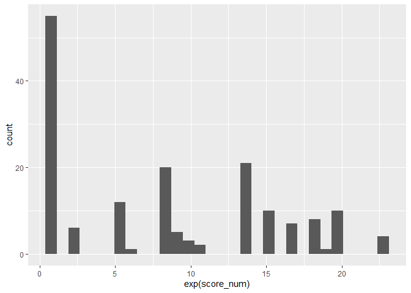
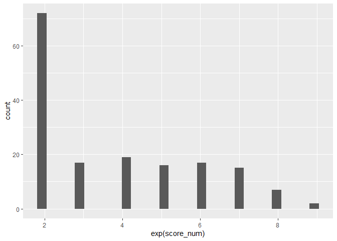
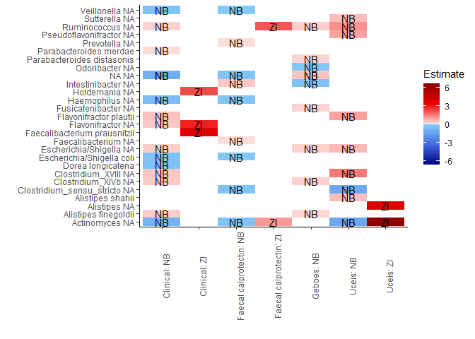
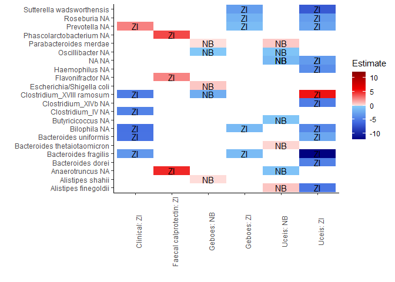
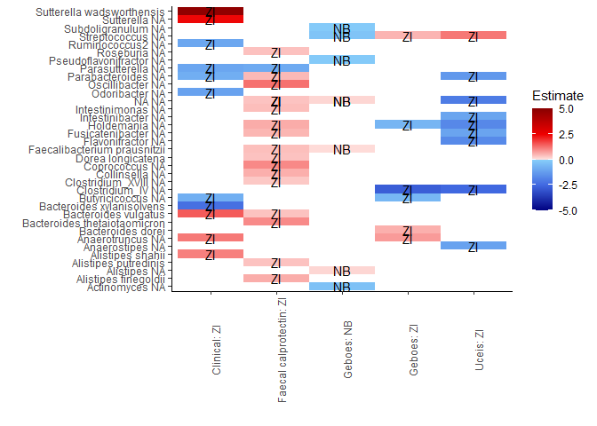
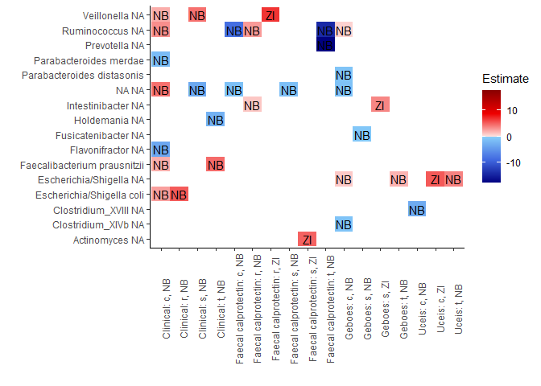
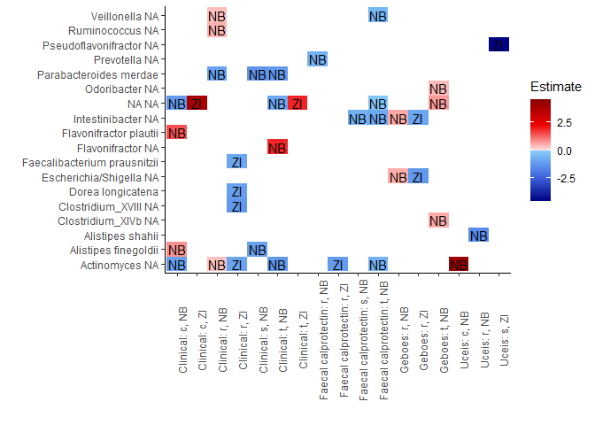

Single taxa analyses of biopsies
================

  - [Read in packages and data](#read-in-packages-and-data)
  - [Analyses of clinical disease
    score](#analyses-of-clinical-disease-score)
  - [Analyses of faecal calprotectin](#analyses-of-faecal-calprotectin)
  - [Analyses of geboes score](#analyses-of-geboes-score)
  - [Analyses of uceis score](#analyses-of-uceis-score)
  - [Gather all the results and compare using
    heatmaps](#gather-all-the-results-and-compare-using-heatmaps)

# Read in packages and data

``` r
set.seed(999)

## PATHS
main.dir = "C:/Users/Tom/Documents/10. semester/UC - biopsier/"


#read libraries and data
library(knitr)
library(egg)
library(tidyverse)
library(ggplot2)
library(data.table)
library(reshape)
library(gridExtra)
library(grid)
library(readr)
library(phyloseq)
library(kableExtra)
library(vegan)
library(dplyr)
library(ggpubr)
library(ggthemes)
library(plyr)
library(dplyr)
library(scales)
library("ggpubr")
library(reshape)
library(reshape)
library(gridBase)
library(gridGraphics)
library(Rtsne)
library(ggrepel)
library(RColorBrewer)
library(psych)
library(compositions)
library(microbiome)
library(rstatix)
library(NBZIMM)
library(pscl)


## documenttation of colour scheme and variables 
gg_color <- function(n) {

    hues = seq(15, 375, length = n + 1)
  
    hcl(h = hues, l = 65, c = 100)[1:n]

}
mc_pal <- brewer.pal(6, "Greys")
pal <- brewer.pal(8,"Paired")[-c(5,6)]
pal_all <- pal[c(2,1,4,3,6,5)]
mc_pal_all <- mc_pal[c(2,1,4,3,6,5)] # black/white
mc_pal_diet <- mc_pal_all[-c(2,4,6)] # black/white
pal_diet <- pal_all[-c(2,4,6)]
```

Data:

``` r
# this code block will 
# - load the ps objetcs for analysis.

    setwd(paste0( file.path( main.dir, "data/16S/data_processed")))
    
    ps_relab = readRDS("DATA.ps.raw_SampleFilter.relab_meta.modified.rds")
 
    ps_count = readRDS( "DATA.ps.raw_SampleFilter_meta.modified.rds")

    ps = readRDS("DATA.ps.raw.rds")
    
    meta_df = meta_df = sample_data(ps_relab)

#Summarising data:
dim(meta_df) 
```

    ## [1] 169  67

``` r
adults <- as_tibble(meta_df) %>% filter(age_gr == "Adult")
```

    ## Warning in class(x) <- c(setdiff(subclass, tibble_class), tibble_class): Setting
    ## class(x) to multiple strings ("tbl_df", "tbl", ...); result will no longer be an
    ## S4 object

``` r
children <- as_tibble(meta_df) %>% filter(age_gr == "Paediatric")
```

    ## Warning in class(x) <- c(setdiff(subclass, tibble_class), tibble_class): Setting
    ## class(x) to multiple strings ("tbl_df", "tbl", ...); result will no longer be an
    ## S4 object

``` r
a_merge <-  adults %>% dplyr::group_by(cpr) %>% dplyr::summarise(number=n())
summary(a_merge)
```

    ##      cpr                number     
    ##  Length:24          Min.   :1.000  
    ##  Class :character   1st Qu.:1.750  
    ##  Mode  :character   Median :2.000  
    ##                     Mean   :2.417  
    ##                     3rd Qu.:4.000  
    ##                     Max.   :4.000

``` r
c_merge <-  children %>% dplyr::group_by(cpr) %>% dplyr::summarise(number=n())
summary(c_merge)
```

    ##      cpr                number     
    ##  Length:29          Min.   :2.000  
    ##  Class :character   1st Qu.:4.000  
    ##  Mode  :character   Median :4.000  
    ##                     Mean   :3.828  
    ##                     3rd Qu.:4.000  
    ##                     Max.   :4.000

``` r
# this code block will 

# VARIABLES OF INTEREST
# - Medication previsou
# - Study_group
# - Bmi, gender

# check variables
# BMI
summary(sample_data(ps_relab)$bmi) # 2 NA
```

    ##    Min. 1st Qu.  Median    Mean 3rd Qu.    Max.    NA's 
    ##   11.73   17.66   20.60   20.75   22.98   36.17       2

``` r
hist(na.omit( meta_df$bmi), breaks = 30)
```

<!-- -->

``` r
# SEX
summary(sample_data(ps_relab)$sex) # 
```

    ## Female   Male 
    ##    100     69

``` r
# study group
sample_data(ps_relab)$study_gr = as.factor(sample_data(ps_relab)$study_gr)

levels(sample_data(ps_relab)$study_gr)[levels(sample_data(ps_relab)$study_gr)=="1"] ="G1"
levels(sample_data(ps_relab)$study_gr)[levels(sample_data(ps_relab)$study_gr)=="2"] ="G2"
levels(sample_data(ps_relab)$study_gr)
```

    ## [1] "G1" "G2"

``` r
levels(sample_data(ps_count)$study_gr)[levels(sample_data(ps_count)$study_gr)=="1"] ="G1"
levels(sample_data(ps_count)$study_gr)[levels(sample_data(ps_count)$study_gr)=="2"] ="G2"
levels(sample_data(ps_count)$study_gr)
```

    ## character(0)

``` r
table(sample_data(ps_relab)$study_gr)
```

    ## 
    ## G1 G2 
    ## 87 82

``` r
table(sample_data(ps_count)$study_gr)
```

    ## 
    ##  1  2 
    ## 87 82

``` r
# # medication
sample_data(ps_count)$bio_0=as.factor(sample_data(ps_count)$bio_0)
sample_data(ps_relab)$bio_0=as.factor(sample_data(ps_relab)$bio_0)
table(sample_data(ps_relab)$bio_0, sample_data(ps_relab)$GI.location) 
```

    ##    
    ##      c  r  s  t
    ##   0 29 43 40 29
    ##   1  7  7  7  7

``` r
 #  c  r  s  t
#  0 29 43 40 29
#  1  7  7  7  7
sample_data(ps_count)$previous_local=as.factor(sample_data(ps_count)$previous_local)
sample_data(ps_relab)$previous_local=as.factor(sample_data(ps_relab)$previous_local)
table(sample_data(ps_relab)$previous_local, sample_data(ps_relab)$GI.location) 
```

    ##    
    ##      c  r  s  t
    ##   0 29 37 35 28
    ##   1  7 13 12  8

``` r
#     c  r  s  t
#  0 29 37 35 28
#  1  7 13 12  8
  
sample_data(ps_count)$previous_pred=as.factor(sample_data(ps_count)$previous_pred)
sample_data(ps_relab)$previous_pred=as.factor(sample_data(ps_relab)$previous_pred)
table(sample_data(ps_relab)$previous_pred, sample_data(ps_relab)$GI.location)
```

    ##    
    ##      c  r  s  t
    ##   0 31 44 42 31
    ##   1  5  6  5  5

``` r
#    c  r  s  t
#  0 31 44 42 31
#  1  5  6  5  5
sample_data(ps_count)$previous_asa=as.factor(sample_data(ps_count)$previous_asa)
sample_data(ps_relab)$previous_asa=as.factor(sample_data(ps_relab)$previous_asa)
table(sample_data(ps_relab)$previous_asa, sample_data(ps_relab)$GI.location)
```

    ##    
    ##      c  r  s  t
    ##   0 21 28 29 21
    ##   1 15 22 18 15

``` r
#      c  r  s  t
#  0 21 28 29 21
#  1 15 22 18 15
sample_data(ps_count)$previous_aza=as.factor(sample_data(ps_count)$previous_aza)
sample_data(ps_relab)$previous_aza=as.factor(sample_data(ps_relab)$previous_aza)
table(sample_data(ps_relab)$previous_aza, sample_data(ps_relab)$GI.location)
```

    ##    
    ##      c  r  s  t
    ##   0 28 39 37 29
    ##   1  8 11 10  7

``` r
#      c  r  s  t
#  0 28 39 37 29
#  1  8 11 10  7


## format disease scores
# uceis
sample_data(ps_relab)$uceis <- ordered(sample_data(ps_relab)$uceis, levels = 0:7,
                              labels = c("0", "1", "2", "3","4", "5", "6", "7")) # conversion
sample_data(ps_count)$uceis <- ordered(sample_data(ps_count)$uceis, levels = 0:7,
                              labels = c("0", "1", "2", "3","4", "5", "6", "7")) # conversion

# pucai_sccai *
table(sample_data(ps_count)$pucai_sccai)
```

    ## 
    ##      mild  moderate remission    severe 
    ##        82        36        37        14

``` r
sample_data(ps_relab)$pucai_sccai <- ordered(sample_data(ps_relab)$pucai_sccai, levels = c('remission','mild',  'moderate',     'severe'),
                              labels = c('remission', 'mild',  'moderate',    'severe')) # conversion
sample_data(ps_count)$pucai_sccai <- ordered(sample_data(ps_count)$pucai_sccai, levels = c('remission','mild',  'moderate',     'severe'),
                              labels = c('remission', 'mild',  'moderate',    'severe')) # conversion
sample_data(ps_count)$pucai_sccai
```

    ##   [1] moderate  mild      mild      mild      moderate  moderate  moderate 
    ##   [8] remission remission remission mild      mild      mild      remission
    ##  [15] moderate  mild      mild      mild      moderate  moderate  moderate 
    ##  [22] mild      mild      mild      mild      remission remission remission
    ##  [29] mild      mild      mild      mild      mild      mild      mild     
    ##  [36] moderate  mild      mild      remission mild      moderate  mild     
    ##  [43] mild      remission mild      moderate  mild      mild      mild     
    ##  [50] remission moderate  mild      mild      severe    moderate  remission
    ##  [57] moderate  severe    mild      moderate  mild      remission remission
    ##  [64] mild      moderate  severe    mild      mild      moderate  moderate 
    ##  [71] remission remission moderate  severe    mild      mild      moderate 
    ##  [78] moderate  remission remission mild      remission severe    mild     
    ##  [85] mild      moderate  mild      remission mild      remission remission
    ##  [92] moderate  mild      mild      moderate  remission mild      mild     
    ##  [99] mild      mild      severe    severe    severe    severe    mild     
    ## [106] mild      mild      remission remission remission remission mild     
    ## [113] mild      mild      mild      mild      moderate  severe    mild     
    ## [120] severe    severe    severe    mild      mild      mild      mild     
    ## [127] moderate  remission mild      remission remission remission remission
    ## [134] moderate  moderate  remission mild      mild      mild      moderate 
    ## [141] mild      mild      moderate  moderate  mild      mild      mild     
    ## [148] mild      mild      remission remission remission remission remission
    ## [155] mild      mild      mild      mild      mild      moderate  mild     
    ## [162] mild      moderate  moderate  moderate  moderate  severe    mild     
    ## [169] mild     
    ## Levels: remission < mild < moderate < severe

``` r
# geb.g
table(sample_data(ps_relab)$geb.g )
```

    ## 
    ##   disease remission 
    ##       106        61

``` r
table(sample_data(ps_count)$geb.g )
```

    ## 
    ##   disease remission 
    ##       106        61

``` r
# f_cal_0.g
table(sample_data(ps_relab)$f_cal_0.g)
```

    ## 
    ##   disease remission 
    ##       101        49

``` r
table(sample_data(ps_count)$f_cal_0.g)
```

    ## 
    ##   disease remission 
    ##       101        49

``` r
## AGLOMERATE
## USING SPECIES LEVEL PROFILES

ps_relab_spe  = tax_glom(ps_relab, taxrank='Species', NArm=FALSE)
ps_relab_spe
```

    ## phyloseq-class experiment-level object
    ## otu_table()   OTU Table:         [ 840 taxa and 169 samples ]
    ## sample_data() Sample Data:       [ 169 samples by 67 sample variables ]
    ## tax_table()   Taxonomy Table:    [ 840 taxa by 7 taxonomic ranks ]
    ## refseq()      DNAStringSet:      [ 840 reference sequences ]

``` r
ps_count_spe  = tax_glom(ps_count, taxrank='Species', NArm=FALSE)
ps_count_spe
```

    ## phyloseq-class experiment-level object
    ## otu_table()   OTU Table:         [ 840 taxa and 169 samples ]
    ## sample_data() Sample Data:       [ 169 samples by 67 sample variables ]
    ## tax_table()   Taxonomy Table:    [ 840 taxa by 7 taxonomic ranks ]
    ## refseq()      DNAStringSet:      [ 840 reference sequences ]

``` r
# seperate data for location
    
    
    # relab
    sample_data(ps_relab_spe)$GI.location
```

    ##   [1] "s" "r" "r" "s" "c" "t" "s" "s" "c" "t" "c" "t" "s" "s" "r" "r" "c" "s"
    ##  [19] "r" "s" "c" "s" "c" "c" "t" "c" "s" "t" "c" "t" "s" "r" "c" "t" "s" "t"
    ##  [37] "r" "c" "t" "s" "c" "s" "c" "c" "r" "s" "s" "t" "s" "c" "t" "r" "s" "s"
    ##  [55] "c" "t" "c" "c" "r" "t" "r" "s" "r" "r" "r" "t" "c" "r" "s" "s" "t" "s"
    ##  [73] "s" "s" "t" "t" "r" "r" "c" "r" "s" "r" "r" "t" "s" "c" "s" "r" "c" "t"
    ##  [91] "s" "r" "c" "c" "s" "s" "t" "s" "t" "c" "r" "s" "t" "c" "r" "s" "r" "c"
    ## [109] "t" "s" "r" "c" "t" "s" "r" "c" "r" "t" "s" "r" "s" "c" "t" "c" "s" "t"
    ## [127] "r" "r" "r" "c" "t" "r" "s" "t" "c" "r" "r" "s" "t" "t" "r" "t" "r" "s"
    ## [145] "r" "c" "r" "s" "r" "r" "s" "t" "c" "r" "s" "r" "c" "r" "s" "r" "r" "t"
    ## [163] "r" "t" "r" "r" "r" "t" "s"

``` r
    ps_relab_spe_r = subset_samples(ps_relab_spe, GI.location == 'r' &  is.na(bmi) != TRUE )
    ps_relab_spe_s = subset_samples(ps_relab_spe, GI.location == 's' &  is.na(bmi) != TRUE )
    
    ps_relab_spe_t = subset_samples(ps_relab_spe, GI.location == 't' &  is.na(bmi) != TRUE )
    ps_relab_spe_c = subset_samples(ps_relab_spe, GI.location == 'c' &  is.na(bmi) != TRUE )

    # counts
    ps_count_spe_r = subset_samples(ps_count_spe, GI.location == 'r' &  is.na(bmi) != TRUE )
    ps_count_spe_s = subset_samples(ps_count_spe, GI.location == 's' &  is.na(bmi) != TRUE)
    
    ps_count_spe_t = subset_samples(ps_count_spe, GI.location == 't' &  is.na(bmi) != TRUE)
    ps_count_spe_c = subset_samples(ps_count_spe, GI.location == 'c'&  is.na(bmi) != TRUE)
```

# Analyses of clinical disease score

First: Analysis of clinical disease score: pucai\_sccai

``` r
# COUNT data prepare
names(sample_data(ps_count_spe))
```

    ##  [1] "ID"                     "SeqRun"                 "NewID"                 
    ##  [4] "GI.location"            "geb"                    "uceis"                 
    ##  [7] "mayo"                   "study_id"               "study_id_new_meta"     
    ## [10] "study_gr"               "date_enrolled"          "dob"                   
    ## [13] "age"                    "age_gr"                 "cpr"                   
    ## [16] "sex"                    "height"                 "weight"                
    ## [19] "bmi"                    "pheno"                  "alb"                   
    ## [22] "eim_during_study_skin"  "eim_during_study_liver" "eim_during_study_joint"
    ## [25] "eim_during_study_eye"   "previous_asa"           "previous_pred"         
    ## [28] "previous_aza"           "previous_mtx"           "previous_ciclo"        
    ## [31] "previous_local"         "previous_ab"            "diag_eim_skin"         
    ## [34] "diag_eim_liver"         "diag_eim_joint"         "diag_eim_eye"          
    ## [37] "biopsy_microbiom_c"     "biopsy_microbiom_t"     "biopsy_microbiom_s"    
    ## [40] "biopsy_microbiom_r"     "visit"                  "pucai_0"               
    ## [43] "sccai_0"                "crp_0"                  "alb_0"                 
    ## [46] "hgb_0"                  "sr_0"                   "ferri_0"               
    ## [49] "wbc_0"                  "neu_0"                  "trc_0"                 
    ## [52] "alat_0"                 "inr_0"                  "f_cal_0"               
    ## [55] "asa_0"                  "pred_0"                 "aza_0"                 
    ## [58] "mtx_0"                  "l_asa_0"                "l_pred_0"              
    ## [61] "bio_0"                  "complete_study"         "complete_s_why"        
    ## [64] "date_last_visit"        "pucai_sccai"            "geb.g"                 
    ## [67] "f_cal_0.g"

``` r
sample_data(ps_count_spe)$N <- rowSums(otu_table(ps_count_spe)) # read counts, important to do this BEFORE filtering taxa.

sample_data(ps_count_spe)$bmi
```

    ##   [1]       NA 14.81481 22.58271 16.78719 17.67454 17.67454 17.67454 15.76506
    ##   [9] 15.76506 15.76506 16.44737 16.44737 16.44737 27.75510 17.64706 11.72828
    ##  [17] 11.72828 11.72828 23.63403 23.63403 23.63403 21.53491 21.53491 19.92773
    ##  [25] 19.92773 15.06574 15.06574 15.06574 19.91837 19.91837 19.91837 19.91837
    ##  [33] 36.16820 36.16820 18.61150 20.60378 21.22449 22.10029 14.03809 17.32829
    ##  [41] 20.60378 21.22449 21.00073 14.03809 17.32829 23.43750 16.41959 21.00073
    ##  [49] 22.10029 22.13168 23.43750 16.41959 21.00073 14.35524 21.87242 22.13168
    ##  [57] 23.43750 22.67995 21.00073 21.87242 22.10029 22.13168 22.13168 24.54346
    ##  [65] 20.60378 22.67995 21.22449 18.36547 21.87242 24.30249 20.43817 20.43817
    ##  [73] 20.60378 22.67995 21.22449 18.36547 21.87242 24.30249 20.43817 20.43817
    ##  [81] 21.35780 26.44898 22.67995 16.41959 18.36547 22.98190 21.00767 14.03809
    ##  [89] 17.32829 26.44898 26.44898 24.72058 16.41959 18.36547 22.98190 14.03809
    ##  [97] 17.32829 18.82711 18.82711 18.82711 27.63980 27.63980 27.63980 27.63980
    ## [105] 23.38435 23.38435 18.82711 20.72484 20.72484 20.72484 20.72484 19.95936
    ## [113] 19.95936 19.95936 19.95936 16.78719       NA 14.35524 24.54346 29.29687
    ## [121] 29.29687 14.35524 14.81481 14.81481 22.58271 16.78719 17.67454 15.76506
    ## [129] 16.44737 17.82698 17.82698 17.82698 17.82698 17.64706 17.64706 27.75510
    ## [137] 28.70370 28.70370 11.72828 23.63403 21.53491 21.53491 34.08661 34.08661
    ## [145] 16.78719 25.65437 25.65437 19.92773 19.92773 18.28989 18.28989 18.28989
    ## [153] 18.28989 15.06574 36.16820 36.16820 18.61150 25.82645 25.82645 21.79931
    ## [161] 18.61150 18.61150 22.98190 22.98190 23.43750 24.07547 14.35524 22.10029
    ## [169] 21.20311

``` r
# "pucai_sccai"  "geb.g" "uceis" "f_cal_0.g"
sample_data(ps_count_spe)$pucai_sccai
```

    ##   [1] moderate  mild      mild      mild      moderate  moderate  moderate 
    ##   [8] remission remission remission mild      mild      mild      remission
    ##  [15] moderate  mild      mild      mild      moderate  moderate  moderate 
    ##  [22] mild      mild      mild      mild      remission remission remission
    ##  [29] mild      mild      mild      mild      mild      mild      mild     
    ##  [36] moderate  mild      mild      remission mild      moderate  mild     
    ##  [43] mild      remission mild      moderate  mild      mild      mild     
    ##  [50] remission moderate  mild      mild      severe    moderate  remission
    ##  [57] moderate  severe    mild      moderate  mild      remission remission
    ##  [64] mild      moderate  severe    mild      mild      moderate  moderate 
    ##  [71] remission remission moderate  severe    mild      mild      moderate 
    ##  [78] moderate  remission remission mild      remission severe    mild     
    ##  [85] mild      moderate  mild      remission mild      remission remission
    ##  [92] moderate  mild      mild      moderate  remission mild      mild     
    ##  [99] mild      mild      severe    severe    severe    severe    mild     
    ## [106] mild      mild      remission remission remission remission mild     
    ## [113] mild      mild      mild      mild      moderate  severe    mild     
    ## [120] severe    severe    severe    mild      mild      mild      mild     
    ## [127] moderate  remission mild      remission remission remission remission
    ## [134] moderate  moderate  remission mild      mild      mild      moderate 
    ## [141] mild      mild      moderate  moderate  mild      mild      mild     
    ## [148] mild      mild      remission remission remission remission remission
    ## [155] mild      mild      mild      mild      mild      moderate  mild     
    ## [162] mild      moderate  moderate  moderate  moderate  severe    mild     
    ## [169] mild     
    ## Levels: remission < mild < moderate < severe

``` r
sample_data(ps_count_spe)$geb.g  # has 2 NA
```

    ##   [1] "disease"   "disease"   "disease"   "remission" "disease"   "disease"  
    ##   [7] "disease"   "disease"   "disease"   "disease"   "disease"   "disease"  
    ##  [13] "disease"   "disease"   "disease"   "disease"   "disease"   "disease"  
    ##  [19] "disease"   "disease"   "disease"   "remission" "disease"   "disease"  
    ##  [25] "disease"   "remission" "remission" "remission" "remission" "disease"  
    ##  [31] "disease"   "remission" "disease"   "remission" "disease"   "remission"
    ##  [37] "disease"   "remission" "remission" "disease"   "disease"   "disease"  
    ##  [43] "remission" "remission" "disease"   "disease"   "disease"   "disease"  
    ##  [49] "remission" "remission" "disease"   "disease"   "disease"   "disease"  
    ##  [55] "disease"   "remission" "remission" "disease"   "remission" "disease"  
    ##  [61] "disease"   "disease"   "disease"   "remission" "disease"   "disease"  
    ##  [67] "disease"   "disease"   "disease"   "disease"   "remission" "remission"
    ##  [73] "disease"   "disease"   "disease"   "remission" "disease"   "disease"  
    ##  [79] "remission" "remission" "remission" "disease"   "disease"   "disease"  
    ##  [85] "remission" "disease"   "remission" "remission" "remission" NA         
    ##  [91] "disease"   "disease"   "disease"   "remission" "disease"   "remission"
    ##  [97] "remission" "remission" "remission" "remission" "disease"   "disease"  
    ## [103] "remission" "remission" "remission" "disease"   "remission" NA         
    ## [109] "disease"   "disease"   "disease"   "remission" "remission" "disease"  
    ## [115] "disease"   "remission" "disease"   "disease"   "disease"   "disease"  
    ## [121] "remission" "disease"   "remission" "disease"   "remission" "disease"  
    ## [127] "disease"   "disease"   "disease"   "remission" "disease"   "disease"  
    ## [133] "disease"   "disease"   "remission" "remission" "disease"   "remission"
    ## [139] "disease"   "remission" "disease"   "remission" "disease"   "disease"  
    ## [145] "disease"   "remission" "remission" "disease"   "disease"   "remission"
    ## [151] "disease"   "remission" "remission" "disease"   "remission" "disease"  
    ## [157] "disease"   "disease"   "remission" "disease"   "disease"   "disease"  
    ## [163] "disease"   "disease"   "disease"   "remission" "disease"   "remission"
    ## [169] "remission"

``` r
sample_data(ps_count_spe)$uceis # has 2 NA
```

    ##   [1] 5    1    5    0    2    4    4    3    0    4    2    2    2    3    5   
    ##  [16] 3    3    4    3    5    0    0    0    2    2    0    0    0    1    4   
    ##  [31] 1    0    0    0    1    0    3    0    2    4    0    5    0    2    6   
    ##  [46] 4    3    1    0    0    0    1    0    6    0    0    0    2    1    0   
    ##  [61] 4    1    1    0    4    4    5    4    0    4    0    2    2    <NA> 5   
    ##  [76] 0    5    6    0    1    0    0    6    3    0    0    0    0    0    <NA>
    ##  [91] 0    5    3    0    7    2    4    0    0    0    1    2    0    0    1   
    ## [106] 5    2    1    0    1    1    0    0    0    3    0    0    6    2    5   
    ## [121] 0    6    0    0    0    0    5    0    3    0    0    0    2    5    5   
    ## [136] 2    2    0    4    0    3    0    5    5    3    0    0    3    3    0   
    ## [151] 0    0    0    0    0    2    1    4    0    4    1    0    7    3    4   
    ## [166] 0    6    0    0   
    ## Levels: 0 < 1 < 2 < 3 < 4 < 5 < 6 < 7

``` r
sample_data(ps_count_spe)$f_cal_0.g
```

    ##   [1] "disease"   "remission" "disease"   "disease"   "disease"   "disease"  
    ##   [7] "disease"   "disease"   "disease"   "disease"   "remission" "remission"
    ##  [13] "remission" NA          "disease"   "disease"   "disease"   "disease"  
    ##  [19] "disease"   "disease"   "disease"   "remission" "remission" "remission"
    ##  [25] "remission" "remission" "remission" "remission" NA          NA         
    ##  [31] NA          NA          "disease"   "disease"   "remission" "disease"  
    ##  [37] "disease"   "disease"   "remission" "disease"   "disease"   "disease"  
    ##  [43] "remission" "remission" "disease"   "disease"   "disease"   "remission"
    ##  [49] "disease"   "disease"   "disease"   "disease"   "remission" "disease"  
    ##  [55] "disease"   "disease"   "disease"   "disease"   "remission" "disease"  
    ##  [61] "disease"   "disease"   "disease"   NA          "disease"   "disease"  
    ##  [67] "disease"   "disease"   "disease"   "disease"   "remission" "remission"
    ##  [73] "disease"   "disease"   "disease"   "disease"   "disease"   "disease"  
    ##  [79] "remission" "remission" "disease"   NA          "disease"   "disease"  
    ##  [85] "disease"   "remission" "disease"   "remission" "disease"   NA         
    ##  [91] NA          "disease"   "disease"   "disease"   "remission" "remission"
    ##  [97] "disease"   "disease"   "disease"   "disease"   "remission" "remission"
    ## [103] "remission" "remission" NA          NA          "disease"   "disease"  
    ## [109] "disease"   "disease"   "disease"   "disease"   "disease"   "disease"  
    ## [115] "disease"   "disease"   "disease"   "disease"   NA          "disease"  
    ## [121] "disease"   "disease"   "remission" "remission" "disease"   "disease"  
    ## [127] "disease"   "disease"   "remission" NA          NA          NA         
    ## [133] NA          "disease"   "disease"   NA          "disease"   "disease"  
    ## [139] "disease"   "disease"   "remission" "remission" "disease"   "disease"  
    ## [145] "disease"   "remission" "remission" "remission" "remission" "remission"
    ## [151] "remission" "remission" "remission" "remission" "disease"   "disease"  
    ## [157] "remission" NA          NA          "disease"   "remission" "remission"
    ## [163] "remission" "remission" "disease"   "disease"   "disease"   "disease"  
    ## [169] "disease"

``` r
sum(is.na(sample_data(ps_count_spe)$f_cal_0.g)) # 19
```

    ## [1] 19

``` r
##*****************
## pucai_sccai
##*****************
ps_count_pucai_sccai = subset_samples(ps_count_spe, is.na(bmi) != TRUE & is.na(pucai_sccai) != TRUE )

ps_count_pucai_sccai = filter_taxa(ps_count_pucai_sccai, function(x) sum(x > 3) > (0.3*length(x)), TRUE)
# 66 taxa
#ps_count_pucai_sccai = filter_taxa(ps_count_pucai_sccai, function(x) mean(x) > 10, TRUE)

sample_data(ps_count_pucai_sccai)$GI.location <- ordered(sample_data(ps_count_pucai_sccai)$GI.location, levels = c('r','s',  't',     'c'),
                              labels = c('r','s',  't',     'c')) # conversion

#sample_data(ps_count_pucai_sccai)$GI.location <- factor(sample_data(ps_count_pucai_sccai)$GI.location, levels = c('r','s',  't',     'c')) # not ordinal in model


 N <- sample_data(ps_count_pucai_sccai)$N
 person_ID <- as.factor(sample_data(ps_count_pucai_sccai)$study_id_new_meta)
 sex <-  as.factor(sample_data(ps_count_pucai_sccai)$sex)
 asa <-  as.factor(sample_data(ps_count_pucai_sccai)$previous_asa)
 bmi <-  as.numeric(sample_data(ps_count_pucai_sccai)$bmi)
 age_gr <-  as.factor(sample_data(ps_count_pucai_sccai)$age_gr)
 GI <-  sample_data(ps_count_pucai_sccai)$GI.location
 
 score_num <- as.integer( sample_data(ps_count_pucai_sccai)$pucai_sccai)
 
 ggplot()+
    geom_histogram(aes(x=exp(score_num)))
```

    ## `stat_bin()` using `bins = 30`. Pick better value with `binwidth`.

<!-- -->

``` r
 # by default, R fits a series of polynomial functions to the levels of the variable if they are ordered. 
 # The first is linear (.L), the second is quadratic (.Q), the third (if you had enough levels) would be cubic, etc. 
# https://www.theanalysisfactor.com/regression-modelshow-do-you-know-you-need-a-polynomial/
 
clinical = cbind.data.frame(N, bmi, person_ID, sex, asa, score_num, age_gr, GI)
pheno <-  as.data.frame(as.matrix((otu_table(ps_count_pucai_sccai)))) #No transformation

f1 <- mms(y=pheno, fixed= ~bmi+sex+asa+age_gr+score_num*GI + offset(log(N)), data=clinical, random = ~1|person_ID, method="zinb", correlation=corLin(form=~GI|person_ID), zi_fixed=~bmi+sex+asa+age_gr+score_num*GI + offset(log(N)))
```

    ## 
    ## Attaching package: 'nlme'

    ## The following object is masked from 'package:dplyr':
    ## 
    ##     collapse

    ## Analyzing 66 responses:

    ## 
    ## Attaching package: 'MASS'

    ## The following object is masked from 'package:rstatix':
    ## 
    ##     select

    ## The following object is masked from 'package:dplyr':
    ## 
    ##     select

    ## 
    ## y1 error: nlminb problem, convergence error code = 1
    ##   message = iteration limit reached without convergence (10)
    ## y2 error: nlminb problem, convergence error code = 1
    ##   message = iteration limit reached without convergence (10)3 4 
    ## y5 error: nlminb problem, convergence error code = 1
    ##   message = iteration limit reached without convergence (10)6 7 8 9 10 
    ## y11 error: nlminb problem, convergence error code = 1
    ##   message = iteration limit reached without convergence (10)12 13 14 15 16 
    ## y17 error: invalid response: no zero18 19 20 21 22 23 24 25 26 27 28 29 30 31 32 33 34 35 36 37 38 39 40 41 42 43 44 45 46 47 48 49 50 51 52 53 54 55 56 57 58 59 60 61 62 63 64 65 66 
    ##  Computational time: 3.805 minutes

``` r
f1_failed <- c(1,2,5,11,17)

res_inter <- as.data.frame(get.fixed(f1, part="dist", vr.name="score_num:GI.L"))
res_inter$p_adj <- p.adjust(res_inter$pvalue, method="BH")
res_inter$part <- "NB"
res_inter$bug <- row.names(res_inter)
res_inter_sig <- res_inter %>% filter(p_adj < 0.05)

res_inter_zero <- as.data.frame(get.fixed(f1, part="zero", vr.name="score_num:GI.L"))
res_inter_zero$p_adj <- p.adjust(res_inter_zero$pvalue, method="BH")
res_inter_zero$part <- "ZI"
res_inter_zero$bug <- row.names(res_inter_zero)
res_inter_sig_zero <- res_inter_zero %>% filter(p_adj < 0.05)

res1 <- rbind(res_inter_sig, res_inter_sig_zero)
res1
```

    ##         Estimate Std.Error  pvalue    padj        p_adj part     bug
    ## ASV9       0.347     0.100 7.1e-04 4.8e-03 4.812222e-03   NB    ASV9
    ## ASV17     -0.317     0.105 3.2e-03 1.6e-02 1.626667e-02   NB   ASV17
    ## ASV36      0.153     0.051 3.6e-03 1.7e-02 1.689231e-02   NB   ASV36
    ## ASV89      0.375     0.083 1.6e-05 2.3e-04 2.318000e-04   NB   ASV89
    ## ASV105     0.410     0.161 1.2e-02 4.9e-02 4.880000e-02   NB  ASV105
    ## ASV111     0.287     0.099 4.6e-03 2.0e-02 2.004286e-02   NB  ASV111
    ## ASV117    -0.403     0.120 1.1e-03 6.7e-03 6.710000e-03   NB  ASV117
    ## ASV132     0.519     0.103 1.7e-06 3.5e-05 3.456667e-05   NB  ASV132
    ## ASV147    -0.593     0.139 4.2e-05 4.3e-04 4.270000e-04   NB  ASV147
    ## ASV215     0.356     0.080 1.9e-05 2.3e-04 2.318000e-04   NB  ASV215
    ## ASV260    -0.630     0.192 1.4e-03 7.8e-03 7.763636e-03   NB  ASV260
    ## ASV279    -0.351     0.069 1.4e-06 3.5e-05 3.456667e-05   NB  ASV279
    ## ASV567     0.416     0.110 2.5e-04 1.9e-03 1.906250e-03   NB  ASV567
    ## ASV751    -0.863     0.223 1.9e-04 1.7e-03 1.655714e-03   NB  ASV751
    ## ASV1454   -1.033     0.171 2.1e-08 1.3e-06 1.281000e-06   NB ASV1454
    ## ASV73     -3.892     1.265 2.1e-03 4.9e-02 4.880000e-02   ZI   ASV73
    ## ASV5671   -2.845     0.619 4.3e-06 2.6e-04 2.623000e-04   ZI  ASV567
    ## ASV959    -2.210     0.727 2.4e-03 4.9e-02 4.880000e-02   ZI  ASV959

``` r
write.table(res1, file=paste0(main.dir, "results/Clinical_results_score_GI.txt"), col.names=T, row.names=F, sep="\t")
res1_all <- rbind(res_inter, res_inter_zero)
write.table(res1_all, file=paste0(main.dir, "results/Clinical_results_score_GI_all.txt"), col.names=T, row.names=F, sep="\t")

#These are those where GI location really matter to the phenotype. 
#Split up by GI and refit the model, testing also age*disease score
#There is then only one data point pr. patient! No need to include random intercept and correlation structure

#Colon
ps_count_c <- subset_samples(ps_count_pucai_sccai, GI.location=="c")

 N <- sample_data(ps_count_c)$N
 person_ID <- as.factor(sample_data(ps_count_c)$study_id_new_meta)
 sex <-  as.factor(sample_data(ps_count_c)$sex)
 asa <-  as.factor(sample_data(ps_count_c)$previous_asa)
 bmi <-  as.numeric(sample_data(ps_count_c)$bmi)
 age_gr <-  as.factor(sample_data(ps_count_c)$age_gr)
 score_num <- as.integer( sample_data(ps_count_c)$pucai_sccai)
 
 clinical = cbind.data.frame(N, bmi, person_ID, sex, asa, score_num, age_gr)
 pheno <-  as.data.frame(as.matrix((otu_table(ps_count_c)))) #No transformation

f1_GI_c_count <- data.frame()
f1_GI_c_zero <- data.frame()
for (i in unique(res1$bug)){
   form <- as.formula(paste0("pheno$", i, " ~ bmi+sex+asa+age_gr*score_num + offset(log(N)) | bmi+sex+asa+age_gr*score_num + offset(log(N))"))
   m1 <- zeroinfl(form,  data = clinical, dist = "negbin")
   test <- summary(m1)
   c1 <- as.data.frame(t(test$coefficients$count[7,]))
   z1 <- as.data.frame(t(test$coefficients$zero[7,]))
   c1$bug <- i
   z1$bug <- i
   f1_GI_c_count <- rbind(f1_GI_c_count, c1)
   f1_GI_c_zero <- rbind(f1_GI_c_zero, z1)
}
```

    ## Warning: glm.fit: fitted probabilities numerically 0 or 1 occurred

    ## Warning in value[[3L]](cond): system is computationally singular: reciprocal
    ## condition number = 3.26379e-20FALSE

``` r
f1_GI_c_count
```

    ##       Estimate   Std. Error      z value     Pr(>|z|)     bug
    ## 1    0.7455306    1.2286773  0.606774913 5.440003e-01    ASV9
    ## 2    2.6963540    1.3559539  1.988529241 4.675319e-02   ASV17
    ## 3   -1.6348242    0.6418582 -2.547017869 1.086479e-02   ASV36
    ## 4    0.5551753    2.2578878  0.245882616 8.057731e-01   ASV89
    ## 5    1.2301413    0.8241554  1.492608366 1.355397e-01  ASV105
    ## 6    3.3509906    0.5609015  5.974293838 2.310890e-09  ASV111
    ## 7   -1.2323035           NA           NA           NA  ASV117
    ## 8    1.1857317    2.5926256  0.457347835 6.474211e-01  ASV132
    ## 9    1.4293988    1.9750780  0.723717657 4.692391e-01  ASV147
    ## 10  -0.4608385    0.5951345 -0.774343480 4.387277e-01  ASV215
    ## 11   4.4796970    1.4553559  3.078076520 2.083414e-03  ASV260
    ## 12   2.1527200    0.7424011  2.899672225 3.735531e-03  ASV279
    ## 13  -3.3759562    1.3584096 -2.485227036 1.294688e-02  ASV567
    ## 14   0.9630295    1.7907450  0.537781451 5.907279e-01  ASV751
    ## 15   1.1576275    1.9238491  0.601724693 5.473574e-01 ASV1454
    ## 16   2.1522595    1.0014768  2.149085738 3.162760e-02   ASV73
    ## 17 -17.6990780 2181.3313289 -0.008113888 9.935261e-01  ASV959

``` r
f1_GI_c_zero
```

    ##       Estimate  Std. Error      z value  Pr(>|z|)     bug
    ## 1    1.4435732    1.559300  0.925782991 0.3545588    ASV9
    ## 2    2.6199882    1.993352  1.314362930 0.1887241   ASV17
    ## 3   20.3716151 5215.499817  0.003905976 0.9968835   ASV36
    ## 4  156.9486108 1839.801910  0.085307342 0.9320171   ASV89
    ## 5   10.1731207   77.336921  0.131542872 0.8953459  ASV105
    ## 6    1.5516458    2.711271  0.572294629 0.5671224  ASV111
    ## 7  -22.4322920          NA           NA        NA  ASV117
    ## 8   18.9524993 1195.076194  0.015858821 0.9873470  ASV132
    ## 9   18.2318401   46.021287  0.396161026 0.6919862  ASV147
    ## 10  -1.0160647    1.897567 -0.535456474 0.5923342  ASV215
    ## 11   3.2713142    4.967277  0.658572980 0.5101700  ASV260
    ## 12  24.6335218  394.358577  0.062464780 0.9501927  ASV279
    ## 13  -0.6647767    2.206958 -0.301218504 0.7632479  ASV567
    ## 14 -42.9721953  252.678622 -0.170066605 0.8649578  ASV751
    ## 15  -8.4498086  119.945963 -0.070446795 0.9438380 ASV1454
    ## 16  -0.6178262    1.638570 -0.377051994 0.7061350   ASV73
    ## 17 -12.4469411  439.542378 -0.028317954 0.9774086  ASV959

``` r
f1_GI_c_count$location <- "c"
f1_GI_c_count$part <- "NB"
f1_GI_c_zero$location <- "c"
f1_GI_c_zero$part <- "ZI"

#Rectum
ps_count_r <- subset_samples(ps_count_pucai_sccai, GI.location=="r")

 N <- sample_data(ps_count_r)$N
 person_ID <- as.factor(sample_data(ps_count_r)$study_id_new_meta)
 sex <-  as.factor(sample_data(ps_count_r)$sex)
 asa <-  as.factor(sample_data(ps_count_r)$previous_asa)
 bmi <-  as.numeric(sample_data(ps_count_r)$bmi)
 age_gr <-  as.factor(sample_data(ps_count_r)$age_gr)
 score_num <- as.integer( sample_data(ps_count_r)$pucai_sccai)
 
 clinical = cbind.data.frame(N, bmi, person_ID, sex, asa, score_num, age_gr)
 pheno <-  as.data.frame(as.matrix((otu_table(ps_count_r)))) #No transformation

f1_GI_r_count <- data.frame()
f1_GI_r_zero <- data.frame()
for (i in unique(res1$bug)){
   form <- as.formula(paste0("pheno$", i, " ~ bmi+sex+asa+age_gr*score_num + offset(log(N)) | bmi+sex+asa+age_gr*score_num + offset(log(N))"))
   m1 <- zeroinfl(form,  data = clinical, dist = "negbin")
   test <- summary(m1)
   c1 <- as.data.frame(t(test$coefficients$count[7,]))
   z1 <- as.data.frame(t(test$coefficients$zero[7,]))
   c1$bug <- i
   z1$bug <- i
   f1_GI_r_count <- rbind(f1_GI_r_count, c1)
   f1_GI_r_zero <- rbind(f1_GI_r_zero, z1)
}

f1_GI_r_count
```

    ##       Estimate Std. Error     z value    Pr(>|z|)     bug
    ## 1  -0.23085425  1.0574446 -0.21831333 0.827184990    ASV9
    ## 2   5.32645721  1.7505294  3.04276940 0.002344119   ASV17
    ## 3   0.23040358  0.3365686  0.68456654 0.493617489   ASV36
    ## 4  -1.04378378  0.5579076 -1.87089021 0.061360301   ASV89
    ## 5   0.62233916  0.8158310  0.76282853 0.445565663  ASV105
    ## 6  -0.73329300  0.4093492 -1.79136284 0.073235088  ASV111
    ## 7   0.38828708  0.3349376  1.15928196 0.246341272  ASV117
    ## 8  -0.48102833  0.6919716 -0.69515617 0.486957437  ASV132
    ## 9  -0.06668053  0.7650539 -0.08715794 0.930545967  ASV147
    ## 10 -0.74781340  0.4189026 -1.78517268 0.074233312  ASV215
    ## 11  1.81433995  1.0835243  1.67448017 0.094036268  ASV260
    ## 12  0.19295209  0.4264670  0.45244322 0.650949720  ASV279
    ## 13 -0.21324765  0.8484729 -0.25133113 0.801558111  ASV567
    ## 14 -0.89323376  0.7269564 -1.22873083 0.219172743  ASV751
    ## 15 -0.83656621  0.5217222 -1.60347047 0.108830824 ASV1454
    ## 16  0.63443472  0.5538883  1.14542007 0.252035187   ASV73
    ## 17  1.15785741  0.8252897  1.40297079 0.160625550  ASV959

``` r
f1_GI_r_zero
```

    ##       Estimate  Std. Error     z value   Pr(>|z|)     bug
    ## 1    1.3315299   1.1283583  1.18005949 0.23797655    ASV9
    ## 2  162.7055463 128.6915687  1.26430619 0.20612015   ASV17
    ## 3    1.6907785   0.9162347  1.84535527 0.06498588   ASV36
    ## 4    7.0318217  62.5506396  0.11241806 0.91049193   ASV89
    ## 5   11.2551318 102.6766925  0.10961720 0.91271297  ASV105
    ## 6    0.4555188   0.8900974  0.51176287 0.60881698  ASV111
    ## 7   -0.8165266   0.8667681 -0.94203582 0.34617430  ASV117
    ## 8    1.7436748   0.9528767  1.82990596 0.06726400  ASV132
    ## 9    0.7005136   1.1973737  0.58504172 0.55851966  ASV147
    ## 10   0.7179746   0.9142844  0.78528587 0.43228598  ASV215
    ## 11   1.2381708   1.4991804  0.82589847 0.40886169  ASV260
    ## 12   0.6949460   0.9385748  0.74042693 0.45904099  ASV279
    ## 13   0.7933898   1.1426914  0.69431675 0.48748359  ASV567
    ## 14   0.7533696   1.0987438  0.68566453 0.49292468  ASV751
    ## 15 -35.7622765 589.4711133 -0.06066841 0.95162329 ASV1454
    ## 16  -0.9206669   0.8977124 -1.02556994 0.30509434   ASV73
    ## 17  14.8966597  17.0339124  0.87452955 0.38182994  ASV959

``` r
f1_GI_r_count$location <- "r"
f1_GI_r_count$part <- "NB"
f1_GI_r_zero$location <- "r"
f1_GI_r_zero$part <- "ZI"

#Sigmoideum
ps_count_s <- subset_samples(ps_count_pucai_sccai, GI.location=="s")

 N <- sample_data(ps_count_s)$N
 person_ID <- as.factor(sample_data(ps_count_s)$study_id_new_meta)
 sex <-  as.factor(sample_data(ps_count_s)$sex)
 asa <-  as.factor(sample_data(ps_count_s)$previous_asa)
 bmi <-  as.numeric(sample_data(ps_count_s)$bmi)
 age_gr <-  as.factor(sample_data(ps_count_s)$age_gr)
 score_num <- as.integer( sample_data(ps_count_s)$pucai_sccai)
 
 clinical = cbind.data.frame(N, bmi, person_ID, sex, asa, score_num, age_gr)
 pheno <-  as.data.frame(as.matrix((otu_table(ps_count_s)))) #No transformation

f1_GI_s_count <- data.frame()
f1_GI_s_zero <- data.frame()
for (i in unique(res1$bug)){
   form <- as.formula(paste0("pheno$", i, " ~ bmi+sex+asa+age_gr*score_num + offset(log(N)) | bmi+sex+asa+age_gr*score_num + offset(log(N))"))
   m1 <- zeroinfl(form,  data = clinical, dist = "negbin")
   test <- summary(m1)
   c1 <- as.data.frame(t(test$coefficients$count[7,]))
   z1 <- as.data.frame(t(test$coefficients$zero[7,]))
   c1$bug <- i
   z1$bug <- i
   f1_GI_s_count <- rbind(f1_GI_s_count, c1)
   f1_GI_s_zero <- rbind(f1_GI_s_zero, z1)
}
```

    ## Warning in value[[3L]](cond): system is computationally singular: reciprocal
    ## condition number = 4.61668e-37FALSE

    ## Warning in sqrt(diag(object$vcov)): NaNs produced

    ## Warning in value[[3L]](cond): system is computationally singular: reciprocal
    ## condition number = 1.65481e-35FALSE

``` r
f1_GI_s_count
```

    ##       Estimate Std. Error    z value     Pr(>|z|)     bug
    ## 1  -0.74650341  1.1751556 -0.6352380 0.5252732313    ASV9
    ## 2  -2.76250418  3.3925646 -0.8142820 0.4154834357   ASV17
    ## 3  -0.41875839  0.4817459 -0.8692517 0.3847094873   ASV36
    ## 4   0.33039828         NA         NA           NA   ASV89
    ## 5  -0.71289239  0.9913089 -0.7191426 0.4720530879  ASV105
    ## 6   0.07489767  0.7398131  0.1012386 0.9193610225  ASV111
    ## 7   0.05070274  0.5035043  0.1006997 0.9197888324  ASV117
    ## 8   0.15900774  0.7914919  0.2008962 0.8407797150  ASV132
    ## 9  -0.41479327  1.4702255 -0.2821290 0.7778445928  ASV147
    ## 10 -0.35776558  0.7650659 -0.4676271 0.6400512527  ASV215
    ## 11 -0.34085818  1.7941612 -0.1899819 0.8493233022  ASV260
    ## 12  4.51492751  1.0881552  4.1491576 0.0000333701  ASV279
    ## 13 -0.52303316  0.9311051 -0.5617338 0.5742974193  ASV567
    ## 14 -0.64266505  0.8180196 -0.7856353 0.4320811678  ASV751
    ## 15 -3.24421603  1.2080076 -2.6855924 0.0072401346 ASV1454
    ## 16  0.59058581  0.5891614  1.0024177 0.3161418909   ASV73
    ## 17 -0.36948933         NA         NA           NA  ASV959

``` r
f1_GI_s_zero
```

    ##       Estimate   Std. Error       z value   Pr(>|z|)     bug
    ## 1   -0.3798722     1.132313 -3.354835e-01 0.73726042    ASV9
    ## 2   -1.6341338     2.336099 -6.995139e-01 0.48423094   ASV17
    ## 3    0.1010846     1.149945  8.790388e-02 0.92995308   ASV36
    ## 4  -43.0796768           NA            NA         NA   ASV89
    ## 5   -0.4925304     1.357664 -3.627779e-01 0.71677083  ASV105
    ## 6   -4.4540848    25.037074 -1.778996e-01 0.85880185  ASV111
    ## 7   -0.5523646     1.586857 -3.480872e-01 0.72777468  ASV117
    ## 8    1.0827332     1.149002  9.423249e-01 0.34602633  ASV132
    ## 9    2.2530026 36812.119750  6.120274e-05 0.99995117  ASV147
    ## 10  43.7598398   393.710924  1.111471e-01 0.91149967  ASV215
    ## 11 -42.1589348 14377.168946 -2.932353e-03 0.99766032  ASV260
    ## 12   2.2304886     2.461560  9.061281e-01 0.36486806  ASV279
    ## 13 -33.0931703   507.146991 -6.525361e-02 0.94797208  ASV567
    ## 14  -3.9766705     2.236418 -1.778142e+00 0.07538046  ASV751
    ## 15 -33.7140467    63.662485 -5.295748e-01 0.59640678 ASV1454
    ## 16 -18.7014806  2408.204679 -7.765736e-03 0.99380390   ASV73
    ## 17  35.0064579           NA            NA         NA  ASV959

``` r
f1_GI_s_count$location <- "s"
f1_GI_s_count$part <- "NB"
f1_GI_s_zero$location <- "s"
f1_GI_s_zero$part <- "ZI"

#Transversum:
ps_count_t <- subset_samples(ps_count_pucai_sccai, GI.location=="t")

 N <- sample_data(ps_count_t)$N
 person_ID <- as.factor(sample_data(ps_count_t)$study_id_new_meta)
 sex <-  as.factor(sample_data(ps_count_t)$sex)
 asa <-  as.factor(sample_data(ps_count_t)$previous_asa)
 bmi <-  as.numeric(sample_data(ps_count_t)$bmi)
 age_gr <-  as.factor(sample_data(ps_count_t)$age_gr)
 score_num <- as.integer( sample_data(ps_count_t)$pucai_sccai)
 
 clinical = cbind.data.frame(N, bmi, person_ID, sex, asa, score_num, age_gr)
 pheno <-  as.data.frame(as.matrix((otu_table(ps_count_t)))) #No transformation

f1_GI_t_count <- data.frame()
f1_GI_t_zero <- data.frame()
for (i in unique(res1$bug)){
   form <- as.formula(paste0("pheno$", i, " ~ bmi+sex+asa+age_gr*score_num + offset(log(N)) | bmi+sex+asa+age_gr*score_num + offset(log(N))"))
   m1 <- zeroinfl(form,  data = clinical, dist = "negbin")
   test <- summary(m1)
   c1 <- as.data.frame(t(test$coefficients$count[7,]))
   z1 <- as.data.frame(t(test$coefficients$zero[7,]))
   c1$bug <- i
   z1$bug <- i
   f1_GI_t_count <- rbind(f1_GI_t_count, c1)
   f1_GI_t_zero <- rbind(f1_GI_t_zero, z1)
}
```

    ## Warning: glm.fit: fitted probabilities numerically 0 or 1 occurred

    ## Warning in value[[3L]](cond): system is computationally singular: reciprocal
    ## condition number = 1.54208e-22FALSE

    ## Warning in value[[3L]](cond): system is computationally singular: reciprocal
    ## condition number = 1.5053e-38FALSE

``` r
f1_GI_t_count
```

    ##       Estimate Std. Error     z value     Pr(>|z|)     bug
    ## 1  -0.68708669  1.4982909 -0.45858031 6.465356e-01    ASV9
    ## 2  -0.56817247  1.2768166 -0.44499145 6.563259e-01   ASV17
    ## 3  -0.72616884  0.6709880 -1.08223819 2.791467e-01   ASV36
    ## 4  -0.56428904  0.8978588 -0.62848304 5.296876e-01   ASV89
    ## 5   3.74485607  3.1195450  1.20044943 2.299648e-01  ASV105
    ## 6   1.69633318  1.0894570  1.55704462 1.194599e-01  ASV111
    ## 7  -0.56630562  1.3280355 -0.42642357 6.697992e-01  ASV117
    ## 8   0.07269493  1.4516967  0.05007584 9.600620e-01  ASV132
    ## 9  -0.68362215  2.2325466 -0.30620734 7.594468e-01  ASV147
    ## 10 -0.97114205  0.5121598 -1.89617013 5.793755e-02  ASV215
    ## 11  1.54973901         NA          NA           NA  ASV260
    ## 12  0.11308263  0.9098927  0.12428128 9.010926e-01  ASV279
    ## 13 -0.27030998         NA          NA           NA  ASV567
    ## 14 -0.35756756  0.7692520 -0.46482501 6.420568e-01  ASV751
    ## 15  0.53242390  0.7134704  0.74624523 4.555193e-01 ASV1454
    ## 16  4.72899978  1.1602345  4.07589982 4.583675e-05   ASV73
    ## 17 -2.43528267  0.9252426 -2.63204772 8.487194e-03  ASV959

``` r
f1_GI_t_zero
```

    ##        Estimate  Std. Error      z value  Pr(>|z|)     bug
    ## 1    2.30037486    1.539700  1.494041382 0.1351648    ASV9
    ## 2   -0.10173628    1.331689 -0.076396398 0.9391037   ASV17
    ## 3   19.35797417 4968.636934  0.003896033 0.9968914   ASV36
    ## 4   19.51313021 4775.903156  0.004085747 0.9967401   ASV89
    ## 5   23.91244154  864.581140  0.027657834 0.9779351  ASV105
    ## 6   -0.73702255    1.606268 -0.458841462 0.6463480  ASV111
    ## 7  -11.77692716   52.616937 -0.223823883 0.8228943  ASV117
    ## 8   11.24294601   77.780478  0.144547145 0.8850684  ASV132
    ## 9   21.19019209 1399.046330  0.015146169 0.9879156  ASV147
    ## 10  -0.48649639    1.743781 -0.278989396 0.7802530  ASV215
    ## 11   7.71666239          NA           NA        NA  ASV260
    ## 12   0.02705685    6.669467  0.004056823 0.9967631  ASV279
    ## 13  27.35806520          NA           NA        NA  ASV567
    ## 14  -0.16643110    2.842022 -0.058560814 0.9533019  ASV751
    ## 15  24.84343224  232.209149  0.106987310 0.9147990 ASV1454
    ## 16   0.21344792    2.479243  0.086093993 0.9313917   ASV73
    ## 17 -16.21889021  475.113333 -0.034136887 0.9727680  ASV959

``` r
f1_GI_t_count$location <- "t"
f1_GI_t_count$part <- "NB"
f1_GI_t_zero$location <- "t"
f1_GI_t_zero$part <- "ZI"

res2 <- rbind(f1_GI_c_count, f1_GI_c_zero, f1_GI_r_count, f1_GI_r_zero, f1_GI_t_count, f1_GI_t_zero, f1_GI_s_count, f1_GI_s_zero)
res2
```

    ##         Estimate   Std. Error       z value     Pr(>|z|)     bug location part
    ## 1     0.74553056 1.228677e+00  6.067749e-01 5.440003e-01    ASV9        c   NB
    ## 2     2.69635399 1.355954e+00  1.988529e+00 4.675319e-02   ASV17        c   NB
    ## 3    -1.63482421 6.418582e-01 -2.547018e+00 1.086479e-02   ASV36        c   NB
    ## 4     0.55517535 2.257888e+00  2.458826e-01 8.057731e-01   ASV89        c   NB
    ## 5     1.23014129 8.241554e-01  1.492608e+00 1.355397e-01  ASV105        c   NB
    ## 6     3.35099059 5.609015e-01  5.974294e+00 2.310890e-09  ASV111        c   NB
    ## 7    -1.23230352           NA            NA           NA  ASV117        c   NB
    ## 8     1.18573170 2.592626e+00  4.573478e-01 6.474211e-01  ASV132        c   NB
    ## 9     1.42939883 1.975078e+00  7.237177e-01 4.692391e-01  ASV147        c   NB
    ## 10   -0.46083852 5.951345e-01 -7.743435e-01 4.387277e-01  ASV215        c   NB
    ## 11    4.47969696 1.455356e+00  3.078077e+00 2.083414e-03  ASV260        c   NB
    ## 12    2.15271997 7.424011e-01  2.899672e+00 3.735531e-03  ASV279        c   NB
    ## 13   -3.37595616 1.358410e+00 -2.485227e+00 1.294688e-02  ASV567        c   NB
    ## 14    0.96302947 1.790745e+00  5.377815e-01 5.907279e-01  ASV751        c   NB
    ## 15    1.15762753 1.923849e+00  6.017247e-01 5.473574e-01 ASV1454        c   NB
    ## 16    2.15225950 1.001477e+00  2.149086e+00 3.162760e-02   ASV73        c   NB
    ## 17  -17.69907805 2.181331e+03 -8.113888e-03 9.935261e-01  ASV959        c   NB
    ## 18    1.44357322 1.559300e+00  9.257830e-01 3.545588e-01    ASV9        c   ZI
    ## 19    2.61998820 1.993352e+00  1.314363e+00 1.887241e-01   ASV17        c   ZI
    ## 20   20.37161515 5.215500e+03  3.905976e-03 9.968835e-01   ASV36        c   ZI
    ## 21  156.94861076 1.839802e+03  8.530734e-02 9.320171e-01   ASV89        c   ZI
    ## 22   10.17312071 7.733692e+01  1.315429e-01 8.953459e-01  ASV105        c   ZI
    ## 23    1.55164582 2.711271e+00  5.722946e-01 5.671224e-01  ASV111        c   ZI
    ## 24  -22.43229198           NA            NA           NA  ASV117        c   ZI
    ## 25   18.95249927 1.195076e+03  1.585882e-02 9.873470e-01  ASV132        c   ZI
    ## 26   18.23184011 4.602129e+01  3.961610e-01 6.919862e-01  ASV147        c   ZI
    ## 27   -1.01606474 1.897567e+00 -5.354565e-01 5.923342e-01  ASV215        c   ZI
    ## 28    3.27131422 4.967277e+00  6.585730e-01 5.101700e-01  ASV260        c   ZI
    ## 29   24.63352179 3.943586e+02  6.246478e-02 9.501927e-01  ASV279        c   ZI
    ## 30   -0.66477666 2.206958e+00 -3.012185e-01 7.632479e-01  ASV567        c   ZI
    ## 31  -42.97219535 2.526786e+02 -1.700666e-01 8.649578e-01  ASV751        c   ZI
    ## 32   -8.44980863 1.199460e+02 -7.044679e-02 9.438380e-01 ASV1454        c   ZI
    ## 33   -0.61782619 1.638570e+00 -3.770520e-01 7.061350e-01   ASV73        c   ZI
    ## 34  -12.44694106 4.395424e+02 -2.831795e-02 9.774086e-01  ASV959        c   ZI
    ## 35   -0.23085425 1.057445e+00 -2.183133e-01 8.271850e-01    ASV9        r   NB
    ## 36    5.32645721 1.750529e+00  3.042769e+00 2.344119e-03   ASV17        r   NB
    ## 37    0.23040358 3.365686e-01  6.845665e-01 4.936175e-01   ASV36        r   NB
    ## 38   -1.04378378 5.579076e-01 -1.870890e+00 6.136030e-02   ASV89        r   NB
    ## 39    0.62233916 8.158310e-01  7.628285e-01 4.455657e-01  ASV105        r   NB
    ## 40   -0.73329300 4.093492e-01 -1.791363e+00 7.323509e-02  ASV111        r   NB
    ## 41    0.38828708 3.349376e-01  1.159282e+00 2.463413e-01  ASV117        r   NB
    ## 42   -0.48102833 6.919716e-01 -6.951562e-01 4.869574e-01  ASV132        r   NB
    ## 43   -0.06668053 7.650539e-01 -8.715794e-02 9.305460e-01  ASV147        r   NB
    ## 44   -0.74781340 4.189026e-01 -1.785173e+00 7.423331e-02  ASV215        r   NB
    ## 45    1.81433995 1.083524e+00  1.674480e+00 9.403627e-02  ASV260        r   NB
    ## 46    0.19295209 4.264670e-01  4.524432e-01 6.509497e-01  ASV279        r   NB
    ## 47   -0.21324765 8.484729e-01 -2.513311e-01 8.015581e-01  ASV567        r   NB
    ## 48   -0.89323376 7.269564e-01 -1.228731e+00 2.191727e-01  ASV751        r   NB
    ## 49   -0.83656621 5.217222e-01 -1.603470e+00 1.088308e-01 ASV1454        r   NB
    ## 50    0.63443472 5.538883e-01  1.145420e+00 2.520352e-01   ASV73        r   NB
    ## 51    1.15785741 8.252897e-01  1.402971e+00 1.606256e-01  ASV959        r   NB
    ## 52    1.33152987 1.128358e+00  1.180059e+00 2.379766e-01    ASV9        r   ZI
    ## 53  162.70554635 1.286916e+02  1.264306e+00 2.061202e-01   ASV17        r   ZI
    ## 54    1.69077853 9.162347e-01  1.845355e+00 6.498588e-02   ASV36        r   ZI
    ## 55    7.03182170 6.255064e+01  1.124181e-01 9.104919e-01   ASV89        r   ZI
    ## 56   11.25513177 1.026767e+02  1.096172e-01 9.127130e-01  ASV105        r   ZI
    ## 57    0.45551882 8.900974e-01  5.117629e-01 6.088170e-01  ASV111        r   ZI
    ## 58   -0.81652656 8.667681e-01 -9.420358e-01 3.461743e-01  ASV117        r   ZI
    ## 59    1.74367484 9.528767e-01  1.829906e+00 6.726400e-02  ASV132        r   ZI
    ## 60    0.70051358 1.197374e+00  5.850417e-01 5.585197e-01  ASV147        r   ZI
    ## 61    0.71797459 9.142844e-01  7.852859e-01 4.322860e-01  ASV215        r   ZI
    ## 62    1.23817082 1.499180e+00  8.258985e-01 4.088617e-01  ASV260        r   ZI
    ## 63    0.69494603 9.385748e-01  7.404269e-01 4.590410e-01  ASV279        r   ZI
    ## 64    0.79338977 1.142691e+00  6.943167e-01 4.874836e-01  ASV567        r   ZI
    ## 65    0.75336965 1.098744e+00  6.856645e-01 4.929247e-01  ASV751        r   ZI
    ## 66  -35.76227646 5.894711e+02 -6.066841e-02 9.516233e-01 ASV1454        r   ZI
    ## 67   -0.92066690 8.977124e-01 -1.025570e+00 3.050943e-01   ASV73        r   ZI
    ## 68   14.89665967 1.703391e+01  8.745295e-01 3.818299e-01  ASV959        r   ZI
    ## 69   -0.68708669 1.498291e+00 -4.585803e-01 6.465356e-01    ASV9        t   NB
    ## 70   -0.56817247 1.276817e+00 -4.449915e-01 6.563259e-01   ASV17        t   NB
    ## 71   -0.72616884 6.709880e-01 -1.082238e+00 2.791467e-01   ASV36        t   NB
    ## 72   -0.56428904 8.978588e-01 -6.284830e-01 5.296876e-01   ASV89        t   NB
    ## 73    3.74485607 3.119545e+00  1.200449e+00 2.299648e-01  ASV105        t   NB
    ## 74    1.69633318 1.089457e+00  1.557045e+00 1.194599e-01  ASV111        t   NB
    ## 75   -0.56630562 1.328035e+00 -4.264236e-01 6.697992e-01  ASV117        t   NB
    ## 76    0.07269493 1.451697e+00  5.007584e-02 9.600620e-01  ASV132        t   NB
    ## 77   -0.68362215 2.232547e+00 -3.062073e-01 7.594468e-01  ASV147        t   NB
    ## 78   -0.97114205 5.121598e-01 -1.896170e+00 5.793755e-02  ASV215        t   NB
    ## 79    1.54973901           NA            NA           NA  ASV260        t   NB
    ## 80    0.11308263 9.098927e-01  1.242813e-01 9.010926e-01  ASV279        t   NB
    ## 81   -0.27030998           NA            NA           NA  ASV567        t   NB
    ## 82   -0.35756756 7.692520e-01 -4.648250e-01 6.420568e-01  ASV751        t   NB
    ## 83    0.53242390 7.134704e-01  7.462452e-01 4.555193e-01 ASV1454        t   NB
    ## 84    4.72899978 1.160235e+00  4.075900e+00 4.583675e-05   ASV73        t   NB
    ## 85   -2.43528267 9.252426e-01 -2.632048e+00 8.487194e-03  ASV959        t   NB
    ## 86    2.30037486 1.539700e+00  1.494041e+00 1.351648e-01    ASV9        t   ZI
    ## 87   -0.10173628 1.331689e+00 -7.639640e-02 9.391037e-01   ASV17        t   ZI
    ## 88   19.35797417 4.968637e+03  3.896033e-03 9.968914e-01   ASV36        t   ZI
    ## 89   19.51313021 4.775903e+03  4.085747e-03 9.967401e-01   ASV89        t   ZI
    ## 90   23.91244154 8.645811e+02  2.765783e-02 9.779351e-01  ASV105        t   ZI
    ## 91   -0.73702255 1.606268e+00 -4.588415e-01 6.463480e-01  ASV111        t   ZI
    ## 92  -11.77692716 5.261694e+01 -2.238239e-01 8.228943e-01  ASV117        t   ZI
    ## 93   11.24294601 7.778048e+01  1.445471e-01 8.850684e-01  ASV132        t   ZI
    ## 94   21.19019209 1.399046e+03  1.514617e-02 9.879156e-01  ASV147        t   ZI
    ## 95   -0.48649639 1.743781e+00 -2.789894e-01 7.802530e-01  ASV215        t   ZI
    ## 96    7.71666239           NA            NA           NA  ASV260        t   ZI
    ## 97    0.02705685 6.669467e+00  4.056823e-03 9.967631e-01  ASV279        t   ZI
    ## 98   27.35806520           NA            NA           NA  ASV567        t   ZI
    ## 99   -0.16643110 2.842022e+00 -5.856081e-02 9.533019e-01  ASV751        t   ZI
    ## 100  24.84343224 2.322091e+02  1.069873e-01 9.147990e-01 ASV1454        t   ZI
    ## 101   0.21344792 2.479243e+00  8.609399e-02 9.313917e-01   ASV73        t   ZI
    ## 102 -16.21889021 4.751133e+02 -3.413689e-02 9.727680e-01  ASV959        t   ZI
    ## 103  -0.74650341 1.175156e+00 -6.352380e-01 5.252732e-01    ASV9        s   NB
    ## 104  -2.76250418 3.392565e+00 -8.142820e-01 4.154834e-01   ASV17        s   NB
    ## 105  -0.41875839 4.817459e-01 -8.692517e-01 3.847095e-01   ASV36        s   NB
    ## 106   0.33039828           NA            NA           NA   ASV89        s   NB
    ## 107  -0.71289239 9.913089e-01 -7.191426e-01 4.720531e-01  ASV105        s   NB
    ## 108   0.07489767 7.398131e-01  1.012386e-01 9.193610e-01  ASV111        s   NB
    ## 109   0.05070274 5.035043e-01  1.006997e-01 9.197888e-01  ASV117        s   NB
    ## 110   0.15900774 7.914919e-01  2.008962e-01 8.407797e-01  ASV132        s   NB
    ## 111  -0.41479327 1.470226e+00 -2.821290e-01 7.778446e-01  ASV147        s   NB
    ## 112  -0.35776558 7.650659e-01 -4.676271e-01 6.400513e-01  ASV215        s   NB
    ## 113  -0.34085818 1.794161e+00 -1.899819e-01 8.493233e-01  ASV260        s   NB
    ## 114   4.51492751 1.088155e+00  4.149158e+00 3.337010e-05  ASV279        s   NB
    ## 115  -0.52303316 9.311051e-01 -5.617338e-01 5.742974e-01  ASV567        s   NB
    ## 116  -0.64266505 8.180196e-01 -7.856353e-01 4.320812e-01  ASV751        s   NB
    ## 117  -3.24421603 1.208008e+00 -2.685592e+00 7.240135e-03 ASV1454        s   NB
    ## 118   0.59058581 5.891614e-01  1.002418e+00 3.161419e-01   ASV73        s   NB
    ## 119  -0.36948933           NA            NA           NA  ASV959        s   NB
    ## 120  -0.37987220 1.132313e+00 -3.354835e-01 7.372604e-01    ASV9        s   ZI
    ## 121  -1.63413381 2.336099e+00 -6.995139e-01 4.842309e-01   ASV17        s   ZI
    ## 122   0.10108464 1.149945e+00  8.790388e-02 9.299531e-01   ASV36        s   ZI
    ## 123 -43.07967676           NA            NA           NA   ASV89        s   ZI
    ## 124  -0.49253045 1.357664e+00 -3.627779e-01 7.167708e-01  ASV105        s   ZI
    ## 125  -4.45408479 2.503707e+01 -1.778996e-01 8.588018e-01  ASV111        s   ZI
    ## 126  -0.55236465 1.586857e+00 -3.480872e-01 7.277747e-01  ASV117        s   ZI
    ## 127   1.08273318 1.149002e+00  9.423249e-01 3.460263e-01  ASV132        s   ZI
    ## 128   2.25300261 3.681212e+04  6.120274e-05 9.999512e-01  ASV147        s   ZI
    ## 129  43.75983978 3.937109e+02  1.111471e-01 9.114997e-01  ASV215        s   ZI
    ## 130 -42.15893480 1.437717e+04 -2.932353e-03 9.976603e-01  ASV260        s   ZI
    ## 131   2.23048862 2.461560e+00  9.061281e-01 3.648681e-01  ASV279        s   ZI
    ## 132 -33.09317031 5.071470e+02 -6.525361e-02 9.479721e-01  ASV567        s   ZI
    ## 133  -3.97667051 2.236418e+00 -1.778142e+00 7.538046e-02  ASV751        s   ZI
    ## 134 -33.71404667 6.366249e+01 -5.295748e-01 5.964068e-01 ASV1454        s   ZI
    ## 135 -18.70148058 2.408205e+03 -7.765736e-03 9.938039e-01   ASV73        s   ZI
    ## 136  35.00645790           NA            NA           NA  ASV959        s   ZI

``` r
write.table(res2, file=paste0(main.dir, "results/Clinical_results_score_GI_age.txt"), col.names=T, row.names=F, sep="\t")

#For significant ASV: Try to fit within age groups! This can only be done without covariates to have power enough to fit the models

test_filter <- res2 %>% filter(location =="c" & `Pr(>|z|)` < 0.05)
test_GI <- unique(res1$bug)[unique(res1$bug) %in% test_filter$bug]

#Colon - children
ps_count_c_c <- subset_samples(ps_count_c, age_gr=="Paediatric")
 N <- sample_data(ps_count_c_c)$N
 person_ID <- as.factor(sample_data(ps_count_c_c)$study_id_new_meta)
 score_num <- as.integer( sample_data(ps_count_c_c)$pucai_sccai)
 
 clinical = cbind.data.frame(N, person_ID, score_num)
 pheno <-  as.data.frame(as.matrix((otu_table(ps_count_c_c)))) #No transformation

f2_GI_c_c_count <- data.frame()
f2_GI_c_c_zero <- data.frame()
for (i in test_GI){
   form <- as.formula(paste0("pheno$", i, " ~ score_num + offset(log(N)) | score_num + offset(log(N))"))
   m1 <- zeroinfl(form,  data = clinical, dist = "negbin")
   test <- summary(m1)
   c1 <- as.data.frame(t(test$coefficients$count[2,]))
   z1 <- as.data.frame(t(test$coefficients$zero[2,]))
   c1$bug <- i
   z1$bug <- i
   f2_GI_c_c_count <- rbind(f2_GI_c_c_count, c1)
   f2_GI_c_c_zero <- rbind(f2_GI_c_c_zero, z1)
}
```

    ## Warning in sqrt(diag(object$vcov)): NaNs produced

``` r
f2_GI_c_c_count
```

    ##      Estimate Std. Error    z value   Pr(>|z|)    bug
    ## 1 -0.28013557  0.6711607 -0.4173897 0.67639337  ASV17
    ## 2 -0.79157310  0.3692293 -2.1438521 0.03204474  ASV36
    ## 3  0.29358555  0.8231389  0.3566658 0.72134198 ASV111
    ## 4 -2.55614084  1.1163834 -2.2896622 0.02204091 ASV260
    ## 5 -0.04802043  0.2892019 -0.1660447 0.86812180 ASV279
    ## 6  0.31481388  0.5110775  0.6159807 0.53790727 ASV567
    ## 7  0.03061507  0.2673744  0.1145026 0.90883937  ASV73

``` r
f2_GI_c_c_zero
```

    ##      Estimate   Std. Error       z value  Pr(>|z|)    bug
    ## 1   0.1670178 4.696935e-01  0.3555889111 0.7221484  ASV17
    ## 2  -0.4483374 5.145069e-01 -0.8713924455 0.3835399  ASV36
    ## 3  -5.0301159 1.016151e+04 -0.0004950165 0.9996050 ASV111
    ## 4 -12.4428193 9.592433e+01 -0.1297149480 0.8967920 ASV260
    ## 5  -3.5262411          NaN           NaN       NaN ASV279
    ## 6  -9.1089821 9.300191e+01 -0.0979440328 0.9219767 ASV567
    ## 7  -0.2199506 4.464743e-01 -0.4926387765 0.6222678  ASV73

``` r
f2_GI_c_c_count$location <- "c"
f2_GI_c_c_count$part <- "NB"
f2_GI_c_c_zero$location <- "c"
f2_GI_c_c_zero$part <- "ZI"
f2_GI_c_c_count$age_gr <- "Children"
f2_GI_c_c_zero$age_gr <- "Children"

#Colon - adults:
ps_count_c_a <- subset_samples(ps_count_c, age_gr=="Adult")
 N <- sample_data(ps_count_c_a)$N
 person_ID <- as.factor(sample_data(ps_count_c_a)$study_id_new_meta)
 score_num <- as.integer( sample_data(ps_count_c_a)$pucai_sccai)
 
 clinical = cbind.data.frame(N, person_ID, score_num)
 pheno <-  as.data.frame(as.matrix((otu_table(ps_count_c_a)))) #No transformation

f2_GI_c_a_count <- data.frame()
f2_GI_c_a_zero <- data.frame()
for (i in test_GI){
   form <- as.formula(paste0("pheno$", i, " ~ score_num + offset(log(N)) | score_num + offset(log(N))"))
   m1 <- zeroinfl(form,  data = clinical, dist = "negbin")
   test <- summary(m1)
   c1 <- as.data.frame(t(test$coefficients$count[2,]))
   z1 <- as.data.frame(t(test$coefficients$zero[2,]))
   c1$bug <- i
   z1$bug <- i
   f2_GI_c_a_count <- rbind(f2_GI_c_a_count, c1)
   f2_GI_c_a_zero <- rbind(f2_GI_c_a_zero, z1)
}
 
f2_GI_c_a_count
```

    ##    Estimate Std. Error    z value     Pr(>|z|)    bug
    ## 1 -0.343570  2.3862434 -0.1439794 8.855167e-01  ASV17
    ## 2 -1.467836  0.4868565 -3.0149263 2.570417e-03  ASV36
    ## 3  2.568426  0.1405725 18.2711858 1.403672e-74 ASV111
    ## 4  1.016913  1.3473730  0.7547373 4.504066e-01 ASV260
    ## 5  1.745617  0.5804387  3.0074092 2.634849e-03 ASV279
    ## 6 -2.428063  1.6365542 -1.4836434 1.379036e-01 ASV567
    ## 7  1.109495  1.2208649  0.9087782 3.634672e-01  ASV73

``` r
f2_GI_c_a_zero
```

    ##      Estimate  Std. Error      z value  Pr(>|z|)    bug
    ## 1  -2.7678958  506.603241 -0.005463636 0.9956407  ASV17
    ## 2  21.1633726 8682.820091  0.002437385 0.9980553  ASV36
    ## 3  -0.5591105    1.348220 -0.414702687 0.6783596 ASV111
    ## 4  -0.3383557    1.340532 -0.252403968 0.8007288 ASV260
    ## 5   2.5481259    1.903152  1.338897892 0.1806039 ASV279
    ## 6 -17.6639244  115.394900 -0.153073701 0.8783402 ASV567
    ## 7  -0.5620602    1.342432 -0.418688050 0.6754441  ASV73

``` r
f2_GI_c_a_count$location <- "c"
f2_GI_c_a_count$part <- "NB"
f2_GI_c_a_zero$location <- "c"
f2_GI_c_a_zero$part <- "ZI"
f2_GI_c_a_count$age_gr <- "Adults"
f2_GI_c_a_zero$age_gr <- "Adults"

#Rectum - children:
test_filter <- res2 %>% filter(location =="r" & `Pr(>|z|)` < 0.05)
test_GI <- unique(res1$bug)[unique(res1$bug) %in% test_filter$bug]
ps_count_r_c <- subset_samples(ps_count_r, age_gr=="Paediatric")
 N <- sample_data(ps_count_r_c)$N
 person_ID <- as.factor(sample_data(ps_count_r_c)$study_id_new_meta)
 score_num <- as.integer( sample_data(ps_count_r_c)$pucai_sccai)
 
 clinical = cbind.data.frame(N, person_ID, score_num)
 pheno <-  as.data.frame(as.matrix((otu_table(ps_count_r_c)))) #No transformation

f2_GI_r_c_count <- data.frame()
f2_GI_r_c_zero <- data.frame()
for (i in test_GI){
   form <- as.formula(paste0("pheno$", i, " ~ score_num + offset(log(N)) | score_num + offset(log(N))"))
   m1 <- zeroinfl(form,  data = clinical, dist = "negbin")
   test <- summary(m1)
   c1 <- as.data.frame(t(test$coefficients$count[2,]))
   z1 <- as.data.frame(t(test$coefficients$zero[2,]))
   c1$bug <- i
   z1$bug <- i
   f2_GI_r_c_count <- rbind(f2_GI_r_c_count, c1)
   f2_GI_r_c_zero <- rbind(f2_GI_r_c_zero, z1)
}
 
f2_GI_r_c_count
```

    ##     Estimate Std. Error    z value  Pr(>|z|)   bug
    ## 1 -0.1227608  0.6689352 -0.1835167 0.8543926 ASV17

``` r
f2_GI_r_c_zero
```

    ##    Estimate Std. Error  z value  Pr(>|z|)   bug
    ## 1 0.5954672  0.4535531 1.312894 0.1892187 ASV17

``` r
f2_GI_r_c_count$location <- "r"
f2_GI_r_c_count$part <- "NB"
f2_GI_r_c_zero$location <- "r"
f2_GI_r_c_zero$part <- "ZI"
f2_GI_r_c_count$age_gr <- "Children"
f2_GI_r_c_zero$age_gr <- "Children"

#Rectum - adults:
ps_count_r_a <- subset_samples(ps_count_r, age_gr=="Adult")
 N <- sample_data(ps_count_r_a)$N
 person_ID <- as.factor(sample_data(ps_count_r_a)$study_id_new_meta)
 score_num <- as.integer( sample_data(ps_count_r_a)$pucai_sccai)
 
 clinical = cbind.data.frame(N, person_ID, score_num)
 pheno <-  as.data.frame(as.matrix((otu_table(ps_count_r_a)))) #No transformation

f2_GI_r_a_count <- data.frame()
f2_GI_r_a_zero <- data.frame()
for (i in test_GI){
   form <- as.formula(paste0("pheno$", i, " ~ score_num + offset(log(N)) | score_num + offset(log(N))"))
   m1 <- zeroinfl(form,  data = clinical, dist = "negbin")
   test <- summary(m1)
   c1 <- as.data.frame(t(test$coefficients$count[2,]))
   z1 <- as.data.frame(t(test$coefficients$zero[2,]))
   c1$bug <- i
   z1$bug <- i
   f2_GI_r_a_count <- rbind(f2_GI_r_a_count, c1)
   f2_GI_r_a_zero <- rbind(f2_GI_r_a_zero, z1)
}
 
f2_GI_r_a_count
```

    ##   Estimate Std. Error  z value     Pr(>|z|)   bug
    ## 1 2.194991  0.6572724 3.339546 0.0008391547 ASV17

``` r
f2_GI_r_a_zero
```

    ##   Estimate Std. Error  z value   Pr(>|z|)   bug
    ## 1  2.25621  0.9847154 2.291231 0.02195008 ASV17

``` r
f2_GI_r_a_count$location <- "r"
f2_GI_r_a_count$part <- "NB"
f2_GI_r_a_zero$location <- "r"
f2_GI_r_a_zero$part <- "ZI"
f2_GI_r_a_count$age_gr <- "Adults"
f2_GI_r_a_zero$age_gr <- "Adults"

#Sigmoideum - children
test_filter <- res2 %>% filter(location =="s" & `Pr(>|z|)` < 0.05)
test_GI <- unique(res1$bug)[unique(res1$bug) %in% test_filter$bug]
ps_count_s_c <- subset_samples(ps_count_s, age_gr=="Paediatric")
 N <- sample_data(ps_count_s_c)$N
 person_ID <- as.factor(sample_data(ps_count_s_c)$study_id_new_meta)
 score_num <- as.integer( sample_data(ps_count_s_c)$pucai_sccai)
 
 clinical = cbind.data.frame(N, person_ID, score_num)
 pheno <-  as.data.frame(as.matrix((otu_table(ps_count_s_c)))) #No transformation

f2_GI_s_c_count <- data.frame()
f2_GI_s_c_zero <- data.frame()
for (i in test_GI){
   form <- as.formula(paste0("pheno$", i, " ~ score_num + offset(log(N)) | score_num + offset(log(N))"))
   m1 <- zeroinfl(form,  data = clinical, dist = "negbin")
   test <- summary(m1)
   c1 <- as.data.frame(t(test$coefficients$count[2,]))
   z1 <- as.data.frame(t(test$coefficients$zero[2,]))
   c1$bug <- i
   z1$bug <- i
   f2_GI_s_c_count <- rbind(f2_GI_s_c_count, c1)
   f2_GI_s_c_zero <- rbind(f2_GI_s_c_zero, z1)
}
```

    ## Warning in sqrt(diag(object$vcov)): NaNs produced

``` r
f2_GI_s_c_count
```

    ##    Estimate Std. Error   z value  Pr(>|z|)     bug
    ## 1 0.2370572  0.3369675 0.7035016 0.4817432  ASV279
    ## 2 0.1212256  0.3468748 0.3494793 0.7267295 ASV1454

``` r
f2_GI_s_c_zero
```

    ##     Estimate Std. Error   z value  Pr(>|z|)     bug
    ## 1 -2.6890586        NaN       NaN       NaN  ASV279
    ## 2  0.6099292   1.627748 0.3747073 0.7078781 ASV1454

``` r
f2_GI_s_c_count$location <- "s"
f2_GI_s_c_count$part <- "NB"
f2_GI_s_c_zero$location <- "s"
f2_GI_s_c_zero$part <- "ZI"
f2_GI_s_c_count$age_gr <- "Children"
f2_GI_s_c_zero$age_gr <- "Children"

#Sigmoideum - adults:
ps_count_s_a <- subset_samples(ps_count_s, age_gr=="Adult")
 N <- sample_data(ps_count_s_a)$N
 person_ID <- as.factor(sample_data(ps_count_s_a)$study_id_new_meta)
 score_num <- as.integer( sample_data(ps_count_s_a)$pucai_sccai)
 
 clinical = cbind.data.frame(N, person_ID, score_num)
 pheno <-  as.data.frame(as.matrix((otu_table(ps_count_s_a)))) #No transformation

f2_GI_s_a_count <- data.frame()
f2_GI_s_a_zero <- data.frame()
for (i in test_GI){
   form <- as.formula(paste0("pheno$", i, " ~ score_num + offset(log(N)) | score_num + offset(log(N))"))
   m1 <- zeroinfl(form,  data = clinical, dist = "negbin")
   test <- summary(m1)
   c1 <- as.data.frame(t(test$coefficients$count[2,]))
   z1 <- as.data.frame(t(test$coefficients$zero[2,]))
   c1$bug <- i
   z1$bug <- i
   f2_GI_s_a_count <- rbind(f2_GI_s_a_count, c1)
   f2_GI_s_a_zero <- rbind(f2_GI_s_a_zero, z1)
}
 
f2_GI_s_a_count
```

    ##     Estimate Std. Error    z value    Pr(>|z|)     bug
    ## 1 -0.2972305  0.4262048 -0.6973889 0.485559438  ASV279
    ## 2 -3.8043647  1.4415027 -2.6391658 0.008311032 ASV1454

``` r
f2_GI_s_a_zero
```

    ##     Estimate Std. Error    z value  Pr(>|z|)     bug
    ## 1  -1.433746   1.104249 -1.2983906 0.1941532  ASV279
    ## 2 -20.249951 119.751091 -0.1691003 0.8657177 ASV1454

``` r
f2_GI_s_a_count$location <- "s"
f2_GI_s_a_count$part <- "NB"
f2_GI_s_a_zero$location <- "s"
f2_GI_s_a_zero$part <- "ZI"
f2_GI_s_a_count$age_gr <- "Adults"
f2_GI_s_a_zero$age_gr <- "Adults"

#Transversum - children:
test_filter <- res2 %>% filter(location =="t" & `Pr(>|z|)` < 0.05)
test_GI <- unique(res1$bug)[unique(res1$bug) %in% test_filter$bug]
ps_count_t_c <- subset_samples(ps_count_t, age_gr=="Paediatric")
 N <- sample_data(ps_count_t_c)$N
 person_ID <- as.factor(sample_data(ps_count_t_c)$study_id_new_meta)
 score_num <- as.integer( sample_data(ps_count_t_c)$pucai_sccai)
 
 clinical = cbind.data.frame(N, person_ID, score_num)
 pheno <-  as.data.frame(as.matrix((otu_table(ps_count_t_c)))) #No transformation

f2_GI_t_c_count <- data.frame()
f2_GI_t_c_zero <- data.frame()
for (i in test_GI){
   form <- as.formula(paste0("pheno$", i, " ~ score_num + offset(log(N)) | score_num + offset(log(N))"))
   m1 <- zeroinfl(form,  data = clinical, dist = "negbin")
   test <- summary(m1)
   c1 <- as.data.frame(t(test$coefficients$count[2,]))
   z1 <- as.data.frame(t(test$coefficients$zero[2,]))
   c1$bug <- i
   z1$bug <- i
   f2_GI_t_c_count <- rbind(f2_GI_t_c_count, c1)
   f2_GI_t_c_zero <- rbind(f2_GI_t_c_zero, z1)
}
 
f2_GI_t_c_count
```

    ##      Estimate Std. Error    z value  Pr(>|z|)    bug
    ## 1 -0.06021212  0.3234206 -0.1861728 0.8523092  ASV73
    ## 2  0.05020912  0.2079240  0.2414782 0.8091845 ASV959

``` r
f2_GI_t_c_zero
```

    ##       Estimate Std. Error     z value  Pr(>|z|)    bug
    ## 1 -0.001770704  0.4878941 -0.00362928 0.9971043  ASV73
    ## 2  0.379129833  0.5535937  0.68485219 0.4934372 ASV959

``` r
f2_GI_t_c_count$location <- "t"
f2_GI_t_c_count$part <- "NB"
f2_GI_t_c_zero$location <- "t"
f2_GI_t_c_zero$part <- "ZI"
f2_GI_t_c_count$age_gr <- "Children"
f2_GI_t_c_zero$age_gr <- "Children"

#Transversum - adults:
ps_count_t_a <- subset_samples(ps_count_t, age_gr=="Adult")
 N <- sample_data(ps_count_t_a)$N
 person_ID <- as.factor(sample_data(ps_count_t_a)$study_id_new_meta)
 score_num <- as.integer( sample_data(ps_count_t_a)$pucai_sccai)
 
 clinical = cbind.data.frame(N, person_ID, score_num)
 pheno <-  as.data.frame(as.matrix((otu_table(ps_count_t_a)))) #No transformation

f2_GI_t_a_count <- data.frame()
f2_GI_t_a_zero <- data.frame()
for (i in test_GI){
   form <- as.formula(paste0("pheno$", i, " ~ score_num + offset(log(N)) | score_num + offset(log(N))"))
   m1 <- zeroinfl(form,  data = clinical, dist = "negbin")
   test <- summary(m1)
   c1 <- as.data.frame(t(test$coefficients$count[2,]))
   z1 <- as.data.frame(t(test$coefficients$zero[2,]))
   c1$bug <- i
   z1$bug <- i
   f2_GI_t_a_count <- rbind(f2_GI_t_a_count, c1)
   f2_GI_t_a_zero <- rbind(f2_GI_t_a_zero, z1)
}
 
f2_GI_t_a_count
```

    ##    Estimate Std. Error   z value     Pr(>|z|)    bug
    ## 1  3.543425  0.6872343  5.156066 2.521924e-07  ASV73
    ## 2 -2.719292  0.9241929 -2.942343 3.257394e-03 ASV959

``` r
f2_GI_t_a_zero
```

    ##     Estimate Std. Error    z value  Pr(>|z|)    bug
    ## 1  -1.190325    1.96146 -0.6068570 0.5439458  ASV73
    ## 2 -11.293756   92.89068 -0.1215811 0.9032307 ASV959

``` r
f2_GI_t_a_count$location <- "t"
f2_GI_t_a_count$part <- "NB"
f2_GI_t_a_zero$location <- "t"
f2_GI_t_a_zero$part <- "ZI"
f2_GI_t_a_count$age_gr <- "Adults"
f2_GI_t_a_zero$age_gr <- "Adults"

#Combine all results and save them!
res2_1 <- rbind(f2_GI_c_c_count, f2_GI_c_c_zero,f2_GI_c_a_count, f2_GI_c_a_zero, f2_GI_r_c_count, f2_GI_r_c_zero,f2_GI_r_a_count, f2_GI_r_a_zero,f2_GI_s_c_count, f2_GI_s_c_zero,f2_GI_s_a_count, f2_GI_s_a_zero,f2_GI_t_c_count, f2_GI_t_c_zero,f2_GI_t_a_count, f2_GI_t_a_zero)
res2_1
```

    ##         Estimate   Std. Error       z value     Pr(>|z|)     bug location part
    ## 1   -0.280135572 6.711607e-01 -0.4173897297 6.763934e-01   ASV17        c   NB
    ## 2   -0.791573096 3.692293e-01 -2.1438521159 3.204474e-02   ASV36        c   NB
    ## 3    0.293585548 8.231389e-01  0.3566658477 7.213420e-01  ASV111        c   NB
    ## 4   -2.556140839 1.116383e+00 -2.2896621807 2.204091e-02  ASV260        c   NB
    ## 5   -0.048020428 2.892019e-01 -0.1660446718 8.681218e-01  ASV279        c   NB
    ## 6    0.314813877 5.110775e-01  0.6159806873 5.379073e-01  ASV567        c   NB
    ## 7    0.030615067 2.673744e-01  0.1145026148 9.088394e-01   ASV73        c   NB
    ## 8    0.167017807 4.696935e-01  0.3555889111 7.221484e-01   ASV17        c   ZI
    ## 9   -0.448337416 5.145069e-01 -0.8713924455 3.835399e-01   ASV36        c   ZI
    ## 10  -5.030115874 1.016151e+04 -0.0004950165 9.996050e-01  ASV111        c   ZI
    ## 11 -12.442819297 9.592433e+01 -0.1297149480 8.967920e-01  ASV260        c   ZI
    ## 12  -3.526241068          NaN           NaN          NaN  ASV279        c   ZI
    ## 13  -9.108982075 9.300191e+01 -0.0979440328 9.219767e-01  ASV567        c   ZI
    ## 14  -0.219950577 4.464743e-01 -0.4926387765 6.222678e-01   ASV73        c   ZI
    ## 15  -0.343569960 2.386243e+00 -0.1439794253 8.855167e-01   ASV17        c   NB
    ## 16  -1.467836382 4.868565e-01 -3.0149263155 2.570417e-03   ASV36        c   NB
    ## 17   2.568426146 1.405725e-01 18.2711858078 1.403672e-74  ASV111        c   NB
    ## 18   1.016912674 1.347373e+00  0.7547373312 4.504066e-01  ASV260        c   NB
    ## 19   1.745616571 5.804387e-01  3.0074091686 2.634849e-03  ASV279        c   NB
    ## 20  -2.428062758 1.636554e+00 -1.4836433744 1.379036e-01  ASV567        c   NB
    ## 21   1.109495461 1.220865e+00  0.9087782403 3.634672e-01   ASV73        c   NB
    ## 22  -2.767895806 5.066032e+02 -0.0054636362 9.956407e-01   ASV17        c   ZI
    ## 23  21.163372580 8.682820e+03  0.0024373847 9.980553e-01   ASV36        c   ZI
    ## 24  -0.559110520 1.348220e+00 -0.4147026870 6.783596e-01  ASV111        c   ZI
    ## 25  -0.338355677 1.340532e+00 -0.2524039685 8.007288e-01  ASV260        c   ZI
    ## 26   2.548125894 1.903152e+00  1.3388978916 1.806039e-01  ASV279        c   ZI
    ## 27 -17.663924438 1.153949e+02 -0.1530737010 8.783402e-01  ASV567        c   ZI
    ## 28  -0.562060201 1.342432e+00 -0.4186880496 6.754441e-01   ASV73        c   ZI
    ## 29  -0.122760805 6.689352e-01 -0.1835167272 8.543926e-01   ASV17        r   NB
    ## 30   0.595467152 4.535531e-01  1.3128940490 1.892187e-01   ASV17        r   ZI
    ## 31   2.194991454 6.572724e-01  3.3395459538 8.391547e-04   ASV17        r   NB
    ## 32   2.256210076 9.847154e-01  2.2912305458 2.195008e-02   ASV17        r   ZI
    ## 33   0.237057195 3.369675e-01  0.7035016344 4.817432e-01  ASV279        s   NB
    ## 34   0.121225561 3.468748e-01  0.3494792736 7.267295e-01 ASV1454        s   NB
    ## 35  -2.689058616          NaN           NaN          NaN  ASV279        s   ZI
    ## 36   0.609929215 1.627748e+00  0.3747073170 7.078781e-01 ASV1454        s   ZI
    ## 37  -0.297230474 4.262048e-01 -0.6973889127 4.855594e-01  ASV279        s   NB
    ## 38  -3.804364672 1.441503e+00 -2.6391658109 8.311032e-03 ASV1454        s   NB
    ## 39  -1.433746422 1.104249e+00 -1.2983905612 1.941532e-01  ASV279        s   ZI
    ## 40 -20.249951105 1.197511e+02 -0.1691003481 8.657177e-01 ASV1454        s   ZI
    ## 41  -0.060212119 3.234206e-01 -0.1861728091 8.523092e-01   ASV73        t   NB
    ## 42   0.050209118 2.079240e-01  0.2414782100 8.091845e-01  ASV959        t   NB
    ## 43  -0.001770704 4.878941e-01 -0.0036292797 9.971043e-01   ASV73        t   ZI
    ## 44   0.379129833 5.535937e-01  0.6848521886 4.934372e-01  ASV959        t   ZI
    ## 45   3.543425030 6.872343e-01  5.1560657631 2.521924e-07   ASV73        t   NB
    ## 46  -2.719292111 9.241929e-01 -2.9423425682 3.257394e-03  ASV959        t   NB
    ## 47  -1.190325490 1.961460e+00 -0.6068569964 5.439458e-01   ASV73        t   ZI
    ## 48 -11.293755773 9.289068e+01 -0.1215811492 9.032307e-01  ASV959        t   ZI
    ##      age_gr
    ## 1  Children
    ## 2  Children
    ## 3  Children
    ## 4  Children
    ## 5  Children
    ## 6  Children
    ## 7  Children
    ## 8  Children
    ## 9  Children
    ## 10 Children
    ## 11 Children
    ## 12 Children
    ## 13 Children
    ## 14 Children
    ## 15   Adults
    ## 16   Adults
    ## 17   Adults
    ## 18   Adults
    ## 19   Adults
    ## 20   Adults
    ## 21   Adults
    ## 22   Adults
    ## 23   Adults
    ## 24   Adults
    ## 25   Adults
    ## 26   Adults
    ## 27   Adults
    ## 28   Adults
    ## 29 Children
    ## 30 Children
    ## 31   Adults
    ## 32   Adults
    ## 33 Children
    ## 34 Children
    ## 35 Children
    ## 36 Children
    ## 37   Adults
    ## 38   Adults
    ## 39   Adults
    ## 40   Adults
    ## 41 Children
    ## 42 Children
    ## 43 Children
    ## 44 Children
    ## 45   Adults
    ## 46   Adults
    ## 47   Adults
    ## 48   Adults

``` r
write.table(res2_1, file=paste0(main.dir, "results/Clinical_results_score_GI_withinAge.txt"), col.names=T, row.names=F, sep="\t")


#For significant ASVs the interaction should be kept! It is not neccesary for the other ASVs, and they should be refit and tested for association with disease score for supplementary.

test_filter <- res2 %>% filter(location =="c" & `Pr(>|z|)` < 0.05)
test_GI <- unique(res1$bug)[!unique(res1$bug) %in% test_filter$bug]

#Colon
 N <- sample_data(ps_count_c)$N
 person_ID <- as.factor(sample_data(ps_count_c)$study_id_new_meta)
 sex <-  as.factor(sample_data(ps_count_c)$sex)
 asa <-  as.factor(sample_data(ps_count_c)$previous_asa)
 bmi <-  as.numeric(sample_data(ps_count_c)$bmi)
 age_gr <-  as.factor(sample_data(ps_count_c)$age_gr)
 score_num <- as.integer( sample_data(ps_count_c)$pucai_sccai)
 
 clinical = cbind.data.frame(N, bmi, person_ID, sex, asa, score_num, age_gr)
 pheno <-  as.data.frame(as.matrix((otu_table(ps_count_c)))) #No transformation

f2_GI_c_count <- data.frame()
f2_GI_c_zero <- data.frame()
for (i in test_GI){
   form <- as.formula(paste0("pheno$", i, " ~ bmi+sex+asa+age_gr+score_num + offset(log(N)) | bmi+sex+asa+age_gr+score_num + offset(log(N))"))
   m1 <- zeroinfl(form,  data = clinical, dist = "negbin")
   test <- summary(m1)
   c1 <- as.data.frame(t(test$coefficients$count[6,]))
   z1 <- as.data.frame(t(test$coefficients$zero[6,]))
   c1$bug <- i
   z1$bug <- i
   f2_GI_c_count <- rbind(f2_GI_c_count, c1)
   f2_GI_c_zero <- rbind(f2_GI_c_zero, z1)
}
```

    ## Warning in value[[3L]](cond): system is computationally singular: reciprocal
    ## condition number = 7.93011e-36FALSE

``` r
f2_GI_c_count #ASV132, 215 and 751 has p-val<0.05
```

    ##      Estimate Std. Error    z value     Pr(>|z|)     bug
    ## 1   0.4767431  0.5139712  0.9275676 0.3536319036    ASV9
    ## 2  -0.1285783         NA         NA           NA   ASV89
    ## 3   0.0874721  0.4736329  0.1846833 0.8534774333  ASV105
    ## 4  -1.2008135  0.6321106 -1.8996888 0.0574739665  ASV117
    ## 5   1.4857806  0.5745621  2.5859359 0.0097115003  ASV132
    ## 6  -0.3357479  0.3258414 -1.0304028 0.3028209596  ASV147
    ## 7   0.8444452  0.2358741  3.5800682 0.0003435046  ASV215
    ## 8  -1.0446942  0.5038338 -2.0734898 0.0381267188  ASV751
    ## 9  -1.2084708  0.5856915 -2.0633230 0.0390819502 ASV1454
    ## 10 -0.6642833  0.4049318 -1.6404819 0.1009050053  ASV959

``` r
f2_GI_c_zero
```

    ##        Estimate  Std. Error     z value   Pr(>|z|)     bug
    ## 1    0.21796341   0.7607772  0.28650098 0.77449444    ASV9
    ## 2  -66.22210009          NA          NA         NA   ASV89
    ## 3    1.50059245   0.8032057  1.86825427 0.06172664  ASV105
    ## 4  -98.99059943 312.1713460 -0.31710341 0.75116513  ASV117
    ## 5   45.40071481 801.1033722  0.05667273 0.95480590  ASV132
    ## 6   -0.85042436   0.9003173 -0.94458294 0.34487184  ASV147
    ## 7    0.06747524   0.6040192  0.11171042 0.91105302  ASV215
    ## 8  -38.38929164 278.1013690 -0.13804064 0.89020830  ASV751
    ## 9   -3.95292754   1.7910263 -2.20707398 0.02730889 ASV1454
    ## 10   0.35317726   0.6219060  0.56789494 0.57010631  ASV959

``` r
f2_GI_c_count$location <- "c"
f2_GI_c_count$part <- "NB"
f2_GI_c_zero$location <- "c"
f2_GI_c_zero$part <- "ZI"

#Rectum
test_filter <- res2 %>% filter(location =="r" & `Pr(>|z|)` < 0.05)
test_GI <- unique(res1$bug)[!unique(res1$bug) %in% test_filter$bug]

 N <- sample_data(ps_count_r)$N
 person_ID <- as.factor(sample_data(ps_count_r)$study_id_new_meta)
 sex <-  as.factor(sample_data(ps_count_r)$sex)
 asa <-  as.factor(sample_data(ps_count_r)$previous_asa)
 bmi <-  as.numeric(sample_data(ps_count_r)$bmi)
 age_gr <-  as.factor(sample_data(ps_count_r)$age_gr)
 score_num <- as.integer( sample_data(ps_count_r)$pucai_sccai)
 
 clinical = cbind.data.frame(N, bmi, person_ID, sex, asa, score_num, age_gr)
 pheno <-  as.data.frame(as.matrix((otu_table(ps_count_r)))) #No transformation

f2_GI_r_count <- data.frame()
f2_GI_r_zero <- data.frame()
for (i in test_GI){
   form <- as.formula(paste0("pheno$", i, " ~ bmi+sex+asa+age_gr+score_num + offset(log(N)) | bmi+sex+asa+age_gr+score_num + offset(log(N))"))
   m1 <- zeroinfl(form,  data = clinical, dist = "negbin")
   test <- summary(m1)
   c1 <- as.data.frame(t(test$coefficients$count[6,]))
   z1 <- as.data.frame(t(test$coefficients$zero[6,]))
   c1$bug <- i
   z1$bug <- i
   f2_GI_r_count <- rbind(f2_GI_r_count, c1)
   f2_GI_r_zero <- rbind(f2_GI_r_zero, z1)
}
```

    ## Warning in sqrt(diag(object$vcov)): NaNs produced

``` r
f2_GI_r_count
```

    ##       Estimate Std. Error     z value     Pr(>|z|)     bug
    ## 1   0.09816780  0.4045273  0.24267290 8.082588e-01    ASV9
    ## 2  -1.00027385  0.1929563 -5.18393983 2.172470e-07   ASV36
    ## 3   0.07959234  0.2783398  0.28595390 7.749134e-01   ASV89
    ## 4   0.78974624  0.4845987  1.62969121 1.031668e-01  ASV105
    ## 5   0.49339032  0.2509983  1.96571204 4.933188e-02  ASV111
    ## 6  -0.00879857  0.1745435 -0.05040904 9.597964e-01  ASV117
    ## 7   0.36344529  0.2671247  1.36058307 1.736455e-01  ASV132
    ## 8   0.40906244  0.2507641  1.63126412 1.028346e-01  ASV147
    ## 9  -0.54858898  0.3749593 -1.46306258 1.434503e-01  ASV215
    ## 10  0.58966378  0.4541573  1.29836901 1.941606e-01  ASV260
    ## 11  0.38727634  0.1712138  2.26194613 2.370073e-02  ASV279
    ## 12  0.30759566  0.5940786  0.51776930 6.046192e-01  ASV567
    ## 13  0.36669837  0.1744067  2.10254704 3.550538e-02  ASV751
    ## 14  0.35600643  0.2593964  1.37244165 1.699260e-01 ASV1454
    ## 15  0.19982979  0.2873766  0.69535867 4.868306e-01   ASV73
    ## 16  0.32093203  0.4980894  0.64432621 5.193639e-01  ASV959

``` r
f2_GI_r_zero 
```

    ##       Estimate   Std. Error      z value    Pr(>|z|)     bug
    ## 1    0.8175873 5.367924e-01  1.523097656 0.127734275    ASV9
    ## 2    0.6295453 4.395292e-01  1.432317338 0.152053023   ASV36
    ## 3   22.1300640 8.358315e+04  0.000264767 0.999788746   ASV89
    ## 4    1.2477376 5.957165e-01  2.094515701 0.036214066  ASV105
    ## 5    0.3278463 4.265868e-01  0.768533541 0.442170272  ASV111
    ## 6    1.0412562 3.968312e-01  2.623927269 0.008692234  ASV117
    ## 7    0.6869430 3.916450e-01  1.753994225 0.079431497  ASV132
    ## 8   -0.1920660 4.732834e-01 -0.405815983 0.684877814  ASV147
    ## 9    0.8737012 4.894194e-01  1.785179064 0.074232277  ASV215
    ## 10   0.9791465 7.925916e-01  1.235373328 0.216691594  ASV260
    ## 11  -0.2065739 4.148938e-01 -0.497895850 0.618557452  ASV279
    ## 12 129.6667355 3.231367e+03  0.040127514 0.967991467  ASV567
    ## 13   0.9463187 4.595738e-01  2.059122519 0.039482503  ASV751
    ## 14  -0.5436435 8.660535e-01 -0.627725156 0.530184003 ASV1454
    ## 15   0.9007333 3.955380e-01  2.277236079 0.022772132   ASV73
    ## 16   2.4447573 2.012860e+00  1.214568831 0.224530583  ASV959

``` r
f2_GI_r_count$location <- "r"
f2_GI_r_count$part <- "NB"
f2_GI_r_zero$location <- "r"
f2_GI_r_zero$part <- "ZI"

#Sigmoideum
test_filter <- res2 %>% filter(location =="s" & `Pr(>|z|)` < 0.05)
test_GI <- unique(res1$bug)[!unique(res1$bug) %in% test_filter$bug]

 N <- sample_data(ps_count_s)$N
 person_ID <- as.factor(sample_data(ps_count_s)$study_id_new_meta)
 sex <-  as.factor(sample_data(ps_count_s)$sex)
 asa <-  as.factor(sample_data(ps_count_s)$previous_asa)
 bmi <-  as.numeric(sample_data(ps_count_s)$bmi)
 age_gr <-  as.factor(sample_data(ps_count_s)$age_gr)
 score_num <- as.integer( sample_data(ps_count_s)$pucai_sccai)
 
 clinical = cbind.data.frame(N, bmi, person_ID, sex, asa, score_num, age_gr)
 pheno <-  as.data.frame(as.matrix((otu_table(ps_count_s)))) #No transformation

f2_GI_s_count <- data.frame()
f2_GI_s_zero <- data.frame()
for (i in test_GI){
   form <- as.formula(paste0("pheno$", i, " ~ bmi+sex+asa+age_gr+score_num + offset(log(N)) | bmi+sex+asa+age_gr+score_num + offset(log(N))"))
   m1 <- zeroinfl(form,  data = clinical, dist = "negbin")
   test <- summary(m1)
   c1 <- as.data.frame(t(test$coefficients$count[6,]))
   z1 <- as.data.frame(t(test$coefficients$zero[6,]))
   c1$bug <- i
   z1$bug <- i
   f2_GI_s_count <- rbind(f2_GI_s_count, c1)
   f2_GI_s_zero <- rbind(f2_GI_s_zero, z1)
}
```

    ## Warning in value[[3L]](cond): system is computationally singular: reciprocal
    ## condition number = 1.69405e-35FALSE

    ## Warning in value[[3L]](cond): system is computationally singular: reciprocal
    ## condition number = 4.3455e-35FALSE

    ## Warning in value[[3L]](cond): system is computationally singular: reciprocal
    ## condition number = 1.64313e-16FALSE

    ## Warning in value[[3L]](cond): system is computationally singular: reciprocal
    ## condition number = 1.10098e-36FALSE

``` r
f2_GI_s_count
```

    ##       Estimate Std. Error    z value     Pr(>|z|)    bug
    ## 1   0.18662997  0.5027915  0.3711876 7.104978e-01   ASV9
    ## 2   2.16217927  1.1786744  1.8344160 6.659226e-02  ASV17
    ## 3  -1.33582280  0.2967343 -4.5017472 6.739713e-06  ASV36
    ## 4   0.02709649         NA         NA           NA  ASV89
    ## 5   0.11943203  0.5276392  0.2263517 8.209279e-01 ASV105
    ## 6   0.28969493  0.3623752  0.7994337 4.240390e-01 ASV111
    ## 7  -0.13646342  0.3206170 -0.4256275 6.703793e-01 ASV117
    ## 8  -0.29992861  0.3243242 -0.9247803 3.550802e-01 ASV132
    ## 9   0.60141755         NA         NA           NA ASV147
    ## 10 -1.03515719  0.4784307 -2.1636512 3.049113e-02 ASV215
    ## 11  1.48978676         NA         NA           NA ASV260
    ## 12  0.47166235  0.4754877  0.9919550 3.212195e-01 ASV567
    ## 13 -0.41970380  0.3469007 -1.2098674 2.263298e-01 ASV751
    ## 14  0.03994467  0.2706301  0.1475987 8.826594e-01  ASV73
    ## 15 -0.46622604         NA         NA           NA ASV959

``` r
f2_GI_s_zero
```

    ##        Estimate  Std. Error    z value   Pr(>|z|)    bug
    ## 1    -0.2264462   0.5111358 -0.4430256 0.65774723   ASV9
    ## 2     2.7746689   1.7469375  1.5883046 0.11221747  ASV17
    ## 3     0.9053341   0.5854453  1.5464027 0.12200733  ASV36
    ## 4   -12.4205240          NA         NA         NA  ASV89
    ## 5   253.1026772 321.0650850  0.7883220 0.43050837 ASV105
    ## 6     3.2894688   2.0144854  1.6329078 0.10248840 ASV111
    ## 7    -2.4567065   1.3163856 -1.8662515 0.06200619 ASV117
    ## 8    -0.4056417   0.4870720 -0.8328167 0.40494810 ASV132
    ## 9  -149.1185725          NA         NA         NA ASV147
    ## 10  -31.9847998 153.9184280 -0.2078036 0.83538234 ASV215
    ## 11   56.3726005          NA         NA         NA ASV260
    ## 12   82.1028521 407.4347863  0.2015116 0.84029853 ASV567
    ## 13  -29.3282479 181.1481449 -0.1619020 0.87138302 ASV751
    ## 14    0.2606526   0.4469377  0.5831966 0.55976094  ASV73
    ## 15  -17.3612871          NA         NA         NA ASV959

``` r
f2_GI_s_count$location <- "s"
f2_GI_s_count$part <- "NB"
f2_GI_s_zero$location <- "s"
f2_GI_s_zero$part <- "ZI"

#Transversum:
test_filter <- res2 %>% filter(location =="t" & `Pr(>|z|)` < 0.05)
test_GI <- unique(res1$bug)[!unique(res1$bug) %in% test_filter$bug]

 N <- sample_data(ps_count_t)$N
 person_ID <- as.factor(sample_data(ps_count_t)$study_id_new_meta)
 sex <-  as.factor(sample_data(ps_count_t)$sex)
 asa <-  as.factor(sample_data(ps_count_t)$previous_asa)
 bmi <-  as.numeric(sample_data(ps_count_t)$bmi)
 age_gr <-  as.factor(sample_data(ps_count_t)$age_gr)
 score_num <- as.integer( sample_data(ps_count_t)$pucai_sccai)
 
 clinical = cbind.data.frame(N, bmi, person_ID, sex, asa, score_num, age_gr)
 pheno <-  as.data.frame(as.matrix((otu_table(ps_count_t)))) #No transformation

f2_GI_t_count <- data.frame()
f2_GI_t_zero <- data.frame()
for (i in test_GI){
   form <- as.formula(paste0("pheno$", i, " ~ bmi+sex+asa+age_gr+score_num + offset(log(N)) | bmi+sex+asa+age_gr+score_num + offset(log(N))"))
   m1 <- zeroinfl(form,  data = clinical, dist = "negbin")
   test <- summary(m1)
   c1 <- as.data.frame(t(test$coefficients$count[6,]))
   z1 <- as.data.frame(t(test$coefficients$zero[6,]))
   c1$bug <- i
   z1$bug <- i
   f2_GI_t_count <- rbind(f2_GI_t_count, c1)
   f2_GI_t_zero <- rbind(f2_GI_t_zero, z1)
}
```

    ## Warning in value[[3L]](cond): system is computationally singular: reciprocal
    ## condition number = 8.37684e-36FALSE

    ## Warning in value[[3L]](cond): system is computationally singular: reciprocal
    ## condition number = 3.49111e-35FALSE

``` r
f2_GI_t_count
```

    ##      Estimate Std. Error    z value     Pr(>|z|)     bug
    ## 1  -0.8861433  0.5032873 -1.7607104 7.828743e-02    ASV9
    ## 2  -0.4634341  0.3680893 -1.2590262 2.080209e-01   ASV17
    ## 3  -1.1801549  0.2703201 -4.3657683 1.266767e-05   ASV36
    ## 4   0.3965498  0.3159013  1.2552966 2.093711e-01   ASV89
    ## 5   0.3243904         NA         NA           NA  ASV105
    ## 6   0.5859151  0.5105220  1.1476785 2.511013e-01  ASV111
    ## 7  -0.9878205  0.5385282 -1.8342967 6.660997e-02  ASV117
    ## 8   0.4501624  0.3582300  1.2566297 2.088878e-01  ASV132
    ## 9  -0.1990430  0.3749131 -0.5309044 5.954850e-01  ASV147
    ## 10 -0.4368469  0.2889053 -1.5120761 1.305145e-01  ASV215
    ## 11  0.1951483  0.6021812  0.3240690 7.458858e-01  ASV260
    ## 12 -0.3343454         NA         NA           NA  ASV279
    ## 13  1.9279706  0.6438990  2.9942129 2.751539e-03  ASV567
    ## 14 -1.2236037  0.3918253 -3.1228298 1.791213e-03  ASV751
    ## 15 -0.8923537  0.1844715 -4.8373516 1.315806e-06 ASV1454

``` r
f2_GI_t_zero
```

    ##       Estimate  Std. Error    z value   Pr(>|z|)     bug
    ## 1   -3.7984248   2.0772359 -1.8285958 0.06746018    ASV9
    ## 2    0.3005969   0.4840676  0.6209812 0.53461198   ASV17
    ## 3    0.3206418   0.5613246  0.5712235 0.56784815   ASV36
    ## 4    0.1170895   0.6540627  0.1790188 0.85792294   ASV89
    ## 5   85.5521727          NA         NA         NA  ASV105
    ## 6    0.8865471   1.1034894  0.8034034 0.42174160  ASV111
    ## 7   -3.1454910   1.8328813 -1.7161455 0.08613541  ASV117
    ## 8    0.5126806   0.6265248  0.8182925 0.41319018  ASV132
    ## 9   -2.2202231   1.6080708 -1.3806750 0.16737892  ASV147
    ## 10  -1.2647509   0.7146924 -1.7696438 0.07678650  ASV215
    ## 11  34.1619692  53.9551730  0.6331547 0.52663265  ASV260
    ## 12 -57.7941422          NA         NA         NA  ASV279
    ## 13  38.9103910 271.9404689  0.1430842 0.88622366  ASV567
    ## 14  -1.3581277   0.6990865 -1.9427176 0.05205028  ASV751
    ## 15  -1.9392643   0.9307114 -2.0836366 0.03719324 ASV1454

``` r
f2_GI_t_count$location <- "t"
f2_GI_t_count$part <- "NB"
f2_GI_t_zero$location <- "t"
f2_GI_t_zero$part <- "ZI"

#All these results should be summarised somehow
res3 <- rbind(f2_GI_c_count, f2_GI_c_zero, f2_GI_r_count, f2_GI_r_zero, f2_GI_t_count, f2_GI_t_zero, f2_GI_s_count, f2_GI_s_zero)
res3
```

    ##          Estimate   Std. Error      z value     Pr(>|z|)     bug location part
    ## 1      0.47674306 5.139712e-01  0.927567614 3.536319e-01    ASV9        c   NB
    ## 2     -0.12857830           NA           NA           NA   ASV89        c   NB
    ## 3      0.08747210 4.736329e-01  0.184683316 8.534774e-01  ASV105        c   NB
    ## 4     -1.20081350 6.321106e-01 -1.899688834 5.747397e-02  ASV117        c   NB
    ## 5      1.48578064 5.745621e-01  2.585935852 9.711500e-03  ASV132        c   NB
    ## 6     -0.33574793 3.258414e-01 -1.030402799 3.028210e-01  ASV147        c   NB
    ## 7      0.84444524 2.358741e-01  3.580068183 3.435046e-04  ASV215        c   NB
    ## 8     -1.04469420 5.038338e-01 -2.073489807 3.812672e-02  ASV751        c   NB
    ## 9     -1.20847078 5.856915e-01 -2.063323001 3.908195e-02 ASV1454        c   NB
    ## 10    -0.66428331 4.049318e-01 -1.640481917 1.009050e-01  ASV959        c   NB
    ## 11     0.21796341 7.607772e-01  0.286500979 7.744944e-01    ASV9        c   ZI
    ## 12   -66.22210009           NA           NA           NA   ASV89        c   ZI
    ## 13     1.50059245 8.032057e-01  1.868254273 6.172664e-02  ASV105        c   ZI
    ## 14   -98.99059943 3.121713e+02 -0.317103414 7.511651e-01  ASV117        c   ZI
    ## 15    45.40071481 8.011034e+02  0.056672730 9.548059e-01  ASV132        c   ZI
    ## 16    -0.85042436 9.003173e-01 -0.944582944 3.448718e-01  ASV147        c   ZI
    ## 17     0.06747524 6.040192e-01  0.111710416 9.110530e-01  ASV215        c   ZI
    ## 18   -38.38929164 2.781014e+02 -0.138040642 8.902083e-01  ASV751        c   ZI
    ## 19    -3.95292754 1.791026e+00 -2.207073978 2.730889e-02 ASV1454        c   ZI
    ## 20     0.35317726 6.219060e-01  0.567894941 5.701063e-01  ASV959        c   ZI
    ## 21     0.09816780 4.045273e-01  0.242672897 8.082588e-01    ASV9        r   NB
    ## 22    -1.00027385 1.929563e-01 -5.183939833 2.172470e-07   ASV36        r   NB
    ## 23     0.07959234 2.783398e-01  0.285953898 7.749134e-01   ASV89        r   NB
    ## 24     0.78974624 4.845987e-01  1.629691208 1.031668e-01  ASV105        r   NB
    ## 25     0.49339032 2.509983e-01  1.965712042 4.933188e-02  ASV111        r   NB
    ## 26    -0.00879857 1.745435e-01 -0.050409041 9.597964e-01  ASV117        r   NB
    ## 27     0.36344529 2.671247e-01  1.360583072 1.736455e-01  ASV132        r   NB
    ## 28     0.40906244 2.507641e-01  1.631264122 1.028346e-01  ASV147        r   NB
    ## 29    -0.54858898 3.749593e-01 -1.463062584 1.434503e-01  ASV215        r   NB
    ## 30     0.58966378 4.541573e-01  1.298369014 1.941606e-01  ASV260        r   NB
    ## 31     0.38727634 1.712138e-01  2.261946126 2.370073e-02  ASV279        r   NB
    ## 32     0.30759566 5.940786e-01  0.517769296 6.046192e-01  ASV567        r   NB
    ## 33     0.36669837 1.744067e-01  2.102547035 3.550538e-02  ASV751        r   NB
    ## 34     0.35600643 2.593964e-01  1.372441646 1.699260e-01 ASV1454        r   NB
    ## 35     0.19982979 2.873766e-01  0.695358667 4.868306e-01   ASV73        r   NB
    ## 36     0.32093203 4.980894e-01  0.644326211 5.193639e-01  ASV959        r   NB
    ## 37     0.81758729 5.367924e-01  1.523097656 1.277343e-01    ASV9        r   ZI
    ## 38     0.62954530 4.395292e-01  1.432317338 1.520530e-01   ASV36        r   ZI
    ## 39    22.13006395 8.358315e+04  0.000264767 9.997887e-01   ASV89        r   ZI
    ## 40     1.24773756 5.957165e-01  2.094515701 3.621407e-02  ASV105        r   ZI
    ## 41     0.32784630 4.265868e-01  0.768533541 4.421703e-01  ASV111        r   ZI
    ## 42     1.04125616 3.968312e-01  2.623927269 8.692234e-03  ASV117        r   ZI
    ## 43     0.68694299 3.916450e-01  1.753994225 7.943150e-02  ASV132        r   ZI
    ## 44    -0.19206595 4.732834e-01 -0.405815983 6.848778e-01  ASV147        r   ZI
    ## 45     0.87370125 4.894194e-01  1.785179064 7.423228e-02  ASV215        r   ZI
    ## 46     0.97914650 7.925916e-01  1.235373328 2.166916e-01  ASV260        r   ZI
    ## 47    -0.20657392 4.148938e-01 -0.497895850 6.185575e-01  ASV279        r   ZI
    ## 48   129.66673547 3.231367e+03  0.040127514 9.679915e-01  ASV567        r   ZI
    ## 49     0.94631874 4.595738e-01  2.059122519 3.948250e-02  ASV751        r   ZI
    ## 50    -0.54364355 8.660535e-01 -0.627725156 5.301840e-01 ASV1454        r   ZI
    ## 51     0.90073332 3.955380e-01  2.277236079 2.277213e-02   ASV73        r   ZI
    ## 52     2.44475726 2.012860e+00  1.214568831 2.245306e-01  ASV959        r   ZI
    ## 53    -0.88614327 5.032873e-01 -1.760710423 7.828743e-02    ASV9        t   NB
    ## 54    -0.46343405 3.680893e-01 -1.259026223 2.080209e-01   ASV17        t   NB
    ## 55    -1.18015493 2.703201e-01 -4.365768349 1.266767e-05   ASV36        t   NB
    ## 56     0.39654984 3.159013e-01  1.255296600 2.093711e-01   ASV89        t   NB
    ## 57     0.32439043           NA           NA           NA  ASV105        t   NB
    ## 58     0.58591512 5.105220e-01  1.147678544 2.511013e-01  ASV111        t   NB
    ## 59    -0.98782047 5.385282e-01 -1.834296659 6.660997e-02  ASV117        t   NB
    ## 60     0.45016243 3.582300e-01  1.256629673 2.088878e-01  ASV132        t   NB
    ## 61    -0.19904303 3.749131e-01 -0.530904424 5.954850e-01  ASV147        t   NB
    ## 62    -0.43684687 2.889053e-01 -1.512076146 1.305145e-01  ASV215        t   NB
    ## 63     0.19514825 6.021812e-01  0.324069014 7.458858e-01  ASV260        t   NB
    ## 64    -0.33434539           NA           NA           NA  ASV279        t   NB
    ## 65     1.92797056 6.438990e-01  2.994212894 2.751539e-03  ASV567        t   NB
    ## 66    -1.22360371 3.918253e-01 -3.122829819 1.791213e-03  ASV751        t   NB
    ## 67    -0.89235365 1.844715e-01 -4.837351567 1.315806e-06 ASV1454        t   NB
    ## 68    -3.79842484 2.077236e+00 -1.828595801 6.746018e-02    ASV9        t   ZI
    ## 69     0.30059689 4.840676e-01  0.620981223 5.346120e-01   ASV17        t   ZI
    ## 70     0.32064181 5.613246e-01  0.571223503 5.678481e-01   ASV36        t   ZI
    ## 71     0.11708952 6.540627e-01  0.179018796 8.579229e-01   ASV89        t   ZI
    ## 72    85.55217269           NA           NA           NA  ASV105        t   ZI
    ## 73     0.88654715 1.103489e+00  0.803403424 4.217416e-01  ASV111        t   ZI
    ## 74    -3.14549098 1.832881e+00 -1.716145504 8.613541e-02  ASV117        t   ZI
    ## 75     0.51268059 6.265248e-01  0.818292511 4.131902e-01  ASV132        t   ZI
    ## 76    -2.22022309 1.608071e+00 -1.380674969 1.673789e-01  ASV147        t   ZI
    ## 77    -1.26475093 7.146924e-01 -1.769643778 7.678650e-02  ASV215        t   ZI
    ## 78    34.16196917 5.395517e+01  0.633154659 5.266327e-01  ASV260        t   ZI
    ## 79   -57.79414220           NA           NA           NA  ASV279        t   ZI
    ## 80    38.91039104 2.719405e+02  0.143084224 8.862237e-01  ASV567        t   ZI
    ## 81    -1.35812774 6.990865e-01 -1.942717646 5.205028e-02  ASV751        t   ZI
    ## 82    -1.93926431 9.307114e-01 -2.083636593 3.719324e-02 ASV1454        t   ZI
    ## 83     0.18662997 5.027915e-01  0.371187616 7.104978e-01    ASV9        s   NB
    ## 84     2.16217927 1.178674e+00  1.834416049 6.659226e-02   ASV17        s   NB
    ## 85    -1.33582280 2.967343e-01 -4.501747173 6.739713e-06   ASV36        s   NB
    ## 86     0.02709649           NA           NA           NA   ASV89        s   NB
    ## 87     0.11943203 5.276392e-01  0.226351719 8.209279e-01  ASV105        s   NB
    ## 88     0.28969493 3.623752e-01  0.799433727 4.240390e-01  ASV111        s   NB
    ## 89    -0.13646342 3.206170e-01 -0.425627491 6.703793e-01  ASV117        s   NB
    ## 90    -0.29992861 3.243242e-01 -0.924780260 3.550802e-01  ASV132        s   NB
    ## 91     0.60141755           NA           NA           NA  ASV147        s   NB
    ## 92    -1.03515719 4.784307e-01 -2.163651182 3.049113e-02  ASV215        s   NB
    ## 93     1.48978676           NA           NA           NA  ASV260        s   NB
    ## 94     0.47166235 4.754877e-01  0.991954981 3.212195e-01  ASV567        s   NB
    ## 95    -0.41970380 3.469007e-01 -1.209867412 2.263298e-01  ASV751        s   NB
    ## 96     0.03994467 2.706301e-01  0.147598741 8.826594e-01   ASV73        s   NB
    ## 97    -0.46622604           NA           NA           NA  ASV959        s   NB
    ## 98    -0.22644623 5.111358e-01 -0.443025578 6.577472e-01    ASV9        s   ZI
    ## 99     2.77466894 1.746938e+00  1.588304618 1.122175e-01   ASV17        s   ZI
    ## 100    0.90533415 5.854453e-01  1.546402749 1.220073e-01   ASV36        s   ZI
    ## 101  -12.42052401           NA           NA           NA   ASV89        s   ZI
    ## 102  253.10267722 3.210651e+02  0.788322023 4.305084e-01  ASV105        s   ZI
    ## 103    3.28946884 2.014485e+00  1.632907753 1.024884e-01  ASV111        s   ZI
    ## 104   -2.45670650 1.316386e+00 -1.866251483 6.200619e-02  ASV117        s   ZI
    ## 105   -0.40564167 4.870720e-01 -0.832816728 4.049481e-01  ASV132        s   ZI
    ## 106 -149.11857246           NA           NA           NA  ASV147        s   ZI
    ## 107  -31.98479977 1.539184e+02 -0.207803576 8.353823e-01  ASV215        s   ZI
    ## 108   56.37260050           NA           NA           NA  ASV260        s   ZI
    ## 109   82.10285213 4.074348e+02  0.201511640 8.402985e-01  ASV567        s   ZI
    ## 110  -29.32824792 1.811481e+02 -0.161902005 8.713830e-01  ASV751        s   ZI
    ## 111    0.26065259 4.469377e-01  0.583196633 5.597609e-01   ASV73        s   ZI
    ## 112  -17.36128715           NA           NA           NA  ASV959        s   ZI

``` r
write.table(res3, file=paste0(main.dir, "results/Clinical_results_score_GI_noAge.txt"), col.names=T, row.names=F, sep="\t")

################
#Now we come to those taxa, where the GI location was not important for disease score interaction. Here, I just fit the model again, but excluding interaction with GI. I now investigate the interaction between age and disease score 

 N <- sample_data(ps_count_pucai_sccai)$N
 person_ID <- as.factor(sample_data(ps_count_pucai_sccai)$study_id_new_meta)
 sex <-  as.factor(sample_data(ps_count_pucai_sccai)$sex)
 asa <-  as.factor(sample_data(ps_count_pucai_sccai)$previous_asa)
 bmi <-  as.numeric(sample_data(ps_count_pucai_sccai)$bmi)
 age_gr <-  as.factor(sample_data(ps_count_pucai_sccai)$age_gr)
 GI <-  sample_data(ps_count_pucai_sccai)$GI.location
 
 score_num <- as.integer( sample_data(ps_count_pucai_sccai)$pucai_sccai)
 
 clinical = cbind.data.frame(N, bmi, person_ID, sex, asa, score_num, age_gr, GI)
 pheno <-  as.data.frame(as.matrix((otu_table(ps_count_pucai_sccai)))) #No transformation

 test_noGI <- colnames(pheno)[!colnames(pheno) %in% unique(res1$bug)]

f1_noGI <- mms(y=pheno[, test_noGI], fixed= ~bmi+sex+asa+age_gr*score_num + offset(log(N)), data=clinical, random = ~1|person_ID, method="zinb", correlation=corLin(form=~GI|person_ID), zi_fixed=~bmi+sex+asa+age_gr*score_num + offset(log(N)))
```

    ## Analyzing 49 responses: 
    ## 
    ## y1 error: nlminb problem, convergence error code = 1
    ##   message = iteration limit reached without convergence (10)
    ## y2 error: nlminb problem, convergence error code = 1
    ##   message = iteration limit reached without convergence (10)3 4 5 
    ## y6 error: nlminb problem, convergence error code = 1
    ##   message = iteration limit reached without convergence (10)7 8 9 
    ## y10 error: nlminb problem, convergence error code = 1
    ##   message = iteration limit reached without convergence (10)11 
    ## y12 error: nlminb problem, convergence error code = 1
    ##   message = iteration limit reached without convergence (10)13 14 
    ## y15 error: invalid response: no zero16 17 18 19 20 21 22 23 
    ## y24 error: nlminb problem, convergence error code = 1
    ##   message = iteration limit reached without convergence (10)25 26 27 28 29 30 31 32 33 34 35 36 37 38 39 40 41 42 43 44 45 46 47 48 49 
    ##  Computational time: 2.663 minutes

``` r
f1_noGI_failed <- c(1,2,6,10,12,15,24)

res_inter_noGI <- as.data.frame(get.fixed(f1_noGI, part="dist", vr.name="age_grAdult:score_num"))
res_inter_noGI$p_adj <- p.adjust(res_inter_noGI$pvalue, method="BH")
res_inter_noGI$bug <- row.names(res_inter_noGI)
res_inter_noGI$part <- "NB"
res_inter_noGI_sig <- res_inter_noGI %>% filter(p_adj < 0.05)


res_inter_noGI_zero <- as.data.frame(get.fixed(f1_noGI, part="zero", vr.name="age_grAdult:score_num"))
res_inter_noGI_zero$p_adj <- p.adjust(res_inter_noGI_zero$pvalue, method="BH")
res_inter_noGI_zero$bug <- row.names(res_inter_noGI_zero)
res_inter_noGI_zero$part <- "ZI"
res_inter_noGI_sig_zero <- res_inter_noGI_zero %>% filter(p_adj < 0.05)


res4 <- rbind(res_inter_noGI_sig, res_inter_noGI_sig_zero)
res4
```

    ##        Estimate Std.Error  pvalue    padj     p_adj    bug part
    ## ASV5      3.284     0.794 3.5e-05 3.7e-04 3.675e-04   ASV5   ZI
    ## ASV15     4.896     0.990 7.7e-07 3.2e-05 3.234e-05  ASV15   ZI
    ## ASV22     5.450     1.150 2.1e-06 4.4e-05 4.410e-05  ASV22   ZI
    ## ASV37    -2.624     0.940 5.3e-03 3.7e-02 3.710e-02  ASV37   ZI
    ## ASV288    4.531     1.470 2.1e-03 1.8e-02 1.764e-02 ASV288   ZI
    ## ASV292    5.503     1.264 1.3e-05 1.8e-04 1.820e-04 ASV292   ZI

``` r
write.table(res4, file=paste0(main.dir, "results/Clinical_results_score_noGI_age.txt"), col.names=T, row.names=F, sep="\t")

res4_all <- rbind(res_inter_noGI, res_inter_noGI_zero)
write.table(res4_all, file=paste0(main.dir, "results/Clinical_results_score_noGI_age_all.txt"), col.names=T, row.names=F, sep="\t")

#Split into age groups and test again
#Children:
ps_count_c <- subset_samples(ps_count_pucai_sccai, age_gr=="Paediatric")
 N <- sample_data(ps_count_c)$N
 person_ID <- as.factor(sample_data(ps_count_c)$study_id_new_meta)
 sex <-  as.factor(sample_data(ps_count_c)$sex)
 asa <-  as.factor(sample_data(ps_count_c)$previous_asa)
 bmi <-  as.numeric(sample_data(ps_count_c)$bmi)
 GI <-  sample_data(ps_count_c)$GI.location
 
 score_num <- as.integer( sample_data(ps_count_c)$pucai_sccai)
 
 clinical = cbind.data.frame(N, bmi, person_ID, sex, asa, score_num, GI)
 pheno <-  as.data.frame(as.matrix((otu_table(ps_count_c)))) #No transformation

 test_age <- colnames(pheno)[colnames(pheno) %in% unique(res4$bug)]

f1_noGI_c <- mms(y=pheno[, test_age], fixed= ~bmi+sex+asa+score_num + offset(log(N)), data=clinical, random = ~1|person_ID, method="zinb", correlation=corLin(form=~GI|person_ID), zi_fixed=~bmi+sex+asa+score_num + offset(log(N)))
```

    ## Analyzing 6 responses: 
    ## 
    ## y1 error: nlminb problem, convergence error code = 1
    ##   message = iteration limit reached without convergence (10)2 3 4 5 6 
    ##  Computational time: 0.248 minutes

``` r
res_inter_noGI_c <- as.data.frame(get.fixed(f1_noGI_c, part="dist", vr.name="score_num"))
res_inter_noGI_c$p_adj <- p.adjust(res_inter_noGI_c$pvalue, method="BH")
res_inter_noGI_c$bug <- row.names(res_inter_noGI_c)
res_inter_noGI_c$part <- "NB"
res_inter_noGI_c$age_gr <- "Children"

res_inter_noGI_c_zero <- as.data.frame(get.fixed(f1_noGI_c, part="zero", vr.name="score_num"))
res_inter_noGI_c_zero$p_adj <- p.adjust(res_inter_noGI_c_zero$pvalue, method="BH")
res_inter_noGI_c_zero$bug <- row.names(res_inter_noGI_c_zero)
res_inter_noGI_c_zero$part <- "ZI"
res_inter_noGI_c_zero$age_gr <- "Children"

#Adults:
ps_count_a <- subset_samples(ps_count_pucai_sccai, age_gr=="Adult")
 N <- sample_data(ps_count_a)$N
 person_ID <- as.factor(sample_data(ps_count_a)$study_id_new_meta)
 sex <-  as.factor(sample_data(ps_count_a)$sex)
 asa <-  as.factor(sample_data(ps_count_a)$previous_asa)
 bmi <-  as.numeric(sample_data(ps_count_a)$bmi)
 GI <-  sample_data(ps_count_a)$GI.location
 
 score_num <- as.integer( sample_data(ps_count_a)$pucai_sccai)
 
 clinical = cbind.data.frame(N, bmi, person_ID, sex, asa, score_num, GI)
 pheno <-  as.data.frame(as.matrix((otu_table(ps_count_a)))) #No transformation

f1_noGI_a <- mms(y=pheno[, test_age], fixed= ~bmi+sex+asa+score_num + offset(log(N)), data=clinical, random = ~1|person_ID, method="zinb", correlation=corLin(form=~GI|person_ID), zi_fixed=~bmi+sex+asa+score_num + offset(log(N)))
```

    ## Analyzing 6 responses: 
    ## 1 2 
    ## y3 error: nlminb problem, convergence error code = 1
    ##   message = iteration limit reached without convergence (10)4 5 6 
    ##  Computational time: 0.137 minutes

``` r
res_inter_noGI_a <- as.data.frame(get.fixed(f1_noGI_a, part="dist", vr.name="score_num"))
res_inter_noGI_a$p_adj <- p.adjust(res_inter_noGI_a$pvalue, method="BH")
res_inter_noGI_a$bug <- row.names(res_inter_noGI_a)
res_inter_noGI_a$part <- "NB"
res_inter_noGI_a$age_gr <- "Adults"

res_inter_noGI_a_zero <- as.data.frame(get.fixed(f1_noGI_a, part="zero", vr.name="score_num"))
res_inter_noGI_a_zero$p_adj <- p.adjust(res_inter_noGI_a_zero$pvalue, method="BH")
res_inter_noGI_a_zero$bug <- row.names(res_inter_noGI_a_zero)
res_inter_noGI_a_zero$part <- "ZI"
res_inter_noGI_a_zero$age_gr <- "Adults"

#Combine and save:
res4_1 <- rbind(res_inter_noGI_c, res_inter_noGI_c_zero,res_inter_noGI_a, res_inter_noGI_a_zero)
res4_1
```

    ##         Estimate Std.Error  pvalue   padj       p_adj    bug part   age_gr
    ## ASV15     -0.666     0.943 0.49000 0.6100 0.612500000  ASV15   NB Children
    ## ASV22      0.032     0.282 0.91000 0.9100 0.910000000  ASV22   NB Children
    ## ASV37     -0.930     0.979 0.35000 0.5800 0.583333333  ASV37   NB Children
    ## ASV288     0.296     0.308 0.35000 0.5800 0.583333333 ASV288   NB Children
    ## ASV292    -0.524     0.400 0.20000 0.5800 0.583333333 ASV292   NB Children
    ## ASV151    -2.063     0.623 0.00094 0.0024 0.002350000  ASV15   ZI Children
    ## ASV221     1.243     0.395 0.00160 0.0027 0.002666667  ASV22   ZI Children
    ## ASV371     1.305     0.367 0.00038 0.0019 0.001900000  ASV37   ZI Children
    ## ASV2881    1.622     0.576 0.00490 0.0061 0.006125000 ASV288   ZI Children
    ## ASV2921    0.114     0.261 0.66000 0.6600 0.660000000 ASV292   ZI Children
    ## ASV5      -2.794     1.454 0.07100 0.1600 0.162500000   ASV5   NB   Adults
    ## ASV152    -9.922     5.798 0.10000 0.1600 0.162500000  ASV15   NB   Adults
    ## ASV372     0.800     0.510 0.13000 0.1600 0.162500000  ASV37   NB   Adults
    ## ASV2882   -0.179     0.523 0.74000 0.7400 0.740000000 ASV288   NB   Adults
    ## ASV2922   -3.164     1.057 0.00780 0.0390 0.039000000 ASV292   NB   Adults
    ## ASV51      5.892     3.763 0.12000 0.1500 0.150000000   ASV5   ZI   Adults
    ## ASV153     2.953     0.957 0.00200 0.0038 0.003833333  ASV15   ZI   Adults
    ## ASV373     0.447     0.488 0.36000 0.3600 0.360000000  ASV37   ZI   Adults
    ## ASV2883    3.545     1.164 0.00230 0.0038 0.003833333 ASV288   ZI   Adults
    ## ASV2923    5.177     1.445 0.00034 0.0017 0.001700000 ASV292   ZI   Adults

``` r
write.table(res4_1, file=paste0(main.dir, "results/Clinical_results_score_noGI_withinAge.txt"), col.names=T, row.names=F, sep="\t")


#Those that were not significant: Refit without interaction term and test just disease score for the supplementary
 N <- sample_data(ps_count_pucai_sccai)$N
 person_ID <- as.factor(sample_data(ps_count_pucai_sccai)$study_id_new_meta)
 sex <-  as.factor(sample_data(ps_count_pucai_sccai)$sex)
 asa <-  as.factor(sample_data(ps_count_pucai_sccai)$previous_asa)
 bmi <-  as.numeric(sample_data(ps_count_pucai_sccai)$bmi)
 age_gr <-  as.factor(sample_data(ps_count_pucai_sccai)$age_gr)
 GI <-  sample_data(ps_count_pucai_sccai)$GI.location
 
 score_num <- as.integer( sample_data(ps_count_pucai_sccai)$pucai_sccai)
 
 clinical = cbind.data.frame(N, bmi, person_ID, sex, asa, score_num, age_gr, GI)
 pheno <-  as.data.frame(as.matrix((otu_table(ps_count_pucai_sccai)))) #No transformation
test_noGI_noage <- test_noGI[!test_noGI %in% res4$bug] 
f2_noGI <- mms(y=pheno[, test_noGI_noage], fixed= ~bmi+sex+asa+age_gr+score_num + offset(log(N)), data=clinical, random = ~1|person_ID, method="zinb", correlation=corLin(form=~GI|person_ID), zi_fixed=~bmi+sex+asa+age_gr+score_num + offset(log(N)))
```

    ## Analyzing 43 responses: 
    ## 
    ## y1 error: nlminb problem, convergence error code = 1
    ##   message = iteration limit reached without convergence (10)2 3 4 5 6 7 
    ## y8 error: nlminb problem, convergence error code = 1
    ##   message = iteration limit reached without convergence (10)
    ## y9 error: nlminb problem, convergence error code = 1
    ##   message = iteration limit reached without convergence (10)10 11 
    ## y12 error: invalid response: no zero13 14 15 16 17 18 19 20 21 22 23 24 25 26 27 28 29 30 31 32 33 34 35 36 37 38 39 40 41 42 43 
    ##  Computational time: 2.427 minutes

``` r
f2_noGI_failed <- c(1,7,8,11)
test_noGI_noage[f2_noGI_failed]
```

    ## [1] "ASV1"  "ASV14" "ASV16" "ASV32"

``` r
res_disease_noGI <- as.data.frame(get.fixed(f2_noGI, part="dist", vr.name="score_num"))
res_disease_noGI$p_adj <- p.adjust(res_disease_noGI$pvalue, method="BH")
res_disease_noGI$bug <- row.names(res_disease_noGI)
res_disease_noGI$part <- "NB"
res_disease_noGI_sig <- res_disease_noGI %>% filter(p_adj < 0.05)

res_disease_noGI_zero <- as.data.frame(get.fixed(f2_noGI, part="zero", vr.name="score_num"))
res_disease_noGI_zero$p_adj <- p.adjust(res_disease_noGI_zero$pvalue, method="BH")
res_disease_noGI_zero$bug <- row.names(res_disease_noGI_zero)
res_disease_noGI_zero$part <- "ZI"
res_disease_noGI_sig_zero <- res_disease_noGI_zero %>% filter(p_adj < 0.05)

res5 <- rbind(res_disease_noGI_sig, res_disease_noGI_sig_zero)
res5
```

    ##        Estimate Std.Error  pvalue    padj       p_adj    bug part
    ## ASV8     -4.853     0.907 8.8e-08 3.4e-06 0.000003432   ASV8   ZI
    ## ASV13    -1.510     0.543 5.4e-03 2.3e-02 0.023400000  ASV13   ZI
    ## ASV32    -2.435     0.849 4.1e-03 2.0e-02 0.019987500  ASV32   ZI
    ## ASV34     0.962     0.354 6.6e-03 2.3e-02 0.023400000  ASV34   ZI
    ## ASV39     0.988     0.268 2.3e-04 4.5e-03 0.004485000  ASV39   ZI
    ## ASV48     1.078     0.324 8.9e-04 8.6e-03 0.008580000  ASV48   ZI
    ## ASV62     2.324     0.659 4.3e-04 5.6e-03 0.005590000  ASV62   ZI
    ## ASV77     0.799     0.291 6.0e-03 2.3e-02 0.023400000  ASV77   ZI
    ## ASV94    -1.097     0.335 1.1e-03 8.6e-03 0.008580000  ASV94   ZI
    ## ASV192   -1.184     0.381 1.9e-03 1.2e-02 0.012350000 ASV192   ZI
    ## ASV574    0.756     0.256 3.1e-03 1.7e-02 0.017271429 ASV574   ZI

``` r
write.table(res5, file=paste0(main.dir, "results/Clinical_results_score_noGI_noAge.txt"), col.names=T, row.names=F, sep="\t")

res5_all <- rbind(res_disease_noGI, res_disease_noGI_zero)
write.table(res5_all, file=paste0(main.dir, "results/Clinical_results_score_noGI_noAge_all.txt"), col.names=T, row.names=F, sep="\t")
```

# Analyses of faecal calprotectin

Repeat all analyses with f\_cal

``` r
# COUNT data prepare
sample_data(ps_count_spe)$N <- rowSums(otu_table(ps_count_spe)) # read counts, important to do this BEFORE filtering taxa.

##*****************
## f_cal
##*****************
ps_count_fcal = subset_samples(ps_count_spe, is.na(bmi) != TRUE & is.na(f_cal_0) != TRUE )

ps_count_fcal = filter_taxa(ps_count_fcal, function(x) sum(x > 3) > (0.3*length(x)), TRUE)
# 68 taxa

sample_data(ps_count_fcal)$GI.location <- ordered(sample_data(ps_count_fcal)$GI.location, levels = c('r','s',  't',     'c'),
                              labels = c('r','s',  't',     'c')) # conversion

 N <- sample_data(ps_count_fcal)$N
 person_ID <- as.factor(sample_data(ps_count_fcal)$study_id_new_meta)
 sex <-  as.factor(sample_data(ps_count_fcal)$sex)
 asa <-  as.factor(sample_data(ps_count_fcal)$previous_asa)
 bmi <-  as.numeric(sample_data(ps_count_fcal)$bmi)
 age_gr <-  as.factor(sample_data(ps_count_fcal)$age_gr)
 GI <-  sample_data(ps_count_fcal)$GI.location
 score_num <- log(as.integer(sample_data(ps_count_fcal)$f_cal_0)+1)
 
 ggplot()+
    geom_histogram(aes(x=exp(score_num)))
```

    ## `stat_bin()` using `bins = 30`. Pick better value with `binwidth`.

<!-- -->

``` r
clinical = cbind.data.frame(N, bmi, person_ID, sex, asa, score_num, age_gr, GI)
pheno <-  as.data.frame(as.matrix((otu_table(ps_count_fcal)))) #No transformation

f1 <- mms(y=pheno, fixed= ~bmi+sex+asa+age_gr+score_num*GI + offset(log(N)), data=clinical, random = ~1|person_ID, method="zinb", correlation=corLin(form=~GI|person_ID), zi_fixed=~bmi+sex+asa+age_gr+score_num*GI + offset(log(N)))
```

    ## Analyzing 68 responses: 
    ## 
    ## y1 error: nlminb problem, convergence error code = 1
    ##   message = iteration limit reached without convergence (10)
    ## y2 error: nlminb problem, convergence error code = 1
    ##   message = iteration limit reached without convergence (10)3 4 5 6 7 
    ## y8 error: nlminb problem, convergence error code = 1
    ##   message = iteration limit reached without convergence (10)9 10 11 12 13 14 15 16 
    ## y17 error: invalid response: no zero18 19 20 21 22 23 24 25 26 27 28 29 30 31 32 33 34 35 36 37 38 39 40 41 42 43 44 45 46 47 48 49 50 51 52 53 54 55 56 57 58 59 60 61 62 63 64 65 
    ## y66 error: missing values in object67 68 
    ##  Computational time: 3.935 minutes

``` r
f1_failed <- c(1,2,8,17,66)

res_inter <- as.data.frame(get.fixed(f1, part="dist", vr.name="score_num:GI.L"))
res_inter$p_adj <- p.adjust(res_inter$pvalue, method="BH")
res_inter$part <- "NB"
res_inter$bug <- row.names(res_inter)
res_inter_sig <- res_inter %>% filter(p_adj < 0.05)

res_inter_zero <- as.data.frame(get.fixed(f1, part="zero", vr.name="score_num:GI.L"))
res_inter_zero$p_adj <- p.adjust(res_inter_zero$pvalue, method="BH")
res_inter_zero$part <- "ZI"
res_inter_zero$bug <- row.names(res_inter_zero)
res_inter_sig_zero <- res_inter_zero %>% filter(p_adj < 0.05)

res1 <- rbind(res_inter_sig, res_inter_sig_zero)
res1
```

    ##         Estimate Std.Error  pvalue    padj      p_adj part    bug
    ## ASV16      0.120     0.040 3.4e-03 3.0e-02 2.9925e-02   NB  ASV16
    ## ASV17     -0.173     0.062 6.1e-03 4.3e-02 4.2700e-02   NB  ASV17
    ## ASV37      0.127     0.033 2.1e-04 3.3e-03 3.3075e-03   NB  ASV37
    ## ASV147    -0.268     0.090 3.8e-03 3.0e-02 2.9925e-02   NB ASV147
    ## ASV235     0.407     0.095 4.7e-05 9.9e-04 9.8700e-04   NB ASV235
    ## ASV279    -0.109     0.014 1.9e-12 1.2e-10 1.1970e-10   NB ASV279
    ## ASV448    -0.326     0.106 2.8e-03 2.9e-02 2.9400e-02   NB ASV448
    ## ASV472    -0.341     0.093 4.1e-04 5.2e-03 5.1660e-03   NB ASV472
    ## ASV751    -0.355     0.079 1.8e-05 5.7e-04 5.6700e-04   NB ASV751
    ## ASV111    -2.081     0.596 4.8e-04 2.7e-02 2.6775e-02   ZI ASV111
    ## ASV7511   -1.070     0.321 8.5e-04 2.7e-02 2.6775e-02   ZI ASV751

``` r
write.table(res1, file=paste0(main.dir, "results/Fcal_results_score_GI.txt"), col.names=T, row.names=F, sep="\t")

res1_all <- rbind(res_inter, res_inter_zero)
write.table(res1_all, file=paste0(main.dir, "results/Fcal_results_score_GI_all.txt"), col.names=T, row.names=F, sep="\t")

#These are those where GI location really matter to the phenotype. 
#Split up by GI and refit the model, testing also age*disease score
#There is then only one data point pr. patient! No need to include random intercept and correlation structure

#Colon
ps_count_c <- subset_samples(ps_count_fcal, GI.location=="c")

 N <- sample_data(ps_count_c)$N
 person_ID <- as.factor(sample_data(ps_count_c)$study_id_new_meta)
 sex <-  as.factor(sample_data(ps_count_c)$sex)
 asa <-  as.factor(sample_data(ps_count_c)$previous_asa)
 bmi <-  as.numeric(sample_data(ps_count_c)$bmi)
 age_gr <-  as.factor(sample_data(ps_count_c)$age_gr)
 score_num <- log(as.integer( sample_data(ps_count_c)$f_cal_0)+1)
 
 clinical = cbind.data.frame(N, bmi, person_ID, sex, asa, score_num, age_gr)
 pheno <-  as.data.frame(as.matrix((otu_table(ps_count_c)))) #No transformation

f1_GI_c_count <- data.frame()
f1_GI_c_zero <- data.frame()
for (i in unique(res1$bug)){
   form <- as.formula(paste0("pheno$", i, " ~ bmi+sex+asa+age_gr*score_num + offset(log(N)) | bmi+sex+asa+age_gr*score_num + offset(log(N))"))
   m1 <- zeroinfl(form,  data = clinical, dist = "negbin")
   test <- summary(m1)
   c1 <- as.data.frame(t(test$coefficients$count[7,]))
   z1 <- as.data.frame(t(test$coefficients$zero[7,]))
   c1$bug <- i
   z1$bug <- i
   f1_GI_c_count <- rbind(f1_GI_c_count, c1)
   f1_GI_c_zero <- rbind(f1_GI_c_zero, z1)
}
```

    ## Warning: glm.fit: fitted probabilities numerically 0 or 1 occurred

    ## Warning in value[[3L]](cond): Lapack routine dgesv: system is exactly singular:
    ## U[10,10] = 0FALSE

    ## Warning in value[[3L]](cond): system is computationally singular: reciprocal
    ## condition number = 2.26305e-42FALSE

``` r
f1_GI_c_count
```

    ##      Estimate Std. Error    z value     Pr(>|z|)    bug
    ## 1  -0.5366846         NA         NA           NA  ASV16
    ## 2   1.6498031  0.9150666  1.8029321 7.139887e-02  ASV17
    ## 3  -5.2399775  4.3045141 -1.2173215 2.234819e-01  ASV37
    ## 4   1.7460400  1.1604833  1.5045800 1.324321e-01 ASV147
    ## 5  -0.6464205  1.2723520 -0.5080516 6.114171e-01 ASV235
    ## 6   0.5879333         NA         NA           NA ASV279
    ## 7   1.5033755  1.2899625  1.1654412 2.438404e-01 ASV448
    ## 8  -1.0640288  0.2530556 -4.2047232 2.614019e-05 ASV472
    ## 9  -0.7424964  3.1751393 -0.2338469 8.151039e-01 ASV751
    ## 10 -8.2902751  3.4985182 -2.3696533 1.780477e-02 ASV111

``` r
f1_GI_c_zero
```

    ##         Estimate Std. Error      z value  Pr(>|z|)    bug
    ## 1  -1.194009e+15         NA           NA        NA  ASV16
    ## 2  -1.415500e+00  481.69241 -0.002938597 0.9976553  ASV17
    ## 3  -6.662219e+01   58.03439 -1.147977798 0.2509777  ASV37
    ## 4   7.965402e+00   36.62574  0.217480949 0.8278336 ASV147
    ## 5  -1.302935e+00   48.51617 -0.026855686 0.9785748 ASV235
    ## 6  -2.508792e+01         NA           NA        NA ASV279
    ## 7   9.250454e+00   69.56024  0.132984796 0.8942054 ASV448
    ## 8  -1.299985e+00  600.10803 -0.002166252 0.9982716 ASV472
    ## 9  -3.667255e+01   41.61450 -0.881244470 0.3781855 ASV751
    ## 10 -1.488849e+00  155.61365 -0.009567601 0.9923663 ASV111

``` r
f1_GI_c_count$location <- "c"
f1_GI_c_count$part <- "NB"
f1_GI_c_zero$location <- "c"
f1_GI_c_zero$part <- "ZI"

#Rectum
ps_count_r <- subset_samples(ps_count_fcal, GI.location=="r")

 N <- sample_data(ps_count_r)$N
 person_ID <- as.factor(sample_data(ps_count_r)$study_id_new_meta)
 sex <-  as.factor(sample_data(ps_count_r)$sex)
 asa <-  as.factor(sample_data(ps_count_r)$previous_asa)
 bmi <-  as.numeric(sample_data(ps_count_r)$bmi)
 age_gr <-  as.factor(sample_data(ps_count_r)$age_gr)
 score_num <- log(as.integer( sample_data(ps_count_r)$f_cal_0)+1)
 
 clinical = cbind.data.frame(N, bmi, person_ID, sex, asa, score_num, age_gr)
 pheno <-  as.data.frame(as.matrix((otu_table(ps_count_r)))) #No transformation
pheno[, unique(res1$bug)]
```

    ##        ASV16 ASV17 ASV37 ASV147 ASV235 ASV279 ASV448 ASV472 ASV751 ASV111
    ## J31780  1288     0     0      4      0      0      3      7     20      9
    ## J31784   332     0     0      0      0      0     39     17      0      0
    ## J31819  1486   247   860      0      7      4      0      2      0      0
    ## J31821   706    76     0      0      0      0      0      0      0      0
    ## J31827   114     0     0      0      0      0      0      0      2    110
    ## J31876   792   801     0      0      0     12     10      0      0      0
    ## J31890   840   482   674      0      0      0      3      9      0      0
    ## J31905  1441   139     0      0      0      0      0      0      0      0
    ## J31916   549     0   481      0      0     27      0      7      0      0
    ## J31919  2009     0     0     69      0     29      2     10      9     10
    ## J31921  3833    34  1952     35      0      0      0      0      0     10
    ## J31924  3720   392   824      0      0      0     16     45      0      0
    ## J31927   909     0   786     19      0     24      0      6     17      0
    ## J31938  2311   193     2     10      0      0      4     23      0    138
    ## J31939   608     0  2242      0      0      0      0      7      0   1061
    ## J31941  1258    27    11      0      8      0      0      0      0      0
    ## J31944   733     0     0     25      0     46      0      3      0     26
    ## J31949  1016  1133     0     42     26     68     76      9      0     27
    ## J31953   987     0     0      8      0     20    109     20      0      0
    ## J31963  2052   159    24    158      0     20      0     16     44     32
    ## J31969  1885     0     0      0     15      0      8     81     22      0
    ## J31973  5002     7   275      0      3      0     16      0     15      0
    ## J31977   212     0     0     91    125    102      0     42     11      0
    ## N00296   647    10     0     19     13     16     16      6      0      2
    ## N00305  2428     0     5      0      0      2     14      9      0      0
    ## N00308  2563    74     0      0      8      0      0      0      0      0
    ## N00310  2201     0     0      0      0     14      0      0      0     62
    ## N00320    87     0   334      0      0      0      0      0      0      0
    ## N00326    15  3941     0      0    178      0      0     20     10      0
    ## N00328  1247     0  4007     59     54     59    100      6      0    202
    ## N00330   518     0     7      0     26      0      0     17      0      0
    ## N00332  1659   479     0      0     12     26      4     11      0      0
    ## N00334  3476   144  4961      0      0      0      3      9      6     25
    ## N00335   405     0  1487    228      0     27    254      0     16      0
    ## N00341  1292    86     0      0     62     13     31      9      7      0
    ## N00343   645     0  1300      0      0      0      0      2      0     41
    ## N00349   442     0    41      4      0      0      7     10      0      0
    ## N00351   147     0     0     13      0      8      0      9      4      0
    ## N00354   621     0    52      0      0     16     10     22      0      0
    ## N00357   190   341     0    149     14      8      0      3      0      0
    ## N00358    22     0     0      0      3      0      0      6      0     90
    ## N00359   424     0     0    602      0     88      2      7     21      0

``` r
f1_GI_r_count <- data.frame()
f1_GI_r_zero <- data.frame()
for (i in unique(res1$bug)[2:10]){
   form <- as.formula(paste0("pheno$", i, " ~ bmi+sex+asa+age_gr*score_num + offset(log(N)) | bmi+sex+asa+age_gr*score_num + offset(log(N))"))
   m1 <- zeroinfl(form,  data = clinical, dist = "negbin")
   test <- summary(m1)
   c1 <- as.data.frame(t(test$coefficients$count[7,]))
   z1 <- as.data.frame(t(test$coefficients$zero[7,]))
   c1$bug <- i
   z1$bug <- i
   f1_GI_r_count <- rbind(f1_GI_r_count, c1)
   f1_GI_r_zero <- rbind(f1_GI_r_zero, z1)
}

f1_GI_r_count
```

    ##      Estimate Std. Error     z value   Pr(>|z|)    bug
    ## 1  2.57280640  1.6822797  1.52935709 0.12617594  ASV17
    ## 2  0.47674927  0.8248889  0.57795570 0.56329403  ASV37
    ## 3 -1.85296169  1.0206442 -1.81548255 0.06944978 ASV147
    ## 4  1.16291983  0.5877224  1.97868896 0.04785104 ASV235
    ## 5 -0.14165623  1.9605151 -0.07225460 0.94239930 ASV279
    ## 6  0.83276397  0.6887147  1.20915674 0.22660263 ASV448
    ## 7 -0.46570274  0.4359915 -1.06814635 0.28545450 ASV472
    ## 8  0.05821055  2.8608248  0.02034747 0.98376619 ASV751
    ## 9  2.87817431  1.4006547  2.05487777 0.03989081 ASV111

``` r
f1_GI_r_zero
```

    ##     Estimate Std. Error    z value   Pr(>|z|)    bug
    ## 1  2.1550957  1.7051348  1.2638858 0.20627102  ASV17
    ## 2  0.3164414  1.0737670  0.2947022 0.76822142  ASV37
    ## 3 -2.8330084  1.5019078 -1.8862732 0.05925815 ASV147
    ## 4 -0.1330620  0.9661262 -0.1377274 0.89045588 ASV235
    ## 5 -6.7991379  2.7959491 -2.4317817 0.01502476 ASV279
    ## 6  0.6776205  0.8960261  0.7562509 0.44949879 ASV448
    ## 7 -1.4300911  1.1069554 -1.2919140 0.19638694 ASV472
    ## 8 -3.5526014  3.0737969 -1.1557697 0.24777535 ASV751
    ## 9 -3.0446422  2.5544907 -1.1918784 0.23330893 ASV111

``` r
f1_GI_r_count$location <- "r"
f1_GI_r_count$part <- "NB"
f1_GI_r_zero$location <- "r"
f1_GI_r_zero$part <- "ZI"
#OBS!!!!: ASV16 did not have zeros and thus failed!

#Sigmoideum
ps_count_s <- subset_samples(ps_count_fcal, GI.location=="s")

 N <- sample_data(ps_count_s)$N
 person_ID <- as.factor(sample_data(ps_count_s)$study_id_new_meta)
 sex <-  as.factor(sample_data(ps_count_s)$sex)
 asa <-  as.factor(sample_data(ps_count_s)$previous_asa)
 bmi <-  as.numeric(sample_data(ps_count_s)$bmi)
 age_gr <-  as.factor(sample_data(ps_count_s)$age_gr)
 score_num <- log(as.integer( sample_data(ps_count_s)$f_cal_0)+1)
 
 clinical = cbind.data.frame(N, bmi, person_ID, sex, asa, score_num, age_gr)
 pheno <-  as.data.frame(as.matrix((otu_table(ps_count_s)))) #No transformation

f1_GI_s_count <- data.frame()
f1_GI_s_zero <- data.frame()
for (i in unique(res1$bug)[2:10]){
   form <- as.formula(paste0("pheno$", i, " ~ bmi+sex+asa+age_gr*score_num + offset(log(N)) | bmi+sex+asa+age_gr*score_num + offset(log(N))"))
   m1 <- zeroinfl(form,  data = clinical, dist = "negbin")
   test <- summary(m1)
   c1 <- as.data.frame(t(test$coefficients$count[7,]))
   z1 <- as.data.frame(t(test$coefficients$zero[7,]))
   c1$bug <- i
   z1$bug <- i
   f1_GI_s_count <- rbind(f1_GI_s_count, c1)
   f1_GI_s_zero <- rbind(f1_GI_s_zero, z1)
}
```

    ## Warning: glm.fit: fitted probabilities numerically 0 or 1 occurred

    ## Warning in sqrt(diag(object$vcov)): NaNs produced

    ## Warning: glm.fit: fitted probabilities numerically 0 or 1 occurred

    ## Warning in sqrt(diag(object$vcov)): NaNs produced

    ## Warning: glm.fit: fitted probabilities numerically 0 or 1 occurred

    ## Warning in sqrt(diag(object$vcov)): NaNs produced

    ## Warning in value[[3L]](cond): system is computationally singular: reciprocal
    ## condition number = 6.2781e-18FALSE

``` r
f1_GI_s_count
```

    ##      Estimate Std. Error     z value   Pr(>|z|)    bug
    ## 1 -0.04497700        NaN         NaN        NaN  ASV17
    ## 2  0.35050564  0.7656068  0.45781416 0.64708596  ASV37
    ## 3 -0.04482731  1.0093413 -0.04441244 0.96457564 ASV147
    ## 4  0.05398138        NaN         NaN        NaN ASV235
    ## 5 -0.02661653        NaN         NaN        NaN ASV279
    ## 6 -0.81748897  0.8162718 -1.00149109 0.31658945 ASV448
    ## 7 -1.30442703  0.5566673 -2.34327935 0.01911506 ASV472
    ## 8 -0.73522187  0.6142327 -1.19697607 0.23131588 ASV751
    ## 9  0.37823314         NA          NA         NA ASV111

``` r
f1_GI_s_zero
```

    ##      Estimate  Std. Error      z value   Pr(>|z|)    bug
    ## 1 -37.7652019 8067.166968 -0.004681346 0.99626484  ASV17
    ## 2  -2.9573306    2.005100 -1.474904252 0.14023829  ASV37
    ## 3   1.3776469    2.002759  0.687874389 0.49153189 ASV147
    ## 4 -38.5558508 2884.796669 -0.013365188 0.98933644 ASV235
    ## 5 -46.0809748   72.491332 -0.635675655 0.52498785 ASV279
    ## 6 -89.4896116   96.310028 -0.929182697 0.35279441 ASV448
    ## 7  -0.2804631    1.354037 -0.207131102 0.83590747 ASV472
    ## 8  -5.0261654    2.323681 -2.163018904 0.03053973 ASV751
    ## 9   1.8142821          NA           NA         NA ASV111

``` r
f1_GI_s_count$location <- "s"
f1_GI_s_count$part <- "NB"
f1_GI_s_zero$location <- "s"
f1_GI_s_zero$part <- "ZI"
#OBS!!!!: ASV16 did not have zeros and thus failed!

#Transversum:
ps_count_t <- subset_samples(ps_count_fcal, GI.location=="t")

 N <- sample_data(ps_count_t)$N
 person_ID <- as.factor(sample_data(ps_count_t)$study_id_new_meta)
 sex <-  as.factor(sample_data(ps_count_t)$sex)
 asa <-  as.factor(sample_data(ps_count_t)$previous_asa)
 bmi <-  as.numeric(sample_data(ps_count_t)$bmi)
 age_gr <-  as.factor(sample_data(ps_count_t)$age_gr)
 score_num <- log(as.integer( sample_data(ps_count_t)$f_cal_0)+1)
 
 clinical = cbind.data.frame(N, bmi, person_ID, sex, asa, score_num, age_gr)
 pheno <-  as.data.frame(as.matrix((otu_table(ps_count_t)))) #No transformation

f1_GI_t_count <- data.frame()
f1_GI_t_zero <- data.frame()
for (i in unique(res1$bug)){
   form <- as.formula(paste0("pheno$", i, " ~ bmi+sex+asa+age_gr*score_num + offset(log(N)) | bmi+sex+asa+age_gr*score_num + offset(log(N))"))
   m1 <- zeroinfl(form,  data = clinical, dist = "negbin")
   test <- summary(m1)
   c1 <- as.data.frame(t(test$coefficients$count[7,]))
   z1 <- as.data.frame(t(test$coefficients$zero[7,]))
   c1$bug <- i
   z1$bug <- i
   f1_GI_t_count <- rbind(f1_GI_t_count, c1)
   f1_GI_t_zero <- rbind(f1_GI_t_zero, z1)
}
```

    ## Warning: glm.fit: fitted probabilities numerically 0 or 1 occurred

    ## Warning in value[[3L]](cond): Lapack routine dgesv: system is exactly singular:
    ## U[8,8] = 0FALSE

``` r
f1_GI_t_count
```

    ##        Estimate Std. Error     z value     Pr(>|z|)    bug
    ## 1   -0.53510054         NA          NA           NA  ASV16
    ## 2    2.91874640  3.5226756  0.82855951 4.073537e-01  ASV17
    ## 3  -17.54499856  7.6621197 -2.28983613 2.203082e-02  ASV37
    ## 4    0.33339772  0.9694026  0.34392079 7.309059e-01 ASV147
    ## 5    0.01925448  1.7419143  0.01105363 9.911807e-01 ASV235
    ## 6    0.13147334  0.5186528  0.25349011 7.998895e-01 ASV279
    ## 7   -0.15617646  0.8108182 -0.19261588 8.472598e-01 ASV448
    ## 8   -0.23492432  0.2000927 -1.17407726 2.403641e-01 ASV472
    ## 9   -0.89177877  0.6648401 -1.34134321 1.798090e-01 ASV751
    ## 10 -14.16724981  2.9443222 -4.81171860 1.496379e-06 ASV111

``` r
f1_GI_t_zero
```

    ##         Estimate   Std. Error       z value  Pr(>|z|)    bug
    ## 1   8.845177e+14           NA            NA        NA  ASV16
    ## 2   7.281112e-02     2.638666  2.759392e-02 0.9779860  ASV17
    ## 3  -1.109488e+02   122.604600 -9.049322e-01 0.3655013  ASV37
    ## 4  -1.077323e-01     1.619735 -6.651228e-02 0.9469700 ASV147
    ## 5  -1.750376e+00     2.583377 -6.775534e-01 0.4980549 ASV235
    ## 6   9.407428e+00    25.243794  3.726630e-01 0.7093993 ASV279
    ## 7   1.172068e+01    65.417836  1.791664e-01 0.8578071 ASV448
    ## 8   1.554505e+00     2.482608  6.261583e-01 0.5312111 ASV472
    ## 9  -2.243395e+00 29562.874584 -7.588554e-05 0.9999395 ASV751
    ## 10 -3.659242e+01    76.023754 -4.813287e-01 0.6302829 ASV111

``` r
f1_GI_t_count$location <- "t"
f1_GI_t_count$part <- "NB"
f1_GI_t_zero$location <- "t"
f1_GI_t_zero$part <- "ZI"

res2 <- rbind(f1_GI_c_count, f1_GI_c_zero, f1_GI_r_count, f1_GI_r_zero, f1_GI_t_count, f1_GI_t_zero, f1_GI_s_count, f1_GI_s_zero)
res2
```

    ##         Estimate   Std. Error       z value     Pr(>|z|)    bug location part
    ## 1  -5.366846e-01           NA            NA           NA  ASV16        c   NB
    ## 2   1.649803e+00 9.150666e-01  1.802932e+00 7.139887e-02  ASV17        c   NB
    ## 3  -5.239977e+00 4.304514e+00 -1.217321e+00 2.234819e-01  ASV37        c   NB
    ## 4   1.746040e+00 1.160483e+00  1.504580e+00 1.324321e-01 ASV147        c   NB
    ## 5  -6.464205e-01 1.272352e+00 -5.080516e-01 6.114171e-01 ASV235        c   NB
    ## 6   5.879333e-01           NA            NA           NA ASV279        c   NB
    ## 7   1.503375e+00 1.289963e+00  1.165441e+00 2.438404e-01 ASV448        c   NB
    ## 8  -1.064029e+00 2.530556e-01 -4.204723e+00 2.614019e-05 ASV472        c   NB
    ## 9  -7.424964e-01 3.175139e+00 -2.338469e-01 8.151039e-01 ASV751        c   NB
    ## 10 -8.290275e+00 3.498518e+00 -2.369653e+00 1.780477e-02 ASV111        c   NB
    ## 11 -1.194009e+15           NA            NA           NA  ASV16        c   ZI
    ## 12 -1.415500e+00 4.816924e+02 -2.938597e-03 9.976553e-01  ASV17        c   ZI
    ## 13 -6.662219e+01 5.803439e+01 -1.147978e+00 2.509777e-01  ASV37        c   ZI
    ## 14  7.965402e+00 3.662574e+01  2.174809e-01 8.278336e-01 ASV147        c   ZI
    ## 15 -1.302935e+00 4.851617e+01 -2.685569e-02 9.785748e-01 ASV235        c   ZI
    ## 16 -2.508792e+01           NA            NA           NA ASV279        c   ZI
    ## 17  9.250454e+00 6.956024e+01  1.329848e-01 8.942054e-01 ASV448        c   ZI
    ## 18 -1.299985e+00 6.001080e+02 -2.166252e-03 9.982716e-01 ASV472        c   ZI
    ## 19 -3.667255e+01 4.161450e+01 -8.812445e-01 3.781855e-01 ASV751        c   ZI
    ## 20 -1.488849e+00 1.556137e+02 -9.567601e-03 9.923663e-01 ASV111        c   ZI
    ## 21  2.572806e+00 1.682280e+00  1.529357e+00 1.261759e-01  ASV17        r   NB
    ## 22  4.767493e-01 8.248889e-01  5.779557e-01 5.632940e-01  ASV37        r   NB
    ## 23 -1.852962e+00 1.020644e+00 -1.815483e+00 6.944978e-02 ASV147        r   NB
    ## 24  1.162920e+00 5.877224e-01  1.978689e+00 4.785104e-02 ASV235        r   NB
    ## 25 -1.416562e-01 1.960515e+00 -7.225460e-02 9.423993e-01 ASV279        r   NB
    ## 26  8.327640e-01 6.887147e-01  1.209157e+00 2.266026e-01 ASV448        r   NB
    ## 27 -4.657027e-01 4.359915e-01 -1.068146e+00 2.854545e-01 ASV472        r   NB
    ## 28  5.821055e-02 2.860825e+00  2.034747e-02 9.837662e-01 ASV751        r   NB
    ## 29  2.878174e+00 1.400655e+00  2.054878e+00 3.989081e-02 ASV111        r   NB
    ## 30  2.155096e+00 1.705135e+00  1.263886e+00 2.062710e-01  ASV17        r   ZI
    ## 31  3.164414e-01 1.073767e+00  2.947022e-01 7.682214e-01  ASV37        r   ZI
    ## 32 -2.833008e+00 1.501908e+00 -1.886273e+00 5.925815e-02 ASV147        r   ZI
    ## 33 -1.330620e-01 9.661262e-01 -1.377274e-01 8.904559e-01 ASV235        r   ZI
    ## 34 -6.799138e+00 2.795949e+00 -2.431782e+00 1.502476e-02 ASV279        r   ZI
    ## 35  6.776205e-01 8.960261e-01  7.562509e-01 4.494988e-01 ASV448        r   ZI
    ## 36 -1.430091e+00 1.106955e+00 -1.291914e+00 1.963869e-01 ASV472        r   ZI
    ## 37 -3.552601e+00 3.073797e+00 -1.155770e+00 2.477754e-01 ASV751        r   ZI
    ## 38 -3.044642e+00 2.554491e+00 -1.191878e+00 2.333089e-01 ASV111        r   ZI
    ## 39 -5.351005e-01           NA            NA           NA  ASV16        t   NB
    ## 40  2.918746e+00 3.522676e+00  8.285595e-01 4.073537e-01  ASV17        t   NB
    ## 41 -1.754500e+01 7.662120e+00 -2.289836e+00 2.203082e-02  ASV37        t   NB
    ## 42  3.333977e-01 9.694026e-01  3.439208e-01 7.309059e-01 ASV147        t   NB
    ## 43  1.925448e-02 1.741914e+00  1.105363e-02 9.911807e-01 ASV235        t   NB
    ## 44  1.314733e-01 5.186528e-01  2.534901e-01 7.998895e-01 ASV279        t   NB
    ## 45 -1.561765e-01 8.108182e-01 -1.926159e-01 8.472598e-01 ASV448        t   NB
    ## 46 -2.349243e-01 2.000927e-01 -1.174077e+00 2.403641e-01 ASV472        t   NB
    ## 47 -8.917788e-01 6.648401e-01 -1.341343e+00 1.798090e-01 ASV751        t   NB
    ## 48 -1.416725e+01 2.944322e+00 -4.811719e+00 1.496379e-06 ASV111        t   NB
    ## 49  8.845177e+14           NA            NA           NA  ASV16        t   ZI
    ## 50  7.281112e-02 2.638666e+00  2.759392e-02 9.779860e-01  ASV17        t   ZI
    ## 51 -1.109488e+02 1.226046e+02 -9.049322e-01 3.655013e-01  ASV37        t   ZI
    ## 52 -1.077323e-01 1.619735e+00 -6.651228e-02 9.469700e-01 ASV147        t   ZI
    ## 53 -1.750376e+00 2.583377e+00 -6.775534e-01 4.980549e-01 ASV235        t   ZI
    ## 54  9.407428e+00 2.524379e+01  3.726630e-01 7.093993e-01 ASV279        t   ZI
    ## 55  1.172068e+01 6.541784e+01  1.791664e-01 8.578071e-01 ASV448        t   ZI
    ## 56  1.554505e+00 2.482608e+00  6.261583e-01 5.312111e-01 ASV472        t   ZI
    ## 57 -2.243395e+00 2.956287e+04 -7.588554e-05 9.999395e-01 ASV751        t   ZI
    ## 58 -3.659242e+01 7.602375e+01 -4.813287e-01 6.302829e-01 ASV111        t   ZI
    ## 59 -4.497700e-02          NaN           NaN          NaN  ASV17        s   NB
    ## 60  3.505056e-01 7.656068e-01  4.578142e-01 6.470860e-01  ASV37        s   NB
    ## 61 -4.482731e-02 1.009341e+00 -4.441244e-02 9.645756e-01 ASV147        s   NB
    ## 62  5.398138e-02          NaN           NaN          NaN ASV235        s   NB
    ## 63 -2.661653e-02          NaN           NaN          NaN ASV279        s   NB
    ## 64 -8.174890e-01 8.162718e-01 -1.001491e+00 3.165894e-01 ASV448        s   NB
    ## 65 -1.304427e+00 5.566673e-01 -2.343279e+00 1.911506e-02 ASV472        s   NB
    ## 66 -7.352219e-01 6.142327e-01 -1.196976e+00 2.313159e-01 ASV751        s   NB
    ## 67  3.782331e-01           NA            NA           NA ASV111        s   NB
    ## 68 -3.776520e+01 8.067167e+03 -4.681346e-03 9.962648e-01  ASV17        s   ZI
    ## 69 -2.957331e+00 2.005100e+00 -1.474904e+00 1.402383e-01  ASV37        s   ZI
    ## 70  1.377647e+00 2.002759e+00  6.878744e-01 4.915319e-01 ASV147        s   ZI
    ## 71 -3.855585e+01 2.884797e+03 -1.336519e-02 9.893364e-01 ASV235        s   ZI
    ## 72 -4.608097e+01 7.249133e+01 -6.356757e-01 5.249878e-01 ASV279        s   ZI
    ## 73 -8.948961e+01 9.631003e+01 -9.291827e-01 3.527944e-01 ASV448        s   ZI
    ## 74 -2.804631e-01 1.354037e+00 -2.071311e-01 8.359075e-01 ASV472        s   ZI
    ## 75 -5.026165e+00 2.323681e+00 -2.163019e+00 3.053973e-02 ASV751        s   ZI
    ## 76  1.814282e+00           NA            NA           NA ASV111        s   ZI

``` r
write.table(res2, file=paste0(main.dir, "results/Fcal_results_score_GI_age.txt"), col.names=T, row.names=F, sep="\t")

#For significant ASV: Try to fit within age groups! This can only be done without covariates to have power enough to fit the models

test_filter <- res2 %>% filter(location =="c" & `Pr(>|z|)` < 0.05)
test_GI <- unique(res1$bug)[unique(res1$bug) %in% test_filter$bug]

#Colon - children
ps_count_c_c <- subset_samples(ps_count_c, age_gr=="Paediatric")
 N <- sample_data(ps_count_c_c)$N
 person_ID <- as.factor(sample_data(ps_count_c_c)$study_id_new_meta)
 score_num <- log(as.integer( sample_data(ps_count_c_c)$f_cal_0)+1)
 
 clinical = cbind.data.frame(N, person_ID, score_num)
 pheno <-  as.data.frame(as.matrix((otu_table(ps_count_c_c)))) #No transformation

f2_GI_c_c_count <- data.frame()
f2_GI_c_c_zero <- data.frame()
for (i in test_GI){
   form <- as.formula(paste0("pheno$", i, " ~ score_num + offset(log(N)) | score_num + offset(log(N))"))
   m1 <- zeroinfl(form,  data = clinical, dist = "negbin")
   test <- summary(m1)
   c1 <- as.data.frame(t(test$coefficients$count[2,]))
   z1 <- as.data.frame(t(test$coefficients$zero[2,]))
   c1$bug <- i
   z1$bug <- i
   f2_GI_c_c_count <- rbind(f2_GI_c_c_count, c1)
   f2_GI_c_c_zero <- rbind(f2_GI_c_c_zero, z1)
}
 
f2_GI_c_c_count
```

    ##     Estimate Std. Error    z value  Pr(>|z|)    bug
    ## 1 -0.1900339  0.1674830 -1.1346463 0.2565235 ASV472
    ## 2  0.2760057  0.4232355  0.6521327 0.5143155 ASV111

``` r
f2_GI_c_c_zero
```

    ##     Estimate Std. Error    z value  Pr(>|z|)    bug
    ## 1 -0.1027116  0.2312652 -0.4441289 0.6569494 ASV472
    ## 2 -0.1087390  0.3687787 -0.2948624 0.7680990 ASV111

``` r
f2_GI_c_c_count$location <- "c"
f2_GI_c_c_count$part <- "NB"
f2_GI_c_c_zero$location <- "c"
f2_GI_c_c_zero$part <- "ZI"
f2_GI_c_c_count$age_gr <- "Children"
f2_GI_c_c_zero$age_gr <- "Children"

#Colon - adults:
ps_count_c_a <- subset_samples(ps_count_c, age_gr=="Adult")
 N <- sample_data(ps_count_c_a)$N
 person_ID <- as.factor(sample_data(ps_count_c_a)$study_id_new_meta)
 score_num <- log(as.integer( sample_data(ps_count_c_a)$f_cal_0)+1)
 
 clinical = cbind.data.frame(N, person_ID, score_num)
 pheno <-  as.data.frame(as.matrix((otu_table(ps_count_c_a)))) #No transformation

f2_GI_c_a_count <- data.frame()
f2_GI_c_a_zero <- data.frame()
for (i in test_GI){
   form <- as.formula(paste0("pheno$", i, " ~ score_num + offset(log(N)) | score_num + offset(log(N))"))
   m1 <- zeroinfl(form,  data = clinical, dist = "negbin")
   test <- summary(m1)
   c1 <- as.data.frame(t(test$coefficients$count[2,]))
   z1 <- as.data.frame(t(test$coefficients$zero[2,]))
   c1$bug <- i
   z1$bug <- i
   f2_GI_c_a_count <- rbind(f2_GI_c_a_count, c1)
   f2_GI_c_a_zero <- rbind(f2_GI_c_a_zero, z1)
}
```

    ## Warning in value[[3L]](cond): system is computationally singular: reciprocal
    ## condition number = 1.47847e-39FALSE

``` r
f2_GI_c_a_count
```

    ##    Estimate Std. Error   z value  Pr(>|z|)    bug
    ## 1 -1.073783         NA        NA        NA ASV472
    ## 2 -3.970417   2.972234 -1.335836 0.1816029 ASV111

``` r
f2_GI_c_a_zero
```

    ##    Estimate Std. Error    z value  Pr(>|z|)    bug
    ## 1 -9.230035         NA         NA        NA ASV472
    ## 2 -1.838023   2.256793 -0.8144402 0.4153928 ASV111

``` r
f2_GI_c_a_count$location <- "c"
f2_GI_c_a_count$part <- "NB"
f2_GI_c_a_zero$location <- "c"
f2_GI_c_a_zero$part <- "ZI"
f2_GI_c_a_count$age_gr <- "Adults"
f2_GI_c_a_zero$age_gr <- "Adults"

#Rectum - children:
test_filter <- res2 %>% filter(location =="r" & `Pr(>|z|)` < 0.05)
test_GI <- unique(res1$bug)[unique(res1$bug) %in% test_filter$bug]
ps_count_r_c <- subset_samples(ps_count_r, age_gr=="Paediatric")
 N <- sample_data(ps_count_r_c)$N
 person_ID <- as.factor(sample_data(ps_count_r_c)$study_id_new_meta)
 score_num <- as.integer( sample_data(ps_count_r_c)$pucai_sccai)
 
 clinical = cbind.data.frame(N, person_ID, score_num)
 pheno <-  as.data.frame(as.matrix((otu_table(ps_count_r_c)))) #No transformation

f2_GI_r_c_count <- data.frame()
f2_GI_r_c_zero <- data.frame()
for (i in test_GI){
   form <- as.formula(paste0("pheno$", i, " ~ score_num + offset(log(N)) | score_num + offset(log(N))"))
   m1 <- zeroinfl(form,  data = clinical, dist = "negbin")
   test <- summary(m1)
   c1 <- as.data.frame(t(test$coefficients$count[2,]))
   z1 <- as.data.frame(t(test$coefficients$zero[2,]))
   c1$bug <- i
   z1$bug <- i
   f2_GI_r_c_count <- rbind(f2_GI_r_c_count, c1)
   f2_GI_r_c_zero <- rbind(f2_GI_r_c_zero, z1)
}
 
f2_GI_r_c_count
```

    ##    Estimate Std. Error   z value   Pr(>|z|)    bug
    ## 1 0.4161338  0.5444749 0.7642847 0.44469758 ASV235
    ## 2 0.3979635  0.1856188 2.1439826 0.03203428 ASV279
    ## 3 0.2662791  0.3768113 0.7066642 0.47977519 ASV111

``` r
f2_GI_r_c_zero
```

    ##     Estimate Std. Error    z value   Pr(>|z|)    bug
    ## 1  1.0639437  0.5269635  2.0190082 0.04348636 ASV235
    ## 2 -0.5624781  0.4729925 -1.1891904 0.23436476 ASV279
    ## 3 -0.2643804  0.4753199 -0.5562156 0.57806350 ASV111

``` r
f2_GI_r_c_count$location <- "r"
f2_GI_r_c_count$part <- "NB"
f2_GI_r_c_zero$location <- "r"
f2_GI_r_c_zero$part <- "ZI"
f2_GI_r_c_count$age_gr <- "Children"
f2_GI_r_c_zero$age_gr <- "Children"

#Rectum - adults:
ps_count_r_a <- subset_samples(ps_count_r, age_gr=="Adult")
 N <- sample_data(ps_count_r_a)$N
 person_ID <- as.factor(sample_data(ps_count_r_a)$study_id_new_meta)
 score_num <- log(as.integer( sample_data(ps_count_r_a)$f_cal_0)+1)
 
 clinical = cbind.data.frame(N, person_ID, score_num)
 pheno <-  as.data.frame(as.matrix((otu_table(ps_count_r_a)))) #No transformation

f2_GI_r_a_count <- data.frame()
f2_GI_r_a_zero <- data.frame()
for (i in test_GI){
   form <- as.formula(paste0("pheno$", i, " ~ score_num + offset(log(N)) | score_num + offset(log(N))"))
   m1 <- zeroinfl(form,  data = clinical, dist = "negbin")
   test <- summary(m1)
   c1 <- as.data.frame(t(test$coefficients$count[2,]))
   z1 <- as.data.frame(t(test$coefficients$zero[2,]))
   c1$bug <- i
   z1$bug <- i
   f2_GI_r_a_count <- rbind(f2_GI_r_a_count, c1)
   f2_GI_r_a_zero <- rbind(f2_GI_r_a_zero, z1)
}
 
f2_GI_r_a_count
```

    ##    Estimate Std. Error  z value     Pr(>|z|)    bug
    ## 1 0.7067941  0.1851875 3.816641 0.0001352806 ASV235
    ## 2 1.2998904  1.2939884 1.004561 0.3151082366 ASV279
    ## 3 3.1037067  1.7299912 1.794059 0.0728037030 ASV111

``` r
f2_GI_r_a_zero
```

    ##      Estimate Std. Error    z value   Pr(>|z|)    bug
    ## 1 -0.09343378  0.8011547 -0.1166239 0.90715811 ASV235
    ## 2 -5.18449337  2.6317494 -1.9699799 0.04884068 ASV279
    ## 3 -2.29818718  1.9106229 -1.2028471 0.22903551 ASV111

``` r
f2_GI_r_a_count$location <- "r"
f2_GI_r_a_count$part <- "NB"
f2_GI_r_a_zero$location <- "r"
f2_GI_r_a_zero$part <- "ZI"
f2_GI_r_a_count$age_gr <- "Adults"
f2_GI_r_a_zero$age_gr <- "Adults"

#Sigmoideum - children
test_filter <- res2 %>% filter(location =="s" & `Pr(>|z|)` < 0.05)
test_GI <- unique(res1$bug)[unique(res1$bug) %in% test_filter$bug]
ps_count_s_c <- subset_samples(ps_count_s, age_gr=="Paediatric")
 N <- sample_data(ps_count_s_c)$N
 person_ID <- as.factor(sample_data(ps_count_s_c)$study_id_new_meta)
 score_num <- log(as.integer( sample_data(ps_count_s_c)$f_cal_0)+1)
 
 clinical = cbind.data.frame(N, person_ID, score_num)
 pheno <-  as.data.frame(as.matrix((otu_table(ps_count_s_c)))) #No transformation

f2_GI_s_c_count <- data.frame()
f2_GI_s_c_zero <- data.frame()
for (i in test_GI){
   form <- as.formula(paste0("pheno$", i, " ~ score_num + offset(log(N)) | score_num + offset(log(N))"))
   m1 <- zeroinfl(form,  data = clinical, dist = "negbin")
   test <- summary(m1)
   c1 <- as.data.frame(t(test$coefficients$count[2,]))
   z1 <- as.data.frame(t(test$coefficients$zero[2,]))
   c1$bug <- i
   z1$bug <- i
   f2_GI_s_c_count <- rbind(f2_GI_s_c_count, c1)
   f2_GI_s_c_zero <- rbind(f2_GI_s_c_zero, z1)
}
 
f2_GI_s_c_count
```

    ##      Estimate Std. Error     z value  Pr(>|z|)    bug
    ## 1 -0.02012244  0.2357964 -0.08533819 0.9319925 ASV472
    ## 2 -0.42612533  0.2983461 -1.42829181 0.1532079 ASV751

``` r
f2_GI_s_c_zero
```

    ##    Estimate Std. Error     z value  Pr(>|z|)    bug
    ## 1  4.907833   7.556891  0.64945129 0.5160467 ASV472
    ## 2 -1.381120 442.084271 -0.00312411 0.9975073 ASV751

``` r
f2_GI_s_c_count$location <- "s"
f2_GI_s_c_count$part <- "NB"
f2_GI_s_c_zero$location <- "s"
f2_GI_s_c_zero$part <- "ZI"
f2_GI_s_c_count$age_gr <- "Children"
f2_GI_s_c_zero$age_gr <- "Children"

#Sigmoideum - adults:
ps_count_s_a <- subset_samples(ps_count_s, age_gr=="Adult")
 N <- sample_data(ps_count_s_a)$N
 person_ID <- as.factor(sample_data(ps_count_s_a)$study_id_new_meta)
 score_num <- log(as.integer( sample_data(ps_count_s_a)$f_cal_0)+1)
 
 clinical = cbind.data.frame(N, person_ID, score_num)
 pheno <-  as.data.frame(as.matrix((otu_table(ps_count_s_a)))) #No transformation

f2_GI_s_a_count <- data.frame()
f2_GI_s_a_zero <- data.frame()
for (i in test_GI){
   form <- as.formula(paste0("pheno$", i, " ~ score_num + offset(log(N)) | score_num + offset(log(N))"))
   m1 <- zeroinfl(form,  data = clinical, dist = "negbin")
   test <- summary(m1)
   c1 <- as.data.frame(t(test$coefficients$count[2,]))
   z1 <- as.data.frame(t(test$coefficients$zero[2,]))
   c1$bug <- i
   z1$bug <- i
   f2_GI_s_a_count <- rbind(f2_GI_s_a_count, c1)
   f2_GI_s_a_zero <- rbind(f2_GI_s_a_zero, z1)
}
 
f2_GI_s_a_count
```

    ##      Estimate Std. Error     z value   Pr(>|z|)    bug
    ## 1 -1.16998507  0.5520163 -2.11947577 0.03405028 ASV472
    ## 2 -0.02100494  0.3217604 -0.06528131 0.94795003 ASV751

``` r
f2_GI_s_a_zero
```

    ##     Estimate Std. Error   z value  Pr(>|z|)    bug
    ## 1  0.4545398  0.8222412  0.552806 0.5803963 ASV472
    ## 2 -1.0587095  0.9199105 -1.150883 0.2497803 ASV751

``` r
f2_GI_s_a_count$location <- "s"
f2_GI_s_a_count$part <- "NB"
f2_GI_s_a_zero$location <- "s"
f2_GI_s_a_zero$part <- "ZI"
f2_GI_s_a_count$age_gr <- "Adults"
f2_GI_s_a_zero$age_gr <- "Adults"

#Transversum - children:
test_filter <- res2 %>% filter(location =="t" & `Pr(>|z|)` < 0.05)
test_GI <- unique(res1$bug)[unique(res1$bug) %in% test_filter$bug]
ps_count_t_c <- subset_samples(ps_count_t, age_gr=="Paediatric")
 N <- sample_data(ps_count_t_c)$N
 person_ID <- as.factor(sample_data(ps_count_t_c)$study_id_new_meta)
 score_num <- log(as.integer( sample_data(ps_count_t_c)$f_cal_0)+1)
 
 clinical = cbind.data.frame(N, person_ID, score_num)
 pheno <-  as.data.frame(as.matrix((otu_table(ps_count_t_c)))) #No transformation

f2_GI_t_c_count <- data.frame()
f2_GI_t_c_zero <- data.frame()
for (i in test_GI){
   form <- as.formula(paste0("pheno$", i, " ~ score_num + offset(log(N)) | score_num + offset(log(N))"))
   m1 <- zeroinfl(form,  data = clinical, dist = "negbin")
   test <- summary(m1)
   c1 <- as.data.frame(t(test$coefficients$count[2,]))
   z1 <- as.data.frame(t(test$coefficients$zero[2,]))
   c1$bug <- i
   z1$bug <- i
   f2_GI_t_c_count <- rbind(f2_GI_t_c_count, c1)
   f2_GI_t_c_zero <- rbind(f2_GI_t_c_zero, z1)
}
 
f2_GI_t_c_count
```

    ##      Estimate Std. Error    z value  Pr(>|z|)    bug
    ## 1  0.03990687  0.1795221  0.2222951 0.8240842  ASV37
    ## 2 -0.30046673  0.5310219 -0.5658273 0.5715112 ASV111

``` r
f2_GI_t_c_zero
```

    ##     Estimate Std. Error     z value  Pr(>|z|)    bug
    ## 1  0.1113741  0.2487168  0.44779488 0.6543012  ASV37
    ## 2 -6.0054627 96.9626054 -0.06193586 0.9506139 ASV111

``` r
f2_GI_t_c_count$location <- "t"
f2_GI_t_c_count$part <- "NB"
f2_GI_t_c_zero$location <- "t"
f2_GI_t_c_zero$part <- "ZI"
f2_GI_t_c_count$age_gr <- "Children"
f2_GI_t_c_zero$age_gr <- "Children"

#Transversum - adults:
ps_count_t_a <- subset_samples(ps_count_t, age_gr=="Adult")
 N <- sample_data(ps_count_t_a)$N
 person_ID <- as.factor(sample_data(ps_count_t_a)$study_id_new_meta)
 score_num <- log(as.integer( sample_data(ps_count_t_a)$f_cal_0)+1)
 
 clinical = cbind.data.frame(N, person_ID, score_num)
 pheno <-  as.data.frame(as.matrix((otu_table(ps_count_t_a)))) #No transformation

f2_GI_t_a_count <- data.frame()
f2_GI_t_a_zero <- data.frame()
for (i in test_GI){
   form <- as.formula(paste0("pheno$", i, " ~ score_num + offset(log(N)) | score_num + offset(log(N))"))
   m1 <- zeroinfl(form,  data = clinical, dist = "negbin")
   test <- summary(m1)
   c1 <- as.data.frame(t(test$coefficients$count[2,]))
   z1 <- as.data.frame(t(test$coefficients$zero[2,]))
   c1$bug <- i
   z1$bug <- i
   f2_GI_t_a_count <- rbind(f2_GI_t_a_count, c1)
   f2_GI_t_a_zero <- rbind(f2_GI_t_a_zero, z1)
}
 
f2_GI_t_a_count
```

    ##     Estimate Std. Error   z value     Pr(>|z|)    bug
    ## 1  -2.954321   2.090987 -1.412883 1.576901e-01  ASV37
    ## 2 -11.175530   2.746130 -4.069556 4.710274e-05 ASV111

``` r
f2_GI_t_a_zero
```

    ##     Estimate Std. Error    z value  Pr(>|z|)    bug
    ## 1  -1.607979   1.739827 -0.9242179 0.3553729  ASV37
    ## 2 -44.833769  63.828633 -0.7024084 0.4824245 ASV111

``` r
f2_GI_t_a_count$location <- "t"
f2_GI_t_a_count$part <- "NB"
f2_GI_t_a_zero$location <- "t"
f2_GI_t_a_zero$part <- "ZI"
f2_GI_t_a_count$age_gr <- "Adults"
f2_GI_t_a_zero$age_gr <- "Adults"

#Combine all results and save them!
res2_1 <- rbind(f2_GI_c_c_count, f2_GI_c_c_zero,f2_GI_c_a_count, f2_GI_c_a_zero, f2_GI_r_c_count, f2_GI_r_c_zero,f2_GI_r_a_count, f2_GI_r_a_zero,f2_GI_s_c_count, f2_GI_s_c_zero,f2_GI_s_a_count, f2_GI_s_a_zero,f2_GI_t_c_count, f2_GI_t_c_zero,f2_GI_t_a_count, f2_GI_t_a_zero)
res2_1
```

    ##        Estimate  Std. Error     z value     Pr(>|z|)    bug location part
    ## 1   -0.19003394   0.1674830 -1.13464633 2.565235e-01 ASV472        c   NB
    ## 2    0.27600575   0.4232355  0.65213275 5.143155e-01 ASV111        c   NB
    ## 3   -0.10271156   0.2312652 -0.44412894 6.569494e-01 ASV472        c   ZI
    ## 4   -0.10873898   0.3687787 -0.29486240 7.680990e-01 ASV111        c   ZI
    ## 5   -1.07378327          NA          NA           NA ASV472        c   NB
    ## 6   -3.97041721   2.9722341 -1.33583595 1.816029e-01 ASV111        c   NB
    ## 7   -9.23003534          NA          NA           NA ASV472        c   ZI
    ## 8   -1.83802270   2.2567926 -0.81444023 4.153928e-01 ASV111        c   ZI
    ## 9    0.41613384   0.5444749  0.76428474 4.446976e-01 ASV235        r   NB
    ## 10   0.39796346   0.1856188  2.14398263 3.203428e-02 ASV279        r   NB
    ## 11   0.26627906   0.3768113  0.70666419 4.797752e-01 ASV111        r   NB
    ## 12   1.06394368   0.5269635  2.01900825 4.348636e-02 ASV235        r   ZI
    ## 13  -0.56247808   0.4729925 -1.18919038 2.343648e-01 ASV279        r   ZI
    ## 14  -0.26438035   0.4753199 -0.55621557 5.780635e-01 ASV111        r   ZI
    ## 15   0.70679408   0.1851875  3.81664131 1.352806e-04 ASV235        r   NB
    ## 16   1.29989040   1.2939884  1.00456110 3.151082e-01 ASV279        r   NB
    ## 17   3.10370675   1.7299912  1.79405931 7.280370e-02 ASV111        r   NB
    ## 18  -0.09343378   0.8011547 -0.11662388 9.071581e-01 ASV235        r   ZI
    ## 19  -5.18449337   2.6317494 -1.96997989 4.884068e-02 ASV279        r   ZI
    ## 20  -2.29818718   1.9106229 -1.20284707 2.290355e-01 ASV111        r   ZI
    ## 21  -0.02012244   0.2357964 -0.08533819 9.319925e-01 ASV472        s   NB
    ## 22  -0.42612533   0.2983461 -1.42829181 1.532079e-01 ASV751        s   NB
    ## 23   4.90783251   7.5568909  0.64945129 5.160467e-01 ASV472        s   ZI
    ## 24  -1.38111999 442.0842714 -0.00312411 9.975073e-01 ASV751        s   ZI
    ## 25  -1.16998507   0.5520163 -2.11947577 3.405028e-02 ASV472        s   NB
    ## 26  -0.02100494   0.3217604 -0.06528131 9.479500e-01 ASV751        s   NB
    ## 27   0.45453981   0.8222412  0.55280596 5.803963e-01 ASV472        s   ZI
    ## 28  -1.05870946   0.9199105 -1.15088317 2.497803e-01 ASV751        s   ZI
    ## 29   0.03990687   0.1795221  0.22229508 8.240842e-01  ASV37        t   NB
    ## 30  -0.30046673   0.5310219 -0.56582735 5.715112e-01 ASV111        t   NB
    ## 31   0.11137409   0.2487168  0.44779488 6.543012e-01  ASV37        t   ZI
    ## 32  -6.00546272  96.9626054 -0.06193586 9.506139e-01 ASV111        t   ZI
    ## 33  -2.95432073   2.0909874 -1.41288310 1.576901e-01  ASV37        t   NB
    ## 34 -11.17553023   2.7461298 -4.06955639 4.710274e-05 ASV111        t   NB
    ## 35  -1.60797887   1.7398265 -0.92421793 3.553729e-01  ASV37        t   ZI
    ## 36 -44.83376877  63.8286328 -0.70240841 4.824245e-01 ASV111        t   ZI
    ##      age_gr
    ## 1  Children
    ## 2  Children
    ## 3  Children
    ## 4  Children
    ## 5    Adults
    ## 6    Adults
    ## 7    Adults
    ## 8    Adults
    ## 9  Children
    ## 10 Children
    ## 11 Children
    ## 12 Children
    ## 13 Children
    ## 14 Children
    ## 15   Adults
    ## 16   Adults
    ## 17   Adults
    ## 18   Adults
    ## 19   Adults
    ## 20   Adults
    ## 21 Children
    ## 22 Children
    ## 23 Children
    ## 24 Children
    ## 25   Adults
    ## 26   Adults
    ## 27   Adults
    ## 28   Adults
    ## 29 Children
    ## 30 Children
    ## 31 Children
    ## 32 Children
    ## 33   Adults
    ## 34   Adults
    ## 35   Adults
    ## 36   Adults

``` r
write.table(res2_1, file=paste0(main.dir, "results/Fcal_results_score_GI_withinAge.txt"), col.names=T, row.names=F, sep="\t")


###
#For significant ASVs the interaction should be kept! It is not neccesary for the other ASVs, and they should be refit and tested for association with disease score for supplementary.

test_filter <- res2 %>% filter(location =="c" & `Pr(>|z|)` < 0.05)
test_GI <- unique(res1$bug)[!unique(res1$bug) %in% test_filter$bug]

#Colon
 N <- sample_data(ps_count_c)$N
 person_ID <- as.factor(sample_data(ps_count_c)$study_id_new_meta)
 sex <-  as.factor(sample_data(ps_count_c)$sex)
 asa <-  as.factor(sample_data(ps_count_c)$previous_asa)
 bmi <-  as.numeric(sample_data(ps_count_c)$bmi)
 age_gr <-  as.factor(sample_data(ps_count_c)$age_gr)
 score_num <- log(as.integer( sample_data(ps_count_c)$f_cal_0)+1)
 
 clinical = cbind.data.frame(N, bmi, person_ID, sex, asa, score_num, age_gr)
 pheno <-  as.data.frame(as.matrix((otu_table(ps_count_c)))) #No transformation

f2_GI_c_count <- data.frame()
f2_GI_c_zero <- data.frame()
for (i in test_GI){
   form <- as.formula(paste0("pheno$", i, " ~ bmi+sex+asa+age_gr+score_num + offset(log(N)) | bmi+sex+asa+age_gr+score_num + offset(log(N))"))
   m1 <- zeroinfl(form,  data = clinical, dist = "negbin")
   test <- summary(m1)
   c1 <- as.data.frame(t(test$coefficients$count[6,]))
   z1 <- as.data.frame(t(test$coefficients$zero[6,]))
   c1$bug <- i
   z1$bug <- i
   f2_GI_c_count <- rbind(f2_GI_c_count, c1)
   f2_GI_c_zero <- rbind(f2_GI_c_zero, z1)
}
```

    ## Warning: glm.fit: algorithm did not converge

    ## Warning: glm.fit: fitted probabilities numerically 0 or 1 occurred

    ## Warning in value[[3L]](cond): system is computationally singular: reciprocal
    ## condition number = 1.48386e-16FALSE

    ## Warning in value[[3L]](cond): system is computationally singular: reciprocal
    ## condition number = 1.25423e-34FALSE

    ## Warning in value[[3L]](cond): system is computationally singular: reciprocal
    ## condition number = 2.58919e-29FALSE

    ## Warning in value[[3L]](cond): system is computationally singular: reciprocal
    ## condition number = 6.56488e-36FALSE

``` r
f2_GI_c_count
```

    ##      Estimate Std. Error    z value  Pr(>|z|)    bug
    ## 1  0.15993755         NA         NA        NA  ASV16
    ## 2 -0.08319298  0.2835364 -0.2934120 0.7692072  ASV17
    ## 3 -0.10695862         NA         NA        NA  ASV37
    ## 4 -0.54687076         NA         NA        NA ASV147
    ## 5  0.09265565  0.4667410  0.1985162 0.8426412 ASV235
    ## 6 -0.21302390         NA         NA        NA ASV279
    ## 7 -0.86640810  0.6944083 -1.2476926 0.2121437 ASV448
    ## 8 -0.21430735  0.3183476 -0.6731866 0.5008286 ASV751

``` r
f2_GI_c_zero
```

    ##       Estimate Std. Error     z value  Pr(>|z|)    bug
    ## 1 -189.2230648         NA          NA        NA  ASV16
    ## 2   -0.0553588   0.263172 -0.21035215 0.8333928  ASV17
    ## 3   53.0414346         NA          NA        NA  ASV37
    ## 4  -44.4639700         NA          NA        NA ASV147
    ## 5   28.2502283 662.215752  0.04266016 0.9659724 ASV235
    ## 6   51.5497364         NA          NA        NA ASV279
    ## 7  -12.4414331 340.355762 -0.03655420 0.9708405 ASV448
    ## 8    1.9774630  39.857310  0.04961356 0.9604303 ASV751

``` r
f2_GI_c_count$location <- "c"
f2_GI_c_count$part <- "NB"
f2_GI_c_zero$location <- "c"
f2_GI_c_zero$part <- "ZI"

#Rectum
test_filter <- res2 %>% filter(location =="r" & `Pr(>|z|)` < 0.05)
test_GI <- unique(res1$bug)[!unique(res1$bug) %in% test_filter$bug]

 N <- sample_data(ps_count_r)$N
 person_ID <- as.factor(sample_data(ps_count_r)$study_id_new_meta)
 sex <-  as.factor(sample_data(ps_count_r)$sex)
 asa <-  as.factor(sample_data(ps_count_r)$previous_asa)
 bmi <-  as.numeric(sample_data(ps_count_r)$bmi)
 age_gr <-  as.factor(sample_data(ps_count_r)$age_gr)
 score_num <- log(as.integer( sample_data(ps_count_r)$f_cal_0)+1)
 
 clinical = cbind.data.frame(N, bmi, person_ID, sex, asa, score_num, age_gr)
 pheno <-  as.data.frame(as.matrix((otu_table(ps_count_r)))) #No transformation

f2_GI_r_count <- data.frame()
f2_GI_r_zero <- data.frame()
for (i in test_GI[2:7]){
   form <- as.formula(paste0("pheno$", i, " ~ bmi+sex+asa+age_gr+score_num + offset(log(N)) | bmi+sex+asa+age_gr+score_num + offset(log(N))"))
   m1 <- zeroinfl(form,  data = clinical, dist = "negbin")
   test <- summary(m1)
   c1 <- as.data.frame(t(test$coefficients$count[6,]))
   z1 <- as.data.frame(t(test$coefficients$zero[6,]))
   c1$bug <- i
   z1$bug <- i
   f2_GI_r_count <- rbind(f2_GI_r_count, c1)
   f2_GI_r_zero <- rbind(f2_GI_r_zero, z1)
}
 
f2_GI_r_count
```

    ##      Estimate Std. Error    z value    Pr(>|z|)    bug
    ## 1  0.05535695  0.3348744  0.1653066 0.868702643  ASV17
    ## 2 -0.67015237  0.2117270 -3.1651721 0.001549912  ASV37
    ## 3  0.21124919  0.2893127  0.7301761 0.465282547 ASV147
    ## 4 -0.26500213  0.2907539 -0.9114311 0.362068272 ASV448
    ## 5  0.09318008  0.1213621  0.7677860 0.442614363 ASV472
    ## 6  0.29497455  0.1845821  1.5980668 0.110028119 ASV751

``` r
f2_GI_r_zero 
```

    ##      Estimate Std. Error     z value   Pr(>|z|)    bug
    ## 1 19.62499179 90.9848936  0.21569506 0.82922545  ASV17
    ## 2  0.15581848  0.3315842  0.46992128 0.63841126  ASV37
    ## 3 -0.30811361  0.3528030 -0.87333040 0.38248301 ASV147
    ## 4 -0.04293992  0.3015992 -0.14237415 0.88678448 ASV448
    ## 5  0.03686780  0.3845376  0.09587566 0.92361932 ASV472
    ## 6  1.15818267  0.5637774  2.05432608 0.03994414 ASV751

``` r
f2_GI_r_count$location <- "r"
f2_GI_r_count$part <- "NB"
f2_GI_r_zero$location <- "r"
f2_GI_r_zero$part <- "ZI"

#Sigmoideum
test_filter <- res2 %>% filter(location =="s" & `Pr(>|z|)` < 0.05)
test_GI <- unique(res1$bug)[!unique(res1$bug) %in% test_filter$bug]

 N <- sample_data(ps_count_s)$N
 person_ID <- as.factor(sample_data(ps_count_s)$study_id_new_meta)
 sex <-  as.factor(sample_data(ps_count_s)$sex)
 asa <-  as.factor(sample_data(ps_count_s)$previous_asa)
 bmi <-  as.numeric(sample_data(ps_count_s)$bmi)
 age_gr <-  as.factor(sample_data(ps_count_s)$age_gr)
 score_num <- log(as.integer( sample_data(ps_count_s)$f_cal_0)+1)
 
 clinical = cbind.data.frame(N, bmi, person_ID, sex, asa, score_num, age_gr)
 pheno <-  as.data.frame(as.matrix((otu_table(ps_count_s)))) #No transformation

f2_GI_s_count <- data.frame()
f2_GI_s_zero <- data.frame()
for (i in test_GI[2:8]){
   form <- as.formula(paste0("pheno$", i, " ~ bmi+sex+asa+age_gr+score_num + offset(log(N)) | bmi+sex+asa+age_gr+score_num + offset(log(N))"))
   m1 <- zeroinfl(form,  data = clinical, dist = "negbin")
   test <- summary(m1)
   c1 <- as.data.frame(t(test$coefficients$count[6,]))
   z1 <- as.data.frame(t(test$coefficients$zero[6,]))
   c1$bug <- i
   z1$bug <- i
   f2_GI_s_count <- rbind(f2_GI_s_count, c1)
   f2_GI_s_zero <- rbind(f2_GI_s_zero, z1)
}
 
f2_GI_s_count
```

    ##     Estimate Std. Error    z value    Pr(>|z|)    bug
    ## 1 -0.1190390  0.3897452 -0.3054278 0.760040378  ASV17
    ## 2 -0.3104603  0.2393321 -1.2971944 0.194564297  ASV37
    ## 3  0.1359777  0.2709277  0.5018967 0.615740208 ASV147
    ## 4 -0.7030662  0.2522205 -2.7875063 0.005311542 ASV235
    ## 5  0.2411740  0.2005563  1.2025251 0.229160137 ASV279
    ## 6 -0.4432314  0.4280957 -1.0353558 0.300502757 ASV448
    ## 7  0.2246379  0.2487377  0.9031116 0.366466670 ASV111

``` r
f2_GI_s_zero
```

    ##     Estimate Std. Error    z value  Pr(>|z|)    bug
    ## 1 -0.0279162  0.3090920 -0.0903168 0.9280355  ASV17
    ## 2  4.4979758  3.2381417  1.3890608 0.1648142  ASV37
    ## 3  0.7107348  0.6949626  1.0226950 0.3064521 ASV147
    ## 4 -2.2015065  1.9382355 -1.1358303 0.2560276 ASV235
    ## 5 92.2475087 81.3508522  1.1339464 0.2568170 ASV279
    ## 6 15.8908943 16.0495648  0.9901137 0.3221185 ASV448
    ## 7 17.6508036 37.8293511  0.4665902 0.6407931 ASV111

``` r
f2_GI_s_count$location <- "s"
f2_GI_s_count$part <- "NB"
f2_GI_s_zero$location <- "s"
f2_GI_s_zero$part <- "ZI"

#Transversum:
test_filter <- res2 %>% filter(location =="t" & `Pr(>|z|)` < 0.05)
test_GI <- unique(res1$bug)[!unique(res1$bug) %in% test_filter$bug]

 N <- sample_data(ps_count_t)$N
 person_ID <- as.factor(sample_data(ps_count_t)$study_id_new_meta)
 sex <-  as.factor(sample_data(ps_count_t)$sex)
 asa <-  as.factor(sample_data(ps_count_t)$previous_asa)
 bmi <-  as.numeric(sample_data(ps_count_t)$bmi)
 age_gr <-  as.factor(sample_data(ps_count_t)$age_gr)
 score_num <- log(as.integer( sample_data(ps_count_t)$f_cal_0)+1)
 
 clinical = cbind.data.frame(N, bmi, person_ID, sex, asa, score_num, age_gr)
 pheno <-  as.data.frame(as.matrix((otu_table(ps_count_t)))) #No transformation

f2_GI_t_count <- data.frame()
f2_GI_t_zero <- data.frame()
for (i in test_GI){
   form <- as.formula(paste0("pheno$", i, " ~ bmi+sex+asa+age_gr+score_num + offset(log(N)) | bmi+sex+asa+age_gr+score_num + offset(log(N))"))
   m1 <- zeroinfl(form,  data = clinical, dist = "negbin")
   test <- summary(m1)
   c1 <- as.data.frame(t(test$coefficients$count[6,]))
   z1 <- as.data.frame(t(test$coefficients$zero[6,]))
   c1$bug <- i
   z1$bug <- i
   f2_GI_t_count <- rbind(f2_GI_t_count, c1)
   f2_GI_t_zero <- rbind(f2_GI_t_zero, z1)
}
```

    ## Warning: glm.fit: algorithm did not converge

    ## Warning: glm.fit: fitted probabilities numerically 0 or 1 occurred

    ## Warning in value[[3L]](cond): system is computationally singular: reciprocal
    ## condition number = 9.26742e-17FALSE

``` r
f2_GI_t_count
```

    ##     Estimate Std. Error    z value     Pr(>|z|)    bug
    ## 1  0.1020477         NA         NA           NA  ASV16
    ## 2 -0.2414134 0.22553983 -1.0703802 2.844482e-01  ASV17
    ## 3 -0.1038106 0.26481943 -0.3920052 6.950544e-01 ASV147
    ## 4 -0.8394658 0.17403069 -4.8236651 1.409440e-06 ASV235
    ## 5 -0.5251666 0.11646373 -4.5092718 6.505054e-06 ASV279
    ## 6 -0.3644967 0.24646609 -1.4788920 1.391692e-01 ASV448
    ## 7 -0.1727676 0.05867158 -2.9446553 3.233147e-03 ASV472
    ## 8 -0.6254402 0.19634907 -3.1853482 1.445799e-03 ASV751

``` r
f2_GI_t_zero
```

    ##        Estimate Std. Error     z value  Pr(>|z|)    bug
    ## 1 -350.54282625         NA          NA        NA  ASV16
    ## 2   -0.30571437  0.2917497 -1.04786534 0.2947007  ASV17
    ## 3   -0.01740203  0.4348201 -0.04002121 0.9680762 ASV147
    ## 4   -0.38536236  0.2764440 -1.39399777 0.1633183 ASV235
    ## 5   -0.71750616  0.4653048 -1.54201325 0.1230704 ASV279
    ## 6   -0.09229253  0.2506864 -0.36815927 0.7127545 ASV448
    ## 7   -0.32401878  0.2974666 -1.08926104 0.2760388 ASV472
    ## 8   -0.29637365  0.3559642 -0.83259407 0.4050737 ASV751

``` r
f2_GI_t_count$location <- "t"
f2_GI_t_count$part <- "NB"
f2_GI_t_zero$location <- "t"
f2_GI_t_zero$part <- "ZI"

#All these results should be summarised somehow
res3 <- rbind(f2_GI_c_count, f2_GI_c_zero, f2_GI_r_count, f2_GI_r_zero, f2_GI_t_count, f2_GI_t_zero, f2_GI_s_count, f2_GI_s_zero)
res3
```

    ##         Estimate   Std. Error     z value     Pr(>|z|)    bug location part
    ## 1     0.15993755           NA          NA           NA  ASV16        c   NB
    ## 2    -0.08319298   0.28353636 -0.29341204 7.692072e-01  ASV17        c   NB
    ## 3    -0.10695862           NA          NA           NA  ASV37        c   NB
    ## 4    -0.54687076           NA          NA           NA ASV147        c   NB
    ## 5     0.09265565   0.46674101  0.19851620 8.426412e-01 ASV235        c   NB
    ## 6    -0.21302390           NA          NA           NA ASV279        c   NB
    ## 7    -0.86640810   0.69440831 -1.24769260 2.121437e-01 ASV448        c   NB
    ## 8    -0.21430735   0.31834760 -0.67318665 5.008286e-01 ASV751        c   NB
    ## 9  -189.22306478           NA          NA           NA  ASV16        c   ZI
    ## 10   -0.05535880   0.26317202 -0.21035215 8.333928e-01  ASV17        c   ZI
    ## 11   53.04143458           NA          NA           NA  ASV37        c   ZI
    ## 12  -44.46397004           NA          NA           NA ASV147        c   ZI
    ## 13   28.25022830 662.21575244  0.04266016 9.659724e-01 ASV235        c   ZI
    ## 14   51.54973641           NA          NA           NA ASV279        c   ZI
    ## 15  -12.44143307 340.35576247 -0.03655420 9.708405e-01 ASV448        c   ZI
    ## 16    1.97746301  39.85731025  0.04961356 9.604303e-01 ASV751        c   ZI
    ## 17    0.05535695   0.33487436  0.16530663 8.687026e-01  ASV17        r   NB
    ## 18   -0.67015237   0.21172699 -3.16517210 1.549912e-03  ASV37        r   NB
    ## 19    0.21124919   0.28931265  0.73017610 4.652825e-01 ASV147        r   NB
    ## 20   -0.26500213   0.29075388 -0.91143110 3.620683e-01 ASV448        r   NB
    ## 21    0.09318008   0.12136205  0.76778595 4.426144e-01 ASV472        r   NB
    ## 22    0.29497455   0.18458212  1.59806676 1.100281e-01 ASV751        r   NB
    ## 23   19.62499179  90.98489359  0.21569506 8.292255e-01  ASV17        r   ZI
    ## 24    0.15581848   0.33158422  0.46992128 6.384113e-01  ASV37        r   ZI
    ## 25   -0.30811361   0.35280302 -0.87333040 3.824830e-01 ASV147        r   ZI
    ## 26   -0.04293992   0.30159915 -0.14237415 8.867845e-01 ASV448        r   ZI
    ## 27    0.03686780   0.38453759  0.09587566 9.236193e-01 ASV472        r   ZI
    ## 28    1.15818267   0.56377742  2.05432608 3.994414e-02 ASV751        r   ZI
    ## 29    0.10204768           NA          NA           NA  ASV16        t   NB
    ## 30   -0.24141336   0.22553983 -1.07038017 2.844482e-01  ASV17        t   NB
    ## 31   -0.10381059   0.26481943 -0.39200519 6.950544e-01 ASV147        t   NB
    ## 32   -0.83946577   0.17403069 -4.82366507 1.409440e-06 ASV235        t   NB
    ## 33   -0.52516662   0.11646373 -4.50927175 6.505054e-06 ASV279        t   NB
    ## 34   -0.36449672   0.24646609 -1.47889196 1.391692e-01 ASV448        t   NB
    ## 35   -0.17276758   0.05867158 -2.94465527 3.233147e-03 ASV472        t   NB
    ## 36   -0.62544017   0.19634907 -3.18534822 1.445799e-03 ASV751        t   NB
    ## 37 -350.54282625           NA          NA           NA  ASV16        t   ZI
    ## 38   -0.30571437   0.29174967 -1.04786534 2.947007e-01  ASV17        t   ZI
    ## 39   -0.01740203   0.43482011 -0.04002121 9.680762e-01 ASV147        t   ZI
    ## 40   -0.38536236   0.27644403 -1.39399777 1.633183e-01 ASV235        t   ZI
    ## 41   -0.71750616   0.46530479 -1.54201325 1.230704e-01 ASV279        t   ZI
    ## 42   -0.09229253   0.25068643 -0.36815927 7.127545e-01 ASV448        t   ZI
    ## 43   -0.32401878   0.29746661 -1.08926104 2.760388e-01 ASV472        t   ZI
    ## 44   -0.29637365   0.35596416 -0.83259407 4.050737e-01 ASV751        t   ZI
    ## 45   -0.11903899   0.38974515 -0.30542776 7.600404e-01  ASV17        s   NB
    ## 46   -0.31046032   0.23933214 -1.29719443 1.945643e-01  ASV37        s   NB
    ## 47    0.13597773   0.27092774  0.50189667 6.157402e-01 ASV147        s   NB
    ## 48   -0.70306625   0.25222051 -2.78750628 5.311542e-03 ASV235        s   NB
    ## 49    0.24117396   0.20055627  1.20252513 2.291601e-01 ASV279        s   NB
    ## 50   -0.44323140   0.42809571 -1.03535585 3.005028e-01 ASV448        s   NB
    ## 51    0.22463793   0.24873773  0.90311160 3.664667e-01 ASV111        s   NB
    ## 52   -0.02791620   0.30909199 -0.09031680 9.280355e-01  ASV17        s   ZI
    ## 53    4.49797583   3.23814169  1.38906084 1.648142e-01  ASV37        s   ZI
    ## 54    0.71073476   0.69496260  1.02269498 3.064521e-01 ASV147        s   ZI
    ## 55   -2.20150647   1.93823546 -1.13583025 2.560276e-01 ASV235        s   ZI
    ## 56   92.24750875  81.35085220  1.13394643 2.568170e-01 ASV279        s   ZI
    ## 57   15.89089429  16.04956477  0.99011372 3.221185e-01 ASV448        s   ZI
    ## 58   17.65080365  37.82935115  0.46659018 6.407931e-01 ASV111        s   ZI

``` r
write.table(res3, file=paste0(main.dir, "results/Fcal_results_score_GI_noAge.txt"), col.names=T, row.names=F, sep="\t")


################
#Now we come to those taxa, where the GI location was not important for disease score interaction. Here, I just fit the model again, but excluding interaction with GI. I now investigate the interaction between age and disease score 

 N <- sample_data(ps_count_fcal)$N
 person_ID <- as.factor(sample_data(ps_count_fcal)$study_id_new_meta)
 sex <-  as.factor(sample_data(ps_count_fcal)$sex)
 asa <-  as.factor(sample_data(ps_count_fcal)$previous_asa)
 bmi <-  as.numeric(sample_data(ps_count_fcal)$bmi)
 age_gr <-  as.factor(sample_data(ps_count_fcal)$age_gr)
 GI <-  sample_data(ps_count_fcal)$GI.location
 
 score_num <- log(as.integer( sample_data(ps_count_fcal)$f_cal_0)+1)
 
 clinical = cbind.data.frame(N, bmi, person_ID, sex, asa, score_num, age_gr, GI)
 pheno <-  as.data.frame(as.matrix((otu_table(ps_count_fcal)))) #No transformation

 test_noGI <- colnames(pheno)[!colnames(pheno) %in% unique(res1$bug)]

f1_noGI <- mms(y=pheno[, test_noGI], fixed= ~bmi+sex+asa+age_gr*score_num + offset(log(N)), data=clinical, random = ~1|person_ID, method="zinb", correlation=corLin(form=~GI|person_ID), zi_fixed=~bmi+sex+asa+age_gr*score_num + offset(log(N)))
```

    ## Analyzing 58 responses: 
    ## 
    ## y1 error: nlminb problem, convergence error code = 1
    ##   message = iteration limit reached without convergence (10)
    ## y2 error: nlminb problem, convergence error code = 1
    ##   message = iteration limit reached without convergence (10)3 4 5 6 7 8 9 10 11 12 13 14 
    ## y15 error: invalid response: no zero16 17 18 19 20 21 22 23 
    ## y24 error: nlminb problem, convergence error code = 1
    ##   message = iteration limit reached without convergence (10)25 
    ## y26 error: nlminb problem, convergence error code = 1
    ##   message = iteration limit reached without convergence (10)27 28 29 30 31 32 33 34 35 36 37 38 39 40 41 42 43 44 45 46 47 48 49 50 51 52 53 54 55 
    ## y56 error: missing values in object57 58 
    ##  Computational time: 3.234 minutes

``` r
f1_noGI_failed <- c(1,2,15,24,26,56)

res_inter_noGI <- as.data.frame(get.fixed(f1_noGI, part="dist", vr.name="age_grAdult:score_num"))
res_inter_noGI$p_adj <- p.adjust(res_inter_noGI$pvalue, method="BH")
res_inter_noGI$bug <- row.names(res_inter_noGI)
res_inter_noGI$part <- "NB"
res_inter_noGI_sig <- res_inter_noGI %>% filter(p_adj < 0.05)

res_inter_noGI_zero <- as.data.frame(get.fixed(f1_noGI, part="zero", vr.name="age_grAdult:score_num"))
res_inter_noGI_zero$p_adj <- p.adjust(res_inter_noGI_zero$pvalue, method="BH")
res_inter_noGI_zero$bug <- row.names(res_inter_noGI_zero)
res_inter_noGI_zero$part <- "ZI"
res_inter_noGI_sig_zero <- res_inter_noGI_zero %>% filter(p_adj < 0.05)

res4 <- rbind(res_inter_noGI_sig, res_inter_noGI_sig_zero)
res4
```

    ##        Estimate Std.Error  pvalue   padj      p_adj    bug part
    ## ASV99    -4.153     1.390 0.00280 0.0490 0.04853333  ASV99   ZI
    ## ASV192   -5.021     1.526 0.00100 0.0260 0.02600000 ASV192   ZI
    ## ASV567   -2.554     0.684 0.00019 0.0099 0.00988000 ASV567   ZI

``` r
write.table(res4, file=paste0(main.dir, "results/Fcal_results_score_noGI_age.txt"), col.names=T, row.names=F, sep="\t")

res4_all <- rbind(res_inter_noGI, res_inter_noGI_zero)
write.table(res4_all, file=paste0(main.dir, "results/Fcal_results_score_noGI_age_all.txt"), col.names=T, row.names=F, sep="\t")

#Split into age groups and test again
#Children:
ps_count_c <- subset_samples(ps_count_fcal, age_gr=="Paediatric")
 N <- sample_data(ps_count_c)$N
 person_ID <- as.factor(sample_data(ps_count_c)$study_id_new_meta)
 sex <-  as.factor(sample_data(ps_count_c)$sex)
 asa <-  as.factor(sample_data(ps_count_c)$previous_asa)
 bmi <-  as.numeric(sample_data(ps_count_c)$bmi)
 GI <-  sample_data(ps_count_c)$GI.location
 
 score_num <- log(as.integer( sample_data(ps_count_c)$f_cal_0)+1)
 
 clinical = cbind.data.frame(N, bmi, person_ID, sex, asa, score_num, GI)
 pheno <-  as.data.frame(as.matrix((otu_table(ps_count_c)))) #No transformation

 test_age <- colnames(pheno)[colnames(pheno) %in% unique(res4$bug)]

f1_noGI_c <- mms(y=pheno[, test_age], fixed= ~bmi+sex+asa+score_num + offset(log(N)), data=clinical, random = ~1|person_ID, method="zinb", correlation=corLin(form=~GI|person_ID), zi_fixed=~bmi+sex+asa+score_num + offset(log(N)))
```

    ## Analyzing 3 responses: 
    ## 1 2 3 
    ##  Computational time: 0.174 minutes

``` r
res_inter_noGI_c <- as.data.frame(get.fixed(f1_noGI_c, part="dist", vr.name="score_num"))
res_inter_noGI_c$p_adj <- p.adjust(res_inter_noGI_c$pvalue, method="BH")
res_inter_noGI_c$bug <- row.names(res_inter_noGI_c)
res_inter_noGI_c$part <- "NB"
res_inter_noGI_c$age_gr <- "Children"

res_inter_noGI_c_zero <- as.data.frame(get.fixed(f1_noGI_c, part="zero", vr.name="score_num"))
res_inter_noGI_c_zero$p_adj <- p.adjust(res_inter_noGI_c_zero$pvalue, method="BH")
res_inter_noGI_c_zero$bug <- row.names(res_inter_noGI_c_zero)
res_inter_noGI_c_zero$part <- "ZI"
res_inter_noGI_c_zero$age_gr <- "Children"

#Adults:
ps_count_a <- subset_samples(ps_count_fcal, age_gr=="Adult")
 N <- sample_data(ps_count_a)$N
 person_ID <- as.factor(sample_data(ps_count_a)$study_id_new_meta)
 sex <-  as.factor(sample_data(ps_count_a)$sex)
 asa <-  as.factor(sample_data(ps_count_a)$previous_asa)
 bmi <-  as.numeric(sample_data(ps_count_a)$bmi)
 GI <-  sample_data(ps_count_a)$GI.location
 
 score_num <- log(as.integer( sample_data(ps_count_a)$f_cal_0)+1)
 
 clinical = cbind.data.frame(N, bmi, person_ID, sex, asa, score_num, GI)
 pheno <-  as.data.frame(as.matrix((otu_table(ps_count_a)))) #No transformation

f1_noGI_a <- mms(y=pheno[, test_age], fixed= ~bmi+sex+asa+score_num + offset(log(N)), data=clinical, random = ~1|person_ID, method="zinb", correlation=corLin(form=~GI|person_ID), zi_fixed=~bmi+sex+asa+score_num + offset(log(N)))
```

    ## Analyzing 3 responses: 
    ## 1 2 3 
    ##  Computational time: 0.111 minutes

``` r
res_inter_noGI_a <- as.data.frame(get.fixed(f1_noGI_a, part="dist", vr.name="score_num"))
res_inter_noGI_a$p_adj <- p.adjust(res_inter_noGI_a$pvalue, method="BH")
res_inter_noGI_a$bug <- row.names(res_inter_noGI_a)
res_inter_noGI_a$part <- "NB"
res_inter_noGI_a$age_gr <- "Adults"

res_inter_noGI_a_zero <- as.data.frame(get.fixed(f1_noGI_a, part="zero", vr.name="score_num"))
res_inter_noGI_a_zero$p_adj <- p.adjust(res_inter_noGI_a_zero$pvalue, method="BH")
res_inter_noGI_a_zero$bug <- row.names(res_inter_noGI_a_zero)
res_inter_noGI_a_zero$part <- "ZI"
res_inter_noGI_a_zero$age_gr <- "Adults"

#Combine and save:
res4_1 <- rbind(res_inter_noGI_c, res_inter_noGI_c_zero,res_inter_noGI_a, res_inter_noGI_a_zero)
res4_1
```

    ##         Estimate Std.Error  pvalue   padj   p_adj    bug part   age_gr
    ## ASV99      0.780     0.566 0.18000 0.2700 0.27000  ASV99   NB Children
    ## ASV192     0.084     0.175 0.63000 0.6300 0.63000 ASV192   NB Children
    ## ASV567     0.388     0.116 0.00290 0.0087 0.00870 ASV567   NB Children
    ## ASV991     9.414     7.354 0.20000 0.2000 0.20000  ASV99   ZI Children
    ## ASV1921    0.681     0.295 0.02100 0.0320 0.03150 ASV192   ZI Children
    ## ASV5671    1.895     0.534 0.00038 0.0011 0.00114 ASV567   ZI Children
    ## ASV992     2.521     2.058 0.24000 0.2400 0.24000  ASV99   NB   Adults
    ## ASV1922   -0.923     0.593 0.15000 0.2400 0.24000 ASV192   NB   Adults
    ## ASV5672    0.525     0.405 0.22000 0.2400 0.24000 ASV567   NB   Adults
    ## ASV993     1.359     0.727 0.06200 0.0930 0.09300  ASV99   ZI   Adults
    ## ASV1923   -4.873     2.324 0.03600 0.0930 0.09300 ASV192   ZI   Adults
    ## ASV5673    1.089     0.775 0.16000 0.1600 0.16000 ASV567   ZI   Adults

``` r
write.table(res4_1, file=paste0(main.dir, "results/Fcal_results_score_noGI_withinAge.txt"), col.names=T, row.names=F, sep="\t")


#Those that were not significant: Refit without interaction term and test just disease score for the supplementary
 N <- sample_data(ps_count_fcal)$N
 person_ID <- as.factor(sample_data(ps_count_fcal)$study_id_new_meta)
 sex <-  as.factor(sample_data(ps_count_fcal)$sex)
 asa <-  as.factor(sample_data(ps_count_fcal)$previous_asa)
 bmi <-  as.numeric(sample_data(ps_count_fcal)$bmi)
 age_gr <-  as.factor(sample_data(ps_count_fcal)$age_gr)
 GI <-  sample_data(ps_count_fcal)$GI.location
 
 score_num <- log(as.integer( sample_data(ps_count_fcal)$f_cal_0)+1)
 
 clinical = cbind.data.frame(N, bmi, person_ID, sex, asa, score_num, age_gr, GI)
 pheno <-  as.data.frame(as.matrix((otu_table(ps_count_fcal)))) #No transformation
test_noGI_noage <- test_noGI[!test_noGI %in% res4$bug] 
f2_noGI <- mms(y=pheno[, test_noGI_noage], fixed= ~bmi+sex+asa+age_gr+score_num + offset(log(N)), data=clinical, random = ~1|person_ID, method="zinb", correlation=corLin(form=~GI|person_ID), zi_fixed=~bmi+sex+asa+age_gr+score_num + offset(log(N)))
```

    ## Analyzing 55 responses: 
    ## 
    ## y1 error: nlminb problem, convergence error code = 1
    ##   message = iteration limit reached without convergence (10)2 3 4 5 6 
    ## y7 error: nlminb problem, convergence error code = 1
    ##   message = iteration limit reached without convergence (10)8 9 10 11 12 13 14 
    ## y15 error: invalid response: no zero16 17 18 19 20 21 22 23 24 25 26 27 28 29 30 31 32 33 34 35 36 37 38 39 40 41 42 43 44 45 46 47 48 49 50 51 52 53 54 55 
    ##  Computational time: 2.796 minutes

``` r
f2_noGI_failed <- c(1,5,13)
test_noGI_noage[f2_noGI_failed]
```

    ## [1] "ASV1"  "ASV7"  "ASV30"

``` r
res_disease_noGI <- as.data.frame(get.fixed(f2_noGI, part="dist", vr.name="score_num"))
res_disease_noGI$p_adj <- p.adjust(res_disease_noGI$pvalue, method="BH")
res_disease_noGI$bug <- row.names(res_disease_noGI)
res_disease_noGI$part <- "NB"
res_disease_noGI_sig <- res_disease_noGI %>% filter(p_adj < 0.05)

res_disease_noGI_zero <- as.data.frame(get.fixed(f2_noGI, part="zero", vr.name="score_num"))
res_disease_noGI_zero$p_adj <- p.adjust(res_disease_noGI_zero$pvalue, method="BH")
res_disease_noGI_zero$bug <- row.names(res_disease_noGI_zero)
res_disease_noGI_zero$part <- "ZI"
res_disease_noGI_sig_zero <- res_disease_noGI_zero %>% filter(p_adj < 0.05)

res5 <- rbind(res_disease_noGI_sig, res_disease_noGI_sig_zero)
res5
```

    ##        Estimate Std.Error  pvalue    padj       p_adj    bug part
    ## ASV7     -0.378     0.134 4.7e-03 0.02200 0.022218182   ASV7   ZI
    ## ASV13    -0.374     0.152 1.4e-02 0.04300 0.042823529  ASV13   ZI
    ## ASV39     0.890     0.273 1.1e-03 0.00820 0.008171429  ASV39   ZI
    ## ASV49    -0.984     0.254 1.0e-04 0.00100 0.001040000  ASV49   ZI
    ## ASV61    -1.271     0.505 1.2e-02 0.03900 0.039000000  ASV61   ZI
    ## ASV73    -0.414     0.132 1.7e-03 0.01100 0.011050000  ASV73   ZI
    ## ASV77    -0.473     0.161 3.3e-03 0.01800 0.018200000  ASV77   ZI
    ## ASV87    -1.006     0.213 2.2e-06 0.00011 0.000114400  ASV87   ZI
    ## ASV105   -0.317     0.131 1.6e-02 0.04400 0.043789474 ASV105   ZI
    ## ASV108   -0.636     0.218 3.5e-03 0.01800 0.018200000 ASV108   ZI
    ## ASV117   -0.370     0.147 1.2e-02 0.03900 0.039000000 ASV117   ZI
    ## ASV146   -0.589     0.244 1.6e-02 0.04400 0.043789474 ASV146   ZI
    ## ASV215   -0.612     0.149 3.9e-05 0.00100 0.001014000 ASV215   ZI
    ## ASV261   -0.324     0.137 1.8e-02 0.04700 0.046800000 ASV261   ZI
    ## ASV273   -0.390     0.144 6.8e-03 0.02600 0.026000000 ASV273   ZI
    ## ASV293   -0.515     0.145 4.0e-04 0.00350 0.003466667 ASV293   ZI
    ## ASV333   -0.369     0.137 7.0e-03 0.02600 0.026000000 ASV333   ZI
    ## ASV379   -0.589     0.151 1.0e-04 0.00100 0.001040000 ASV379   ZI
    ## ASV759   -0.431     0.160 7.0e-03 0.02600 0.026000000 ASV759   ZI
    ## ASV959   -0.626     0.156 6.0e-05 0.00100 0.001040000 ASV959   ZI

``` r
write.table(res5, file=paste0(main.dir, "results/Fcal_results_score_noGI_noAge.txt"), col.names=T, row.names=F, sep="\t")

res5_all <- rbind(res_disease_noGI, res_disease_noGI_zero)
write.table(res5_all, file=paste0(main.dir, "results/Fcal_results_score_noGI_noAge_all.txt"), col.names=T, row.names=F, sep="\t")
```

# Analyses of geboes score

Try with geboes:

``` r
##*****************
## Geboes
##*****************
ps_count_geb = subset_samples(ps_count_spe, is.na(bmi) != TRUE & is.na(geb) != TRUE )

ps_count_geb = filter_taxa(ps_count_geb, function(x) sum(x > 3) > (0.3*length(x)), TRUE)
# 66 taxa

sample_data(ps_count_geb)$GI.location <- ordered(sample_data(ps_count_geb)$GI.location, levels = c('r','s',  't',     'c'),
                              labels = c('r','s',  't',     'c')) # conversion

 N <- sample_data(ps_count_geb)$N
 person_ID <- as.factor(sample_data(ps_count_geb)$study_id_new_meta)
 sex <-  as.factor(sample_data(ps_count_geb)$sex)
 asa <-  as.factor(sample_data(ps_count_geb)$previous_asa)
 bmi <-  as.numeric(sample_data(ps_count_geb)$bmi)
 age_gr <-  as.factor(sample_data(ps_count_geb)$age_gr)
 GI <-  sample_data(ps_count_geb)$GI.location
 
 score_num <- log(as.integer( sample_data(ps_count_geb)$geb)+1)
 
 ggplot()+
    geom_histogram(aes(x=exp(score_num)))
```

    ## `stat_bin()` using `bins = 30`. Pick better value with `binwidth`.

<!-- -->

``` r
clinical = cbind.data.frame(N, bmi, person_ID, sex, asa, score_num, age_gr, GI)
pheno <-  as.data.frame(as.matrix((otu_table(ps_count_geb)))) #No transformation

f1 <- mms(y=pheno, fixed= ~bmi+sex+asa+age_gr+score_num*GI + offset(log(N)), data=clinical, random = ~1|person_ID, method="zinb", correlation=corLin(form=~GI|person_ID), zi_fixed=~bmi+sex+asa+age_gr+score_num*GI + offset(log(N)))
```

    ## Analyzing 66 responses: 
    ## 
    ## y1 error: nlminb problem, convergence error code = 1
    ##   message = iteration limit reached without convergence (10)2 3 4 5 6 7 8 9 10 
    ## y11 error: nlminb problem, convergence error code = 1
    ##   message = iteration limit reached without convergence (10)12 13 14 15 16 
    ## y17 error: invalid response: no zero
    ## y18 error: nlminb problem, convergence error code = 1
    ##   message = iteration limit reached without convergence (10)19 20 21 22 23 24 25 
    ## y26 error: nlminb problem, convergence error code = 1
    ##   message = iteration limit reached without convergence (10)27 28 29 
    ## y30 error: nlminb problem, convergence error code = 1
    ##   message = iteration limit reached without convergence (10)31 32 33 34 35 
    ## y36 error: manglende værdi hvor TRUE/FALSE er krævet37 38 39 40 41 42 43 44 45 46 47 48 49 50 51 52 53 54 55 56 57 58 59 60 61 62 63 64 65 66 
    ##  Computational time: 4.195 minutes

``` r
f1_failed <- c(1,11,17,18,26,30,36)

res_inter <- as.data.frame(get.fixed(f1, part="dist", vr.name="score_num:GI.L"))
res_inter$p_adj <- p.adjust(res_inter$pvalue, method="BH")
res_inter$part <- "NB"
res_inter$bug <- row.names(res_inter)
res_inter_sig <- res_inter %>% filter(p_adj < 0.05)

res_inter_zero <- as.data.frame(get.fixed(f1, part="zero", vr.name="score_num:GI.L"))
res_inter_zero$p_adj <- p.adjust(res_inter_zero$pvalue, method="BH")
res_inter_zero$part <- "ZI"
res_inter_zero$bug <- row.names(res_inter_zero)
res_inter_sig_zero <- res_inter_zero %>% filter(p_adj < 0.05)

res1 <- rbind(res_inter_sig, res_inter_sig_zero)
res1
```

    ##        Estimate Std.Error  pvalue    padj      p_adj part    bug
    ## ASV9      0.280     0.079 6.4e-04 0.01300 0.01258667   NB   ASV9
    ## ASV14     0.210     0.068 2.7e-03 0.02100 0.02138750   NB  ASV14
    ## ASV25     0.205     0.067 2.6e-03 0.02100 0.02138750   NB  ASV25
    ## ASV48    -0.199     0.073 7.3e-03 0.04300 0.04307000   NB  ASV48
    ## ASV89     0.299     0.065 1.3e-05 0.00077 0.00076700   NB  ASV89
    ## ASV111    0.333     0.118 5.8e-03 0.03800 0.03802222   NB ASV111
    ## ASV215    0.218     0.062 6.1e-04 0.01300 0.01258667   NB ASV215
    ## ASV235   -0.372     0.122 2.9e-03 0.02100 0.02138750   NB ASV235
    ## ASV293    0.258     0.078 1.2e-03 0.01800 0.01770000   NB ASV293
    ## ASV472    0.474     0.146 1.6e-03 0.01900 0.01888000   NB ASV472

``` r
write.table(res1, file=paste0(main.dir, "results/Geboes_results_score_GI.txt"), col.names=T, row.names=F, sep="\t")

res1_all <- rbind(res_inter, res_inter_zero)
write.table(res1_all, file=paste0(main.dir, "results/Geboes_results_score_GI_all.txt"), col.names=T, row.names=F, sep="\t")

#These are those where GI location really matter to the phenotype. 
#Split up by GI and refit the model, testing also age*disease score
#There is then only one data point pr. patient! No need to include random intercept and correlation structure

#Colon
ps_count_c <- subset_samples(ps_count_geb, GI.location=="c")

 N <- sample_data(ps_count_c)$N
 person_ID <- as.factor(sample_data(ps_count_c)$study_id_new_meta)
 sex <-  as.factor(sample_data(ps_count_c)$sex)
 asa <-  as.factor(sample_data(ps_count_c)$previous_asa)
 bmi <-  as.numeric(sample_data(ps_count_c)$bmi)
 age_gr <-  as.factor(sample_data(ps_count_c)$age_gr)
 score_num <- log(as.integer( sample_data(ps_count_c)$geb)+1)
 
 clinical = cbind.data.frame(N, bmi, person_ID, sex, asa, score_num, age_gr)
 pheno <-  as.data.frame(as.matrix((otu_table(ps_count_c)))) #No transformation

f1_GI_c_count <- data.frame()
f1_GI_c_zero <- data.frame()
for (i in unique(res1$bug)){
   form <- as.formula(paste0("pheno$", i, " ~ bmi+sex+asa+age_gr*score_num + offset(log(N)) | bmi+sex+asa+age_gr*score_num + offset(log(N))"))
   m1 <- zeroinfl(form,  data = clinical, dist = "negbin")
   test <- summary(m1)
   c1 <- as.data.frame(t(test$coefficients$count[7,]))
   z1 <- as.data.frame(t(test$coefficients$zero[7,]))
   c1$bug <- i
   z1$bug <- i
   f1_GI_c_count <- rbind(f1_GI_c_count, c1)
   f1_GI_c_zero <- rbind(f1_GI_c_zero, z1)
}
```

    ## Warning: glm.fit: fitted probabilities numerically 0 or 1 occurred

    ## Warning in value[[3L]](cond): system is computationally singular: reciprocal
    ## condition number = 4.13304e-36FALSE

``` r
f1_GI_c_count
```

    ##         Estimate Std. Error      z value    Pr(>|z|)    bug
    ## 1   1.0384023396  0.4787221  2.169112827 0.030074119   ASV9
    ## 2  -0.8655676720  0.4040050 -2.142467896 0.032155849  ASV14
    ## 3   0.1244222892  0.4387322  0.283595092 0.776720698  ASV25
    ## 4   0.0002577988  0.4382441  0.000588254 0.999530641  ASV48
    ## 5  -0.8891575849  0.4332319 -2.052382464 0.040132507  ASV89
    ## 6   0.6981792284  0.2725603  2.561558496 0.010420369 ASV111
    ## 7  -0.6672433081  0.3998492 -1.668737495 0.095169415 ASV215
    ## 8  -1.5184153663         NA           NA          NA ASV235
    ## 9   0.2447529305  0.5337676  0.458538417 0.646565669 ASV293
    ## 10 -1.0210619950  0.3402861 -3.000598803 0.002694493 ASV472

``` r
f1_GI_c_zero
```

    ##        Estimate   Std. Error       z value  Pr(>|z|)    bug
    ## 1   -1.18731346 1.108231e+00 -1.0713594307 0.2840078   ASV9
    ## 2    0.51662721 1.010571e+00  0.5112232283 0.6091948  ASV14
    ## 3   12.46449067 3.035556e+04  0.0004106164 0.9996724  ASV25
    ## 4   -6.64758773 1.862674e+03 -0.0035688410 0.9971525  ASV48
    ## 5   -5.44191918 1.328846e+03 -0.0040952211 0.9967325  ASV89
    ## 6   -0.83105817 1.071381e+00 -0.7756889984 0.4379326 ASV111
    ## 7    0.01402305 1.223235e+00  0.0114639056 0.9908533 ASV215
    ## 8  -49.52918726           NA            NA        NA ASV235
    ## 9    0.52247075 8.908697e-01  0.5864726655 0.5575579 ASV293
    ## 10  -4.78641933 3.038847e+02 -0.0157507734 0.9874332 ASV472

``` r
f1_GI_c_count$location <- "c"
f1_GI_c_count$part <- "NB"
f1_GI_c_zero$location <- "c"
f1_GI_c_zero$part <- "ZI"

#Rectum
ps_count_r <- subset_samples(ps_count_geb, GI.location=="r")

 N <- sample_data(ps_count_r)$N
 person_ID <- as.factor(sample_data(ps_count_r)$study_id_new_meta)
 sex <-  as.factor(sample_data(ps_count_r)$sex)
 asa <-  as.factor(sample_data(ps_count_r)$previous_asa)
 bmi <-  as.numeric(sample_data(ps_count_r)$bmi)
 age_gr <-  as.factor(sample_data(ps_count_r)$age_gr)
 score_num <- log(as.integer( sample_data(ps_count_r)$geb)+1)
 
 clinical = cbind.data.frame(N, bmi, person_ID, sex, asa, score_num, age_gr)
 pheno <-  as.data.frame(as.matrix((otu_table(ps_count_r)))) #No transformation

f1_GI_r_count <- data.frame()
f1_GI_r_zero <- data.frame()
for (i in unique(res1$bug)){
   form <- as.formula(paste0("pheno$", i, " ~ bmi+sex+asa+age_gr*score_num + offset(log(N)) | bmi+sex+asa+age_gr*score_num + offset(log(N))"))
   m1 <- zeroinfl(form,  data = clinical, dist = "negbin")
   test <- summary(m1)
   c1 <- as.data.frame(t(test$coefficients$count[7,]))
   z1 <- as.data.frame(t(test$coefficients$zero[7,]))
   c1$bug <- i
   z1$bug <- i
   f1_GI_r_count <- rbind(f1_GI_r_count, c1)
   f1_GI_r_zero <- rbind(f1_GI_r_zero, z1)
}

f1_GI_r_count
```

    ##      Estimate Std. Error    z value  Pr(>|z|)    bug
    ## 1   0.3254545  0.4004858  0.8126494 0.4164191   ASV9
    ## 2   0.2000312  0.2575897  0.7765495 0.4374246  ASV14
    ## 3   0.4566613  0.3742798  1.2201067 0.2224244  ASV25
    ## 4  -0.8937609  0.7236762 -1.2350288 0.2168198  ASV48
    ## 5  -0.2511908  0.4498292 -0.5584138 0.5765619  ASV89
    ## 6  -0.8153962  0.5021330 -1.6238649 0.1044046 ASV111
    ## 7   0.8291036  0.6004512  1.3808011 0.1673401 ASV215
    ## 8  -0.4421483  0.3636575 -1.2158371 0.2240470 ASV235
    ## 9   0.4044939  0.3870674  1.0450220 0.2960128 ASV293
    ## 10 -0.2527021  0.4618857 -0.5471096 0.5843035 ASV472

``` r
f1_GI_r_zero
```

    ##         Estimate   Std. Error      z value  Pr(>|z|)    bug
    ## 1    -0.24309197 1.263579e+00 -0.192383682 0.8474417   ASV9
    ## 2    -1.25370056 7.913055e-01 -1.584344511 0.1131153  ASV14
    ## 3    27.76203115 1.952102e+04  0.001422161 0.9988653  ASV25
    ## 4  -137.21091990 1.020085e+03 -0.134509263 0.8929999  ASV48
    ## 5     5.54681980 9.451679e+01  0.058686078 0.9532021  ASV89
    ## 6     1.11098356 9.964785e-01  1.114909656 0.2648891 ASV111
    ## 7     0.51792467 6.879481e-01  0.752854332 0.4515375 ASV215
    ## 8    -0.69389741 7.957597e-01 -0.871993688 0.3832118 ASV235
    ## 9     0.02573005 9.094541e-01  0.028291751 0.9774295 ASV293
    ## 10   -0.54101662 1.179516e+00 -0.458676885 0.6464662 ASV472

``` r
f1_GI_r_count$location <- "r"
f1_GI_r_count$part <- "NB"
f1_GI_r_zero$location <- "r"
f1_GI_r_zero$part <- "ZI"

#Sigmoideum
ps_count_s <- subset_samples(ps_count_geb, GI.location=="s")

 N <- sample_data(ps_count_s)$N
 person_ID <- as.factor(sample_data(ps_count_s)$study_id_new_meta)
 sex <-  as.factor(sample_data(ps_count_s)$sex)
 asa <-  as.factor(sample_data(ps_count_s)$previous_asa)
 bmi <-  as.numeric(sample_data(ps_count_s)$bmi)
 age_gr <-  as.factor(sample_data(ps_count_s)$age_gr)
 score_num <- log(as.integer( sample_data(ps_count_s)$geb)+1)
 
 clinical = cbind.data.frame(N, bmi, person_ID, sex, asa, score_num, age_gr)
 pheno <-  as.data.frame(as.matrix((otu_table(ps_count_s)))) #No transformation

f1_GI_s_count <- data.frame()
f1_GI_s_zero <- data.frame()
for (i in unique(res1$bug)){
   form <- as.formula(paste0("pheno$", i, " ~ bmi+sex+asa+age_gr*score_num + offset(log(N)) | bmi+sex+asa+age_gr*score_num + offset(log(N))"))
   m1 <- zeroinfl(form,  data = clinical, dist = "negbin")
   test <- summary(m1)
   c1 <- as.data.frame(t(test$coefficients$count[7,]))
   z1 <- as.data.frame(t(test$coefficients$zero[7,]))
   c1$bug <- i
   z1$bug <- i
   f1_GI_s_count <- rbind(f1_GI_s_count, c1)
   f1_GI_s_zero <- rbind(f1_GI_s_zero, z1)
}
```

    ## Warning: glm.fit: fitted probabilities numerically 0 or 1 occurred

    ## Warning in value[[3L]](cond): system is computationally singular: reciprocal
    ## condition number = 7.87189e-35FALSE

    ## Warning in value[[3L]](cond): system is computationally singular: reciprocal
    ## condition number = 3.01088e-34FALSE

    ## Warning in value[[3L]](cond): system is computationally singular: reciprocal
    ## condition number = 2.75634e-35FALSE

``` r
f1_GI_s_count
```

    ##       Estimate Std. Error    z value   Pr(>|z|)    bug
    ## 1   0.35618107  0.4744905  0.7506600 0.45285727   ASV9
    ## 2   0.02554730  0.2685010  0.0951479 0.92419735  ASV14
    ## 3  -0.13584716         NA         NA         NA  ASV25
    ## 4  -0.39714583  0.3285014 -1.2089624 0.22667731  ASV48
    ## 5  -0.74477706         NA         NA         NA  ASV89
    ## 6   0.49144944  0.4443375  1.1060275 0.26871463 ASV111
    ## 7  -0.04364642         NA         NA         NA ASV215
    ## 8  -0.21527155  1.3341598 -0.1613536 0.87181487 ASV235
    ## 9  -0.60803062  0.3032898 -2.0047845 0.04498609 ASV293
    ## 10  0.48558609  0.4819205  1.0076063 0.31364351 ASV472

``` r
f1_GI_s_zero
```

    ##       Estimate   Std. Error      z value   Pr(>|z|)    bug
    ## 1    0.7613328 6.272855e-01  1.213694147 0.22486454   ASV9
    ## 2    0.1857615 6.732370e-01  0.275922862 0.78260731  ASV14
    ## 3   82.7535474           NA           NA         NA  ASV25
    ## 4   -6.7609413 9.825881e+01 -0.068807483 0.94514286  ASV48
    ## 5   -5.0871643           NA           NA         NA  ASV89
    ## 6  -74.9515325 4.792913e+04 -0.001563799 0.99875227 ASV111
    ## 7  -91.3098974           NA           NA         NA ASV215
    ## 8   -3.6443631 1.697216e+00 -2.147259273 0.03177265 ASV235
    ## 9   -8.0521573 1.558428e+02 -0.051668454 0.95879287 ASV293
    ## 10   0.9731316 1.156318e+00  0.841577775 0.40002433 ASV472

``` r
f1_GI_s_count$location <- "s"
f1_GI_s_count$part <- "NB"
f1_GI_s_zero$location <- "s"
f1_GI_s_zero$part <- "ZI"

#Transversum:
ps_count_t <- subset_samples(ps_count_geb, GI.location=="t")

 N <- sample_data(ps_count_t)$N
 person_ID <- as.factor(sample_data(ps_count_t)$study_id_new_meta)
 sex <-  as.factor(sample_data(ps_count_t)$sex)
 asa <-  as.factor(sample_data(ps_count_t)$previous_asa)
 bmi <-  as.numeric(sample_data(ps_count_t)$bmi)
 age_gr <-  as.factor(sample_data(ps_count_t)$age_gr)
 score_num <- log(as.integer( sample_data(ps_count_t)$geb)+1)
 
 clinical = cbind.data.frame(N, bmi, person_ID, sex, asa, score_num, age_gr)
 pheno <-  as.data.frame(as.matrix((otu_table(ps_count_t)))) #No transformation

f1_GI_t_count <- data.frame()
f1_GI_t_zero <- data.frame()
for (i in unique(res1$bug)){
   form <- as.formula(paste0("pheno$", i, " ~ bmi+sex+asa+age_gr*score_num + offset(log(N)) | bmi+sex+asa+age_gr*score_num + offset(log(N))"))
   m1 <- zeroinfl(form,  data = clinical, dist = "negbin")
   test <- summary(m1)
   c1 <- as.data.frame(t(test$coefficients$count[7,]))
   z1 <- as.data.frame(t(test$coefficients$zero[7,]))
   c1$bug <- i
   z1$bug <- i
   f1_GI_t_count <- rbind(f1_GI_t_count, c1)
   f1_GI_t_zero <- rbind(f1_GI_t_zero, z1)
}
```

    ## Warning: glm.fit: fitted probabilities numerically 0 or 1 occurred

    ## Warning in value[[3L]](cond): Lapack routine dgesv: system is exactly singular:
    ## U[11,11] = 0FALSE

    ## Warning in sqrt(diag(object$vcov)): NaNs produced
    
    ## Warning in sqrt(diag(object$vcov)): NaNs produced

``` r
f1_GI_t_count
```

    ##         Estimate Std. Error    z value     Pr(>|z|)    bug
    ## 1   1.906699e+00  0.4840944  3.9386924 8.192687e-05   ASV9
    ## 2  -1.180737e-01  0.2989319 -0.3949851 6.928539e-01  ASV14
    ## 3  -7.943470e-01         NA         NA           NA  ASV25
    ## 4   4.407584e-01  0.3905585  1.1285337 2.590946e-01  ASV48
    ## 5  -2.263581e-01  0.3021857 -0.7490695 4.538153e-01  ASV89
    ## 6  -9.265194e-08        NaN        NaN          NaN ASV111
    ## 7   2.008937e-01  0.3512232  0.5719830 5.673335e-01 ASV215
    ## 8   1.538621e-01  0.7953292  0.1934571 8.466010e-01 ASV235
    ## 9  -7.832703e-02  0.5335793 -0.1467955 8.832934e-01 ASV293
    ## 10 -7.797565e-07        NaN        NaN          NaN ASV472

``` r
f1_GI_t_zero
```

    ##       Estimate   Std. Error      z value  Pr(>|z|)    bug
    ## 1   0.44749025    0.9801008  0.456575726 0.6479760   ASV9
    ## 2   0.63386444    0.7729398  0.820069562 0.4121765  ASV14
    ## 3   0.40904746           NA           NA        NA  ASV25
    ## 4   0.02226568    0.9058605  0.024579591 0.9803903  ASV48
    ## 5   1.93555649    1.1368969  1.702490782 0.0886634  ASV89
    ## 6   7.80497962 1519.8223119  0.005135455 0.9959025 ASV111
    ## 7   0.71695282    0.7548178  0.949835652 0.3421958 ASV215
    ## 8  -6.88622209  321.5486948 -0.021415799 0.9829140 ASV235
    ## 9   0.36368581    0.8588727  0.423445557 0.6719702 ASV293
    ## 10  7.89855516 1572.8378171  0.005021850 0.9959932 ASV472

``` r
f1_GI_t_count$location <- "t"
f1_GI_t_count$part <- "NB"
f1_GI_t_zero$location <- "t"
f1_GI_t_zero$part <- "ZI"

res2 <- rbind(f1_GI_c_count, f1_GI_c_zero, f1_GI_r_count, f1_GI_r_zero, f1_GI_t_count, f1_GI_t_zero, f1_GI_s_count, f1_GI_s_zero)
res2
```

    ##         Estimate   Std. Error       z value     Pr(>|z|)    bug location part
    ## 1   1.038402e+00 4.787221e-01  2.1691128269 3.007412e-02   ASV9        c   NB
    ## 2  -8.655677e-01 4.040050e-01 -2.1424678962 3.215585e-02  ASV14        c   NB
    ## 3   1.244223e-01 4.387322e-01  0.2835950925 7.767207e-01  ASV25        c   NB
    ## 4   2.577988e-04 4.382441e-01  0.0005882540 9.995306e-01  ASV48        c   NB
    ## 5  -8.891576e-01 4.332319e-01 -2.0523824636 4.013251e-02  ASV89        c   NB
    ## 6   6.981792e-01 2.725603e-01  2.5615584961 1.042037e-02 ASV111        c   NB
    ## 7  -6.672433e-01 3.998492e-01 -1.6687374946 9.516941e-02 ASV215        c   NB
    ## 8  -1.518415e+00           NA            NA           NA ASV235        c   NB
    ## 9   2.447529e-01 5.337676e-01  0.4585384167 6.465657e-01 ASV293        c   NB
    ## 10 -1.021062e+00 3.402861e-01 -3.0005988034 2.694493e-03 ASV472        c   NB
    ## 11 -1.187313e+00 1.108231e+00 -1.0713594307 2.840078e-01   ASV9        c   ZI
    ## 12  5.166272e-01 1.010571e+00  0.5112232283 6.091948e-01  ASV14        c   ZI
    ## 13  1.246449e+01 3.035556e+04  0.0004106164 9.996724e-01  ASV25        c   ZI
    ## 14 -6.647588e+00 1.862674e+03 -0.0035688410 9.971525e-01  ASV48        c   ZI
    ## 15 -5.441919e+00 1.328846e+03 -0.0040952211 9.967325e-01  ASV89        c   ZI
    ## 16 -8.310582e-01 1.071381e+00 -0.7756889984 4.379326e-01 ASV111        c   ZI
    ## 17  1.402305e-02 1.223235e+00  0.0114639056 9.908533e-01 ASV215        c   ZI
    ## 18 -4.952919e+01           NA            NA           NA ASV235        c   ZI
    ## 19  5.224708e-01 8.908697e-01  0.5864726655 5.575579e-01 ASV293        c   ZI
    ## 20 -4.786419e+00 3.038847e+02 -0.0157507734 9.874332e-01 ASV472        c   ZI
    ## 21  3.254545e-01 4.004858e-01  0.8126494160 4.164191e-01   ASV9        r   NB
    ## 22  2.000312e-01 2.575897e-01  0.7765494500 4.374246e-01  ASV14        r   NB
    ## 23  4.566613e-01 3.742798e-01  1.2201066818 2.224244e-01  ASV25        r   NB
    ## 24 -8.937609e-01 7.236762e-01 -1.2350288440 2.168198e-01  ASV48        r   NB
    ## 25 -2.511908e-01 4.498292e-01 -0.5584137611 5.765619e-01  ASV89        r   NB
    ## 26 -8.153962e-01 5.021330e-01 -1.6238649076 1.044046e-01 ASV111        r   NB
    ## 27  8.291036e-01 6.004512e-01  1.3808010939 1.673401e-01 ASV215        r   NB
    ## 28 -4.421483e-01 3.636575e-01 -1.2158370798 2.240470e-01 ASV235        r   NB
    ## 29  4.044939e-01 3.870674e-01  1.0450219852 2.960128e-01 ASV293        r   NB
    ## 30 -2.527021e-01 4.618857e-01 -0.5471095529 5.843035e-01 ASV472        r   NB
    ## 31 -2.430920e-01 1.263579e+00 -0.1923836821 8.474417e-01   ASV9        r   ZI
    ## 32 -1.253701e+00 7.913055e-01 -1.5843445109 1.131153e-01  ASV14        r   ZI
    ## 33  2.776203e+01 1.952102e+04  0.0014221606 9.988653e-01  ASV25        r   ZI
    ## 34 -1.372109e+02 1.020085e+03 -0.1345092633 8.929999e-01  ASV48        r   ZI
    ## 35  5.546820e+00 9.451679e+01  0.0586860781 9.532021e-01  ASV89        r   ZI
    ## 36  1.110984e+00 9.964785e-01  1.1149096559 2.648891e-01 ASV111        r   ZI
    ## 37  5.179247e-01 6.879481e-01  0.7528543323 4.515375e-01 ASV215        r   ZI
    ## 38 -6.938974e-01 7.957597e-01 -0.8719936878 3.832118e-01 ASV235        r   ZI
    ## 39  2.573005e-02 9.094541e-01  0.0282917505 9.774295e-01 ASV293        r   ZI
    ## 40 -5.410166e-01 1.179516e+00 -0.4586768850 6.464662e-01 ASV472        r   ZI
    ## 41  1.906699e+00 4.840944e-01  3.9386924353 8.192687e-05   ASV9        t   NB
    ## 42 -1.180737e-01 2.989319e-01 -0.3949851097 6.928539e-01  ASV14        t   NB
    ## 43 -7.943470e-01           NA            NA           NA  ASV25        t   NB
    ## 44  4.407584e-01 3.905585e-01  1.1285337375 2.590946e-01  ASV48        t   NB
    ## 45 -2.263581e-01 3.021857e-01 -0.7490695227 4.538153e-01  ASV89        t   NB
    ## 46 -9.265194e-08          NaN           NaN          NaN ASV111        t   NB
    ## 47  2.008937e-01 3.512232e-01  0.5719829998 5.673335e-01 ASV215        t   NB
    ## 48  1.538621e-01 7.953292e-01  0.1934570760 8.466010e-01 ASV235        t   NB
    ## 49 -7.832703e-02 5.335793e-01 -0.1467954902 8.832934e-01 ASV293        t   NB
    ## 50 -7.797565e-07          NaN           NaN          NaN ASV472        t   NB
    ## 51  4.474902e-01 9.801008e-01  0.4565757257 6.479760e-01   ASV9        t   ZI
    ## 52  6.338644e-01 7.729398e-01  0.8200695623 4.121765e-01  ASV14        t   ZI
    ## 53  4.090475e-01           NA            NA           NA  ASV25        t   ZI
    ## 54  2.226568e-02 9.058605e-01  0.0245795910 9.803903e-01  ASV48        t   ZI
    ## 55  1.935556e+00 1.136897e+00  1.7024907823 8.866340e-02  ASV89        t   ZI
    ## 56  7.804980e+00 1.519822e+03  0.0051354554 9.959025e-01 ASV111        t   ZI
    ## 57  7.169528e-01 7.548178e-01  0.9498356521 3.421958e-01 ASV215        t   ZI
    ## 58 -6.886222e+00 3.215487e+02 -0.0214157986 9.829140e-01 ASV235        t   ZI
    ## 59  3.636858e-01 8.588727e-01  0.4234455573 6.719702e-01 ASV293        t   ZI
    ## 60  7.898555e+00 1.572838e+03  0.0050218497 9.959932e-01 ASV472        t   ZI
    ## 61  3.561811e-01 4.744905e-01  0.7506600456 4.528573e-01   ASV9        s   NB
    ## 62  2.554730e-02 2.685010e-01  0.0951478993 9.241974e-01  ASV14        s   NB
    ## 63 -1.358472e-01           NA            NA           NA  ASV25        s   NB
    ## 64 -3.971458e-01 3.285014e-01 -1.2089623543 2.266773e-01  ASV48        s   NB
    ## 65 -7.447771e-01           NA            NA           NA  ASV89        s   NB
    ## 66  4.914494e-01 4.443375e-01  1.1060274759 2.687146e-01 ASV111        s   NB
    ## 67 -4.364642e-02           NA            NA           NA ASV215        s   NB
    ## 68 -2.152715e-01 1.334160e+00 -0.1613536497 8.718149e-01 ASV235        s   NB
    ## 69 -6.080306e-01 3.032898e-01 -2.0047844861 4.498609e-02 ASV293        s   NB
    ## 70  4.855861e-01 4.819205e-01  1.0076062945 3.136435e-01 ASV472        s   NB
    ## 71  7.613328e-01 6.272855e-01  1.2136941474 2.248645e-01   ASV9        s   ZI
    ## 72  1.857615e-01 6.732370e-01  0.2759228619 7.826073e-01  ASV14        s   ZI
    ## 73  8.275355e+01           NA            NA           NA  ASV25        s   ZI
    ## 74 -6.760941e+00 9.825881e+01 -0.0688074834 9.451429e-01  ASV48        s   ZI
    ## 75 -5.087164e+00           NA            NA           NA  ASV89        s   ZI
    ## 76 -7.495153e+01 4.792913e+04 -0.0015637993 9.987523e-01 ASV111        s   ZI
    ## 77 -9.130990e+01           NA            NA           NA ASV215        s   ZI
    ## 78 -3.644363e+00 1.697216e+00 -2.1472592729 3.177265e-02 ASV235        s   ZI
    ## 79 -8.052157e+00 1.558428e+02 -0.0516684537 9.587929e-01 ASV293        s   ZI
    ## 80  9.731316e-01 1.156318e+00  0.8415777748 4.000243e-01 ASV472        s   ZI

``` r
write.table(res2, file=paste0(main.dir, "results/Geboes_results_score_GI_age.txt"), col.names=T, row.names=F, sep="\t")

#For significant ASV: Try to fit within age groups! This can only be done without covariates to have power enough to fit the models

test_filter <- res2 %>% filter(location =="c" & `Pr(>|z|)` < 0.05)
test_GI <- unique(res1$bug)[unique(res1$bug) %in% test_filter$bug]

#Colon - children
ps_count_c_c <- subset_samples(ps_count_c, age_gr=="Paediatric")
 N <- sample_data(ps_count_c_c)$N
 person_ID <- as.factor(sample_data(ps_count_c_c)$study_id_new_meta)
 score_num <- log(as.integer( sample_data(ps_count_c_c)$geb)+1)
 
 clinical = cbind.data.frame(N, person_ID, score_num)
 pheno <-  as.data.frame(as.matrix((otu_table(ps_count_c_c)))) #No transformation

f2_GI_c_c_count <- data.frame()
f2_GI_c_c_zero <- data.frame()
for (i in test_GI){
   form <- as.formula(paste0("pheno$", i, " ~ score_num + offset(log(N)) | score_num + offset(log(N))"))
   m1 <- zeroinfl(form,  data = clinical, dist = "negbin")
   test <- summary(m1)
   c1 <- as.data.frame(t(test$coefficients$count[2,]))
   z1 <- as.data.frame(t(test$coefficients$zero[2,]))
   c1$bug <- i
   z1$bug <- i
   f2_GI_c_c_count <- rbind(f2_GI_c_c_count, c1)
   f2_GI_c_c_zero <- rbind(f2_GI_c_c_zero, z1)
}
 
f2_GI_c_c_count
```

    ##       Estimate Std. Error     z value   Pr(>|z|)    bug
    ## 1 -0.008040599  0.2412475 -0.03332925 0.97341203   ASV9
    ## 2  0.455242952  0.2147693  2.11968330 0.03403276  ASV14
    ## 3  0.607409972  0.4046554  1.50105488 0.13334137  ASV89
    ## 4  0.452458795  0.2675965  1.69082489 0.09087025 ASV111
    ## 5  0.384260668  0.2067061  1.85897075 0.06303128 ASV472

``` r
f2_GI_c_c_zero
```

    ##     Estimate Std. Error    z value  Pr(>|z|)    bug
    ## 1  0.4060353  0.5305794  0.7652676 0.4441122   ASV9
    ## 2  0.5693639  0.3819006  1.4908691 0.1359959  ASV14
    ## 3 -4.6098909 67.6056062 -0.0681880 0.9456360  ASV89
    ## 4  0.6771939  0.4793342  1.4127803 0.1577203 ASV111
    ## 5  0.2292185  0.4436211  0.5166989 0.6053664 ASV472

``` r
f2_GI_c_c_count$location <- "c"
f2_GI_c_c_count$part <- "NB"
f2_GI_c_c_zero$location <- "c"
f2_GI_c_c_zero$part <- "ZI"
f2_GI_c_c_count$age_gr <- "Children"
f2_GI_c_c_zero$age_gr <- "Children"

#Colon - adults:
ps_count_c_a <- subset_samples(ps_count_c, age_gr=="Adult")
 N <- sample_data(ps_count_c_a)$N
 person_ID <- as.factor(sample_data(ps_count_c_a)$study_id_new_meta)
 score_num <- log(as.integer( sample_data(ps_count_c_a)$geb)+1)
 
 clinical = cbind.data.frame(N, person_ID, score_num)
 pheno <-  as.data.frame(as.matrix((otu_table(ps_count_c_a)))) #No transformation

f2_GI_c_a_count <- data.frame()
f2_GI_c_a_zero <- data.frame()
for (i in test_GI){
   form <- as.formula(paste0("pheno$", i, " ~ score_num + offset(log(N)) | score_num + offset(log(N))"))
   m1 <- zeroinfl(form,  data = clinical, dist = "negbin")
   test <- summary(m1)
   c1 <- as.data.frame(t(test$coefficients$count[2,]))
   z1 <- as.data.frame(t(test$coefficients$zero[2,]))
   c1$bug <- i
   z1$bug <- i
   f2_GI_c_a_count <- rbind(f2_GI_c_a_count, c1)
   f2_GI_c_a_zero <- rbind(f2_GI_c_a_zero, z1)
}
 
f2_GI_c_a_count
```

    ##     Estimate Std. Error    z value     Pr(>|z|)    bug
    ## 1  1.0073889  0.1114148  9.0417901 1.541268e-19   ASV9
    ## 2 -0.1509293  0.2029864 -0.7435439 4.571525e-01  ASV14
    ## 3 -0.1627018  0.3472831 -0.4684990 6.394278e-01  ASV89
    ## 4  0.8146140  0.3959869  2.0571743 3.966947e-02 ASV111
    ## 5 -0.8229564  0.2691696 -3.0573899 2.232736e-03 ASV472

``` r
f2_GI_c_a_zero
```

    ##     Estimate   Std. Error      z value  Pr(>|z|)    bug
    ## 1 -0.8372643    0.6552404 -1.277797135 0.2013210   ASV9
    ## 2 -0.1808861    0.6316227 -0.286383104 0.7745847  ASV14
    ## 3 -7.7547437 4544.9332379 -0.001706239 0.9986386  ASV89
    ## 4 -0.8907769    0.6790386 -1.311820744 0.1895806 ASV111
    ## 5 -2.7300804   34.2022540 -0.079821652 0.9363791 ASV472

``` r
f2_GI_c_a_count$location <- "c"
f2_GI_c_a_count$part <- "NB"
f2_GI_c_a_zero$location <- "c"
f2_GI_c_a_zero$part <- "ZI"
f2_GI_c_a_count$age_gr <- "Adults"
f2_GI_c_a_zero$age_gr <- "Adults"

#Rectum - children:
test_filter <- res2 %>% filter(location =="r" & `Pr(>|z|)` < 0.05)
test_GI <- unique(res1$bug)[unique(res1$bug) %in% test_filter$bug]
#None to be tested!


#Sigmoideum - children
test_filter <- res2 %>% filter(location =="s" & `Pr(>|z|)` < 0.05)
test_GI <- unique(res1$bug)[unique(res1$bug) %in% test_filter$bug]
ps_count_s_c <- subset_samples(ps_count_s, age_gr=="Paediatric")
 N <- sample_data(ps_count_s_c)$N
 person_ID <- as.factor(sample_data(ps_count_s_c)$study_id_new_meta)
 score_num <- log(as.integer( sample_data(ps_count_s_c)$geb)+1)
 
 clinical = cbind.data.frame(N, person_ID, score_num)
 pheno <-  as.data.frame(as.matrix((otu_table(ps_count_s_c)))) #No transformation

f2_GI_s_c_count <- data.frame()
f2_GI_s_c_zero <- data.frame()
for (i in test_GI){
   form <- as.formula(paste0("pheno$", i, " ~ score_num + offset(log(N)) | score_num + offset(log(N))"))
   m1 <- zeroinfl(form,  data = clinical, dist = "negbin")
   test <- summary(m1)
   c1 <- as.data.frame(t(test$coefficients$count[2,]))
   z1 <- as.data.frame(t(test$coefficients$zero[2,]))
   c1$bug <- i
   z1$bug <- i
   f2_GI_s_c_count <- rbind(f2_GI_s_c_count, c1)
   f2_GI_s_c_zero <- rbind(f2_GI_s_c_zero, z1)
}
 
f2_GI_s_c_count
```

    ##     Estimate Std. Error    z value  Pr(>|z|)    bug
    ## 1 -0.3199951  0.3165956 -1.0107377 0.3121420 ASV235
    ## 2  0.2781517  0.4079019  0.6819083 0.4952969 ASV293

``` r
f2_GI_s_c_zero
```

    ##    Estimate  Std. Error      z value  Pr(>|z|)    bug
    ## 1  2.016533    2.770353  0.727897559 0.4666763 ASV235
    ## 2 -1.327487 1054.429795 -0.001258962 0.9989955 ASV293

``` r
f2_GI_s_c_count$location <- "s"
f2_GI_s_c_count$part <- "NB"
f2_GI_s_c_zero$location <- "s"
f2_GI_s_c_zero$part <- "ZI"
f2_GI_s_c_count$age_gr <- "Children"
f2_GI_s_c_zero$age_gr <- "Children"

#Sigmoideum - adults:
ps_count_s_a <- subset_samples(ps_count_s, age_gr=="Adult")
 N <- sample_data(ps_count_s_a)$N
 person_ID <- as.factor(sample_data(ps_count_s_a)$study_id_new_meta)
 score_num <- log(as.integer( sample_data(ps_count_s_a)$geb)+1)
 
 clinical = cbind.data.frame(N, person_ID, score_num)
 pheno <-  as.data.frame(as.matrix((otu_table(ps_count_s_a)))) #No transformation

f2_GI_s_a_count <- data.frame()
f2_GI_s_a_zero <- data.frame()
for (i in test_GI){
   form <- as.formula(paste0("pheno$", i, " ~ score_num + offset(log(N)) | score_num + offset(log(N))"))
   m1 <- zeroinfl(form,  data = clinical, dist = "negbin")
   test <- summary(m1)
   c1 <- as.data.frame(t(test$coefficients$count[2,]))
   z1 <- as.data.frame(t(test$coefficients$zero[2,]))
   c1$bug <- i
   z1$bug <- i
   f2_GI_s_a_count <- rbind(f2_GI_s_a_count, c1)
   f2_GI_s_a_zero <- rbind(f2_GI_s_a_zero, z1)
}
 
f2_GI_s_a_count
```

    ##     Estimate Std. Error    z value  Pr(>|z|)    bug
    ## 1  0.4355055  0.8509996  0.5117575 0.6088207 ASV235
    ## 2 -0.1237727  0.1492909 -0.8290705 0.4070645 ASV293

``` r
f2_GI_s_a_zero
```

    ##      Estimate Std. Error    z value  Pr(>|z|)    bug
    ## 1 -0.92839715  0.5918542 -1.5686246 0.1167354 ASV235
    ## 2 -0.02257816  0.6918707 -0.0326335 0.9739669 ASV293

``` r
f2_GI_s_a_count$location <- "s"
f2_GI_s_a_count$part <- "NB"
f2_GI_s_a_zero$location <- "s"
f2_GI_s_a_zero$part <- "ZI"
f2_GI_s_a_count$age_gr <- "Adults"
f2_GI_s_a_zero$age_gr <- "Adults"

#Transversum - children:
test_filter <- res2 %>% filter(location =="t" & `Pr(>|z|)` < 0.05)
test_GI <- unique(res1$bug)[unique(res1$bug) %in% test_filter$bug]
ps_count_t_c <- subset_samples(ps_count_t, age_gr=="Paediatric")
 N <- sample_data(ps_count_t_c)$N
 person_ID <- as.factor(sample_data(ps_count_t_c)$study_id_new_meta)
 score_num <- log(as.integer( sample_data(ps_count_t_c)$geb)+1)
 
 clinical = cbind.data.frame(N, person_ID, score_num)
 pheno <-  as.data.frame(as.matrix((otu_table(ps_count_t_c)))) #No transformation

f2_GI_t_c_count <- data.frame()
f2_GI_t_c_zero <- data.frame()
for (i in test_GI){
   form <- as.formula(paste0("pheno$", i, " ~ score_num + offset(log(N)) | score_num + offset(log(N))"))
   m1 <- zeroinfl(form,  data = clinical, dist = "negbin")
   test <- summary(m1)
   c1 <- as.data.frame(t(test$coefficients$count[2,]))
   z1 <- as.data.frame(t(test$coefficients$zero[2,]))
   c1$bug <- i
   z1$bug <- i
   f2_GI_t_c_count <- rbind(f2_GI_t_c_count, c1)
   f2_GI_t_c_zero <- rbind(f2_GI_t_c_zero, z1)
}
 
f2_GI_t_c_count
```

    ##     Estimate Std. Error   z value  Pr(>|z|)  bug
    ## 1 -0.3096731  0.2298573 -1.347241 0.1779028 ASV9

``` r
f2_GI_t_c_zero
```

    ##     Estimate Std. Error   z value  Pr(>|z|)  bug
    ## 1 0.06721344  0.4225264 0.1590751 0.8736097 ASV9

``` r
f2_GI_t_c_count$location <- "t"
f2_GI_t_c_count$part <- "NB"
f2_GI_t_c_zero$location <- "t"
f2_GI_t_c_zero$part <- "ZI"
f2_GI_t_c_count$age_gr <- "Children"
f2_GI_t_c_zero$age_gr <- "Children"

#Transversum - adults:
ps_count_t_a <- subset_samples(ps_count_t, age_gr=="Adult")
 N <- sample_data(ps_count_t_a)$N
 person_ID <- as.factor(sample_data(ps_count_t_a)$study_id_new_meta)
 score_num <- log(as.integer( sample_data(ps_count_t_a)$geb)+1)
 
 clinical = cbind.data.frame(N, person_ID, score_num)
 pheno <-  as.data.frame(as.matrix((otu_table(ps_count_t_a)))) #No transformation

f2_GI_t_a_count <- data.frame()
f2_GI_t_a_zero <- data.frame()
for (i in test_GI){
   form <- as.formula(paste0("pheno$", i, " ~ score_num + offset(log(N)) | score_num + offset(log(N))"))
   m1 <- zeroinfl(form,  data = clinical, dist = "negbin")
   test <- summary(m1)
   c1 <- as.data.frame(t(test$coefficients$count[2,]))
   z1 <- as.data.frame(t(test$coefficients$zero[2,]))
   c1$bug <- i
   z1$bug <- i
   f2_GI_t_a_count <- rbind(f2_GI_t_a_count, c1)
   f2_GI_t_a_zero <- rbind(f2_GI_t_a_zero, z1)
}
 
f2_GI_t_a_count
```

    ##   Estimate Std. Error  z value    Pr(>|z|)  bug
    ## 1 1.167356   0.376381 3.101528 0.001925245 ASV9

``` r
f2_GI_t_a_zero
```

    ##    Estimate Std. Error   z value  Pr(>|z|)  bug
    ## 1 0.1229516  0.8027096 0.1531707 0.8782637 ASV9

``` r
f2_GI_t_a_count$location <- "t"
f2_GI_t_a_count$part <- "NB"
f2_GI_t_a_zero$location <- "t"
f2_GI_t_a_zero$part <- "ZI"
f2_GI_t_a_count$age_gr <- "Adults"
f2_GI_t_a_zero$age_gr <- "Adults"

#Combine all results and save them!
res2_1 <- rbind(f2_GI_c_c_count, f2_GI_c_c_zero,f2_GI_c_a_count, f2_GI_c_a_zero,f2_GI_s_c_count, f2_GI_s_c_zero,f2_GI_s_a_count, f2_GI_s_a_zero,f2_GI_t_c_count, f2_GI_t_c_zero,f2_GI_t_a_count, f2_GI_t_a_zero)
res2_1
```

    ##        Estimate   Std. Error      z value     Pr(>|z|)    bug location part
    ## 1  -0.008040599    0.2412475 -0.033329250 9.734120e-01   ASV9        c   NB
    ## 2   0.455242952    0.2147693  2.119683299 3.403276e-02  ASV14        c   NB
    ## 3   0.607409972    0.4046554  1.501054877 1.333414e-01  ASV89        c   NB
    ## 4   0.452458795    0.2675965  1.690824890 9.087025e-02 ASV111        c   NB
    ## 5   0.384260668    0.2067061  1.858970750 6.303128e-02 ASV472        c   NB
    ## 6   0.406035253    0.5305794  0.765267613 4.441122e-01   ASV9        c   ZI
    ## 7   0.569363877    0.3819006  1.490869125 1.359959e-01  ASV14        c   ZI
    ## 8  -4.609890935   67.6056062 -0.068187998 9.456360e-01  ASV89        c   ZI
    ## 9   0.677193866    0.4793342  1.412780256 1.577203e-01 ASV111        c   ZI
    ## 10  0.229218529    0.4436211  0.516698875 6.053664e-01 ASV472        c   ZI
    ## 11  1.007388940    0.1114148  9.041790115 1.541268e-19   ASV9        c   NB
    ## 12 -0.150929286    0.2029864 -0.743543877 4.571525e-01  ASV14        c   NB
    ## 13 -0.162701778    0.3472831 -0.468498971 6.394278e-01  ASV89        c   NB
    ## 14  0.814614033    0.3959869  2.057174261 3.966947e-02 ASV111        c   NB
    ## 15 -0.822956353    0.2691696 -3.057389922 2.232736e-03 ASV472        c   NB
    ## 16 -0.837264307    0.6552404 -1.277797135 2.013210e-01   ASV9        c   ZI
    ## 17 -0.180886071    0.6316227 -0.286383104 7.745847e-01  ASV14        c   ZI
    ## 18 -7.754743669 4544.9332379 -0.001706239 9.986386e-01  ASV89        c   ZI
    ## 19 -0.890776902    0.6790386 -1.311820744 1.895806e-01 ASV111        c   ZI
    ## 20 -2.730080421   34.2022540 -0.079821652 9.363791e-01 ASV472        c   ZI
    ## 21 -0.319995115    0.3165956 -1.010737725 3.121420e-01 ASV235        s   NB
    ## 22  0.278151706    0.4079019  0.681908305 4.952969e-01 ASV293        s   NB
    ## 23  2.016532827    2.7703525  0.727897559 4.666763e-01 ASV235        s   ZI
    ## 24 -1.327486567 1054.4297950 -0.001258962 9.989955e-01 ASV293        s   ZI
    ## 25  0.435505466    0.8509996  0.511757518 6.088207e-01 ASV235        s   NB
    ## 26 -0.123772713    0.1492909 -0.829070497 4.070645e-01 ASV293        s   NB
    ## 27 -0.928397154    0.5918542 -1.568624632 1.167354e-01 ASV235        s   ZI
    ## 28 -0.022578158    0.6918707 -0.032633495 9.739669e-01 ASV293        s   ZI
    ## 29 -0.309673091    0.2298573 -1.347240595 1.779028e-01   ASV9        t   NB
    ## 30  0.067213444    0.4225264  0.159075130 8.736097e-01   ASV9        t   ZI
    ## 31  1.167356340    0.3763810  3.101528274 1.925245e-03   ASV9        t   NB
    ## 32  0.122951576    0.8027096  0.153170672 8.782637e-01   ASV9        t   ZI
    ##      age_gr
    ## 1  Children
    ## 2  Children
    ## 3  Children
    ## 4  Children
    ## 5  Children
    ## 6  Children
    ## 7  Children
    ## 8  Children
    ## 9  Children
    ## 10 Children
    ## 11   Adults
    ## 12   Adults
    ## 13   Adults
    ## 14   Adults
    ## 15   Adults
    ## 16   Adults
    ## 17   Adults
    ## 18   Adults
    ## 19   Adults
    ## 20   Adults
    ## 21 Children
    ## 22 Children
    ## 23 Children
    ## 24 Children
    ## 25   Adults
    ## 26   Adults
    ## 27   Adults
    ## 28   Adults
    ## 29 Children
    ## 30 Children
    ## 31   Adults
    ## 32   Adults

``` r
write.table(res2_1, file=paste0(main.dir, "results/Geboes_results_score_GI_withinAge.txt"), col.names=T, row.names=F, sep="\t")


#For significant ASVs the interaction should be kept! It is not neccesary for the other ASVs, and they should be refit and tested for association with disease score for supplementary.

test_filter <- res2 %>% filter(location =="c" & `Pr(>|z|)` < 0.05)
test_GI <- unique(res1$bug)[!unique(res1$bug) %in% test_filter$bug]

#Colon
 N <- sample_data(ps_count_c)$N
 person_ID <- as.factor(sample_data(ps_count_c)$study_id_new_meta)
 sex <-  as.factor(sample_data(ps_count_c)$sex)
 asa <-  as.factor(sample_data(ps_count_c)$previous_asa)
 bmi <-  as.numeric(sample_data(ps_count_c)$bmi)
 age_gr <-  as.factor(sample_data(ps_count_c)$age_gr)
 score_num <- log(as.integer( sample_data(ps_count_c)$geb)+1)
 
 clinical = cbind.data.frame(N, bmi, person_ID, sex, asa, score_num, age_gr)
 pheno <-  as.data.frame(as.matrix((otu_table(ps_count_c)))) #No transformation

f2_GI_c_count <- data.frame()
f2_GI_c_zero <- data.frame()
for (i in test_GI){
   form <- as.formula(paste0("pheno$", i, " ~ bmi+sex+asa+age_gr+score_num + offset(log(N)) | bmi+sex+asa+age_gr+score_num + offset(log(N))"))
   m1 <- zeroinfl(form,  data = clinical, dist = "negbin")
   test <- summary(m1)
   c1 <- as.data.frame(t(test$coefficients$count[6,]))
   z1 <- as.data.frame(t(test$coefficients$zero[6,]))
   c1$bug <- i
   z1$bug <- i
   f2_GI_c_count <- rbind(f2_GI_c_count, c1)
   f2_GI_c_zero <- rbind(f2_GI_c_zero, z1)
}
```

    ## Warning: glm.fit: fitted probabilities numerically 0 or 1 occurred

    ## Warning in value[[3L]](cond): system is computationally singular: reciprocal
    ## condition number = 2.11756e-35FALSE

``` r
f2_GI_c_count #ASV132, 215 and 751 has p-val<0.05
```

    ##       Estimate Std. Error     z value  Pr(>|z|)    bug
    ## 1 -0.147988172  0.1908882 -0.77526116 0.4381854  ASV25
    ## 2  0.197211208  0.3065133  0.64340175 0.5199634  ASV48
    ## 3  0.055197421  0.3305103  0.16700664 0.8673648 ASV215
    ## 4 -0.040232915         NA          NA        NA ASV235
    ## 5  0.007717558  0.2464009  0.03132115 0.9750134 ASV293

``` r
f2_GI_c_zero
```

    ##      Estimate   Std. Error      z value   Pr(>|z|)    bug
    ## 1 -11.3088773 1.130199e+04 -0.001000609 0.99920163  ASV25
    ## 2  -0.1438430 5.458868e-01 -0.263503337 0.79216265  ASV48
    ## 3  -3.0526590 1.866135e+00 -1.635819004 0.10187747 ASV215
    ## 4 123.9464787           NA           NA         NA ASV235
    ## 5   0.9789155 5.169366e-01  1.893685783 0.05826673 ASV293

``` r
f2_GI_c_count$location <- "c"
f2_GI_c_count$part <- "NB"
f2_GI_c_zero$location <- "c"
f2_GI_c_zero$part <- "ZI"

#Rectum
test_filter <- res2 %>% filter(location =="r" & `Pr(>|z|)` < 0.05)
test_GI <- unique(res1$bug)[!unique(res1$bug) %in% test_filter$bug]

 N <- sample_data(ps_count_r)$N
 person_ID <- as.factor(sample_data(ps_count_r)$study_id_new_meta)
 sex <-  as.factor(sample_data(ps_count_r)$sex)
 asa <-  as.factor(sample_data(ps_count_r)$previous_asa)
 bmi <-  as.numeric(sample_data(ps_count_r)$bmi)
 age_gr <-  as.factor(sample_data(ps_count_r)$age_gr)
 score_num <- log(as.integer( sample_data(ps_count_r)$geb)+1)
 
 clinical = cbind.data.frame(N, bmi, person_ID, sex, asa, score_num, age_gr)
 pheno <-  as.data.frame(as.matrix((otu_table(ps_count_r)))) #No transformation

f2_GI_r_count <- data.frame()
f2_GI_r_zero <- data.frame()
for (i in test_GI){
   form <- as.formula(paste0("pheno$", i, " ~ bmi+sex+asa+age_gr+score_num + offset(log(N)) | bmi+sex+asa+age_gr+score_num + offset(log(N))"))
   m1 <- zeroinfl(form,  data = clinical, dist = "negbin")
   test <- summary(m1)
   c1 <- as.data.frame(t(test$coefficients$count[6,]))
   z1 <- as.data.frame(t(test$coefficients$zero[6,]))
   c1$bug <- i
   z1$bug <- i
   f2_GI_r_count <- rbind(f2_GI_r_count, c1)
   f2_GI_r_zero <- rbind(f2_GI_r_zero, z1)
}
```

    ## Warning in value[[3L]](cond): system is computationally singular: reciprocal
    ## condition number = 6.60071e-37FALSE

``` r
f2_GI_r_count
```

    ##       Estimate Std. Error     z value    Pr(>|z|)    bug
    ## 1   0.55494348  0.2094427  2.64962009 0.008058233   ASV9
    ## 2  -0.12098224  0.1221677 -0.99029645 0.322029242  ASV14
    ## 3  -0.22231658         NA          NA          NA  ASV25
    ## 4  -0.45945804  0.4586385 -1.00178700 0.316446479  ASV48
    ## 5   0.01234135  0.2326958  0.05303642 0.957702887  ASV89
    ## 6   0.36519175  0.3072110  1.18873252 0.234544941 ASV111
    ## 7  -0.16547258  0.2457906 -0.67322582 0.500803636 ASV215
    ## 8   0.60071379  0.2170239  2.76796177 0.005640807 ASV235
    ## 9  -0.16515120  0.1773004 -0.93147663 0.351607070 ASV293
    ## 10 -0.20142631  0.1633550 -1.23305859 0.217553906 ASV472

``` r
f2_GI_r_zero 
```

    ##        Estimate Std. Error     z value   Pr(>|z|)    bug
    ## 1    1.21928385  0.5312053  2.29531575 0.02171504   ASV9
    ## 2   -0.01613731  0.3607746 -0.04472961 0.96432284  ASV14
    ## 3  -99.81775485         NA          NA         NA  ASV25
    ## 4  -28.26938998 46.2167304 -0.61167005 0.54075608  ASV48
    ## 5    2.20638153  2.1219880  1.03977098 0.29844632  ASV89
    ## 6    0.62955934  0.4141468  1.52013564 0.12847689 ASV111
    ## 7   -0.01926414  0.3351116 -0.05748575 0.95415826 ASV215
    ## 8    0.91455909  0.3922134  2.33178937 0.01971177 ASV235
    ## 9    0.06242529  0.3958068  0.15771657 0.87468014 ASV293
    ## 10  -1.25397240  0.9689247 -1.29418976 0.19559988 ASV472

``` r
f2_GI_r_count$location <- "r"
f2_GI_r_count$part <- "NB"
f2_GI_r_zero$location <- "r"
f2_GI_r_zero$part <- "ZI"

#Sigmoideum
test_filter <- res2 %>% filter(location =="s" & `Pr(>|z|)` < 0.05)
test_GI <- unique(res1$bug)[!unique(res1$bug) %in% test_filter$bug]

 N <- sample_data(ps_count_s)$N
 person_ID <- as.factor(sample_data(ps_count_s)$study_id_new_meta)
 sex <-  as.factor(sample_data(ps_count_s)$sex)
 asa <-  as.factor(sample_data(ps_count_s)$previous_asa)
 bmi <-  as.numeric(sample_data(ps_count_s)$bmi)
 age_gr <-  as.factor(sample_data(ps_count_s)$age_gr)
 score_num <- log(as.integer( sample_data(ps_count_s)$geb)+1)
 
 clinical = cbind.data.frame(N, bmi, person_ID, sex, asa, score_num, age_gr)
 pheno <-  as.data.frame(as.matrix((otu_table(ps_count_s)))) #No transformation

f2_GI_s_count <- data.frame()
f2_GI_s_zero <- data.frame()
for (i in test_GI){
   form <- as.formula(paste0("pheno$", i, " ~ bmi+sex+asa+age_gr+score_num + offset(log(N)) | bmi+sex+asa+age_gr+score_num + offset(log(N))"))
   m1 <- zeroinfl(form,  data = clinical, dist = "negbin")
   test <- summary(m1)
   c1 <- as.data.frame(t(test$coefficients$count[6,]))
   z1 <- as.data.frame(t(test$coefficients$zero[6,]))
   c1$bug <- i
   z1$bug <- i
   f2_GI_s_count <- rbind(f2_GI_s_count, c1)
   f2_GI_s_zero <- rbind(f2_GI_s_zero, z1)
}
```

    ## Warning in value[[3L]](cond): system is computationally singular: reciprocal
    ## condition number = 5.36377e-35FALSE

``` r
f2_GI_s_count
```

    ##      Estimate Std. Error    z value  Pr(>|z|)    bug
    ## 1  0.24265694  0.2266734  1.0705134 0.2843883   ASV9
    ## 2 -0.06657521  0.1289923 -0.5161178 0.6057721  ASV14
    ## 3  0.29836521         NA         NA        NA  ASV25
    ## 4  0.09544332  0.1620830  0.5888547 0.5559587  ASV48
    ## 5  0.26465300  0.2284888  1.1582754 0.2467517  ASV89
    ## 6  0.12626971  0.3052860  0.4136112 0.6791589 ASV111
    ## 7 -0.09450531  0.3197424 -0.2955671 0.7675607 ASV215
    ## 8 -0.23088361  0.2225360 -1.0375114 0.2994976 ASV472

``` r
f2_GI_s_zero
```

    ##      Estimate Std. Error    z value  Pr(>|z|)    bug
    ## 1  -0.4004663  0.3593558 -1.1144004 0.2651074   ASV9
    ## 2   0.1785849  0.3696896  0.4830671 0.6290481  ASV14
    ## 3 179.8947862         NA         NA        NA  ASV25
    ## 4  -0.3092114  0.4884696 -0.6330208 0.5267200  ASV48
    ## 5   4.2080277 41.0771681  0.1024420 0.9184058  ASV89
    ## 6   0.1340852  0.8790563  0.1525331 0.8787664 ASV111
    ## 7  -1.3766672  3.1862925 -0.4320593 0.6656983 ASV215
    ## 8   0.5050051  0.5682881  0.8886428 0.3741951 ASV472

``` r
f2_GI_s_count$location <- "s"
f2_GI_s_count$part <- "NB"
f2_GI_s_zero$location <- "s"
f2_GI_s_zero$part <- "ZI"

#Transversum:
test_filter <- res2 %>% filter(location =="t" & `Pr(>|z|)` < 0.05)
test_GI <- unique(res1$bug)[!unique(res1$bug) %in% test_filter$bug]

 N <- sample_data(ps_count_t)$N
 person_ID <- as.factor(sample_data(ps_count_t)$study_id_new_meta)
 sex <-  as.factor(sample_data(ps_count_t)$sex)
 asa <-  as.factor(sample_data(ps_count_t)$previous_asa)
 bmi <-  as.numeric(sample_data(ps_count_t)$bmi)
 age_gr <-  as.factor(sample_data(ps_count_t)$age_gr)
 score_num <- log(as.integer( sample_data(ps_count_t)$geb)+1)
 
 clinical = cbind.data.frame(N, bmi, person_ID, sex, asa, score_num, age_gr)
 pheno <-  as.data.frame(as.matrix((otu_table(ps_count_t)))) #No transformation

f2_GI_t_count <- data.frame()
f2_GI_t_zero <- data.frame()
for (i in test_GI){
   form <- as.formula(paste0("pheno$", i, " ~ bmi+sex+asa+age_gr+score_num + offset(log(N)) | bmi+sex+asa+age_gr+score_num + offset(log(N))"))
   m1 <- zeroinfl(form,  data = clinical, dist = "negbin")
   test <- summary(m1)
   c1 <- as.data.frame(t(test$coefficients$count[6,]))
   z1 <- as.data.frame(t(test$coefficients$zero[6,]))
   c1$bug <- i
   z1$bug <- i
   f2_GI_t_count <- rbind(f2_GI_t_count, c1)
   f2_GI_t_zero <- rbind(f2_GI_t_zero, z1)
}
```

    ## Warning: glm.fit: fitted probabilities numerically 0 or 1 occurred

    ## Warning in value[[3L]](cond): Lapack routine dgesv: system is exactly singular:
    ## U[10,10] = 0FALSE

    ## Warning in value[[3L]](cond): system is computationally singular: reciprocal
    ## condition number = 3.25966e-35FALSE

``` r
f2_GI_t_count
```

    ##      Estimate Std. Error     z value     Pr(>|z|)    bug
    ## 1  0.01940841  0.1560459  0.12437628 0.9010173511  ASV14
    ## 2 -0.36016379         NA          NA           NA  ASV25
    ## 3  0.43959137  0.1908326  2.30354410 0.0212482490  ASV48
    ## 4  0.58944873  0.1582708  3.72430476 0.0001958542  ASV89
    ## 5 -0.01175137  0.5021753 -0.02340093 0.9813304604 ASV111
    ## 6  0.06555360  0.2424224  0.27041064 0.7868443586 ASV215
    ## 7 -0.72169496  0.5429031 -1.32932557 0.1837405806 ASV235
    ## 8 -0.07595415         NA          NA           NA ASV293
    ## 9  0.73954113  0.2643616  2.79746045 0.0051506073 ASV472

``` r
f2_GI_t_zero
```

    ##       Estimate  Std. Error     z value  Pr(>|z|)    bug
    ## 1   0.28593989   0.3879195  0.73711133 0.4610546  ASV14
    ## 2  15.16945554          NA          NA        NA  ASV25
    ## 3  -0.27692751   0.3932840 -0.70414127 0.4813448  ASV48
    ## 4  -0.68616282   0.4615669 -1.48659449 0.1371219  ASV89
    ## 5  -0.04032541   0.4518270 -0.08924965 0.9288835 ASV111
    ## 6  -0.13432604   0.4133809 -0.32494500 0.7452227 ASV215
    ## 7 -21.84711317 834.6888187 -0.02617396 0.9791186 ASV235
    ## 8  73.80850336          NA          NA        NA ASV293
    ## 9   0.35124649   0.8518128  0.41235175 0.6800816 ASV472

``` r
f2_GI_t_count$location <- "t"
f2_GI_t_count$part <- "NB"
f2_GI_t_zero$location <- "t"
f2_GI_t_zero$part <- "ZI"

#All these results should be summarised somehow
res3 <- rbind(f2_GI_c_count, f2_GI_c_zero, f2_GI_r_count, f2_GI_r_zero, f2_GI_t_count, f2_GI_t_zero, f2_GI_s_count, f2_GI_s_zero)
res3
```

    ##         Estimate   Std. Error      z value     Pr(>|z|)    bug location part
    ## 1   -0.147988172 1.908882e-01 -0.775261161 0.4381853545  ASV25        c   NB
    ## 2    0.197211208 3.065133e-01  0.643401751 0.5199634477  ASV48        c   NB
    ## 3    0.055197421 3.305103e-01  0.167006641 0.8673648239 ASV215        c   NB
    ## 4   -0.040232915           NA           NA           NA ASV235        c   NB
    ## 5    0.007717558 2.464009e-01  0.031321145 0.9750134271 ASV293        c   NB
    ## 6  -11.308877339 1.130199e+04 -0.001000609 0.9992016293  ASV25        c   ZI
    ## 7   -0.143842990 5.458868e-01 -0.263503337 0.7921626516  ASV48        c   ZI
    ## 8   -3.052659019 1.866135e+00 -1.635819004 0.1018774735 ASV215        c   ZI
    ## 9  123.946478667           NA           NA           NA ASV235        c   ZI
    ## 10   0.978915475 5.169366e-01  1.893685783 0.0582667295 ASV293        c   ZI
    ## 11   0.554943477 2.094427e-01  2.649620086 0.0080582329   ASV9        r   NB
    ## 12  -0.120982241 1.221677e-01 -0.990296448 0.3220292421  ASV14        r   NB
    ## 13  -0.222316576           NA           NA           NA  ASV25        r   NB
    ## 14  -0.459458040 4.586385e-01 -1.001786997 0.3164464789  ASV48        r   NB
    ## 15   0.012341351 2.326958e-01  0.053036424 0.9577028867  ASV89        r   NB
    ## 16   0.365191755 3.072110e-01  1.188732515 0.2345449413 ASV111        r   NB
    ## 17  -0.165472576 2.457906e-01 -0.673225821 0.5008036363 ASV215        r   NB
    ## 18   0.600713785 2.170239e-01  2.767961774 0.0056408071 ASV235        r   NB
    ## 19  -0.165151196 1.773004e-01 -0.931476626 0.3516070701 ASV293        r   NB
    ## 20  -0.201426305 1.633550e-01 -1.233058590 0.2175539056 ASV472        r   NB
    ## 21   1.219283855 5.312053e-01  2.295315749 0.0217150357   ASV9        r   ZI
    ## 22  -0.016137307 3.607746e-01 -0.044729605 0.9643228358  ASV14        r   ZI
    ## 23 -99.817754848           NA           NA           NA  ASV25        r   ZI
    ## 24 -28.269389982 4.621673e+01 -0.611670054 0.5407560787  ASV48        r   ZI
    ## 25   2.206381525 2.121988e+00  1.039770975 0.2984463169  ASV89        r   ZI
    ## 26   0.629559335 4.141468e-01  1.520135640 0.1284768889 ASV111        r   ZI
    ## 27  -0.019264139 3.351116e-01 -0.057485746 0.9541582605 ASV215        r   ZI
    ## 28   0.914559086 3.922134e-01  2.331789371 0.0197117744 ASV235        r   ZI
    ## 29   0.062425291 3.958068e-01  0.157716569 0.8746801437 ASV293        r   ZI
    ## 30  -1.253972404 9.689247e-01 -1.294189756 0.1955998843 ASV472        r   ZI
    ## 31   0.019408412 1.560459e-01  0.124376283 0.9010173511  ASV14        t   NB
    ## 32  -0.360163787           NA           NA           NA  ASV25        t   NB
    ## 33   0.439591366 1.908326e-01  2.303544099 0.0212482490  ASV48        t   NB
    ## 34   0.589448729 1.582708e-01  3.724304762 0.0001958542  ASV89        t   NB
    ## 35  -0.011751371 5.021753e-01 -0.023400933 0.9813304604 ASV111        t   NB
    ## 36   0.065553601 2.424224e-01  0.270410636 0.7868443586 ASV215        t   NB
    ## 37  -0.721694962 5.429031e-01 -1.329325574 0.1837405806 ASV235        t   NB
    ## 38  -0.075954149           NA           NA           NA ASV293        t   NB
    ## 39   0.739541134 2.643616e-01  2.797460450 0.0051506073 ASV472        t   NB
    ## 40   0.285939890 3.879195e-01  0.737111330 0.4610546497  ASV14        t   ZI
    ## 41  15.169455541           NA           NA           NA  ASV25        t   ZI
    ## 42  -0.276927512 3.932840e-01 -0.704141270 0.4813448011  ASV48        t   ZI
    ## 43  -0.686162824 4.615669e-01 -1.486594494 0.1371219428  ASV89        t   ZI
    ## 44  -0.040325407 4.518270e-01 -0.089249652 0.9288835059 ASV111        t   ZI
    ## 45  -0.134326044 4.133809e-01 -0.324944998 0.7452226995 ASV215        t   ZI
    ## 46 -21.847113171 8.346888e+02 -0.026173962 0.9791185843 ASV235        t   ZI
    ## 47  73.808503356           NA           NA           NA ASV293        t   ZI
    ## 48   0.351246491 8.518128e-01  0.412351753 0.6800816206 ASV472        t   ZI
    ## 49   0.242656943 2.266734e-01  1.070513388 0.2843882859   ASV9        s   NB
    ## 50  -0.066575205 1.289923e-01 -0.516117790 0.6057721438  ASV14        s   NB
    ## 51   0.298365208           NA           NA           NA  ASV25        s   NB
    ## 52   0.095443321 1.620830e-01  0.588854704 0.5559587456  ASV48        s   NB
    ## 53   0.264652999 2.284888e-01  1.158275374 0.2467516778  ASV89        s   NB
    ## 54   0.126269711 3.052860e-01  0.413611195 0.6791588733 ASV111        s   NB
    ## 55  -0.094505310 3.197424e-01 -0.295567062 0.7675607309 ASV215        s   NB
    ## 56  -0.230883612 2.225360e-01 -1.037511382 0.2994975941 ASV472        s   NB
    ## 57  -0.400466301 3.593558e-01 -1.114400413 0.2651074462   ASV9        s   ZI
    ## 58   0.178584916 3.696896e-01  0.483067138 0.6290480661  ASV14        s   ZI
    ## 59 179.894786206           NA           NA           NA  ASV25        s   ZI
    ## 60  -0.309211418 4.884696e-01 -0.633020843 0.5267200320  ASV48        s   ZI
    ## 61   4.208027716 4.107717e+01  0.102442011 0.9184058388  ASV89        s   ZI
    ## 62   0.134085221 8.790563e-01  0.152533148 0.8787664476 ASV111        s   ZI
    ## 63  -1.376667224 3.186292e+00 -0.432059280 0.6656983290 ASV215        s   ZI
    ## 64   0.505005083 5.682881e-01  0.888642757 0.3741951043 ASV472        s   ZI

``` r
write.table(res3, file=paste0(main.dir, "results/Geboes_results_score_GI_noAge.txt"), col.names=T, row.names=F, sep="\t")

################
#Now we come to those taxa, where the GI location was not important for disease score interaction. Here, I just fit the model again, but excluding interaction with GI. I now investigate the interaction between age and disease score 

 N <- sample_data(ps_count_geb)$N
 person_ID <- as.factor(sample_data(ps_count_geb)$study_id_new_meta)
 sex <-  as.factor(sample_data(ps_count_geb)$sex)
 asa <-  as.factor(sample_data(ps_count_geb)$previous_asa)
 bmi <-  as.numeric(sample_data(ps_count_geb)$bmi)
 age_gr <-  as.factor(sample_data(ps_count_geb)$age_gr)
 GI <-  sample_data(ps_count_geb)$GI.location
 
 score_num <- log(as.integer( sample_data(ps_count_geb)$geb)+1)
 
 clinical = cbind.data.frame(N, bmi, person_ID, sex, asa, score_num, age_gr, GI)
 pheno <-  as.data.frame(as.matrix((otu_table(ps_count_geb)))) #No transformation

 test_noGI <- colnames(pheno)[!colnames(pheno) %in% unique(res1$bug)]

f1_noGI <- mms(y=pheno[, test_noGI], fixed= ~bmi+sex+asa+age_gr*score_num + offset(log(N)), data=clinical, random = ~1|person_ID, method="zinb", correlation=corLin(form=~GI|person_ID), zi_fixed=~bmi+sex+asa+age_gr*score_num + offset(log(N)))
```

    ## Analyzing 56 responses: 
    ## 
    ## y1 error: nlminb problem, convergence error code = 1
    ##   message = iteration limit reached without convergence (10)2 3 4 5 6 7 8 
    ## y9 error: nlminb problem, convergence error code = 1
    ##   message = iteration limit reached without convergence (10)10 
    ## y11 error: nlminb problem, convergence error code = 1
    ##   message = iteration limit reached without convergence (10)12 13 
    ## y14 error: invalid response: no zero15 16 17 18 19 20 21 22 23 24 25 26 27 28 29 30 31 32 33 34 35 36 37 38 39 40 41 42 43 44 45 46 47 48 49 50 51 52 53 54 55 56 
    ##  Computational time: 2.932 minutes

``` r
f1_noGI_failed <- c(1,9,11,14)

res_inter_noGI <- as.data.frame(get.fixed(f1_noGI, part="dist", vr.name="age_grAdult:score_num"))
res_inter_noGI$p_adj <- p.adjust(res_inter_noGI$pvalue, method="BH")
res_inter_noGI$bug <- row.names(res_inter_noGI)
res_inter_noGI$part <- "NB"
res_inter_noGI_sig <- res_inter_noGI %>% filter(p_adj < 0.05)

res_inter_noGI_zero <- as.data.frame(get.fixed(f1_noGI, part="zero", vr.name="age_grAdult:score_num"))
res_inter_noGI_zero$p_adj <- p.adjust(res_inter_noGI_zero$pvalue, method="BH")
res_inter_noGI_zero$bug <- row.names(res_inter_noGI_zero)
res_inter_noGI_zero$part <- "ZI"
res_inter_noGI_sig_zero <- res_inter_noGI_zero %>% filter(p_adj < 0.05)


res4 <- rbind(res_inter_noGI_sig, res_inter_noGI_sig_zero)
res4
```

    ##        Estimate Std.Error  pvalue    padj      p_adj    bug part
    ## ASV15    -2.000     0.484 6.9e-05 1.2e-03 0.00119600  ASV15   NB
    ## ASV17     0.782     0.141 2.0e-07 1.0e-05 0.00001040  ASV17   NB
    ## ASV36     0.141     0.049 4.5e-03 4.7e-02 0.04680000  ASV36   NB
    ## ASV61    -0.305     0.085 4.8e-04 6.2e-03 0.00624000  ASV61   NB
    ## ASV94     0.223     0.042 5.8e-07 1.5e-05 0.00001508  ASV94   NB
    ## ASV5      1.093     0.315 5.2e-04 1.6e-02 0.01629333   ASV5   ZI
    ## ASV8      2.901     0.877 9.4e-04 1.6e-02 0.01629333   ASV8   ZI
    ## ASV37     1.091     0.359 2.3e-03 3.0e-02 0.02990000  ASV37   ZI
    ## ASV273    1.625     0.552 3.2e-03 3.3e-02 0.03328000 ASV273   ZI
    ## ASV292    1.194     0.358 8.5e-04 1.6e-02 0.01629333 ASV292   ZI

``` r
write.table(res4, file=paste0(main.dir, "results/Geboes_results_score_noGI_age.txt"), col.names=T, row.names=F, sep="\t")

res4_all <- rbind(res_inter_noGI, res_inter_noGI_zero)
write.table(res4_all, file=paste0(main.dir, "results/Geboes_results_score_noGI_age_all.txt"), col.names=T, row.names=F, sep="\t")

#Split into age groups and test again
#Children:
ps_count_c <- subset_samples(ps_count_geb, age_gr=="Paediatric")
 N <- sample_data(ps_count_c)$N
 person_ID <- as.factor(sample_data(ps_count_c)$study_id_new_meta)
 sex <-  as.factor(sample_data(ps_count_c)$sex)
 asa <-  as.factor(sample_data(ps_count_c)$previous_asa)
 bmi <-  as.numeric(sample_data(ps_count_c)$bmi)
 GI <-  sample_data(ps_count_c)$GI.location
 
 score_num <- log(as.integer( sample_data(ps_count_c)$geb)+1)
 
 clinical = cbind.data.frame(N, bmi, person_ID, sex, asa, score_num, GI)
 pheno <-  as.data.frame(as.matrix((otu_table(ps_count_c)))) #No transformation

 test_age <- colnames(pheno)[colnames(pheno) %in% unique(res4$bug)]

f1_noGI_c <- mms(y=pheno[, test_age], fixed= ~bmi+sex+asa+score_num + offset(log(N)), data=clinical, random = ~1|person_ID, method="zinb", correlation=corLin(form=~GI|person_ID), zi_fixed=~bmi+sex+asa+score_num + offset(log(N)))
```

    ## Analyzing 10 responses: 
    ## 1 2 3 
    ## y4 error: manglende værdi hvor TRUE/FALSE er krævet5 6 7 8 9 10 
    ##  Computational time: 0.368 minutes

``` r
res_inter_noGI_c <- as.data.frame(get.fixed(f1_noGI_c, part="dist", vr.name="score_num"))
res_inter_noGI_c$p_adj <- p.adjust(res_inter_noGI_c$pvalue, method="BH")
res_inter_noGI_c$bug <- row.names(res_inter_noGI_c)
res_inter_noGI_c$part <- "NB"
res_inter_noGI_c$age_gr <- "Children"

res_inter_noGI_c_zero <- as.data.frame(get.fixed(f1_noGI_c, part="zero", vr.name="score_num"))
res_inter_noGI_c_zero$p_adj <- p.adjust(res_inter_noGI_c_zero$pvalue, method="BH")
res_inter_noGI_c_zero$bug <- row.names(res_inter_noGI_c_zero)
res_inter_noGI_c_zero$part <- "ZI"
res_inter_noGI_c_zero$age_gr <- "Children"

#Adults:
ps_count_a <- subset_samples(ps_count_geb, age_gr=="Adult")
 N <- sample_data(ps_count_a)$N
 person_ID <- as.factor(sample_data(ps_count_a)$study_id_new_meta)
 sex <-  as.factor(sample_data(ps_count_a)$sex)
 asa <-  as.factor(sample_data(ps_count_a)$previous_asa)
 bmi <-  as.numeric(sample_data(ps_count_a)$bmi)
 GI <-  sample_data(ps_count_a)$GI.location
 
 score_num <- log(as.integer( sample_data(ps_count_a)$geb)+1)
 
 clinical = cbind.data.frame(N, bmi, person_ID, sex, asa, score_num, GI)
 pheno <-  as.data.frame(as.matrix((otu_table(ps_count_a)))) #No transformation

f1_noGI_a <- mms(y=pheno[, test_age], fixed= ~bmi+sex+asa+score_num + offset(log(N)), data=clinical, random = ~1|person_ID, method="zinb", correlation=corLin(form=~GI|person_ID), zi_fixed=~bmi+sex+asa+score_num + offset(log(N)))
```

    ## Analyzing 10 responses: 
    ## 1 2 3 4 
    ## y5 error: nlminb problem, convergence error code = 1
    ##   message = iteration limit reached without convergence (10)6 7 8 9 10 
    ##  Computational time: 0.276 minutes

``` r
res_inter_noGI_a <- as.data.frame(get.fixed(f1_noGI_a, part="dist", vr.name="score_num"))
res_inter_noGI_a$p_adj <- p.adjust(res_inter_noGI_a$pvalue, method="BH")
res_inter_noGI_a$bug <- row.names(res_inter_noGI_a)
res_inter_noGI_a$part <- "NB"
res_inter_noGI_a$age_gr <- "Adults"

res_inter_noGI_a_zero <- as.data.frame(get.fixed(f1_noGI_a, part="zero", vr.name="score_num"))
res_inter_noGI_a_zero$p_adj <- p.adjust(res_inter_noGI_a_zero$pvalue, method="BH")
res_inter_noGI_a_zero$bug <- row.names(res_inter_noGI_a_zero)
res_inter_noGI_a_zero$part <- "ZI"
res_inter_noGI_a_zero$age_gr <- "Adults"

#Combine and save:
res4_1 <- rbind(res_inter_noGI_c, res_inter_noGI_c_zero,res_inter_noGI_a, res_inter_noGI_a_zero)
res4_1
```

    ##         Estimate Std.Error  pvalue    padj        p_adj    bug part   age_gr
    ## ASV5       0.020     0.044 6.4e-01 8.1e-01 8.100000e-01   ASV5   NB Children
    ## ASV8      -0.083     0.044 6.7e-02 1.5e-01 1.507500e-01   ASV8   NB Children
    ## ASV15     -0.022     0.062 7.3e-01 8.1e-01 8.100000e-01  ASV15   NB Children
    ## ASV36     -0.032     0.033 3.3e-01 5.0e-01 4.950000e-01  ASV36   NB Children
    ## ASV37     -0.013     0.055 8.1e-01 8.1e-01 8.100000e-01  ASV37   NB Children
    ## ASV61      0.208     0.064 1.8e-03 8.1e-03 8.100000e-03  ASV61   NB Children
    ## ASV94     -0.210     0.029 2.1e-10 1.9e-09 1.890000e-09  ASV94   NB Children
    ## ASV273     0.117     0.061 6.0e-02 1.5e-01 1.507500e-01 ASV273   NB Children
    ## ASV292    -0.117     0.073 1.1e-01 2.0e-01 1.980000e-01 ASV292   NB Children
    ## ASV51     -0.798     0.224 3.6e-04 3.2e-03 3.240000e-03   ASV5   ZI Children
    ## ASV81     -0.117     0.195 5.5e-01 7.1e-01 7.071429e-01   ASV8   ZI Children
    ## ASV151    -0.979     0.362 6.9e-03 3.1e-02 3.105000e-02  ASV15   ZI Children
    ## ASV361     0.210     0.261 4.2e-01 6.3e-01 6.300000e-01  ASV36   ZI Children
    ## ASV371    -0.031     0.227 8.9e-01 9.5e-01 9.500000e-01  ASV37   ZI Children
    ## ASV611    -0.022     0.347 9.5e-01 9.5e-01 9.500000e-01  ASV61   ZI Children
    ## ASV941    -0.672     0.285 1.9e-02 5.7e-02 5.700000e-02  ASV94   ZI Children
    ## ASV2731   -0.252     0.238 2.9e-01 5.2e-01 5.220000e-01 ASV273   ZI Children
    ## ASV2921   -0.300     0.209 1.5e-01 3.4e-01 3.375000e-01 ASV292   ZI Children
    ## ASV52      0.129     0.057 3.0e-02 5.4e-02 5.400000e-02   ASV5   NB   Adults
    ## ASV82     -0.110     0.032 1.6e-03 4.8e-03 4.800000e-03   ASV8   NB   Adults
    ## ASV152    -2.217     0.556 3.8e-04 1.7e-03 1.710000e-03  ASV15   NB   Adults
    ## ASV17      0.739     0.097 1.4e-08 1.3e-07 1.260000e-07  ASV17   NB   Adults
    ## ASV372    -0.026     0.037 4.9e-01 7.1e-01 7.071429e-01  ASV37   NB   Adults
    ## ASV612    -0.108     0.037 6.0e-03 1.4e-02 1.350000e-02  ASV61   NB   Adults
    ## ASV942     0.015     0.025 5.5e-01 7.1e-01 7.071429e-01  ASV94   NB   Adults
    ## ASV2732    0.005     0.048 9.2e-01 9.2e-01 9.200000e-01 ASV273   NB   Adults
    ## ASV2922    0.005     0.055 9.2e-01 9.2e-01 9.200000e-01 ASV292   NB   Adults
    ## ASV53      0.950     0.493 5.4e-02 8.1e-02 8.100000e-02   ASV5   ZI   Adults
    ## ASV83      1.867     0.877 3.3e-02 5.9e-02 5.940000e-02   ASV8   ZI   Adults
    ## ASV153    -0.030     0.323 9.3e-01 9.3e-01 9.300000e-01  ASV15   ZI   Adults
    ## ASV171     0.218     0.258 4.0e-01 4.5e-01 4.500000e-01  ASV17   ZI   Adults
    ## ASV373     0.887     0.307 3.9e-03 3.5e-02 3.510000e-02  ASV37   ZI   Adults
    ## ASV613    -0.708     0.566 2.1e-01 2.7e-01 2.700000e-01  ASV61   ZI   Adults
    ## ASV943    -5.821     2.415 1.6e-02 4.8e-02 4.800000e-02  ASV94   ZI   Adults
    ## ASV2733    1.211     0.555 2.9e-02 5.9e-02 5.940000e-02 ASV273   ZI   Adults
    ## ASV2923    0.972     0.395 1.4e-02 4.8e-02 4.800000e-02 ASV292   ZI   Adults

``` r
write.table(res4_1, file=paste0(main.dir, "results/Geboes_results_score_noGI_withinAge.txt"), col.names=T, row.names=F, sep="\t")


#Those that were not significant: Refit without interaction term and test just disease score for the supplementary
 N <- sample_data(ps_count_geb)$N
 person_ID <- as.factor(sample_data(ps_count_geb)$study_id_new_meta)
 sex <-  as.factor(sample_data(ps_count_geb)$sex)
 asa <-  as.factor(sample_data(ps_count_geb)$previous_asa)
 bmi <-  as.numeric(sample_data(ps_count_geb)$bmi)
 age_gr <-  as.factor(sample_data(ps_count_geb)$age_gr)
 GI <-  sample_data(ps_count_geb)$GI.location
 
 score_num <- log(as.integer( sample_data(ps_count_geb)$geb)+1)
 
 clinical = cbind.data.frame(N, bmi, person_ID, sex, asa, score_num, age_gr, GI)
 pheno <-  as.data.frame(as.matrix((otu_table(ps_count_geb)))) #No transformation
test_noGI_noage <- test_noGI[!test_noGI %in% res4$bug] 
f2_noGI <- mms(y=pheno[, test_noGI_noage], fixed= ~bmi+sex+asa+age_gr+score_num + offset(log(N)), data=clinical, random = ~1|person_ID, method="zinb", correlation=corLin(form=~GI|person_ID), zi_fixed=~bmi+sex+asa+age_gr+score_num + offset(log(N)))
```

    ## Analyzing 46 responses: 
    ## 
    ## y1 error: nlminb problem, convergence error code = 1
    ##   message = iteration limit reached without convergence (10)2 3 4 5 
    ## y6 error: nlminb problem, convergence error code = 1
    ##   message = iteration limit reached without convergence (10)7 8 9 
    ## y10 error: invalid response: no zero11 12 13 14 15 
    ## y16 error: nlminb problem, convergence error code = 1
    ##   message = iteration limit reached without convergence (10)17 18 19 20 21 22 
    ## y23 error: nlminb problem, convergence error code = 1
    ##   message = singular convergence (7)24 25 26 27 28 29 30 31 32 33 34 35 36 37 38 39 40 41 42 43 44 45 46 
    ##  Computational time: 2.213 minutes

``` r
f2_noGI_failed <- c(1,6,10,15,20)
test_noGI_noage[f2_noGI_failed]
```

    ## [1] "ASV1"  "ASV16" "ASV33" "ASV63" "ASV87"

``` r
res_disease_noGI <- as.data.frame(get.fixed(f2_noGI, part="dist", vr.name="score_num"))
res_disease_noGI$p_adj <- p.adjust(res_disease_noGI$pvalue, method="BH")
res_disease_noGI$bug <- row.names(res_disease_noGI)
res_disease_noGI$part <- "NB"
res_disease_noGI_sig <- res_disease_noGI %>% filter(p_adj < 0.05)

res_disease_noGI_zero <- as.data.frame(get.fixed(f2_noGI, part="zero", vr.name="score_num"))
res_disease_noGI_zero$p_adj <- p.adjust(res_disease_noGI_zero$pvalue, method="BH")
res_disease_noGI_zero$bug <- row.names(res_disease_noGI_zero)
res_disease_noGI_zero$part <- "ZI"
res_disease_noGI_sig_zero <- res_disease_noGI_zero %>% filter(p_adj < 0.05)


res5 <- rbind(res_disease_noGI_sig, res_disease_noGI_sig_zero)
res5
```

    ##         Estimate Std.Error   pvalue     padj         p_adj    bug part
    ## ASV63      0.161     0.042  2.4e-04  4.9e-03  4.920000e-03  ASV63   NB
    ## ASV73      0.103     0.038  7.8e-03  4.0e-02  3.997500e-02  ASV73   NB
    ## ASV145    -0.099     0.034  4.3e-03  2.9e-02  2.938333e-02 ASV145   NB
    ## ASV260     0.176     0.056  2.0e-03  2.0e-02  2.050000e-02 ASV260   NB
    ## ASV333     0.163     0.049  1.1e-03  1.5e-02  1.503333e-02 ASV333   NB
    ## ASV520    -0.245     0.082  3.4e-03  2.8e-02  2.788000e-02 ASV520   NB
    ## ASV603    -0.098     0.035  5.6e-03  3.3e-02  3.280000e-02 ASV603   NB
    ## ASV751    -0.324     0.004 9.7e-106 4.0e-104 3.977000e-104 ASV751   NB
    ## ASV2      -0.577     0.215  7.2e-03  4.9e-02  4.920000e-02   ASV2   ZI
    ## ASV192    -0.803     0.264  2.4e-03  4.2e-02  4.182000e-02 ASV192   ZI
    ## ASV288     2.747     0.837  1.0e-03  4.1e-02  4.100000e-02 ASV288   ZI
    ## ASV5201   -0.520     0.184  4.7e-03  4.2e-02  4.182000e-02 ASV520   ZI
    ## ASV574     0.565     0.202  5.1e-03  4.2e-02  4.182000e-02 ASV574   ZI
    ## ASV959     0.613     0.212  3.8e-03  4.2e-02  4.182000e-02 ASV959   ZI

``` r
write.table(res5, file=paste0(main.dir, "results/Geboes_results_score_noGI_noAge.txt"), col.names=T, row.names=F, sep="\t")

res5_all <- rbind(res_disease_noGI, res_disease_noGI_zero)
write.table(res5_all, file=paste0(main.dir, "results/Geboes_results_score_noGI_noAge_all.txt"), col.names=T, row.names=F, sep="\t")
ps_count_uceis = subset_samples(ps_count_spe, is.na(bmi) != TRUE & is.na(uceis) != TRUE )
```

# Analyses of uceis score

Last one: uceis

``` r
##*****************
## Uceis
##*****************

ps_count_uceis = filter_taxa(ps_count_uceis, function(x) sum(x > 3) > (0.3*length(x)), TRUE)
# 66 taxa

sample_data(ps_count_uceis)$GI.location <- ordered(sample_data(ps_count_uceis)$GI.location, levels = c('r','s',  't',     'c'),
                              labels = c('r','s',  't',     'c')) # conversion

 N <- sample_data(ps_count_uceis)$N
 person_ID <- as.factor(sample_data(ps_count_uceis)$study_id_new_meta)
 sex <-  as.factor(sample_data(ps_count_uceis)$sex)
 asa <-  as.factor(sample_data(ps_count_uceis)$previous_asa)
 bmi <-  as.numeric(sample_data(ps_count_uceis)$bmi)
 age_gr <-  as.factor(sample_data(ps_count_uceis)$age_gr)
 GI <-  sample_data(ps_count_uceis)$GI.location
 
 score_num <- log(as.integer( sample_data(ps_count_uceis)$uceis)+1)
 
 ggplot()+
    geom_histogram(aes(x=exp(score_num)))
```

    ## `stat_bin()` using `bins = 30`. Pick better value with `binwidth`.

<!-- -->

``` r
clinical = cbind.data.frame(N, bmi, person_ID, sex, asa, score_num, age_gr, GI)
pheno <-  as.data.frame(as.matrix((otu_table(ps_count_uceis)))) #No transformation

f1 <- mms(y=pheno, fixed= ~bmi+sex+asa+age_gr+score_num*GI + offset(log(N)), data=clinical, random = ~1|person_ID, method="zinb", correlation=corLin(form=~GI|person_ID), zi_fixed=~bmi+sex+asa+age_gr+score_num*GI + offset(log(N)))
```

    ## Analyzing 66 responses: 
    ## 
    ## y1 error: nlminb problem, convergence error code = 1
    ##   message = iteration limit reached without convergence (10)2 3 4 5 6 7 8 9 10 
    ## y11 error: nlminb problem, convergence error code = 1
    ##   message = iteration limit reached without convergence (10)12 13 
    ## y14 error: nlminb problem, convergence error code = 1
    ##   message = iteration limit reached without convergence (10)15 16 
    ## y17 error: invalid response: no zero18 19 20 21 22 23 24 25 26 27 28 29 30 31 32 33 34 35 36 37 38 39 40 41 42 43 44 45 46 47 48 49 50 51 52 53 54 55 56 57 58 59 60 61 62 63 64 65 66 
    ##  Computational time: 3.72 minutes

``` r
f1_failed <- c(1,11,14,17)

res_inter <- as.data.frame(get.fixed(f1, part="dist", vr.name="score_num:GI.L"))
res_inter$p_adj <- p.adjust(res_inter$pvalue, method="BH")
res_inter$part <- "NB"
res_inter$bug <- row.names(res_inter)
res_inter_sig <- res_inter %>% filter(p_adj < 0.05)

res_inter_zero <- as.data.frame(get.fixed(f1, part="zero", vr.name="score_num:GI.L"))
res_inter_zero$p_adj <- p.adjust(res_inter_zero$pvalue, method="BH")
res_inter_zero$part <- "ZI"
res_inter_zero$bug <- row.names(res_inter_zero)
res_inter_sig_zero <- res_inter_zero %>% filter(p_adj < 0.05)

res1 <- rbind(res_inter_sig, res_inter_sig_zero)
res1
```

    ##         Estimate Std.Error  pvalue    padj       p_adj part    bug
    ## ASV9       0.608     0.211 4.7e-03 3.6e-02 0.036425000   NB   ASV9
    ## ASV32      0.580     0.209 6.5e-03 4.5e-02 0.044777778   NB  ASV32
    ## ASV94      0.569     0.162 6.4e-04 9.5e-03 0.009548000   NB  ASV94
    ## ASV105     1.571     0.383 8.2e-05 1.7e-03 0.001694667   NB ASV105
    ## ASV111     1.215     0.235 1.1e-06 3.4e-05 0.000034100   NB ASV111
    ## ASV132     0.985     0.154 4.5e-09 2.8e-07 0.000000279   NB ASV132
    ## ASV448    -1.175     0.392 3.4e-03 3.5e-02 0.035133333   NB ASV448
    ## ASV603     0.938     0.319 4.1e-03 3.6e-02 0.036314286   NB ASV603
    ## ASV751    -1.269     0.367 7.7e-04 9.5e-03 0.009548000   NB ASV751
    ## ASV63     -3.804     1.081 4.3e-04 1.3e-02 0.013330000   ZI  ASV63
    ## ASV7511   -6.509     1.628 6.4e-05 4.0e-03 0.003968000   ZI ASV751

``` r
write.table(res1, file=paste0(main.dir, "results/Uceis_results_score_GI.txt"), col.names=T, row.names=F, sep="\t")

res1_all <- rbind(res_inter, res_inter_zero)
write.table(res1_all, file=paste0(main.dir, "results/Uceis_results_score_GI_all.txt"), col.names=T, row.names=F, sep="\t")

#These are those where GI location really matter to the phenotype. 
#Split up by GI and refit the model, testing also age*disease score
#There is then only one data point pr. patient! No need to include random intercept and correlation structure

#Colon
ps_count_c <- subset_samples(ps_count_uceis, GI.location=="c")

 N <- sample_data(ps_count_c)$N
 person_ID <- as.factor(sample_data(ps_count_c)$study_id_new_meta)
 sex <-  as.factor(sample_data(ps_count_c)$sex)
 asa <-  as.factor(sample_data(ps_count_c)$previous_asa)
 bmi <-  as.numeric(sample_data(ps_count_c)$bmi)
 age_gr <-  as.factor(sample_data(ps_count_c)$age_gr)
 score_num <- log(as.integer( sample_data(ps_count_c)$uceis)+1)
 
 clinical = cbind.data.frame(N, bmi, person_ID, sex, asa, score_num, age_gr)
 pheno <-  as.data.frame(as.matrix((otu_table(ps_count_c)))) #No transformation

f1_GI_c_count <- data.frame()
f1_GI_c_zero <- data.frame()
for (i in unique(res1$bug)){
   form <- as.formula(paste0("pheno$", i, " ~ bmi+sex+asa+age_gr*score_num + offset(log(N)) | bmi+sex+asa+age_gr*score_num + offset(log(N))"))
   m1 <- zeroinfl(form,  data = clinical, dist = "negbin")
   test <- summary(m1)
   c1 <- as.data.frame(t(test$coefficients$count[7,]))
   z1 <- as.data.frame(t(test$coefficients$zero[7,]))
   c1$bug <- i
   z1$bug <- i
   f1_GI_c_count <- rbind(f1_GI_c_count, c1)
   f1_GI_c_zero <- rbind(f1_GI_c_zero, z1)
}
```

    ## Warning: glm.fit: fitted probabilities numerically 0 or 1 occurred

    ## Warning in sqrt(diag(object$vcov)): NaNs produced

    ## Warning: glm.fit: fitted probabilities numerically 0 or 1 occurred

    ## Warning in value[[3L]](cond): system is computationally singular: reciprocal
    ## condition number = 3.8305e-19FALSE

    ## Warning in value[[3L]](cond): system is computationally singular: reciprocal
    ## condition number = 8.68574e-37FALSE

    ## Warning in value[[3L]](cond): system is computationally singular: reciprocal
    ## condition number = 2.94024e-35FALSE

    ## Warning: glm.fit: fitted probabilities numerically 0 or 1 occurred

    ## Warning in value[[3L]](cond): system is computationally singular: reciprocal
    ## condition number = 1.0396e-17FALSE

    ## Warning: glm.fit: fitted probabilities numerically 0 or 1 occurred

``` r
f1_GI_c_count
```

    ##      Estimate Std. Error    z value   Pr(>|z|)    bug
    ## 1   1.5396606   1.496168  1.0290696 0.30344695   ASV9
    ## 2   0.1178136        NaN        NaN        NaN  ASV32
    ## 3   0.9319255   2.924724  0.3186371 0.75000169  ASV94
    ## 4  -3.0363912   1.267242 -2.3960635 0.01657222 ASV105
    ## 5   0.4198885         NA         NA         NA ASV111
    ## 6  -1.0499590   4.051440 -0.2591570 0.79551411 ASV132
    ## 7   8.6034443         NA         NA         NA ASV448
    ## 8   2.4214635         NA         NA         NA ASV603
    ## 9   3.2080851         NA         NA         NA ASV751
    ## 10  0.6502815   1.582034  0.4110414 0.68104218  ASV63

``` r
f1_GI_c_zero
```

    ##       Estimate   Std. Error      z value   Pr(>|z|)    bug
    ## 1    -5.374699     2.405399 -2.234430787 0.02545474   ASV9
    ## 2    48.885092 11917.734642  0.004101878 0.99672718  ASV32
    ## 3     4.098997     3.814108  1.074693475 0.28251199  ASV94
    ## 4    -4.939981  4200.497084 -0.001176047 0.99906165 ASV105
    ## 5    73.939850           NA           NA         NA ASV111
    ## 6    15.556584    90.631006  0.171647477 0.86371468 ASV132
    ## 7  -101.358462           NA           NA         NA ASV448
    ## 8  -131.921856           NA           NA         NA ASV603
    ## 9   -43.927609           NA           NA         NA ASV751
    ## 10   26.201030  2026.259766  0.012930736 0.98968305  ASV63

``` r
f1_GI_c_count$location <- "c"
f1_GI_c_count$part <- "NB"
f1_GI_c_zero$location <- "c"
f1_GI_c_zero$part <- "ZI"

#Rectum
ps_count_r <- subset_samples(ps_count_uceis, GI.location=="r")

 N <- sample_data(ps_count_r)$N
 person_ID <- as.factor(sample_data(ps_count_r)$study_id_new_meta)
 sex <-  as.factor(sample_data(ps_count_r)$sex)
 asa <-  as.factor(sample_data(ps_count_r)$previous_asa)
 bmi <-  as.numeric(sample_data(ps_count_r)$bmi)
 age_gr <-  as.factor(sample_data(ps_count_r)$age_gr)
 score_num <- log(as.integer( sample_data(ps_count_r)$uceis)+1)
 
 clinical = cbind.data.frame(N, bmi, person_ID, sex, asa, score_num, age_gr)
 pheno <-  as.data.frame(as.matrix((otu_table(ps_count_r)))) #No transformation

f1_GI_r_count <- data.frame()
f1_GI_r_zero <- data.frame()
for (i in unique(res1$bug)){
   form <- as.formula(paste0("pheno$", i, " ~ bmi+sex+asa+age_gr*score_num + offset(log(N)) | bmi+sex+asa+age_gr*score_num + offset(log(N))"))
   m1 <- zeroinfl(form,  data = clinical, dist = "negbin")
   test <- summary(m1)
   c1 <- as.data.frame(t(test$coefficients$count[7,]))
   z1 <- as.data.frame(t(test$coefficients$zero[7,]))
   c1$bug <- i
   z1$bug <- i
   f1_GI_r_count <- rbind(f1_GI_r_count, c1)
   f1_GI_r_zero <- rbind(f1_GI_r_zero, z1)
}
```

    ## Warning in value[[3L]](cond): system is computationally singular: reciprocal
    ## condition number = 1.81663e-35FALSE

``` r
f1_GI_r_count
```

    ##      Estimate Std. Error    z value   Pr(>|z|)    bug
    ## 1   1.3643193  1.0513227  1.2977170 0.19438461   ASV9
    ## 2  -0.6892080  1.4968954 -0.4604250 0.64521122  ASV32
    ## 3  -0.1362154  0.7791996 -0.1748145 0.86122539  ASV94
    ## 4   3.1364378  2.3161475  1.3541615 0.17568486 ASV105
    ## 5  -0.9078497  0.9712512 -0.9347219 0.34993166 ASV111
    ## 6  -1.2793915  1.3477038 -0.9493121 0.34246189 ASV132
    ## 7   2.9318554  1.6016435  1.8305293 0.06717083 ASV448
    ## 8  -3.6356729         NA         NA         NA ASV603
    ## 9  -2.1329802  1.5360524 -1.3886116 0.16495088 ASV751
    ## 10 -1.9286895  1.1990771 -1.6084783 0.10773047  ASV63

``` r
f1_GI_r_zero
```

    ##       Estimate Std. Error    z value   Pr(>|z|)    bug
    ## 1    0.3763310   1.802947  0.2087311 0.83465816   ASV9
    ## 2   -1.7425377   1.468317 -1.1867586 0.23532285  ASV32
    ## 3    1.0952885   1.798134  0.6091249 0.54244163  ASV94
    ## 4  126.2675630 126.926277  0.9948103 0.31982855 ASV105
    ## 5    1.7246385   1.605105  1.0744709 0.28261168 ASV111
    ## 6   -1.1881613   1.530220 -0.7764644 0.43747485 ASV132
    ## 7    0.7257996   1.847506  0.3928537 0.69442756 ASV448
    ## 8  -21.1714579         NA         NA         NA ASV603
    ## 9   -1.2021259   3.174936 -0.3786300 0.70496266 ASV751
    ## 10  15.5963941   8.548300  1.8245024 0.06807615  ASV63

``` r
f1_GI_r_count$location <- "r"
f1_GI_r_count$part <- "NB"
f1_GI_r_zero$location <- "r"
f1_GI_r_zero$part <- "ZI"

#Sigmoideum
ps_count_s <- subset_samples(ps_count_uceis, GI.location=="s")

 N <- sample_data(ps_count_s)$N
 person_ID <- as.factor(sample_data(ps_count_s)$study_id_new_meta)
 sex <-  as.factor(sample_data(ps_count_s)$sex)
 asa <-  as.factor(sample_data(ps_count_s)$previous_asa)
 bmi <-  as.numeric(sample_data(ps_count_s)$bmi)
 age_gr <-  as.factor(sample_data(ps_count_s)$age_gr)
 score_num <- log(as.integer( sample_data(ps_count_s)$uceis)+1)
 
 clinical = cbind.data.frame(N, bmi, person_ID, sex, asa, score_num, age_gr)
 pheno <-  as.data.frame(as.matrix((otu_table(ps_count_s)))) #No transformation

f1_GI_s_count <- data.frame()
f1_GI_s_zero <- data.frame()
for (i in unique(res1$bug)){
   form <- as.formula(paste0("pheno$", i, " ~ bmi+sex+asa+age_gr*score_num + offset(log(N)) | bmi+sex+asa+age_gr*score_num + offset(log(N))"))
   m1 <- zeroinfl(form,  data = clinical, dist = "negbin")
   test <- summary(m1)
   c1 <- as.data.frame(t(test$coefficients$count[7,]))
   z1 <- as.data.frame(t(test$coefficients$zero[7,]))
   c1$bug <- i
   z1$bug <- i
   f1_GI_s_count <- rbind(f1_GI_s_count, c1)
   f1_GI_s_zero <- rbind(f1_GI_s_zero, z1)
}
```

    ## Warning in value[[3L]](cond): system is computationally singular: reciprocal
    ## condition number = 1.98205e-34FALSE

    ## Warning in value[[3L]](cond): system is computationally singular: reciprocal
    ## condition number = 2.88822e-17FALSE

``` r
f1_GI_s_count
```

    ##       Estimate Std. Error     z value   Pr(>|z|)    bug
    ## 1   1.05108642   1.028608  1.02185352 0.30685024   ASV9
    ## 2   2.93954613   1.676179  1.75371804 0.07947883  ASV32
    ## 3  -1.84035126   2.562998 -0.71804641 0.47272867  ASV94
    ## 4  -3.76916916   2.166602 -1.73966885 0.08191718 ASV105
    ## 5   2.55068290         NA          NA         NA ASV111
    ## 6  -0.42589996   1.006065 -0.42333225 0.67205287 ASV132
    ## 7  -0.05837052   1.972176 -0.02959701 0.97638845 ASV448
    ## 8  -1.15038635   1.244596 -0.92430515 0.35532746 ASV603
    ## 9  -0.10501977         NA          NA         NA ASV751
    ## 10  1.33154841   1.170867  1.13723280 0.25544098  ASV63

``` r
f1_GI_s_zero
```

    ##        Estimate   Std. Error       z value   Pr(>|z|)    bug
    ## 1     0.2514359     1.548497  0.1623742070 0.87101118   ASV9
    ## 2     0.2012224     1.530677  0.1314597775 0.89541160  ASV32
    ## 3    -0.4875689     1.934098 -0.2520910444 0.80097069  ASV94
    ## 4  -159.1494419   243.114256 -0.6546281755 0.51270718 ASV105
    ## 5  -121.4560746           NA            NA         NA ASV111
    ## 6    -2.4974111     2.161570 -1.1553690258 0.24793934 ASV132
    ## 7    -5.7614713 20463.296758 -0.0002815515 0.99977535 ASV448
    ## 8    -4.8849752     2.683232 -1.8205562422 0.06867434 ASV603
    ## 9     0.6832657           NA            NA         NA ASV751
    ## 10    1.4073512     2.184032  0.6443820727 0.51932771  ASV63

``` r
f1_GI_s_count$location <- "s"
f1_GI_s_count$part <- "NB"
f1_GI_s_zero$location <- "s"
f1_GI_s_zero$part <- "ZI"

#Transversum:
ps_count_t <- subset_samples(ps_count_uceis, GI.location=="t")

 N <- sample_data(ps_count_t)$N
 person_ID <- as.factor(sample_data(ps_count_t)$study_id_new_meta)
 sex <-  as.factor(sample_data(ps_count_t)$sex)
 asa <-  as.factor(sample_data(ps_count_t)$previous_asa)
 bmi <-  as.numeric(sample_data(ps_count_t)$bmi)
 age_gr <-  as.factor(sample_data(ps_count_t)$age_gr)
 score_num <- log(as.integer( sample_data(ps_count_t)$uceis)+1)
 
 clinical = cbind.data.frame(N, bmi, person_ID, sex, asa, score_num, age_gr)
 pheno <-  as.data.frame(as.matrix((otu_table(ps_count_t)))) #No transformation

f1_GI_t_count <- data.frame()
f1_GI_t_zero <- data.frame()
for (i in unique(res1$bug)){
   form <- as.formula(paste0("pheno$", i, " ~ bmi+sex+asa+age_gr*score_num + offset(log(N)) | bmi+sex+asa+age_gr*score_num + offset(log(N))"))
   m1 <- zeroinfl(form,  data = clinical, dist = "negbin")
   test <- summary(m1)
   c1 <- as.data.frame(t(test$coefficients$count[7,]))
   z1 <- as.data.frame(t(test$coefficients$zero[7,]))
   c1$bug <- i
   z1$bug <- i
   f1_GI_t_count <- rbind(f1_GI_t_count, c1)
   f1_GI_t_zero <- rbind(f1_GI_t_zero, z1)
}
```

    ## Warning in sqrt(diag(object$vcov)): NaNs produced

    ## Warning in sqrt(diag(object$vcov)): NaNs produced
    
    ## Warning in sqrt(diag(object$vcov)): NaNs produced
    
    ## Warning in sqrt(diag(object$vcov)): NaNs produced

    ## Warning in value[[3L]](cond): system is computationally singular: reciprocal
    ## condition number = 7.50361e-18FALSE

``` r
f1_GI_t_count
```

    ##       Estimate Std. Error    z value     Pr(>|z|)    bug
    ## 1   3.78830770   1.025152  3.6953631 0.0002195728   ASV9
    ## 2  -0.03628903        NaN        NaN          NaN  ASV32
    ## 3   1.70275886   2.538969  0.6706498 0.5024436330  ASV94
    ## 4  -2.15568586   1.585294 -1.3598017 0.1738926970 ASV105
    ## 5   0.66812011        NaN        NaN          NaN ASV111
    ## 6  -0.78255026   1.010354 -0.7745307 0.4386170357 ASV132
    ## 7  -7.97678248        NaN        NaN          NaN ASV448
    ## 8   0.37303044        NaN        NaN          NaN ASV603
    ## 9   3.06377450         NA         NA           NA ASV751
    ## 10 -2.19413821   1.306282 -1.6796824 0.0930191204  ASV63

``` r
f1_GI_t_zero
```

    ##      Estimate   Std. Error       z value  Pr(>|z|)    bug
    ## 1    2.253293     2.132927  1.0564323001 0.2907708   ASV9
    ## 2   15.640275  3297.967056  0.0047423989 0.9962161  ASV32
    ## 3   -1.494312     5.903665 -0.2531159730 0.8001786  ASV94
    ## 4    2.530776     1.932098  1.3098589599 0.1902436 ASV105
    ## 5   16.611375  3766.540589  0.0044102473 0.9964811 ASV111
    ## 6    1.518123     1.754500  0.8652737343 0.3868886 ASV132
    ## 7   16.789894          NaN           NaN       NaN ASV448
    ## 8   21.158869 40551.818974  0.0005217736 0.9995837 ASV603
    ## 9  202.938203           NA            NA        NA ASV751
    ## 10   1.852622     2.260693  0.8194929641 0.4125052  ASV63

``` r
f1_GI_t_count$location <- "t"
f1_GI_t_count$part <- "NB"
f1_GI_t_zero$location <- "t"
f1_GI_t_zero$part <- "ZI"

res2 <- rbind(f1_GI_c_count, f1_GI_c_zero, f1_GI_r_count, f1_GI_r_zero, f1_GI_t_count, f1_GI_t_zero, f1_GI_s_count, f1_GI_s_zero)
res2
```

    ##         Estimate   Std. Error       z value     Pr(>|z|)    bug location part
    ## 1     1.53966065 1.496168e+00  1.0290696390 0.3034469519   ASV9        c   NB
    ## 2     0.11781361          NaN           NaN          NaN  ASV32        c   NB
    ## 3     0.93192552 2.924724e+00  0.3186371340 0.7500016912  ASV94        c   NB
    ## 4    -3.03639118 1.267242e+00 -2.3960635195 0.0165722181 ASV105        c   NB
    ## 5     0.41988846           NA            NA           NA ASV111        c   NB
    ## 6    -1.04995904 4.051440e+00 -0.2591569903 0.7955141144 ASV132        c   NB
    ## 7     8.60344434           NA            NA           NA ASV448        c   NB
    ## 8     2.42146348           NA            NA           NA ASV603        c   NB
    ## 9     3.20808506           NA            NA           NA ASV751        c   NB
    ## 10    0.65028146 1.582034e+00  0.4110413972 0.6810421799  ASV63        c   NB
    ## 11   -5.37469850 2.405399e+00 -2.2344307873 0.0254547419   ASV9        c   ZI
    ## 12   48.88509181 1.191773e+04  0.0041018779 0.9967271842  ASV32        c   ZI
    ## 13    4.09899692 3.814108e+00  1.0746934753 0.2825119859  ASV94        c   ZI
    ## 14   -4.93998127 4.200497e+03 -0.0011760468 0.9990616506 ASV105        c   ZI
    ## 15   73.93985015           NA            NA           NA ASV111        c   ZI
    ## 16   15.55658359 9.063101e+01  0.1716474772 0.8637146799 ASV132        c   ZI
    ## 17 -101.35846171           NA            NA           NA ASV448        c   ZI
    ## 18 -131.92185604           NA            NA           NA ASV603        c   ZI
    ## 19  -43.92760886           NA            NA           NA ASV751        c   ZI
    ## 20   26.20102995 2.026260e+03  0.0129307359 0.9896830530  ASV63        c   ZI
    ## 21    1.36431926 1.051323e+00  1.2977169596 0.1943846137   ASV9        r   NB
    ## 22   -0.68920801 1.496895e+00 -0.4604249631 0.6452112200  ASV32        r   NB
    ## 23   -0.13621539 7.791996e-01 -0.1748145011 0.8612253936  ASV94        r   NB
    ## 24    3.13643778 2.316148e+00  1.3541614814 0.1756848649 ASV105        r   NB
    ## 25   -0.90784974 9.712512e-01 -0.9347218585 0.3499316590 ASV111        r   NB
    ## 26   -1.27939153 1.347704e+00 -0.9493121149 0.3424618937 ASV132        r   NB
    ## 27    2.93185535 1.601644e+00  1.8305292959 0.0671708302 ASV448        r   NB
    ## 28   -3.63567290           NA            NA           NA ASV603        r   NB
    ## 29   -2.13298019 1.536052e+00 -1.3886116396 0.1649508760 ASV751        r   NB
    ## 30   -1.92868949 1.199077e+00 -1.6084782831 0.1077304688  ASV63        r   NB
    ## 31    0.37633102 1.802947e+00  0.2087310971 0.8346581629   ASV9        r   ZI
    ## 32   -1.74253769 1.468317e+00 -1.1867586007 0.2353228529  ASV32        r   ZI
    ## 33    1.09528850 1.798134e+00  0.6091249303 0.5424416341  ASV94        r   ZI
    ## 34  126.26756300 1.269263e+02  0.9948102614 0.3198285546 ASV105        r   ZI
    ## 35    1.72463851 1.605105e+00  1.0744708898 0.2826116850 ASV111        r   ZI
    ## 36   -1.18816128 1.530220e+00 -0.7764643659 0.4374748529 ASV132        r   ZI
    ## 37    0.72579960 1.847506e+00  0.3928536693 0.6944275625 ASV448        r   ZI
    ## 38  -21.17145794           NA            NA           NA ASV603        r   ZI
    ## 39   -1.20212588 3.174936e+00 -0.3786299767 0.7049626586 ASV751        r   ZI
    ## 40   15.59639414 8.548300e+00  1.8245023941 0.0680761547  ASV63        r   ZI
    ## 41    3.78830770 1.025152e+00  3.6953631079 0.0002195728   ASV9        t   NB
    ## 42   -0.03628903          NaN           NaN          NaN  ASV32        t   NB
    ## 43    1.70275886 2.538969e+00  0.6706498260 0.5024436330  ASV94        t   NB
    ## 44   -2.15568586 1.585294e+00 -1.3598016599 0.1738926970 ASV105        t   NB
    ## 45    0.66812011          NaN           NaN          NaN ASV111        t   NB
    ## 46   -0.78255026 1.010354e+00 -0.7745306746 0.4386170357 ASV132        t   NB
    ## 47   -7.97678248          NaN           NaN          NaN ASV448        t   NB
    ## 48    0.37303044          NaN           NaN          NaN ASV603        t   NB
    ## 49    3.06377450           NA            NA           NA ASV751        t   NB
    ## 50   -2.19413821 1.306282e+00 -1.6796824282 0.0930191204  ASV63        t   NB
    ## 51    2.25329314 2.132927e+00  1.0564323001 0.2907707556   ASV9        t   ZI
    ## 52   15.64027529 3.297967e+03  0.0047423989 0.9962161273  ASV32        t   ZI
    ## 53   -1.49431191 5.903665e+00 -0.2531159730 0.8001785961  ASV94        t   ZI
    ## 54    2.53077596 1.932098e+00  1.3098589599 0.1902435530 ASV105        t   ZI
    ## 55   16.61137545 3.766541e+03  0.0044102473 0.9964811432 ASV111        t   ZI
    ## 56    1.51812309 1.754500e+00  0.8652737343 0.3868885636 ASV132        t   ZI
    ## 57   16.78989419          NaN           NaN          NaN ASV448        t   ZI
    ## 58   21.15886853 4.055182e+04  0.0005217736 0.9995836849 ASV603        t   ZI
    ## 59  202.93820344           NA            NA           NA ASV751        t   ZI
    ## 60    1.85262235 2.260693e+00  0.8194929641 0.4125052146  ASV63        t   ZI
    ## 61    1.05108642 1.028608e+00  1.0218535176 0.3068502352   ASV9        s   NB
    ## 62    2.93954613 1.676179e+00  1.7537180404 0.0794788328  ASV32        s   NB
    ## 63   -1.84035126 2.562998e+00 -0.7180464079 0.4727286727  ASV94        s   NB
    ## 64   -3.76916916 2.166602e+00 -1.7396688530 0.0819171815 ASV105        s   NB
    ## 65    2.55068290           NA            NA           NA ASV111        s   NB
    ## 66   -0.42589996 1.006065e+00 -0.4233322521 0.6720528662 ASV132        s   NB
    ## 67   -0.05837052 1.972176e+00 -0.0295970106 0.9763884495 ASV448        s   NB
    ## 68   -1.15038635 1.244596e+00 -0.9243051518 0.3553274612 ASV603        s   NB
    ## 69   -0.10501977           NA            NA           NA ASV751        s   NB
    ## 70    1.33154841 1.170867e+00  1.1372327952 0.2554409806  ASV63        s   NB
    ## 71    0.25143593 1.548497e+00  0.1623742070 0.8710111811   ASV9        s   ZI
    ## 72    0.20122240 1.530677e+00  0.1314597775 0.8954116033  ASV32        s   ZI
    ## 73   -0.48756885 1.934098e+00 -0.2520910444 0.8009706920  ASV94        s   ZI
    ## 74 -159.14944187 2.431143e+02 -0.6546281755 0.5127071790 ASV105        s   ZI
    ## 75 -121.45607464           NA            NA           NA ASV111        s   ZI
    ## 76   -2.49741111 2.161570e+00 -1.1553690258 0.2479393404 ASV132        s   ZI
    ## 77   -5.76147131 2.046330e+04 -0.0002815515 0.9997753544 ASV448        s   ZI
    ## 78   -4.88497516 2.683232e+00 -1.8205562422 0.0686743395 ASV603        s   ZI
    ## 79    0.68326572           NA            NA           NA ASV751        s   ZI
    ## 80    1.40735119 2.184032e+00  0.6443820727 0.5193277067  ASV63        s   ZI

``` r
write.table(res2, file=paste0(main.dir, "results/Uceis_results_score_GI_age.txt"), col.names=T, row.names=F, sep="\t")

#For significant ASV: Try to fit within age groups! This can only be done without covariates to have power enough to fit the models

test_filter <- res2 %>% filter(location =="c" & `Pr(>|z|)` < 0.05)
test_GI <- unique(res1$bug)[unique(res1$bug) %in% test_filter$bug]

#Colon - children
ps_count_c_c <- subset_samples(ps_count_c, age_gr=="Paediatric")
 N <- sample_data(ps_count_c_c)$N
 person_ID <- as.factor(sample_data(ps_count_c_c)$study_id_new_meta)
 score_num <- log(as.integer( sample_data(ps_count_c_c)$uceis)+1)
 
 clinical = cbind.data.frame(N, person_ID, score_num)
 pheno <-  as.data.frame(as.matrix((otu_table(ps_count_c_c)))) #No transformation

f2_GI_c_c_count <- data.frame()
f2_GI_c_c_zero <- data.frame()
for (i in test_GI){
   form <- as.formula(paste0("pheno$", i, " ~ score_num + offset(log(N)) | score_num + offset(log(N))"))
   m1 <- zeroinfl(form,  data = clinical, dist = "negbin")
   test <- summary(m1)
   c1 <- as.data.frame(t(test$coefficients$count[2,]))
   z1 <- as.data.frame(t(test$coefficients$zero[2,]))
   c1$bug <- i
   z1$bug <- i
   f2_GI_c_c_count <- rbind(f2_GI_c_c_count, c1)
   f2_GI_c_c_zero <- rbind(f2_GI_c_c_zero, z1)
}
 
f2_GI_c_c_count
```

    ##     Estimate Std. Error    z value  Pr(>|z|)    bug
    ## 1  0.4656640  0.7215013  0.6454097 0.5186617   ASV9
    ## 2 -0.4924637  0.8796591 -0.5598346 0.5755922 ASV105

``` r
f2_GI_c_c_zero
```

    ##    Estimate Std. Error   z value   Pr(>|z|)    bug
    ## 1  2.586970   1.325147  1.952213 0.05091291   ASV9
    ## 2 -0.884705   1.278215 -0.692141 0.48884877 ASV105

``` r
f2_GI_c_c_count$location <- "c"
f2_GI_c_c_count$part <- "NB"
f2_GI_c_c_zero$location <- "c"
f2_GI_c_c_zero$part <- "ZI"
f2_GI_c_c_count$age_gr <- "Children"
f2_GI_c_c_zero$age_gr <- "Children"

#Colon - adults:
ps_count_c_a <- subset_samples(ps_count_c, age_gr=="Adult")
 N <- sample_data(ps_count_c_a)$N
 person_ID <- as.factor(sample_data(ps_count_c_a)$study_id_new_meta)
 score_num <- log(as.integer( sample_data(ps_count_c_a)$uceis)+1)
 
 clinical = cbind.data.frame(N, person_ID, score_num)
 pheno <-  as.data.frame(as.matrix((otu_table(ps_count_c_a)))) #No transformation

f2_GI_c_a_count <- data.frame()
f2_GI_c_a_zero <- data.frame()
for (i in test_GI){
   form <- as.formula(paste0("pheno$", i, " ~ score_num + offset(log(N)) | score_num + offset(log(N))"))
   m1 <- zeroinfl(form,  data = clinical, dist = "negbin")
   test <- summary(m1)
   c1 <- as.data.frame(t(test$coefficients$count[2,]))
   z1 <- as.data.frame(t(test$coefficients$zero[2,]))
   c1$bug <- i
   z1$bug <- i
   f2_GI_c_a_count <- rbind(f2_GI_c_a_count, c1)
   f2_GI_c_a_zero <- rbind(f2_GI_c_a_zero, z1)
}
```

    ## Warning in sqrt(diag(object$vcov)): NaNs produced

``` r
f2_GI_c_a_count
```

    ##    Estimate Std. Error   z value    Pr(>|z|)    bug
    ## 1  1.686179   1.634259  1.031770 0.302179863   ASV9
    ## 2 -4.635078   1.759420 -2.634435 0.008427751 ASV105

``` r
f2_GI_c_a_zero
```

    ##    Estimate Std. Error    z value  Pr(>|z|)    bug
    ## 1 -1.489710   2.678318 -0.5562109 0.5780667   ASV9
    ## 2 -3.548342        NaN        NaN       NaN ASV105

``` r
f2_GI_c_a_count$location <- "c"
f2_GI_c_a_count$part <- "NB"
f2_GI_c_a_zero$location <- "c"
f2_GI_c_a_zero$part <- "ZI"
f2_GI_c_a_count$age_gr <- "Adults"
f2_GI_c_a_zero$age_gr <- "Adults"

#Rectum - children:
test_filter <- res2 %>% filter(location =="r" & `Pr(>|z|)` < 0.05)
test_GI <- unique(res1$bug)[unique(res1$bug) %in% test_filter$bug]
#None to be tested!


#Sigmoideum - children
test_filter <- res2 %>% filter(location =="s" & `Pr(>|z|)` < 0.05)
test_GI <- unique(res1$bug)[unique(res1$bug) %in% test_filter$bug]
#None to be tested

#Transversum - children:
test_filter <- res2 %>% filter(location =="t" & `Pr(>|z|)` < 0.05)
test_GI <- unique(res1$bug)[unique(res1$bug) %in% test_filter$bug]
ps_count_t_c <- subset_samples(ps_count_t, age_gr=="Paediatric")
 N <- sample_data(ps_count_t_c)$N
 person_ID <- as.factor(sample_data(ps_count_t_c)$study_id_new_meta)
 score_num <- log(as.integer( sample_data(ps_count_t_c)$uceis)+1)
 
 clinical = cbind.data.frame(N, person_ID, score_num)
 pheno <-  as.data.frame(as.matrix((otu_table(ps_count_t_c)))) #No transformation

f2_GI_t_c_count <- data.frame()
f2_GI_t_c_zero <- data.frame()
for (i in test_GI){
   form <- as.formula(paste0("pheno$", i, " ~ score_num + offset(log(N)) | score_num + offset(log(N))"))
   m1 <- zeroinfl(form,  data = clinical, dist = "negbin")
   test <- summary(m1)
   c1 <- as.data.frame(t(test$coefficients$count[2,]))
   z1 <- as.data.frame(t(test$coefficients$zero[2,]))
   c1$bug <- i
   z1$bug <- i
   f2_GI_t_c_count <- rbind(f2_GI_t_c_count, c1)
   f2_GI_t_c_zero <- rbind(f2_GI_t_c_zero, z1)
}
 
f2_GI_t_c_count
```

    ##     Estimate Std. Error    z value Pr(>|z|)  bug
    ## 1 -0.2994361  0.5429931 -0.5514547 0.581322 ASV9

``` r
f2_GI_t_c_zero
```

    ##     Estimate Std. Error    z value  Pr(>|z|)  bug
    ## 1 -0.9695238   1.162807 -0.8337791 0.4044055 ASV9

``` r
f2_GI_t_c_count$location <- "t"
f2_GI_t_c_count$part <- "NB"
f2_GI_t_c_zero$location <- "t"
f2_GI_t_c_zero$part <- "ZI"
f2_GI_t_c_count$age_gr <- "Children"
f2_GI_t_c_zero$age_gr <- "Children"

#Transversum - adults:
ps_count_t_a <- subset_samples(ps_count_t, age_gr=="Adult")
 N <- sample_data(ps_count_t_a)$N
 person_ID <- as.factor(sample_data(ps_count_t_a)$study_id_new_meta)
 score_num <- log(as.integer( sample_data(ps_count_t_a)$uceis)+1)
 
 clinical = cbind.data.frame(N, person_ID, score_num)
 pheno <-  as.data.frame(as.matrix((otu_table(ps_count_t_a)))) #No transformation

f2_GI_t_a_count <- data.frame()
f2_GI_t_a_zero <- data.frame()
for (i in test_GI){
   form <- as.formula(paste0("pheno$", i, " ~ score_num + offset(log(N)) | score_num + offset(log(N))"))
   m1 <- zeroinfl(form,  data = clinical, dist = "negbin")
   test <- summary(m1)
   c1 <- as.data.frame(t(test$coefficients$count[2,]))
   z1 <- as.data.frame(t(test$coefficients$zero[2,]))
   c1$bug <- i
   z1$bug <- i
   f2_GI_t_a_count <- rbind(f2_GI_t_a_count, c1)
   f2_GI_t_a_zero <- rbind(f2_GI_t_a_zero, z1)
}
 
f2_GI_t_a_count
```

    ##   Estimate Std. Error  z value     Pr(>|z|)  bug
    ## 1 5.269319   1.030017 5.115759 3.124822e-07 ASV9

``` r
f2_GI_t_a_zero
```

    ##   Estimate Std. Error   z value  Pr(>|z|)  bug
    ## 1 1.176134    2.56483 0.4585622 0.6465486 ASV9

``` r
f2_GI_t_a_count$location <- "t"
f2_GI_t_a_count$part <- "NB"
f2_GI_t_a_zero$location <- "t"
f2_GI_t_a_zero$part <- "ZI"
f2_GI_t_a_count$age_gr <- "Adults"
f2_GI_t_a_zero$age_gr <- "Adults"

#Combine all results and save them!
res2_1 <- rbind(f2_GI_c_c_count, f2_GI_c_c_zero,f2_GI_c_a_count, f2_GI_c_a_zero,f2_GI_t_c_count, f2_GI_t_c_zero,f2_GI_t_a_count, f2_GI_t_a_zero)
res2_1
```

    ##      Estimate Std. Error    z value     Pr(>|z|)    bug location part   age_gr
    ## 1   0.4656640  0.7215013  0.6454097 5.186617e-01   ASV9        c   NB Children
    ## 2  -0.4924637  0.8796591 -0.5598346 5.755922e-01 ASV105        c   NB Children
    ## 3   2.5869701  1.3251474  1.9522131 5.091291e-02   ASV9        c   ZI Children
    ## 4  -0.8847050  1.2782150 -0.6921410 4.888488e-01 ASV105        c   ZI Children
    ## 5   1.6861791  1.6342587  1.0317700 3.021799e-01   ASV9        c   NB   Adults
    ## 6  -4.6350781  1.7594204 -2.6344347 8.427751e-03 ASV105        c   NB   Adults
    ## 7  -1.4897098  2.6783185 -0.5562109 5.780667e-01   ASV9        c   ZI   Adults
    ## 8  -3.5483423        NaN        NaN          NaN ASV105        c   ZI   Adults
    ## 9  -0.2994361  0.5429931 -0.5514547 5.813220e-01   ASV9        t   NB Children
    ## 10 -0.9695238  1.1628066 -0.8337791 4.044055e-01   ASV9        t   ZI Children
    ## 11  5.2693191  1.0300171  5.1157588 3.124822e-07   ASV9        t   NB   Adults
    ## 12  1.1761343  2.5648303  0.4585622 6.465486e-01   ASV9        t   ZI   Adults

``` r
write.table(res2_1, file=paste0(main.dir, "results/Uceis_results_score_GI_withinAge.txt"), col.names=T, row.names=F, sep="\t")


#For significant ASVs the interaction should be kept! It is not neccesary for the other ASVs, and they should be refit and tested for association with disease score for supplementary.

test_filter <- res2 %>% filter(location =="c" & `Pr(>|z|)` < 0.05)
test_GI <- unique(res1$bug)[!unique(res1$bug) %in% test_filter$bug]

#Colon
 N <- sample_data(ps_count_c)$N
 person_ID <- as.factor(sample_data(ps_count_c)$study_id_new_meta)
 sex <-  as.factor(sample_data(ps_count_c)$sex)
 asa <-  as.factor(sample_data(ps_count_c)$previous_asa)
 bmi <-  as.numeric(sample_data(ps_count_c)$bmi)
 age_gr <-  as.factor(sample_data(ps_count_c)$age_gr)
 score_num <- log(as.integer( sample_data(ps_count_c)$uceis)+1)
 
 clinical = cbind.data.frame(N, bmi, person_ID, sex, asa, score_num, age_gr)
 pheno <-  as.data.frame(as.matrix((otu_table(ps_count_c)))) #No transformation

f2_GI_c_count <- data.frame()
f2_GI_c_zero <- data.frame()
for (i in test_GI){
   form <- as.formula(paste0("pheno$", i, " ~ bmi+sex+asa+age_gr+score_num + offset(log(N)) | bmi+sex+asa+age_gr+score_num + offset(log(N))"))
   m1 <- zeroinfl(form,  data = clinical, dist = "negbin")
   test <- summary(m1)
   c1 <- as.data.frame(t(test$coefficients$count[6,]))
   z1 <- as.data.frame(t(test$coefficients$zero[6,]))
   c1$bug <- i
   z1$bug <- i
   f2_GI_c_count <- rbind(f2_GI_c_count, c1)
   f2_GI_c_zero <- rbind(f2_GI_c_zero, z1)
}
```

    ## Warning in sqrt(diag(object$vcov)): NaNs produced

``` r
f2_GI_c_count
```

    ##     Estimate Std. Error     z value   Pr(>|z|)    bug
    ## 1 -0.7132842  0.6589131 -1.08251641 0.27902313  ASV32
    ## 2  1.7305585  1.3300595  1.30111359 0.19321958  ASV94
    ## 3  2.3637462  1.6872318  1.40096112 0.16122570 ASV111
    ## 4  1.3631447  1.9848731  0.68676670 0.49222976 ASV132
    ## 5  0.2241265  2.6664011  0.08405581 0.93301206 ASV448
    ## 6 -1.8559908  1.0544827 -1.76009601 0.07839153 ASV603
    ## 7  4.1541067  2.0499421  2.02645071 0.04271862 ASV751
    ## 8  0.1947492  0.9700880  0.20075414 0.84089082  ASV63

``` r
f2_GI_c_zero
```

    ##     Estimate  Std. Error     z value   Pr(>|z|)    bug
    ## 1  1.3630388    1.139929  1.19572290 0.23180471  ASV32
    ## 2  0.4478941    1.460661  0.30663789 0.75911901  ASV94
    ## 3 68.4480693  138.354419  0.49472991 0.62079078 ASV111
    ## 4 50.1054144 1399.300814  0.03580746 0.97143588 ASV132
    ## 5  0.2120303         NaN         NaN        NaN ASV448
    ## 6  3.1365287    7.198812  0.43570088 0.66305377 ASV603
    ## 7  3.7544350    1.962163  1.91341671 0.05569473 ASV751
    ## 8 -2.0361833    1.573441 -1.29409595 0.19563228  ASV63

``` r
f2_GI_c_count$location <- "c"
f2_GI_c_count$part <- "NB"
f2_GI_c_zero$location <- "c"
f2_GI_c_zero$part <- "ZI"

#Rectum
test_filter <- res2 %>% filter(location =="r" & `Pr(>|z|)` < 0.05)
test_GI <- unique(res1$bug)[!unique(res1$bug) %in% test_filter$bug]

 N <- sample_data(ps_count_r)$N
 person_ID <- as.factor(sample_data(ps_count_r)$study_id_new_meta)
 sex <-  as.factor(sample_data(ps_count_r)$sex)
 asa <-  as.factor(sample_data(ps_count_r)$previous_asa)
 bmi <-  as.numeric(sample_data(ps_count_r)$bmi)
 age_gr <-  as.factor(sample_data(ps_count_r)$age_gr)
 score_num <- log(as.integer( sample_data(ps_count_r)$uceis)+1)
 
 clinical = cbind.data.frame(N, bmi, person_ID, sex, asa, score_num, age_gr)
 pheno <-  as.data.frame(as.matrix((otu_table(ps_count_r)))) #No transformation

f2_GI_r_count <- data.frame()
f2_GI_r_zero <- data.frame()
for (i in test_GI){
   form <- as.formula(paste0("pheno$", i, " ~ bmi+sex+asa+age_gr+score_num + offset(log(N)) | bmi+sex+asa+age_gr+score_num + offset(log(N))"))
   m1 <- zeroinfl(form,  data = clinical, dist = "negbin")
   test <- summary(m1)
   c1 <- as.data.frame(t(test$coefficients$count[6,]))
   z1 <- as.data.frame(t(test$coefficients$zero[6,]))
   c1$bug <- i
   z1$bug <- i
   f2_GI_r_count <- rbind(f2_GI_r_count, c1)
   f2_GI_r_zero <- rbind(f2_GI_r_zero, z1)
}
 
f2_GI_r_count
```

    ##       Estimate Std. Error     z value   Pr(>|z|)    bug
    ## 1   0.22239190  0.5643671  0.39405540 0.69354014   ASV9
    ## 2  -0.26941890  0.7159323 -0.37631897 0.70667978  ASV32
    ## 3  -1.51343270  0.6081660 -2.48851914 0.01282763  ASV94
    ## 4  -1.05572206  0.8541972 -1.23592313 0.21648714 ASV105
    ## 5   0.75748118  0.3994614  1.89625645 0.05792614 ASV111
    ## 6   0.71483213  0.5309468  1.34633464 0.17819462 ASV132
    ## 7   0.32108911  0.5834590  0.55031989 0.58209998 ASV448
    ## 8  -0.42381930  0.8910276 -0.47565225 0.63432215 ASV603
    ## 9   0.08252308  1.0018057  0.08237434 0.93434904 ASV751
    ## 10 -0.03562694  0.7228705 -0.04928537 0.96069188  ASV63

``` r
f2_GI_r_zero 
```

    ##       Estimate Std. Error     z value   Pr(>|z|)    bug
    ## 1   1.57466675  0.9718978  1.62019783 0.10518979   ASV9
    ## 2   0.05201388  0.7267963  0.07156596 0.94294733  ASV32
    ## 3  -0.19288465  0.9380008 -0.20563377 0.83707700  ASV94
    ## 4   0.69364598  1.4478641  0.47908224 0.63188012 ASV105
    ## 5   1.16115431  0.7613489  1.52512771 0.12722725 ASV111
    ## 6  -0.38687211  0.7310946 -0.52916834 0.59668867 ASV132
    ## 7  -0.39121661  1.3063067 -0.29948296 0.76457157 ASV448
    ## 8   0.28088206  0.9547275  0.29420130 0.76860409 ASV603
    ## 9   1.64662426  0.9322126  1.76636125 0.07733526 ASV751
    ## 10  1.66397279  1.1309226  1.47134106 0.14119891  ASV63

``` r
f2_GI_r_count$location <- "r"
f2_GI_r_count$part <- "NB"
f2_GI_r_zero$location <- "r"
f2_GI_r_zero$part <- "ZI"

#Sigmoideum
test_filter <- res2 %>% filter(location =="s" & `Pr(>|z|)` < 0.05)
test_GI <- unique(res1$bug)[!unique(res1$bug) %in% test_filter$bug]

 N <- sample_data(ps_count_s)$N
 person_ID <- as.factor(sample_data(ps_count_s)$study_id_new_meta)
 sex <-  as.factor(sample_data(ps_count_s)$sex)
 asa <-  as.factor(sample_data(ps_count_s)$previous_asa)
 bmi <-  as.numeric(sample_data(ps_count_s)$bmi)
 age_gr <-  as.factor(sample_data(ps_count_s)$age_gr)
 score_num <- log(as.integer( sample_data(ps_count_s)$uceis)+1)
 
 clinical = cbind.data.frame(N, bmi, person_ID, sex, asa, score_num, age_gr)
 pheno <-  as.data.frame(as.matrix((otu_table(ps_count_s)))) #No transformation

f2_GI_s_count <- data.frame()
f2_GI_s_zero <- data.frame()
for (i in test_GI){
   form <- as.formula(paste0("pheno$", i, " ~ bmi+sex+asa+age_gr+score_num + offset(log(N)) | bmi+sex+asa+age_gr+score_num + offset(log(N))"))
   m1 <- zeroinfl(form,  data = clinical, dist = "negbin")
   test <- summary(m1)
   c1 <- as.data.frame(t(test$coefficients$count[6,]))
   z1 <- as.data.frame(t(test$coefficients$zero[6,]))
   c1$bug <- i
   z1$bug <- i
   f2_GI_s_count <- rbind(f2_GI_s_count, c1)
   f2_GI_s_zero <- rbind(f2_GI_s_zero, z1)
}
```

    ## Warning in value[[3L]](cond): system is computationally singular: reciprocal
    ## condition number = 7.5857e-35FALSE

    ## Warning in value[[3L]](cond): system is computationally singular: reciprocal
    ## condition number = 1.10618e-34FALSE

``` r
f2_GI_s_count
```

    ##       Estimate Std. Error    z value  Pr(>|z|)    bug
    ## 1   0.68556493  0.5941877  1.1537852 0.2485883   ASV9
    ## 2  -0.31684102  0.5113108 -0.6196643 0.5354788  ASV32
    ## 3   0.69809863  0.4442617  1.5713679 0.1160972  ASV94
    ## 4   0.35270861         NA         NA        NA ASV105
    ## 5   0.01329034         NA         NA        NA ASV111
    ## 6  -0.96794620  0.6289658 -1.5389488 0.1238168 ASV132
    ## 7   0.80581955  0.9738456  0.8274613 0.4079757 ASV448
    ## 8  -0.45633409  0.6644492 -0.6867855 0.4922179 ASV603
    ## 9   0.90531259  0.9665623  0.9366314 0.3489482 ASV751
    ## 10  0.45720879  0.6494001  0.7040479 0.4814029  ASV63

``` r
f2_GI_s_zero
```

    ##         Estimate   Std. Error     z value    Pr(>|z|)    bug
    ## 1    -0.31311830    0.8475900 -0.36942188 0.711813289   ASV9
    ## 2     1.43639054    0.8021843  1.79059911 0.073357651  ASV32
    ## 3     1.46934003    0.8347467  1.76022267 0.078370060  ASV94
    ## 4    34.34077311           NA          NA          NA ASV105
    ## 5  -123.87834697           NA          NA          NA ASV111
    ## 6     0.04230426    0.9237871  0.04579438 0.963474135 ASV132
    ## 7    53.73782929  108.6262102  0.49470408 0.620809022 ASV448
    ## 8     4.53087107    1.7116671  2.64705151 0.008119698 ASV603
    ## 9    68.54143632 2005.4730375  0.03417719 0.972735854 ASV751
    ## 10    1.62788997    1.1858705  1.37273837 0.169833697  ASV63

``` r
f2_GI_s_count$location <- "s"
f2_GI_s_count$part <- "NB"
f2_GI_s_zero$location <- "s"
f2_GI_s_zero$part <- "ZI"

#Transversum:
test_filter <- res2 %>% filter(location =="t" & `Pr(>|z|)` < 0.05)
test_GI <- unique(res1$bug)[!unique(res1$bug) %in% test_filter$bug]

 N <- sample_data(ps_count_t)$N
 person_ID <- as.factor(sample_data(ps_count_t)$study_id_new_meta)
 sex <-  as.factor(sample_data(ps_count_t)$sex)
 asa <-  as.factor(sample_data(ps_count_t)$previous_asa)
 bmi <-  as.numeric(sample_data(ps_count_t)$bmi)
 age_gr <-  as.factor(sample_data(ps_count_t)$age_gr)
 score_num <- log(as.integer( sample_data(ps_count_t)$uceis)+1)
 
 clinical = cbind.data.frame(N, bmi, person_ID, sex, asa, score_num, age_gr)
 pheno <-  as.data.frame(as.matrix((otu_table(ps_count_t)))) #No transformation

f2_GI_t_count <- data.frame()
f2_GI_t_zero <- data.frame()
for (i in test_GI){
   form <- as.formula(paste0("pheno$", i, " ~ bmi+sex+asa+age_gr+score_num + offset(log(N)) | bmi+sex+asa+age_gr+score_num + offset(log(N))"))
   m1 <- zeroinfl(form,  data = clinical, dist = "negbin")
   test <- summary(m1)
   c1 <- as.data.frame(t(test$coefficients$count[6,]))
   z1 <- as.data.frame(t(test$coefficients$zero[6,]))
   c1$bug <- i
   z1$bug <- i
   f2_GI_t_count <- rbind(f2_GI_t_count, c1)
   f2_GI_t_zero <- rbind(f2_GI_t_zero, z1)
}
```

    ## Warning in value[[3L]](cond): system is computationally singular: reciprocal
    ## condition number = 4.44427e-20FALSE

``` r
f2_GI_t_count
```

    ##      Estimate Std. Error     z value  Pr(>|z|)    bug
    ## 1 -0.24927031  0.7877161 -0.31644691 0.7516633  ASV32
    ## 2 -0.91486202  1.0273785 -0.89048198 0.3732071  ASV94
    ## 3 -0.29656051  0.7989098 -0.37120649 0.7104837 ASV105
    ## 4  2.70751765  2.6296925  1.02959476 0.3032003 ASV111
    ## 5 -0.05298496  0.5583024 -0.09490370 0.9243913 ASV132
    ## 6 -0.86436400  1.0599231 -0.81549688 0.4147879 ASV448
    ## 7  3.30857058         NA          NA        NA ASV603
    ## 8 -1.42414416  1.3810230 -1.03122403 0.3024358 ASV751
    ## 9 -0.05463127  0.8011831 -0.06818825 0.9456358  ASV63

``` r
f2_GI_t_zero
```

    ##       Estimate  Std. Error    z value   Pr(>|z|)    bug
    ## 1    1.6489484   1.0817846  1.5242854 0.12743744  ASV32
    ## 2    2.4013784   2.0348375  1.1801327 0.23794742  ASV94
    ## 3    0.6695961   0.9709924  0.6895998 0.49044592 ASV105
    ## 4  185.2258037 938.9491957  0.1972693 0.84361684 ASV111
    ## 5    0.5199717   1.1193657  0.4645236 0.64227269 ASV132
    ## 6    2.7944813   1.5013312  1.8613357 0.06269678 ASV448
    ## 7  724.7763775          NA         NA         NA ASV603
    ## 8 -137.7362178 655.3206864 -0.2101814 0.83352610 ASV751
    ## 9   -1.2889479   1.3870961 -0.9292419 0.35276373  ASV63

``` r
f2_GI_t_count$location <- "t"
f2_GI_t_count$part <- "NB"
f2_GI_t_zero$location <- "t"
f2_GI_t_zero$part <- "ZI"

#All these results should be summarised somehow
res3 <- rbind(f2_GI_c_count, f2_GI_c_zero, f2_GI_r_count, f2_GI_r_zero, f2_GI_t_count, f2_GI_t_zero, f2_GI_s_count, f2_GI_s_zero)
res3
```

    ##         Estimate   Std. Error     z value    Pr(>|z|)    bug location part
    ## 1    -0.71328424    0.6589131 -1.08251641 0.279023129  ASV32        c   NB
    ## 2     1.73055850    1.3300595  1.30111359 0.193219578  ASV94        c   NB
    ## 3     2.36374617    1.6872318  1.40096112 0.161225700 ASV111        c   NB
    ## 4     1.36314474    1.9848731  0.68676670 0.492229756 ASV132        c   NB
    ## 5     0.22412651    2.6664011  0.08405581 0.933012055 ASV448        c   NB
    ## 6    -1.85599083    1.0544827 -1.76009601 0.078391528 ASV603        c   NB
    ## 7     4.15410671    2.0499421  2.02645071 0.042718619 ASV751        c   NB
    ## 8     0.19474919    0.9700880  0.20075414 0.840890824  ASV63        c   NB
    ## 9     1.36303883    1.1399287  1.19572290 0.231804711  ASV32        c   ZI
    ## 10    0.44789413    1.4606614  0.30663789 0.759119011  ASV94        c   ZI
    ## 11   68.44806928  138.3544188  0.49472991 0.620790785 ASV111        c   ZI
    ## 12   50.10541438 1399.3008135  0.03580746 0.971435881 ASV132        c   ZI
    ## 13    0.21203034          NaN         NaN         NaN ASV448        c   ZI
    ## 14    3.13652869    7.1988120  0.43570088 0.663053768 ASV603        c   ZI
    ## 15    3.75443501    1.9621628  1.91341671 0.055694727 ASV751        c   ZI
    ## 16   -2.03618333    1.5734408 -1.29409595 0.195632280  ASV63        c   ZI
    ## 17    0.22239190    0.5643671  0.39405540 0.693540137   ASV9        r   NB
    ## 18   -0.26941890    0.7159323 -0.37631897 0.706679775  ASV32        r   NB
    ## 19   -1.51343270    0.6081660 -2.48851914 0.012827633  ASV94        r   NB
    ## 20   -1.05572206    0.8541972 -1.23592313 0.216487139 ASV105        r   NB
    ## 21    0.75748118    0.3994614  1.89625645 0.057926142 ASV111        r   NB
    ## 22    0.71483213    0.5309468  1.34633464 0.178194619 ASV132        r   NB
    ## 23    0.32108911    0.5834590  0.55031989 0.582099981 ASV448        r   NB
    ## 24   -0.42381930    0.8910276 -0.47565225 0.634322146 ASV603        r   NB
    ## 25    0.08252308    1.0018057  0.08237434 0.934349038 ASV751        r   NB
    ## 26   -0.03562694    0.7228705 -0.04928537 0.960691876  ASV63        r   NB
    ## 27    1.57466675    0.9718978  1.62019783 0.105189788   ASV9        r   ZI
    ## 28    0.05201388    0.7267963  0.07156596 0.942947332  ASV32        r   ZI
    ## 29   -0.19288465    0.9380008 -0.20563377 0.837076995  ASV94        r   ZI
    ## 30    0.69364598    1.4478641  0.47908224 0.631880122 ASV105        r   ZI
    ## 31    1.16115431    0.7613489  1.52512771 0.127227248 ASV111        r   ZI
    ## 32   -0.38687211    0.7310946 -0.52916834 0.596688674 ASV132        r   ZI
    ## 33   -0.39121661    1.3063067 -0.29948296 0.764571569 ASV448        r   ZI
    ## 34    0.28088206    0.9547275  0.29420130 0.768604088 ASV603        r   ZI
    ## 35    1.64662426    0.9322126  1.76636125 0.077335262 ASV751        r   ZI
    ## 36    1.66397279    1.1309226  1.47134106 0.141198905  ASV63        r   ZI
    ## 37   -0.24927031    0.7877161 -0.31644691 0.751663318  ASV32        t   NB
    ## 38   -0.91486202    1.0273785 -0.89048198 0.373207139  ASV94        t   NB
    ## 39   -0.29656051    0.7989098 -0.37120649 0.710483743 ASV105        t   NB
    ## 40    2.70751765    2.6296925  1.02959476 0.303200275 ASV111        t   NB
    ## 41   -0.05298496    0.5583024 -0.09490370 0.924391319 ASV132        t   NB
    ## 42   -0.86436400    1.0599231 -0.81549688 0.414787949 ASV448        t   NB
    ## 43    3.30857058           NA          NA          NA ASV603        t   NB
    ## 44   -1.42414416    1.3810230 -1.03122403 0.302435772 ASV751        t   NB
    ## 45   -0.05463127    0.8011831 -0.06818825 0.945635779  ASV63        t   NB
    ## 46    1.64894843    1.0817846  1.52428536 0.127437443  ASV32        t   ZI
    ## 47    2.40137835    2.0348375  1.18013274 0.237947424  ASV94        t   ZI
    ## 48    0.66959614    0.9709924  0.68959975 0.490445923 ASV105        t   ZI
    ## 49  185.22580374  938.9491957  0.19726925 0.843616841 ASV111        t   ZI
    ## 50    0.51997175    1.1193657  0.46452355 0.642272690 ASV132        t   ZI
    ## 51    2.79448134    1.5013312  1.86133572 0.062696782 ASV448        t   ZI
    ## 52  724.77637748           NA          NA          NA ASV603        t   ZI
    ## 53 -137.73621779  655.3206864 -0.21018140 0.833526098 ASV751        t   ZI
    ## 54   -1.28894786    1.3870961 -0.92924191 0.352763733  ASV63        t   ZI
    ## 55    0.68556493    0.5941877  1.15378517 0.248588255   ASV9        s   NB
    ## 56   -0.31684102    0.5113108 -0.61966427 0.535478843  ASV32        s   NB
    ## 57    0.69809863    0.4442617  1.57136792 0.116097214  ASV94        s   NB
    ## 58    0.35270861           NA          NA          NA ASV105        s   NB
    ## 59    0.01329034           NA          NA          NA ASV111        s   NB
    ## 60   -0.96794620    0.6289658 -1.53894881 0.123816794 ASV132        s   NB
    ## 61    0.80581955    0.9738456  0.82746129 0.407975656 ASV448        s   NB
    ## 62   -0.45633409    0.6644492 -0.68678551 0.492217901 ASV603        s   NB
    ## 63    0.90531259    0.9665623  0.93663137 0.348948210 ASV751        s   NB
    ## 64    0.45720879    0.6494001  0.70404790 0.481402941  ASV63        s   NB
    ## 65   -0.31311830    0.8475900 -0.36942188 0.711813289   ASV9        s   ZI
    ## 66    1.43639054    0.8021843  1.79059911 0.073357651  ASV32        s   ZI
    ## 67    1.46934003    0.8347467  1.76022267 0.078370060  ASV94        s   ZI
    ## 68   34.34077311           NA          NA          NA ASV105        s   ZI
    ## 69 -123.87834697           NA          NA          NA ASV111        s   ZI
    ## 70    0.04230426    0.9237871  0.04579438 0.963474135 ASV132        s   ZI
    ## 71   53.73782929  108.6262102  0.49470408 0.620809022 ASV448        s   ZI
    ## 72    4.53087107    1.7116671  2.64705151 0.008119698 ASV603        s   ZI
    ## 73   68.54143632 2005.4730375  0.03417719 0.972735854 ASV751        s   ZI
    ## 74    1.62788997    1.1858705  1.37273837 0.169833697  ASV63        s   ZI

``` r
write.table(res3, file=paste0(main.dir, "results/Uceis_results_score_GI_noAge.txt"), col.names=T, row.names=F, sep="\t")

################
#Now we come to those taxa, where the GI location was not important for disease score interaction. Here, I just fit the model again, but excluding interaction with GI. I now investigate the interaction between age and disease score 

 N <- sample_data(ps_count_uceis)$N
 person_ID <- as.factor(sample_data(ps_count_uceis)$study_id_new_meta)
 sex <-  as.factor(sample_data(ps_count_uceis)$sex)
 asa <-  as.factor(sample_data(ps_count_uceis)$previous_asa)
 bmi <-  as.numeric(sample_data(ps_count_uceis)$bmi)
 age_gr <-  as.factor(sample_data(ps_count_uceis)$age_gr)
 GI <-  sample_data(ps_count_uceis)$GI.location
 
 score_num <- log(as.integer( sample_data(ps_count_uceis)$uceis)+1)
 
 clinical = cbind.data.frame(N, bmi, person_ID, sex, asa, score_num, age_gr, GI)
 pheno <-  as.data.frame(as.matrix((otu_table(ps_count_uceis)))) #No transformation

 test_noGI <- colnames(pheno)[!colnames(pheno) %in% unique(res1$bug)]

f1_noGI <- mms(y=pheno[, test_noGI], fixed= ~bmi+sex+asa+age_gr*score_num + offset(log(N)), data=clinical, random = ~1|person_ID, method="zinb", correlation=corLin(form=~GI|person_ID), zi_fixed=~bmi+sex+asa+age_gr*score_num + offset(log(N)))
```

    ## Analyzing 56 responses: 
    ## 
    ## y1 error: nlminb problem, convergence error code = 1
    ##   message = iteration limit reached without convergence (10)2 3 4 5 6 7 8 9 
    ## y10 error: nlminb problem, convergence error code = 1
    ##   message = iteration limit reached without convergence (10)11 12 13 14 
    ## y15 error: invalid response: no zero16 17 18 19 20 21 22 23 
    ## y24 error: nlminb problem, convergence error code = 1
    ##   message = iteration limit reached without convergence (10)25 26 27 28 29 30 31 32 33 34 35 36 37 38 39 40 41 42 43 44 45 46 47 48 49 50 51 
    ## y52 error: nlminb problem, convergence error code = 1
    ##   message = iteration limit reached without convergence (10)53 54 55 56 
    ##  Computational time: 2.71 minutes

``` r
f1_noGI_failed <- c(1,10,15,24,52)

res_inter_noGI <- as.data.frame(get.fixed(f1_noGI, part="dist", vr.name="age_grAdult:score_num"))
res_inter_noGI$p_adj <- p.adjust(res_inter_noGI$pvalue, method="BH")
res_inter_noGI$bug <- row.names(res_inter_noGI)
res_inter_noGI$part <- "NB"
res_inter_noGI_sig <- res_inter_noGI %>% filter(p_adj < 0.05)

res_inter_noGI_zero <- as.data.frame(get.fixed(f1_noGI, part="zero", vr.name="age_grAdult:score_num"))
res_inter_noGI_zero$p_adj <- p.adjust(res_inter_noGI_zero$pvalue, method="BH")
res_inter_noGI_zero$bug <- row.names(res_inter_noGI_zero)
res_inter_noGI_zero$part <- "ZI"
res_inter_noGI_sig_zero <- res_inter_noGI_zero %>% filter(p_adj < 0.05)

res4 <- rbind(res_inter_noGI_sig, res_inter_noGI_sig_zero)
res4
```

    ##         Estimate Std.Error  pvalue    padj        p_adj    bug part
    ## ASV3      -1.005     0.270 3.1e-04 4.0e-03 3.952500e-03   ASV3   NB
    ## ASV36      0.722     0.105 4.4e-10 2.2e-08 2.244000e-08  ASV36   NB
    ## ASV49      0.423     0.131 1.6e-03 1.6e-02 1.632000e-02  ASV49   NB
    ## ASV61     -0.606     0.218 6.3e-03 4.0e-02 4.016250e-02  ASV61   NB
    ## ASV192    -0.692     0.243 5.3e-03 3.9e-02 3.861429e-02 ASV192   NB
    ## ASV215     0.841     0.183 1.2e-05 3.1e-04 3.060000e-04 ASV215   NB
    ## ASV260    -2.932     0.691 4.6e-05 7.8e-04 7.820000e-04 ASV260   NB
    ## ASV472    -1.240     0.411 3.2e-03 2.7e-02 2.720000e-02 ASV472   NB
    ## ASV574    -0.499     0.184 7.7e-03 4.4e-02 4.363333e-02 ASV574   NB
    ## ASV2       4.632     1.222 1.5e-04 2.0e-03 2.040000e-03   ASV2   ZI
    ## ASV5      12.041     3.411 4.2e-04 4.3e-03 4.284000e-03   ASV5   ZI
    ## ASV8       6.860     2.474 5.5e-03 2.8e-02 2.805000e-02   ASV8   ZI
    ## ASV15     -5.544     1.680 9.6e-04 6.1e-03 6.120000e-03  ASV15   ZI
    ## ASV22      2.365     0.914 9.7e-03 3.9e-02 3.883846e-02  ASV22   ZI
    ## ASV37      2.493     0.872 4.3e-03 2.4e-02 2.436667e-02  ASV37   ZI
    ## ASV89      4.807     1.266 1.5e-04 2.0e-03 2.040000e-03  ASV89   ZI
    ## ASV147     3.870     1.501 9.9e-03 3.9e-02 3.883846e-02 ASV147   ZI
    ## ASV2151    5.231     1.524 6.0e-04 4.6e-03 4.590000e-03 ASV215   ZI
    ## ASV2601    5.773     1.325 1.3e-05 6.6e-04 6.630000e-04 ASV260   ZI
    ## ASV273     3.027     1.105 6.2e-03 2.9e-02 2.874545e-02 ASV273   ZI
    ## ASV292     4.204     1.112 1.6e-04 2.0e-03 2.040000e-03 ASV292   ZI
    ## ASV333     3.036     0.888 6.3e-04 4.6e-03 4.590000e-03 ASV333   ZI

``` r
write.table(res4, file=paste0(main.dir, "results/Uceis_results_score_noGI_age.txt"), col.names=T, row.names=F, sep="\t")

res4_all <- rbind(res_inter_noGI, res_inter_noGI_zero)
write.table(res4_all, file=paste0(main.dir, "results/Uceis_results_score_noGI_age_all.txt"), col.names=T, row.names=F, sep="\t")

#Split into age groups and test again
#Children:
ps_count_c <- subset_samples(ps_count_uceis, age_gr=="Paediatric")
 N <- sample_data(ps_count_c)$N
 person_ID <- as.factor(sample_data(ps_count_c)$study_id_new_meta)
 sex <-  as.factor(sample_data(ps_count_c)$sex)
 asa <-  as.factor(sample_data(ps_count_c)$previous_asa)
 bmi <-  as.numeric(sample_data(ps_count_c)$bmi)
 GI <-  sample_data(ps_count_c)$GI.location
 
 score_num <- log(as.integer( sample_data(ps_count_c)$uceis)+1)
 
 clinical = cbind.data.frame(N, bmi, person_ID, sex, asa, score_num, GI)
 pheno <-  as.data.frame(as.matrix((otu_table(ps_count_c)))) #No transformation

 test_age <- colnames(pheno)[colnames(pheno) %in% unique(res4$bug)]

f1_noGI_c <- mms(y=pheno[, test_age], fixed= ~bmi+sex+asa+score_num + offset(log(N)), data=clinical, random = ~1|person_ID, method="zinb", correlation=corLin(form=~GI|person_ID), zi_fixed=~bmi+sex+asa+score_num + offset(log(N)))
```

    ## Analyzing 20 responses: 
    ## 1 2 3 4 5 6 7 8 9 10 11 12 13 14 15 16 17 18 19 20 
    ##  Computational time: 0.785 minutes

``` r
res_inter_noGI_c <- as.data.frame(get.fixed(f1_noGI_c, part="dist", vr.name="score_num"))
res_inter_noGI_c$p_adj <- p.adjust(res_inter_noGI_c$pvalue, method="BH")
res_inter_noGI_c$bug <- row.names(res_inter_noGI_c)
res_inter_noGI_c$part <- "NB"
res_inter_noGI_c$age_gr <- "Children"

res_inter_noGI_c_zero <- as.data.frame(get.fixed(f1_noGI_c, part="zero", vr.name="score_num"))
res_inter_noGI_c_zero$p_adj <- p.adjust(res_inter_noGI_c_zero$pvalue, method="BH")
res_inter_noGI_c_zero$bug <- row.names(res_inter_noGI_c_zero)
res_inter_noGI_c_zero$part <- "ZI"
res_inter_noGI_c_zero$age_gr <- "Children"

#Adults:
ps_count_a <- subset_samples(ps_count_uceis, age_gr=="Adult")
 N <- sample_data(ps_count_a)$N
 person_ID <- as.factor(sample_data(ps_count_a)$study_id_new_meta)
 sex <-  as.factor(sample_data(ps_count_a)$sex)
 asa <-  as.factor(sample_data(ps_count_a)$previous_asa)
 bmi <-  as.numeric(sample_data(ps_count_a)$bmi)
 GI <-  sample_data(ps_count_a)$GI.location
 
 score_num <- log(as.integer( sample_data(ps_count_a)$uceis)+1)
 
 clinical = cbind.data.frame(N, bmi, person_ID, sex, asa, score_num, GI)
 pheno <-  as.data.frame(as.matrix((otu_table(ps_count_a)))) #No transformation

f1_noGI_a <- mms(y=pheno[, test_age], fixed= ~bmi+sex+asa+score_num + offset(log(N)), data=clinical, random = ~1|person_ID, method="zinb", correlation=corLin(form=~GI|person_ID), zi_fixed=~bmi+sex+asa+score_num + offset(log(N)))
```

    ## Analyzing 20 responses: 
    ## 1 2 3 4 5 6 7 8 9 10 11 12 13 14 15 16 17 18 19 20 
    ##  Computational time: 0.633 minutes

``` r
res_inter_noGI_a <- as.data.frame(get.fixed(f1_noGI_a, part="dist", vr.name="score_num"))
res_inter_noGI_a$p_adj <- p.adjust(res_inter_noGI_a$pvalue, method="BH")
res_inter_noGI_a$bug <- row.names(res_inter_noGI_a)
res_inter_noGI_a$part <- "NB"
res_inter_noGI_a$age_gr <- "Adults"

res_inter_noGI_a_zero <- as.data.frame(get.fixed(f1_noGI_a, part="zero", vr.name="score_num"))
res_inter_noGI_a_zero$p_adj <- p.adjust(res_inter_noGI_a_zero$pvalue, method="BH")
res_inter_noGI_a_zero$bug <- row.names(res_inter_noGI_a_zero)
res_inter_noGI_a_zero$part <- "ZI"
res_inter_noGI_a_zero$age_gr <- "Adults"

#Combine and save:
res4_1 <- rbind(res_inter_noGI_c, res_inter_noGI_c_zero,res_inter_noGI_a, res_inter_noGI_a_zero)
res4_1
```

    ##         Estimate Std.Error   pvalue     padj         p_adj    bug part   age_gr
    ## ASV2       0.057     0.071  4.2e-01  4.9e-01  4.941176e-01   ASV2   NB Children
    ## ASV3      -0.104     0.118  3.8e-01  4.8e-01  4.750000e-01   ASV3   NB Children
    ## ASV5      -0.093     0.098  3.5e-01  4.7e-01  4.666667e-01   ASV5   NB Children
    ## ASV8      -0.133     0.112  2.4e-01  4.1e-01  4.142857e-01   ASV8   NB Children
    ## ASV15      0.055     0.182  7.6e-01  7.6e-01  7.600000e-01  ASV15   NB Children
    ## ASV22      0.038     0.075  6.1e-01  6.8e-01  6.777778e-01  ASV22   NB Children
    ## ASV36     -0.354     0.068  1.4e-06  1.4e-05  1.400000e-05  ASV36   NB Children
    ## ASV37      0.283     0.123  2.4e-02  6.9e-02  6.857143e-02  ASV37   NB Children
    ## ASV49     -0.322     0.076  6.1e-05  3.0e-04  3.050000e-04  ASV49   NB Children
    ## ASV61      0.384     0.141  7.8e-03  3.1e-02  3.120000e-02  ASV61   NB Children
    ## ASV89     -0.184     0.107  8.9e-02  2.0e-01  1.977778e-01  ASV89   NB Children
    ## ASV147    -0.337     0.302  2.7e-01  4.1e-01  4.142857e-01 ASV147   NB Children
    ## ASV192     0.064     0.164  7.0e-01  7.4e-01  7.368421e-01 ASV192   NB Children
    ## ASV215    -0.642     0.139  1.5e-05  1.0e-04  1.000000e-04 ASV215   NB Children
    ## ASV260     0.980     0.004 7.3e-115 1.5e-113 1.460000e-113 ASV260   NB Children
    ## ASV273     0.333     0.128  1.1e-02  3.7e-02  3.666667e-02 ASV273   NB Children
    ## ASV292    -0.152     0.143  2.9e-01  4.1e-01  4.142857e-01 ASV292   NB Children
    ## ASV333     0.259     0.237  2.8e-01  4.1e-01  4.142857e-01 ASV333   NB Children
    ## ASV472     0.411     0.263  1.2e-01  2.4e-01  2.400000e-01 ASV472   NB Children
    ## ASV574     0.248     0.118  3.8e-02  9.5e-02  9.500000e-02 ASV574   NB Children
    ## ASV21     -3.653     1.164  1.7e-03  1.2e-02  1.200000e-02   ASV2   ZI Children
    ## ASV31      0.005     0.478  9.9e-01  9.9e-01  9.900000e-01   ASV3   ZI Children
    ## ASV51     -1.290     0.557  2.1e-02  7.0e-02  7.000000e-02   ASV5   ZI Children
    ## ASV81      0.148     0.457  7.5e-01  9.1e-01  9.058824e-01   ASV8   ZI Children
    ## ASV151     3.426     1.098  1.8e-03  1.2e-02  1.200000e-02  ASV15   ZI Children
    ## ASV221    -0.018     0.648  9.8e-01  9.9e-01  9.900000e-01  ASV22   ZI Children
    ## ASV361    -0.664     0.590  2.6e-01  4.7e-01  4.727273e-01  ASV36   ZI Children
    ## ASV371    -0.059     0.503  9.1e-01  9.9e-01  9.900000e-01  ASV37   ZI Children
    ## ASV491     2.385     0.953  1.2e-02  4.8e-02  4.800000e-02  ASV49   ZI Children
    ## ASV611     2.088     1.092  5.6e-02  1.6e-01  1.600000e-01  ASV61   ZI Children
    ## ASV891    -1.015     0.591  8.6e-02  2.1e-01  2.150000e-01  ASV89   ZI Children
    ## ASV1471    0.161     0.491  7.4e-01  9.1e-01  9.058824e-01 ASV147   ZI Children
    ## ASV1921   -0.786     0.601  1.9e-01  3.8e-01  3.800000e-01 ASV192   ZI Children
    ## ASV2151   -2.826     0.779  2.8e-04  5.6e-03  5.600000e-03 ASV215   ZI Children
    ## ASV2601   -0.222     0.517  6.7e-01  9.1e-01  9.058824e-01 ASV260   ZI Children
    ## ASV2731   -0.445     0.612  4.7e-01  7.8e-01  7.833333e-01 ASV273   ZI Children
    ## ASV2921   -0.303     0.479  5.3e-01  8.2e-01  8.153846e-01 ASV292   ZI Children
    ## ASV3331    0.272     0.928  7.7e-01  9.1e-01  9.058824e-01 ASV333   ZI Children
    ## ASV4721   -2.434     0.830  3.4e-03  1.7e-02  1.700000e-02 ASV472   ZI Children
    ## ASV5741    0.899     0.553  1.0e-01  2.2e-01  2.222222e-01 ASV574   ZI Children
    ## ASV23      0.061     0.077  4.4e-01  5.9e-01  5.866667e-01   ASV2   NB   Adults
    ## ASV32     -1.057     0.297  1.2e-03  8.0e-03  8.000000e-03   ASV3   NB   Adults
    ## ASV52      0.221     0.167  1.9e-01  2.9e-01  2.923077e-01   ASV5   NB   Adults
    ## ASV82     -0.354     0.098  1.1e-03  8.0e-03  8.000000e-03   ASV8   NB   Adults
    ## ASV152    -0.447     0.308  1.6e-01  2.9e-01  2.909091e-01  ASV15   NB   Adults
    ## ASV222     0.188     0.088  4.0e-02  1.3e-01  1.300000e-01  ASV22   NB   Adults
    ## ASV362     0.355     0.088  3.5e-04  7.0e-03  7.000000e-03  ASV36   NB   Adults
    ## ASV372    -0.092     0.130  4.8e-01  6.0e-01  6.000000e-01  ASV37   NB   Adults
    ## ASV492     0.068     0.110  5.4e-01  6.4e-01  6.352941e-01  ASV49   NB   Adults
    ## ASV612    -0.252     0.106  2.3e-02  9.2e-02  9.200000e-02  ASV61   NB   Adults
    ## ASV892    -0.412     0.202  5.0e-02  1.3e-01  1.300000e-01  ASV89   NB   Adults
    ## ASV1472   -0.051     0.273  8.5e-01  8.5e-01  8.500000e-01 ASV147   NB   Adults
    ## ASV1922   -0.576     0.187  4.2e-03  2.1e-02  2.100000e-02 ASV192   NB   Adults
    ## ASV2152    0.205     0.119  9.4e-02  1.9e-01  1.880000e-01 ASV215   NB   Adults
    ## ASV2602    0.142     0.143  3.3e-01  4.7e-01  4.714286e-01 ASV260   NB   Adults
    ## ASV2732   -0.065     0.132  6.3e-01  7.0e-01  7.000000e-01 ASV273   NB   Adults
    ## ASV2922   -0.063     0.152  6.8e-01  7.2e-01  7.157895e-01 ASV292   NB   Adults
    ## ASV3332    0.296     0.146  5.2e-02  1.3e-01  1.300000e-01 ASV333   NB   Adults
    ## ASV4722   -0.371     0.280  1.9e-01  2.9e-01  2.923077e-01 ASV472   NB   Adults
    ## ASV5742   -0.250     0.143  9.1e-02  1.9e-01  1.880000e-01 ASV574   NB   Adults
    ## ASV24     -0.848     1.686  6.2e-01  7.8e-01  7.750000e-01   ASV2   ZI   Adults
    ## ASV33      1.924     0.749  1.0e-02  3.3e-02  3.333333e-02   ASV3   ZI   Adults
    ## ASV53      6.841     2.364  3.8e-03  2.5e-02  2.533333e-02   ASV5   ZI   Adults
    ## ASV83      4.485     1.742  1.0e-02  3.3e-02  3.333333e-02   ASV8   ZI   Adults
    ## ASV153    -0.140     0.742  8.5e-01  9.4e-01  9.444444e-01  ASV15   ZI   Adults
    ## ASV223     1.837     0.735  1.2e-02  3.4e-02  3.428571e-02  ASV22   ZI   Adults
    ## ASV363     0.010     1.281  9.9e-01  9.9e-01  9.900000e-01  ASV36   ZI   Adults
    ## ASV373     1.277     0.621  4.0e-02  7.0e-02  7.000000e-02  ASV37   ZI   Adults
    ## ASV493     0.848     0.617  1.7e-01  2.4e-01  2.428571e-01  ASV49   ZI   Adults
    ## ASV613     0.745     1.009  4.6e-01  6.1e-01  6.133333e-01  ASV61   ZI   Adults
    ## ASV893     0.097     1.024  9.2e-01  9.7e-01  9.684211e-01  ASV89   ZI   Adults
    ## ASV1473    3.869     1.466  8.3e-03  3.3e-02  3.333333e-02 ASV147   ZI   Adults
    ## ASV1923    0.179     0.808  8.2e-01  9.4e-01  9.444444e-01 ASV192   ZI   Adults
    ## ASV2153    2.947     1.424  3.9e-02  7.0e-02  7.000000e-02 ASV215   ZI   Adults
    ## ASV2603    2.235     0.708  1.6e-03  2.5e-02  2.533333e-02 ASV260   ZI   Adults
    ## ASV2733    2.078     0.979  3.4e-02  7.0e-02  7.000000e-02 ASV273   ZI   Adults
    ## ASV2923    3.462     1.187  3.5e-03  2.5e-02  2.533333e-02 ASV292   ZI   Adults
    ## ASV3333    2.795     1.375  4.2e-02  7.0e-02  7.000000e-02 ASV333   ZI   Adults
    ## ASV4723   -1.256     0.717  8.0e-02  1.2e-01  1.230769e-01 ASV472   ZI   Adults
    ## ASV5743    1.907     0.861  2.7e-02  6.8e-02  6.750000e-02 ASV574   ZI   Adults

``` r
write.table(res4_1, file=paste0(main.dir, "results/Uceis_results_score_noGI_withinAge.txt"), col.names=T, row.names=F, sep="\t")


#Those that were not significant: Refit without interaction term and test just disease score for the supplementary
 N <- sample_data(ps_count_uceis)$N
 person_ID <- as.factor(sample_data(ps_count_uceis)$study_id_new_meta)
 sex <-  as.factor(sample_data(ps_count_uceis)$sex)
 asa <-  as.factor(sample_data(ps_count_uceis)$previous_asa)
 bmi <-  as.numeric(sample_data(ps_count_uceis)$bmi)
 age_gr <-  as.factor(sample_data(ps_count_uceis)$age_gr)
 GI <-  sample_data(ps_count_uceis)$GI.location
 
 score_num <- log(as.integer( sample_data(ps_count_uceis)$uceis)+1)
 
 clinical = cbind.data.frame(N, bmi, person_ID, sex, asa, score_num, age_gr, GI)
 pheno <-  as.data.frame(as.matrix((otu_table(ps_count_uceis)))) #No transformation
test_noGI_noage <- test_noGI[!test_noGI %in% res4$bug] 
f2_noGI <- mms(y=pheno[, test_noGI_noage], fixed= ~bmi+sex+asa+age_gr+score_num + offset(log(N)), data=clinical, random = ~1|person_ID, method="zinb", correlation=corLin(form=~GI|person_ID), zi_fixed=~bmi+sex+asa+age_gr+score_num + offset(log(N)))
```

    ## Analyzing 36 responses: 
    ## 
    ## y1 error: nlminb problem, convergence error code = 1
    ##   message = iteration limit reached without convergence (10)
    ## y2 error: nlminb problem, convergence error code = 1
    ##   message = iteration limit reached without convergence (10)
    ## y3 error: nlminb problem, convergence error code = 1
    ##   message = iteration limit reached without convergence (10)4 
    ## y5 error: nlminb problem, convergence error code = 1
    ##   message = iteration limit reached without convergence (10)6 7 8 
    ## y9 error: invalid response: no zero10 11 12 13 
    ## y14 error: nlminb problem, convergence error code = 1
    ##   message = iteration limit reached without convergence (10)15 16 17 18 19 20 21 22 23 24 25 26 27 28 29 30 31 32 33 34 35 36 
    ##  Computational time: 1.525 minutes

``` r
f2_noGI_failed <- c(1,2,3,5,9,14)
test_noGI_noage[f2_noGI_failed]
```

    ## [1] "ASV1"  "ASV7"  "ASV13" "ASV16" "ASV33" "ASV65"

``` r
res_disease_noGI <- as.data.frame(get.fixed(f2_noGI, part="dist", vr.name="score_num"))
res_disease_noGI$p_adj <- p.adjust(res_disease_noGI$pvalue, method="BH")
res_disease_noGI$bug <- row.names(res_disease_noGI)
res_disease_noGI$part <- "NB"
res_disease_noGI_sig <- res_disease_noGI %>% filter(p_adj < 0.05)

res_disease_noGI_zero <- as.data.frame(get.fixed(f2_noGI, part="zero", vr.name="score_num"))
res_disease_noGI_zero$p_adj <- p.adjust(res_disease_noGI_zero$pvalue, method="BH")
res_disease_noGI_zero$bug <- row.names(res_disease_noGI_zero)
res_disease_noGI_zero$part <- "ZI"
res_disease_noGI_sig_zero <- res_disease_noGI_zero %>% filter(p_adj < 0.05)

res5 <- rbind(res_disease_noGI_sig, res_disease_noGI_sig_zero)
res5
```

    ##        Estimate Std.Error  pvalue    padj    p_adj    bug part
    ## ASV25     2.018     0.777 9.4e-03 0.04000 0.040000  ASV25   ZI
    ## ASV77     1.341     0.442 2.4e-03 0.01800 0.018000  ASV77   ZI
    ## ASV235    1.004     0.378 7.8e-03 0.03900 0.039000 ASV235   ZI
    ## ASV255    1.096     0.382 4.1e-03 0.02500 0.024600 ASV255   ZI
    ## ASV288    2.511     0.547 4.4e-06 0.00013 0.000132 ASV288   ZI
    ## ASV293    1.049     0.416 1.2e-02 0.04000 0.040000 ASV293   ZI
    ## ASV520   -1.191     0.471 1.1e-02 0.04000 0.040000 ASV520   ZI
    ## ASV567    1.680     0.466 3.1e-04 0.00460 0.004650 ASV567   ZI
    ## ASV959    1.727     0.494 4.7e-04 0.00470 0.004700 ASV959   ZI

``` r
write.table(res5, file=paste0(main.dir, "results/Uceis_results_score_noGI_noAge.txt"), col.names=T, row.names=F, sep="\t")

res5_all <- rbind(res_disease_noGI, res_disease_noGI_zero)
write.table(res5_all, file=paste0(main.dir, "results/Uceis_results_score_noGI_noAge_all.txt"), col.names=T, row.names=F, sep="\t")
```

# Gather all the results and compare using heatmaps

``` r
#First those species, that associate differently with disease score across GI locations:
score_gi_clinical <- read.delim(file=paste0(main.dir, "results/Clinical_results_score_GI.txt"), header = T, sep="\t")
score_gi_clinical$score <-  "Clinical"
score_gi_fcal <- read.delim(file=paste0(main.dir, "results/Fcal_results_score_GI.txt"), header = T, sep="\t")
score_gi_fcal$score <- "Faecal calprotectin"
score_gi_geb <- read.delim(file=paste0(main.dir, "results/Geboes_results_score_GI.txt"), header = T, sep="\t")
score_gi_geb$score <- "Geboes"
score_gi_uceis <- read.delim(file=paste0(main.dir, "results/Uceis_results_score_GI.txt"), header = T, sep="\t")
score_gi_uceis$score <- "Uceis"

score_gi <- rbind(score_gi_clinical, score_gi_fcal, score_gi_geb, score_gi_uceis)
score_gi$bugs <- paste0(tax_table(ps_count_spe)[score_gi$bug, c("Genus")], " ", tax_table(ps_count_spe)[score_gi$bug, c("Species")]) 

score_gi$new_estimate <- ifelse(score_gi$part =="ZI", -score_gi$Estimate, score_gi$Estimate)
score_gi$score_part <- ifelse(score_gi$score =="Clinical" & score_gi$part == "NB", "Clinical: NB", ifelse(score_gi$score =="Clinical" & score_gi$part == "ZI", "Clinical: ZI", ifelse(score_gi$score =="Faecal calprotectin" & score_gi$part == "NB", "Faecal calprotectin: NB", ifelse(score_gi$score =="Faecal calprotectin" & score_gi$part == "ZI", "Faecal calprotectin: ZI", ifelse(score_gi$score =="Geboes" & score_gi$part == "NB", "Geboes: NB",ifelse(score_gi$score =="Geboes" & score_gi$part == "ZI", "Geboes: ZI", ifelse(score_gi$score =="Uceis" & score_gi$part == "NB", "Uceis: NB", "Uceis: ZI")) )))))

min(score_gi$new_estimate)
```

    ## [1] -1.269

``` r
max(score_gi$new_estimate)
```

    ## [1] 6.509

``` r
bl <- colorRampPalette(c("navy","royalblue","lightskyblue"))(200)   
re <- colorRampPalette(c("mistyrose", "red2","darkred"))(200)

ggplot(data=score_gi, aes(x=score_part, y=bugs))+
  geom_tile(aes(fill=new_estimate))+
   geom_text(aes(label=part))+
   ylab("")+xlab(" ")+
  scale_fill_gradientn(colours=c(bl, re), na.value = "black",
         limits = c(-6.6, 6.6))+theme_classic()+theme(axis.text.x = element_text(angle = 90))+labs(fill="Estimate")
```

<!-- -->

``` r
#Species, where GI is not important, and with significant interaction between age group and disease score
score_age_clinical <- read.delim(file=paste0(main.dir, "results/Clinical_results_score_noGI_age.txt"), header = T, sep="\t")
score_age_clinical$score <-  "Clinical"
score_age_fcal <- read.delim(file=paste0(main.dir, "results/Fcal_results_score_noGI_age.txt"), header = T, sep="\t")
score_age_fcal$score <- "Faecal calprotectin"
score_age_geb <- read.delim(file=paste0(main.dir, "results/Geboes_results_score_noGI_age.txt"), header = T, sep="\t")
score_age_geb$score <- "Geboes"
score_age_uceis <- read.delim(file=paste0(main.dir, "results/Uceis_results_score_noGI_age.txt"), header = T, sep="\t")
score_age_uceis$score <- "Uceis"

score_age <- rbind(score_age_clinical, score_age_fcal, score_age_geb, score_age_uceis)
score_age$bugs <- paste0(tax_table(ps_count_spe)[score_age$bug, c("Genus")], " ", tax_table(ps_count_spe)[score_age$bug, c("Species")])

score_age$new_estimate <- ifelse(score_age$part =="ZI", -score_age$Estimate, score_age$Estimate)
score_age$score_part <- ifelse(score_age$score =="Clinical" & score_age$part == "NB", "Clinical: NB", ifelse(score_age$score =="Clinical" & score_age$part == "ZI", "Clinical: ZI", ifelse(score_age$score =="Faecal calprotectin" & score_age$part == "NB", "Faecal calprotectin: NB", ifelse(score_age$score =="Faecal calprotectin" & score_age$part == "ZI", "Faecal calprotectin: ZI", ifelse(score_age$score =="Geboes" & score_age$part == "NB", "Geboes: NB",ifelse(score_age$score =="Geboes" & score_age$part == "ZI", "Geboes: ZI", ifelse(score_age$score =="Uceis" & score_age$part == "NB", "Uceis: NB", "Uceis: ZI")) )))))

min(score_age$Estimate)
```

    ## [1] -5.544

``` r
max(score_age$Estimate)
```

    ## [1] 12.041

``` r
ggplot(data=score_age, aes(x=score_part, y=bugs))+
  geom_tile(aes(fill=new_estimate))+
   geom_text(aes(label=part))+
   ylab("")+xlab(" ")+
  scale_fill_gradientn(colours=c(bl, re), na.value = "black",
         limits = c(-12.1, 12.1))+theme_classic()+theme(axis.text.x = element_text(angle = 90))+labs(fill="Estimate")
```

<!-- -->

``` r
#Species where GI and age is not important for association with disease score
score_clinical <- read.delim(file=paste0(main.dir, "results/Clinical_results_score_noGI_noAge.txt"), header = T, sep="\t")
score_clinical$score <-  "Clinical"
score_fcal <- read.delim(file=paste0(main.dir, "results/Fcal_results_score_noGI_noAge.txt"), header = T, sep="\t")
score_fcal$score <- "Faecal calprotectin"
score_geb <- read.delim(file=paste0(main.dir, "results/Geboes_results_score_noGI_noAge.txt"), header = T, sep="\t")
score_geb$score <- "Geboes"
score_uceis <- read.delim(file=paste0(main.dir, "results/Uceis_results_score_noGI_noAge.txt"), header = T, sep="\t")
score_uceis$score <- "Uceis"

score_plain <- rbind(score_clinical, score_fcal, score_geb, score_uceis)
score_plain$bugs <- paste0(tax_table(ps_count_spe)[score_plain$bug, c("Genus")], " ", tax_table(ps_count_spe)[score_plain$bug, c("Species")])

score_plain$new_estimate <- ifelse(score_plain$part =="ZI", -score_plain$Estimate, score_plain$Estimate)
score_plain$score_part <- ifelse(score_plain$score =="Clinical" & score_plain$part == "NB", "Clinical: NB", ifelse(score_plain$score =="Clinical" & score_plain$part == "ZI", "Clinical: ZI", ifelse(score_plain$score =="Faecal calprotectin" & score_plain$part == "NB", "Faecal calprotectin: NB", ifelse(score_plain$score =="Faecal calprotectin" & score_plain$part == "ZI", "Faecal calprotectin: ZI", ifelse(score_plain$score =="Geboes" & score_plain$part == "NB", "Geboes: NB",ifelse(score_plain$score =="Geboes" & score_plain$part == "ZI", "Geboes: ZI", ifelse(score_plain$score =="Uceis" & score_plain$part == "NB", "Uceis: NB", "Uceis: ZI")) )))))

min(score_plain$Estimate)
```

    ## [1] -4.853

``` r
max(score_plain$Estimate)
```

    ## [1] 2.747

``` r
ggplot(data=score_plain, aes(x=score_part, y=bugs))+
  geom_tile(aes(fill=new_estimate))+
   geom_text(aes(label=part))+
   ylab("")+xlab(" ")+
  scale_fill_gradientn(colours=c(bl, re), na.value = "black",
         limits = c(-5, 5))+theme_classic()+theme(axis.text.x = element_text(angle = 90))+labs(fill="Estimate")
```

<!-- -->

``` r
#Within those where GI matter to the score, which are also influenced by age group?
score_gi_age_clinical <- read.delim(file=paste0(main.dir, "results/Clinical_results_score_GI_age.txt"), header = T, sep="\t")
score_gi_age_clinical_sig <- score_gi_age_clinical %>%filter(Pr...z.. <0.05)
score_gi_age_clinical_sig$test <- ifelse(score_gi_age_clinical_sig$part =="NB", paste0("Clinical: ", score_gi_age_clinical_sig$location, ", NB"), paste0("Clinical: ", score_gi_age_clinical_sig$location, ", ZI"))

score_gi_age_fcal <- read.delim(file=paste0(main.dir, "results/Fcal_results_score_GI_age.txt"), header = T, sep="\t")
score_gi_age_fcal_sig <- score_gi_age_fcal %>%filter(Pr...z.. <0.05)
score_gi_age_fcal_sig$test <- ifelse(score_gi_age_fcal_sig$part =="NB", paste0("Faecal calprotectin: ", score_gi_age_fcal_sig$location, ", NB"), paste0("Faecal calprotectin: ", score_gi_age_fcal_sig$location, ", ZI"))

score_gi_age_geb <- read.delim(file=paste0(main.dir, "results/Geboes_results_score_GI_age.txt"), header = T, sep="\t")
score_gi_age_geb_sig <- score_gi_age_geb %>%filter(Pr...z.. <0.05)
score_gi_age_geb_sig$test <- ifelse(score_gi_age_geb_sig$part =="NB", paste0("Geboes: ", score_gi_age_geb_sig$location, ", NB"), paste0("Geboes: ", score_gi_age_geb_sig$location, ", ZI"))

score_gi_age_uceis <- read.delim(file=paste0(main.dir, "results/Uceis_results_score_GI_age.txt"), header = T, sep="\t")
score_gi_age_uceis_sig <- score_gi_age_uceis %>%filter(Pr...z.. <0.05)
score_gi_age_uceis_sig$test <- ifelse(score_gi_age_uceis_sig$part =="NB", paste0("Uceis: ", score_gi_age_uceis_sig$location, ", NB"), paste0("Uceis: ", score_gi_age_uceis_sig$location, ", ZI"))

score_gi_age <- rbind(score_gi_age_clinical_sig, score_gi_age_fcal_sig, score_gi_age_geb_sig, score_gi_age_uceis_sig)
score_gi_age$bugs <- paste0(tax_table(ps_count_spe)[score_gi_age$bug, c("Genus")], " ", tax_table(ps_count_spe)[score_gi_age$bug, c("Species")])

score_gi_age$new_estimate <- ifelse(score_gi_age$part =="ZI", -score_gi_age$Estimate, score_gi_age$Estimate)

min(score_gi_age$Estimate)
```

    ## [1] -17.545

``` r
max(score_gi_age$Estimate)
```

    ## [1] 5.326457

``` r
ggplot(data=score_gi_age, aes(x=test, y=bugs))+
  geom_tile(aes(fill=new_estimate))+
   geom_text(aes(label=part))+
   ylab("")+xlab(" ")+
  scale_fill_gradientn(colours=c(bl, re), na.value = "black",
         limits = c(-17.6, 17.6))+theme_classic()+theme(axis.text.x = element_text(angle = 90))+labs(fill="Estimate")
```

<!-- -->

``` r
#Within those where GI matter to the score, which are significant for just disease score?
score_gi_s_clinical <- read.delim(file=paste0(main.dir, "results/Clinical_results_score_GI_noAge.txt"), header = T, sep="\t")
score_gi_s_clinical_sig <- score_gi_s_clinical %>%filter(Pr...z.. <0.05)
score_gi_s_clinical_sig$test <- ifelse(score_gi_s_clinical_sig$part =="NB", paste0("Clinical: ", score_gi_s_clinical_sig$location, ", NB"), paste0("Clinical: ", score_gi_s_clinical_sig$location, ", ZI"))

score_gi_s_fcal <- read.delim(file=paste0(main.dir, "results/Fcal_results_score_GI_noAge.txt"), header = T, sep="\t")
score_gi_s_fcal_sig <- score_gi_s_fcal %>%filter(Pr...z.. <0.05)
score_gi_s_fcal_sig$test <- ifelse(score_gi_s_fcal_sig$part =="NB", paste0("Faecal calprotectin: ", score_gi_s_fcal_sig$location, ", NB"), paste0("Faecal calprotectin: ", score_gi_s_fcal_sig$location, ", ZI"))

score_gi_s_geb <- read.delim(file=paste0(main.dir, "results/Geboes_results_score_GI_noAge.txt"), header = T, sep="\t")
score_gi_s_geb_sig <- score_gi_s_geb %>%filter(Pr...z.. <0.05)
score_gi_s_geb_sig$test <- ifelse(score_gi_s_geb_sig$part =="NB", paste0("Geboes: ", score_gi_s_geb_sig$location, ", NB"), paste0("Geboes: ", score_gi_s_geb_sig$location, ", ZI"))

score_gi_s_uceis <- read.delim(file=paste0(main.dir, "results/Uceis_results_score_GI_noAge.txt"), header = T, sep="\t")
score_gi_s_uceis_sig <- score_gi_s_uceis %>%filter(Pr...z.. <0.05)
score_gi_s_uceis_sig$test <- ifelse(score_gi_s_uceis_sig$part =="NB", paste0("Uceis: ", score_gi_s_uceis_sig$location, ", NB"), paste0("Uceis: ", score_gi_s_uceis_sig$location, ", ZI"))

score_gi_s <- rbind(score_gi_s_clinical_sig, score_gi_s_fcal_sig, score_gi_s_geb_sig, score_gi_s_uceis_sig)
score_gi_s$bugs <- paste0(tax_table(ps_count_spe)[score_gi_s$bug, c("Genus")], " ", tax_table(ps_count_spe)[score_gi_s$bug, c("Species")])

score_gi_s$new_estimate <- ifelse(score_gi_s$part =="ZI", -score_gi_s$Estimate, score_gi_s$Estimate)

min(score_gi_s$Estimate)
```

    ## [1] -3.952928

``` r
max(score_gi_s$Estimate)
```

    ## [1] 4.530871

``` r
ggplot(data=score_gi_s, aes(x=test, y=bugs))+
  geom_tile(aes(fill=new_estimate))+
   geom_text(aes(label=part))+
   ylab("")+xlab(" ")+
  scale_fill_gradientn(colours=c(bl, re), na.value = "black",
         limits = c(-4.6, 4.6))+theme_classic()+theme(axis.text.x = element_text(angle = 90))+labs(fill="Estimate")
```

<!-- -->

``` r
look_up <- as.data.frame(tax_table(ps_count))
look_up$genusspecies <- paste0(look_up$Genus, " ", look_up$Species)
```
